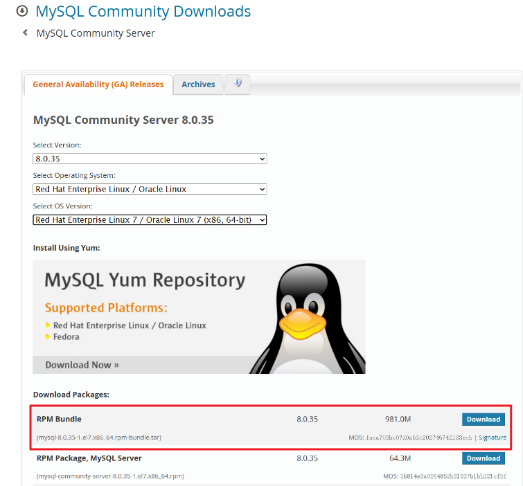

# 1 安装和升级MySQL数据库（社区版）

## 1.1 安装

学习一门数据库，肯定需要从安装开始学起，MySQL数据库常用的安装方式有：

- YUM源安装
- RPM包安装
- 二进制文件安装
- 源码安装

最常用的安装方式是RPM包安装和二进制文件安装。下面我基于`Red Hat Enterprise Linux`操作系统介绍这两种安装方法。

我个人认为MySQL数据库的安装十分友好，不像Oracle数据库那么困难，这点必须好评。很多同学在学习Oracle数据库时就被安装这个步骤反复折磨，有一部分同学便是因为一只安装不成功，从而放弃了学习Oracle数据库的想法。

### 1.1.1 RPM包安装

**一、官网下载RPM包**

RPM包的下载地址是：https://dev.mysql.com/downloads/mysql/

根据操作系统类型和版本版本选择需要下载的包，我实验的环境是：

```sql
[root@lu9up ~]# cat /etc/redhat-release
Red Hat Enterprise Linux Server release 7.9 (Maipo)
```

选择的RPM包如下，点击下载到本地：



**二、上传到操作系统**

上传的位置看个人而定

```bash
[root@mysql001 ~]# ll | grep mysql
-rw-r--r--  1 root root 1031792640 Dec 15 23:57 mysql-8.0.34-1.el7.x86_64.rpm-bundle.tar
```

**三、检查是否安装MySQL或MariaDB**

centos和redhat上一般已经安装有mariadb-libs包和/my.cnf配置文件，安装MySQL数据库前一定要删除，以免和新安装的MySQL造成冲突。

检查默认配置文件是否存在：

```bash
[root@mysql001 ~]# ll /etc/my.cnf
-rw-r--r--. 1 root root 570 Oct  1  2020 /etc/my.cnf
```

再检查是否有MySQL或者MariaDB的安装包：

```bash
[root@mysql001 ~]# rpm -qa | grep -i mysql
[root@mysql001 ~]# rpm -qa | grep -i mariadb
mariadb-libs-5.5.68-1.el7.x86_64
```

删除这些文件：

```bash
[root@mysql001 ~]# rpm -e mariadb-libs
[root@mysql001 ~]# ll /etc/my.cnf
ls: cannot access /etc/my.cnf: No such file or directory
```

删除mariadb-libs后，/etc/my.cnf也会被一并删除。

注意：如果报依赖错误，使用下面的命令删除：

```bash
rpm -e --nodeps mariadb-libs-5.5.68-1.el7.x86_64
```

卸载mariadb-libs后，my.cnf也会被一并删除。

**四、创建MySQL用户和组**

```bash
groupadd -g 27 mysql
useradd -g mysql mysql
passwd mysql
```

mysql用户添加系统权限：

```sql
[root@mysql001 ~]# vim /etc/sudoers
```

添加：

```bash
mysql     ALL=(ALL)      NOPASSWD:ALL
```

NOPASSWD是无需输入密码（个人习惯），安全起见，建议改为ALL。

**五、解压安装包**

查看安装包里包含的rpm包：

```bash
[root@mysql001 ~]# tar -tvf mysql-8.0.34-1.el7.x86_64.rpm-bundle.tar
-rw-r--r-- bteam/common 16755300 2023-06-25 11:06 mysql-community-client-8.0.34-1.el7.x86_64.rpm
-rw-r--r-- bteam/common  3745824 2023-06-25 11:06 mysql-community-client-plugins-8.0.34-1.el7.x86_64.rpm
-rw-r--r-- bteam/common   681724 2023-06-25 11:06 mysql-community-common-8.0.34-1.el7.x86_64.rpm
-rw-r--r-- bteam/common 528347988 2023-06-25 11:07 mysql-community-debuginfo-8.0.34-1.el7.x86_64.rpm
-rw-r--r-- bteam/common   1947800 2023-06-25 11:07 mysql-community-devel-8.0.34-1.el7.x86_64.rpm
-rw-r--r-- bteam/common   4217912 2023-06-25 11:07 mysql-community-embedded-compat-8.0.34-1.el7.x86_64.rpm
-rw-r--r-- bteam/common   2344364 2023-06-25 11:07 mysql-community-icu-data-files-8.0.34-1.el7.x86_64.rpm
-rw-r--r-- bteam/common   1563264 2023-06-25 11:07 mysql-community-libs-8.0.34-1.el7.x86_64.rpm
-rw-r--r-- bteam/common    685312 2023-06-25 11:08 mysql-community-libs-compat-8.0.34-1.el7.x86_64.rpm
-rw-r--r-- bteam/common  67410132 2023-06-25 11:08 mysql-community-server-8.0.34-1.el7.x86_64.rpm
-rw-r--r-- bteam/common  25637968 2023-06-25 11:08 mysql-community-server-debug-8.0.34-1.el7.x86_64.rpm
-rw-r--r-- bteam/common 378442676 2023-06-25 11:10 mysql-community-test-8.0.34-1.el7.x86_64.rpm
```

解压缩安装包：

```bash
[root@mysql001 ~]# tar -xvf mysql-8.0.34-1.el7.x86_64.rpm-bundle.tar -C /home/mysql/rpm/
mysql-community-client-8.0.34-1.el7.x86_64.rpm
mysql-community-client-plugins-8.0.34-1.el7.x86_64.rpm
mysql-community-common-8.0.34-1.el7.x86_64.rpm
mysql-community-debuginfo-8.0.34-1.el7.x86_64.rpm
mysql-community-devel-8.0.34-1.el7.x86_64.rpm
mysql-community-embedded-compat-8.0.34-1.el7.x86_64.rpm
mysql-community-icu-data-files-8.0.34-1.el7.x86_64.rpm
mysql-community-libs-8.0.34-1.el7.x86_64.rpm
mysql-community-libs-compat-8.0.34-1.el7.x86_64.rpm
mysql-community-server-8.0.34-1.el7.x86_64.rpm
mysql-community-server-debug-8.0.34-1.el7.x86_64.rpm
mysql-community-test-8.0.34-1.el7.x86_64.rpm
```

检查rpm包：

```bash
[mysql@mysql001 rpm]$ pwd
/home/mysql/rpm
[mysql@mysql001 rpm]$ ls
mysql-community-client-8.0.34-1.el7.x86_64.rpm           mysql-community-icu-data-files-8.0.34-1.el7.x86_64.rpm
mysql-community-client-plugins-8.0.34-1.el7.x86_64.rpm   mysql-community-libs-8.0.34-1.el7.x86_64.rpm
mysql-community-common-8.0.34-1.el7.x86_64.rpm           mysql-community-libs-compat-8.0.34-1.el7.x86_64.rpm
mysql-community-debuginfo-8.0.34-1.el7.x86_64.rpm        mysql-community-server-8.0.34-1.el7.x86_64.rpm
mysql-community-devel-8.0.34-1.el7.x86_64.rpm            mysql-community-server-debug-8.0.34-1.el7.x86_64.rpm
mysql-community-embedded-compat-8.0.34-1.el7.x86_64.rpm  mysql-community-test-8.0.34-1.el7.x86_64.rpm
```

**六、安装RPM包**

在大部分情况下，MySQL标准安装需要安装mysql-community-server, mysql-community-client, mysql-community-client-plugins, mysql-community-libs, mysql-community-icu-data-files, mysql-community-common, and mysql-community-libs-compat。

虽然使用如yum来安装包更好，但也可以直接用rpm -Uvh命令安装rpm包。但是，使用rpm -Uvh反而使安装过程更容易失败，因为安装过程可能会遇到潜在的依赖问题。

执行安装命令：

```sql
sudo yum -y install mysql-community-{server,client,client-plugins,icu-data-files,common,libs}-*
```

如果只安装客户端程序，可以不安装的mysql-community-server ：

```bash
sudo yum -y install mysql-community-{client,client-plugins,common,libs}-*
```

**七、初始化数据库**

安装好后，先不要启动数据库服务，因为第一次启动MySQL数据库服务时会自动初始化，可以根据自己的需求对系统参数进行修改，修改系统参数的方式为编辑默认配置文件：/etc/my.cnf。

1. datadir：是MySQL数据库系统的一个重要参数，它指定了MySQL数据库的数据文件存放的位置。这些数据文件包括了所有的数据库、表、索引等信息。默认为/var/lib/mysql，可以修改到合适的磁盘路径中，例如/disk1/data。
2. innodb_log_file_size：这个参数指定在一个日志组中，每个log的大小。innodb的logfile就是事务日志，用来在mysql crash后的恢复，所以设置合理的大小对于mysql的性能非常重要，直接影响数据库的写入速度，事务大小，异常重启后的恢复。
3. innodb_data_home_dir：用于指定InnoDB存储引擎的数据文件的基本路径。这个路径下的所有文件都是InnoDB存储引擎的数据文件，包括表空间文件、双写日志文件等。
4. innodb_log_group_home_dir：innodb_log_group_home_dir是MySQL数据库中的一个参数，用于指定InnoDB存储引擎的redo日志文件所在的目录。这些日志文件用于存储事务数据，直到这些数据被写入到表空间的磁盘文件中。默认情况下，innodb_log_group_home_dir的值通常被设置为与innodb_data_home_dir相同。innodb_data_home_dir用于指定InnoDB存储引擎的数据文件的基本路径。这个路径下的所有文件都是InnoDB存储引擎的数据文件，包括表空间文件、双写日志文件等。但是，为了获得最佳的性能，建议将innodb_data_home_dir和innodb_log_group_home_dir设置到不同的物理存储阵列上，这样可以避免IO资源的冲突，有利于服务器处理大量的高并发连接。

```bash
[mysql@mysql001 ~]$ cat /etc/my.cnf

datadir=/disk1/data
socket=/var/lib/mysql/mysql.sock

log-error=/var/log/mysqld.log
pid-file=/var/run/mysqld/mysqld.pid

innodb_log_file_size=100M
```

这里，我只调整了datadir和innodb_log_file_size参数。

参数文件准备好后，接下来可以启动mysqld服务。

**八、启动mysql服务**

```bash
[mysql@mysql001 data]$ sudo systemctl status mysqld
● mysqld.service - MySQL Server
   Loaded: loaded (/usr/lib/systemd/system/mysqld.service; enabled; vendor preset: disabled)
   Active: inactive (dead) since Sat 2023-12-16 02:18:31 CST; 6s ago
     Docs: man:mysqld(8)
           http://dev.mysql.com/doc/refman/en/using-systemd.html
  Process: 6697 ExecStart=/usr/sbin/mysqld $MYSQLD_OPTS (code=exited, status=0/SUCCESS)
  Process: 6673 ExecStartPre=/usr/bin/mysqld_pre_systemd (code=exited, status=0/SUCCESS)
 Main PID: 6697 (code=exited, status=0/SUCCESS)
   Status: "Server shutdown complete"
[mysql@mysql001 ~]$ sudo systemctl start mysqld
[mysql@mysql001 ~]$ sudo systemctl status mysqld
● mysqld.service - MySQL Server
   Loaded: loaded (/usr/lib/systemd/system/mysqld.service; enabled; vendor preset: disabled)
   Active: active (running) since Sat 2023-12-16 00:48:43 CST; 20min ago
     Docs: man:mysqld(8)
           http://dev.mysql.com/doc/refman/en/using-systemd.html
  Process: 1031 ExecStartPre=/usr/bin/mysqld_pre_systemd (code=exited, status=0/SUCCESS)
 Main PID: 1631 (mysqld)
   Status: "Server is operational"
   CGroup: /system.slice/mysqld.service
           └─1631 /usr/sbin/mysqld

Dec 16 00:48:37 mysql001 systemd[1]: Starting MySQL Server...
Dec 16 00:48:43 mysql001 systemd[1]: Started MySQL Server.
```

禁止mysqld开机自启：

```bash
[mysql@mysql001 data]$ sudo systemctl disable mysqld
```


**九、查看临时密码**

```bash
[mysql@mysql001 ~]$ sudo grep 'temporary password' /var/log/mysqld.log
2023-12-15T16:48:40.499788Z 6 [Note] [MY-010454] [Server] A temporary password is generated for root@localhost: ;eYMs-0+Lovk
```

MySQL数据库root的密码为`;eYMs-0+Lovk`，第一次登录需使用这个密码，然后再修改自定义密码。

**十、登录并修改密码**

使用临时密码登录：

```bash
[mysql@mysql001 ~]$ mysql -uroot -p';eYMs-0+Lovk'
```

修改密码：

```sql
mysql> set password = 'Mysql123.';
Query OK, 0 rows affected (0.00 sec)
```

验证：

```bash
[mysql@lu9up ~]$ mysql -uroot -pMysql123.
```

### 1.1.2 二进制文件安装

## 1.2 升级

## 1.3 卸载

```bash
[mysql@mysql002 ~]$ rpm -qa |grep -i mysql
[mysql@mysql002 ~]$ sudo yum remove mysql-community-* -y
[mysql@mysql002 ~]$ sudo rm -rf /etc/my.cnf
```

# 2 账号和权限

# 3 日志

## 3.1 错误日志

### 3.1.1 系统参数log_error_services

```sql
mysql> show variables like 'log_error_services';
+--------------------+----------------------------------------+
| Variable_name      | Value                                  |
+--------------------+----------------------------------------+
| log_error_services | log_filter_internal; log_sink_internal |
+--------------------+----------------------------------------+
1 row in set (0.00 sec)
```

非内置写组件

```sql
mysql> install component 'file://component_log_sink_syseventlog';
Query OK, 0 rows affected (0.00 sec)

mysql> select component_id,component_urn from mysql.component where component_urn like '%syseventlog%';
+--------------+---------------------------------------+
| component_id | component_urn                         |
+--------------+---------------------------------------+
|            2 | file://component_log_sink_syseventlog |
+--------------+---------------------------------------+
1 row in set (0.00 sec)
```

log_sink_syseventlog配置错误日志写入Linux系统日志:

```sql
mysql> set global log_error_services='log_filter_internal; log_sink_internal; log_sink_syseventlog';
Query OK, 0 rows affected (0.00 sec)

mysql> show variables like 'log_error_services';
+--------------------+--------------------------------------------------------------+
| Variable_name      | Value                                                        |
+--------------------+--------------------------------------------------------------+
| log_error_services | log_filter_internal; log_sink_internal; log_sink_syseventlog |
+--------------------+--------------------------------------------------------------+
1 row in set (0.01 sec)
```

### 3.1.2 log_filter_internal

```sql
mysql> show variables like 'log_error_verbosity';
+---------------------+-------+
| Variable_name       | Value |
+---------------------+-------+
| log_error_verbosity | 3     |
+---------------------+-------+
1 row in set (0.00 sec)
```

### 3.1.3 log_sink_internal

```sql
mysql> show variables like 'log_error';
+---------------+---------------------+
| Variable_name | Value               |
+---------------+---------------------+
| log_error     | /var/log/mysqld.log |
+---------------+---------------------+
1 row in set (0.00 sec)
```

### 3.1.4 log_filter_diagmet组件

### 3.1.5 log_sink_json组件

### 3.1.6 log_sink_syseventlog组件

```sql
mysql> show variables like '%syseventlog%';
+-------------------------+--------+
| Variable_name           | Value  |
+-------------------------+--------+
| syseventlog.facility    | daemon |
| syseventlog.include_pid | ON     |
| syseventlog.tag         |        |
+-------------------------+--------+
3 rows in set (0.01 sec)
```

### 3.1.7 系统参数 log_timestamps

```sql

```

### 3.1.8 备份错误日志

```bash
[mysql@mysql001 data]$ sudo mv error.log error.log.bak231220
[sudo] password for mysql:
[mysql@mysql001 data]$ mysqladmin -uroot -pMysql123. flush-logs
mysqladmin: [Warning] Using a password on the command line interface can be insecure.
```

### 3.1.9 错误日志记录到数据库中

```sql
mysql> show status like 'error_log%';
+---------------------------+------------------+
| Variable_name             | Value            |
+---------------------------+------------------+
| Error_log_buffered_bytes  | 74336            |
| Error_log_buffered_events | 608              |
| Error_log_expired_events  | 0                |
| Error_log_latest_write    | 1702991680174494 |
+---------------------------+------------------+
4 rows in set (0.00 sec)

mysql> select * from performance_schema.error_log limit 4\G
*************************** 1. row ***************************
    LOGGED: 2023-12-16 00:48:37.870328
 THREAD_ID: 0
      PRIO: System
ERROR_CODE: MY-013169
 SUBSYSTEM: Server
      DATA: /usr/sbin/mysqld (mysqld 8.0.34) initializing of server in progress as process 1120
```

## 3.2 通用查询日志

记录客户端操作日志，包括连接断开信息，发送的sql。

### 3.2.1 系统参数说明

**一、log_output**

```sql
mysql> set global log_output='table,file';
Query OK, 0 rows affected (0.00 sec)

mysql> show variables like 'log_output';
+---------------+------------+
| Variable_name | Value      |
+---------------+------------+
| log_output    | FILE,TABLE |
+---------------+------------+
1 row in set (0.00 sec)
```

**二、general_log**

```sql
mysql> set global general_log=on;
Query OK, 0 rows affected (0.00 sec)

mysql> show variables like 'general_log';
+---------------+-------+
| Variable_name | Value |
+---------------+-------+
| general_log   | ON    |
+---------------+-------+
1 row in set (0.00 sec)
```

**三、general_log_file**

```sql
mysql> show variables like 'general_log_file';
+------------------+--------------------------+
| Variable_name    | Value                    |
+------------------+--------------------------+
| general_log_file | /disk1/data/mysql001.log |
+------------------+--------------------------+
1 row in set (0.00 sec)
```

**四、sql_log_off**

### 3.2.2 通用查询日志记录的内容

**一、通用查询日志文件中的记录**

**二、通用查询日志表中的记录**

mysql.general_log的定义：

```sql
mysql> show create table mysql.general_log\G
*************************** 1. row ***************************
       Table: general_log
Create Table: CREATE TABLE `general_log` (
  `event_time` timestamp(6) NOT NULL DEFAULT CURRENT_TIMESTAMP(6) ON UPDATE CURRENT_TIMESTAMP(6),
  `user_host` mediumtext NOT NULL,
  `thread_id` bigint unsigned NOT NULL,
  `server_id` int unsigned NOT NULL,
  `command_type` varchar(64) NOT NULL,
  `argument` mediumblob NOT NULL
) ENGINE=CSV DEFAULT CHARSET=utf8mb3 COMMENT='General log'
1 row in set (0.00 sec)
```

```sql
mysql> select event_time,user_host,thread_id,server_id,command_type,convert(argument using utf8mb4) argument
    ->   from mysql.general_log
    ->  where thread_id = 12 order by event_time desc\G
*************************** 1. row ***************************
  event_time: 2023-12-20 00:13:40.560415
   user_host: root[root] @ localhost []
   thread_id: 12
   server_id: 1
command_type: Query
    argument: select event_time,user_host,thread_id,server_id,command_type,convert(argument using utf8mb4) argument
  from mysql.general_log
 where thread_id = 12 order by event_time desc
*************************** 2. row ***************************
  event_time: 2023-12-20 00:13:07.265893
   user_host: root[root] @ localhost []
   thread_id: 12
   server_id: 1
command_type: Query
    argument: select event_time,user_host,thread_id,server_id,command_type,convert(argument using utf8mb4) argument
  from mysql.general_log
 where thread_id = 12 order by event_time desc
```

## 3.3 慢查询日志

慢速查询日志记录的是执行时间超过[long_query_time]()秒和检查的行数超过[min_examined_row_limit]()的SQL语句，这些语句通常是需要进行优化的。

官方参考文档：https://dev.mysql.com/doc/refman/8.0/en/slow-query-log.html

### 3.3.1 慢查询日志的配置参数

服务器使用以下顺序的控制参数来决定是否将查询语句写入慢查询日志：

1. 查询必须不是管理语句（如alter、optimize table等），或者必须启用log_slow_admin_statements参数记录管理类语句；
2. 查询必须至少花费了long_query_time秒，或者必须启用log_queries_not_using_indexes，并且查询的索引没有行限制（如全表扫描、索引全扫描等）；
3. 查询必须至少检索了min_examined_row_limit行；
4. 不被参数log_throttle_queries_not_using_indexes设置阈值限制写入慢sql日志。

下面介绍这些参数：

**一、long_query_time**

规定了查询时间超过此参数值被定义为慢SQL，状态变量Slow_queries记录了慢查询SQL的数量。long_query_time的单位为秒，可以设置成小数，精确到微妙。最小值为0，最大值为31536000，即365天，默认值为10。

查看当前设置：

```sql
mysql> show variables like 'long_query_time';
+-----------------+-----------+
| Variable_name   | Value     |
+-----------------+-----------+
| long_query_time | 10.000000 |
+-----------------+-----------+
1 row in set (0.01 sec)
```

查看慢sql数量：

```sql
mysql> show status like 'slow_queries';
+---------------+-------+
| Variable_name | Value |
+---------------+-------+
| Slow_queries  | 5     |
+---------------+-------+
1 row in set (0.01 sec)

```

将此参数设置为5：

```sql
mysql> set long_query_time=5;
Query OK, 0 rows affected (0.00 sec)

mysql> show variables like 'long_query_time';
+-----------------+----------+
| Variable_name   | Value    |
+-----------------+----------+
| long_query_time | 5.000000 |
+-----------------+----------+
1 row in set (0.00 sec)

```

**二、slow_query_log**

此参数决定是否激活慢sql日志，默认值是off，即关闭。

启用慢查询日志：

```sql
mysql> set global slow_query_log=on;
Query OK, 0 rows affected (0.00 sec)
```

**三、slow_query_log_file**

此参数指定慢sql日志的文件路径和文件名，默认位置在数据目录datadir中，默认文件名是hostname-slow.log。

```sql
mysql> show variables like 'slow_query_log_file';
+---------------------+-------------------------------+
| Variable_name       | Value                         |
+---------------------+-------------------------------+
| slow_query_log_file | /disk1/data/mysql001-slow.log |
+---------------------+-------------------------------+
1 row in set (0.00 sec)
```

查看慢sql日志文件：

```bash
[mysql@mysql001 log]$ tailf /disk1/data/mysql001-slow.log
/usr/sbin/mysqld, Version: 8.0.34 (MySQL Community Server - GPL). started with:
Tcp port: 3306  Unix socket: /var/lib/mysql/mysql.sock
Time                 Id Command    Argument
# Time: 2023-12-20T22:44:21.890879+08:00
# User@Host: root[root] @ localhost []  Id:     9
# Query_time: 0.009038  Lock_time: 0.000008 Rows_sent: 0  Rows_examined: 0 Thread_id: 9 Errno: 0 Killed: 0 Bytes_received: 286 Bytes_sent: 92 Read_first: 0 Read_last: 0 Read_key: 12 Read_next: 0 Read_prev: 0 Read_rnd: 0 Read_rnd_next: 1 Sort_merge_passes: 0 Sort_range_count: 0 Sort_rows: 0 Sort_scan_count: 1 Created_tmp_disk_tables: 0 Created_tmp_tables: 1 Start: 2023-12-20T22:44:21.881841+08:00 End: 2023-12-20T22:44:21.890879+08:00
SET timestamp=1703083461;
select f.title, count(*) as cnt
  from sakila.rental r
  join sakila.inventory i
    on r.inventory_id = i.inventory_id
  join sakila.film f
    on i.film_id = f.film_id
 where r.rental_date between '2005-03-01' and '2005-03-31'
 group by f.film_id
 order by cnt desc
 limit 10;
 ```

**四、log_queries_not_using_indexes**

启用该变量，会记录期望检索所有行的查询语句，也就是说做表全扫描。使用索引的查询也会被记录。例如，使用完整索引扫描的查询使用索引，但会记录日志，因为索引不会限制行数。默认值是false。


**五、min_examined_row_limit**

参数规定了只有当检索的行数超过了参数值的sql语句才会被记录到慢sql日志文件中，默认值是0，没有限制。可以和上一个参数`log_queries_not_using_indexes`搭配使用，可以避免记录一些访问小表的查询。


**六、log_throttle_queries_not_using_indexes**

该参数限制每分钟记录到慢查询日志中的查询语句数量，默认值是0，不限制。

**七、log_slow_extra**

参数log_slow_extra从MySQL 8.0.14开始可用，当启用时，将记录与慢sql相关的额外信息，如状态参数Handler_%。参数默认值为off，建议打开，将参数设置为on。

```sql
mysql> set global log_slow_extra=on;
Query OK, 0 rows affected (0.00 sec)
```

### 3.3.2 使用mysqldumpslow解释慢查询日志

MySQL慢速查询日志包含执行时间较长的查询信息，且包含的记录较多时，看起来比较困难。可以使用mysqldumpslow解析MySQL慢速查询日志文件，并总结日志内容。

**一、摘要分析**

mysqldumpslow会对查询进行摘要分析，8.0版本新添的两个分析摘要函数如下：

1. statement_digest_text()：返回摘要文本；
2. statement_digest()：返回摘要hashvalue。

用法如下：

```sql
mysql> select statement_digest_text("select user(),host from mysql.user where user = 'lu9up'");
+----------------------------------------------------------------------------------+
| statement_digest_text("select user(),host from mysql.user where user = 'lu9up'") |
+----------------------------------------------------------------------------------+
| SELECT SYSTEM_USER ( ) , HOST FROM `mysql` . `user` WHERE SYSTEM_USER = ?        |
+----------------------------------------------------------------------------------+
1 row in set (0.00 sec)

mysql> select statement_digest("select user(),host from mysql.user where user = 'lu9up'");
+-----------------------------------------------------------------------------+
| statement_digest("select user(),host from mysql.user where user = 'lu9up'") |
+-----------------------------------------------------------------------------+
| 12984e6ff7cbdbd28e2a377375af873fcd606891f82c670a74c04db83f7ac09c            |
+-----------------------------------------------------------------------------+
1 row in set (0.00 sec)
```

**二、mysqldumpslow操作**

调用语法：

```bash
mysqldumpslow [options] [log_file ...]
```

options：


`-s`指定排序方式，默认是at，根据平均时间排序，共有七种排序方式：


**mysqldumpslow操作示例**：

使用mysqldumpslow对慢查询日志文件进行分析，输出平均执行时间最久的两条查询：

```bash
[mysql@mysql001 ~]$ mysqldumpslow -s at -t 2 /disk1/data/mysql001-slow.log

Reading mysql slow query log from /disk1/data/mysql001-slow.log
Count: 1  Time=0.01s (0s)  Lock=0.00s (0s)  Rows=0.0 (0), root[root]@localhost
  select f.title, count(*) as cnt
  from sakila.rental r
  join sakila.inventory i
  on r.inventory_id = i.inventory_id
  join sakila.film f
  on i.film_id = f.film_id
  where r.rental_date between 'S' and 'S'
  group by f.film_id
  order by cnt desc
  limit N

Count: 8  Time=0.00s (0s)  Lock=0.00s (0s)  Rows=4.9 (39), root[root]@localhost
  show variables like 'S'

```

### 3.3.3 使用pt-query-digest解析慢查询日志

pt-query-digest是Percona Toolkit的一个工具，用于分析MySQL的慢查询日志文件、通用查询日志文件和二进制日志文件中的查询，也可以分析SHOW PROCESSLIST命令输出的结果和tcpdump抓取的MySQL协议数据（如：网络流量包）。默认情况下，对所有分析的查询按摘要分组，分析结果按查询时间降序输出。

官方参考文档：https://docs.percona.com/percona-toolkit/pt-query-digest.html

#### 3.3.3.1 安装pt-query-digest

**一、下载Percona Toolkit：**

```bash
[mysql@mysql001 ~]$ wget percona.com/get/pt-query-digest
```

**二、赋权**

```bash
[mysql@mysql001 ~]$ chmod +775 pt-query-digest
```

完成赋权后就可以正常使用了。

#### 3.3.3.2 语法和选项

语法：

```bash
pt-query-digest [OPTIONS] [FILES] [DSN]
```

选项：

| optition name | comment |
| - | - |
| --ask-pass | 连接MySQL时提示输入密码。 |
| --continue-on-error | 即使出现错误，也要继续解析，默认值时yes。该工具不会永远继续:一旦任何进程导致100个错误，它就会停止。 |
| --create-review-table | 使用--review选项将分析结果输出到表中时，如果表不存在，创建它，默认值是yes。 |
| --create-history-table | 使用--history选项将分析结果输出到表中时，如果表不存在，创建它，默认值是yes。 |
| --defaults-file | 指定mysql的参数文件名，必须给出一个绝对路径名。 |
| --explain | 使用此DSN对示例查询运行EXPLAIN并打印结果。 |
| --filter | 该选项是一个Perl代码字符串或包含Perl代码的文件，使用此参数对要分析的文件进行过滤后再分析，将不符合Perl代码的时间全部忽略。 |
|  --review | 保存分析结果到表中，有重复的查询在表中时，不会再记录。只保存分析过的sql语句，不包含分析结果。 |
| --history | 保存分析结果到表中，有重复的查询在表中时，也会记录，但时间不一样。与review不同，不仅保存分析的sql语句，也包含分析结果。 |
| --limit | 将输出限制为给定的百分比或SQL语句数量。 |
|  --max-line-length | 把输出行的长度修剪到这个长度，0表示不裁剪。 |
|  --order-by | 按此属性和聚合函数对事件进行排序，默认为Query_time:sum。 |
|  --output | 指定分析结果的输出格式。 |
|  --since | 指定分析从什么时间开始的sql语句。 |
|  --until | 指定分析的sql语句的截至时间。 |
|  --type | 指定日志文件的类型，可以是genlog、binlog、slowlog、tcpdump、rawlog等。 |

选项的具体使用细则参考官方文档：https://docs.percona.com/percona-toolkit/pt-query-digest.html#options


#### 3.3.3.3 用法示例

1）直接分析慢查询文件

```bash
[mysql@mysql001 output]$ pt-query-digest /disk1/data/mysql001-slow.log > slow`date +"%Y%m%d"`.log
[mysql@mysql001 output]$ ll
total 20
-rw-rw-r-- 1 mysql mysql 17819 Dec 20 22:51 slow20231220.log
```

2）分析网络流量包

从3306端口抓取1000个流量包输出到文件mysql.tcp.txt：

```bash
tcpdump -s 65535 -x -nn -q -tttt -i any -c 1000 port 3306 > mysql.tcp.txt
```

分析抓取的网路流量包：

```bash
pt-query-digest --type tcpdump mysql.tcp.txt> slow_report9.log
```

3）分析pocesslist的输出

```bash
pt-query-digest --processlist h = host1
```

4）保存分析过的sql语句到表中

```bash
pt-query-digest --review h=192.168.131.99 --no-report mysql001-slow.log
```

默认保存的表是percona_schema.query_review。


5）保存分析结果到表中

```bash
pt-query-digest --history h=192.168.131.99 --no-report mysql001-slow.log
```

默认保存的表是percona_schema.query_history。


## 3.4 二进制日志

### 3.4.1 概述

记录数据库的变更（DDL, DML, DCL）。记录的单位是事件，一个会话可以包含多个事件。在MySQl8.0版本开始，默认是开启二进制日志的。

二进制日志文件十分重要，有以下两个用途：

- **复制**：主从复制，将主服务器的二进制日志发送到从服务器上，并将这些事件应用到从服务器上，实现主从服务器数据同步。
- **数据恢复**：在恢复全量备份后，在应用二进制日志中的事件使数据库前滚，是增量恢复或时间点恢复。

二进制日志文件的三种格式：

- **语句模式（STATEMENT）**：记录每条执行数据修改的sql语句，产生的日志文件较小。记录的非确定语句（now(),uuid()函数）在复制或恢复时有可能会出错。
- **行模式（ROW）**：默认模式，不记录sql语句，仅记录被修改的记录及其被如何修改的信息，日志文件可能会比较大。能避免语句模式记录的非确定语句（now(),uuid()函数）带来的不确定性错误。
- **混合模式（MIXED）**：默认采用语句模式，遇到非确定sql语句时采用行模式。

```sql
mysql> show variables like 'binlog_format';
+---------------+-------+
| Variable_name | Value |
+---------------+-------+
| binlog_format | ROW   |
+---------------+-------+
1 row in set (0.00 sec)
```

### 3.4.2 系统参数

**一、log_bin**

```bash
[mysql@mysql001 data]$ sudo vim /etc/my.cnf
添加：
log_bin=/disk1/data/binlog/binlog

mysql> show variables like '%log_bin%';
+---------------------------------+---------------------------------+
| Variable_name                   | Value                           |
+---------------------------------+---------------------------------+
| log_bin                         | ON                              |
| log_bin_basename                | /disk1/data/binlog/binlog       |
| log_bin_index                   | /disk1/data/binlog/binlog.index |
| log_bin_trust_function_creators | OFF                             |
| log_bin_use_v1_row_events       | OFF                             |
| sql_log_bin                     | ON                              |
+---------------------------------+---------------------------------+
6 rows in set (0.00 sec)
```

查看binlog：

```sql
mysql> purge binary logs to 'binlog.000040';
Query OK, 0 rows affected (0.01 sec)

mysql> show binary logs;
+---------------+-----------+-----------+
| Log_name      | File_size | Encrypted |
+---------------+-----------+-----------+
| binlog.000040 |         0 | No        |
| binlog.000041 |         0 | No        |
| binlog.000042 |       157 | No        |
+---------------+-----------+-----------+
3 rows in set (0.00 sec)
```

# 4 安全

# 5 information_schema数据库

查看所有数据库容量大小:

```sql
select table_schema,count(*) tables,
	   sum(table_rows) as table_rows,
	   concat(sum(round(data_length/1024/1024, 2)),'m') as data,
	   concat(sum(round(index_length/1024/1024, 2)),'m') as idx,
	   concat(sum(round((data_length+index_length)/1024/1024, 2)),'m') as  total
  from information_schema.tables
 group by table_schema
 order by sum(data_length) desc, sum(index_length) desc;

+--------------------+--------+------------+-------+-------+-------+
| TABLE_SCHEMA       | tables | table_rows | data  | idx   | total |
+--------------------+--------+------------+-------+-------+-------+
| sakila             |     23 |      48099 | 4.20m | 2.31m | 6.49m |
| mysql              |     38 |       4276 | 2.47m | 0.36m | 2.75m |
| sys                |    101 |          6 | 0.02m | 0.00m | 0.02m |
| information_schema |     79 |          0 | 0.00m | 0.00m | 0.00m |
| performance_schema |    111 |    2962186 | 0.00m | 0.00m | 0.00m |
+--------------------+--------+------------+-------+-------+-------+
5 rows in set (0.01 sec)
```

查看某数据库下最大的十个表：

```sql
select table_schema,table_name,table_rows,
       concat(round(data_length/1024/1024, 2),'m') data_length,
       concat(round(index_length/1024/1024, 2),'m') index_length,
       concat(round((data_length+index_length)/1024/1024,2),'m') total
  from information_schema.tables
 where table_schema = 'sakila'
 order by (data_length+index_length) desc
 limit 10;
+--------------+---------------+------------+-------------+--------------+-------+
| TABLE_SCHEMA | TABLE_NAME    | TABLE_ROWS | data_length | index_length | total |
+--------------+---------------+------------+-------------+--------------+-------+
| sakila       | rental        |      16419 | 1.52m       | 1.14m        | 2.66m |
| sakila       | payment       |      16500 | 1.52m       | 0.61m        | 2.13m |
| sakila       | inventory     |       4581 | 0.17m       | 0.19m        | 0.36m |
| sakila       | film          |       1000 | 0.19m       | 0.08m        | 0.27m |
| sakila       | film_actor    |       5462 | 0.19m       | 0.08m        | 0.27m |
| sakila       | film_text     |       1000 | 0.17m       | 0.02m        | 0.19m |
| sakila       | customer      |        599 | 0.08m       | 0.05m        | 0.13m |
| sakila       | address       |        603 | 0.09m       | 0.02m        | 0.11m |
| sakila       | staff         |          2 | 0.06m       | 0.03m        | 0.09m |
| sakila       | film_category |       1000 | 0.06m       | 0.02m        | 0.08m |
+--------------+---------------+------------+-------------+--------------+-------+
10 rows in set (0.01 sec)
```

查看非InnoDB引擎的业务表：

```sql
select table_name,table_schema,engine 
  from information_schema.tables
 where engine!='innodb' 
   and table_schema not in('mysql','information_schema','performance_schema'); 
```

查看没有主键或唯一索引的表：

```sql
select t.table_schema,
       t.table_name
  from information_schema.tables t
 inner join information_schema.columns c 
	on t.table_schema = c.table_schema
   and t.table_name = c.table_name
 where t.table_schema not in('mysql','information_schema','performance_schema')
   and c.table_type = 'base table'
group by t.table_schema,t.table_name
having group_concat(colums_key) not regexp 'pri|uni';
```

# 6 performance_schema数据库

## 6.7 用例

### 6.7.1 监控sql语句的执行性能


```sql
select thread_id,event_name,source,sys.format_time(timer_wait),sys.format_time(lock_time),
	   sql_text,current_schema,message_text,rows_affected,rows_sent,rows_examined
  from performance_schema.events_statements_history
 where current_schema != 'performance_schema'
 order by timer_wait desc limit 3\G
 ```

# 8 逻辑备份

## 8.1 逻辑备份和物理备份的区别

## 8.2 mysqldump

### 8.2.1 语法

### 8.2.2 options

### 8.2.3 常见用法

**一、以SQL格式备份**

```sql
[mysql@mysql001 bak]$ mysqldump sakila > sakila.bak20240101.sql
[mysql@mysql001 bak]$ mysqldump sakila actor > sakila_actor.bak20240101.sql
[mysql@mysql001 bak]$ mysqldump --all-databases --routines --events > all_databases.bak20240101.sql
[mysql@mysql001 bak]$ mysqldump --all-databases --master-data --single-transation > all_databases2.bak20240101.sql
[mysql@mysql001 bak]$ mysqldump --databases sakila --skip-add-drop-table --no-create-info --replace > to_test20240101.sql
```

**二、带分隔符文本备份**

```sql
mysql> show variables like 'secure_file_priv';
+------------------+-----------------------+
| Variable_name    | Value                 |
+------------------+-----------------------+
| secure_file_priv | /var/lib/mysql-files/ |
+------------------+-----------------------+
1 row in set (0.00 sec)

mysql> quit
Bye
[mysql@mysql001 bak]$ mysqldump --tab=/var/lib/mysql-files/ sakila
[mysql@mysql001 full]$ ls /var/lib/mysql-files/
actor_info.sql  category.sql  country.txt        film_actor.txt     film_text.sql  language.sql                    rental.sql                  staff.sql
actor.sql       category.txt  customer_list.sql  film_category.sql  film_text.txt  language.txt                    rental.txt                  staff.txt
actor.txt       city.sql      customer.sql       film_category.txt  film.txt       nicer_but_slower_film_list.sql  sales_by_film_category.sql  store.sql
address.sql     city.txt      customer.txt       film_list.sql      inventory.sql  payment.sql                     sales_by_store.sql          store.txt
address.txt     country.sql   film_actor.sql     film.sql           inventory.txt  payment.txt                     staff_list.sql
```

**三、修改备份文件的对象名**

```sql
[mysql@mysql001 bak]$ sed -i 's/'actor'/'newactor'/g' sakila.sql
```

### 8.2.4 恢复

**一、以SQL格式备份**

```sql
[mysql@mysql001 bak]$ mysql sakila < sakila_actor.bak20240101.sql
```

**二、带分隔符文本备份**

```sql
[mysql@mysql001 mysql-files]$ cd /var/lib/mysql-files/
[mysql@mysql001 mysql-files]$ mysql sakila < actor.sql
[mysql@mysql001 mysql-files]$ mysqlimport sakila /var/lib/mysql-files/actor.txt
```


## 8.3 mysqlpump

### 8.3.1 并行备份

```sql
[mysql@mysql001 ~]$ mysqlpump --parallel-schemas=4:sakila > /disk1/bak/sakila1.bak20230101.sql
```

### 8.3.3 过滤选项

### 8.3.4 备份用户

```sql
[mysql@mysql001 ~]$ mysqlpump --exclude-databases=% --users > /disk1/bak/users.bak20230101.sql
[mysql@mysql001 ~]$ mysqlpump --exclude-databases=% --include-users=lu9up --users > /disk1/bak/lu9up.bak20230101.sql
[mysql@mysql001 ~]$ mysqlpump --exclude-databases=% --exclude-users=root --users > /disk1/bak/users_exclud_root.bak20230101.sql
```

## 8.4 mydumper

https://github.com/mydumper/mydumper

- Parallelism (hence, speed) and performance (avoids expensive character set conversion routines, efficient code overall)
- Easier to manage output (separate files for tables, dump metadata, etc, easy to view/parse data)
- Consistency - maintains snapshot across all threads, provides accurate master and slave log positions, etc
- Manageability - supports PCRE for specifying database and tables inclusions and exclusions

### 8.4.1 安装

**一、安装mydumper**

```bash
[mysql@mysql001 mydumper]$ release=$(curl -Ls -o /dev/null -w %{url_effective} https://github.com/mydumper/mydumper/releases/latest | cut -d'/' -f8)
[mysql@mysql001 mydumper]$ sudo yum install -y https://github.com/mydumper/mydumper/releases/download/${release}/mydumper-${release:1}.el7.x86_64.rpm
```

MyDumper is a MySQL Logical Backup Tool. It has 2 tools:

- mydumper which is responsible to export a consistent backup of MySQL databases
- myloader reads the backup from mydumper, connects the to destination database and imports the backup.

**二、安装依赖软件**

```bash
[mysql@mysql001 mydumper]$ sudo yum install -y cmake gcc gcc-c++ git make
[mysql@mysql001 mydumper]$ sudo yum install -y glib2-devel openssl-devel pcre-devel zlib-devel libzstd-devel
```

### 8.4.2 使用

**备份：**

```sql
[mysql@mysql001 sakila]$ mydumper -u root -p Mysql123. -P 3306 -h localhost -B sakila -o /disk1/bak/sakila/
[mysql@mysql001 sakila]$ ls
metadata                              sakila.film.00000.sql                              sakila.payment-schema.sql
sakila.actor.00000.sql                sakila.film_actor.00000.sql                        sakila.rental.00000.sql
sakila.actor_info-schema.sql          sakila.film_actor-schema.sql                       sakila.rental-schema.sql
sakila.actor_info-schema-view.sql     sakila.film_category.00000.sql                     sakila.sales_by_film_category-schema.sql
sakila.actor-schema.sql               sakila.film_category-schema.sql                    sakila.sales_by_film_category-schema-view.sql
sakila.address.00000.sql              sakila.film_list-schema.sql                        sakila.sales_by_store-schema.sql
sakila.address-schema.sql             sakila.film_list-schema-view.sql                   sakila.sales_by_store-schema-view.sql
sakila.category.00000.sql             sakila.film-schema.sql                             sakila-schema-create.sql
sakila.category-schema.sql            sakila.film_text.00000.sql                         sakila-schema-triggers.sql
sakila.city.00000.sql                 sakila.film_text-schema.sql                        sakila.staff.00000.sql
sakila.city-schema.sql                sakila.inventory.00000.sql                         sakila.staff_list-schema.sql
sakila.country.00000.sql              sakila.inventory-schema.sql                        sakila.staff_list-schema-view.sql
sakila.country-schema.sql             sakila.language.00000.sql                          sakila.staff-schema.sql
sakila.customer.00000.sql             sakila.language-schema.sql                         sakila.store.00000.sql
sakila.customer_list-schema.sql       sakila.nicer_but_slower_film_list-schema.sql       sakila.store-schema.sql
sakila.customer_list-schema-view.sql  sakila.nicer_but_slower_film_list-schema-view.sql
sakila.customer-schema.sql            sakila.payment.00000.sql
```

**恢复**

```sql
[mysql@mysql001 sakila]$ myloader -u root -p Mysql123. -P 3306 -h localhost  -B sakila -d /disk1/bak/sakila/
```

### 8.4.3 并行和一致性

```sql
[mysql@mysql001 ls_sakila]$ mydumper -u root -p Mysql123. -P 3306 -h localhost -B sakila -T sakila.actor -t 8 --rows=10000 --trx-consistency-only -o /disk1/bak/ls_sakila
[mysql@mysql001 ls_sakila]$ mydumper -u root -p Mysql123. -P 3306 -h localhost -B sakila -T sakila.actor -t 8 --chunk-filesize 4 --trx-consistency-only -o /disk1/bak/ls_sakila
```

### 8.4.4 How to exclude (or include) databases?

Once can use --regex functionality, for example not to dump mysql and test databases:

```sql
mydumper --regex '^(?!(mysql\.|test\.))'

```

To dump only mysql and test databases:

```sql
mydumper --regex '^(mysql\.|test\.)'
```
To not dump all databases starting with test:

```sql
mydumper --regex '^(?!(test))'
```

To dump specify tables in different databases (Note: The name of tables should end with $. related issue):

```sql
mydumper --regex '^(db1\.table1$|db2\.table2$)'
```

If you want to dump a couple of databases but discard some tables, you can do:

```sql
mydumper --regex '^(?=(?:(db1\.|db2\.)))(?!(?:(db1\.table1$|db2\.table2$)))'
```

Which will dump all the tables in db1 and db2 but it will exclude db1.table1 and db2.table2
Of course, regex functionality can be used to describe pretty much any list of tables.

# 9 Percona XtraBackup

## 9.1 Percona XtraBackup介绍

Percona XtraBackup是一个开源的MySQL热备份实用工具，用于执行MySQL的InnoDB和XtraDB数据库的非阻塞备份。

无论是24x7高负载服务器还是低事务量环境，Percona XtraBackup都能高效地进行热备份，而不会影响业务可用性和占用过多的数据库资源以及服务器性能。

Percona XtraBackup有以下优势：

- 免费和开源；
- 备份效率高，十分安全可靠；
- 备份不会阻塞事务；
- 不会占用过多的磁盘空间和网络带宽（可压缩）；
- 自动备份验证；
- 恢复时间快
- 支持流、压缩和增量MySQL备份。

官方参考文档：[https://docs.percona.com/percona-xtrabackup/8.0/about-xtrabackup.html](https://docs.percona.com/percona-xtrabackup/8.0/about-xtrabackup.html)

## 9.2 安装Percona XtraBackup

**注意**：下载前先确认自己的服务器和数据库的版本信息，根据实际情况下载相应的版本。

手动下载地址：[https://www.percona.com/downloads](https://www.percona.com/downloads)


### 9.2.1 rpm包安装方式

**一、使用YUM下载方式，下载RPM包**：

```bash
[root@mysql001 xtrabackup]$ sudo yum install https://repo.percona.com/yum/percona-release-latest.noarch.rpm
```

**二、启用percona库**：

```bash
[mysql@mysql001 ~]$ sudo percona-release enable-only tools release
```

**三、依赖包下载**

```bash
[mysql@mysql001 ~]$ sudo yum install lz4 zstd
```

**三、安装**

```bash
[mysql@mysql001 ~]$ sudo yum install percona-xtrabackup-80
```

**四、检查**

```bash
[mysql@mysql001 ~]$ xtrabackup --version
xtrabackup: recognized server arguments: --datadir=/disk1/data --log_bin=/disk1/data/binlog/binlog --innodb_log_file_size=100M
xtrabackup version 8.0.22-15 based on MySQL server 8.0.22 Linux (x86_64) (revision id: fea8a0e)
```

**四、卸载**

如果版本不可用，需要卸载重装，卸载脚本如下：

```bash
[mysql@mysql001 ~]$ yum list | grep percona
[mysql@mysql001 ~]$ yum remove percona-xtrabackup-80.x86_64
```

### 9.2.2 tar包安装

tar包下载要选择的服务器版本是LINUX-GENERIC:


```bash
#解压：
[mysql@mysql001 xtrabackup]$ tar xvf percona-xtrabackup-8.0.34-29-Linux-x86_64.glibc2.17-minimal.tar.gz

#简化路径：
[mysql@mysql001 xtrabackup]$ mv percona-xtrabackup-8.0.34-29-Linux-x86_64.glibc2.17-minimal xtrabackup
[mysql@mysql001 xtrabackup]$ cd xtrabackup

#安装依赖包：
[mysql@mysql001 xtrabackup]$ sudo yum install -y perl-Digest-MD5 perl-DBD-MySQL libev

#bin目录，可执行文件
[mysql@mysql001 bin]$ cd /home/mysql/tools/xtrabackup/xtrabackup/bin/
[mysql@mysql001 bin]$ pwd
/home/mysql/tools/xtrabackup/xtrabackup/bin

#添加环境变量
[mysql@mysql001 bin]$ sudo vim /etc/profile
添加：
export XTRABACKUP_HOME=/home/mysql/tools/xtrabackup/xtrabackup
export PATH=$PATH:$HOME/bin:$XTRABACKUP_HOME/bin

#环境变量生效
[mysql@mysql001 bin]$ source /etc/profile

#检查，包含版本号、数据路径等信息
[mysql@mysql001 ~]$ xtrabackup --version
2024-01-04T01:31:22.623365+08:00 0 [Note] [MY-011825] [Xtrabackup] recognized server arguments: --datadir=/disk1/data --log_bin=/disk1/data/binlog/binlog --innodb_log_file_size=100M
xtrabackup version 8.0.34-29 based on MySQL server 8.0.34 Linux (x86_64) (revision id: 5ba706ee)
```

## 9.3 使用Percona XtraBackup

XtraBackup的备份恢复过程可以分为备份、准备（prepare）和恢复（restore）三个阶段。

在备份阶段，XtraBackup会复制InnoDB的数据文件，同时记录redo日志的变化。这个过程分为两个阶段，首先是备份redo日志文件，然后是复制InnoDB的数据文件。在备份数据文件时，XtraBackup会检测每个表空间中每个页的LSN（Log Sequence Number），如果LSN大于上次备份时的LSN，则备份该页。同时，XtraBackup还会记录当前检查点的LSN，以确保只备份自上次备份以来发生更改的数据页。

在准备阶段，XtraBackup的主要工作是通过回滚未提交的事务及同步已经提交的事务至数据文件来使数据文件达到一致性状态。这个过程类似于InnoDB的实例恢复。

在恢复阶段，XtraBackup会启动一个内嵌的InnoDB实例，然后回放xtrabackup日志（xtrabackup_log），将提交的事务信息变更应用到InnoDB数据/表空间，同时回滚未提交的事务。

### 9.3.1 备份

**全量备份**

```bash
[mysql@mysql001 full]$ xtrabackup --user=root --password=Mysql123. --backup --parallel=8 --target-dir=/disk1/bak/full

[mysql@mysql001 full]$ ls /disk1/bak/full/
backup-my.cnf  binlog.index    ibdata1  mysql.ibd           sakila  undo_001  xtrabackup_binlog_info  xtrabackup_info     xtrabackup_tablespaces
binlog.000045  ib_buffer_pool  mysql    performance_schema  sys     undo_002  xtrabackup_checkpoints  xtrabackup_logfile
```


**增量备份**

一、在上面"--target-dir=/disk1/bak/full"全量备份的基础上进行增量备份：

```bash
[mysql@mysql001 bak]$ xtrabackup --user=root --password=Mysql123. --backup --parallel=8 --target-dir=/disk1/bak/inc --incremental-basedir=/disk1/bak/full

[mysql@mysql001 inc]$ ls /disk1/bak/inc/
backup-my.cnf  ib_buffer_pool  mysql            performance_schema  undo_001.delta  undo_002.meta           xtrabackup_info
binlog.000046  ibdata1.delta   mysql.ibd.delta  sakila              undo_001.meta   xtrabackup_binlog_info  xtrabackup_logfile
binlog.index   ibdata1.meta    mysql.ibd.meta   sys                 undo_002.delta  xtrabackup_checkpoints  xtrabackup_tablespaces
```

以delta结尾的文件，是记录原文件变化的数据。

二、在上面"--target-dir=/disk1/bak/inc --incremental-basedir=/disk1/bak/full"增量备份的基础上再进行增量备份：

```bash
[mysql@mysql001 inc1]$ xtrabackup --user=root --password=Mysql123. --backup --parallel=8 --target-dir=/disk1/bak/inc1 --incremental-basedir=/disk1/bak/inc

[mysql@mysql001 inc1]$ ls /disk1/bak/inc1
backup-my.cnf  ib_buffer_pool  mysql            performance_schema  test            undo_002.delta          xtrabackup_checkpoints  xtrabackup_tablespaces
binlog.000047  ibdata1.delta   mysql.ibd.delta  sakila              undo_001.delta  undo_002.meta           xtrabackup_info
binlog.index   ibdata1.meta    mysql.ibd.meta   sys                 undo_001.meta   xtrabackup_binlog_info  xtrabackup_logfile
```

**压缩备份**

```bash
[mysql@mysql001 bak]$ xtrabackup --user=root --password=Mysql123. --backup --compress --compress-threads=4 --target-dir=/disk1/bak/compressed
```

**部分备份**

可以单独备份表或数据库。

如果只备份sakila数据库中的表，使用如下命令:

```bash
#备份sakila所有的表
[mysql@mysql001 bak]$ xtrabackup --user=root --password=Mysql123. --backup --datadir=/disk1/data/ --target-dir=/disk1/bak/part/tab --tables="^sakila[.].*"

#只备份sakila的actor表
[mysql@mysql001 bak]$ xtrabackup --user=root --password=Mysql123. --backup --datadir=/disk1/data/ --target-dir=/disk1/bak/part/tab --tables="^sakila[.]actor"
```

只备份某些个数据库：

```bash
#备份sakila performance_schema information_schema sys mysql
[mysql@mysql001 bak]$ xtrabackup --user=root --password=Mysql123. --backup --target-dir=/disk1/bak/part/db --databases='sakila performance_schema information_schema sys mysql'
```

### 9.3.2 准备

**准备全量备份**

在全量备份的准备中，为了使数据库保持一致性，将进行以下操作：
- 根据数据文件从日志文件重放已提交的事务；
- 回滚未提交的事务。

```bash
[mysql@mysql001 bak]$ xtrabackup --user=root --password=Mysql123. --prepare --target-dir=/disk1/bak/full
```

**准备增量备份**

准备增量备份和准备全量备份不一样，不会执行如全量备份操作时回滚未提交的事务，因为在增量备份时未提交的事务可能正在进行中，它们很可能会在下一个增量备份中提交了。

所以在准备增量备份时，必须跳过未提交事务的回滚，使用 --apply-log-only 选项来阻止回滚操作。

应用全量备份的第一个增量备份准备：

```bash
[mysql@mysql001 bak]$ xtrabackup --user=root --password=Mysql123. --prepare --apply-log-only --target-dir=/disk1/bak/full

[mysql@mysql001 bak]$ xtrabackup --user=root --password=Mysql123. --prepare --apply-log-only --target-dir=/disk1/bak/full --incremental-dir=/disk1/bak/inc
```

原理是，将增量文件应用于/disk1/bak/full中的文件，令它们向前滚到增量备份的时间，对结果应用重做日志。最终数据在/data/backups/base目录下，而不是增量目录下。


同理，应用全量备份的第二个增量备份准备：

```bash
[mysql@mysql001 bak]$ xtrabackup --user=root --password=Mysql123. --prepare --parallel=8 --apply-log-only --target-dir=/disk1/bak/full --incremental-dir=/disk1/bak/inc1
```

第三个。。。

在做最后一个增量备份准备时，不需要再使用 --apply-log-only，因为此时需要将未提交的事务回滚。

**注意**：如果不使用 --apply-log-only 选项执行准备，那么增量备份将是无用的，不能使用此备份进行恢复。


**准备压缩备份**

```bash
#decompress
[mysql@mysql001 bak]$ xtrabackup --user=root --password=Mysql123. --decompress --target-dir=/disk1/bak/compressed

#prepare
[mysql@mysql001 bak]$ xtrabackup --user=root --password=Mysql123. --prepare --target-dir=/data/compressed/
```

**准备部分备份**

```bash
[mysql@mysql001 bak]$ xtrabackup --user=root --password=Mysql123. --prepare --export --target-dir=/disk1/bak/part/db
```

### 9.3.3 恢复

要执行恢复备份，必须满足以下条件：

1. 备份集要完成**准备**。
2. 数据目录**datadir必须为空**。
3. 不能恢复到正在运行的mysqld实例的数据目录(除非导入部分备份)，在执行恢复之前需要**关闭MySQL服务器**。

完成以上步骤后，就可以对全量备份、增量备份和压缩备份进行恢复：

```bash
[mysql@mysql001 disk1]$ sudo systemctl stop mysqld
[mysql@mysql001 disk1]$ systemctl status mysqld
[mysql@mysql001 bak]$ xtrabackup --user=root --password=Mysql123. --copy-back --target-dir=/disk1/bak/full
```

### 9.3.4 报错处理

报错信息如下：

```bash
[ERROR] [MY-011825] [Xtrabackup] Failed to connect to MySQL server: Can't connect to local MySQL server through socket
```

原因是在localhost连接Mysql服务时，会优先使用sock文件进行连接，而不是使用IP端口进行连接。

所以当可执行文件xtrabackup尝试使用sock文件进行连接时，无法获取sock文件的位置。

解决办法是给XtraBackup命令指定socket路径：

```bash
#添加
[mysql@mysql001 ~]$ sudo vim /etc/my.cnf
添加：
[xtrabackup]
socket=/var/lib/mysql/mysql.sock

添加的这个路径和[mysqld]中的保持一致。

#重启
[mysql@mysql001 ~]$ sudo systemctl restart mysqld
```

# 10 数据救援

# 11 MySQL Shell

# 12 复制

## 12.1 复制说明

## 12.2 复制搭建

```bash
#1 配置文件
#1.1 主库
server_id=1
log_bin=/disk1/data/binlog/binlog
#1.2 从库
server_id=2

#2 主库创建复制用户
mysql> create user 'repl'@'192.168.131.100' identified by 'Repl123.';
mysql> grant replication slave on *.* to 'repl'@'192.168.131.100';

#3 获取主库全量备份
[mysql@mysql001 full]$ mysqldump -uroot -pMysql123. --all-databases --single-transaction --master-data=2 --events --triggers --routines > full_backup.sql
#发送到从库，mysql8.0.26版本后建议将--master-data换为--source-data
[mysql@mysql001 full]$ scp full_backup.sql 192.168.131.100:/disk1/bak/full

#4 基于主库备份恢复从库
[mysql@mysql002 full]$ mysql -uroot -pMysql123. < /disk1/bak/full/full_backup.sql

#5 建立主从复制
#5.1 查找binlog位置点信息
[mysql@mysql002 full]$ grep -m1 "CHANGE MASTER TO" full_backup.sql
-- CHANGE MASTER TO MASTER_LOG_FILE='binlog.000058', MASTER_LOG_POS=680;
#5.2 执行CHANGE MASTER TO命令，get_master_public_key配置项只需要在MySQL8.0以后的版本添加
mysql> change master to 
              master_host='192.168.131.99',
              master_user='repl',
              master_password='Repl123.',
              master_log_file='binlog.000058',
              master_log_pos=680,
              get_master_public_key=1;
# 5.2 查看表
# mysql.slave_master_info
mysql> select * from mysql.slave_master_info\G
*************************** 1. row ***************************
                Number_of_lines: 33
                Master_log_name: binlog.000058
                 Master_log_pos: 680
                           Host: 192.168.131.99
                      User_name: repl
                  User_password: Repl123.
                           Port: 3306
                  Connect_retry: 60
                    Enabled_ssl: 0
                         Ssl_ca:
                     Ssl_capath:
                       Ssl_cert:
                     Ssl_cipher:
                        Ssl_key:
         Ssl_verify_server_cert: 0
                      Heartbeat: 30
                           Bind:
             Ignored_server_ids: 0
                           Uuid: bd4b724b-ab29-11ee-826f-000c294bd026
                    Retry_count: 86400
                        Ssl_crl:
                    Ssl_crlpath:
          Enabled_auto_position: 0
                   Channel_name:
                    Tls_version:
                Public_key_path:
                 Get_public_key: 1
              Network_namespace:
   Master_compression_algorithm: uncompressed
  Master_zstd_compression_level: 3
               Tls_ciphersuites: NULL
Source_connection_auto_failover: 0
                      Gtid_only: 0

#mysql.slave_relay_log_info
mysql> select * from mysql.slave_relay_log_info\G
*************************** 1. row ***************************
                             Number_of_lines: 14
                              Relay_log_name: ./mysql002-relay-bin.000002
                               Relay_log_pos: 201
                             Master_log_name: binlog.000058
                              Master_log_pos: 680
                                   Sql_delay: 0
                           Number_of_workers: 4
                                          Id: 1
                                Channel_name:
                   Privilege_checks_username: NULL
                   Privilege_checks_hostname: NULL
                          Require_row_format: 0
             Require_table_primary_key_check: STREAM
 Assign_gtids_to_anonymous_transactions_type: OFF
Assign_gtids_to_anonymous_transactions_value:

# 6 开启主从复制，从库上执行
mysql> start slave;

# 7 查看复制状态
#从库执行
mysql> show slave status\G
*************************** 1. row ***************************
               Slave_IO_State:
                  Master_Host: 192.168.131.99
                  Master_User: repl
                  Master_Port: 3306
                Connect_Retry: 60
              Master_Log_File: binlog.000058
          Read_Master_Log_Pos: 600
               Relay_Log_File: mysql002-relay-bin.000002
                Relay_Log_Pos: 323
        Relay_Master_Log_File: binlog.000058
             Slave_IO_Running: No
            Slave_SQL_Running: Yes
              Replicate_Do_DB:
          Replicate_Ignore_DB:
           Replicate_Do_Table:
       Replicate_Ignore_Table:
      Replicate_Wild_Do_Table:
  Replicate_Wild_Ignore_Table:
                   Last_Errno: 0
                   Last_Error:
                 Skip_Counter: 0
          Exec_Master_Log_Pos: 600
              Relay_Log_Space: 536
              Until_Condition: None
               Until_Log_File:
                Until_Log_Pos: 0
           Master_SSL_Allowed: No
           Master_SSL_CA_File:
           Master_SSL_CA_Path:
              Master_SSL_Cert:
            Master_SSL_Cipher:
               Master_SSL_Key:
        Seconds_Behind_Master: NULL
Master_SSL_Verify_Server_Cert: No
                Last_IO_Errno: 13114
                Last_IO_Error: Got fatal error 1236 from source when reading data from binary log: 'bogus data in log event;        the first event 'binlog.000058' at 600, the last event read from '/disk1/data/binlog/binlog.000058' at 126, the last byte rea       d from '/disk1/data/binlog/binlog.000058' at 619.'
               Last_SQL_Errno: 0
               Last_SQL_Error:
  Replicate_Ignore_Server_Ids:
             Master_Server_Id: 1
                  Master_UUID: bd4b724b-ab29-11ee-826f-000c294bd026
             Master_Info_File: mysql.slave_master_info
                    SQL_Delay: 0
          SQL_Remaining_Delay: NULL
      Slave_SQL_Running_State: Replica has read all relay log; waiting for more updates
           Master_Retry_Count: 86400
                  Master_Bind:
      Last_IO_Error_Timestamp: 240110 00:32:53
     Last_SQL_Error_Timestamp:
               Master_SSL_Crl:
           Master_SSL_Crlpath:
           Retrieved_Gtid_Set:
            Executed_Gtid_Set:
                Auto_Position: 0
         Replicate_Rewrite_DB:
                 Channel_Name:
           Master_TLS_Version:
       Master_public_key_path:
        Get_master_public_key: 1
            Network_Namespace:

#从库执行
mysql> show processlist\G
*************************** 3. row ***************************
     Id: 29
   User: system user
   Host: connecting host
     db: NULL
Command: Connect
   Time: 663
  State: Waiting for source to send event
   Info: NULL
*************************** 4. row ***************************
     Id: 30
   User: system user
   Host:
     db: NULL
Command: Query
   Time: 663
  State: Replica has read all relay log; waiting for more updates
   Info: NULL

#主库执行
mysql> show processlist\G
*************************** 2. row ***************************
     Id: 15
   User: repl
   Host: mysql002:19268
     db: NULL
Command: Binlog Dump
   Time: 486
  State: Source has sent all binlog to replica; waiting for more updates
   Info: NULL

```


## 12.2.1 备份恢复方式

### 12.2.2 克隆插件方式

**一、加载插件**

```sql
mysql> install plugin clone soname 'mysql_clone.so';
mysql> select plugin_name,plugin_status from information_schema.plugins where plugin_name='clone';
+-------------+---------------+
| plugin_name | plugin_status |
+-------------+---------------+
| clone       | ACTIVE        |
+-------------+---------------+
1 row in set (0.00 sec)
```

**二、本地克隆**

创建克隆用户：

```sql
mysql> create user clone@localhost identified by 'Clone123.';
mysql> grant backup_admin on *.* to clone@localhost;
mysql> show grants for clone@localhost;
+--------------------------------------------------+
| Grants for clone@localhost                       |
+--------------------------------------------------+
| GRANT USAGE ON *.* TO `clone`@`localhost`        |
| GRANT BACKUP_ADMIN ON *.* TO `clone`@`localhost` |
+--------------------------------------------------+
2 rows in set (0.00 sec)
```

本地克隆：

```sql
mysql> clone local data directory = '/disk1/clone';
```

clone目录不用手动创建，会自动生成。

新克隆的数据路径可以用于启动一个新的实例：

```bash

```