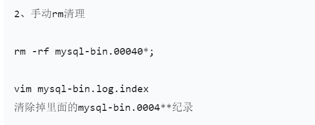

# 1 备份

# 2 恢复

**一、数据库备份恢复过程中的报错：ERROR 3546 (HY000) at line 24: @@GLOBAL.GTID_PURGED cannot be changed: the added gtid set must not overlap with @@GLOBAL.GTID_EXECUTED**

```bash
重新dump数据库，使用 --set-gtid-purged=off的参数禁止导出gtid信息，再load进目标数据库。

mysqldump -uroot -p --set-gtid-purged=off slowtech t1 > slowtech.t1.sql
```

# 3 binlog

mysql磁盘空间满，导致挂库

可以先临时清理binlog释放空间，启动库，后续再挂新盘

没有主从，binlog可以随便删，删除完改一下index文件，然后在启动就好了 binlog只会影响主从和下游同步用，其他的并没有啥影响

删除binlog：

https://www.modb.pro/db/606883




# 3 组复制

## 3.1 MY-011526

**1）错误日志**

2024-02-03T00:33:18.335943+08:00 0 [ERROR] [MY-011526] [Repl] Plugin group_replication reported: 'This member has more executed transactions than those present in the group. Local transactions: 13fc049e-c133-11ee-a377-000c29df1f85:1 > Group transactions: aaaaaaaa-aaaa-aaaa-aaaa-aaaaaaaaaaaa:1-10'
2024-02-03T00:33:18.336062+08:00 0 [ERROR] [MY-011522] [Repl] Plugin group_replication reported: 'The member contains transactions not present in the group. The member will now exit the group.'

**2）错误说明**

这个错误信息表明MySQL Group Replication中的某个成员与组中的其他成员之间存在事务不一致的情况，以及成员将退出组。具体来说，该成员执行的事务数目比组中存在的事务数目多。这可能是由于同步问题或者复制流程中的某些异常情况引起的。


**3）引发问题的原因**

- 从库执行了flush privileges，任何FLUSH语句都被记录到binlog中。
- 从库可写，从库的super_read_only未设置为ON。

**3）解决办法**

参考文章：

[https://forums.percona.com/t/replication-5-7-37-to-8-0-28-failing-because-of-replication-privilege-check/14954/3](https://forums.percona.com/t/replication-5-7-37-to-8-0-28-failing-because-of-replication-privilege-check/14954/3)

[https://forums.percona.com/t/mysql-group-replication/19721/2](https://forums.percona.com/t/mysql-group-replication/19721/2)

**方法1：最保险的办法是重建节点**

**方法2：可以在主库跳过从库这个事务**

```sql
SET GTID_NEXT='13fc049e-c133-11ee-a377-000c29df1f85:1';
BEGIN; COMMIT;
SET GTID_NEXT=AUTOMATIC;
```