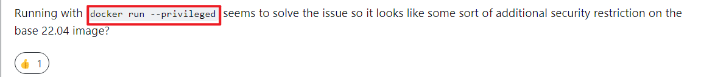

# 1 PMM介绍

Percona Monitoring and Management（PMM）是一个开源的用于管理和监控**MySQL**、MongoDB和PostgreSQL性能的平台。它由Percona与托管数据库服务，支持和咨询领域的专家合作开发。PMM旨在为MySQL和MongoDB服务器提供全面的基于时间的分析，以确保数据尽可能高效地工作。

PMM平台基于简单的客户端-服务器模型，可实现高效的可扩展性。它包括以下模块：

- **PMM Client**：安装在每个要监视的数据库主机上。它收集服务器指标，一般系统指标和查询分析数据，以获得完整的性能概述。收集的数据发送到PMM服务器。
- **PMM Server**：PMM的核心部分，它聚合收集的数据，并以Web界面的表格，仪表板和图形的形式呈现。
PMM提供了对MyISAM、InnoDB、TokuDB和PXC/Glarera的监控，另外也提供了Query Analytics的功能，可以检视执行了哪些SQL指令，并对执行效能较差的语法进行优化。另外在新版本还支持了MySQL复制拓扑图结构构造。

PMM针对操作系统的部分也提供了硬盘、网络、CPU和RAM的监控，特别的是它提供了Context switches、Processes和interrupts的监控，Context Switches可以看到CPU上下切换文的状况，Processes可以方便了解系统有多少程序在等待I/O。

此外，PMM通过PMM客户端收集到的DB监控数据可以用第三方软件Grafana进行画图展示。

架构图如下：


更详细的介绍请参考官方文档：https://docs.percona.com/percona-monitoring-and-management/index.html

# 2 安装PMM Server

官方提供了多种安装方式，优缺点如下：


最常用的方式是Docker。

**1）安装docker**

参考文章：[http://t.csdnimg.cn/N752u](http://t.csdnimg.cn/N752u)

如果你的机器可以连接外网的，用yum安装比较方便快捷。但是工作中的机器一般是内网环境，无法连互联网，所以只能通过二进制包安装。

**2）下载PMM Server镜像**

docker hub地址：[https://hub.docker.com/r/percona/pmm-server](https://hub.docker.com/r/percona/pmm-server)

```bash
[root@zabbix6 ~]# docker pull percona/pmm-server:2
```

这里下载的是pmm-server2.x的最新版本。如果要下载最新版本可以改为执行：

```bash
docker pull percona/pmm-server:latest
```

**3）创建持久数据卷容器**

单独建数据卷容器的好处主要包括以下几点：

- 数据持久性：容器数据卷允许容器中的数据在容器被删除或重启后仍然存在，这可以确保数据在容器生命周期内得到保护和持久化存储。
- 数据共享：容器数据卷允许多个容器共享同一个数据卷，这可以方便地共享应用程序和数据。
- 数据安全性：使用容器数据卷将宿主机的目录或文件挂载到容器中，可以避免在容器中存储敏感数据，提高数据安全性和保密性。
- 容器可移植性：使用容器数据卷使容器代码和数据分离，这使得容器的迁移变得更加简单和便捷。
- 数据备份：使用容器数据卷可以简化数据备份过程，可以轻松地备份和还原数据。

就算有人误删了你的PMM-Server容器，有数据也可以进行恢复，不至于**从删容器到跑路**。

**1.创建容器数据卷：**

```bash
[root@zabbix6 srv]# 
docker create --volume /srv \
--name pmm-data \
percona/pmm-server:2 /bin/true
```
PMM Server指定的数据卷为/srv，使用其他卷将导致升级时数据丢失。

command介绍：

- docker create：创建一个新容器;
- --volume：绑定挂载卷/srv；
- --name：为容器指定一个名称pmm-data；
- pmm-data percona/pmm-server:2：镜像名；
- /bin/true：设置退出码为0，在Linux底下，每一个程序执行完毕都会返回一个退出码，通常状况下0表示成功。

以上命令介绍可以通过执行`docker --help`查看。

**2.检查服务器和数据容器挂载点:**

```bash
[root@zabbix6 srv]# docker inspect pmm-data | egrep "Destination|Source"
                "Source": "/var/lib/docker/volumes/c08c5a4898c3a2340edc40ae531a6400e4e292d1b9a754fc66622475356a0413/_data",
                "Destination": "/srv",
```

参数介绍：
- Destination：容器内目录；
- Source：对应宿主机目录。

检查下宿主机目录：

```bash
[root@zabbix6 _data]# ls /var/lib/docker/volumes/
alerting  alertmanager  backup  clickhouse  grafana  logs  nginx  pmm-distribution  postgres14  prometheus  victoriametrics
```

**4）创建并启动PMM Server容器**

```bash
[root@zabbix6 _data]# 
docker run --privileged --detach --restart always \
--publish 443:443 \
--volumes-from pmm-data \
--name pmm-server \
percona/pmm-server:2
```

command介绍：

- docker run: 用于启动一个或多个容器。
- --detach: 容器将在后台运行并返回容器ID。
- --restart always: 指定重启策略，当容器退出时，该参数确保容器始终自动重新启动。
- --publish 443:443: 端口映射，冒号前是宿主机的端口，冒号后是容器内部的端口。任何访问宿主机的443端口的请求都会被转发到容器的相应端口。
- --volumes-from pmm-data: 引用pmm-data容器中的数据卷。
- --name pmm-server: 新创建的容器的名称pmm-server。
- percona/pmm-server:2: 要运行的Docker镜像的名称。

**5）查看容器运行情况**

```bash
[root@zabbix6 ~]# docker ps
CONTAINER ID   IMAGE                  COMMAND                CREATED          STATUS                    PORTS                          NAMES
c99a87c5718b   percona/pmm-server:2   "/opt/entrypoint.sh"   18 minutes ago   Up 18 minutes (healthy)   80/tcp, 0.0.0.0:443->443/tcp   pmm-server
```

**6）在web浏览器中查看PMM用户界面**

访问 https://ip:443 在web浏览器中查看PMM用户界面，ip为PMM Server的地址。


默认的用户名和密码都是admin，第一次登录会提示修改密码。

首页如下：


# 安装问题

**1）列出当前运行的 Docker 容器**

docker run启动pmm-server容器后查看：


状态显示`unhealthy`，正常来说应该是`healthy`，这显然有问题。

**2）查看pmm-server容器日志**

```bash
[root@zabbix6 ~]# docker logs 7044dd8d6aca > docker.log
```

异常信息如下：

```bash
[root@zabbix6 ~]# vim docker.log
2024-01-28 17:04:26,213 INFO spawned: 'clickhouse' with pid 283
2024-01-28 17:04:26,383 INFO exited: clickhouse (exit status 232; not expected)
2024-01-28 17:04:32,683 INFO spawned: 'grafana' with pid 300
2024-01-28 17:04:32,684 INFO spawned: 'qan-api2' with pid 301
2024-01-28 17:04:32,690 INFO exited: grafana (exit status 2; not expected)
2024-01-28 17:04:32,691 INFO exited: qan-api2 (exit status 1; not expected)
```

根据提示，大概的意思是clickhouse、grafana、qan-api2进程退出。

**3）查看pmm-server容器进程**

```bash
[root@zabbix6 bin]# docker exec -it 7044dd8d6aca /bin/bash
[root@7044dd8d6aca opt] # supervisorctl
alertmanager                     RUNNING   pid 25, uptime 0:06:00
clickhouse                       FATAL     Exited too quickly (process log may have details)
dbaas-controller                 STOPPED   Not started
grafana                          FATAL     Exited too quickly (process log may have details)
nginx                            RUNNING   pid 22, uptime 0:06:00
pmm-agent                        RUNNING   pid 114, uptime 0:05:57
pmm-managed                      RUNNING   pid 37, uptime 0:06:00
pmm-update-perform               STOPPED   Not started
pmm-update-perform-init          FATAL     Exited too quickly (process log may have details)
postgresql                       RUNNING   pid 13, uptime 0:06:00
prometheus                       STOPPED   Not started
qan-api2                         BACKOFF   Exited too quickly (process log may have details)
victoriametrics                  RUNNING   pid 23, uptime 0:06:00
vmalert                          RUNNING   pid 24, uptime 0:06:00
vmproxy                          RUNNING   pid 32, uptime 0:06:00
```

印证了刚刚的推论，一大堆进程都没有运行，看起来问题很多啊。

**4）查看具体进程日志**

优先看看这几个进程clickhouse、grafana、qan-api2日志。

**clickhouse:**

```bash
supervisor> tail clickhouse
. main @ 0x0000000007111f8f in /usr/bin/clickhouse
1.  ? @ 0x00007f5ed0cd1eb0 in ?
2.  ? @ 0x00007f5ed0cd1f60 in ?
3.  _start @ 0x000000000634716e in /usr/bin/clickhouse
 (version 23.8.2.7 (official build))
Processing configuration file '/etc/clickhouse-server/config.xml'.
Logging information to /srv/logs/clickhouse-server.log
Poco::Exception. Code: 1000, e.code() = 0, Exception: Could not determine local time zone: filesystem error: in canonical: Operation not permitted ["/usr/share/zoneinfo/"] [""], Stack trace (when copying this message, always include the lines below):

1. DateLUT::DateLUT() @ 0x000000000c5f13d8 in /usr/bin/clickhouse
2. OwnPatternFormatter::OwnPatternFormatter(bool) @ 0x000000000c8e224e in /usr/bin/clickhouse
3. Loggers::buildLoggers(Poco::Util::AbstractConfiguration&, Poco::Logger&, String const&) @ 0x000000000c8d846d in /usr/bin/clickhouse
4. BaseDaemon::initialize(Poco::Util::Application&) @ 0x000000000c8b6082 in /usr/bin/clickhouse
5. DB::Server::initialize(Poco::Util::Application&) @ 0x000000000c68bef8 in /usr/bin/clickhouse
6. Poco::Util::Application::run() @ 0x0000000015b1e6fa in /usr/bin/clickhouse
7. DB::Server::run() @ 0x000000000c68bcbe in /usr/bin/clickhouse
8. Poco::Util::ServerApplication::run(int, char**) @ 0x0000000015b2d819 in /usr/bin/clickhouse
9. mainEntryClickHouseServer(int, char**) @ 0x000000000c688a8a in /usr/bin/clickhouse
10. main @ 0x0000000007111f8f in /usr/bin/clickhouse
11. ? @ 0x00007f85da433eb0 in ?
12. ? @ 0x00007f85da433f60 in ?
13. _start @ 0x000000000634716e in /usr/bin/clickhouse
 (version 23.8.2.7 (official build))
```

**grafana:**

```bash
supervisor> tail grafana
000
0x00007ffdba484180:  0x0000000000000001  0xc1999515713efe00
0x00007ffdba484190:  0x00007ffdba4843a0  0x00000000004324db <runtime.(*pageAlloc).allocRange+0x000000000000021b>
0x00007ffdba4841a0:  0x0000000005d202e8  0x0000000002030000 <github.com/grafana/grafana/pkg/services/libraryelements.(*LibraryElementService).getLibraryElementByUid+0x0000000000000240>
0x00007ffdba4841b0:  0x0000000000000004  0x0000000000000000
0x00007ffdba4841c0:  0x0000000000000002  0xc1999515713efe00
0x00007ffdba4841d0:  0x00007efd709d6740  0x0000000000000006
0x00007ffdba4841e0:  0x0000000000000001  0x00007ffdba484510
0x00007ffdba4841f0:  0x0000000005cf3920  0x00007efd70a2dd06
0x00007ffdba484200:  0x00007efd70bd4e90  0x00007efd70a017f3
0x00007ffdba484210:  0x0000000000000020  0x0000000000000000
0x00007ffdba484220:  0x000000000361013e  0x0000000000000006
0x00007ffdba484230:  0x0000000005eb988a  0x0000000000000000

goroutine 1 [running]:
runtime.systemstack_switch()
        /usr/local/go/src/runtime/asm_amd64.s:474 +0x8 fp=0xc000072740 sp=0xc000072730 pc=0x4737c8
runtime.main()
        /usr/local/go/src/runtime/proc.go:169 +0x6d fp=0xc0000727e0 sp=0xc000072740 pc=0x441aed
runtime.goexit()
        /usr/local/go/src/runtime/asm_amd64.s:1650 +0x1 fp=0xc0000727e8 sp=0xc0000727e0 pc=0x4757a1

rax    0x0
rbx    0x7efd709d6740
rcx    0x7efd70a7a58c
rdx    0x6
rdi    0x187
rsi    0x187
rbp    0x187
rsp    0x7ffdba484140
r8     0x7ffdba484210
r9     0x7efd70b8a4e0
r10    0x8
r11    0x246
r12    0x6
r13    0x7ffdba484510
r14    0x5cf3920
r15    0x6
rip    0x7efd70a7a58c
rflags 0x246
cs     0x33
fs     0x0
gs     0x0
```

**qan-api2:**

```bash
supervisor> tail qan-api2
: connect: connection refused
stdlog: qan-api2 v2.41.0.
time="2024-01-28T17:52:00.514+00:00" level=info msg="Log level: info."
time="2024-01-28T17:52:00.514+00:00" level=info msg="DSN: clickhouse://127.0.0.1:9000?database=pmm&block_size=10000&pool_size=2" component=main
stdlog: Connection: dial tcp 127.0.0.1:9000: connect: connection refused
stdlog: qan-api2 v2.41.0.
time="2024-01-28T17:52:25.252+00:00" level=info msg="Log level: info."
time="2024-01-28T17:52:25.252+00:00" level=info msg="DSN: clickhouse://127.0.0.1:9000?database=pmm&block_size=10000&pool_size=2" component=main
stdlog: Connection: dial tcp 127.0.0.1:9000: connect: connection refused
stdlog: qan-api2 v2.41.0.
time="2024-01-28T17:52:50.486+00:00" level=info msg="Log level: info."
time="2024-01-28T17:52:50.486+00:00" level=info msg="DSN: clickhouse://127.0.0.1:9000?database=pmm&block_size=10000&pool_size=2" component=main
stdlog: Connection: dial tcp 127.0.0.1:9000: connect: connection refused
stdlog: qan-api2 v2.41.0.
time="2024-01-28T17:53:17.248+00:00" level=info msg="Log level: info."
time="2024-01-28T17:53:17.248+00:00" level=info msg="DSN: clickhouse://127.0.0.1:9000?database=pmm&block_size=10000&pool_size=2" component=main
stdlog: Connection: dial tcp 127.0.0.1:9000: connect: connection refused
stdlog: qan-api2 v2.41.0.
time="2024-01-28T17:53:45.089+00:00" level=info msg="Log level: info."
time="2024-01-28T17:53:45.089+00:00" level=info msg="DSN: clickhouse://127.0.0.1:9000?database=pmm&block_size=10000&pool_size=2" component=main
stdlog: Connection: dial tcp 127.0.0.1:9000: connect: connection refused
```

上面三个进程的日志重要信息如下：

- 权限不足：filesystem error: in canonical: Operation not permitted ["/usr/share/zoneinfo/"]

- 连接失败：stdlog: Connection: dial tcp 127.0.0.1:9000: connect: connection refused

**5）解决办法**

先看看第一个权限不足的问题，看到一篇文章遇到了类似问题，文章地址为[https://github.com/ClickHouse/ClickHouse/issues/48296](https://github.com/ClickHouse/ClickHouse/issues/48296)

解决办法是：



这个问题可能是因为版本的限制，一开始安装使用的`docker run`命令没有加--privileged参数。

**删除容器，重新创建：**

```bash
[root@zabbix6 _data]# docker stop 7044dd8d6aca
[root@zabbix6 _data]# docker rm 7044dd8d6aca
[root@zabbix6 _data]# 
docker run --privileged --detach --restart always \
--publish 443:443 \
--volumes-from pmm-data \
--name pmm-server \
percona/pmm-server:2

[root@zabbix6 ~]# docker ps
CONTAINER ID   IMAGE                  COMMAND                CREATED          STATUS                    PORTS                          NAMES
c99a87c5718b   percona/pmm-server:2   "/opt/entrypoint.sh"   18 minutes ago   Up 18 minutes (healthy)   80/tcp, 0.0.0.0:443->443/tcp   pmm-server
```

解决！！