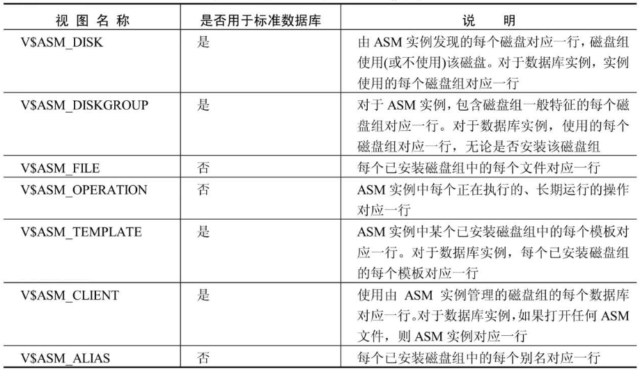
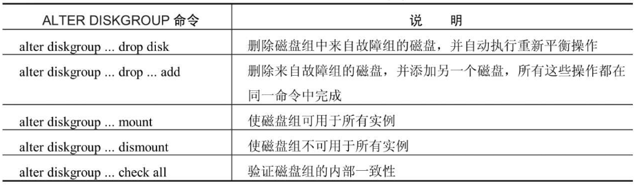
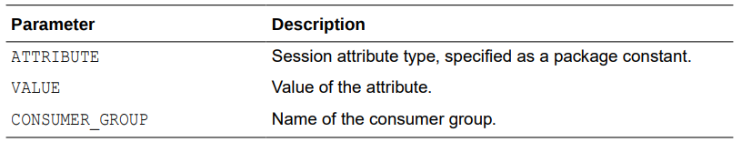
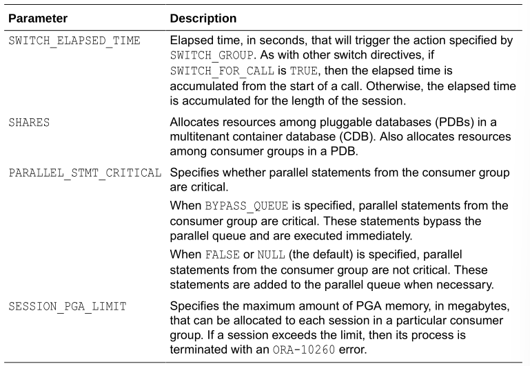
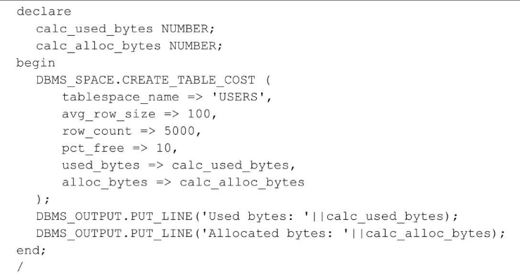
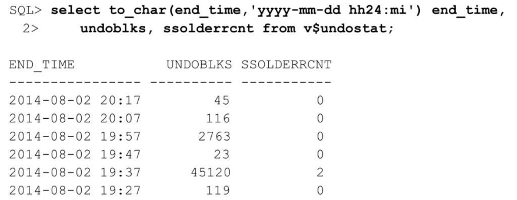

**目录**

[toc]

# 说明

此文章包含三个部分，第一部分1到4章，主要介绍Oracle的体系结构。第二部分5到11章，主要介绍Oracle数据库的管理。第三部分12到19章，主要介绍高可用。

# 1 Oracle体系结构概述

本章将介绍Oracle 12c的基础知识和后面章节的一些特性，以及使用Oracle通用安装程序（Oracle Universal Installer，OUI）和数据库配置助手（Database Configuration Assistant，DBCA）安装Oracle 12c的基本知识。

学习完本章节，你将会对Oracle数据库有一个整体性的了解。

## 1.1 数据库和实例概述

相信很多人不清楚数据库和实例的关系，更有甚者以为数据库和实例是同一个东西的。实际上，他们间存在很大区别，是完全不同的实体，但又紧密相关。

数据库和实例架构图如下所示：


### 1.1.1 数据库

数据库是一组位于磁盘上用于存储数据的文件集。这些文件可以独立于数据库实例存在。如下图所示：


数据库由各种物理和逻辑结构组成，而表则是数据库中最重要的逻辑结构。“表”由包含相关数据的行和列组成。数据库至少要有存储有用信息的表。

组成数据库的文件主要分为两类：数据库文件和非数据库文件。两者之间的区别在于存储何种数据。数据库文件包含数据和元数据，非数据库文件则包含初始参数和日志记录信息等。

### 1.1.2 实例

实例是管理数据库文件的内存结构集合。由一个称为系统全局区SGA的共享内存区和一些后台进程组成。这些后台进程在SGA和磁盘上的数据库文件之间交互。实例可以独立存在于数据库文件之外。如下图所示：


Oracle实例架构分为单实例和RAC。

在单实例中，数据库和实例时一对一关系。

在Oracle RAC中，数据库和实例是一对多，一个数据可对应多个实例，即内存和后台进程每个实例独立，而数据库文件共享。

## 1.2 逻辑存储结构

Oracle数据库中的数据文件被分组到一个或多个表空间中。在每个表空间中，逻辑数据库结构（如表和索引）都是片段，被进一步细分为“盘区”（extent）和“块（block）”。这种存储的逻辑细分允许Oracle更有效地控制磁盘空间的利用率。如下图所示：


下面介绍逻辑结构的组成部分。他们之间的关系以及和物理结构的关系如下图所示：


**一、数据块（data block）**

数据块是Oracle数据库中最小的数据存储逻辑单元，即数据块是Oracle数据库可以使用或分配的最小存储单元。

块的大小是数据库内给定表空间中特定数量的存储字节，默认是8kb，通过初始参数DB_BLOCK _SIZE指定大小。数据库块大小需要是操作系统块大小的整数倍，有利于提升磁盘I/O的效率。

**二、区（extent）**

区是由一组逻辑连续的数据块组成，用于存储特定类型的信息。例如，一个24kb的区，默认由3个8kb的数据块组成。

**三、段（segment）**

段是为特定的数据库对象（例如表、索引等）分配的一组区的集合。每一个表、索引等数据库对象都是一个段。

段的分类：

1. 数据段：存储非集群表、表分区或表集群数据的段。如果表是分区表或集群表，则表会被分配多个段；
2. 索引段：存储非分区索引或分区索引数据的段；
3. 临时段：当一个SQL语句需要一个临时的数据库区域来完成执行时，Oracle数据库创建的一个段。例如，排序操作所需要的空间超过了PGA时，需要创建临时段完成排序；
4. 回滚段：在undo表空间中的段。

例如，employees表的数据存储在它自己的数据段中，而employees表的每一个索引存储在它自己的索引段中。

每一个需要存储的数据库对象由单个段组成。

**四、表空间（tablespace）**

表空间是包含一个或多个段的数据库存储单元。每一个段仅属于一个表空间，因此，一个段的所有区都存储在同一个表空间中。

在表空间内，一个段可以包含来自多个数据文件的区。例如，一个段的区有的存储在datafile1，也有的存储在datafile2。但是，一个区不能跨数据文件，只能存储于同一个数据文件中。根据以上特性，我们又可以知道，Oracle表空间(tablespace)由一个或多个数据文件组成，一个数据文件是且只能是一个表空间的一部分。

表空间的管理分为字典管理或本地管理。

## 1.3 逻辑数据库结构

## 1.3.1 表

表是Oracle数据库中的基本存储单位，表中的数据总是存储在行和列中。

下面介绍Oracle中不同类型的表。

**一、堆表★**

堆表（关系表）是数据库中最常见的表类型。关系表以“堆（heap）”的形式进行组织；换句话说，表中的行没按任何特定顺序存储。表的每一行包含一列或多列，每一列都有一种数据类型和长度。

**二、临时表★**

临时表仅保存在事务或会话期间存在的数据。临时表中的数据对会话是私有的，每个会话只能查看和修改自己的数据。

临时表分为全局临时表和私有临时表。他们的特点如下图所示：


**三、索引组织表**

创建索引可以更有效地找到表中的特定行，但是，这也会带来一些额外的系统开销。因为数据库必须同时维护表的数据行和索引条目。

如果表包含的列并不多，而且对表的访问主要集中在某一列上，应怎么做？这种情况下，索引组织表（Index Organized Table，IOT）可能就是正确的解决方案。

索引组织表的数据按主键排序手段被存储在B-树索引中，除了存储主键列值外还存储非键列的值。普通索引只存储索引列，而索引组织表则存储表的所有列的值。IOT不存在主键的空间开销，因为索引就是数据，数据就是索引，二者已经合二为一。

IOT最明显的优点在于只需要维护一个存储结构，而非两个。例如，表中主键的值只在IOT中存储一次，而在普通表中则需要存储两次。

索引组织表一般适应于静态表，且查询多以主键列。当表的大部分列当作主键列时，且表相对静态，比较适合创建索引组织表。

IOT适用的场合有：
1. 完全由主键组成的表；
2. 代码查找表，维度表；
3. 如果你想保证数据存储在某个位置上，或者希望数据以某种特定的顺序物理存储。

**四、对象表**

对象表是一种特殊类型的表，其中每一行代表一个对象。

Oracle对象类型是用户自定义的类型，具有名称、属性和方法。对象类型可以将真实世界的实体(如客户和采购订单)建模为数据库中的对象。

对象类型定义逻辑结构，但不创建存储。例如：

```sql
CREATE TYPE department_typ AS OBJECT
   ( d_name     VARCHAR2(100),
     d_address  VARCHAR2(200) );
/
```

下面创建department_typ类型的表，并插入一行记录：

```sql
CREATE TABLE departments_obj_t OF department_typ;
INSERT INTO departments_obj_t VALUES ('hr', '10 Main St, Sometown, CA');
```

**五、外部表**


外部表允许用户访问数据源，如文本文件，就如同该数据源是数据库中的表一样。表的元数据存储在Oracle数据字典中，但表的内容存储在外部。

当Oracle数据库应用程序必须访问非关系数据时，外部表非常有用。

但是，在外部表上不可以创建索引，也不可以对其执行插入、更新或删除操作。

创建外部表的例子：

要创建外部表的数据在两个文本文件empxt1.dat和empxt2.dat中。

empxt1.dat文件包含如下样例数据：
```dat
360,Jane,Janus,ST_CLERK,121,17-MAY-2001,3000,0,50,jjanus
361,Mark,Jasper,SA_REP,145,17-MAY-2001,8000,.1,80,mjasper
362,Brenda,Starr,AD_ASST,200,17-MAY-2001,5500,0,10,bstarr
363,Alex,Alda,AC_MGR,145,17-MAY-2001,9000,.15,80,aalda
```

empxt2.dat文件包含如下样例数据：

```dat
401,Jesse,Cromwell,HR_REP,203,17-MAY-2001,7000,0,40,jcromwel
402,Abby,Applegate,IT_PROG,103,17-MAY-2001,9000,.2,60,aapplega
403,Carol,Cousins,AD_VP,100,17-MAY-2001,27000,.3,90,ccousins
404,John,Richardson,AC_ACCOUNT,205,17-MAY-2001,5000,0,110,jrichard
```

在hr schema中创建名为admin_ext_employees的外部表： 
```sql
CONNECT  /  AS SYSDBA;
-- Set up directories and grant access to hr 
CREATE OR REPLACE DIRECTORY admin_dat_dir
    AS '/flatfiles/data'; 
CREATE OR REPLACE DIRECTORY admin_log_dir 
    AS '/flatfiles/log'; 
CREATE OR REPLACE DIRECTORY admin_bad_dir 
    AS '/flatfiles/bad'; 
GRANT READ ON DIRECTORY admin_dat_dir TO hr; 
GRANT WRITE ON DIRECTORY admin_log_dir TO hr; 
GRANT WRITE ON DIRECTORY admin_bad_dir TO hr;
-- hr connects. Provide the user password (hr) when prompted.
CONNECT hr
-- create the external table
CREATE TABLE admin_ext_employees
                   (employee_id       NUMBER(4), 
                    first_name        VARCHAR2(20),
                    last_name         VARCHAR2(25), 
                    job_id            VARCHAR2(10),
                    manager_id        NUMBER(4),
                    hire_date         DATE,
                    salary            NUMBER(8,2),
                    commission_pct    NUMBER(2,2),
                    department_id     NUMBER(4),
                    email             VARCHAR2(25) 
                   ) 
     ORGANIZATION EXTERNAL 
     ( 
       TYPE ORACLE_LOADER 
       DEFAULT DIRECTORY admin_dat_dir 
       ACCESS PARAMETERS 
       ( 
         records delimited by newline 
         badfile admin_bad_dir:'empxt%a_%p.bad' 
         logfile admin_log_dir:'empxt%a_%p.log' 
         fields terminated by ',' 
         missing field values are null 
         ( employee_id, first_name, last_name, job_id, manager_id, 
           hire_date char date_format date mask "dd-mon-yyyy", 
           salary, commission_pct, department_id, email 
         ) 
       ) 
       LOCATION ('empxt1.dat', 'empxt2.dat') 
     ) 
     PARALLEL 
     REJECT LIMIT UNLIMITED; 
-- enable parallel for loading (good if lots of data to load)
ALTER SESSION ENABLE PARALLEL DML;
-- load the data in hr employees table
INSERT INTO employees (employee_id, first_name, last_name, job_id, manager_id,
                       hire_date, salary, commission_pct, department_id, email) 
            SELECT * FROM admin_ext_employees;

```

**六、群集表**

如果经常同时访问两个或多个表（如一个订单表和一个行项明细表），则创建群集表（clustered table）可能是一种较好的方法，它可以改进引用这些表的查询的性能。在具有相关行项（line-item）明细表的订单表中，订单标题信息可与行项明细记录存储在同一个块中，从而减少检索订单和行项信息所需要的I/O数量。两个表共有的列也称为“群集键值”。

**七、散列群集**

作为特殊类型的群集表，散列群集（hash cluster）操作起来非常类似于普通的群集表，但是，它不使用群集索引，而使用散列函数来存储并检索表中的行。创建表时，将根据在创建群集期间指定的散列键的数量分配所需要的预估空间。

**八、排序的散列群集**

排序的散列群集是Oracle 10g中的新增内容。它们类似于普通的散列群集，通过使用散列函数来定位表中的行。然而，除此之外，排序的散列群集允许对表中的行根据表的一列或多列进行升序排列。如果遇到进行先进先出（First In First Out，FIFO）处理的应用程序，该方法就可以更快速地处理数据。

可以先创建群集本身，再创建排序的散列群集，但需要在群集中列定义的后面加上SORT位置参数。

**九、分区表★**

分区表对表进行分区或对索引进行分区（下一部分将介绍对索引进行分区）可帮助建立更便于管理的大型表。*Oracle公司建议，对于任何大于2GB的表，应尽量考虑对其进行分区。*

从DBA的观点看，进行分区有很多优点。如果表的一个分区位于已损坏的磁盘卷上，则在修复遭到破坏的卷时，用户仍可查询表的其他分区。与此类似，对分区的备份可以许多天进行一次，每次备份一个分区，而不需要一次性地对整个表进行备份。

分区大致有3种类型：范围分区、散列分区及列表分区。

**范围分区**，对于范围分区，它的分区键落在某一范围内。

**列表分区**，在列表分区中，分区键落在完全不同的值组中。

**散列分区**，散列分区根据散列函数将行赋给分区，只需要指定用于散列函数的一列或多列，不必将这些列显式赋予分区，而只需要指定有多少列可用。Oracle将行赋给分区，并确保每个分区中行的均匀分布。如果没有明确的列表分区或范围分区模式提供给表中的列类型，或者分区的相对大小经常改变，需要用户重复地手动调整分区模式，则散列分区就非常实用。

**组合分区**，使用组合分区可对分区进程进一步进行细分。例如，可先对表进行范围分区，然后在每个范围内，使用列表或散列进一步分区。

从Oracle 11g开始，也可以根据父／子关系进行分区，由应用程序控制分区，并可对基本分区类型进行很多组合，包括列表-散列、列表-列表、列表-范围和范围-范围等。分区表中的每一行能且只能存在于一个分区中。分区键为行指示正确的分区，它可以是组合键，最多可组合表中的16列。对可分区的表类型有一些次要的限制，例如，包含LONG或LONG RAW列的表不能进行分区。LONG限制极少会成为问题。LOB（包括字符大型对象CLOB和二进制大型对象BLOB）则灵活得多，包含LONG和LONG RAW数据类型的所有特性。

**十、分区索引★**

对表上的索引——或者符合索引表的分区模式（本地索引），或者独立于表的分区模式进行分区（全局索引）。删除分区时全局索引会失效，需要重建。

## 1.3.2 约束

Oracle约束（constraint）是一条或多条规则，它在表的一列或多列上定义，用于帮助实施业务规则。例如，约束可强制实现雇员起薪不得低于$25 000.00这样的业务规则。

共有6种数据完整性规则可应用于表列：非空、唯一性、主键、外键、检查和基于触发器的完整性。

可在创建时或将来的任意时间点启用或禁用约束；启用或禁用（使用关键字ENABLE或DISABLE）约束时，根据有效的业务规则，可能需要也可能不需要验证（使用关键字VALIDATE或NOVALIDATE）表中已有数据是否满足约束。

以下创建的表具有所有约束类型：
```sql
create table cust_order (
  order_number number(6) primary key,
  order_date date NOT null,
  delivery_date date,
  warehouse_number number default 12,
  customer_number number NOT null,
  order_line_item_qty number check (order_line_item_qty < 100),
  ups_tracking_number varchar2(50) unique,
  foreign key (customer_number) references customer(customer_number)
);
```

基于上表，下面将介绍每种约束:
1. **非空约束：**
   可防止将NULL值输入ORDER_DATE列或CUSTOMER_NUMBER列。从业务规则的角度看，这样做很有意义：每个订单都必须有订购日期，而只有在顾客下订单时，订单才有意义。

   注意，列中的NULL值并不意味着值为空或0；准确地讲，该值不存在。NULL值不等同于任何内容，甚至不等同于另一个NULL值。在对可能具有NULL值的列使用SQL查询时，这个概念非常重要。

2. **唯一性约束：**
   确保一列或一组列（通过组合约束）在整个表中是唯一的，UPS_TRACKING_NUMBER列将不包含重复值。为强制实施约束，Oracle将在UPS_TRACKING_NUMBER列上创建唯一索引。如果该列上已有一个有效的唯一索引，Oracle将使用该索引来实施约束。

   具有UNIQUE约束的列也可声明为NOT NULL。如果没有声明该列具有NOT NULL约束，则任意数量的行都可以具有NULL值，只要剩余的行在该列中具有唯一值。在允许一列或多列具有NULL值的组合唯一约束中，非NULL值的列用于确定是否满足约束。NULL列总满足约束，因为NULL值不等同于任何内容。

3. **主键约束：**
   是数据库表中最常见的约束类型。一个表上最多只能存在一个主键约束，组成主键的列不能有NULL值。ORDER_NUMBER列是主键。系统将创建唯一索引以实施该约束，如果该列已存在可用的唯一索引，主键约束就使用该索引。

4. **外键约束：**
   比上述任何一种约束都更复杂，因为它依赖于另一个表来限制哪些值可以输入到具有引用完整性约束的列中。在CUSTOMER_NUMBER列上声明外键（FOREIGN KEY）；输入该列的值必须也存在于另一个表（在这种情况下是CUSTOMER表）的CUSTOMER_NUMBER列中。

   此外，FOREIGN KEY约束可以自引用。在主键为EMPLOYEE_NUMBE的EMPLOYEE表中，MANAGER_NUMBER列具有根据同一个表中的EMPLOYEE_NUMBER列声明的外键，这就允许在EMPLOYEE表自身中创建一个报告层次结构。

   应该总在外键（FOREIGN KEY）列上声明索引以改进性能，该规则的唯一例外出现在绝对不会更新或删除父表中的引用主键或唯一键时。
   
5. **检查约束：**
   通过使用CHECK约束，可在列级别实施更复杂的业务规则。在前面的示例中，ORDER_LINE_ITEM_QTY列不得超出99。
   
   CHECK约束可使用插入或更新的行中的其他列来评估约束。例如，STATE_CD列上的约束只有在COUNTRY_CD列的值不为USA时才允许NULL值。

   一列上允许有多个CHECK约束。只有在所有的CHECK约束都计算为TRUE时，才允许将值输入列中。
   
6. **基于触发器的完整性约束**
   如果业务规则过于复杂，使用唯一性约束很难实现，则可使用CREATE TRIGGER命令在表上创建一个数据库触发器，同时使用一个PL/SQL代码块实施这一业务规则。当引用的表存在于不同的数据库中时，需要使用触发器来实施引用完整性约束。触发器也可用于许多超出约束检查领域的情况（例如，对表的审核访问）。

### 1.3.3 索引

当检索表中少量的行时，使用Oracle索引能更快访问表中的这些行。索引存储了进行索引的列的值，同时存储包含索引值的行的物理ROWID，唯一的例外是索引组织表（Index-Organized Table，IOT），它使用主键作为逻辑ROWID。可在一列或多列上创建索引。索引条目存储在B-树结构中，因此遍历索引以找到行的键值只需要使用非常少的I/O操作。一旦在索引中找到匹配值，索引中的ROWID就会指向表行的确切位置：哪个文件、文件中的哪个块，以及块中的哪一行。

下面将介绍最常见的索引类型的重点内容和特性：
1. **唯一索引：**
   唯一索引是最常见的B-树索引形式。它常用于实施表的主键约束。唯一索引确保索引的一列或多列中不存在重复值。

   例如，可在EMPLOYEE表中Social Security Number（社会保障号）的对应列上创建唯一索引，因为该列中不应有任何重复值。然而，一些雇员可能没有Social Security Number，因此该列可以包含NULL值。

2. **非唯一索引：**
   非唯一索引帮助提高访问表的速度，而不会强制实施唯一性。例如，可在EMPLOYEE表的LAST_NAME列上创建非唯一索引，从而提高按姓查找的速度。但对于任何给定的姓，确实可以有许多重复的值。

3. **反向键索引：**
   反向键索引（reverse key index）是特殊类型的索引，在反向键索引中，反向每列的索引键值中的所有字节。一般用于OLTP（OnlineTransaction Processing，联机事务处理）环境中。

   在CREATE INDEX命令中，使用REVERSE关键字指定反向键索引。下面是创建反向键索引的一个示例：
   ```sql
   create index ie_line_item_order_number on line_item (order_number) reverse;
   ```

4. **基于函数的索引：**
   基于函数的索引类似于标准的B-树索引，不同之处在于它将被声明为表达式的列的变换形式存储在索引中，而非存储列自身。

   下面的示例在EMPLOYEE表的LAST_NAME列上创建基于函数的索引：
   ```sql
   create index up_name on employee(upper(last_name));
   ```

   因此，使用如下查询的搜索将使用前面创建的索引，而不是进行完整的表扫描：
   ```sql
   select employee_number, last_name, first_name, from employee where upper(last_name) = 'SMITH';
   ```

5. **位图索引：**
   在索引的叶节点上，位图索引（bitmap index）的结构与B-树索引相比存在着较大的区别。它只存储索引列每个可能值（基数）的一个位串，位串的长度与索引表中的行数相同。
   
   **在索引列具有较低基数或大量不同的值时，使用位图索引才最有效**。例如，PERS表中的GENDER列将有NULL、M或F值。GENDER列上的位图索引将只有3个位图存储在索引中。

   与传统索引相比，位图索引不仅可节省大量空间，还可大大缩短响应时间，因为在需要访问表自身之前，Oracle就可以从包含多个WHERE子句的查询中快速删除潜在的行。对于多个位图，可使用逻辑AND和OR操作来确定访问表中的哪些行。

   **注意**：位图索引只在Oracle 11g和12c的企业版中可用。由于在表上执行DML时，位图索引包含额外的锁定和块拆分开销，因此仅适用于极少更新的列。

### 1.3.4 视图

视图允许用户查看单独表或多个连接表中数据的自定义表示。视图也称为“存储查询”：用户无法看到视图底层隐藏的查询细节。普通视图不存储任何数据，只存储定义，在每次访问视图时都运行底层的查询。

普通视图的增强称为“物化视图（materialized view）”，允许同时存储查询的结果和查询的定义，从而加快处理速度。

对象视图类似于传统视图，可隐藏底层表连接的细节，并允许在数据库中进行面向对象的开发和处理，而底层的表仍然保持数据库关系表的格式。

下面将介绍创建并使用的基本视图类型的基础知识。

**一、普通视图**

普通视图，通常称为“视图”，不会占据任何存储空间，只有它的定义（查询）存储在数据字典中。视图底层查询的表称为“基表”，视图中的每个基表都可以进一步定义为视图。

视图有很多优点，它可以隐藏数据复杂性。高级分析人员可以定义包含EMPLOYEE、DEPARTMENT和SALARY表的视图，这样上层管理部门可以更容易地使用SELECT语句检索有关雇员薪水的信息，这种检索表面看来是使用表，但实际上是包含查询的视图，该查询连接EMPLOYEE、DEPARTMENT和SALARY表。

视图也可以用于实施安全性。EMPLOYEE表上的视图EMP_INFO包含除了SALARY（薪水）外的所有列，并且将该视图定义为只读，从而防止更新该表:
```sql
create view emp_info 
  as
    select  employee_number, last_name, first_name, middle_initial, surname
       from employee
  with read only;
```

如果没有READ ONLY子句，则可更新某行或向视图中添加行，甚至可在包含多个表的视图上执行这些操作。视图中有一些构造可防止对其进行更新，例如使用DISTINCT操作符、聚集函数或GROUP BY子句。

**二、物化视图**

物化视图与普通视图非常类似，视图的定义存储在数据字典中，并且该视图对用户隐藏底层基查询的细节。不同之处在于，物化视图也在数据库段中分配空间，用于保存执行基查询得到的结果集。

物化视图可用于将表的只读副本复制到另一个数据库，该副本具有和基表相同的列定义和数据。这是物化视图的最简单实现。为减少刷新物化视图时的响应时间，可创建物化视图日志以刷新物化视图。否则，在需要刷新时就必须进行完全的刷新：必须运行基查询的全部结果以刷新物化视图。物化视图日志为以增量方式更新物化视图提供了方便。

物化视图在很多方面与索引类似，它们都直接和表联系并且占用空间，在更新基表时必须刷新它们，它们的存在对用户而言实际上是透明的。通过使用可选的访问路径来返回查询结果，它们可以帮助优化查询。

**三、对象视图**

面向对象（OO）的应用程序开发环境日趋流行，Oracle 12c数据库完全支持数据库中本地化对象和方法的实现。然而，从纯粹的关系数据库环境向纯粹的OO数据库环境迁移并非易事，很少有组织愿意花费时间和资源从头开始构建新的系统，而Oracle 12c使用对象视图使这种迁移变得更为容易。

对象视图允许面向对象的应用程序查看作为对象集合的数据，这种对象集合具有属性和方法，而遗留系统仍可对INVENTORY表运行批处理作业。对象视图可以模仿抽象数据类型、对象标识符（OID）以及纯粹的OO数据库环境能够提供的引用。

### 1.3.5 用户和模式

有权访问数据库的数据库账户称为“用户”。用户可存在于数据库中，而不拥有任何对象。

如果用户在数据库中创建并拥有对象，这些对象就是与数据库用户同名的模式（schema）的一部分。模式可拥有数据库中任何类型的对象：表、索引、序列和视图等。模式拥有者或DBA可授权其他数据库用户访问这些对象。

用户总是拥有完整的权限，而且可以控制用户模式中的对象。

### 1.3.6 配置文件

数据库配置文件是可以赋给用户的限定资源的命名集。数据库资源不是无限的，因此DBA必须为所有数据库用户管理和分配资源。数据库资源的一些示例是CPU时间、并发会话、逻辑读和连接时间。

### 1.3.7 序列

Oracle序列用于分配有序数，并且保证其唯一性（除非重新创建或重新设置序列）。序列（sequence）可生成长达38位的数字，数字序列可按升序或降序排列，间隔可以是用户指定的任何值，并且Oracle可在内存中缓存序列中的数字块，从而获得更快的性能。

序列中的数字可保证唯一，但不一定有序。如果缓存数字块，并且重新启动实例，或者回滚使用序列中数字的事务，则下次调用从序列中检索数字不会与原序列中已引用但未使用的数字相同。

### 1.3.8 同义词

Oracle同义词（synonym）只是数据库对象的别名，用于简化对数据库对象的引用，并且隐藏数据库对象源的细节。同义词可以赋给表、视图、物化视图、序列、过程、函数和程序包。与视图类似，除了数据字典中的定义外，同义词不会在数据库中分配任何空间。创建公有同义词后，要确保同义词的用户拥有对该同义词引用的对象的正确权限。

### 1.3.9 PL/SQL

Oracle PL/SQL是Oracle对SQL的过程化语言扩展。

**一、过程和函数**

PL/SQL过程和函数是PL/SQL命名块的范例。PL/SQL块是PL/SQL语句序列，可将其视为用于执行功能的单位，它最多包含3个部分：变量声明部分、执行部分和异常部分。

过程和函数之间的区别在于：函数将单个值返回到调用程序，如SQL SELECT语句。相反，过程不返回值，只返回状态码。

过程和函数在数据库环境中有诸多优点。在数据字典中只需编译并存储过程一次，当多个用户调用过程时，该过程已经编译，并且只有一个副本存在于共享池中。此外，网络通信量会减少，即使没有使用PL/SQL的过程化特性也是如此。一次PL/SQL调用所使用的网络带宽远小于单独通过网络发送的SQL SELECT和INSERT语句。

**二、包**

包（package）将相关的函数和过程以及常见的变量和游标（cursor）组合在一起。程序包由两个部分组成：包头和包体。

在包头中，提供包的方法和属性，方法的实现以及任何私有方法和属性都隐藏在包体中。如果使用程序包而不是单独的过程或函数，则在改变内嵌的过程或函数时，任何引用程序包规范中元素的对象都不会失效，从而避免了重新编译引用程序包的对象。

**三、触发器**

触发器（trigger）是一种特殊类型的PL/SQL或Java代码块，在指定事件发生时执行或触发。事件类型可以是表或视图上的DML语句、DDL语句甚至是数据库事件（如启动和关闭）。可以改进指定的触发器，使其作为审核策略的一部分在特定用户的特定事件上执行。

### 1.3.10 外部文件访问

除了外部表外，Oracle还有大量其他的方法可用于访问外部文件：

- 在SQL*Plus中，访问包含要运行的其他SQL命令的外部脚本，或将SQL*Plus SPOOL命令的输出发送到操作系统的文件系统中的文件。
- 在PL/SQL过程中，使用UTL_FILE内置程序包读取或写入文本信息；类似地，PL/SQL过程中的DBMS_OUTPU调用可生成文本消息和诊断，另一个应用程序可以捕获这些消息和诊断，并保存在文本文件中。
- BFILE数据类型可引用外部数据。
- DBMS_PIPE可与Oracle支持的任何3GL语言通信并交换信息，如C++、Ada、Java或COBOL。
- UTL_MAIL是Oracle 10g中新增的程序包，它允许PL/SQL应用程序发送电子邮件，而不需要知道如何使用底层的SMTP协议栈。

### 1.3.11 数据库链接和远程数据库

数据库链接允许Oracle数据库引用存储在本地数据库之外的对象。命令CREATE DATABASE LINK创建到远程数据库的路径，从而允许访问远程数据库中的对象。数据库链接打包如下内容：远程数据库的名称、连接到远程数据库的方法、用于验证远程数据库连接的用户名／密码的组合。

为在分布式环境中的多个数据库之间建立链接，域中每个数据库的全局数据库名必须都不相同。因此，重要的是正确分配初始参数DB_NAME和DB_DOMAIN。

为便于使用数据库链接，可将同义词赋给数据库链接，使表访问更透明；用户并不知道同义词访问的是本地对象还是分布式数据库上的对象。

## 1.4 物理存储结构

Oracle数据库使用磁盘上的大量物理存储结构来保存和管理用户事务中的数据。

有些物理存储结构，如数据文件、重做日志文件和归档的重做日志文件，保存实际的用户数据。

其他结构，如控制文件，用于维护数据库对象的状态，而基于文本的警报和跟踪文件则包含数据库中例程事件和错误条件的日志信息。

物理结构与逻辑存储结构之间的关系如下图所示：


### 1.4.1 数据文件

每个Oracle数据库必须至少包含一个数据文件（datafile）。一个表空间可由许多数据文件组成。当Oracle数据文件用完空间时，它可以自动扩展，只要DBA是使用AUTOEXTEND参数创建数据文件即可。通过使用MAXSIZE参数，DBA也可以限制给定数据文件的扩展量。在任何情况下，数据文件的大小最终都会受到它所驻留的磁盘卷的限制。

数据库中的所有数据最终都驻留在数据文件中。数据文件中频繁访问的块缓存在内存中。类似地，新的数据块不会立刻写出到数据文件，而是在数据库写入程序进程处于活动状态时再写到数据文件。然而，在用户的事务完成之前，事务的改变就会写入重做日志文件。

### 1.4.2 重做日志文件

无论何时在表、索引或其他Oracle对象中添加、删除或改变数据，都会将一个条目写入当前的重做日志文件（redo log file）。每个Oracle数据库必须至少有两个重做日志文件，因为Oracle以循环方式重用重做日志文件。

理想情况下，永远不会使用重做日志文件中的信息。然而，如果发生电源故障，或者一些其他服务器故障造成Oracle实例失败，数据库缓冲区缓存中新添加的或更新的数据块就可能尚未写入数据文件。重新启动Oracle实例时，通过前滚操作将重做日志文件中的条目应用于数据库数据文件，从而将数据库的状态还原到发生故障时间点的情况。

### 1.4.3 控制文件

每个Oracle数据库至少有一个控制文件，用于维护数据库的元数据（即有关数据库自身物理结构的数据）。控制文件包含数据库名称、创建数据库的时间以及所有数据文件和重做日志文件的名称和位置。此外，控制文件还维护恢复管理器（RMAN）所用的信息，如持久性RMAN设置和已在数据库上执行的备份类型。

因为控制文件对数据库操作至关重要，所以也可对其进行多元复用。然而，不论控制文件的多少个副本与一个实例关联，系统也只会指定一个控制文件作为检索数据库元数据的主控制文件。

```sql
ALTER DATABASE BACKUP CONTROLFILE TO TRACE;
```

上述命令是一种备份控制文件的方式。它生成一个SQL脚本，如果由于灾难性故障而丢失控制文件的所有多元复用二进制版本，则可以用该脚本重新创建数据库控制文件。

### 1.4.4 归档的日志文件

Oracle数据库有两种操作模式：ARCHIVELOG和NOARCHIVELOG模式。当数据库处于NOARCHIVELOG模式时，重做日志文件（也称为“联机的重做日志文件”）的循环重用意味着重做条目（前面事务的内容）在出现磁盘驱动器故障或与其他介质相关的故障时不再可用。在NOARCHIVELOG模式中进行操作，可在发生实例故障或系统崩溃时保护数据库的完整性，因为已经提交但还没有写入数据文件的所有事务都可在联机重做日志文件中找到。

相反，ARCHIVELOG模式将填满的重做日志文件发送到一个或多个指定的目的地，并且可以在发生数据库介质故障事件后的任意给定时间点重新构造数据库。

对填满的重做日志文件使用多个归档日志的目标是Oracle高可用性的特性之一，即“Oracle Data Guard（数据卫士）”。

### 1.4.5 初始参数文件

当数据库实例启动时，为Oracle实例分配内存，并打开两种初始参数文件中的一种：基于文本的文件，名为init\<SID\>.ora（一般称为PFILE）；或者是服务器参数文件（称为SPFILE）。

实例启动时，首先在操作系统的默认位置（例如Unix上的$ORACLE_HOME/dbs）查找SPFILE：spfile<SID>.ora或spfile.ora。如果这些文件都不存在，实例查找名为init<SID>.ora的PFILE。作为一种选择方案，也可以使用STARTUP命令显式指定用于启动的PFILE。

SPFILE使DBA可以更简单有效地管理参数。如果将SPFILE用于运行的实例中，那么改变初始参数的任何ALTER SYSTEM命令都可以自动改变SPFILE中的初始参数，或者只改变运行实例的初始参数，或者两者都改动。此过程不需要编辑SPFILE，甚至可以不破坏SPFILE本身。虽然不能镜像参数文件或SPFILE自身，但可将SPFILE备份到init.ora文件，然后使用常规的操作系统命令或RMAN（在SPFILE的情况下）备份Oracle实例的init.ora和SPFILE。

### 1.4.6 警报和跟踪日志文件

当出错时，Oracle通常将相关消息写入警报日志（alert log），但在后台进程或用户会话的情况下，会将消息写入跟踪日志（trace log）文件。

警报日志文件位于由初始参数BACKGROUND_DUMP_DEST指定的目录中，它包含例程状态消息和错误条件。当以下情况发生时会产生新的记录：

1.  启动或关闭数据库时，在警报日志中记录一条消息，同时记录不同于默认值的初始参数列表。
2.  DBA提交的任何ALTER DATABASE或ALTER SYSTEM命令时。
3.  涉及表空间及其数据文件的操作，例如添加表空间、删除表空间以及将数据文件添加到表空间。
4.  错误条件，如空间不足的表空间、损坏的重做日志等。

后台进程的跟踪文件也通过BACKGROUND_DUMP_DEST定位。针对单独的用户会话或数据库连接也会创建跟踪文件。这些跟踪文件位于由初始参数USER_DUMP_DEST指定的目录中。

可在任何时间删除或重命名警报日志文件，下次生成警报日志消息时重新创建警报日志文件。DBA通常建立一个每天执行的批处理作业（通过操作系统机制或Oracle企业管理器的调度程序），用于逐日重命名和归档警报日志。

### 1.4.7 备份文件

备份文件有多个来源，如操作系统的复制命令或OracleRMAN（恢复管理器）。

操作系统的复制命令是“冷”备份，备份文件就只是数据文件、重做日志文件、控制文件和归档的重做日志文件等文件的操作系统副本。”冷“备份需要关闭数据库执行。

RMAN可以生成数据文件、控制文件、重做日志文件、归档的日志文件以及SPFILE的完整备份和增量备份，这些备份都采用特殊格式，称为“备份集”，只有RMAN可以读取。RMAN备份集的备份通常小于初始的数据文件，因为RMAN并不备份未使用过的块。

### 1.4.8 Oracle管理文件

Oracle 9i中引入Oracle管理文件（OMF，Oracle Managed Files），它通过自动创建和删除组成数据库中逻辑结构的数据文件，简化了DBA的工作。如果没有OMF，DBA可能删除表空间，而忘记删除底层的操作系统文件。这会造成磁盘资源利用率低下，并增加不必要的数据库不再需要的数据文件备份时间。

OMF非常适合于较小的数据库，这种数据库只有少量的用户和兼职DBA，并且不需要生产数据库的优化配置。即使数据库较小，Oracle也建议最好为构成数据库的所有数据文件使用ASM（Automatic Storage Management，自动存储管理），并且建议只使用两个磁盘组，一个用于表和索引段（如+DATA），另一个用于RMAN备份、控制文件的第二个副本、归档重做日志的副本（如+RECOV）。初始参数DB_FILE_CREATE_DEST指向+DATA磁盘组，DB_CREATE_ONLINE_DEST_1指向+DATA磁盘组，DB_CREATE_ONLINE_DEST_2指向+RECOV。联机日志文件目标LOG_ARCHIVE_DEST_n同样如此。

### 1.4.9 密码文件

Oracle密码文件（password file）是磁盘上的Oracle管理或软件目录结构中的文件，用于对Oracle系统管理员进行身份验证，以执行创建数据库或启动和关闭数据库等任务。通过该文件授予的是SYSDBA和SYSOPER权限。

如果密码文件不存在或者已经受损，可使用Oracle命令行实用程序orapwd创建密码文件。由于要通过该文件授予非常高的权限，因此应将该文件存储在安全的目录位置，只有DBA和操作系统管理员可以访问该位置。一旦创建这种密码文件，应将初始参数REMOTE_LOGIN_ PASSWORDFILE设置为EXCLUSIVE，允许SYS以外的用户使用密码文件。另外，密码文件必须位于$ORACLE_HOME/dbs目录中。

应创建至少一个非SYS或SYSTEM的用户，该用户具有执行每日管理任务的DBA权限。如果有多个DBA管理一个数据库，则每个DBA都应该有自己的、具有DBA权限的账户。

作为一种备选方案，也可以使用OS身份验证完成对SYSDBA和SYSOPER权限的验证，这种情况下不需要创建密码文件，并应将初始参数REMOTE_LOGIN_PASSWORDFILE设置为NONE。

## 1.5 多元复用数据库文件

为尽量降低丢失控制文件或重做日志文件的可能性，数据库文件的多元复用（multiplexing）可减少或消除由于介质故障而造成的数据丢失问题。

### 1.5.1 自动存储管理

使用ASM（Automatic Storage Management，自动存储管理）是一种多元复用解决方案，即将数据文件、控制文件和重做日志文件分布在所有可用的磁盘上，从而自动布局这些文件。将新的磁盘添加到ASM群集时，数据库文件将自动重新分布到所有的磁盘卷，以优化性能。ASM群集的多元复用特性可最小化数据丢失的可能性，并且比将关键文件和备份放在不同物理驱动器上的手动方案更有效。

### 1.5.2 手动的多元复用

即使没有RAID或ASM解决方案，也仍可为关键数据库文件提供一些保护措施。方法是设置一些初始参数，并为控制文件、重做日志文件和归档的重做日志文件提供另外的位置。

**一、控制文件**

可手动将控制文件复制到多个目的地。最多可以多元复用控制文件的8个副本。

如果希望添加另一个多元复用位置，则需编辑初始参数文件，将另一个位置添加到CONTROL_FILES参数。可使用如下命令来改变CONTROL_FILES参数：

```sql
alter system set control_files = '/u01/oracle/tmp/ctrlfile1.ctl, /u02/oracle/tmp/ctrlfile2.ctl, /u03/oracle/tmp/ctrlfile3.ctl' scope=spfile;
```

下一步关闭数据库。将控制文件复制到由CONTROL_FILES指定的新目的地，并且重新启动数据库。通过查看一个数据字典视图，始终可以验证控制文件的名称和位置：

```sql
select value from v$spparameter where name='control_files';
```

**二、重做日志文件**

将一组重做日志文件改变到重做日志文件组中，就可以多元复用重做日志文件。在默认的Oracle安装中，会创建3个重做日志文件。填满一个日志文件后，按顺序填充下一个日志文件。填满第3个日志文件后，重新使用第一个日志文件。

为将这3个重做日志文件改变到一个组中，可添加一个或多个相同的文件，以伴随每个已有的重做日志文件。创建组后，将重做日志条目同时写入重做日志文件组。填满重做日志文件组时，开始将重做日志条目写入下一个组。

下图显示了如何使用4个组来多元复用4个重做日志文件，每个组包含3个成员：


将成员添加到重做日志组非常简单。在ALTER DATABASE命令中，指定新文件的名称以及将要添加到其中的组的名称即可。创建的新文件的大小与组中其他成员相同：

```sql
alter database add logfile member '/u05/oracle/dc2/log_3d.dbf' to group 3;
```

如果填满重做日志文件的速度快于归档它们的速度，则一种可行的解决方案是添加另一个重做日志组。下例将第5个重做日志组添加到上图中的重做日志组：

```sql
alter database add logfile group 5 ('/u02/oracle/dc2/log_3a.dbf',
                                    '/u03/oracle/dc2/log_3b.dbf',
                                    '/u04/oracle/dc2/log_3c.dbf') 
 size 250m;
```

重做日志组的所有成员必须大小相同。然而，不同组之间的日志文件大小可以不同。此外，重做日志组可以有不同的成员数量。在前前个示例中，首先有4个重做日志组，然后添加另外一个成员到重做日志组3（共4个成员），并添加了具有3个成员的第5个重做日志组。从Oracle 10g开始，可使用重做日志文件大小估计顾问（Redo Logfile Sizing Advisor）来帮助确定重做日志文件的最优尺寸，以避免过多的I/O活动或瓶颈。

**三、归档的重做日志文件**

如果数据库处于ARCHIVELOG模式，则在重做日志开关循环中可以重用重做日志文件之前，Oracle会将其复制到指定的位置。

## 1.6 内存结构

Oracle使用服务器的物理内存来保存Oracle实例的许多内容：Oracle的可执行代码自身、会话信息、与数据库关联的单独进程、进程之间共享的信息（如数据库对象上的锁）。此外，内存结构还包含用户和数据字典SQL语句，以及最终永久存储在磁盘上的缓存信息，如来自数据库段的数据块和数据库中已完成事务的相关信息。

分配给Oracle实例的数据区域称为系统全局区域（System Global Area，SGA），Oracle的可执行代码驻留在软件代码区域。。程序全局区域（Program Global Area，PGA），对于每个服务器和后台进程来说都是私有的，Oracle为每个进程分配一个PGA。

下图显示了这些Oracle内存结构之间的关系：


### 1.6.1 SGA

系统全局区域是用于Oracle实例的一组共享内存结构，由数据库实例的用户共享。启动Oracle实例时，系统根据在初始参数文件中指定的值或在Oracle软件中硬编码的值，为SGA分配内存。控制SGA不同部分大小的许多参数都是动态的；然而，如果指定SGA_MAX_SIZE参数，则所有SGA区域的全部大小必须不能超出SGA_MAX_SIZE的值。如果没有指定SGA_MAX_SIZE，但指定了参数SGA_TARGET，Oracle就自动调整SGA各组成部分的大小，从而使分配的内存总量等同于SGA_TARGET。SGA_TARGET是动态参数，可在实例运行时改变。MEMORY_TARGET是Oracle 11g中新增的参数，用于在SGA和PGA（稍后讨论）之间平衡Oracle可用的所有内存，以优化性能。

SGA中的内存以“区组（granule）”为单位分配。区组的大小可为4MB或16MB，这取决于SGA的总体大小。如果SGA小于或等于128MB，区组就是4MB；否则，区组为16MB。

接下来将介绍Oracle如何使用SGA中每个部分的重点内容。

**一、缓冲区缓存**

数据库缓冲区缓存（buffer cache）保存来自磁盘的数据块，这些数据块有的满足最近执行的SELECT语句，有的是通过DML语句改变或添加的已修改块。从Oracle 9i开始，SGA中保存这些数据块的内存区域是动态的，可动态改变DB_CACHE_SIZE和DB_nK_CACHE_SIZE的值，而不需要重新启动实例。

**二、共享池**

共享池包含两个主要的子缓存：库缓存和数据字典缓存。共享池的大小由初始参数SHARED_POOL_SIZE确定。这也是一个动态参数，其大小可以调整，只要SGA的全部大小小于SGA_MAX_SIZE或SGA_TARGET即可。

库缓存，保存针对数据库运行的SQL和PL/SQL语句的有关信息。在库缓存中，因为由所有用户共享，所以许多不同的数据库用户可以潜在地共享相同的SQL语句。和SQL语句自身一起，SQL语句的执行计划和解析树也存储在库缓存中。第二次由同一用户或不同用户运行同一条SQL语句时，由于已经计算了执行计划和解析树，因此可以提高查询或DML语句的执行速度，这就是软解析。如果库缓存过小，则必须将执行计划和解析树转储到缓存外面，这就需要频繁地将SQL语句重新加载到库缓存中。

数据字典缓存，数据字典是数据库表的集合，由SYS和SYSTEM模式拥有，其中包含有关数据库、数据库结构以及数据库用户的权限和角色的元数据。数据字典缓存保存第一次读到缓冲区缓存之后的数据字典表的列的子集。数据字典中来自表的数据块常用于辅助处理用户查询和其他DML命令。如果数据字典缓存太小，对数据字典中信息的请求将造成额外的I/O。这些I/O绑定的数据字典请求称为“递归调用”，应该通过正确设置数据字典缓存的大小加以避免。

**三、重做日志缓冲区**

重做日志缓冲区保存对数据文件中的数据块所进行的最近的改动。当重做日志缓冲区的1/3已满或者每隔3秒时，Oracle将重做日志记录写入重做日志文件。从Oracle 10g开始，当重做日志缓冲区中存储了1MB重做信息时，LGWR进程就将重做日志记录写入重做日志文件

一旦将重做日志缓冲区中的条目写入重做日志文件，如果在将改动的数据块从缓冲区缓存写入数据文件之前实例崩溃，这些条目就对数据库恢复起着至关重要的作用。只有将重做日志条目成功写入重做日志文件后，才可以认为用户提交的事务完成。

**四、大型池**

大型池是SGA的可选区域，用于与多个数据库交互的事务、处理并行查询的消息缓冲区以及RMAN并行备份和还原操作。顾名思义，大型池可为需要一次分配大块内存的操作提供所需要的大块内存。初始参数LARGE_POOL_SIZE控制大型池的大小，这是从Oracle 9i版本2开始新增的一个动态参数。

**五、Java池**

Oracle的Java虚拟机（Java Virtual Machine，JVM）使用Java池来处理用户会话中的所有Java代码和数据。将Java代码和数据存储在Java池中类似于将SQL和PL/SQL代码缓存在共享池中。

**六、流池**

流池是Oracle 10g中新增的池，使用初始参数STREAMS_POOL_SIZE可以确定其大小。流池保存用于支持Oracle企业版中Oracle流特性的数据和控制结构。Oracle流管理分布式环境中数据和事件的共享。如果初始参数STREAMS_POOL_SIZE未初始化或者将其设置为0，则从共享池中分配用于流操作的内存，并且最多可以分配共享池10%的容量。

### 1.6.2 PGA

程序全局区域（Program Global Area，PGA）是分配给一个进程并归该进程私有的内存区域。PGA的配置取决于Oracle数据库的连接配置：共享服务器或专用服务器。

在共享服务器配置中，多个用户共享一个数据库连接，从而最小化服务器上的内存使用率，但可能影响对用户请求的响应时间。在共享服务器环境中，由SGA而不是PGA来保存用户的会话信息。对于大量同时进行，伴有很少发生的请求或短期请求的数据库连接，共享服务器是理想的环境。

在专用服务器环境中，每个用户进程获得自己的数据库连接，PGA包含这种配置的会话内存。PGA也包括一个排序区域，当用户请求需要排序、位图合并或散列连接操作时，就会使用这种排序区域。

从Oracle 9i开始，通过PGA_AGGREGATE_TARGET参数和WORKAREA_SIZE_POLICY初始参数的结合，DBA可选择所有工作区域的全部大小，并让Oracle管理并分配所有用户进程之间的内存，从而简化系统管理。如前所述，MEMORY_TARGET参数作为一个整体管理PGA和SGA内存来优化性能。

### 1.6.3 软件代码区

软件代码区域存储作为Oracle实例的一部分运行的Oracle可执行文件。这些代码区域实际上是静态的，只有在安装软件的新版本时才会改变。一般来说，Oracle软件代码区域位于与其他用户程序隔离的权限内存区域。Oracle软件代码是严格只读的代码，可共享安装或非共享安装。当多个Oracle实例运行在同一服务器上和相同的软件版本级别时，按可共享方式安装Oracle软件代码可节省内存。

### 1.6.4 后台进程

当Oracle实例启动时，多个后台进程就会启动。后台进程是设计用于执行特定任务的可执行代码块。与SQL*Plus会话或Web浏览器等前台进程不同，用户无法看到后台进程的工作情况。SGA和后台进程结合起来组成了Oracle实例。

后台进程、数据库和Oracle SGA之间的关系如下图所示：


**一、SMON**

SMON是系统监控器（System Monitor）进程。在系统崩溃或实例故障的情况下，由于停电或CPU故障，通过将联机重做日志文件中的条目应用于数据文件，SMON进程可执行崩溃恢复。此外，它在系统重新启动期间清除所有表空间中的临时段。SMON的一个常规任务是定期合并字典管理的表空间中的空闲空间。

**二、PMON**

如果删除用户连接，或者用户进程以其他方式失败，PMON（也称为“进程监控器”）就会进行清除工作。它清除数据库缓冲区缓存以及用户连接所使用的其他任何资源。

例如，用户会话可能正在更新表中的某些行，在一行或多行上放置锁。一场雷雨袭击了用户办公桌的电力设置，当工作站的电源关闭时，SQL*Plus会话消失。期间，PMON将检测到连接不再存在，并执行下面的任务：

1. 回滚到电源断开时正在处理的事务。
2. 在缓冲区缓存中标记可用的事务块。
3. 删除表中受影响的行上的锁。
4. 从活动进程列表中删除未连接进程的进程ID。

通过将实例状态的相关信息提供给传入的连接请求，PMON也和监听器交互。

**三、DBWn**

数据库写入程序（database writer）进程，在Oracle的旧版本中也称为DBWR，负责将缓冲区缓存中新增的或改动的数据块（称为“脏块”）写入数据文件。使用LRU算法，DBWn首先写入最早的、最小的活动块。因此，请求最多的块位于内存中，即使它们是脏块。

最多可启动20个DBWn进程，DBW0～DBW9，以及DBWa～DBWj。通过DB_WRITER_PROCESS参数可以控制DBWn进程的数量。

**四、LGWR**

LGWR，或称为“日志写入程序”进程，负责管理重做日志缓冲区。在具有大量DML活动的实例中，LGWR是最活跃的进程之一。直到LGWR成功地将重做信息（包括提交记录）写入重做日志文件，才能认为事务已经完成。此外，直到LGWR已经写入重做信息，才可以通过DBWn将缓冲区缓存中的脏缓冲区写入数据文件。

如果分组重做日志文件，并且组中一个多元复用的重做日志文件已经受损，LGWR将写入剩余的组成员，并在警报日志文件中记录错误。如果组中的所有成员都不可用，LGWR进程就会失败，并且整个实例挂起，直至问题得到纠正为止。

**五、ARCn**

如果数据库处于ARCHIVELOG模式，只要重做日志填满并且重做信息开始按顺序填充下一个重做日志，归档程序进程（ARCn）就将重做日志复制到一个或多个目的地目录、设备或网络位置。

最理想的情况下，归档进程应在下一次使用填满的重做日志之前完成。否则会产生严重的性能问题：将条目写入重做日志文件前用户无法完成他们的事务，而重做日志文件还没有准备好接受新条目，因为它仍在写入归档位置。对于该问题，至少有3种可能的解决方案：使重做日志文件更大一些，增加重做日志组的数量，增加ARCn进程的数量。针对每个实例最多可启动30个ARCn进程，其方法是增加LOG_ARCHIVE_MAX_ PROCESSES初始参数的值。

**六、CKPT**

检查点进程（checkpoint process），即CKPT，可帮助减少实例恢复所需要的时间。在检查点期间，CKPT更新控制文件和数据文件的标题，从而反映最近成功的系统变更号（System Change Number，SCN）。每次进行重做日志文件切换时，都自动生成一个检查点。DBWn进程按常规写入脏缓冲区，将检查点从实例恢复可以开始的位置提前，从而减少平均恢复时间（Mean Time to Recovery，MTTR）。

**七、RECO**

RECO即恢复器进程（recoverer process），用于处理分布式事务（即包括对多个数据库中的表进行改动的事务）的故障。如果同时改变CCTR数据库和WHSE数据库中的表，而在可以更新WHSE数据库中的表之前，两个数据库之间的网络连接失败了，RECO将回滚失败的事务。

### 1.6.5 AMM

自动内存管理的英文全称为 Automatic Memory Management。是指 Oracle自动地对 SGA 和 PGA 进行管理。如果我们要启动自动内存管理，只需设置MEMORY_TARGET 和 MEMORY_MAX_TARGET 即可。

MEMORY_TARGET 用于设置目标内存大小，Oracle 会尝试将内存稳定在该值。如果你修改了 MEMORY_TARGET 并不需要重启数据库。MEMORY_MAX_TARGET 用于设置最大允许的内存大小，Oracle 以此来限制内存使用的最大值。如果你修改了该参数，你需要重启数据库。

在修改以上两个值时需要特别注意，MEMORY_MAX_TARGET 必须大于或者等于 MEMORY_TARGET。

**修改任何参数，都需要先备份参数文件**：

```sql
create pfile='/tmp/pfile1' from spfile;
```

调整内存的参考命令如下：

```sql
ALTER SYSTEM SET MEMORY_MAX_TARGET=1100M SCOPE = SPFILE;
ALTER SYSTEM SET MEMORY_TARGET=1000M SCOPE= SPFILE;
ALTER SYSTEM SET sga_target=0 SCOPE= SPFILE;
ALTER SYSTEM SET pga_aggregate_target=0 SCOPE= SPFILE;
startup force
show parameter target
col component form a30
select COMPONENT,sum(CURRENT_SIZE/1024/1024) mb from v$memory_dynamic_components group by COMPONENT rder by mb desc;
select pool,sum(BYTES)/1024/1024 mb from V$SGASTAT group by pool;
select POOL,NAME,BYTES/1024/1024 mb from V$SGASTAT where pool is null;
```

**什么情况下使用自动内存管理？**

Oracle 官方推荐 SGA+PGA 的内存总大小如果小于或等于 4GB，建议使用自动内存管理。如果你的 SGA+PGA 大于 4G 也使用了自动内存管理，那么建议最好设置 SGA_TARGET 和 PGA_AGGREGATE_TARGET 的值。那么这些值将作为 SGA 和 PGA 的最小值。该设置主要是为了避免过大的内存抖动。


### 1.6.6 ASMM

自动共享内存管理的英文全称为 Automatic Shared Memory Management，简称 ASMM。当启用自动共享内存管理时，Oracle 会自动地调整 SGA 的各个组件的值。如果需要启动自动共享内存管理，需要将SGA_TARGET 和 SGA_MAX_SIZE 设置为非 0 值，同时还需要将MEMORY_TARGET 和 MEMORY_MAX_TARGET 设置为 0，否则MEMORY_TARGET 不为 0，Oracle 采用的是ASM而不是ASMM。

SGA_TARGET 用于设置共享内存目标大小，Oracle 会努力维持共享内存在此目标值，如果你修改了该参数，你并不需要重启数据库。SGA_MAX_SIZE 用于设置最大允许的共享内存大小，Oracle 以此来限制共享内存的最大值，如果你修改了该参数，你需要重启数据库。在修改以上两个值时需要注意，SGA_MAX_SIZE 必须大于或者等于SGA_TARGET。

调整内存的参考命令如下：

```sql
ALTER SYSTEM SET SGA_TARGET =1000M SCOPE = SPFILE;
ALTER SYSTEM SET SGA_MAX_SIZE =1000M SCOPE= SPFILE;
ALTER SYSTEM SET MEMORY_MAX_TARGET = 0 SCOPE = SPFILE;
ALTER SYSTEM SET MEMORY_TARGET = 0 SCOPE = SPFILE;
startup force
show parameter _target
col component form a30
select COMPONENT,sum(CURRENT_SIZE/1024/1024) mb from v$memory_dynamic_components group by COMPONENT order by mb desc;
select pool,sum(BYTES)/1024/1024 mb from V$SGASTAT group by pool;
select POOL,NAME,BYTES/1024/1024 mb from V$SGASTAT where pool is null;
```

**什么情况下使用自动共享内存管理？**

Oracle 官方推荐 SGA+PGA 的总大小大于 4GB，建议使用自动共享内存管理。如果我们启用了自动共享内存管理，Oracle 会自动的调整 SGA 各组件大小，一般我们并不需要干预。但如果我们知道各组件高峰期时这些值的使用量，那么我们也可以为这些组件设置指定值，这些值将作为组件的最小值。从而避免高峰期时不必要的内存调整。

## 1.7 备份和恢复概述

Oracle支持许多不同形式的备份和恢复。可在用户级别管理其中的一些备份和恢复，如导出和导入，而大多数备份和恢复严格以DBA为中心，如联机或脱机备份，以及使用操作系统命令或RMAN实用程序。

### 1.7.1 导出／导入

可使用Oracle的逻辑化Export和Import实用程序来备份和还原数据库对象。Export是逻辑备份，因为未记录表的底层存储特性，只记录表的元数据、用户权限和表数据。根据当前任务，以及是否拥有DBA权限，可导出一个数据库中的所有表、一个或多个用户的所有表，或者特定表集。相应的Import实用程序可酌情还原之前导出的对象。

Export和Import本质上是“时间点”备份，因此，如果数据是易变的，则Export和Import不是最健壮的备份和恢复解决方案。

之前的Oracle Database版本包含exp和imp命令，但这些在Oracle Database 12c中不再可用。从Oracle 10g开始，Oracle Data Pump（Oracle数据泵）替代了传统的导入和导出命令，将这些操作的性能提高到新的水平。导出到外部数据源最多可加快两倍，而导入操作最多可以加快45倍，因为Oracle Data Pump导入使用直接路径加载，这一点不同于传统的导入。此外，从源数据库的导出可同时导入目标数据库，而不需要中间的转储文件，从而节省时间和管理工作。使用带有expdb和impdb命令的DBMS_DATAPUMP程序包可以实现Oracle Data Pump，它包括大量其他可管理特性，如细粒度的对象选择。Oracle Data Pump也与Oracle 12c的所有新功能保持同步，如将整个可插入数据库（PDB）从一个容器数据库（CDB）移到另一个。

### 1.7.2 冷备份

建立数据库物理备份的一种方法是执行脱机备份（offline backup），习惯称“冷备份”。为执行脱机备份，需要关闭数据库，并且将所有与数据库相关的文件，包括数据文件、控制文件、SPFILE和密码文件等，复制到其他位置。一旦复制操作完成，就可以启动数据库实例。

脱机备份类似于导出备份，因为它们都是时间点备份，因此在需要最新的数据库恢复并且数据库不处于ARCHIVELOG模式时，这些备份的作用较小。脱机备份的另一个不足之处在于执行备份所需要的停机时间，任何需要24/7数据库访问的跨国公司通常不会经常进行脱机备份。

### 1.7.3 热备份

如果数据库处于ARCHIVELOG模式，则可能进行数据库的联机备份（online backup），习惯称“热备份”。可打开数据库，并且用户可以使用该数据库，即使当前正在进行备份。进行联机备份的过程非常简单，只要使用ALTER TABLESPACE USERS BEGIN BACKUP命令将表空间转入备份状态，使用操作系统命令备份表空间中的数据文件，然后使用ALTER TABLESPACE USERS END BACKUP命令将表空间转移出备份状态即可。

### 1.7.4 RMAN

备份工具“恢复管理器（Recovery Manager）”，更常见的叫法是RMAN，它从Oracle 8就开始出现了。RMAN提供了优于其他备份形式的许多优点。它可在完整的数据库备份之间只对改动的数据块进行增量式备份，同时数据库在整个备份期间保持联机。

RMAN通过以下两种方法跟踪备份：通过备份数据库的控制文件；通过存储在另一个数据库中的恢复目录。对于RMAN，使用目标数据库的控制文件比较简单，但对于健壮企业备份方法学，这并不是最佳解决方案。虽然恢复目录需要另一个数据库来存储目标数据库的元数据和所有备份的记录，但如果目标数据库中的所有控制文件由于灾难性故障而丢失，这时就值得采用恢复目录的方法。此外，恢复目录保留历史备份信息，如果将CONTROL_FILE_ RECORD_KEEP_TIME的值设置得太低，则可能在目标数据库的控制文件中重写这些备份信息。

## 1.8 安全功能

### 1.8.1 权限和角色

在Oracle数据库中，“权限（privilege）”用于控制用户对可执行的操作以及数据库中对象的访问。控制对数据库中操作的访问的权限称为“系统权限”，而控制对数据和其他对象的访问的权限称为“对象权限”。

为便于DBA分配和管理权限，数据库“角色（role）”将权限结合在一起。换言之，角色是指定的权限组。此外，角色自身可以赋予角色。

使用GRANT和REVOKE命令可授予以及取消权限和角色。用户组PUBLIC既不是用户也不是角色，也不可删除该用户组。然而，将权限授予PUBLIC时，它们会被授予现在和将来的每个数据库用户。

1. 系统权限
   
   系统权限授予在数据库中执行特定类型操作的权利，如创建用户、改变表空间或删除任意视图。
   
   例如，授予系统权限的示例：
   ```sql
   grant drop any table to scott with admin option;
   ```
   用户SCOTT可删除任意模式中任何一个人的表，WITH GRANT OPTION子句允许SCOTT将最近授予他的权限授予其他用户。

2. 对象权限
   在数据库中的特定对象上可授予对象权限。最常见的对象权限是用于表的SELECT、UPDATE、DELETE和INSERT，用于PL/SQL存储对象的EXECUTE，以及用于授予在表上创建索引权限的INDEX。
   
   例如，用户RJB可在HR模式的JOBS表上执行任意DML命令：
   ```sql
   grant select, update, insert, delete on hr.jobs to rjb;
   ```

### 1.8.2 审核

要审核用户对数据库对象的访问，可以通过使用AUDIT命令在指定对象或操作上建立审核跟踪（audit trail）。可审核SQL语句和对特定数据库对象的访问，操作的成功或失败（或者两者）可记录在审核跟踪表`SYS.AUD$`中，如果`AUDIT_TRAIL`初始参数的值为OS，则记录在O/S文件中。对于每个审核操作，Oracle都创建一条审核记录，其中包括用户名、执行的操作类型、涉及的对象以及时间戳。各种数据字典视图，如`DBA_AUDIT_TRAIL`和`DBA_FGA_AUDIT_TRAIL`，可以较容易地解释来自原始审核跟踪表SYS.AUD$的结果。

**需要注意的是，对数据库对象进行过度审核可能会对性能产生负面影响。应该先对关键的权限和对象进行基础审核，然后在基础审核表明潜在问题时再扩展审核。**

### 1.8.3 细粒度的审核

细粒度的审核功能是Oracle 9i的新增功能，在Oracle 10g、11g和Oracle 12c中得到了增强，并进一步地扩展了审核：在EMPLOYEE表上执行SELECT语句时，标准审核可以进行检测；细粒度的审核将生成一条包含EMPLOYEE表中特定访问列的审核记录，例如SALARY列。

使用DBMS_FGA程序包和数据字典视图DBA_FGA_AUDIT_TRAIL可实现细粒度的审核。数据字典视图DBA_COMMON_AUDIT_TRAIL将DBA_AUDIT_TRAIL中的标准审核记录和细粒度的审核记录结合在一起。


### 1.8.4 虚拟私有数据库

Oracle的虚拟私有数据库（Virtual Private Database）特性从Oracle 8i开始引入，它将细粒度的访问控制和安全应用程序上下文结合起来。安全策略附加到数据，而不是附加到应用程序，这就确保了安全规则的实施与数据访问方式无关。

例如，一个医疗应用程序上下文可能根据访问数据的病人标识号返回一个谓词，在WHERE子句中使用该谓词可确保从表中检索的数据只是与该病人相关的数据。

### 1.8.5 标号安全性

Oracle的标号安全性（Label Security）提供了“VPD Out-of-the-Box（预设值）”解决方案，VPD即Virtual Private Database（虚拟专用数据库）；根据请求访问的用户标号和表自身行上的标号，该解决方案可限制对任何表中行的访问。Oracle标号安全性管理员不需要任何特殊的编程技巧就可以将安全性策略标号赋给用户和表中的行。

例如，高粒度的数据安全性方法允许应用程序服务提供商（Application Service Provider，ASP）的DBA只创建账户可接收应用程序的一个实例，并且使用标号安全性来限制每个表中的行只包括单个公司的账户可接收信息。

## 1.9 RAC

数据库和实例是一对多的关系，即一个数据库对应多个实例。

Oracle的实时应用群集（Real Application Cluster，RAC）允许不同服务器上的多个实例访问相同的数据库文件。

无论是计划内的断电，还是意外断电，RAC装备都提供了相当高的可用性。可以使用新的初始参数重新启动一个实例，而另一个实例仍然服务于针对数据库的请求。如果一个硬件服务器由于某种故障而崩溃，则另一个服务器上的Oracle实例将继续处理事务，即使从连接到崩溃服务器的用户看来，这个过程也是透明的，且具有最短的停机时间。

然而，RAC并不是一种只针对软件的解决方案：实现RAC的硬件也必须满足特定要求。共享数据库应该在支持RAID的磁盘子系统上，从而确保存储系统的每个组件都是容错的。此外，RAC需要在群集中的节点之间具有高速互连或私有网络，从而使用缓存融合（Cache Fusion）机制支持一个实例到另一个实例的通信和块传输。

一个双节点的RAC如下图所示：


## 1.10 流

作为Oracle企业版的一个组成部分，Oracle流是Oracle基础结构的高级组成部分，它是RAC的补充。Oracle流允许数据和事件在同一个数据库中或两个数据库之间平稳地流动和共享。它是Oracle众多高可用性解决方案的一个关键部分，用于配合并增强Oracle的消息队列、数据复制和事件管理功能。

## 1.11 企业管理器

Oracle企业管理器(Oracle Enterprise Manager，OEM)是一组重要工具，用于帮助对Oracle基础结构的所有组成部分进行综合性管理，包括Oracle数据库实例、Oracle应用服务器及Web服务器。如果第三方应用程序存在管理代理，则OEM可在任何与Oracle的提供目标相同的框架中管理第三方应用程序。

OEM通过IE、Firefox或Chrome完全支持Web，因此支持IE、Firefox或Chrome的任意操作系统平台都可以用于启动OEM控制台。

使用具有Oracle网格控制(Grid Control)的OEM时，需要做的一个关键决定是选择管理仓库(management repository)的存储位置。OEM管理仓库存储在与管理或监控的节点或服务分离的数据库中。它将来自节点和服务的元数据集中起来，为管理这些节点提供了方便。因此，应该经常备份对仓库数据库的管理，并将该备份与被管理的数据库隔离。OEM的安装提供了大量的“预设”值。当OEM安装完成时，已经准备好建立电子邮件通知，用于向SYSMAN或其他任何符合关键条件的电子邮件账户发送消息，并且自动完成初始目标的发现。

## 1.12 初始化参数

Oracle数据库使用初始参数来配置内存设置和磁盘位置等。有两种方法可用于存储初始参数：使用可编辑的文本文件和使用服务器端的二进制文件。不管采用什么方法来存储初始参数，都存在一组已定义的基本初始参数（从Oracle 10g开始），**每个DBA在创建新的数据库时都应该熟悉这些初始参数**。

从Oracle 10g开始，初始参数主要分为两类：基本初始参数和高级初始参数。因为Oracle越来越自动化管理，所以DBA每天必须熟悉和调整的参数数量正逐渐减少。

### 1.12.1 基本初始参数

下表列出了Oracle 12c的基本初始参数，并进行了简要描述。随后会对这些参数做进一步的解释，并对应该如何设置其中的一些参数给出建议，这取决于硬件和软件环境、应用程序类型以及数据库中的用户数量。

参考官方文档：[Basic Initialization Parameters](https://docs.oracle.com/en/database/oracle/oracle-database/19/refrn/basic-initialization-parameters.html#GUID-D75F1A77-47E2-4F35-B145-44B3A10ED85C)

| 初始化参数 | 说明 |
| - | - |
| CLUSTER_DATABASE | 启用该节点作为群集的一个成员 |
| COMPATIBLE | 允许安装新的数据库版本，同时确保与该参数指定的版本兼容 |
| CONTROL_FILES | 指定该实例的控制文件的位置 |
| DB_BLOCK_SIZE | 指定Oracle块的大小。这种块大小用于创建数据库时的SYSTEM、SYSAUX 和临时表空间 |
| DB_CREATE_FILE_DEST | OMF数据文件的默认位置。如果没有设置DB_CREATE_ONLINE_LOG_DEST_n，该参数也用于指定控制文件和重做日志文件的位置 |
| DB_CREATE_ONLINE_LOG_DEST_n | OMF 控制文件和联机重做日志文件的默认位置 |
| DB_DOMAIN | 数据库驻留在分布式数据库系统中的逻辑域名（如us.oracle.com） |
| DB_NAME | 最多8个字符的数据库标识符。放置在DBDOMAIN值的前面，形成完全限定的名称（如marketing。us.oracle.com） |
| DB_RECOVERY_FILE_DEST | 恢复区域的默认位置。必须和DB_RECOVERY_FILE_DEST_SIZE一起设置 |
| DB_RECOVERY_FILE_DEST_SIZE | 以字节为单位的文件最大尺寸，该文件用于在恢复区域位置的恢复 |
| DB_UNIQUE_NAME | 数据库的全局唯一名称，它可将同一DB_DOMAIN中具有相司DBNAME的数据库区分开 |
| INSTANCE_NUMBER | 在RAC安装中，群集中该节点的实例数量 |
| LDAP_DIRECTORY_SYSAUTH | 为具有SYSDBA和SYSOPER角色的用户启用或禁用基于目录的授权 |
| LOG_ARCHIVE_DEST_n | 对于ARCHIVELOG模式，最多有31个位置用于发送归档的日志文件 |
| LOG_ARCHIVE_DEST_STATE_n | 设置对应的LOGARCHIVEDESTn地点的可用性 |
| NLS_LANGUAGE | 指定数据库的默认语言，包括消息、日和月的名称，以及排序规则（如AMERICAN) |
| NLS_DATE_LANGUAGE | NLS_TERRITORY的派生，指定用于拼写由TO_DATE和TO_CHAR返回的日、月名称和日期缩写（a.m.、p.m.、AD、BC）的语言功能 |
| NLS_TERRITORY | 用于日和星期编号的地域名称（如SWEDEN、TURKEY或AMERICA） |
| OPEN_CURSORS | 每个会话最多可以打开的游标数量 |
| PGA_AGGREGATE_TARGET | 分配给实例中所有服务器进程的全部内存 |
| PROCESSES | 可同时连接到Oracle的最大操作系统进程数量，SESSIONS和TRANSACTIONS从这个值派生 |
| REMOTE_LISTENER | 网络名称，分析该名称可了解Oracle Net 远程监听器 |
| REMOTE_LOGIN_PASSWORDFILE | 指定Oracle 如何使用密码文件，RAC中必须使用该参数 |
| SESSIONS | 最大会话数量，也可表示实例中同时具有的用户数量。默认值为1.1*PROCESSES+5。Oracle 建议，除非在极特殊情况下否则应使用该参数的默认值 |
| SGA_TARGET | 指定所有SGA 组成部分的全部大小，该参数自动确定DB_CACHE_SIZE、SHARED POOL_SIZE、LARGE_POOLSIZE、STREAMS_POOL_SIZE和JAVA_POOL_SIZE |
| SHARED_SERVERS | 启动实例时分配的共享服务器进程数量 |
| STAR_TRANSFORMATION_ENABLED | 开始执行查询时控制查询优化 |
| UNDO_TABLESPACE | 将UNDOMANAGEMENT设置为AUTO时使用的表空间 |

下面列出为每个新数据库设置的一些参数：

1. **COMPATIBLE**

   COMPATIBLE参数允许安装较新版本的Oracle，同时限制新版本的特性集，就像安装了旧的Oracle版本一样。该方法可以很好地用于数据库升级，同时保留与那些在新版本软件下运行可能会失败的应用程序的兼容性。当重做或重写应用程序，使其在新版本的数据库中工作时，可以重新设置COMPATIBLE参数。
   
   使用该参数的缺点在于，没有任何新的数据库应用程序可以利用新的特性，除非将COMPATIBLE参数设置为与当前版本相同的值。

2. **DB_NAMEDB_NAME**
   
   指定数据库名称的本地部分。该参数最多可为8个字符，并且必须以字母或数字字符开头。一旦设置该参数，就只能用Oracle DBNEWID实用程序（nid）改变该参数。DB_NAME在数据库的每个数据文件、重做日志文件和控制文件中记录。在数据库启动时，该参数的值必须匹配控制文件中记录的DB_NAME的值。

3. **DB_DOMAIN**

   DB_DOMAIN指定驻留数据库的网络域的名称。在分布式数据库系统中，DB_NAME和DB_DOMAIN结合起来的值必须唯一。

4. **DB_RECOVERY_FILE_DEST 和 DB_RECOVERY_FILE_DEST_SIZE**
   
   当由于实例故障或介质故障而进行数据库恢复操作时，可方便地使用闪回恢复区（flash recovery area）来存储和管理与恢复或备份操作相关的文件。从Oracle 10g开始，参数DB_RECOVERY_FILE_DEST可以是本地服务器上的目录位置、网络目录位置或ASM磁盘区域。参数DB_RECOVERY_FILE_DEST_SIZE限制了允许将多少空间分配给恢复或备份文件。
   
   这些参数都是可选的，但如果指定了这些参数，RMAN就可以自动管理备份和恢复操作需要的文件。这种恢复区域的尺寸应该足够大，从而可以保存所有数据文件、递增的RMAN备份、联机重做日志、尚未备份到磁带的归档日志文件、SPFILE和控制文件的两个副本。

5. **CONTROL_FILES**
   
   创建数据库时，CONTROL_FILES参数并不是必需的。如果未指定该参数，Oracle将在默认位置创建控制文件。或者，如果配置了OMF，则在由DB_CREATE_FILE_DEST或DB_CREATE_ONLINE_LOG_DEST_n指定的位置和由DB_RECOVERY_FILE_DEST指定的次级位置创建控制文件。一旦创建了数据库，如果正在使用SPFILE，则CONTROL_FILES参数反映控制文件位置的名称；如果正在使用文本初始参数文件，则必须以手动方式将位置添加到此文件。

   然而，本书**强烈推荐在单独的物理卷上创建控制文件的多个副本。控制文件对于数据库完整性至关重要，并且非常小，应该在单独的物理磁盘上创建至少3个多元复用的控制文件副本**。此外，应该执行ALTER DATABASE BACKUP CONTROLFILE TO TRACE命令，用于在发生大灾难时创建文本格式的控制文件副本。

   指定3个用于控制文件副本的位置：
   ```sql
   control_files = (/u01/oracle19c/ctl/control01.ctl,
                     /u03/oracle19c/ctl/control02.ctl,
                     /u07/oracle19c/ctl/control03.ctl)
   ```

6. **DB_BLOCK_SIZE**

   参数DB_BLOCK_SIZE指定数据库中默认Oracle块的大小。在创建数据库时，使用该块大小创建SYSTEM、TEMP和SYSAUX表空间。理想情况下，该参数应等于操作系统块大小或是操作系统块大小的倍数，从而提高I/O效率。

   在Oracle 9i之前，可为OLTP系统指定较小的块大小（4KB或8KB），并为DSS（Decision Support System，决策支持系统）数据库指定较大的块大小（最大为32KB）。然而，现在的表空间最多可以有5种块大小共存于同一数据库中，DB_BLOCK_SIZE采用较小的值比较好。然而，一般倾向于使用8KB作为所有数据库的最小值，除非已经在目标环境中严格证明4KB的块大小不会造成性能问题。Oracle建议，除非有特殊原因（例如许多表的行宽超过8KB），在Oracle Database 12c中，对于每个数据库而言，8KB都是理想的块大小。

7. **SGA_TARGET**

   Oracle 12c还可通过另一种方式为“设置它然后忘记它”数据库提供方便，就是能够指定所有SGA组成部分的内存总数。如果指定SGA_TARGET，参数DB_CACHE_SIZE、SHARED_POOL_SIZE、LARGE_POOL_SIZE、STREAMS_POOL_SIZE和JAVA_POOL_SIZE将由ASMM（Automatic Shared Memory Management，自动共享内存管理）自动确定其大小。如果设置SGA_TARGET时手动指定了这4个参数中任何一个参数的大小，那么ASMM将使用手动方式指定大小参数作为最小值。

   一旦实例启动，自动确定大小的参数就可以动态递增或递减，只要没有超出参数SGA_MAX_SIZE指定的值即可。参数SGA_MAX_SIZE指定整个SGA的硬上限，不可以超出或改变这个值，除非重新启动实例。

   不论如何指定SGA的大小，都需要确保服务器中有足够可用的空闲物理内存来保存SGA的组成部分和所有后台进程，否则将会产生过多分页，从而影响性能。

8. **MEMORY_TARGET**
   
   按照Oracle文档的说法，MEMORY_TARGET并不是一个“基本”参数，但是它可以极大地简化实例内存管理。此参数指定Oracle系统范围内的可用内存，然后Oracle在SGA和PGA之间重新分配内存，以优化性能。该参数在一些硬件和OS组合上不可用。例如，如果在Linux操作系统上定义了大页面，就无法使用MEMORY_TARGET。

9. **DB_CACHE_SIZE 和 DB_nK_CACHE_SIZE**

   参数DB_CACHE_SIZE指定SGA中用于保存默认大小的块的区域大小，这些块包括来自于SYSTEM、TEMP和SYSAUX表空间的块。如果一些表空间的块大小不同于SYSTEM和SYSAUX表空间的块大小，那么最多可以定义4个其他的缓存。n的值可以是2、4、8、16和32，如果n的值与默认块大小相同，则对应的DB_nK_CACHE_SIZE参数为非法。虽然这个参数不是基本初始参数，但在从具有不同于DB_BLOCK_SIZE的块大小的另一个数据库中传送表空间时，该参数就成为非常基本的初始参数。

   包括多个块大小的数据库具有非常明显的优点。处理OLTP应用程序的表空间可以有较小的块大小，而具有数据仓库表的表空间则可以有较大的块大小。除非行异常大，需要使用较大的块大小来避免单行跨越块边界，8KB块几乎总是最合理的块大小。然而，在为多个缓存大小分配内存时需要注意，不要将过多的内存分配给一个缓存大小，因为这会影响到分配给另一个缓存大小的内存。如果必须使用多个块大小，则使用Oracle的Buffer Cache Advisory特性，在视图V$DB_CACHE_ADVICE中监控每个缓存大小的缓存利用率，从而帮助指定这些内存区域的大小。

10. **SHARED_POOL_SIZE、LARGE_POOL_SIZE、STREAMS_POOL_SIZE 和 JAVA_POOL_SIZE**
    
    参数SHARED_POOL_SIZE、LARGE_POOL_SIZE、STREAMS_POOL_SIZE及JAVA_ POOL_SIZE分别用于确定共享池、大型池、流池和Java池的大小，如果指定了SGA_TARGET初始参数，则Oracle自动设置这些参数。

11. **PROCESSES**

   PROCESSES初始参数的值表示可同时连接到数据库的进程总数，包括后台进程和用户进程。PROCESSES参数的良好起点可以是后台进程数50加上期望的最大并发用户数，对于较小的数据库来说，150是良好的起点，因为将PROCESSES参数设置过大几乎不会带来多少额外的系统开销。一个小型部门级数据库的值可能是256。我习惯设置为2000。

12. **UNDO_MANAGEMENT 和 UNDO_TABLESPCAE**
    
    Oracle 9i中引入了AUM（Automatic Undo Management，自动撤消管理），当试图分配正确数量和大小的回滚段以便处理事务的撤消信息时，AUM能消除（或至少大大减少）麻烦。相反，它为所有撤消操作（除了SYSTEM回滚段）指定了一个撤消表空间，在将UNDO_MANAGEMENT参数设置为AUTO时，系统自动处理所有撤消管理。

### 1.12.2 高级初始参数

高级初始参数包括没有列在此处的其他初始参数，在Oracle Database 12c的版本1中共有368个初始参数。设置基本初始参数时，Oracle实例可自动设置并调整大多数高级初始参数。


# 2 安装和升级Oracle Database 19c

## 2.1 升级到19c

如果你已经安装了Oracle数据库服务器较早的版本，则可以将数据库升级到Oracle Database 12c。有多种升级方式可以选择，正确的选择将取决于当前的Oracle软件版本和数据库大小等因素。

当从以前的版本升级时，先安装可以提供Oracle升级前信息的工具（Oracle Pre-Upgrade Information Tool），对已有数据库使用该工具可以对升级到Oracle Database 12c时潜在的兼容问题发出警报。

只有在当前数据库使用如下Oracle版本之一时，才支持将数据库直接升级到版本19c：11.2.0、12.1.0.2、12.2.0.1、18。

要升级数据库，有4种选择：

- **使用数据库升级助手（Database Upgrade Assistant，DBUA）来指导并在适当的位置执行升级**。在升级期间，旧数据库将成为Oracle 12c数据库。DBUA支持Oracle RAC（实时应用群集）和ASM（自动存储管理）。既可以在安装时启动DBUA，也可将DBUA作为安装后的一个独立工具。Oracle强烈建议对Oracle Database主要版本或补丁版本升级使用DBUA。

- **执行数据库的手动升级**。在这个过程中，旧数据库将成为Oracle 12c数据库。即使非常谨慎地控制该过程的每个步骤，但如果漏掉一个步骤或忘记某个必要的步骤，这种方法也容易产生错误。

- **使用Oracle Data Pump（Oracle数据泵）实用程序将数据从较早的Oracle版本移动到Oracle 12c数据库**。将使用两个单独的数据库：旧数据库作为导出源，而新数据库作为导入的目标。如果是从Oracle Database 11g升级，则使用Oracle Data Pump将数据从旧数据库移动到新数据库。尽管Oracle Data Pump是推荐使用的迁移方法，但也可以使用原来的导入／导出方式（imp和exp）从Oracle Database 10g和更早版本中导出数据，然后导入Oracle Database 12c。

- **将数据从较早的Oracle版本复制到Oracle 12c数据库**。将使用两个单独的数据库：旧数据库作为复制源，新数据库作为复制目标。这种方法最直截了当，因为数据的转移主要是由引用旧数据库和新数据库的CREATE TABLE AS SELECT SQL语句组成的。但是，除非数据库只有很少的表，且不涉及已有的SQL调整集和统计信息等，否则Oracle不建议对生产数据库采用这种方法。一个例外是迁移到Oracle Exadata，此时，该方法允许利用诸如HCC（Hybrid Columnar Compression）和分区的Exadata特性，权衡一下，其优点超出了使用该方法的缺点。

总的来说，通过数据库升级助手或手动升级方式，在适当的位置升级数据库，这称为“直接升级”。因为直接升级不涉及为升级数据库创建第二个数据库，所以相对于间接升级，它可以更快完成，需要的磁盘空间也较少。

## 2.2 新安装19c

参见：[rac-installation-guide-linux.md](../19C-RAC-Install/rac-installation-guide-linux.md)

# 3 表空间管理

DBA配置数据库中表空间布局的方式会直接影响数据库的性能和可管理性。

## 3.1 表空间的体系结构

在数据库中完全设置表空间的先决条件是理解不同类型的表空间，以及如何将它们用于Oracle数据库。

### 3.1.1 表空间类型

Oracle数据库中主要的表空间类型有永久表空间、撤消表空间（undo表空间）和临时表空间。永久表空间包含一些段，这些段在会话或事务结束后依然持续存在。

虽然undo表空间可能有一些段在会话或事务结束后仍然保留，但它为访问被修改表的SELECT语句提供读一致性，同时为数据库的大量Oracle闪回特性提供撤消数据。撤消段主要用来存储一些列在更新或删除前的值。这样，如果用户的会话在用户发出COMMIT或ROLLBACK前失败，将取消更新、插入和删除，并且永远不会被其他会话访问。用户会话永远不能直接访问撤消段，而且撤消表空间只能有撤消段。

临时表空间包含暂时的数据，这些数据只存在于会话的持续时间，例如完成排序操作的空间数据不适合长期保存。

大文件表空间可用于这三类表空间的任何一种，它们将维护点从数据文件移到表空间，从而简化了表空间的管理。大文件表空间正好包含一个数据文件。

**一、永久表空间**

SYSTEM表空间和SYSAUX表空间是永久表空间的两个示例。此外，任何在超出会话或事务边界后需要由用户或应用程序保留的段都应存储在永久表空间。

SYSTEM表空间 用户段绝对不应该驻留在SYSTEM或SYSAUX表空间中。如果在创建用户时未指定默认的永久表空间或临时表空间，将使用数据库级别的默认永久表空间和临时表空间。

如果使用Oracle通用安装程序（Oracle Universal Installer，OUI）创建数据库，则会为永久段和临时段创建不同于SYSTEM的单独表空间。如果手动创建数据库，务必指定默认永久表空间和默认临时表空间。

从Oracle 10g开始，SYSTEM表空间默认为本地管理。换句话说，所有表空间的使用由位图段（bitmap segment）管理，位图段在表空间的第一个数据文件的第一部分。在本地管理的SYSTEM表空间的数据库中，数据库中的其他表空间也必须是本地管理，或者必须是只读的。使用本地管理的表空间可免除一些SYSTEM表空间的争用，因为表空间的空间分配和释放操作不需要使用数据字典表。除了支持从遗留数据库导入由字典管理的可传输表空间，在数据库中使用字典管理的表空间没有任何好处。

SYSAUX表空间 与SYSTEM表空间类似，SYSAUX表空间不应该有任何用户段。SYSAUX表空间的内容根据应用程序划分，可使用Oracle Enterprise Manager Database Express（EM Express）或Cloud Control 12c查看。在Cloud Control 12c中，选择Administration | Storage | Tablespaces命令，然后单击表空间列表中的SYSAUX链接，可编辑SYSAUX表空间。如果驻留在SYSAUX表空间中的特定应用程序的空间使用率过高，或者由于与其他使用SYSAUX表空间的应用程序严重争用表空间而造成了I/O瓶颈，可将这些应用程序中的一个或多个移到不同表空间。


**二、undo表空间**

多个撤消表空间可存在于一个数据库中，但在单个数据库实例中，在任何给定的时间只有一个撤消表空间可以是活动的。撤消表空间用于回滚事务，以及提供与DML语句同时运行在同一个表或表集上的SELECT语句的读一致性，并支持大量Oracle闪回特性，如闪回查询（Flashback Query）。

撤消表空间需要正确地确定大小，从而防止“Snapshot too old”错误，并提供足够的空间来支持初始参数，如UNDO_RETENTION。


**三、临时表空间**

数据库中可以有多个临时表空间联机并处于活动状态，但在Oracle 10g之前，同一用户的多个会话只能使用同一个临时表空间，因为只有一个默认的临时表空间可被赋予用户。为消除这个潜在的性能瓶颈，Oracle现在支持临时表空间组。临时表空间组即为一系列临时表空间。

临时表空间组必须至少包含一个临时表空间，它不可以为空。一旦临时表空间组没有任何成员，它将不复存在。

使用临时表空间组的一个最大优点是，向具有多个会话的单个用户提供如下功能：对每个会话使用不同的实际临时表空间。

在下图中，用户OE有两个活动会话，这些会话需要临时表空间来执行排序操作：


并不是将单个临时表空间赋给用户，而是赋给临时表空间组。在这个示例中，将临时表空间组TEMPGRP赋给OE。因为TEMPGRP临时表空间组中有3个实际的临时表空间，所以第一个OE会话可使用临时表空间TEMP1，第二个OE会话执行的SELECT语句可以并行使用其他两个临时表空间TEMP2和TEMP3。在Oracle 10g之前，两个会话都使用同一临时表空间，从而潜在地造成性能问题。

创建临时表空间组非常简单。创建单独的表空间TEMP1、TEMP2和TEMP3后，可以创建名为TEMPGRP的临时表空间组，具体如下：

```sql
SQL> alter tablespace temp1 tablespace group tempgrp;
Tablespace altered.
SQL> alter tablespace temp2 tablespace group tempgrp;
Tablespace altered.
SQL> alter tablespace temp3 tablespace group tempgrp;
Tablespace altered.
```

临时表空间组逻辑上可视为与一个临时表空间相同。使用将实际临时表空间改为默认临时表空间的相同命令，可将数据库的默认临时表空间改为TEMPGRP:

```sql
SQL> alter database default temporary tablespace tempgrp;
Database altered.
```

删除表空间组，必须先删除它的所有成员。对组中的临时表空间分配**空字符串**（即删除组中的表空间），即可删除表空间组的成员：

```sql
SQL> alter tablespace temp3 tablespace group '';
Tablespace altered.
```

将临时表空间组分配给用户等同于将一个临时表空间分配给用户，这种分配可以发生在创建用户时或者将来的某个时刻。下面的示例表示将新用户JENWEB分配给临时表空间TEMPGRP：

```sql
SQL> create user jenweb identified by pi4001 default tablespace users temporary tablespace tempgrp;
User created.
```

**注意**：如果在创建用户过程中没有分配表空间，将向用户JENWEB分配数据库默认的临时表空间。

在Oracle Database 10g和Oracle Database 11g中，对数据字典视图进行了一些改动，以支持临时表空间组。与Oracle以前的版本一样，数据字典视图DBA_USERS仍有TEMPORARY_TABLESPACE列，但该列现在可以包含分配给用户的临时表空间或临时表空间组的名称。


新的数据字典视图DBA_TABLESPACE_GROUPS显示了每个临时表空间组的成员：


**四、大文件表空间**

大文件表空间简化了数据库管理，因为它只包含一个数据文件。如果表空间块大小是32KB，则该数据文件的大小最多可以为128TB。如果使用更常见的块大小8KB，则大文件表空间的大小最多为32TB。之前许多只用于维护数据文件的命令现在都可以用于表空间，只要表空间是大文件表空间即可。

虽然大文件表空间便于维护，但大文件表空间也存在一些潜在缺点。因为大文件表空间是单一的数据文件，所以完全备份单一的一个大型数据文件所用的时间比完全备份多个较小数据文件（这些较小数据文件的总大小与单一数据文件表空间相等）要长得多，即使Oracle为每个数据文件使用多个从进程也是如此。如果大文件表空间是只读的，或者只定期备份已改变的块，则备份问题在这种环境中也许并不突出。如果使用Oracle Database 11g引入的RMAN的SECTION SIZE选项，可并行备份整个大文件表空间（以及整个数据文件）。

### 3.1.2 OFA

Oracle的OFA（Optimal Flexible Architecture，优化灵活体系结构）提供了减轻Oracle软件和数据库文件维护工作的指导原则，并改进了数据库的性能，即适当地放置数据库文件，从而最小化I/O瓶颈。

安装或维护Oracle环境时，虽然并不严格要求使用OFA，但使用OFA可以使客户更容易理解如何在磁盘上组织数据库，从而防止客户在你度假时午夜打电话给你。根据所使用的存储器选项类型，OFA具有细微的区别——或者是ASM（Automatic Storage Management，自动存储管理）环境，或者是标准的操作系统文件系统，后者使用（或者不使用）第三方逻辑卷管理器或支持RAID的磁盘子系统。无论哪种情形，Database Configuration Assistant（数据库配置助手）都可以自动创建符合OFA标准的数据文件目录结构。

**一、非ASM环境**

在UNIX服务器的非ASM环境中，单独的物理设备上至少要求有3个文件系统才能实现OFA的推荐标准。从顶层开始，安装点的推荐格式是/<string const><numeric key>，其中<string const>可以是一个或多个字母，<numeric key>是两个或三个数字。例如，在某个系统上，可以有安装点/u01、/u02、/u03和/u04，利用空间可以扩展到另外的96个安装点，且不需要改变文件命名约定。

**软件可执行文件**，每个单独产品名的软件可执行文件驻留在目录/<string const><numeric key>/<directory type>/<product owner>中，其中<string const>和<numeric key>在前面已经定义过，<directory type>指示安装在这个目录中的文件类型，<product owner>则是拥有该目录并在这个目录中安装文件的用户名。例如，目录/u01/app/oracle可包含由用户Oracle在服务器上安装的应用程序相关文件（可执行文件），目录/u01/app/apache可包含从前一个Oracle版本中安装的中间件Web服务器的可执行文件。

从Oracle 10g开始，OFA标准使DBA更容易在同一高级目录中安装多个版本的数据库和客户端软件。符合OFA标准的Oracle主路径对应于环境变量ORACLE_HOME，该路径包含一个后缀，对应于安装类型和具体内容。例如，Oracle 19c的一个安装、Oracle 12c的一个安装、Oracle 11g的一个安装、Oracle 10g的两个不同安装和Oracle 9i的一个安装可以驻留在下面几个目录中：

```sql
/u01/app/oracle/product/9.2.0.1
/u01/app/oracle/product/10.1.0/db_1
/u01/app/oracle/product/10.1.0/db_2
/u01/app/oracle/product/11.1.0/db_1
/u01/app/oracle/product/12.1.0/dbhome_1
/u01/app/oracle/product/19.0.0/db_1
```

同时，Oracle客户端可执行文件和配置可与数据库可执行文件存储在同一父目录中：

```sql
/u01/app/oracle/product/12.1.0/client_1
```

有些安装目录将永远不会有一个给定产品的多个实例，因为Grid Infrastructure一次只可以安装在一个系统上，所以它没有自增的数字后缀。。例如，Oracle Grid Infrastructure（每个服务器一个安装）将安装在下面的目录中（给定前面的安装）：

```sql
/u01/app/19.0.0/grid
```

**数据库文件**，任何非ASM的Oracle数据文件都驻留在/<mount point>/oradata/<database name>中，其中<mount point>是前面讨论的一种安装点，<database name>是初始参数DB_NAME的值。例如，/u02/oradata/rac0和/u03/oradata/rac0可以包含实例rac0的非ASM控制文件、重做日志文件和数据文件，而/u05/oradata/dev1可以包含同一服务器上实例dev1的相同文件。下图详述了oradata目录下不同文件类型的命名约定。


虽然Oracle表空间名可以长达30个字符，但建议在UNIX环境中保持表空间名为8个字符或更少。因为可移植的UNIX文件名限制为14个字符，并且OFA数据文件名的后缀为<n>.dbf，其中n是两个数字，即文件系统中总共需要6个字符用于后缀。这就为表空间名自身留下了8个字符可用。

只有与数据库<database name>关联的控制文件、重做日志文件和数据文件应该存储在目录/<mount point>/oradata/<database name>中。对于没有使用ASM管理的数据库ord，数据文件名如下：


除了编号为8和9的文件之外，ord数据库中的所有数据文件都符合OFA标准，并且被展开到4个不同的安装点。编号为8的文件中的表空间名太长，而编号为9的文件没有用两位数的数字计数器来表示同一表空间的新数据文件。

**二、ASM环境**

在ASM环境中，可执行文件存储在前面表示的目录结构中。实例dw的所有控制文件、重做日志文件和数据文件都由该服务器上的ASM实例+ASM管理。

大多数管理功能并不需要实际的数据文件名，因为ASM文件都是Oracle管理文件（Oracle Managed Files，OMF）。这减轻了数据库所需要的全部管理工作。在ASM存储结构中，类似于OFA的语法用于进一步细分文件类型：


在磁盘组+DATA和+FRA中，可以看到每个数据库文件类型，如数据文件、控制文件和联机日志文件，都有自己的目录。完全限定的ASM文件名具有如下格式：

```sql
+<group>/<dbname>/<file type>/<tag>.<file>.<incarnation>
```

其中<group>是磁盘组名，<dbname>是文件所属的数据库，<file type>是Oracle文件类型，<tag>是特定于文件类型的信息，<file>.<incarnation>用来确保文件在磁盘组中的唯一性。

## 3.2 Oracle安装表空间

下面列出了使用标准Oracle 12c安装创建的表空间，其中使用了Oracle通用安装程序（Oracle Universal Installer，OUI）。EXAMPLE表空间是可选的，如果在安装对话期间指定想要创建示例模式，则安装该表空间。


### 3.2.1 SYSTEM

本章前面提及，没有任何用户段应该存储在SYSTEM表空间中。通过自动将永久表空间分配给还没有被显式分配永久表空间的所有用户，CREATE DATABASE命令中的子句DEFAULT TABLESPACE可帮助防止这种情况的发生。**使用OUI执行的Oracle安装将自动分配USERS表空间为默认的永久表空间**。


### 3.2.2 SYSAUX

与SYSTEM表空间一样，用户段永远不应存储在SYSAUX表空间中。如果SYSAUX表空间的特定占用者占据了过多的可用空间，或者严重影响了其他使用SYSAUX表空间的应用程序的性能，则应该考虑将该占用者移动到另一个表空间。

### 3.2.3 TEMP

不推荐使用非常大的临时表空间，而应该考虑使用一些较小的临时表空间，并且创建一个临时表空间组来保存它们。如同在本章前面看到的，这可以缩短某些应用程序的响应时间。这些受影响的应用程序创建了许多具有相同用户名的会话。对于Oracle容器数据库和可插拔数据库（在Oracle的多租户体系结构中，是Oracle Database 12c新引入的），容器数据库拥有所有可插拔数据库使用的临时表空间。

### 3.2.4 UNDOTBS1

即使数据库可能有多个撤消表空间，在任意给定时间，一个给定实例上也只有一个活动的撤消表空间。如果撤消表空间需要使用更多空间，且AUTOEXTEND不可用，则可添加另一个数据文件。撤消表空间必须可用于RAC环境中的每个节点，因为每个实例都管理自己的撤消。

### 3.2.5 USERS

USERS表空间计划用于由每个数据库用户创建的其他各种段，它不适用于任何生产应用程序。应为每个应用程序和段类型创建单独的表空间。稍后将介绍一些额外的标准，可以使用这些标准来决定何时将段分离到它们自己的表空间中。

### 3.2.6 EXAMPLE

在生产环境中，EXAMPLE表空间应该被删除。它占用数百兆磁盘空间，并且具有所有Oracle段类型和数据结构类型的示例。如果需要练习，应该创建单独的数据库，使其包含这些示例模式。对于现有的练习数据库，可使用$ORACLE_HOME/demo/schema中的脚本将这些示例模式安装到所选的表空间。

## 3.3 段分离

一般可根据类型、大小和访问频率将段划分到不同的表空间中。此外，每个表空间将从自己的磁盘组或磁盘设备上获益。然而在实际情况中，大多数计算站并没有能力将每个表空间存储到自己的设备上。下面的要点标识了一些条件，可以使用这些条件来确定如何将段分离到表空间中。这些条件之间不存在优先级，因为优先级取决于具体的环境。使用ASM可消除这里列出的许多争用问题，从而不需要DBA进行额外的工作。

**在大多数此类场景中主要建议：与性能相比，要更注重可管理性，从而增加可用性。**

- 大段和小段应该在单独的表空间中；为便于管理并从大表中回收未用空间，这一点显得尤为重要。
- 表段和它们所对应的索引段应该在单独的表空间中（如果未使用ASM，而且每个表空间存储在各自的磁盘组中）。
- 单独的表空间应该用于每个应用程序。
- 使用率低的段和使用率高的段应该在不同的表空间中。
- 静态段应该和高DML段分离。
- 只读表应该在其自己的表空间中。
- 数据仓库的临时表（staging table）应该在其自己的表空间中。
- 根据是否逐行访问段以及是否通过完整表扫描访问段，使用适当的块大小来创建表空间。
- 为不同类型的活动分配表空间，如主要执行UPDATE、主要执行只读操作或使用临时段。
- 物化视图应该在与基表不同的单独表空间中。
- 对于分区的表和索引，每个分区应该在其自己的表空间中。

使用EM Cloud Control，可通过标识热点（在文件级或对象级）来标识任意表空间上的总体争用情况。

# 4 物理数据库布局和存储管理

本章将重点关注数据库和数据文件的物理方面，以及如何存储它们才能最大化I/O吞吐量和数据库的整体性能。

本章内容基于以下假设：正在使用本地管理的表空间，且具有自动段空间管理功能。除了使用存储在表空间自身中的位图（而非存储在表或索引头块中的空闲列表）来减少SYSTEM表空间上的加载外，自动段空间管理（通过指定AUTOALLOCATE或UNIFORM）还有助于更有效地使用表空间中的空间。从Oracle 10g开始，SYSTEM表空间被创建为本地管理的。因此，所有的读写表空间也必须是本地管理的。


## 4.1 传统磁盘空间存储

在使用第三方逻辑卷或Oracle自动存储管理的时候，必须能够管理数据库中的物理数据文件，从而确保高级别的性能、可用性和可恢复性。一般来说，这意味着将数据文件分散到不同的物理磁盘。通过在不同磁盘上保存重做日志文件和控制文件的镜像副本，除了可以确保可用性外，当用户访问驻留在多个物理磁盘（而不是一个物理磁盘）上的表空间中的表时，还可以有效地提高I/O性能。标识特定磁盘卷上的I/O瓶颈或存储缺陷只是完成了一半工作，一旦标识了瓶颈，就需要使用各种工具和知识将数据文件移到不同的磁盘。如果数据文件空间过多或空间不够，则调整已有数据文件的大小是一项常见任务。

### 4.1.1 重设表空间和数据文件的大小

在理想数据库中，应按最优的大小创建所有的表空间和其中的对象。主动重设表空间的大小或建立自动扩展的表空间可潜在地避免对性能的影响，这些性能影响发生在表空间扩展或由于表空间中的数据文件无法扩展而造成应用程序失败的情况下。

重设表空间大小的过程和方法存在细微区别，具体取决于表空间是小文件表空间还是大文件表空间。小文件表空间是Oracle 10g之前唯一可用的表空间类型，可由多个数据文件组成。与之相反，大文件表空间可只由一个数据文件组成，但该数据文件可远大于小文件表空间中的数据文件：具有32KB块的大文件表空间可拥有最大为128TB的数据文件。此外，大文件表空间必须是本地管理的。

**一、使用ALTER DATABASE重设小文件表空间的大小**

在下面的示例中，尝试重设TS_LU9UP表空间的大小，该表空间包含一个数据文件，并且开始时的大小为5m。首先，将其调整为15m，然后意识到该表空间过大，将其缩减到10m。


如果可用的空闲空间不支持重新调整大小的请求，或数据超出请求减少的大小，或者超出Oracle文件大小的限制，则Oracle都会返回错误。

为避免被动地手动调整表空间的大小，可在修改或创建数据文件时使用`AUTOEXTEND`、`NEXT`和`MAXSIZE`子句进行主动调整。下表列出了ALTER DATAFILE和ALTER TABLESPACE命令中用于修改或创建数据文件的与空间相关的子句。


下面针对数据文件`+DATA/lucdb/pdb1/datafile/lu9up01.dbf`，调整AUTOEXTEND=ON，指定每次扩展为5m，并指定数据文件的总大小不能超过50m：

```sql
SYS@lucdb(CDB$ROOT)> alter database datafile '+DATA/lucdb/pdb1/datafile/lu9up01.dbf' autoextend on next 5m maxsize 50m;

Database altered.
```

如果包含数据文件的磁盘卷没有可用于数据文件扩展的磁盘空间，则必须将数据文件移到另一个磁盘卷，或创建位于另一个磁盘卷上的表空间的第二个数据文件。例如，当USERS表空间存放第一个数据文件的磁盘空间不足时，可以将第二个数据文件添加到不同磁盘上。我们创建一个USERS表空间的新的数据文件，初始大小为500MB，允许自动扩展，且每次扩展100MB，最大数据文件大小为2000MB（2GB）：
```sql
SQL> alter tablespace users add datafile '/u03/oradata/users02.dbf' size 500MB autoextend on next 100MB maxsize 2000MB;
Tablespace altered.
```

这种情况在ASM中不会出现，如果数据文件的diskgroup空间不足时，我们添加asmdisk就好了，添加完后我们再对表空间进行扩展。


注意，修改表空间中的已有数据文件时，使用ALTER DATABASE命令，而将数据文件添加到表空间时，使用ALTER TABLESPACE命令。如稍后所看到的那样，使用大文件表空间可简化这些类型的操作。

**二、使用EM Database Express调整小文件表空间的大小**

。。。

**三、从表空间中删除数据文件**

在Oracle Database 11g之前的版本中，删除表空间中的数据文件存在一定的问题，那就是无法提交单个命令来删除数据文件，除非删除整个表空间。此时，只有3种选择：

- 容忍该数据文件。
- 缩减该数据文件并关闭AUTOEXTEND。
- 创建新的表空间，将所有对象移到新的表空间，并删除原来的表空间。

从维护和元数据的观点看，虽然创建新的表空间是最理想的选择，但执行有关步骤很容易出错，并且表空间需要一定的停机时间，从而影响其可用性。

12c以后可以单个命令来删除数据文件，但是也要注意以下情况：

- 只能删除online状态的数据文件，offline和recover状态的数据文件执行删除命令会报错。
- 不能删除一个表空间中第一个添加的数据文件，否则会报错。
- 若一个表空间只包含1个数据文件，则不能删除该数据文件，否则会报错。
- 删除数据文件后，磁盘上的文件并更新控制文件和数据字典中的信息，删除之后的原数据文件序列号可以重用。
- 数据文件必须为空，也就是不能被对象占用，否则会报：ORA-03262: the file is non-empty。如果有对象占用了要删除的指定数据文件，必须重新组织表空间，将所有对象移到第一个数据文件，或新建一个表空间，将对象迁移到新的表空间。
- 不能删除SYSTEM表空间的数据文件，否则报错：ORA-01541: system tablespace cannot be brought offline; shut down if necessary。

```sql
SYS@lucdb(CDB$ROOT)> select FILE_ID,file_name,tablespace_name,bytes /1024 / 1024 || 'm' mb,AUTOEXTENSIBLE,MAXBYTES /1024 / 1024 || 'm' max_mb,status from dba_data_files where tabl                                espace_name = 'TS_LU9UP';

   FILE_ID FILE_NAME                                          TABLESPACE_NAME      MB                   AUTOEX MAX_MB     STATUS
---------- -------------------------------------------------- -------------------- -------------------- ------ ---------- ------------------
        47 +DATA/lucdb/pdb1/datafile/lu9up01.dbf              TS_LU9UP             10m                  YES    50m        AVAILABLE
        48 +DATA/lucdb/pdb1/datafile/lu9up02.dbf              TS_LU9UP             5m                   YES    50m        AVAILABLE

SYS@lucdb(CDB$ROOT)> select TABLESPACE_NAME,STATUS,CONTENTS,LOGGING from dba_tablespaces where TABLESPACE_NAME = 'TS_LU9UP';

TABLESPACE_NAME      STATUS             CONTENTS                                   LOGGING
-------------------- ------------------ ------------------------------------------ ------------------
TS_LU9UP             ONLINE             PERMANENT                                  LOGGING

SYS@lucdb(CDB$ROOT)> alter tablespace TS_LU9UP offline;

Tablespace altered.

SYS@lucdb(CDB$ROOT)> select TABLESPACE_NAME,STATUS,CONTENTS,LOGGING from dba_tablespaces where TABLESPACE_NAME = 'TS_LU9UP';

TABLESPACE_NAME      STATUS             CONTENTS                                   LOGGING
-------------------- ------------------ ------------------------------------------ ------------------
TS_LU9UP             OFFLINE            PERMANENT                                  LOGGING

SYS@lucdb(CDB$ROOT)> alter tablespace TS_LU9UP drop datafile '+DATA/lucdb/pdb1/datafile/lu9up02.dbf';
alter tablespace TS_LU9UP drop datafile '+DATA/lucdb/pdb1/datafile/lu9up02.dbf'
*
ERROR at line 1:
ORA-03264: cannot drop offline datafile of locally managed tablespace


SYS@lucdb(CDB$ROOT)> alter tablespace TS_LU9UP online;

Tablespace altered.

SYS@lucdb(CDB$ROOT)> select TABLESPACE_NAME,STATUS,CONTENTS,LOGGING from dba_tablespaces where TABLESPACE_NAME = 'TS_LU9UP';

TABLESPACE_NAME      STATUS             CONTENTS                                   LOGGING
-------------------- ------------------ ------------------------------------------ ------------------
TS_LU9UP             ONLINE             PERMANENT                                  LOGGING

SYS@lucdb(CDB$ROOT)> alter tablespace TS_LU9UP drop datafile '+DATA/lucdb/pdb1/datafile/lu9up02.dbf';

Tablespace altered.

SYS@lucdb(CDB$ROOT)> select FILE_ID,file_name,tablespace_name,bytes /1024 / 1024 || 'm' mb,AUTOEXTENSIBLE,MAXBYTES /1024 / 1024 || 'm' max_mb,status from dba_data_files where tabl                                espace_name = 'TS_LU9UP';

   FILE_ID FILE_NAME                                          TABLESPACE_NAME      MB                   AUTOEX MAX_MB     STATUS
---------- -------------------------------------------------- -------------------- -------------------- ------ ---------- ------------------
        47 +DATA/lucdb/pdb1/datafile/lu9up01.dbf              TS_LU9UP             10m                  YES    50m        AVAILABLE
```

**四、使用ALTER TABLESPACE调整大文件表空间的大小**

大文件表空间由且仅由一个数据文件组成。用于改变表空间数据文件特征（如最大尺寸、是否完全可扩展及盘区大小）的大多数参数现在都可在表空间级别修改。首先创建一个大文件表空间，如下所示：

```sql
SYS@lucdb(CDB$ROOT)> create bigfile tablespace dmarts datafile '+DATA/lucdb/pdb1/datafile/dmarts.dbf' size 10m autoextend on next 10m maxsize 50m;

Tablespace created.
```

只在具有小文件表空间的数据文件级别进行的有效操作，才可以在表空间级别用于大文件表空间：

```sql
SYS@lucdb(CDB$ROOT)> alter tablespace dmarts resize 20m;

Tablespace altered.
```

虽然将ALTER DATABASE和DMARTS表空间的数据文件规范一起使用也可以起作用，但使用ALTER TABLESPACE语法的优点是显而易见的：不需要知道数据文件存储在何处。你可能已经料到，在具有小文件表空间的表空间级别尝试改变数据文件参数是不允许的：

```sql
SYS@lucdb(CDB$ROOT)> alter tablespace TS_LU9UP resize 20m;
alter tablespace TS_LU9UP resize 20m
*
ERROR at line 1:
ORA-32773: operation not supported for smallfile tablespace TS_LU9UP
```

如果大文件表空间因为其单个数据文件无法在磁盘上扩展而用尽空间，则需要将数据文件重新分配到另一个卷，4.1.2小节将讨论这一点。使用本章后面介绍的自动存储管理（ASM），完全可能做到不需要手动移动数据文件：不需要移动数据文件，只要添加另一个磁盘卷到ASM存储组即可。

### 4.1.2 移动数据文件

为更好地管理数据文件的大小或改进数据库的整体I/O性能，可能需要将表空间中的一个或多个数据文件移到不同位置。重新定位数据文件有3种方法：使用ALTER DATABASE命令、使用ALTER TABLESPACE命令，以及通过EM Database Control或EM Database Express（尽管EM Database Control和EM Database Express没有提供重新定位数据文件需要的所有命令）。

对于Oracle Database 11g和更早版本，除了SYSTEM、SYSAUX、联机撤消表空间及临时表空间外，ALTER TABLESPACE方法可用于其他所有表空间中的数据文件。ALTER DATABASE方法可用于所有表空间中的数据文件，因为在进行移动操作时实例将被关闭。

如果正在使用Oracle Database 12c以上的版本，可在整个数据库联机时移动任何数据文件，甚至从传统文件系统移动到ASM，或从ASM移动到传统文件系统。但使用该方法时会产生一点开销，应查看服务级别协议（Service-Level Agreement，SLA），并确保移动操作不会对响应时间产生负面影响。

**一、使用ALTER DATABASE移动数据文件**

使用ALTER DATABASE移动一个或多个数据文件的步骤如下：

1. 作为SYSDBA连接到数据库，并且关闭实例。
   
   ```sql
   sqlplus / as sysdba
   shutdown immediate;
   ```
2. 使用操作系统命令移动数据文件。
   
   在SQL*Plus中，使用“!”转义字符，执行操作系统命令，以移动数据文件：

   ```sql
   SQL> ! mv /u02/oradata/xport.dbf /u06/oradata
   ```
3. 以MOUNT模式打开数据库。
   
   ```sql
   startup mount;
   ```
4. 使用ALTER DATABASE改变对数据库中数据文件的引用。
   
   改变控制文件中的路径名引用，以将其指向数据文件的新位置：

   ```sql
   SQL> alter database rename file '/u02/oradata/xport.dbf' to '/u06/oradata/xport.dbf';
   Database altered.
   ```

5. 以OPEN模式打开数据库。
   
   打开数据库，使用户可使用该数据库：

   ```sql
   alter database open;
   ```

6. 对包括控制文件的数据库执行增量备份或完整备份。
   
   建立更新过的控制文件的备份副本：

   ```sql
   SQL> alter database backup controlfile to trace;
    Database altered.
   ```

   也可选用RMAN执行增量备份，其中包括了控制文件的备份。


**二、使用ALTER TABLESPACE以脱机模式移动数据文件（11g或更早版本）**

如果希望移动的数据文件是某个表空间的一部分，而该表空间不是SYSTEM、SYSAUX、活动的撤消表空间或临时表空间，则使用ALTER TABLESPACE方法移动表空间会更好一些，其主要原因在于：除了其数据文件将被移动的表空间外，所有用户在整个操作期间都可以使用数据库的剩余部分。

使用ALTER TABLESPAC移动一个或多个数据文件的步骤如下：

1. 使用具有ALTER TABLESPACE权限的账户，对表空间进行脱机处理。
   
   ```sql
   alter tablespace xport offline;
    Tablespace altered.
   ```

2. 使用操作系统命令移动数据文件。
   
   ```sql
   ! mv /u06/oradata/xport.dbf /u05/oradata/xport.dbf
   ```

3. 使用ALTER TABLESPACE改变对数据库中数据文件的引用。
   
   ```sql
    alter tablespace xport rename datafile
    '/u06/oradata/xport.dbf' to '/u05/oradata/xport.dbf';
    Tablespace altered.
   ```

4. 将表空间返回到联机状态。
   
   ```sql
   alter tablespace xport online;
    Tablespace altered.
   ```

**三、联机移动数据文件（Oracle Database 12c）**

在Oracle Database 12c中，可在包含数据文件的表空间依然联机时，从ASM磁盘组移出数据文件，或将数据文件移入ASM磁盘组。这使DBA更容易管理Oracle的使用，用户也能更方便地使用Oracle数据库。

在本例中，DMARTS表空间驻留在/u02文件系统中，需要将其移到+DATA磁盘组。


在表空间依然联机时，可用一条命令，成功将DMARTS表空间中的单个数据文件移到+DATA磁盘组：

```sql
    SQL> alter database move datafile '/u02/oradata/dmartsbf.dbf' to '+DATA';
    Database altered.
```

### 4.1.3 移动联机重做日志文件

虽然通过删除整个重做日志组并在不同的位置重新添加这些组，可以间接移动联机重做日志文件，但是，如果只有两个重做日志文件组，则这种解决方案将不起作用，因为数据库不会在只有一个重做日志文件组的情况下打开。如果数据库必须保持打开状态，可选择临时添加第3个组并删除第一个或第二个组。也可以关闭数据库，并用以下方法移动重做日志文件。

```sql
SYS@lucdb(CDB$ROOT)> select group#,member from v$logfile order by group#,member;
SYS@lucdb(CDB$ROOT)> shutdown immediate;
SYS@lucdb(CDB$ROOT)> ! mv ...
SYS@lucdb(CDB$ROOT)> startup mount;
SYS@lucdb(CDB$ROOT)> alter database rename file 'logfile_old' to 'logfile_new';
SYS@lucdb(CDB$ROOT)> alter database open;
SYS@lucdb(CDB$ROOT)> select group#,member from v$logfile order by group#,member;
```

重做日志文件不再和Oracle软件竞争I/O。另外，在两个不同的挂载点/u04和/u05之间多元复用了重做日志文件。

### 4.1.4 移动控制文件

在使用初始参数文件时，移动控制文件的步骤类似于前面移动数据文件和重做日志文件的过程：关闭实例，使用操作系统命令移动文件，然后重新启动实例。然而，在使用服务器参数文件（SPFILE）时，该过程稍有不同。当实例正在运行，或者实例已经关闭但以NOMOUNT模式打开时，应使用ALTER SYSTEM . . . SCOPE=SPFILE改变初始文件参数CONTROL_FILES。由于CONTROL_FILES参数不是动态参数，因此无论何种情况都必须先关闭实例，然后重新启动。

然而，在使用服务器参数文件（SPFILE）时，该过程稍有不同。当实例正在运行，或者实例已经关闭但以NOMOUNT模式打开时，应使用ALTER SYSTEM . . . SCOPE=SPFILE改变初始文件参数CONTROL_FILES。由于CONTROL_FILES参数不是动态参数，因此无论何种情况都必须先关闭实例，然后重新启动。

```sql
SYS@lucdb(CDB$ROOT)> show parameter control_files
SYS@lucdb(CDB$ROOT)> select name,value from v$spparameter where name = 'control_files';
SYS@lucdb(CDB$ROOT)> alter system set contol_file = '' scope = spfile;
SYS@lucdb(CDB$ROOT)> shutdown immediate;
SYS@lucdb(CDB$ROOT)> startup;
```

注意：在对表空间存储和闪回恢复区使用ASM磁盘的Oracle Database 11g或12c默认安装中，控制文件的一个副本在默认表空间ASM磁盘中创建，另一个副本在闪回恢复区中创建。

将控制文件的一个或多个副本放到ASM卷很容易：使用RMAN实用工具（第12章将详细介绍），将控制文件备份还原到ASM磁盘位置即可，如以下示例所示：

```sql
RMAN> list backup of controlfile;
List of Backup Sets
===================
BS Key  Type LV Size       Device Type Elapsed Time Completion Time
------- ---- -- ---------- ----------- ------------ -------------------
105     Full    18.08M     DISK        00:00:00     2023-11-19 23:47:49
        BP Key: 105   Status: AVAILABLE  Compressed: NO  Tag: TAG20231119T234749
        Piece Name: +FRA/LUCDB/AUTOBACKUP/2023_11_19/s_1153352869.271.1153352869
  Control File Included: Ckp SCN: 6359960      Ckp time: 2023-11-19 23:47:49

BS Key  Type LV Size       Device Type Elapsed Time Completion Time
------- ---- -- ---------- ----------- ------------ -------------------
106     Full    18.08M     DISK        00:00:00     2023-11-20 00:05:00
        BP Key: 106   Status: AVAILABLE  Compressed: NO  Tag: TAG20231120T000500
        Piece Name: +FRA/LUCDB/AUTOBACKUP/2023_11_20/s_1153353900.283.1153353901
  Control File Included: Ckp SCN: 6361060      Ckp time: 2023-11-20 00:05:00

BS Key  Type LV Size       Device Type Elapsed Time Completion Time
------- ---- -- ---------- ----------- ------------ -------------------
107     Full    18.08M     DISK        00:00:00     2023-11-21 00:15:15
        BP Key: 107   Status: AVAILABLE  Compressed: NO  Tag: TAG20231121T001515
        Piece Name: +FRA/LUCDB/AUTOBACKUP/2023_11_21/s_1153440915.263.1153440915
  Control File Included: Ckp SCN: 6486040      Ckp time: 2023-11-21 00:15:15


RMAN> restore controlfile to '+FRA/LUCDB/AUTOBACKUP/2023_11_21/control_bak.ctl';
Starting restore at 2023-11-21 00:42:24
allocated channel: ORA_DISK_1
channel ORA_DISK_1: SID=138 device type=DISK
channel ORA_DISK_1: starting datafile backup set restore
channel ORA_DISK_1: restoring control file
output file name=+FRA/LUCDB/AUTOBACKUP/2023_11_21/control_bak.ctl
channel ORA_DISK_1: reading from backup piece +FRA/LUCDB/AUTOBACKUP/2023_11_21/s_1153440915.263.1153440915
channel ORA_DISK_1: piece handle=+FRA/LUCDB/AUTOBACKUP/2023_11_21/s_1153440915.263.1153440915 tag=TAG20231121T001515
channel ORA_DISK_1: restored backup piece 1
channel ORA_DISK_1: restore complete, elapsed time: 00:00:01
Finished restore at 2023-11-21 00:42:25
```

下一步与前面介绍的添加基于文件系统的控制文件的步骤是相同的：改变CONTROL_FILES参数，除已有控制文件位置外，添加位置+DATA/dw/controlfile/control_ bak.ctl，然后关闭数据库，再重新启动数据库。

类似地，可使用Linux实用工具asmcmd，将控制文件从一个磁盘组复制到另一个磁盘组，并改变CONTROL_FILES参数，以反映控制文件的新位置。稍后将概括介绍asmcmd命令。

## 4.2 自动存储管理

在创建新的表空间或其他数据库结构（如控制文件或重做日志文件）时，可指定磁盘组而不是操作系统文件，作为数据库结构的存储区域。ASM简化了Oracle管理文件（Oracle Managed Files，OMF）的使用，并将OMF与镜像和条带化特性结合起来，从而提供了健壮的文件系统和逻辑卷管理程序，这种管理程序甚至支持Oracle实时应用群集（Real Application Cluster，RAC）中的多个节点。ASM使得不再需要购买第三方逻辑卷管理程序。

条带化是ASM的一个重要概念。

**条带化（striping）技术就是一种自动的将 I/O 的负载均衡到多个物理磁盘上的技术，将一块连续的数据分成很多小部分并把他们分别存储到不同磁盘上去**。这就能使多个进程同时访问数据的多个不同部分而不会造成磁盘冲突，而且在需要对这种数据进行顺序访问的时候可以获得最大程度上的 I/O 并行能力， 从而获得非常好的性能。

**ASM不仅能自动将数据库对象扩展到多个设备以增强性能，而且允许在不关闭数据库的情况下将新的磁盘设备添加到数据库，从而增强可用性。ASM自动重新平衡文件的分布，将所需的干涉降到最低限度。**

### 4.2.1 ASM体系结构

ASM将数据文件和其他数据库结构划分为多个盘区，并将盘区划分到磁盘组的所有磁盘中，从而增强性能和可靠性。ASM并未镜像整个磁盘卷，而是镜像数据库对象，从而提供根据类型有区别地镜像或条带化数据库对象的灵活性。如果底层磁盘硬件已启用RAID作为存储区域网络（Storage Area Network，SAN）的一部分，或者网络附加存储（Network Attached Storage，NAS）设备的一部分，则对象不可以条带化。

自动重新平衡是ASM的另一个关键特性。需要增加磁盘空间时，可将额外的磁盘设备添加到磁盘组，ASM会将一定比例的文件从一个或多个已有的磁盘移动到新的磁盘，从而维持所有磁盘之间整体的I/O平衡。当包含在磁盘文件中的数据库对象保持联机并且可供用户用时，这种自动重新平衡在后台发生。如果在重新平衡操作期间I/O子系统会受到非常大的影响，可使用初始参数降低重新平衡发生的速度。

ASM需要特殊类型的Oracle实例来提供传统Oracle实例和文件系统之间的接口。ASM软件的组件和Oracle数据库软件一起传输。在创建数据库并为SYSTEM、SYSAUX和其他表空间选择存储类型时，总可将这些组件作为一种选择。

ASM并不支持组合使用ASM磁盘组与手动Oracle数据文件管理技术，ASM易于使用并且具有很高的性能，因此使用ASM磁盘组可以很好地满足所有存储需求。

Oracle Database 10g中新增了两个Oracle后台进程，以支持ASM实例：RBAL和ORBn。RBAL协调磁盘组的磁盘活动，而ORBn（其中n可以是0~9之间的数字，在Oracle Database 12c中，也可以是字母A）执行磁盘组中磁盘之间的实际盘区移动。

对于使用ASM磁盘的数据库，从Oracle Database 10g开始，也有两个新的后台进程：ASMB和RBAL。ASMB执行数据库和ASM实例之间的通信，而RBAL执行代表数据库的磁盘组中磁盘的打开和关闭。

### 4.2.2 创建ASM实例

ASM和CLUSTERWARE组成了Grid Infrastructure。ASM需要专用的Oracle实例来管理磁盘组。ASM实例一般只需要较少的内存占用：100MB ~150MB。安装Oracle软件时，当指定ASM为数据库的文件存储选项而ASM实例不存在时，将自动配置ASM实例。

具有内存量超过128GB的服务器，Oracle建议最好将ASM实例的初始参数设置为如下值的近似值：

- SGA_TARGET=1250M（ASMM）
- PGA_AGGREGATE_TARGET=400M
- MEMORY_TARGET=0或不设置（无AMM）

### 4.2.3 ASM实例组件

ASM实例跟普通实例有很大的差异，需要特定的方法和权限访问，并且有专属的初始化参数。

**一、访问ASM实例**

ASM实例没有数据字典，因此只有通过操作系统身份验证的用户才可以访问实例，即由dba组中的操作系统用户以SYSASM权限连接。

以SYSASM权限连接到ASM实例的用户可执行所有的ASM操作，例如创建和删除磁盘组，以及向磁盘组中添加磁盘和从磁盘组中删除磁盘。在Oracle Database 11g和12c中，*拥有SYSDBA权限的用户仍可以与拥有SYSASM权限的用户一样执行相同的任务，但该角色已不建议使用*，在未来版本中，将不再拥有与SYSASM相同的权限。

SYSOPER用户在使用可用于ASM实例中的命令集时有更多限制。一般来说，SYSOPER用户可用的命令只提供了足够的权限来执行已配置的和稳定的ASM实例的例程操作。下面列出SYSOPER可用的操作：

- 启动和关闭ASM实例
- 安装或卸载磁盘组
- 将磁盘组的磁盘状态从ONLINE改为OFFLINE，或从OFFLINE改为ONLINE
- 重新平衡磁盘组●执行磁盘组的完整性检查
- 访问V$ASM_*动态性能视图

总之，操作ASM实例时，强烈建议只是用SYSASM用户。

在Oracle Database 12c中，为ASM实例添加了以下3种新权限。这些角色是面向任务的，有助于企业进一步划分职责要求：

- SYSBACKUP 从RMAN或SQL*Plus命令行执行备份和恢复。
- SYSDG 用Data Guard Broker或dgmgrl命令行执行Data Guard操作。
- SYSKM 为TDE（Transparent Data Encryption）管理加密密钥。

**二、ASM初始参数**

ASM实例有许多特有的初始参数，并且某些初始参数在ASM实例中有新的值。对于ASM实例，强烈推荐使用SPFILE而不是初始参数文件。例如，在添加或删除磁盘组时，自动维护ASM_DISKGROUPS等参数，从而不需要手动改变该值。

下面介绍与ASM相关的初始参数：

- **INSTANCE_TYPE**：对于ASM实例，INSTANCE_TYPE参数具有ASM的值。对于传统的Oracle实例，默认值为LUCDB。
  ```sql
  SYS@+ASM()> show parameter instance_type
   NAME                                 TYPE        VALUE
   ------------------------------------ ----------- -----------------
   instance_type                        string      ASM
  ```
- **MEMORY_TARGET**：目标内存大小。默认情况下，在 oracle asm 实例上启用自动内存管理，即使 memory_target未明确设置该参数也是如此。oracle 强烈建议对 oracle asm 使用自动内存管理。
  ```sql
  SYS@+ASM()> show parameter target
   NAME                                 TYPE        VALUE
   ------------------------------------ ----------- ------------------------------
   memory_max_target                    big integer 1076M
   memory_target                        big integer 1076M
   pga_aggregate_target                 big integer 0
   sga_target                           big integer 0
  ```
- **DB_UNIQUE_NAME**：默认值是+ASM，它是群集中或单个节点上ASM实例组的唯一名称。
- **ASM_POWER_LIMIT**：为确保重新平衡操作不干扰正在进行的用户I/O，可用ASM_POWER_LIMIT参数控制重新平衡操作发生的速度。对于Oracle Database 12c，其值的范围是0~1024（在Oracle Database 11g中，除非使用11.2.0.2版本而且将COMPATIBLE.ASM磁盘组属性设置为11.2.0.2或更高，值范围是1~11），1024是最大可能的值；默认值是1（较低的I/O开销）。因为这是动态参数，所以可在日间将其设为较低的值，而在夜间必须进行磁盘重新平衡操作时，将其设为较高的值。
- **ASM_DISKSTRING**：参数指定一个或多个字符串，这些字符串与操作系统相关，用于限制可用于创建磁盘组的磁盘设备。如果该值为NULL，则ASM实例可见的所有磁盘将潜在地成为创建磁盘组的候选项。参数的值是多少，取决于os中你将asm磁盘挂在哪里。
  ```sql
  SYS@+ASM()> show parameter asm_diskstring
   NAME                                 TYPE        VALUE
   ------------------------------------ ----------- ------------------------------
   asm_diskstring                       string      /dev/sd*
  ```
- **ASM_DISKGROUPS**：参数指定一个包含磁盘组名称的列表，可以在启动时由ASM实例自动安装，或者通过ALTER DISKGROUP ALL MOUNT命令安装。即使在实例启动时该列表为空，也可手动安装任何已有的磁盘组。
- **LARGE_POOL_SIZE**：参数可用于普通实例和ASM实例，然而对于ASM实例而言，使用这种池有一些区别。所有的内部ASM程序包都从该池中执行，因此，对于单一实例，应将该参数的默认值至少设置为12MB；对于RAC实例，应将该参数的默认值至少设置为16MB。
- **ASM_PREFERRED_READ_FAILURE_GROUPS**：是Oracle Database 11g中新增的参数，它是一个故障组列表，包含使用群集化的ASM实例时给定数据库实例的首选故障组。不同的实例可以有不同的参数值：每个实例可指定距离实例的节点最近的故障组（例如，服务器的本地磁盘上的故障组），从而提高性能。
- **DIAGNOSTIC_DEST**：指定为实例诊断所在的目录。Oracle ASM 实例的默认值是 Oracle Grid Infrastructure 安装的$ORACLE_BASE 目录。
  ```sql
  SYS@+ASM()> show parameter diag
   NAME                                 TYPE        VALUE
   ------------------------------------ ----------- ------------------------------
   diagnostic_dest                      string      /u01/app/grid
  ```

**三、ASM实例的启动和关闭**

ASM实例的启动非常类似于数据库实例，除了**STARTUP命令默认为STARTUP MOUNT**。由于没有安装任何控制文件、数据库或数据字典，因此系统将安装ASM磁盘组而不是数据库。命令STARTUP NOMOUNT启动实例，但不安装任何ASM磁盘。此外，可指定STARTUP RESTRICT，临时防止数据库实例连接到ASM实例以安装磁盘组。

**注意**：即使ASM实例处于MOUNT状态，STATUS列也设置为STARTED而非MOUNTED，这与LUCDB实例中的情形一样。

在ASM实例上执行SHUTDOWN命令，相当于在使用ASM实例的任何数据库实例上执行相同的SHUTDOWN命令。在ASM实例完成关闭前，它等待所有相关的数据库关闭。这种情况的唯一例外是，如果在ASM实例上使用SHUTDOWN ABORT命令，将最终迫使所有依赖的数据库执行SHUTDOWN ABORT。对于共享磁盘组的多个ASM实例，例如在RAC（实时应用群集）环境中，一个ASM实例故障不会造成数据库实例失败。此时，另一个ASM实例可执行失败实例的恢复操作。

**注意**：直接关闭ASM实例时，其他普通实例会自动关闭。因此，如果需要关闭asm实例，建议先手动关闭其他实例，然后再执行关闭asm实例。

```sql
SYS@+ASM()> shutdown immediate;
ASM diskgroups dismounted
ASM instance shutdown
SYS@+ASM()> startup;
ASM instance started

Total System Global Area 1137173320 bytes
Fixed Size                  8905544 bytes
Variable Size            1103101952 bytes
ASM Cache                  25165824 bytes
ASM diskgroups mounted

SYS@+ASM()> select status from v$instance;
STATUS
------------
STARTED

SYS@+ASM()> select open_mode from v$database;
select open_mode from v$database
                      *
ERROR at line 1:
ORA-01507: database not mounted
```

### 4.2.4 ASM动态性能视图

一些新的动态性能视图与ASM实例关联，下图包含常见的与ASM相关的动态性能视图。



查询动态性能视图常用脚本：

```sql
--查看磁盘组
SELECT name, type,total_mb, free_mb,required_mirror_free_mb, usable_file_mb FROM V$ASM_DISKGROUP;

--查看磁盘组的属性
set linesize 200
col value format a40
col name format a40
select dg.name as diskgroup, a.name as name,a.value as value,read_only 
  from v$asm_diskgroup dg,v$asm_attribute a 
 where dg.name = 'DATA' 
   and a.name not like 'template%' 
   and dg.group_number = a.group_number;

--查看asm磁盘
col failgroup form a20
select group_number,disk_number,name,failgroup,create_date,path from v$asm_disk;

--查看磁盘和磁盘组的对应关系
SELECT SUBSTR(d.name,1,16) AS asmdisk, d.mount_status, d.state,dg.name AS diskgroup 
  FROM V$ASM_DISKGROUP dg, V$ASM_DISK d
 WHERE dg.group_number = d.group_number;
```

### 4.2.5 ASM文件名格式

所有ASM文件都是Oracle管理文件（OMF），因此大多数管理功能并不需要磁盘组中实际文件名的细节。删除ASM磁盘组中的对象时，将自动删除对应的文件。某些命令将提供实际的文件名，如ALTER DATABASE BACKUP CONTROLFILE TO TRACE；以及一些数据字典和动态性能视图也可以提供实际的文件名，例如，动态性能视图V$DATAFILE显示每个磁盘组中的实际文件名。

```sql
SYS@lucdb(startup;)> col NAME for a80
SYS@lucdb(startup;)> select file#,name,blocks from v$datafile;

     FILE# NAME                                                                                 BLOCKS
---------- -------------------------------------------------------------------------------- ----------
         1 +DATA/LUCDB/DATAFILE/system.257.1149473935                                           117760
         3 +DATA/LUCDB/DATAFILE/sysaux.258.1149473989                                            98560
         4 +DATA/LUCDB/DATAFILE/undotbs1.259.1149474015                                          43520
         5 +DATA/LUCDB/86B637B62FE07A65E053F706E80A27CA/DATAFILE/system.266.1149474347           34560
         6 +DATA/LUCDB/86B637B62FE07A65E053F706E80A27CA/DATAFILE/sysaux.267.1149474347           39680
         7 +DATA/LUCDB/DATAFILE/users.260.1149474015                                               640
         8 +DATA/LUCDB/86B637B62FE07A65E053F706E80A27CA/DATAFILE/undotbs1.268.1149474347         12800
         9 +DATA/LUCDB/06FD69A5A73D1F71E063C983A8C0C4A6/DATAFILE/system.272.1149475035           37120
        10 +DATA/LUCDB/06FD69A5A73D1F71E063C983A8C0C4A6/DATAFILE/sysaux.273.1149475035           46080
        11 +DATA/LUCDB/06FD69A5A73D1F71E063C983A8C0C4A6/DATAFILE/undotbs1.271.1149475035         12800
        12 +DATA/LUCDB/06FD69A5A73D1F71E063C983A8C0C4A6/DATAFILE/users.275.1149475045              640
        14 +DATA/LUCDB/06FD69A5A73D1F71E063C983A8C0C4A6/DATAFILE/ts_test001.dbf                    128
        47 +DATA/lucdb/pdb1/datafile/lu9up01.dbf                                                  1280
        49 +DATA/lucdb/pdb1/datafile/dmarts.dbf                                                   2560

14 rows selected.
```

ASM文件名有6种不同格式，下面分别介绍不同的格式以及使用它们的环境。或者作为对已有文件的引用，或者用于单个文件和多个文件的创建操作期间。

**一、完全限定的名称**

完全限定的ASM文件名只在引用已有文件时使用。完全限定的ASM文件名具有如下格式：

```sql
+<group>/<dbname>/<file type>/<tag>.<file>.<incarnation>
```

其中，group是磁盘组名，dbname是文件所属的数据库，file type是Oracle文件类型，tag是文件类型特有的信息，file.incarnation确保唯一性。下面是USER表空间的ASM文件示例：

```sql
+DATA/LUCDB/DATAFILE/users.260.1149474015
```

磁盘组名是+DATA，数据库名是LUCDB，它是USER表空间的数据文件。如果决定创建USERS表空间的另一个ASM数据文件，则文件编号／具体名称对260.1149474015可确保唯一性。

**二、数字名称**

数字名称只在引用已有的ASM文件时使用。这允许仅通过磁盘组名和文件编号／具体名称对来引用已有的ASM文件。上面示例中ASM文件的数字名称是：

```SQL
+DATA.260.1149474015
```

**三、别民**

在引用已有的对象或创建单个ASM文件时，可使用别名。使用ALTER DISKGROUP ADD ALIAS命令，可为已有的或新的ASM文件创建更易读懂的名称，并且很容易与普通的ASM文件名区分，因为别名的结尾没有包含点的数字对（文件编号／具体名称对），如下所示：

```SQL
SYS@+ASM()> alter diskgroup data add directory '+data/purch';
Diskgroup altered.

SYS@+ASM()> alter diskgroup data add alias '+data/purch/users.dbf' for '+DATA/LUCDB/DATAFILE/users.260.1149474015';
Diskgroup altered.

ASMCMD> ls +data/purch
users.dbf

SYS@+ASM()> col name for a20
SYS@+ASM()> select * from v$asm_alias where name = 'users.dbf';

NAME                 GROUP_NUMBER FILE_NUMBER FILE_INCARNATION ALIAS_INDEX ALIAS_INCARNATION PARENT_INDEX REFERENCE_INDEX A S     CON_ID
-------------------- ------------ ----------- ---------------- ----------- ----------------- ------------ --------------- - - ----------
users.dbf                       1         260       1149474015        1219                 7     16778435        33554431 N N          0
```

**四、具有模板名称的别名**

具有模板的别名只在创建新的ASM文件时使用。创建新的ASM文件时，模板提供了指定文件类型和标志的简略方式。下面是使用+DATA磁盘组中新表空间的模板的一个别名示例：

```sql
SYS@lucdb(CDB$ROOT)> create tablespace users2 datafile '+data(datafile)';

Tablespace created.

SYS@lucdb(CDB$ROOT)> select file_name,tablespace_name from dba_data_files where tablespace_name like 'USER%';

FILE_NAME                                          TABLESPACE_NAME
-------------------------------------------------- ------------------------------------------------------------
+DATA/LUCDB/DATAFILE/users.260.1149474015          USERS
+DATA/LUCDB/DATAFILE/users2.282.1153528813         USERS2

SYS@lucdb(CDB$ROOT)> col name for a21
SYS@lucdb(CDB$ROOT)> select * from v$asm_alias where name = 'USERS2.282.1153528813';
NAME                  GROUP_NUMBER FILE_NUMBER FILE_INCARNATION ALIAS_INDEX ALIAS_INCARNATION PARENT_INDEX REFERENCE_INDEX AL SY     CON_ID
--------------------- ------------ ----------- ---------------- ----------- ----------------- ------------ --------------- -- -- ----------
USERS2.282.1153528813            1         282       1153528813         271                 3     16777481        33554431 N  Y           0
```


**五、不完整名称**

不完整的文件名格式可用于单文件创建或多文件创建操作。可以只指定磁盘组名，并根据文件类型使用默认的模板，如下所示：

```sql
SYS@lucdb(CDB$ROOT)> select file_name,tablespace_name from dba_data_files where tablespace_name = 'USERS2';
FILE_NAME                                          TABLESPACE_NAME
-------------------------------------------------- ------------------------------------------------------------
+DATA/LUCDB/DATAFILE/users2.282.1153529039         USERS2
```

**六、具有模板的不完整名称**

和不完整的ASM文件名一样，具有模板的不完整文件名可用于单文件创建或多文件创建操作。无论实际的文件类型是什么，模板名都可确定文件的特征。下面的示例创建一个表空间，但对这个新的表空间使用联机日志文件的条带化和镜像特征（细密条带化）代替了数据文件的属性（粗糙条带化）：

```sql
SYS@lucdb(CDB$ROOT)> create tablespace users2 datafile '+data(onlinelog)';
Tablespace created.

SYS@lucdb(CDB$ROOT)> select file_name,tablespace_name from dba_data_files where tablespace_name = 'USERS2';
FILE_NAME                                          TABLESPACE_NAME
-------------------------------------------------- ------------------------------------------------------------
+DATA/LUCDB/DATAFILE/users2.282.1153529157         USERS2
```

**七、自定义名称**

为方便管理和区分数据文件，可以使用自定义名称创建数据文件：

```sql
SYS@lucdb(CDB$ROOT)> create tablespace users2 datafile '+DATA/LUCDB/DATAFILE/users02.dbf' size 1m;
Tablespace created.

SYS@lucdb(CDB$ROOT)> col file_name for a50
SYS@lucdb(CDB$ROOT)> select file_name,tablespace_name from dba_data_files where tablespace_name like 'USER%';
FILE_NAME                                          TABLESPACE_NAME
-------------------------------------------------- ------------------------------------------------------------
+DATA/LUCDB/DATAFILE/users.260.1149474015          USERS
+DATA/LUCDB/DATAFILE/users02.dbf                   USERS2
```

### 4.2.6 ASM文件类型和模板

除了操作系统可执行文件外，ASM支持数据库使用的所有文件类型。

下图含ASM文件类型的完整列表，“ASM文件类型”和“标志”列是针对前面的ASM文件命名约定所介绍的内容：


下图介绍了上图的最后一列中所引用的默认ASM文件模板：


### 4.2.7 管理ASM磁盘组

**使用ASM磁盘组具有诸多优点：提升I/O性能、增加可用性、简化将磁盘添加到磁盘组或添加全新的磁盘组，从而允许在相同的时间内管理更多的数据库**。理解磁盘组的组成部分并正确配置磁盘组，是成功DBA的重要目标。

**一、磁盘组的体系结构**

磁盘组是作为一个单位管理的物理磁盘的集合。作为磁盘组一部分的每个ASM磁盘都有ASM磁盘名，可由DBA分配该磁盘名，也可在将该磁盘分配给磁盘组时自动指定磁盘名。

使用粗糙条带化或细密条带化，在磁盘上对磁盘组中的文件条带化。粗糙条带化以1MB为单位将文件扩展到所有磁盘。粗糙条带化适用于具有高度并发的小I/O请求的系统，如OLTP环境。而细密条带化以128KB为单位扩展文件，它适用于传统的数据仓库环境或具有较低并发性的OLTP系统，可以最大化单个I/O请求的响应速度。

**二、磁盘组镜像和故障组**

在定义磁盘组中的镜像类型之前，必须将磁盘分组到故障组中。**故障组是磁盘组中的一个或多个磁盘，这些磁盘共享常见的资源，如磁盘控制器，它的故障将造成磁盘组无法使用整个磁盘集**。大多数情况下，ASM实例不知道给定磁盘的硬件和软件相关性。因此，**除非专门将一个磁盘分配给故障组，否则磁盘组中的每个磁盘都分配给它自己的故障组**。即，如果asm磁盘不分配故障组，则asm自身就是一个故障组。

一旦定义了故障组，就可以定义磁盘组的镜像。可用于磁盘组中的故障组的数量可以限制可用于磁盘组的镜像类型。有3种可用的镜像类型：外部冗余（External）、普通冗余（Normal）和高度冗余（High）。

- **外部冗余（External）**：外部冗余只需要一个磁盘位置，并假设磁盘对于正在进行的数据库操作不是至关重要的，或者使用高可用性的硬件（例如RAID控制器）在外部管理磁盘。
- **普通冗余（Normal）**：普通冗余提供双向镜像，并且要求磁盘组中至少有两个故障组。故障组中的一个磁盘产生故障不会造成磁盘组的任何停机时间或数据丢失，只是对磁盘组中对象的查询有一些性能上的影响。当故障组的所有磁盘都处于联机状态时，读性能一般会得到提高，因为请求的数据在多个磁盘上可用。
- **高度冗余（High）**：高度冗余提供三向镜像，并要求磁盘组中至少有3个故障组。对于数据库用户来说，任意两个故障组中的磁盘产生故障基本上不会有明显的表现，如同在普通冗余镜像中那样。

镜像管理的级别非常低。被镜像的是盘区而非磁盘。此外，每个磁盘同时具有自身主要的和镜像的（次要的和第三位的）盘区。虽然在盘区级别管理镜像会带来少量的系统开销，但它具有如下优点：将负载从失败的磁盘扩展到所有其他磁盘，而不是一个磁盘。

**三、磁盘组的动态重新平衡**

改变磁盘组的配置时，无论添加或删除故障组或故障组中的磁盘，都将自动进行动态的重新平衡，按比例将数据从磁盘组的其他成员重新分配到磁盘组的新成员。当数据库联机并且用户可使用该数据库时，这种重新平衡就会发生。通过将初始参数ASM_POWER_LIMIT的值调整为较低的值，可控制对正在进行的数据库I/O的任何影响。

动态重新平衡不仅可免除标识磁盘组中热点这种繁杂的、通常易出错的任务，也提供了将整个数据库从一组较慢的磁盘迁移到一组较快磁盘的自动方法，同时整个数据库保持联机。较快的磁盘作为已有磁盘组中新的故障组和较慢的磁盘一起添加，并自动进行重新平衡。重新平衡操作完成后，删除包含较慢磁盘的故障组，保留只有较快磁盘的磁盘组。为使这一操作更快，可在同一ALTER DISKGROUP命令中启动ADD和DROP操作。

示例：

```sql
SYS@lucdb(CDB$ROOT)> col failgroup form a20
SYS@lucdb(CDB$ROOT)> select group_number,disk_number,name,failgroup,create_date,path from v$asm_disk;

GROUP_NUMBER DISK_NUMBER NAME                  FAILGROUP            CREATE_DATE         PATH
------------ ----------- --------------------- -------------------- ------------------- ------------------------------
           2           2 FRA_0002              FRA_0002             2023-10-15 21:54:01 /dev/sdj1
           2           3 FRA_0003              FRA_0003             2023-10-21 16:21:12 /dev/sdk1
           1           4 DATA_0004             DATA_0004            2023-10-06 02:13:14 /dev/sdh1
           2           1 FRA_0001              FRA_0001             2023-10-05 21:49:22 /dev/sdf1
           2           0 FRA_0000              FRA_0000             2023-10-05 21:49:22 /dev/sdg1
           1           3 DATA_0003             DATA_0003            2023-10-05 21:31:27 /dev/sde1
           1           5 DATA_0005             DATA_0005            2023-10-07 21:28:52 /dev/sdi1
           1           0 DATA_0000             DATA_0000            2023-10-05 21:31:27 /dev/sdb1
           1           2 DATA_0002             DATA_0002            2023-10-05 21:31:27 /dev/sdd1
           1           1 DATA_0001             DATA_0001            2023-10-05 21:31:27 /dev/sdc1

10 rows selected.
```

在10个可用于ASM磁盘，10个磁盘都被分配给两个磁盘组DATA和FRA，每个都在自己的故障组中。

可从视图V$ASM_DISKGROUP中获得磁盘组名：

```sql
SYS@lucdb(CDB$ROOT)> select group_number,name,type,total_mb,free_mb from v$asm_diskgroup;

GROUP_NUMBER NAME                  TYPE           TOTAL_MB    FREE_MB
------------ --------------------- ------------ ---------- ----------
           1 DATA                  EXTERN             6120       1468
           2 FRA                   EXTERN             6128        352
```

注意，如果有大量ASM磁盘和磁盘组，可在GROUP_NUMBER列上连接两个视图，并且通过GROUP_NUMBER过滤查询结果。同时，从V$ASM_DISKGROUP中看到，两个磁盘组都是由两个磁盘组成的EXTERN REDUNDANCY组。

接下来介绍创建操作：

1. 第一步是创建磁盘组：

   ```sql
   create diskgroup data2 high redundancy
      failgroup fg1 disk '/dev/sdj1' name d2a
      failgroup fg2 disk '/dev/sdk1' name d2b
      failgroup fg3 disk '/dev/sdl1' name d2c
      failgroup fg4 disk '/dev/sdm1' name d2d;

    Diskgroup created.
   ```

   如果创建错了，可以用以下脚本删除磁盘组：

   ```sql
   drop diskgroup data2;
   ```

   如果磁盘组有任何不同于磁盘组元数据的数据库对象，则必须在DROP DISKGROUP命令中指定INCLUDING CONTENTS子句。这是额外的安全措施，可确保不会无意中删除具有数据库对象的磁盘组。

2. 完成新磁盘组的配置后，可通过数据库实例创建新磁盘组中的表空间：
   
   ```sql
   create tablespace users2 datafile '+DATA2';
    Tablespace created.
   ```

   因为ASM文件是Oracle管理文件（OMF），所以在创建表空间时不需要指定其他任何数据文件特征。


**四、磁盘组快速镜像重新同步**

镜像磁盘组中的文件可提高性能和可用性。但当修理磁盘组中的故障磁盘并将它重新联机时，重新镜像整个新磁盘会很费时间。有些情况下，由于磁盘控制器故障，需要使磁盘组中的某个磁盘脱机，此时并不需要对整个磁盘重新镜像，只有在故障磁盘停机期间发生改变的数据需要重新同步。因此，可使用Oracle Database 11g中引入的ASM快速镜像重新同步特性。

要实现快速镜像重新同步，需要设置时间窗口，在此时间窗口内，当短暂的计划内或计划外故障发生时，ASM并不自动删除磁盘组中的磁盘。在此短暂故障期间，ASM跟踪所有发生改变的数据块，当不可用的磁盘重新联机时，只需重新镜像改变的数据块，而不需要重新镜像整个磁盘。

要为DATA磁盘组设置时间窗口，必须先将rdbms实例和ASM实例的磁盘组的兼容性级别设置为19.0.0或更高（只需要对磁盘组设置一次）：

```sql
SYS@+ASM()> alter diskgroup data set attribute 'compatible.asm' = '19.0.0.0.0';
Diskgroup altered.
SYS@+ASM()> alter diskgroup data set attribute 'compatible.rdbms' = '19.0.0.0.0';
Diskgroup altered.

SYS@lucdb(CDB$ROOT)> col COMPATIBILITY for a20
SYS@lucdb(CDB$ROOT)> col DATABASE_COMPATIBILITY for a30
SYS@lucdb(CDB$ROOT)> select GROUP_NUMBER,NAME,COMPATIBILITY,DATABASE_COMPATIBILITY from v$asm_diskgroup;

GROUP_NUMBER NAME                  COMPATIBILITY        DATABASE_COMPATIBILITY
------------ --------------------- -------------------- ------------------------------
           1 DATA                  19.0.0.0.0           10.1.0.0.0
           2 FRA                   19.0.0.0.0           10.1.0.0.0
```

对RDBMS实例和ASM实例使用较高兼容性级别的唯一缺点是，只有版本号为19.0.0.0.0或更高的其他实例才能访问此磁盘组。

接下来，设置磁盘组属性DISK_REPAIR_TIME，如下所示：

```sql
ASMCMD> lsattr -G data -l disk_repair_time
Name              Value
disk_repair_time  12.0h

SYS@+ASM()> alter diskgroup data set attribute 'disk_repair_time' = '2.5h';
Diskgroup altered.

ASMCMD> lsattr -G data -l disk_repair_time
Name              Value
disk_repair_time  2.5h
```

默认的磁盘修理时间是3.6小时，这对于大多数计划内和计划外的短暂停机来说应该绰绰有余。

一旦磁盘重新联机，则运行此命令，通知ASM实例,磁盘DATA_0001重新联机：

```sql
SYS@+ASM()> alter diskgroup data online disk data_0001;
Diskgroup altered.
```

此命令启动后台进程，将磁盘组中剩余磁盘上所有改变的盘区复制到现在重新联机的磁盘DATA_0001。不过，如果磁盘组没有设置多磁盘的故障组，此命令将会报错，ORA-15067: command or option incompatible with diskgroup redundancy。

**五、改变磁盘组**

可向磁盘组中添加或从磁盘组中删除磁盘，也可改变磁盘组的大多数特征，而不需要重新创建磁盘组或影响磁盘组中对象上的用户事务。将磁盘添加到磁盘组时，需要把新的磁盘格式化以用于磁盘组中，然后在后台执行重新平衡操作。本章前面提及，通过初始参数ASM_POWER_LIMIT可控制重新平衡的速度。

假定决定将最近可用的裸磁盘添加到磁盘组，以改进磁盘组DATA的I/O特征，具体如下：

```sql
SYS@+ASM()> alter diskgroup data add disk '/dev/sdi1' rebalance power 11;
Diskgroup altered.

--或
SYS@+ASM()> alter diskgroup data add failgroup d1fg3 disk '/dev/sdi1' name d1c;
Diskgroup altered.
```

该命令立刻返回，并在后台进行格式化和重新平衡。然后，通过检查V$ASM_OPERATION视图：
```sql
SYS@+ASM()> select group_number,operation,state,power,actual,sofar,est_work,est_rate,est_minutes from v$asm_operation;
```

可以根据est_minutes估计完成重新平衡操作用时，可决定给重新平衡操作分配资源多少，并改变当前重新平衡操作的功率限制：

```sql
SYS@+ASM()> alter diskgroup data rebalance power 100;
Diskgroup altered.
```

其他常用命令：



**六、使用asmcmd命令**

asmcmd实用程序是Oracle 10g版本2的新增特性，它是一个命令行实用工具，提供了一种简单方法，可使用类似于Linux shell命令（如ls和mkdir）的命令集，浏览和维护ASM磁盘组中的对象。ASM实例所维护对象的分层性质适于采用类似Linux文件系统中浏览和维护文件所使用的命令集。

使用asmcmd前，务必将环境变量ORACLE_BASE、ORACLE_HOME和ORACLE_SID设置为指向ASM实例。对于本章使用的ASM实例，这些环境变量的设置如下：

```sql
ORACLE_SID=+ASM
ORACLE_BASE=/u01/app/grid
ORACLE_HOME=/u01/app/19.0.0/grid
```

此外，必须以dba组中用户的身份登录到操作系统，因为asmcmd实用程序使用SYSDBA权限连接到数据库。操作系统用户通常是oracle，但也可以是dba组中的其他任何用户。

可采用asmcmd command格式，一次使用一条asmcmd命令，也可在Linux shell提示符下输入“asmcmd”来交互式地启动asmcmd。为获得可用命令列表，可在ASMCMD>提示符下输入“help”，这会得到更多信息。

下表列出了asmcmd命令及其简单说明，注意有些asmcmd命令只在Oracle Database 11g和12c中可用（见中间一列）。


启动asmcmd命令时，从ASM实例的文件系统的根节点开始。与Linux文件系统不同，根节点不是由前导正斜杠（/）来指明，而由加号（+）来指明，但以下各级目录则使用正斜杠。在此例中，启动asmcmd命令，并查询现有的磁盘组以及所有磁盘组中使用的总磁盘空间：

```sql
[grid@19c-Grid ~]$ asmcmd
ASMCMD> ls -l
State    Type    Rebal  Name
MOUNTED  EXTERN  N      DATA/
MOUNTED  EXTERN  N      FRA/
ASMCMD> du
Used_MB      Mirror_used_MB
  10144               10144
ASMCMD> pwd
+
ASMCMD>
```

与Linux shell的ls命令一样，如果想得到此命令检索出来的对象的详细信息，可在ls命令后追加-l参数。ls命令显示了本章所用的ASM实例中的3个磁盘组+DATA、+DATA2和+RECOV。

另外注意，du命令只显示已用的磁盘空间以及跨镜像磁盘组所用的总磁盘空间。要获得每个磁盘组中的空闲空间量，需使用lsdg命令。

下面的示例查找文件名中包含字符串user的所有文件：

```sql
ASMCMD> find + user*
+DATA/LUCDB/06FD69A5A73D1F71E063C983A8C0C4A6/DATAFILE/USERS.275.1149475045
+DATA/LUCDB/08A2B6DAD15C4155E063C983A8C0B536/DATAFILE/USERS.290.1151284623
+DATA/LUCDB/08A2B6DAD15D4155E063C983A8C0B536/DATAFILE/USERS.292.1151284789
+DATA/LUCDB/DATAFILE/USER02.276.1150835055
+DATA/LUCDB/DATAFILE/USERS.260.1149474015
+DATA/LUCDB/DATAFILE/USERS2.282.1153529157
+DATA/LUCDB/DATAFILE/users02_01.dbf
+DATA/purch/users.dbf
+FRA/LUCDB/06FD69A5A73D1F71E063C983A8C0C4A6/DATAFILE/USERS.260.1150916009
+FRA/LUCDB/DATAFILE/USERS.266.1150916009
```

注意包含+DATA/purch/users.dbf的这一行：find命令查找所有ASM对象。在此例中，它查找一个别名以及与此模式相匹配的数据文件。

最后可对外部文件系统甚至其他ASM实例进行文件备份。在此例中，使用cp命令将数据库的SPFILE备份到主机文件系统的/tmp目录中：

```sql
ASMCMD> ls -l
Type      Redund  Striped  Time             Sys  Name
DATAFILE  UNPROT  COARSE   NOV 22 00:00:00  N    users.dbf => +DATA/LUCDB/DATAFILE/USERS.260.1149474015
ASMCMD> cp users.dbf /tmp/backup/users.dbf
copying +data/purch/users.dbf -> /tmp/backup/users.dbf

[grid@19c-Grid backup]$ pwd
/tmp/backup
[grid@19c-Grid backup]$ ll
total 5128
-rw-r----- 1 grid oinstall 5251072 Nov 22 02:27 users.dbf
```

此例也展示了数据库dw的所有数据库文件是如何存储在ASM文件系统中的。看起来这些数据库文件好像存储在传统的主机文件系统中，但实际上是由ASM进行管理的，其所提供的内置性能和冗余特性（为用于Oracle Database 12c，已进行了优化）使DBA可以更轻松地管理数据文件。

## 4.3 基于Vmware Workstation新增硬盘，并配置为ASM磁盘

一、关闭虚拟机后，进入虚拟机目录创建将要用于 asm 的磁盘（一般为偶数个，且大小一样）。


创建新的磁盘组时，从上图中默认模板复制而来的一组ASM文件模板与磁盘组一起保存。因此，可改变单个模板特征，并且只应用于它们驻留的磁盘组。换句话说，磁盘组+DATA中的DATAFILE系统模板可能有默认的粗糙条带化，而磁盘组+DATA2中的DATAFILE模板可能有细密条带化。用户可根据需要在每个磁盘组中创建自己的模板。

二、启动后检查安装后的磁盘情况：
```bash
[root@19c-Grid grid]# lsblk
NAME   MAJ:MIN RM  SIZE RO TYPE MOUNTPOINT
sdf      8:80   0    1G  0 disk
`-sdf1   8:81   0 1023M  0 part
sdd      8:48   0    1G  0 disk
`-sdd1   8:49   0 1023M  0 part
sdb      8:16   0    1G  0 disk
`-sdb1   8:17   0 1023M  0 part
sdk      8:160  0    2G  0 disk
sdi      8:128  0    1G  0 disk
`-sdi1   8:129  0 1023M  0 part
sr0     11:0    1  4.5G  0 rom
sdg      8:96   0    1G  0 disk
`-sdg1   8:97   0 1023M  0 part
sde      8:64   0    1G  0 disk
`-sde1   8:65   0 1023M  0 part
sdc      8:32   0    1G  0 disk
`-sdc1   8:33   0 1023M  0 part
sda      8:0    0   80G  0 disk
|-sda2   8:2    0    8G  0 part [SWAP]
|-sda3   8:3    0   71G  0 part /
`-sda1   8:1    0    1G  0 part /boot
sdj      8:144  0    2G  0 disk
sdh      8:112  0    1G  0 disk
`-sdh1   8:113  0 1023M  0 part


[root@19c-Grid dev]# ll /dev/sdj /dev/sdk
brw-rw---- 1 root disk 8, 144 Oct 15 17:53 /dev/sdj
brw-rw---- 1 root disk 8, 160 Oct 15 17:40 /dev/sdk
```

新添加的磁盘为sdj和sdk。

三、配置 udev：

方法1：
```bash
[root@19c-Grid dev]# fdisk /dev/sdj
Welcome to fdisk (util-linux 2.23.2).

Changes will remain in memory only, until you decide to write them.
Be careful before using the write command.

Device does not contain a recognized partition table
Building a new DOS disklabel with disk identifier 0x8257eb7d.

Command (m for help): n
Partition type:
   p   primary (0 primary, 0 extended, 4 free)
   e   extended
Select (default p): p
Partition number (1-4, default 1): 1
First sector (2048-4194303, default 2048):
Using default value 2048
Last sector, +sectors or +size{K,M,G} (2048-4194303, default 4194303):
Using default value 4194303
Partition 1 of type Linux and of size 2 GiB is set

Command (m for help): w
The partition table has been altered!

Calling ioctl() to re-read partition table.
Syncing disks.


[root@19c-Grid dev]# lsblk | grep sdj
sdj      8:144  0    2G  0 disk
`-sdj1   8:145  0    2G  0 part
```


方法2：
```bash
[root@19c-Grid dev]# echo -e "n\np\n1\n\n\nw" | fdisk /dev/sdk
Welcome to fdisk (util-linux 2.23.2).

Changes will remain in memory only, until you decide to write them.
Be careful before using the write command.

Device does not contain a recognized partition table
Building a new DOS disklabel with disk identifier 0x3ae728d3.

Command (m for help): Partition type:
   p   primary (0 primary, 0 extended, 4 free)
   e   extended
Select (default p): Partition number (1-4, default 1): First sector (2048-4194303, default 2048): Using default value 2048
Last sector, +sectors or +size{K,M,G} (2048-4194303, default 4194303): Using default value 4194303
Partition 1 of type Linux and of size 2 GiB is set

Command (m for help): The partition table has been altered!

Calling ioctl() to re-read partition table.
Syncing disks.

```
ps：`\n`为回车。

四、查询这些磁盘的 scsi id
```bash
[root@19c-Grid dev]# /usr/lib/udev/scsi_id -g -u -d /dev/sdj1
36000c29abe0877e28fe0ca0aeac43783
[root@19c-Grid dev]# /usr/lib/udev/scsi_id -g -u -d /dev/sdk1
36000c29f94e948b7aecb0c16450997bd
```

五、编辑udev规则文件 /etc/udev/rules.d/99-oracle-asmdevices.rules
```bash
[root@19c-Grid rules.d]# vim 99-oracle-asmdevices.rules
KERNEL=="sd?1", SUBSYSTEM=="block", PROGRAM=="/usr/lib/udev/scsi_id --whitelisted --replace-whitespace --device=/dev/$parent", RESULT=="36000c29abe0877e28fe0ca0aeac43783", SYMLINK+="asmdisks/asmdisk09", OWNER="grid", GROUP="asmadmin", MODE="0660"
KERNEL=="sd?1", SUBSYSTEM=="block", PROGRAM=="/usr/lib/udev/scsi_id --whitelisted --replace-whitespace --device=/dev/$parent", RESULT=="36000c29f94e948b7aecb0c16450997bd", SYMLINK+="asmdisks/asmdisk10", OWNER="grid", GROUP="asmadmin", MODE="0660"
```

六、启动 udev
```bash
[root@19c-Grid rules.d]# /sbin/partprobe /dev/sdj1
[root@19c-Grid rules.d]# /sbin/partprobe /dev/sdk1
[root@19c-Grid rules.d]# /sbin/udevadm trigger --type=devices --action=change
```

七、检查磁盘状态
```bash
[root@19c-Grid dev]# ll /dev/sdj1  /dev/sdk1
brw-rw---- 1 grid asmadmin 8, 145 Oct 15 18:16 /dev/sdj1
brw-rw---- 1 grid asmadmin 8, 161 Oct 15 18:14 /dev/sdk1


[root@19c-Grid dev]# ll /dev/asmdisks/asmdisk09 /dev/asmdisks/asmdisk10
lrwxrwxrwx 1 root root 7 Oct 15 18:16 /dev/asmdisks/asmdisk09 -> ../sdj1
lrwxrwxrwx 1 root root 7 Oct 15 18:14 /dev/asmdisks/asmdisk10 -> ../sdk1
```

**ASM磁盘添加完毕！！**

# 5 开发和实现应用程序 ★★★

管理应用程序开发是一个困难的过程。从DBA的角度看，管理开发过程的最佳方法是成为参与该过程的团队的不可缺少的一部分。本章将介绍把应用程序迁移到数据库中的指导原则，以及具体实现所需要的技术细节，包括数据库对象大小的调整。

本章主要关注使用数据库的应用程序的设计和创建，如果仅通过运行一系列CREATE TABLE命令来实现数据库中的应用程序，则无法将创建过程与其他主要领域（计划、监控和调整）集成。DBA必须参与到应用程序开发过程中，从而可以正确设计支持最终产品的数据库。本章描述的方法也为构建数据库监控和调整工作提供了重要信息。

## 5.1 调整设计：最佳实践

保守估计，**在一个应用程序中至少50%的时间存在性能问题**。在应用程序和相关数据库结构的设计过程中，随着时间的推移，应用程序体系结构可能并不知道业务使用应用程序数据的所有方法。因此可能有一些组件在初始版本中性能较差，而随着应用程序的业务利用率发生改变或增加，以后又出现其他问题。

有些情况下，修正起来相对简单：改变初始参数、添加索引或重新安排在非高峰时段执行大型操作。在其他情况下，无法在不改变应用程序体系结构的情况下修正问题。例如，应用程序可能被设计为对所有数据访问都大量地重用函数，从而使函数调用其他的函数，而被调用的函数又调用另外的函数，甚至执行最简单的数据库操作也要调用函数。结果，单个数据库调用可能产生数以万计的函数调用和数据库访问，这种应用程序通常无法很好地扩展。随着更多的用户被添加到系统中，每个用户大量地执行操作所带来的CPU负担将降低单个用户的性能。调整作为应用程序一部分执行的SQL语句对改善性能没多大帮助，因为这些SQL语句自身可能已经很好地调整过。相反，纯粹是因为执行操作数量太多导致了性能问题。

下面的**最佳实践规则看起来十分简单，但它们在数据库应用程序中常被违背，这些违背直接导致性能问题**。规则总有例外情形：对软件或环境的下一个改动可能允许违反规则，而不会影响性能。一般来说，下面这些规则允许在应用程序利用率增加时满足性能需求。

### 5.1.1 做尽可能少的工作

一般来说，终端用户并不关心底层的数据库结构是否完全标准化为第五范式，或者是否按照面向对象的标准进行设计。**用户希望执行业务过程，并且数据库应用程序应该是帮助业务过程尽快完成的工具**。设计关注的焦点不应是取得理论性的设计完善性，而应该关注终端用户执行工作的能力。因此，应该简化应用程序每个步骤所涉及的过程。

与应用程序开发团队协商可能是一件难事。如果应用程序开发团队或企业设计师坚持使用完全标准化的数据模型，则DBA应指出：即使是最简单的事务，也会涉及多少个数据库操作步骤。

例如，复杂事务（如发货单的行式项）的插入可能涉及许多代码表查询和多次插入。对于单个用户，这可能不会带来问题；但对于许多并发用户，这种设计就可能导致性能问题或锁定问题。

从性能计划的观点看，插入（INSERT）应涉及尽可能少的表，查询应该检索已经以某种格式存储的数据，这种格式应该尽量接近用户请求的最终格式。

完全标准化的数据库和面向对象的设计倾向于在复杂查询期间需要大量连接。虽然应该努力维护可管理的数据模型，但**首先强调的重点应该是应用程序的功能及其满足业务性能需求的能力**。

**一、在应用程序设计中，努力消除逻辑读**

记住，现在正在调整应用程序而不是查询。

过去都是重点关注消除物理读。虽然这是一个好想法，但**只有在需要逻辑读时才会进行物理读**。

下面举一个简单示例。使用SYSDATE函数从DUAL中选择当前时间。如果选择降至秒级，该值将每天改变86400次。即使如此，仍有应用程序设计人员在重复执行这个查询，每天执行数百万次。这种查询很可能一天只执行很少的物理读。因此，如果只关注调整物理I/O，则很可能会忽视它。然而，它可能严重影响应用程序的性能。

**解决方法是通过使用可用的CPU资源，每次执行查询都强制Oracle执行工作，使用处理能力来找出并返回正确数据**。当越来越多的用户重复执行该命令时，可能就会使该查询使用的逻辑读数量超出其他所有查询使用的逻辑读数量。一些情况下，服务器上的多个处理器专门服务于这种重复的小型查询。**如果多个用户需要读取相同的数据，应将数据存储在表中或程序包变量中**。

**注意**：从Oracle Database 10g开始，DUAL表是一个内部表（基于内存），因此，只要引用DUAL的查询中的列列表不使用`*`，访问它就不会产生consistent gets。

对于赞成根据缓冲区缓存命中率进行调整（在11g和12c中，最好使用基于等待的调整）的人来说，这个数据库几乎有100%的命中率，这是由于具有大量完全不必要的逻辑读，而没有相关的物理读。缓冲区缓存命中率来自于逻辑读的数量和物理读的数量的比较，如果10%的逻辑读需要物理读，缓冲区缓存命中率就是90%。**低命中率可标识执行大量物理读的数据库，极高的命中率（如本例中的情况）可标识执行过多数量逻辑读的数据库**。必须看一看生成逻辑读和物理读的命令的缓冲区缓存命中率。

**二、在应用程序设计中，努力避免对数据库的往返访问**

记住，现在正在调整应用程序而不是查询。

**在调整数据库操作时，可能需要将多个查询结合到一个过程中，从而可以只访问一次数据库，而不是针对每个屏幕多次访问数据库**。也就是说，对于常用的值可以保存在变量中，而不需要再一次查询。

这种绑定查询方法尤其与依赖于多个应用程序层的“瘦客户端”应用程序相关。**查看基于返回值而相互关联的查询，并查看是否有可能将它们转换到单独的代码块中**。目标不是建立永远无法完成的整体式查询，而是避免做一些不需要的工作。这种情况下，在数据库服务器、应用程序服务器和终端用户的计算机之间的来回通信就是应该调整的目标。

这种问题在复杂的数据项表单上很常见，通过单独的查询来填充显示在屏幕上的每个字段。每个查询都要单独访问数据库。和前面的示例一样，迫使数据库执行大量相关的查询。即使调整了每个查询，来自于大量命令的负荷（乘以大量用户）也将消耗服务器上不少可用的CPU资源。这种设计可能也会影响网络利用率，但网络很少会成为问题：问题在于访问实例的次数。

**在程序包和过程中，应努力消除不必要的数据库访问。在本地变量中存储经常需要的值，而不是重复查询数据库。如果不需要访问数据库来查询信息，则不要建立这种访问。这听起来很简单，但应用程序开发人员经常没有考虑到这种建议**。

没有任何初始参数可以使这种改动生效。这是一种设计问题，需要开发人员、设计人员、DBA和应用程序用户在应用程序性能的计划和调整过程中积极参与。

**三、对于报告系统，按照用户查询的方式存储数据**

**如果了解将要执行哪些查询，如通过参数化的报告，则应该努力存储数据，从而使Oracle以尽可能少的工作将表中数据的格式转换为提供给用户的格式**。这可能需要创建或维护物化视图或报告表。当然，这种维护是数据库和DBA要执行的额外工作，但以批量模式执行这种维护，**不会直接影响终端用户**。另一方面，终端用户可从**更快执行查询**的能力中受益。作为整体的数据库，将执行**较少的逻辑读和物理读**，因为和针对物化视图的终端用户查询相比，很少执行对基表的访问来填充和刷新物化视图。

**四、避免重复连接到数据库**

打开数据库连接可能比在这个连接中执行命令花费的时间更多。如果需要连接到数据库，则保持连接为打开状态，并重复使用该连接。关于Oracle Net和优化数据库连接的更多信息，参见第17章。

某个应用程序设计人员过分注重标准化，并将所有代码表移到自己的数据库中。结果，订单处理系统中的大多数操作反复打开数据库链接以访问代码表，因此严重妨碍了应用程序的性能。再次提出，调整数据库初始参数不会产生最大的性能收益，应用程序仍会由于设计不当而变得缓慢。

**五、使用正确的索引**

在消除物理读的努力中，有些应用程序开发人员在每个表上创建大量的索引。除了在数据加载次数方面的影响外，要支持查询并不需要其中的许多索引。在OLTP应用程序中，不应使用位图索引。如果某列具有非常少的不同值，应考虑不在其上建立任何索引。优化器支持“跳跃扫描”索引访问，因此它可以选择一组列上的一个索引，即使索引中最主要的列不是查询的限制条件。对于诸如Oracle Exadata等平台，可能基本不需要索引，由于不再需要在DML操作期间维护索引，将可以尽量快地运行查询。

### 5.1.2 做尽可能简单的工作

现在已消除了不必要的逻辑读、不需要的数据库往返访问、难以管理的连接和不适当的索引所造成的性能降低，下面讨论其余需要考虑的事项。

**一、在原子级执行**

可使用SQL将许多步骤组合到一个大型查询中。某些情况下，这可能给应用程序带来优势：可创建存储过程并重用代码，从而减少执行数据库往返访问的数量。然而，也可能组合了过多内容，因此创建了无法尽快完成的大型查询。这些查询通常包括多个分组操作集、内联视图以及针对数百万行的复杂多行计算。

**如果正在执行批处理操作，就能将这种查询分解为它的原子级组成部分，创建临时表以存储每个步骤中的数据**。如果有需要耗费数小时才能完成的操作，则几乎总可以找到方法，将这种操作分解为较小的组成部分。分而治之能解决性能问题。

例如，批处理操作可能组合多个表中的数据，执行连接和排序，然后将结果插入到表中。如果只是较小的规模，这可以令人满意地执行。如果是较大规模，则可能不得不将该操作划分为多个步骤：

1. 创建工作表（可能作为Oracle全局临时表）。从查询的某个源表中将一些行插入到工作表中，在此过程中只选择以后要关注的行和列。
2. 创建第二个工作表，其中的行和列来自于第二个源表。
3. 在工作表上创建需要的索引。注意，此时所有的步骤可以并行执行：插入、源表的查询及索引的创建。
4. 执行连接，再次并行执行。连接输出可加入到另一个工作表中。
5. 执行所需要的任何排序。排序尽可能少的数据。
6. 将数据插入目标表中。

遍历所有这些步骤的原因何在？因为这可以单独调整它们，相对于Oracle作为单个命令完成它们的速度，能调整它们使其更快速地完成。对于批处理操作，应考虑使这些步骤尽可能简单。缺点是需要管理分配给工作表的空间，但这种方法可极大地改进批处理的性能，所以缺点可以忽略不记。

**二、消除不必要的排序**

作为上述示例的一部分，最后执行了排序操作。一般来说，排序操作不适合于OLTP应用程序。在对整个行集完成排序操作之前，并不会向用户返回任何行。但是，一旦这些行可用，则行操作将行返回给用户。

考虑下面的简单测试：对大型表执行完整表扫描。只要查询开始执行，则显示第一行。现在执行相同的完整表扫描，但在没有索引的列上添加一个ORDER BY子句。此时不会显示任何行，直到对所有的行完成排序。发生这种情况的原因何在？因为对于第二个查询，Oracle在完整表扫描的结果上执行了SORT ORDER BY操作。因为这是一个集合操作，在执行下一个操作之前必须完成该集合。

现在，设想一个应用程序，其中在一个过程中执行了**许多查询。每个查询都有一个ORDER BY子句。这将变成一系列嵌套查询：直到前一个操作完成，后面的操作才可以开始**。所以，如果排序必要，则将排序放到倒数第二步执行。

**注意，UNION操作也执行排序。如果适合于业务逻辑，则使用UNION ALL操作替代UNION操作，因为UNION ALL操作并不执行排序**。

**三、消除使用撤消的需求**

执行查询时，Oracle将需要维护被查询行的读一致性映像。如果另一个用户修改了某一行，则数据库需要查询undo段，以查看查询开始时该行的情况。如果应用程序设计要求查询频繁地访问某些数据，而其他人可能会同时改变这些数据，则这种应用程序设计就强制数据库做更多的工作：为得到一条数据，它不得不查看多个位置。再次指出，这是设计问题。DBA能配置undo段区域以减少查询遇到“快照太旧”错误的可能性，但改正这种基础性的问题需要改变应用程序的设计。

### 5.1.3 告诉数据库需要知道的内容

在执行查询期间，Oracle的优化器根据统计信息来评估采用的数以千计的可能路径。管理这些统计信息的方式可能严重影响查询的性能。

**一、保证最新统计信息**

应该每隔多长时间收集一次统计信息呢？**在每次对表中的数据进行重要改动时，都应该收集这些表的统计信息。如果对表进行了分区，则可以逐个分区地分析它们。**

从Oracle Database 10g开始，可使用自动统计信息收集（Automatic Statistics Gathering）特性来自动完成统计信息的收集。默认情况下，该过程在每晚10点到第二天早6点以及周末全天的维护窗口期间收集统计信息。当然，在白天删除易失性表时，或者批量加载的表的大小增加了10%以上时，仍可手动完成统计信息的收集工作。

对于Oracle Database 11g或12c上的分区表，在创建或更新分区级别的统计信息时，“增量统计信息”将使全局统计信息保持最新。Oracle Database 12c允许在模式的表中或表的分区中并行收集统计信息，从而将收集统计信息的能力提升到新水平。另外，Oracle Database 12c中新的混合柱状图类型将基于高度的柱状图与频率柱状图结合起来。

加速收集的办法！！！，如下：

因为分析工作通常是耗费数个小时执行的批处理操作，通过在会话级中改进排序和完整表扫描性能，可以调整分析工作。如果正在手动执行分析，则在收集统计之前，**在会话级增加DB_FILE_MULTIBLOCK_READ_COUNT参数的设置**，或在**系统级增加PGA_AGGREGATE_ TARGET参数的设置**。

如果没有使用PGA_AGGREGATE_TARGET，或不想修改系统范围的设置，则**增加SORT_AREA_SIZE（它在会话级可修改）**。这些调整将增强分析执行的排序和完整表扫描的性能。

**需要注意的是**：当跨连接传输太多的数据块时，在RAC数据库环境中增加DB_FILE_MULTIBLOCK_ READ_COUNT参数会产生性能问题。该值与平台相关，但在大多数平台上都是1MB。

**二、在需要的地方使用提示（hint）**

大多数情况下，基于成本的优化器（CBO）选择最有效的查询执行路径。然而，可能有关于更好路径的信息。可给Oracle提供能够影响连接操作、整体的查询目标、使用的特定索引或并行化查询的提示。

添加什么提示，需要根据具体的情况而定，这十分考验dba的优化能力，需要丰富的经验。

### 5.1.4 最大化环境中的吞吐量

在理想环境中，绝对不会需要查询缓冲区缓存外部的信息；所有数据一直停留在内存中。然而，除非使用非常小的数据库，否则这并不现实。

**一、使用适当的数据库块大小**

应为所有表空间使用8KB的块大小，以下情况除外：Oracle支持部门建议使用其他块大小，或行的平均长度超长，超过8KB。所有Oracle开发和测试，特别是Exadata等数据库一体机，都应使用8KB块大小。

**二、设计吞吐量，而不是设计磁盘空间**

假设原来是运行在8个256GB磁盘上的应用程序，现在将其移动到一个2TB的磁盘上，该应用程序运行得更快还是更慢呢？一般来说，它将运行得较慢，因为**单个磁盘的吞吐量不可能等同于多个单独磁盘结合起来的吞吐量。不应该根据可用空间来设计磁盘布局（常见的方法），而应根据可用磁盘的吞吐量来设计布局**。可决定只使用每个磁盘的一部分。生产级应用程序将不会使用磁盘上剩余的空间，除非磁盘的可用吞吐量得以改进。

**三、避免使用临时段**

无论何时，**尽可能在内存中执行所有排序**。写入到临时段中的任何操作都会潜在地浪费资源。当SORT_AREA_SIZE参数（或PGA_AGGREGATE_TARGET参数，如果使用该参数的话）没有分配足够的内存来支持操作的排序需求时，Oracle就会使用临时段。**排序操作包括索引创建、ORDER BY子句、统计信息收集、GROUP BY操作和一些连接**。5.1.2章介绍过，应该努力对尽可能少的行排序。在执行剩余的排序时，在内存中执行。

所以，应该给SORT_AREA_SIZE参数（或PGA_AGGREGATE_TARGET参数）分配足够的内存，避免使用临时段排序。

### 5.1.5 分开处理数据

如果必须在数据库上使用对性能有很大影响的操作，可尝试将工作划分到更便于管理的组块中。通常可严格限制操作处理的行数量，从而可以实实在在地改善性能。

**一、使用分区**

分区可使终端用户、DBA和应用程序支持人员受益。对于终端用户，有两个潜在优点：**改善查询性能**和**改进数据库的可用性**。分区排除（partition elimination）技术可改善查询性能。优化器知道哪些分区可能包含查询请求的数据。因此，会从查询过程中排除不会参与该过程的分区。由于只需要较少的逻辑读和物理读，因此查询可以更快地完成。

注意：分区选项是数据库软件企业版中需要额外成本的选项。

分区可为DBA和应用程序支持人员带来好处，从而改进数据库的可用性。可在单个分区上执行许多管理性的函数，并且不会影响表的剩余部分。例如，可截取表的一个分区。可划分一个分区，将其移到不同的表空间，或使用已有的表切换它（这样前面的独立表将被认为是一个分区）。可每次收集一个分区上的统计信息。所有这些功能缩小了管理性函数的范围，从而减少了它们在整体上对数据库可用性的影响。

**二、使用物化视图**

可使用物化视图来划分用户对表执行的操作类型。**创建物化视图时，可指示用户直接查询物化视图，或者依赖于Oracle的查询重写功能将查询重定向到物化视图**。这种情况下可得到数据的两个副本：一个用于服务新事务数据的输入，另一个（物化视图）用于服务查询。由此，可将一个数据副本进行脱机维护，而且不会影响另一个数据副本的可用性。同时，物化视图可预先连接表并预先生成聚集，从而使用户查询可执行尽可能少的工作。

**三、使用并行化**

几乎每个主要操作都可以并行化，包括查询、插入、对象创建和数据加载。并行选项允许将多个处理器和I/O通道用于一个命令的执行，从而有效地将该命令划分为多个较小的协同命令。因此，命令可更好地执行。可在对象级中指定并行化程度，并通过在查询中添加提示来重写。

### 5.1.6 正确测试

在大多数开发方法学中，应用程序测试有多个阶段，包括模块测试、完整的系统测试和性能压力测试。很多时候，由于应用程序接近交付期限而带来时间约束，并没有充分地执行完整的系统测试和性能压力测试。其结果是应用程序发布为产品时，无法保证应用程序的整体功能和性能可满足用户的需求。这是重大缺陷，应用程序的任何用户都不会容忍这一点。用户不仅需要应用程序的一个组成部分可以正常工作，而且需要整个应用程序都可以正常工作，以支持业务过程。如果他们不能在一天中做完应做的业务量，就表示应用程序失败。

下面是需要考虑调整应用程序的一条关键原则：如果应用程序减慢了业务过程的速度，则应该调整它。执行的测试必须能确定在期望的产品负载下应用程序是否会妨碍业务过程的速度。

**一、使用大量数据测试**

数据库中的对象在使用一段时间后会有不同的运行状态。例如，表的PCTUSED设置可能使块只使用了一半或产生了行链接。无论哪种情况，都会造成性能问题，只有在使用应用程序一段时间后才会看到这种问题。

数据卷的更进一步的问题与索引相关。当B-树索引增长时，它可能在内部分离：索引中添加了额外层。因此，可将新的层设想为索引中的索引。索引中额外的层会增加索引对数据加载速率的负面影响。只有在分离索引后才会看到这种影响。对于前一两个星期在生产环境中工作良好的应用程序，如果在数据量达到临界水平后突然运行不稳定，则该应用程序不支持业务需求。在测试中，没有以产品速率加载的产品数据的替代物，尽管表已经包含了大量的数据。拆分叶块和维护索引时，Oracle不得不锁定叶上的所有分支块，包括根块。在维护操作期间，其他需要访问索引的会话将发生争用。

**二、使用许多并发用户测试**

使用一个用户进行测试并不能反映大多数数据库应用程序预期的产品利用率。必须能够确定并发用户是否会遇到死锁、数据一致性问题或性能问题。

使用大量并发用户进行测试也可帮助标识应用程序中用户频繁使用撤消段来完成查询的某些区域，从而影响性能。

**三、测试索引对加载次数的影响**

索引列的每个INSERT、 UPDATE或DELETE操作可能都比针对未建索引的表的相同事务要慢。虽然也有一些例外情况，例如排序数据就具有较小的影响，但这一规则通常都是正确的。影响取决于操作环境、涉及的数据结构及数据排序的程度。

现在考虑应用程序。能否通过应用程序，在任何位置都以接近刚才计算的速率将行插入表中？许多应用程序以比环境所支持的速率低5%的速率运行。这些应用程序会由于不需要的索引或本章前面介绍的各种代码设计问题而停顿。如果应用程序加载速率降低，假设从每秒40行降到每秒20行，则调整重点应不仅是速率降低的原因，而且是在支持每秒插入数千行的环境中，应用程序每秒只能插入40行的原因。添加另一个索引很简便，但在DML操作期间（INSERT、DELETE、UPDATE、MERGE）会增加三倍开销。

**四、使所有的测试可重复**

许多管理严格的行业都有测试的标准。它们的标准非常合理，所有测试工作都应遵循这些标准。其中一条标准是所有测试必须可重复。为遵循这些标准，必须能重新创建使用的数据集、执行的额外动作、预期的准确结果以及看见并记录的准确结果。

### 5.1.7 标准的可交付成果

如何知道应用程序是否已经准备好迁移到产品环境？应用程序开发方法学必须清楚地在格式和细节级别方面定义生命周期每个阶段所要求的可交付成果。这些可交付成果应该包括下列每一项的规范：

- 实体关系图
- 物理数据库图
- 空间需求
- 查询和事务处理的调整目标
- 安全性需求
- 数据需求
- 查询执行计划
- 验收测试过程

**一、实体关系图**

实体关系（Entity Relationship，E-R）图表明了在组成应用程序的实体之间标识的关系。E-R图对于理解系统的目标至关重要。它们也帮助标识与其他应用程序的接口点，并且确保企业中定义的一致性。

**二、物理数据库图**

物理数据库图显示了从实体中生成的物理表，以及从逻辑模型中定义的属性所生成的列。即使不是所有数据建模工具都支持逻辑数据库图到物理数据库设计的自动转换，但大多数数据建模工具还是支持这种自动转换的。物理数据库图形表示工具通常能生成创建应用程序对象所需要的DDL。

可使用物理数据库图表来标识在事务中最可能涉及的表，也能标识在数据输入或查询操作期间哪些表经常一起使用。可使用这些信息来有效地计划在可用的物理设备（或ASM磁盘组）中如何分布这些表（及其索引），从而减少遇到的I/O争用数量。

在数据仓库应用程序中，物理数据库图应显示用户查询访问的聚集和物化视图。虽然包含派生的数据，但它们是数据访问路径的关键组成部分，必须进行归档。

**三、空间需求**

空间需求可交付成果应显示每个数据库表和索引的初始空间需求。

**四、查询和事务处理的调整目标**

改变应用程序设计可能对应用程序性能产生严重影响。应用程序的设计也可能直接影响调整应用程序的能力。由于应用程序设计对DBA调整应用程序性能的能力有很大影响，因此DBA必须参与设计过程。

必须在系统投入生产之前标识它的性能目标，而不可过分强调感觉方面的期望值。如果用户期望系统至少与现有系统一样快，那么任何低于这个速度的系统都是不可接受的。必须定义和批准应用程序中使用最多的每个组成部分的估计响应时间。

在这个过程中，重要的是建立两组目标：合理的目标和“伸展”目标。伸展目标表示集中努力的结果，超出限制系统性能的硬件和软件约束。维护两组性能目标可帮助关注针对如下目标的努力：真正关键任务的目标以及超出核心系统可交付成果范围的目标。根据不同的目标，应该建立查询和事务性能的控制边界。如果控制边界交叉，则判定应用程序性能“失控”。

**五、安全需求**

开发团队必须指定应用程序将使用的账户结构，包括应用程序中所有对象的所有权以及授予权限的方式。必须清楚地定义所有角色和权限。这一部分中的可交付成果将用于生成产品应用程序的账户和权限结构。

根据不同的应用程序，可能需要指定从联机账户的账户利用率中分离出的批处理账户的账户利用率。例如，批处理账户可能使用数据库的自动登录特性，而联机账户必须手动登录。应用程序的安全计划必须支持这两种用户。

与空间需求可交付成果类似，安全计划是特别需要DBA参与的领域。DBA应能设计满足应用程序需求的实现，同时符合企业数据库安全计划。

**六、数据需求**

必须清楚地定义数据输入和检索方法。在应用程序处于测试环境中时，必须测试和验证数据输入方法。应用程序任何特殊的数据归档需求也必须文档化，因为它们将是应用程序特有的。必须描述应用程序的备份和恢复需求。然后将这些需求与企业数据库备份计划（查看第13章了解其指导原则）进行比较。任何超出站点标准的数据库恢复需求都需要修改站点的备份标准，或添加一个模块以适应应用程序的需求。

**七、查询执行计划**

执行计划是数据库在执行查询时需要完成的步骤。通过EXPLAIN PLAN命令、SET AUTOTRACE命令或SQL监控工具生成执行计划，第8章将描述这一点。记录针对数据库的最重要查询的执行计划，有助于计划索引利用率和应用程序的调整目标。在产品实现之前生成它们将简化调整工作，并在发布应用程序之前标识潜在的性能问题。生成最重要查询的解释计划也有助于执行应用程序代码复查的过程。

如果正在实现第三方的应用程序，则可能无法看到应用程序正在生成的所有SQL命令。第8章将介绍，可使用Oracle的自动调整和监控实用工具来标识两个时间点之间执行的资源最密集的查询。Oracle Database 12c中新增了多个自动调整特性，如提高了适应性SQL计划管理和并行度（Degree Of Parallelism，DOP）自动化精度，从而帮助修复隐藏较深或难以访问的查询问题。

**八、验收测试过程**

开发人员和用户必须清楚地定义在应用程序可以迁移到生产环境之前应该实现什么样的功能和性能目标。这些目标将组成测试过程的基础，在应用程序处于测试环境中时对其执行这些测试过程。

这些过程也应该描述如何处理未满足要求的目标，而且应清楚地列出在系统继续发展前必须满足的功能目标。此外也应提供非关键功能目标的第二个列表。这种对功能能力的分离将帮助解决调度冲突并结构化适当的测试。

注意：作为验收测试的一部分，应该测试所有应用程序接口，并验证它们的输入和输出。

## 5.2 资源管理

可使用数据库资源管理器（Database Resource Manager）控制数据库用户中系统资源的分配。相对于单独使用操作系统控制，数据库资源管理器为DBA提供了对系统资源分配的更多控制。

### 5.2.1 实现数据库资源管理器

可使用数据库资源管理器将一定比例的系统资源分配给各类用户和工作。例如，可将75%的可用CPU资源分配给联机用户，将剩下的25%CPU资源分配给批处理用户。

以下是创建复杂资源计划所需要的步骤：

1. Create a pending area.
   
   在使用数据库资源管理器命令前，必须为工作创建一个“未决区域”。要创建未决区域，可使用DBMS_RESOURCE_MANAGER程序包的CREATE_PENDING_AREA过程。如果没有创建未决区域，则在试图创建资源计划时会收到一条错误消息。完成变更后，使用VALIDATE_PENDING_AREA过程检查新的计划集、子计划集和指令集的有效性。然后就可以提交变更（通过SUBMIT_PENDING_AREA）或清除变更（通过CLEAR_PENDING_ AREA）。

   管理未决区域的过程没有任何输入变量，因此，**创建未决区域**需使用下面的语法：

   ```sql
   execute dbms_resource_manager.create_pending_area();
   ```

   创建并管理资源计划和资源消费者组，必须针对会话启用ADMINISTER_RESOURCE_ MANAGER**系统权限**。如果DBA使用WITH ADMIN OPTION，则具有该权限。为将该权限授予非DBA用户，必须执行DBMS_RESOURCE_MANAGER_PRIVS程序包的GRANT_ SYSTEM_ PRIVILEGE过程。下面的示例授予用户lu9up管理数据库资源管理器的能力：

   ```sql
   execute DBMS_RESOURCE_MANAGER_PRIVS.GRANT_SYSTEM_PRIVILEGE
      (grantee_name => 'LU9UP',
      privilege_name => 'ADMINISTER_RESOURCE_MANAGER',
      admin_option => TRUE);
   ```

   可通过DBMS_RESOURCE_MANAGER程序包的REVOKE_SYSTEM_PRIVILEGE过程取消LYNDAG的权限。

2. Create, modify, or delete consumer groups.
   
   启用ADMINISTER_RESOURCE_MANAGER权限后，可使用DBMS_RESOURCE_MANAGER中的CREATE_CONSUMER_GROUP过程**创建资源消费者组**。CREATE_CONSUMER_GROUP过程的语法如下：

   ```sql
   CREATE_CONSUMER_GROUP
      (consumer_group IN VARCHAR2,
      comment        IN VARCHAR2,
      cpu_mth        IN VARCHAR2 DEFAULT 'ROUND-ROBIN');
   ```

   由于将把用户赋给资源消费者组，因此根据用户的逻辑划分来为组提供名称。下面的示例创建一个名为OLTP的资源消费组

   ```sql
   BEGIN
      DBMS_RESOURCE_MANAGER.CREATE_CONSUMER_GROUP (
         CONSUMER_GROUP => 'OLTP',
         COMMENT => 'OLTP applications');
   END;
   /
   ```

3. Map sessions to consumer groups.
   
   你可以使用SET_CONSUMER_GROUP_MAPPING存过将会话分配给资源消费组，可以指定的参数参数如下：
   
   
   
   下面将oe用户分配到OLTP资源消费组中：

   ```sql
   BEGIN
      DBMS_RESOURCE_MANAGER.SET_CONSUMER_GROUP_MAPPING( 
         ATTRIBUTE => DBMS_RESOURCE_MANAGER.ORACLE_USER, 
         VALUE => 'OE', 
         CONSUMER_GROUP => 'OLTP');
   END;
   /
   ```

4. Create the resource plan.
   
   **创建资源计划**，必须使用DBMS_RESOURCE_MANAGER程序包的CREATE_PLAN过程。CREATE_PLAN过程的参数描述如下图：

   

   **创建计划**时，给计划一个名称（在plan变量中）和一条注释。默认情况下，CPU分配方法将使用“强调”方法，根据百分比分配CPU资源。下面的示例显示了如何创建DEVELOPERS计划：

   ```SQL
   BEGIN
      DBMS_RESOURCE_MANAGER.CREATE_PLAN(
         PLAN => 'DAYTIME',
         COMMENT => 'More resources for OLTP applications');
   END;
   /
   ```

5. Create resource plan directives.
   
   建立了计划和资源消费者组后，就需要**创建资源计划指令**，并将用户赋给资源消费者组。为将指令赋给计划，使用DBMS_RESOURCE_MANAGER程序包的CREATE_PLAN_ DIRECTIVE过程。CREATE_PLAN_DIRECTIVE过程的参数如下（有点多）：

   

   

   

   

   CREATE_PLAN_DIRECTIVE过程中的多个CPU变量支持创建多层的CPU分配。例如，可分配75%的CPU资源（第1层）给联机用户。在剩余的CPU资源（第2层）中，可分配其中的60%给第二组用户。可将第2层中可用CPU资源的其余40%划分给第3层中的多个组。CREATE_PLAN_DIRECTIVE过程最多支持8层的CPU分配。

   例如，创建一个名为DAYTIME的资源计划指令（假设以及在挂起区创建了DAYTIME计划和OLTP消费组）：

   ```sql
   BEGIN
      DBMS_RESOURCE_MANAGER.CREATE_PLAN_DIRECTIVE (
         PLAN => 'DAYTIME',
         GROUP_OR_SUBPLAN => 'OLTP',
         COMMENT => 'OLTP group',
         MGMT_P1 => 75);
   END;
   /
   ```

   该指令将75%的CPU资源分配给级别1的OLTP消费者组。

   还可以继续创建REPORTING消费组，将级别1剩下的25%的CPU资源分配给REPORTING消费组和其他消费组。创建好后，然后执行下面的指令：

   ```sql
   BEGIN
      DBMS_RESOURCE_MANAGER.CREATE_PLAN_DIRECTIVE (
         PLAN => 'DAYTIME', 
         GROUP_OR_SUBPLAN => 'REPORTING',
         COMMENT => 'Reporting group',
         MGMT_P1 => 15,
         PARALLEL_DEGREE_LIMIT_P1 => 8,
         ACTIVE_SESS_POOL_P1 => 4,
         SESSION_PGA_LIMIT => 20);

      DBMS_RESOURCE_MANAGER.CREATE_PLAN_DIRECTIVE (
         PLAN => 'DAYTIME', 
         GROUP_OR_SUBPLAN => 'OTHER_GROUPS',
         COMMENT => 'This one is required',
         MGMT_P1 => 10);
      END;
      /
   ```

   在此计划中，对于任何操作，消费者组REPORTING的最大并行度为8，而其他消费者组的并行度均不受限制。此外，REPORTING组最多有4个并发活动会话。每个会话最多可以使用20mb的PGA内存。


6. Validate the pending area.
   
   在任何时候，如果修改了挂起区，可以使用VALIDATE_PENDING_AREA存过检查新的计划、子计划和指令集的有效性，确定挂起区是否有效。

   ```sql
   BEGIN
      DBMS_RESOURCE_MANAGER.VALIDATE_PENDING_AREA();
   END;
   /
   ```
7. Submit the pending area.

   在验证完成后，调用SUBMIT_PENDING_AREA存过去使修改生效：

   ```sql
   BEGIN
      DBMS_RESOURCE_MANAGER.SUBMIT_PENDING_AREA();
   END;
   /
   ```

8. Validating the Pending Area

   可以使用CLEAR_PENDING_AREA存过清除对挂起区的修改，并使挂起区失效：

   ```sql
   BEGIN
      DBMS_RESOURCE_MANAGER.CLEAR_PENDING_AREA();
   END;
   /
   ```

   在使用过CLEAR_PENDING_AREA之后，必须重新调用CREATE_PENDING_AREA才能对挂起区进行修改。


为在数据库中启用资源管理器，将RESOURCE_MANAGER_PLAN数据库初始参数设置为实例的资源计划的名称。资源计划可具有子计划，因此可在实例中创建多层资源分配。如果未设置RESOURCE_MANAGER_PLAN参数的值，实例就不会执行资源管理。

使用RESOURCE_MANAGER_PLAN初始参数，可动态改变实例，使其使用不同的资源分配计划。例如，可为白天的用户（DAYTIME_USERS）创建一个资源计划，而为批处理用户（BATCH_USERS）创建另一个资源计划。可创建一个作业，在每天早上6:00时执行如下的命令：

```sql
alter system set resource_manager_plan = 'DAYTIME_USERS';
```

然后在晚上的一个设置时间，改变消费者组，使批处理用户受益：


```sql
alter system set resource_manager_plan = 'BATCH_USERS';
```

这样，不需要关闭并重新启动实例就可以改变实例的资源分配计划。

采用这种方式使用多个资源分配计划时，需要确保没有无意中在错误的时间使用错误的计划。例如，如果数据库在调度计划改变时停机，改变计划分配的作业可能就不会执行。这对用户有什么影响？如果使用多个资源分配计划，则需要考虑在错误时间使用错误计划的影响。为避免这种问题，应该努力将使用中的资源分配计划的数量减到最少。

### 5.2.2 调整数据库对象的大小

为数据库对象选择适当的空间分配非常重要。开发人员应在创建第一个数据库对象之前先估计空间需求。然后，可根据实际的使用率统计信息来细化空间需求。下面将介绍表、索引和群集的空间估计方法，以及为PCTFREE和PCTUSED选择适当设置的方法。

注意：在创建表空间时可启动自动段空间管理（Automatic Segment Space Management，ASSM），但不能为已有的表空间启用这个特性。如果正在使用自动段空间管理，Oracle将忽略PCTUSED、FREELISTS和FREELIST GROUPS参数。所有新的表空间都应使用ASSM并在本地管理。

**一、调整对象大小的原因**

调整数据库对象大小主要有以下3个原因：

- 预先分配数据库中的空间，从而最小化将来管理对象空间需求所需要的工作量。
- 减少由于过多分配空间而浪费的空间。
- 提高另一个段重用已删除空闲盘区的可能性。

**二、空间计算的黄金规则**

保持空间计算简单、普遍适用，并在整个数据库中保持一致性。相对于执行Oracle可能总是会忽略的、特别详细的空间计算，在这些工作时间中总是可以采用更高效的方法。即使执行最严格的调整大小计算，也无法确定Oracle如何将数据加载到表或索引中。

 **PCTFREE**：为一个块保留的空间百分比，表示数据块在什么情况下可以被insert，默认是10，表示当数据块的可用空间低于10%后，就不可以被insert了，只能被用于update；即：当使用一个block时，在达到pctfree之前，该block是一直可以被插入的，这个时候处在上升期。

  **PCTUSED**：是指当块里的数据低于多少百分比时，又可以重新被insert，一般默认是40,即40%，即：当数据低于40%时，又可以写入新的数据，这个时候处在下降期。

**三、空间计算的基本规则**

Oracle在分配空间时遵循一些内部规则：

- Oracle只分配整个块，而非块的局部。
- Oracle分配成组的块，而不是单个的块。
- Oracle可能分配较大的或较小的成组块，这取决于表空间中的可用空闲空间。

**四、盘区大小对性能的影响**

减少表中区的数量不会直接改善性能。有些情况下（例如在并行查询环境中），表中具有多个盘区可以极大地减少I/O争用，并增强性能。无论表中盘区的数量是多少，都需要适当地调整盘区的大小。从Oracle Database 10g开始，如果表空间中的对象大小不同，则应该依赖自动（系统管理的）盘区分配。除非知道每个对象需要的精确空间量，以及盘区的数量和大小，否则在创建表空间时应使用AUTOALLOCATE，如下例所示：

```sql
create tablespace users2
   datafile '+DATA' size 100m
   extent management local autoallocate;
```

EXTENT MANAGEMENT LOCA子句是CREATE TABLESPACE的默认设置，AUTOALLOCATE是具有本地盘区管理的表空间的默认设置。

Oracle以两种方法从表中读取数据：通过ROWID（通常直接跟在一个索引访问之后）以及通过完整表扫描。如果通过ROWID读取数据，表中的盘区数量就不是影响读取性能的因素。Oracle将从它的物理位置（在ROWID中指定）读取每一行，并且检索数据。

如果通过完整表扫描读取数据，盘区的大小会在很小的程度上影响性能。通过完整表扫描读取数据时，Oracle一次读取多个块。一次读取的块数量通过DB_FILE_MULTIBLOCK_READ_ COUNT数据库设置初始参数进行设置，并受操作系统的I/O缓冲区大小的限制。例如，如果数据库块大小是8KB，操作系统的I/O缓冲区大小为128KB，则可在完整表扫描期间每次最多读取16个块。这种情况下，设置DB_FILE_MULTIBLOCK_READ_COUNT的值大于16不会影响完整表扫描的性能。理想情况下，DB_FILE_MULTIBLOCK_READ_COUNT * BLOCK_SIZE的积应该是1MB。

**五、估计表的空间需求**

可使用DBMS_SPACE程序包的CREATE_TABLE_COST过程来估计表的空间需求。该过程根据如下属性来确定表的空间需求：表空间存储参数、表空间块大小、行数以及平均的行长度。该过程可用于字典管理的表空间和本地管理的表空间。

有两种版本的CREATE_TABLE_COST过程（重载该过程，从而可以通过两种方法使用相同的过程）。第一个版本有4个输入变量：TABLESPACE_NAME、AVG_ROW_SIZE、ROW_COUNT和PCT_FREE，它的输出变量是USED_BYTES和ALLOC_BYTES。第二个版本的输入变量是TABLESPACE_NAME、COLINFOS、ROW_COUNT和PCT_FREE，它的输出变量是USED_BYTES和ALLOC_BYTES。表5-1列出各个变量的描述。


例如，如果有一个名为USERS的已有表空间，则可估计此表空间中新表所需要的空间。在下面的示例中，用传递给平均行大小、行计数和PCTFREE等参数的值，执行CREATE_TABLE_COST过程。通过DBMS_OUTPUT.PUT_LINE过程定义并显示USED_BYTES和ALLOC_BYTES变量：



这个PL/SQL块的输出将根据这些变量设置来显示已经使用的和分配的字节。在创建表之前，针对空间设置的多种组合，可方便地计算出期望的空间利用率。下面是前面该例的输出：

```sql
Used bytes: 66589824
Allocated bytes: 66589824
PL/SQL procedure successfully completed.
```

**六、估计索引的空间需求**

同样，可使用DBMS_SPACE程序包的CREATE_INDEX_COST过程来估计索引的空间需求。这一过程根据如下属性来确定表的空间需求：表空间存储参数、表空间块大小、行数以及平均行长度。该过程适用于字典管理的表空间和本地管理的表空间。

CREATE_INDEX_COST过程参数如下：


对于索引空间估计，输入变量包括创建索引所执行的DDL命令以及本地计划表的名称（如果存在一个这样的表）。索引空间的估计依赖于相关表的统计信息。在开始空间估计过程之前，应该确保这些统计信息是正确的，否则结果就会被曲解。

因为CREATE_INDEX_COST过程根据表的统计信息获得其结果，所以只有在创建、加载和分析表后才可以使用该过程。下面的示例估计BOOKSHELF表上的新索引所需要的空间。表空间的名称是CREATE INDEX命令的一部分，该命令作为DDL变量值的一部分被传递给CREATE_INDEX_COST过程。


该脚本的输出将为指定的雇员名索引显示已经使用的和分配的字节值：

```sql
Used bytes = 749
Allocated bytes = 65536
PL/SQL procedure successfully completed.
```

**七、估计合适的PCTFREE值**

PCTFREE值代表每个数据块中保留的用作空闲空间的百分比。当存储在数据块中的行的长度增长时，使用这个空间，数据块中行的长度增长或由于更新以前的NULL字段，或由于将已有的值更新为较长的值。当NUMBER列的精度增加或VARCHAR2列的长度增加时，在更新期间，行的大小会增加（因此需要在数据块中移动行）。

任一个PCTFREE值都不可能适合于所有数据库中的所有表。为简化空间管理，通常选择一组一致的PCTFREE值：

- 对于键值很少改变的索引：2
- 对于行很少改变的表：2
- 对于行频繁改变的表：10~30

在行很少改变的情况下，为什么需要维护表或索引中的空闲空间呢？Oracle需要块中的空间来执行块维护功能。如果没有足够可用的空闲空间（例如，为支持在并发插入期间的大量事务头），Oracle将临时分配块的部分PCTFREE区域。应选择支持这种空间分配的PCTFREE值。为给INSERT密集表中的事务头保留空间，应设置INITRANS参数为非默认值（最小为2）。一般来说，PCTFREE区域应该大到足够保存一些数据行。

因为PCTFREE与应用程序中的更新方法紧密联系，所以确定它的设置值是否足够是一个相当简单的过程。PCTFREE设置控制存储在表块中的行数。为查看是否已经正确设置PCTFREE，首先确定块中行的数量。可使用DBMS_STATS包来收集统计信息。如果PCTFREE设置得过低，由于总行数增加，迁移行数将稳定增加。可监控数据库的V$SYSSTAT视图（或自动工作负荷存储库），查看“表读取连续行”动作的增加值，这些表明了数据库针对一行访问多个块的需求。如果整行不能放入空块，或行中的列数超过255，将出现“链接行（Chained row）”。因此，行的一部分存储在第一个块中，行的其余部分存储在后续的一个或多个块中。

当由于PCTFREE区域中的空间不够而移动行时，这种移动称为“行迁移”。行迁移将影响事务的性能。

**八、反向键索引**

在反向键索引（reverse key index）中，值是反向存储的，例如，2201的值存储为1022。

**九、调整位图索引的大小**

如果创建位图索引，Oracle将动态压缩生成的位图。位图的压缩可能会节省实际的存储空间。为估计位图索引的大小，应使用本章前面提供的方法来估计相同列上标准（B-树）索引的大小。计算B-树索引的空间需求后，需要将这个大小除以10才能确定这些列的位图索引最可能的最大尺寸。一般来说，基数低的位图索引在相当的B-树索引大小的2%~10%之间。位图索引的大小将取决于索引列中不同值的可变性和数量。如果位图索引创建在高基数列上，则位图索引占用的空间可能会超过相同列上B-树索引的大小！

注意：位图索引只能用于Oracle企业版和标准版1

**十、调整索引组织表的大小**

索引组织表按主键的顺序存储。索引组织表的空间需求与所有表列上的索引的空间需求几乎相同。空间估计的差别在于计算每一行所使用的空间，因为索引组织表没有RowID。下面的程序清单给出了对索引组织表中每一行的空间需求的计算（注意，该存储估计针对整个行，包括它的外部存储）：

```sql
Row length for sizing = Average row length + number of columns + number of LOB columns + 2 header bytes
```

在将CREATE_TABLE_COST过程用于索引组织表时，输入该值作为行长度。

**十一、调整包含大型对象（LOB）的表的大小**

BLOB或CLOB数据类型中的LOB数据通常和主表分开存储。可使用CREATE TABLE命令的LOB子句来指定LOB数据的存储属性，如不同的表空间。在主表中，Oracle存储指向LOB数据的LOB定位器值。在外部存储LOB数据时，控制数据（LOB定位器）的36～86个字节保持在行中内联。Oracle并非总是将LOB数据与主表分开存储。一般来说，只有在LOB数据与LOB定位器值总共超过4000B时，才将LOB数据与主表分开存储。因此，如果存储较短的LOB值，就需要考虑它们对主表存储的影响。如果LOB值少于32 768个字符，在Oracle Database 12c中，就能使用VARCHAR2数据类型而不是LOB数据类型存储数据；但那些VARCHAR2列作为SecureFile LOB在行外存储。

注意：在Oracle Database 12c中，如果设置初始参数MAX_STRING_SIZE=EXTENDED，可将VARCHAR2列长最大定义为32 767字符。

如果LOB的大小等于或小于4000B，并要明确地指定LOB驻留在哪里，则使用CREATE TABLE句的LOB存储子句中的DISABLE STORAGE IN ROW或ENABLE STORAGE IN ROW子句。如果LOB内联存储，且LOB的值起初小于4000B，则它将移动到外部。如果外部LOB变得小于4000B，则仍存储在外部。

**十二、调整分区大小**

可创建表的多个分区。在分区表中，多个单独的物理分区组成表。例如，SALES表可能有4个分区：SALES_NORTH、SALES_SOUTH、SALES_EAST和SALES_WEST。应该使用本章前面描述的调整表大小的方法来调整每个分区的大小，并使用调整索引大小的方法来调整分区索引的大小。

### 5.2.3 使用全局临时表

可创建全局临时表（Global Temporary Table，GTT），在应用程序处理期间保存临时数据。表的数据可以是针对事务的，也可用于某个用户会话期间。当事务或会话完成时，从表中去除该数据。

为创建GTT，可使用CREATE GLOBAL TEMPORARY TABLE命令。为在事务结束时自动删除行，可指定ON COMMIT DELETE ROWS，如下所示：

```sql
create global temporary table my_temp_table
(name      varchar2(25),
street    varchar2(25),
city      varchar2(25))
on commit  delete rows;
```

然后，可在应用程序处理期间将行插入MY_TEMP_TABLE。在提交时，Oracle将截取MY_TEMP_TABLE。为在会话持续期间保留这些行，应指定ON COMMIT PRESERVE ROWS。

从DBA的角度看，需要知道应用程序开发人员是否正在使用这种特性。如果正在使用，则应考虑在处理期间临时表所需要的空间。临时表通常用于改进复杂事务的处理速度，因此可能需要权衡性能优点和空间成本。可在临时表上创建索引，进一步改进处理性能，但这是以增加空间使用率为代价的。

注意：直到第一次在其中插入内容，临时表及其索引才需要空间。当它们不再使用时，则释放分配给它们的空间。另外，如果正在使用PGA_AGGREGATE_TARGET，则Oracle试图在内存中创建表，且根据需要只写到临时空间。

## 5.3 支持基于抽象数据类型的表

用户定义的数据类型，也称为“抽象数据类型”，是对象-关系数据库应用程序的关键部分。每个抽象数据类型都有相关的构造函数方法，开发人员使用这些方法来操作表中的数据。抽象数据类型定义了数据的结构，例如，ADDRESS_TY数据类型可能包含地址数据的属性，以及操作这种数据的方法。创建ADDRESS_TY数据类型时，Oracle将自动创建名为ADDRESS_TY的构造函数方法。ADDRESS_TY构造函数方法包含匹配数据类型属性的参数，从而便于以数据类型的格式插入新的值。下面将介绍如何创建使用抽象数据类型的表，以及与该实现相关联的大小调整信息和安全性问题。

可创建使用抽象数据类型作为列定义的表。例如，可为地址创建一个抽象数据类型，如下所示：

```sql
create type address_ty as object
(street   varchar2(50),
city       varchar2(25),
state      char(2),
zip        number);
```

一旦创建了ADDRESS_TY数据类型，创建表时就可以使用它作为一种数据类型，如下面的程序清单所示：

```sql
create table customer
(name    varchar2(25),
address  address_ty);
```

创建抽象数据类型时，Oracle将创建在插入期间使用的构造函数方法。构造函数方法具有和数据类型相同的名称，它的参数是数据类型的属性。在CUSTOMER表中插入记录时，需要使用ADDRESS_TY数据类型的构造函数方法来插入地址值：

```sql
insert into customer values ('Joe',address_ty('My Street', 'Some City', 'NY', 10001));
```

使用抽象数据类型会增加表的空间需求，每个使用的数据类型将增加8B的空间需求。如果数据类型包含另一个数据类型，则应针对每个数据类型增加8B。

## 5.4 停顿并挂起数据库

在维护操作期间可临时停顿或挂起数据库。

## 5.5 支持迭代开发
## 5.6 管理程序包开发

# 6 监控空间利用率

## 6.1 常见的空间管理问题

空间管理问题一般分为3类：普通表空间中的空间不足；没有足够的用于长期运行的查询的撤消空间，这些查询需要表的一致性“前像”（before image）；用于临时段的空间不足。

### 6.1.1 用尽了表空间中的空闲空间

在Oracle Database 11g或12c中，初始参数DB_CREATE_FILE_DEST设置为ASM或文件系统的位置。

### 6.1.2 用于临时段的空间不足

临时段用于存储数据库操作的中间结果，如排序、索引构建、DISTINCT查询、UNION查询或需要排序／合并操作的任何其他操作（这些排序／合并操作无法在内存中执行）。

### 6.1.3 所分配的撤消空间过多或过少

撤消段不仅允许回滚未提交的事务，还提供了长期运行查询的读一致性，这些查询在表上进行插入、更新和删除之前开始执行。

### 6.1.4 分片的表空间和段

本地管理的表空间使用位图来跟踪空闲空间。

## 6.2 Oracle段、盘区和块

在最低级别，表空间的段由一个或多个盘区组成，每个盘区包含一个或多个数据块。

### 6.2.1 数据块

“数据块”是数据库中的最小存储单位。

## 6.3 数据字典视图和动态性能视图

以DBA_开头的数据字典视图具有更多的静态特性，而V$视图则如同期望的那样具有更多的动态特性，并且提供如何在数据库中使用空间的最新统计信息。

## 6.4 空间管理方法学

### 6.4.4 ASM

使用自动存储管理（ASM）可极大地减少管理数据库中空间的管理性系统开销，因为在为表空间或其他数据库对象分配空间时，DBA只需要指定一个ASM磁盘组。数据库文件自动分布在磁盘组的所有可用磁盘中，在磁盘配置改变时，这种分配会自动更新。

ASM自动将数据文件放在多个磁盘上，从而改进查询和DML语句的性能，这是因为I/O扩展到多个磁盘中。

ASM优于卷管理器的另一个优点是，如果需要将磁盘添加到磁盘组或从磁盘组中删除磁盘，ASM维护操作不需要关闭数据库。

**一、磁盘组冗余**

ASM中的磁盘组是作为实体管理的一个或多个ASM磁盘的集合。不需要关闭数据库，就可以在磁盘组中添加或删除磁盘。在添加或删除磁盘时，ASM自动重新平衡磁盘上的数据文件，从而最大化冗余和I/O性能。

有3种类型的磁盘组：普通冗余、高度冗余和外部冗余。

普通冗余组和高度冗余组需要ASM为存储在组中的文件提供冗余。普通冗余和高度冗余之间的区别在于需要的故障组数量：普通冗余磁盘组一般有两个故障组，高度冗余磁盘组至少有3个故障组。外部冗余需要由不同于ASM的机制（例如，使用第三方RAID存储阵列硬件设备）来提供冗余。

**二、ASM实例**

ASM要求一个专用的Oracle实例，该实例一般与使用ASM磁盘组的数据库在同一节点上。在Oracle实时应用群集（RAC）环境中，RAC数据库中的每个节点都有一个ASM实例。

ASM实例绝对不会挂载数据库，它只协调其他数据库实例的磁盘卷。此外，来自一个实例的所有数据库I/O直接进入磁盘组中的一个磁盘。但是，磁盘组维护在ASM实例中完成，因此，支持ASM实例所需要的内存可以低到275MB；但在生产环境中，通常至少为2GB。

**三、后台进程**

**四、使用ASM创建对象**

在数据库可使用ASM磁盘组之前，必须通过ASM实例创建该磁盘组。

在下面的示例中，创建新的磁盘组LYUP25，管理Linux磁盘卷/dev/hda1、/dev/hda2、/dev/hda3、/dev/hdb1、/dev/hdc1和/dev/hdd4：

```sql
create diskgroup LYUP25 normal redundancy
 failgroup mir1 disk '/dev/hda1','/dev/hda2','/dev/hda3',
 failgroup mir2 disk '/dev/hdb1','/dev/hdc1','/dev/hdd4';
```

指定普通冗余时，必须至少指定两个故障组，以提供在磁盘组中创建的任何数据文件的双向镜像。

**五、UNDO管理的考虑事项**

```sql
SYS@lucdb(CDB$ROOT)> show parameter UNDO

NAME                                 TYPE                   VALUE
------------------------------------ ---------------------- ------------------------------
temp_undo_enabled                    boolean                FALSE
undo_management                      string                 AUTO
undo_retention                       integer                900
undo_tablespace                      string                 UNDOTBS1
```

UNDO表空间的创建为DBA和普通数据库用户提供了大量优点。对于DBA，不再需要管理回滚段：Oracle在撤消表空间中自动管理所有撤消段。在对某个对象执行一个很长的事务时，除了为数据库阅读程序提供数据库对象的读一致性视图外，撤消表空间还可为用户提供恢复表行的机制。

UNDO_RETENTION参数以秒为单位指定应为闪回查询保留撤消信息的最小时间量。然而，使用过小的撤消表空间，并且大量使用DML，则可能在UNDO_RETENTION指定的时间周期之前就重写一些撤消信息。

动态性能视图V\$UNDOSTAT可帮助峰值处理期间的事务负载正确调整撤消表空间的大小。每10分钟插入一次V$UNDOSTAT中的行，并给出撤消表空间利用率的快照：

```sql
select to_char(end_time,'yyyy-mm-dd hh24:mi:ss') end_time,
	   undoblks,ssolderrcnt
  from v$undostat;
```


在本示例中，撤消表空间利用率中的峰值发生在上午9:41和9:51之间，结果是3个查询报告“Snapshot too old”错误。为防止这些错误，撤消表空间应该手动调整大小，或者允许自动扩展。

## 6.5 SYSAUX监控和使用

## 6.6 归档重做日志文件的管理

## 6.7 内置的空间管理工具

## 6.7.1 段顾问

在表中频繁地插入、更新和删除可能会使表中留下的空间成为碎片。Oracle可在表或索引上执行段收缩。收缩段使段中的空闲空间可用于表空间中的其他段，从而潜在地改善将来在段上的DML操作，因为在段收缩后，DML操作只需要检索较少的块。在回收表中空间方面，段收缩非常类似于联机表重新定义。然而，可在适当位置执行段收缩，而不需要联机表重新定义的额外空间需求。为确定哪些段将从段收缩中受益，可调用段顾问（Segment Advisor）来执行指定段上的增长趋势分析。本小节将在某些可能易于成为存储碎片的段上调用段顾问。

调用段顾问给出建议后，可在DBA_ADVISOR_FINDINGS数据字典视图中看到段顾问所发现的内容。为显示在段顾问推荐收缩操作时收缩段的潜在优点，视图DBA_ADVISOR_ RECOMMENDATIONS提供了推荐的收缩操作以及该操作可以节省的空间，以字节为单位。

下面，使用DBMS_ADVISOR存储过程对HR.EMPLOYEES表执行Segment Advisor：

```sql
variable id number;
begin
 declare
 name varchar2(100);
 descr varchar2(500);
 obj_id number;
 begin
 name:='Manual_Employees';
 descr:='Segment Advisor Example';
 dbms_advisor.create_task (
 advisor_name => 'Segment Advisor',
 task_id => :id,
 task_name => name,
 task_desc => descr);
 
 dbms_advisor.create_object (
 task_name => name,
 object_type => 'TABLE',
 attr1 => 'HR',
 attr2 => 'EMPLOYEES',
 attr3 => NULL,
 attr4 => NULL,
 attr5 => NULL,
 object_id => obj_id);
 
 dbms_advisor.set_task_parameter(
 task_name => name,
 parameter => 'recommend_all',
 value => 'TRUE');
 
 dbms_advisor.execute_task(name);
 end;
end; 
/
```

过程DBMS_ADVISOR.CREATE_TASK指定顾问类型，这里是段顾问。该过程向调用程序返回唯一的任务ID以及自动生成的名称，我们可将自己的描述赋予该任务。

使用DBMS_ADVISOR. CREATE_OBJECT标识要分析的对象。对于不同的对象类型，其第二到第六个参数也有所不相同。

使用DBMS_ADVISOR.SET_TASK_PARAMETER，告诉段顾问提供有关该表的所有可能的建议。如果希望关闭对该任务的建议，可将最后一个参数指定为FALSE，而不要指定为TRUE。

最后，使用DBMS_ADVISOR.EXECUTE_TASK过程初始化段顾问任务。一旦完成该工作，就会显示任务的标识符，从而可在适当的数据字典视图中查询结果。

下面查看执行结果。

查看task_id：

```sql
print id;
```

检查task是否执行成功：

```sql
col task_name form a30
select task_id,task_name, status 
  from dba_advisor_tasks
 where owner = 'SYS' 
   and task_id = :id;
```

查看Segment Advisor的运行结果：

```sql
col task_id dorm a7
col SEGNAME form a20
col PARTITION form a10
col TYPE form a10
col MESSAGE form a30
col more_info form a30
col TASK_NAME form a30
select af.task_id, af.task_name, ao.attr2 segname, ao.attr3 partition, ao.type, af.message,af.more_info
 from dba_advisor_findings af, dba_advisor_objects ao
 where ao.task_id = af.task_id
 and ao.task_id = :id
 and ao.object_id = af.object_id
 and ao.owner = 'SYS';

--或
select owner,task_id,task_name,type,message,more_info
  from dba_advisor_findings
 where task_id = :id;
```

查看建议：

```sql
select owner,task_id,task_name,benefit_type
  from dba_advisor_recommendations
 where task_id = :id;
```

查看可执行的操作：

```sql
select owner,task_id,task_name,command,attr1
  from dba_advisor_actions
 where task_id = :id;
```

使用DBMS_SPACE.ASA_RECOMMENDATIONS包查看结果：

```sql
select tablespace_name, segment_name, segment_type, partition_name,
recommendations, c1 from
table(dbms_space.asa_recommendations('FALSE', 'FALSE', 'FALSE'));
```

### 6.7.2 撤消顾问和自动工作负荷存储库

查看快照：

```sql
col BEGIN_INTERVAL_TIME form a30
col END_INTERVAL_TIME form a30
select a.SNAP_ID,a.BEGIN_INTERVAL_TIME,a.END_INTERVAL_TIME
  from dba_hist_snapshot a
 order by a.END_INTERVAL_TIME desc;
```

执行Undo Advisor Task：

```sql
variable tid number;
DECLARE
 tname VARCHAR2(30);
 oid NUMBER;
 START_SNAPSHOT NUMBER := 123;
 END_SNAPSHOT NUMBER := 124;
 BEGIN
 DBMS_ADVISOR.CREATE_TASK('Undo Advisor', :tid, tname, 'Undo Advisor Task');
 dbms_advisor.create_object (
  task_name => tname,
  object_type => 'UNDO_TBS',
  attr1 => NULL,
  attr2 => NULL,
  attr3 => NULL,
  attr4 => NULL,
  attr5 => NULL,
  object_id => oid);
 DBMS_ADVISOR.SET_TASK_PARAMETER(tname, 'TARGET_OBJECTS', oid);
 DBMS_ADVISOR.SET_TASK_PARAMETER(tname, 'START_SNAPSHOT', 1);
 DBMS_ADVISOR.SET_TASK_PARAMETER(tname, 'END_SNAPSHOT', 2);
 DBMS_ADVISOR.SET_TASK_PARAMETER(tname, 'INSTANCE', 1);
 DBMS_ADVISOR.EXECUTE_TASK(tname);
 END;
/
```

查看task_id：
```sql
print id;
```

检查task是否执行成功：
```sql
col task_name form a30
select task_id,task_name, status 
  from dba_advisor_tasks
 where owner = 'SYS' 
   and task_id = :id;
```

查看Segment Advisor的运行结果：
```sql
col task_id dorm a7
col SEGNAME form a20
col PARTITION form a10
col TYPE form a10
col MESSAGE form a30
col more_info form a30
col TASK_NAME form a30
select af.task_id, af.task_name, ao.attr2 segname, ao.attr3 partition, ao.type, af.message,af.more_info
 from dba_advisor_findings af, dba_advisor_objects ao
 where ao.task_id = af.task_id
 and ao.task_id = :tid
 and ao.object_id = af.object_id
 and ao.owner = 'SYS';

--或
select owner,task_id,task_name,type,message,more_info
  from dba_advisor_findings
 where task_id = :tid;
```

查看建议：
```sql
select owner,task_id,task_name,benefit_type
  from dba_advisor_recommendations
 where task_id = :tid;
```


查看可执行的操作：
```sql
select owner,task_id,task_name,command,attr1
  from dba_advisor_actions
 where task_id = :tid;
```

### 6.7.3 索引利用率

如果一个索引根本未使用，则索引占用的空间就可以更好地用于其他地方。如果不需要索引，也可以节省对索引有影响的插入、更新和删除操作的处理时间。可使用动态性能视图V$OBJECT_USAGE监控索引利用率。

索引未在使用。打开对此索引的监控，如下所示：

```sql
alter index hr.emp_job_ix monitoring usage;
```

快速查看V$OBJECT_USAGE视图，确保正在监控该索引：

```sql
select * from v$object_usage;
```

USED列将告诉我们是否访问该索引以满足查询。在完成了一整天的典型用户活动后，再次查看V$OBJECT_USAGE，然后关闭监控：

```sql
alter index hr.emp_job_ix nomonitoring usage;
select * from v$object_usage;
```

另一种极端是，可能过于频繁地访问索引。如果频繁地插入、更新和删除键值，那么索引在空间利用率方面就会变得低效。下面的命令可用作索引创建之后的基线，然后周期性运行以查看空间利用是否无效：

```sql
analyze index EMP_EMP_ID_PK validate structure;

select a.pct_used,a.name from index_stats a where a.name = 'EMP_EMP_ID_PK';
```

pct_used为使用中的索引分配空间的百分比。如果此值较小，则说明索引没有有效地使用其空间，需要重建索引：

```sql
alter index EMP_EMP_ID_PK rebuild online;
```

### 6.7.6 用ADR管理警报日志和跟踪文件

自动诊断存储库（Automatic Diagnostic Repository，ADR）是Oracle Database 11g的新增特性，它是系统管理的存储库，用于存储数据库警报日志、跟踪文件以及以前由其他几个初始参数控制的其他所有诊断数据。

## 6.8空间管理脚本

### 6.8.1 无法分配额外盘区的段

```sql
select s.tablespace_name, s.segment_name, s.segment_type, s.owner
  from dba_segments s
 where s.next_extent >=
       (select max(f.BYTES)
          from dba_free_space f
         where f.TABLESPACE_NAME = s.tablespace_name)
    or s.extents = s.max_extents
 order by tablespace_name, segment_name;
```

这些对象存在问题的原因最可能是以下两种：表空间没有用于该段的下一个盘区的空间，或者段已经分配了最大数量的盘区。为解决该问题，DBA可添加另一个数据文件，或者导出段中的数据，并使用更密切匹配增长模式的存储参数重新创建该段，这两种方法都可以扩展表空间。

### 6.8.2 表空间和数据文件已使用的空间和空闲空间

# 7 使用和撤销表空间管理事务

## 7.1 事务基础

事务是作为逻辑单元的SQL DML语句的集合。事务中任何语句的失败都意味着事务中对数据库的其他改动都不应该永久保存到数据库中。一旦事务中的DML语句成功完成，应用程序或SQL*Plus用户就将发出一个COMMIT命令，使这些改动永久化。

## 7.2 UNDO基础

UNDO表空间有助于逻辑事务的回滚。此外，撤消表空间支持大量其他的特性，包括读一致性、各种数据库恢复操作及闪回功能。

### 7.2.1 回滚

当DML命令对表进行改动时，DML命令改变的旧数据值记录在撤消表空间中，即系统管理的撤消段或回滚段中。

回滚整个事务（即没有存储点的事务）时，Oracle使用对应的撤消记录来撤消从事务开始以来DML命令进行的所有改动，释放受影响行上的锁（如果受影响行上有锁的话），并且事务结束。

如果回滚到某一存储点为止的部分事务，Oracle就撤消该存储点后DML命令进行的所有改动。随后的所有存储点都会丢失，释放在该存储点后获得的所有锁，并且事务保持活动。

### 7.2.2 读一致性

所有正在读取受影响行的用户将不会看到行中的任何改动，直到他们在DML用户提交事务后发出一个新的查询。

例如，用户CLOLSEN在10:00开始事务，希望在10:15提交该事务，该事务对EMPLOYEES表进行各种更新和插入。在EMPLOYEES表上每次进行INSERT、UPDATE和DELETE操作时，表的旧值保存在撤消表空间中。当用户SUSANP在10:08针对EMPLOYEES表发出SELECT语句时，除CLOLSEN外，其他任何人都看不到CLOLSEN所做的任何改动，但撤消表空间为SUSANP和所有其他的用户提供了在CLOLSEN进行改动之前的值。即使来自于SUSANP的查询直到10:20才完成，表仍然表现为没有改动过，直到在提交改动后发出一个新的查询。在CLOLSEN在10:15执行COMMIT之前，表中的数据都表现为没有改动过，和10:00时一样。

如果没有足够的撤消空间可用于保存改动行先前的值，发出SELECT语句的用户就可能收到一条“ORA-01555: Snapshot Too Old”错误。

### 7.2.3 数据库恢复

撤消表空间也是实例恢复的关键组件。联机重做日志将提交和未提交的事务带入到实例崩溃的时间点。撤消数据用于回滚在事务崩溃或实例失败时没有提交的所有事务。

### 7.2.4 闪回操作

## 7.3 管理UNDO表空间

### 7.3.1 创建撤消表空间

**五、修改UNDO表空间**

在撤消表空间上允许执行下列操作：

- 将数据文件添加到撤消表空间。
- 重命名撤消表空间中的数据文件。
- 将撤消表空间的数据文件改为联机或脱机。
- 开始或结束打开的表空间备份（ALTER TABLESPACE UNDOTBS BEGIN BACKUP）。
- 启用或禁止撤消保留保证。

Oracle自动管理其他所有方面。

### 7.3.3 撤消表空间的初始参数

**一、UNDO_MANAGEMENT**

参数UNDO_MANAGEMENT在Oracle Database 10g中默认为MANUAL，在Oracle Database 11g及以后默认为AUTO。设置参数UNDO_MANAGEMENT为AUTO，可将数据库置于自动撤消管理模式中。无论是否指定UNDO_TABLESPACE参数，数据库中都必须至少有一个撤消表空间，这样UNDO_MANAGEMENT参数才有效。UNDO_MANAGEMENT不是动态参数，因此当UNDO_MANAGEMENT从AUTO改为MANUAL时必须重新启动实例。

**二、UNDO_TABLESPACE**

UNDO_TABLESPACE参数指定哪些撤消表空间将用于自动撤消管理。

**三、UNDO_RETENTION**

UNDO_RETENTION指定为查询保留撤消信息的最小时间量。在自动撤消模式中，UNDO_RETENTION默认为900秒。该值只有在撤消表空间中有足够的空间来支持读一致性查询时才有效。如果活动事务需要额外的撤消空间，未到期的撤消就可能用于满足活动事务，从而造成“ORA-01555：Snapshot Too Old”错误。

动态性能视图V\$UNDOSTAT的列TUNED_UNDORETENTION给出每个时间周期中调整过的撤消保留时间，V$UNDOSTAT中每10分钟更新一次撤消表空间利用率的状态：

```sql
select to_char(a.BEGIN_TIME,'yyyy-mm-dd hh24:mi') BEGIN_TIME,
       to_char(a.END_TIME,'yyyy-mm-dd hh24:mi') END_TIME,
       a.UNDOBLKS,a.TXNCOUNT,a.TUNED_UNDORETENTION,
       SSOLDERRCNT
  from v$undostat a;
```

不需要指定UNDO_RETENTION参数，除非有闪回或LOB保留需求。UNDO_RETENTION参数不会用于管理事务回滚。

### 7.3.4 多个撤消表空间

数据库可有多个撤消表空间，但在同一时间，对于给定的实例只有一个撤消表空间可以是活动的。

在实时应用群集（RAC）环境中，群集中的每个实例都需要一个撤消表空间。

Oracle的最佳实践建议为每个实例创建一个撤消表空间，该撤消表空间大到足够处理所有事务加载。换句话说，“设置然后忘记它”。

### 7.3.5 撤消表空间的大小调整和监控

撤消表空间中有3种类型的撤消数据：活动的或未到期的撤消数据，到期的撤消数据，以及未使用的撤消数据。活动的或未到期的撤消数据是读一致性仍然需要的撤消数据，即使在事务已经提交以后。一旦需要活动撤消数据的所有查询已经完成，并到达撤消保留周期，活动的撤消数据就变成到期的撤消数据。到期的撤消数据仍可用于支持其他Oracle特性，如闪回特性，但它不再需要支持长期运行事务的读一致性。未使用的撤消数据是撤消表空间中从来没有用过的空间。

因此，撤消表空间的最小尺寸是保存所有未提交或未回滚的活动事务中所有数据的前像版本所需要的空间。如果分配给撤消表空间的空间甚至不能支持对未提交事务的改动，从而不支持回滚操作，用户将获得错误消息“ORA-30036：unable to extend segment by space_qty in undo tablespace tablespace_name.”

**手动修改UNDO方法：**

```sql
select to_char(a.BEGIN_TIME,'yyyy-mm-dd hh24:mi') BEGIN_TIME,
       to_char(a.END_TIME,'yyyy-mm-dd hh24:mi') END_TIME,
       a.UNDOBLKS,SSOLDERRCNT
  from v$undostat a;
```



在19:27和19:37之间，有一个撤消利用率的峰值，从而导致一些失败的查询。根据经验，可使用下面的计算：

```sql
undo_tablespace_size = UR * UPS + overhead
```

UR等同于以秒为单位的撤消保留时间（由初始参数UNDO_RETENTION指定），UPS等同于每秒使用的撤消块（最大值），而overhead等同于撤消元数据。

所以，截图中的峰值计算的结果为：

```sql
undo_tablespace_size = 900 * 45120/10/60 * 8182 = 553757760 = 528mb
```

在这个计算值上增加10%~20%，这样做是考虑到意外情况。

## 7.4 闪回特性
## 7.5 迁移到自动UNDO管理

# 8 数据库调整
# 9 In-Memory概述
# 10 数据库安全性和审核

# 11 性能优化
## 11.1 swingbench 工具
用于Oracle压力测试
安装
[](https://github.com/domgiles/swingbench-public)
需要java 11环境和Oracle客户端

1.首先下载java11
yum search java-11-openjdk

1.1 选择相应版本（本人是x86_64）
arch 或者 uname -a

1.2 进行下载
yum install java-11-openjdk.x86_64 -y

java -version

2.查看java11下载位置
```sql
ls -rl $(which java)
```


# 13 备份和恢复选项
## 13.1 备份功能

可采用3种标准方法备份Oracle数据库：导出、脱机备份和联机备份。

导出是数据库的逻辑备份，其他两种备份方法是物理文件备份。下面将描述每种选项。用于物理备份的优先考虑的标准工具是Oracle的恢复管理器（Recovery Manager，RMAN）实用程序，有关RMAN的实现和用法的详细信息，请参阅下一章。

健壮的备份策略应包括物理备份和逻辑备份。一般而言，产品数据库将物理备份作为它们的主要备份方法，而将逻辑备份作为次要备份方法。对于开发数据库和某些小型的数据移动处理，逻辑备份是一种可行的解决方案。你应该理解物理和逻辑两种备份方法的内涵和用法，以便开发最合适的应用程序解决方案。

## 13.2 逻辑备份

对一个数据库进行逻辑备份包括读取一组数据库记录并将它们写入一个文件中，这些记录的读取与它们的物理位置无关。在Oracle中，Data Pump Export实用程序执行此类数据库备份。为恢复使用由Data Pump Export实用程序生成的文件，应使用Data Pump Import。

逻辑备份允许DBA或用户获取单个数据库对象在某个特定时间点时的内容，当完整的数据库还原操作对数据库的其余部分影响过大时，逻辑备份提供了一种可替换的恢复选项。

## 13.3 物理备份

物理备份要复制构成数据库的文件，这些备份也称作“文件系统备份”，因为它们涉及使用操作系统文件备份命令。Oracle支持两种不同类型的物理文件备份：脱机备份和联机备份，也分别称为“冷备份”和“热备份”。

数据库的物理备份可确保不会丢失已提交的事务，并且我们可将数据库从任何以前的备份恢复到当前的时间点或者中间的任何时间点。

可使用RMAN实用程序来执行所有的物理备份。可酌情编写你自己的脚本程序来执行物理备份，但这样做无法利用RMAN方法带来的诸多好处。

## 13.4 使用Data Pump Export和Data Pump Import（数据泵）

Oracle Database 10g引入的Data Pump提供了一种基于服务器的数据提取和数据导入实用程序。Data Pump的特点是在体系结构和功能上显著增强了原有的Import和Export实用程序。Data Pump允许停止和重启作业，查看运行作业的状态，以及限制导出和导入的数据。

数据泵是常有的逻辑备份和恢复的工具，也可以用于数据迁移，不能用于介质恢复。

expdp 导出  
impdp 导入

### 13.4.1 创建目录
Data Pump要求为将要创建和读取的数据文件和日志文件创建目录。使用CREATE DIRECTORY命令在Oracle内创建目录指针，指向将使用的外部目录。将要访问Data Pump文件的用户必须拥有该目录的READ和WRITE权限。在开始操作前，要验证外部目录是否存在，而且发出CREATE DIRECTORY命令的用户需要拥有CREATE ANY DIRECTORY系统权限。

注意：在Oracle Database 19c默认安装中，创建了一个称为DATA_PUMP_DIR的目录对象，在多租户环境中，该对象指向目录$ORACLE_BASE/admin/database_name/dpdump。

```sql
[oracle@19c-Grid dpdump]$ cat /u01/app/oracle/admin/lucdb/dpdump/dp.log
Data Pump default directory object created:
directory object name: DATA_PUMP_DIR
Path: /u01/app/oracle/admin/lucdb/dpdump/
creation date: 06-OCT-2023 02:29
```

下例在Oracle实例lucdb中创建了一个名为`DUMP_DIR`的目录对象：
```sql
[oracle@19c-Grid dpdump]$ mkdir -p /home/oracle/tmp

SYS@lucdb(CDB$ROOT)> create directory dump_dir as '/home/oracle/tmp';

col directory_name form a30
col directory_path form a60
SYS@lucdb(CDB$ROOT)> select directory_name,directory_path from dba_directories;

DIRECTORY_NAME                 DIRECTORY_PATH
------------------------------ ------------------------------------------------------------
DUMP_DIR                       /home/oracle/tmp
```

### 13.4.2 expdp 导出

#### 13.4.2.1 expdp 参数

查看导出帮助：
```bash
expdp help=y | more
```

下面列出一些常用的参数：
```bash
The available keywords and their descriptions follow. Default values are listed within square brackets.

ATTACH
Attach to an existing job.
For example, ATTACH=job_name.

CONTENT
Specifies data to unload.
Valid keyword values are: [ALL], DATA_ONLY and METADATA_ONLY.

DIRECTORY
Directory object to be used for dump and log files.

DUMPFILE
Specify list of destination dump file names [expdat.dmp].
For example, DUMPFILE=scott1.dmp, scott2.dmp, dmpdir:scott3.dmp.

ESTIMATE_ONLY
Calculate job estimates without performing the export [NO].

INCLUDE
Include specific object types.
For example, INCLUDE=TABLE_DATA.

EXCLUDE
Exclude specific object types.
For example, EXCLUDE=SCHEMA:"='HR'".

FILESIZE
Specify the size of each dump file in units of bytes.

FLASHBACK_TIME
Time used to find the closest corresponding SCN value.

FLASHBACK_SCN
SCN used to reset session snapshot.

FULL
Export entire database [NO].

HELP
Display Help messages [NO].

JOB_NAME
Name of export job to create.

LOGFILE
Specify log file name [export.log].

NOLOGFILE
Do not write log file [NO].

NETWORK_LINK
Name of remote database link to the source system.

PARALLEL
Change the number of active workers for current job.

PARFILE
Specify parameter file name.

QUERY
Predicate clause used to export a subset of a table.
For example, QUERY=employees:"WHERE department_id > 10".

SCHEMAS
List of schemas to export [login schema].

STATUS
Frequency (secs) job status is to be monitored where
the default [0] will show new status when available.

TABLES
Identifies a list of tables to export.
For example, TABLES=HR.EMPLOYEES,SH.SALES:SALES_1995.

TABLESPACES
Identifies a list of tablespaces to export.

TRANSPORT_FULL_CHECK
Verify storage segments of all tables [NO].

TRANSPORT_TABLESPACES
List of tablespaces from which metadata will be unloaded.


------------------------------------------------------------------------------
The following commands are valid while in interactive mode.
Note: abbreviations are allowed.

ADD_FILE
Add dumpfile to dumpfile set.

CONTINUE_CLIENT
Return to logging mode. Job will be restarted if idle.

EXIT_CLIENT
Quit client session and leave job running.

FILESIZE
Default filesize (bytes) for subsequent ADD_FILE commands.

HELP
Summarize interactive commands.

KILL_JOB
Detach and delete job.

PARALLEL
Change the number of active workers for current job.

REUSE_DUMPFILES
Overwrite destination dump file if it exists [NO].

START_JOB
Start or resume current job.
Valid keyword values are: SKIP_CURRENT.

STATUS
Frequency (secs) job status is to be monitored where
the default [0] will show new status when available.

STOP_JOB
Orderly shutdown of job execution and exits the client.
Valid keyword values are: IMMEDIATE.

STOP_WORKER
Stops a hung or stuck worker.

TRACE
Set trace/debug flags for the current job.
```

#### 13.4.2.2 expdp导出示例

```bash
-- 全库导出 full=y
expdp \'sys/sys@localhost:1321/pdb1 as sysdba\' full=y dumpfile=pdb1_full_20231012.dmp directory=dump_dir;
pwd
/home/oracle/tmp
ll
total 3936
-rw-r--r-- 1 oracle asmadmin   10789 Oct 12 01:31 export.log
-rw-r----- 1 oracle asmadmin 4018176 Oct 12 01:31 pdb1_full_20231012.dmp

-- schemas 按用户导出
expdp \'sys/sys@localhost:1321/pdb1 as sysdba\' schemas=hr dumpfile=expdp_hr.dmp directory=dump_dir logfile=expdp_hr.log;

--普通用户执行
grant create any directory to hr;
expdp \'hr/hr@localhost:1321/pdb1\' schemas=hr dumpfile=expdp_hr.dmp directory=dump_dir;

--按表空间导出
expdp \'sys/sys@pdb1 as sysdba\' tablespaces=users dumpfile=expdp_ts_users.dmp directory=dump_dir

--导出两张表
expdp \'hr/hr@pdb1\' tables=employees,dept dumpfile=expdp_tab_ed.dmp directory=dump_dir logfile=expdp_tab_ed.log

--按查询条件导出
expdp \'hr/hr@pdb1\' tables=employees QUERY=employees:"WHERE department_id > 10" dumpfile=expdp_tab_emp1.dmp directory=dump_dir

--估算导出的数据量
[oracle@19c-Grid tmp]$ expdp \'sys/sys@localhost:1321/pdb1 as sysdba\' full=y estimate_only=y

Estimate in progress using BLOCKS method...
...
Total estimation using BLOCKS method: 3.859 MB
```

### 13.4.3 impdp 导入
#### 13.4.3.1 impdp 参数

查看导入帮助：
```bash
impdp help=y | more
```

常用参数和expdp差不多。

#### 13.4.3.1 impdp导入示例

```bash
--1 查询表
SYS@lucdb(CDB$ROOT)> select object_id,object_name from hr.demo;
 OBJECT_ID OBJECT_NAME
---------- ---------------
         9 I_FILE#_BLOCK#
        38 I_OBJ3
2 rows selected.

--2 导出表
[oracle@19c-Grid tmp]$ expdp \'hr/hr@pdb1\' tables=demo dumpfile=expdp_tab_demo.dmp directory=dump_dir logfile=expdp_tab_demo.log

--3 删除表
SYS@lucdb(CDB$ROOT)> drop table hr.demo;
Table dropped.

--4 导入表
[oracle@19c-Grid tmp]$ impdp \'hr/hr@pdb1\' tables=demo dumpfile=expdp_tab_demo.dmp directory=dump_dir;

--5 删除的表导入后存在
SYS@lucdb(CDB$ROOT)> select object_id,object_name from hr.demo;
 OBJECT_ID OBJECT_NAME
---------- ---------------
         9 I_FILE#_BLOCK#
        38 I_OBJ3
2 rows selected.
```


### 13.4.4 交互模式

导入导出过程中用`ctrl+c`进行交互模式

在交互模式下使用`help`查看帮助，可以查看参数等信息。

示例：
```bash
[oracle@19c-Grid tmp]$ expdp \'sys/sys@localhost:1321/pdb1 as sysdba\' full=y dumpfile=pdb1_full_20231012.dmp directory=dump_dir;

Export: Release 19.0.0.0.0 - Production on Fri Oct 13 00:19:10 2023
Version 19.3.0.0.0

Copyright (c) 1982, 2019, Oracle and/or its affiliates.  All rights reserved.

Connected to: Oracle Database 19c Enterprise Edition Release 19.0.0.0.0 - Production
Starting "SYS"."SYS_EXPORT_FULL_01":  "sys/********@localhost:1321/pdb1 AS SYSDBA" full=y dumpfile=pdb1_full_20231012.dmp directory=dump_dir
Processing object type DATABASE_EXPORT/EARLY_OPTIONS/VIEWS_AS_TABLES/TABLE_DATA
^C
Export> status

Job: SYS_EXPORT_FULL_01
  Operation: EXPORT
  Mode: FULL
  State: EXECUTING
  Bytes Processed: 0
  Current Parallelism: 1
  Job Error Count: 0
  Job heartbeat: 1
  Dump File: /home/oracle/tmp/pdb1_full_20231012.dmp
    bytes written: 4,096

Worker 1 Status:
  Instance ID: 1
  Instance name: lucdb
  Host name: 19c-Grid
  Object start time: Friday, 13 October, 2023 0:19:28
  Object status at: Friday, 13 October, 2023 0:19:31
  Process Name: DW00
  State: EXECUTING

Export>

Export> parallel=2

Export> status

Job: SYS_EXPORT_FULL_01
  Operation: EXPORT
  Mode: FULL
  State: EXECUTING
  Bytes Processed: 0
  Current Parallelism: 2
  Job Error Count: 0
  Job heartbeat: 3
  Dump File: /home/oracle/tmp/pdb1_full_20231012.dmp
    bytes written: 114,688

Worker 1 Status:
  Instance ID: 1
  Instance name: lucdb
  Host name: 19c-Grid
  Object start time: Friday, 13 October, 2023 0:20:54
  Object status at: Friday, 13 October, 2023 0:21:03
  Process Name: DW00
  State: EXECUTING

Export> continue_client
Processing object type DATABASE_EXPORT/NORMAL_OPTIONS/TABLE_DATA

...

Master table "SYS"."SYS_EXPORT_FULL_01" successfully loaded/unloaded
******************************************************************************
Dump file set for SYS.SYS_EXPORT_FULL_01 is:
  /home/oracle/tmp/pdb1_full_20231012.dmp
Job "SYS"."SYS_EXPORT_FULL_01" successfully completed at Fri Oct 13 00:23:42 2023 elapsed 0 00:04:31

```


### 13.4.5 exp 和 imp
exp 和 imp 是 ORACLE 幸存的最古老的两个命令行工具，可以把它作为小型
数据库的物理备份后的一个逻辑辅助备份。对于越来越大的数据库，EXP/IMP
越来越力不从心。

```bash
--查看帮助
exp help=y

--完全模式
exp sys/sys@pdb1 buffer=64000 file=/home/oracle/tmp/full.dmp full=y

--用户模式,这样用户hr的所有对象被输出到文件中
exp hr/hr buffer=64000 file=/home/oracle/tmp/hr.dmp owner=hr
EXP-00056: ORACLE error 1017 encountered
ORA-01017: invalid username/password; logon denied
Username: hr@pdb1
Password:

--表模式：
exp hr/hr@pdb1 tables=emp file=/home/oracle/tmp/dept.dmp
```

### 13.4.5 exp/imp 与 expdp/impdp 的区别
1、exp 和 imp 是客户端工具程序，它们既可以在客户端使用，也可以在服务端使用。

2、expdp 和 impdp 是服务端的工具程序，他们只能在 Oracle 服务端使用，不能在客户端使用。

3、imp 只适用于 exp 导出的文件，不适用于 expdp 导出文件；impdp 只适用于 expdp 导出的文件，而不适用于 exp 导出文件。

4、对于 10g 以上的服务器，使用 exp 通常不能导出 0 行数据的空表，而此时必须使用 expdp 导出。

## 13.5 实现脱机备份（冷备份）

冷备份是指关闭数据库的备份，又称脱机备份或一致性备份，在冷备份开始前数据库必须彻底关闭。脱机备份是指在通过SHUTDOWN NORMAL、SHUTDOWN IMMEDIATE或SHUTDOWN TRANSACTIONAL命令关闭数据库后对数据库文件所执行的物理备份。当关闭数据库时，将备份数据库正在使用的每个文件。这些文件为该数据库提供了一个在关闭它时存在期间的完整映像。

冷备份通常适用于业务具有阶段性的企业，比如白天运行、夜间可以停机维护的企业，冷备份操作简单，但是需要关闭数据库，对于需要24×7提供服务的企业是不适用的。

在冷备份过程中应备份以下文件：
1. 所有数据文件
2. 所有控制文件
3. 所有归档的重做日志文件
4. 初始化参数文件或服务器参数文件（SPFILE）
5. 密码文件

在恢复期间，脱机备份可将数据库恢复到它关闭时的状态。脱机备份一般用于灾难恢复计划中，因为它们是自包含的，并且在灾难恢复服务器上它们比其他类型的备份更容易还原。如果数据库正运行在ARCHIVELOG模式下，则可将最近归档的重做日志应用于还原的脱机备份，以便将数据库恢复到发生介质故障或数据库完全丢失时的时间点。

贯穿全书一直强调的一点是，如果使用RMAN，则消除或最小化了冷备份的需要。你的数据库可能从来不需要关机进行冷备份（除非遇到灾难——在此情况下也要确保创建RAC数据库）。

### 13.5.1 冷备份操作

以下几个查询在备份之前应当执行，以确认数据库文件及存储路径：
```sql
SQL> select name from v$datafile;

SQL> select member from v$logfile;

SQL> select name from v$controlfile;
```

冷备份的通常步骤是：

1. 正常关闭数据库；
2. 备份所有**重要**的文件到备份目录；
3. 完成备份后启动数据库。

为了恢复方便，冷备份应该包含所有的数据文件、控制文件和日志文件，这样当需要采用冷备份进行恢复时，只需要将所有文件恢复到原有位置，就可以启动数据库了。

```bash
--正常关闭数据库
SYS@lucdb(CDB$ROOT)> shutdown immediate;

--跳转到oracle用户
su - oracle 

--1 复制控制文件到指定目录
cp /u01/app/oracle/oradata/YUAN/control01.ctl /home/oracle/tmp/ctl

--2 复制数据文件到指定的目录
cp /u01/app/oracle/oradata/YUAN/*.dbf /home/oracle/tmp/dbf

--3 复制redo日志文件到指定目录
cp /oradata/orcl/redo*.log /home/oracle/tmp/redo

--4 复制参数文件到指定目
cp /u01/app/oracle/product/19.0.0/db_1/dbs/*.ora /home/oracle/tmp/dbs

--5 口令文件
cp /u01/app/oracle/product/19.0.0/db_1/dbs/orapwlucdb /home/oracle/tmp/dbs
```


### 13.5.2 用冷备份恢复

启动失败时恢复：

```bash
--1 控制文件恢复：
--当有多个控制文件的时候，丢失一个控制文件，可以拷贝其他的控制文件拷贝生成
host cp /u01/app/oracle/oradata/YUAN/control02.ctl /u01/app/oracle/oradata/YUAN/control01.ctl
--也可以使用备份的文件生成
host cp /home/oracle/tmp/control01.ctl /u01/app/oracle/oradata/YUAN/control01.ctl

--2 数据文件：
host cp /home/oracle/tmp/?.dbf /u01/app/oracle/oradata/YUAN/

--3 重做日志文件
host cp /home/oracle/tmp/redo /oradata/orcl/

--4 参数文件
host cp /home/oracle/tmp/dbs/*.ora /u01/app/oracle/product/19.0.0/db_1/dbs/

--5 口令文件
host cp /home/oracle/tmp/dbs/orapwlucdb /u01/app/oracle/product/19.0.0/db_1/dbs/
```

## 13.6 实现联机备份 （热备份）
由于冷备份需要关闭数据库，所以已经很少有企业能够采用这种方式进行备份了。然而，当数据库运行在**归档模式**下时，Oracle也允许用户对数据库进行物理备份，这样的备份称为“联机备份”，习惯叫”热备份“。

Oracle采用循环方式将日志写入联机重做日志文件中：写满第一个日志文件后，它开始将日志写入第二个文件直到写满该文件，然后开始将日志写入第三个文件。一旦写满最后一个联机重做日志文件，日志写入器（Log Writer，LGWR）后台进程开始重写第一个重做日志文件的内容。

当Oracle在ARCHIVELOG模式下运行时，在LGWR进程完成写入到重做日志文件后，archiver后台进程（ARC0~ARC9和ARCa~ARCt）将制作每个重做日志文件的副本。通常将这些归档的重做日志文件写入磁盘设备，也可以将它们直接写入到磁带设备中，但是这种方法往往需要操作员耗费非常大的精力。

---

热备份又可以简单的分为两种：用户管理的热备份（user-managed backup and recovery,）和Oracle管理的热备份（Recovery Manager-RMAN）：

1. 用户管理的热备份是指用户通过将表空间置于热备份模式下，然后通过操作系统工具对文件进行复制备份，备份完成后再结束表空间的备份模式；
2. Oracle管理的热备份通常指通过RMAN对数据库进行联机热备份，RMAN执行的热备份不需要将表空间置于热备模式，从而可以减少对于数据库的影响获得性能提升。另外RMAN的备份信息可以通过控制文件或者额外的目录数据库进行管理，功能强大但是相对复杂（详细在第14章介绍）。

### 13.6.1 热备份前提

为利用ARCHIVELOG功能，必须首先将数据库置于ARCHIVELOG模式下。在启动处于ARCHIVELOG模式的数据库前，要确保正在使用下列配置之一，这些配置是按照它们的推荐使用顺序而排列的，第一种配置最好：

1. 启用只归档到快速恢复区，对包含快速恢复区的磁盘使用磁盘镜像。DB_RECOVERY_FILE_DEST参数指定文件系统的位置或包含快速恢复区的ASM磁盘组。Oracle建议最好在镜像的ASM磁盘组（与主磁盘组分离）创建快速恢复区。
2. 启用归档到快速恢复区，并至少将一个LOG_ARCHIVE_DEST_n参数设置为快速恢复区外部的另一个位置。
3. 启用归档到快速恢复区，并至少将一个LOG_ARCHIVE_DEST_n参数设置为快速恢复区外部的另一个位置。

归档日志路径的三个参数：
```sql
DB_RECOVERY_FILE_DEST：指定闪回恢复区路径。（在无DG的情况下）

LOG_ARCHIVE_DEST：指定归档文件存放的路径，该路径只能是本地磁盘，默认为空。

LOG_ARCHIVE_DEST_n：默认值为空。Oracle最多支持把日志文件归档到10个地方，n从1到10。归档地址可以为本地磁盘，或者网络设备。
```

三者的关系：
1. 如果设置了DB_RECOVERY_FILE_DEST，就不能设置LOG_ARCHIVE_DEST，默认的归档日志存放于DB_RECOVERY_FILE_DEST指定的闪回恢复区中。  
   可以设置LOG_ARCHIVE_DEST_n，如果这样，那么归档日志不再存放于DB_RECOVERY_FILE_DEST中，而是存放于LOG_ARCHIVE_DEST_n设置的目录中。如果想要归档日志继续存放在DB_RECOVERY_FILE_DEST中，可以通过如下命令：  
   alter system set log_archive_dest_1='location=USE_DB_RECOVERY_FILE_DEST';
2. 如果设置了LOG_ARCHIVE_DEST，就不能设置LOG_ARCHIVE_DEST_n和DB_RECOVERY_FILE_DEST。如果设置了LOG_ARCHIVE_DEST_n，就不能设置LOG_ARCHIVE_DEST。也就是说，LOG_ARCHIVE_DEST参数和DB_RECOVERY_FILE_DEST、LOG_ARCHIVE_DEST_n都不共存。而DB_RECOVERY_FILE_DEST和LOG_ARCHIVE_DEST_n可以共存。
3. LOG_ARCHIVE_DEST只能与LOG_ARCHIVE_DUPLEX_DEST共存。这样可以设置两个归档路径。LOG_ARCHIVE_DEST设置一个主归档路径，LOG_ARCHIVE_DUPLEX_DEST设置一个从归档路径。所有归档路径必须是本地的。
4. 如果LOG_ARCHIVE_DEST_n设置的路径不正确，那么Oracle会在设置的上一级目录归档。比如设置LOG_ARCHIVE_DEST_1='location=+FRA/LUCDB/ONLINELOG/ARCHIVE1'，而OS中并没有ARCHIVE1这个目录，那么Oracle会在+FRA/LUCDB/ONLINELOG路径归档。


注意：如果指定了初始化参数DB_RECOVERY_FILE DEST而没有指定LOG_ARCHIVE_ DEST_n参数，则隐式地将LOG_ARCHIVE_DEST_10参数设置为快速恢复区。


一、查看归档日志路径配置
```sql
SYS@lucdb(CDB$ROOT)> show parameter DB_RECOVERY_FILE_DEST

NAME                                 TYPE                   VALUE
------------------------------------ ---------------------- ------------------------------
db_recovery_file_dest                string                 +FRA
db_recovery_file_dest_size           big integer            1273M


SYS@lucdb(CDB$ROOT)> show parameter LOG_ARCHIVE_DEST_

NAME                                 TYPE                   VALUE
------------------------------------ ---------------------- ------------------------------
log_archive_dest_1                   string
log_archive_dest_10                  string
```

已选择了最佳配置，即单一被镜像的快速恢复区。

下面的程序清单给出了将一个数据库置于ARCHIVELOG模式所需的步骤。

二、将数据库设置为ARCHIVELOG模式：

```sql
SYS@lucdb(CDB$ROOT)> shutdown immediate;

SYS@lucdb(CDB$ROOT)> startup mount;

SYS@lucdb(CDB$ROOT)> alter database archivelog;

SYS@lucdb(CDB$ROOT)> alter database open;
```

三、查看归档配置：

```sql
SYS@lucdb(CDB$ROOT)> SELECT LOG_MODE FROM V$DATABASE;

LOG_MODE
------------------------
ARCHIVELOG


SYS@lucdb(CDB$ROOT)> archive log list;
Database log mode              Archive Mode
Automatic archival             Enabled
Archive destination            USE_DB_RECOVERY_FILE_DEST
Oldest online log sequence     17
Next log sequence to archive   19
Current log sequence           19
```

数据库运行在归档模式。


注意：  
为查看当前活动的联机重做日志及其序列号，可查询V$LOG动态视图。

如果启用了归档，但未指定任何归档位置，则归档的日志文件驻留在一个默认的、与平台相关的位置。在Unix和Linux平台上，默认位置是$ORACLE_HOME/dbs。

每个归档的重做日志文件包含来自一个单独的联机重做日志的数据。这些日志文件按它们创建的顺序依次编号。归档的重做日志文件的大小可变化，但是不能超过联机重做日志文件的大小。

如果归档的重做日志文件的目标目录的空间已经不足，那么ARCn进程将停止处理联机重做日志数据，并且数据库自身也将停止。可通过向归档的重做日志文件的目标磁盘添加更多空间，或通过备份归档的重做日志文件然后将它们从该目录中清除的方法来处理这种情况。如果正为归档的重做日志文件使用快速恢复区，则当快速恢复区的可用空间小于15%时，数据库会发出警告性报警，而当可用空间小于3%时，会发出严重报警。假设没有失控的进程消耗快速恢复区中的空间，则在可用空间为15%时采取措施（例如，增加大小或改变快速恢复区的位置）很可能会避免任何服务中断。

初始化参数`DB_RECOVERY_FILE_DEST_SIZE`也可协助管理快速恢复区的大小。尽管此参数的主要作用是限制指定磁盘组或文件系统目录上的快速恢复区所使用的磁盘空间量，但一旦收到报警，也可临时增加这一参数的值，以便为DBA提供额外时间来为磁盘组分配更多磁盘空间或重新定位快速恢复区。

DB_RECOVERY_FILE_DEST_SIZE不仅有助于管理数据库中的空间，还有助于管理使用同一ASM磁盘组的所有数据库的空间。每个数据库都有各自的DB_RECOVERY_FILE_ DEST_SIZE设置。

只要没有收到警告性报警或严重报警，就可以较主动地监控快速恢复区的大小，可通过动态性能视图`V$RECOVERY_FILE_DEST`查看目标文件系统上已使用的和可回收的空间总量。此外，可使用动态性能视图`V$FLASH_RECOVERY_AREA_USAGE`按文件类型查看利用率明细情况：

```sql
SYS@lucdb(CDB$ROOT)> select * from V$RECOVERY_FILE_DEST;

NAME                           SPACE_LIMIT SPACE_USED SPACE_RECLAIMABLE NUMBER_OF_FILES     CON_ID
------------------------------ ----------- ---------- ----------------- --------------- ----------
+FRA                            2147483648 1315962880                 0              12          0

SYS@lucdb(CDB$ROOT)> select * from V$FLASH_RECOVERY_AREA_USAGE;

FILE_TYPE                                      PERCENT_SPACE_USED PERCENT_SPACE_RECLAIMABLE NUMBER_OF_FILES     CON_ID
---------------------------------------------- ------------------ ------------------------- --------------- ----------
CONTROL FILE                                                  .88                         0               1          0
REDO LOG                                                    29.44                         0               3          0
ARCHIVED LOG                                                30.86                         0               8          0
BACKUP PIECE                                                    0                         0               0          0
IMAGE COPY                                                      0                         0               0          0
FLASHBACK LOG                                                   0                         0               0          0
FOREIGN ARCHIVED LOG                                            0                         0               0          0
AUXILIARY DATAFILE COPY                                         0                         0               0          0

8 rows selected.

SYS@lucdb(CDB$ROOT)> select sum(PERCENT_SPACE_USED) || '%' PERCENT_SPACE_USED  from V$FLASH_RECOVERY_AREA_USAGE;

PERCENT_SPACE_USED
----------------------------------------------------------------------------------
61.18%
```

在此例中，快速恢复区只使用了61.18%的空间，这是由于没有使用RMAN备份。


### 13.6.2 执行热备份（用户管理的）

一旦数据库运行在ARCHIVELOG模式下，就可在数据库处于打开状态并且用户可使用它时对其进行备份。利用这种功能，可获得全天候的数据库可用性，同时仍保证数据库的可恢复性。

尽管可在正常工作时间执行联机备份，但考虑到以下多种原因，**应在用户活动最少的时候安排实施联机备份**。

首先，联机备份会使用操作系统命令来备份物理文件，并且这些命令会使用系统中可用的I/O资源（影响交互式用户使用系统的性能）。

其次，当备份表空间时，将事务写入归档重做日志文件的方式会改变。将表空间置于“联机备份”模式时，DBWR进程将缓冲存储器（buffer cache）中属于表空间一部分的任何文件的所有数据块回写到磁盘上。当数据块读回内存并随后改变时，在数据块首次改变时会被复制到日志缓冲区中。只要数据块停留在缓冲存储器中，则不会将它们再复制到联机重做日志文件。这种操作将在归档重做日志文件的目标目录中使用多得多的空间。

注意：  
可创建一个命令文件来执行联机备份，但考虑到多种原因，更倾向于使用RMAN：RMAN维护一个备份的目录（表），允许管理备份库，并允许对数据库进行增量式备份。

---
要执行联机数据库备份或单个表空间备份，应遵循以下这些步骤：

1. 将数据库设置为备份状态（在Oracle 10g之前，唯一的选择是逐个表空间启用备份）。具体做法是或对每个表空间使用ALTER TABLESPACE . . . BEGIN BACKUP命令，或对所有表空间使用ALTER DATABASE BEGIN BACKUP命令，将所有表空间置于联机备份模式。
2. 使用操作系统命令备份数据文件。
3. 通过对数据库中的每个表空间发出ALTER TABLESPACE . . . END BACKUP命令或对所有表空间发出ALTER DATABASE END BACKUP命令，将数据库设置回它的正常状态。
4. 备份未归档的重做日志文件，以便发出ALTER SYSTEM ARCHIVE LOG CURRENT命令后可使用恢复表空间备份需要的重做日志。
5. 备份归档重做日志文件。如有必要，压缩或删除备份的归档重做日志文件来释放磁盘上的空间。
6. 备份控制文件。
---

常见的备份过程如下，这里以一个表空间的备份为例：
```sql
alter tablespace system begin backup;
host cp /u01/app/oracle/oradata/orcl/system.dbf
/home/oracle/tmp/
alter tablespace system end backup;
```

对应的恢复为：
```sql
host rm /u01/app/oracle/oradata/ORCL/system.dbf
startup force;
host cp /home/oracle/tmp/system.dbf /u01/app/oracle/oradata/ORCL/system.dbf
SQL> alter database open;
alter database open
*
ERROR at line 1:
ORA-01113: file 5 needs media recovery
ORA-01110: data file 5:
'/u01/app/oracle/oradata/ORCL/system.dbf'
SQL> recover datafile 5;
Media recovery complete.
SQL> alter database open;
Database altered.
```

对于非系统表空间的数据文件还可以 offline 后打开数据库再恢复：
```sql
SQL> startup force;
ORACLE instance started.
Total System Global Area 595589848 bytes
Fixed Size 8899288 bytes
Variable Size 239075328 bytes
Database Buffers 343932928 bytes
Redo Buffers 3682304 bytes
Database mounted.
ORA-01157: cannot identify/lock data file 5 - see DBWR trace file
ORA-01110: data file 5:'/u01/app/oracle/oradata/ORCL/users01.dbf'
SQL> alter database datafile 5 offline;
Database altered.
SQL> alter database open;
Database altered.
host cp /home/oracle/tmp/users01.dbf
/u01/app/oracle/oradata/ORCL/users01.dbf
SQL> recover datafile 5;
Media recovery complete.
SQL> alter database datafile 5 online;
Database altered.
```

注意：   
如果遗忘了end backup命令将会导致数据库问题，所以使用这种方式备份时需要确认备份正确完成。

## 13.7 集成备份过程

由于可使用多种方法来备份Oracle数据库，因此在采用的备份策略中可避免单点故障。根据数据库的特征，应选择一种备份方法，并使用至少一种其他方法作为主备份方法的备用方法。

注意：   
在进行物理备份时，也应考虑评估使用RMAN来执行增量式物理备份。

下面将介绍如何为数据库选择主备份方法，如何集成逻辑备份和物理备份，以及如何集成数据库备份和文件系统备份。有关RMAN的详情，请参见第14章。


### 13.7.1 集成逻辑备份和物理备份

究竟哪种备份方法更适合用作数据库的主备份方法呢？在做决定时，应考虑每种备份方法的特点：

| 方法 | 类型 | 恢复特点 |
| - | - | - |
| 数据泵 | 逻辑备份 | 能将任何数据库对象恢复到导出时的状态 |
| 冷备份 | 物理备份 | 能将数据库恢复到关闭它时的状态。如果数据库运行在归档模式下，可以将数据库恢复到它在任何时间点的状态 |
| 热备份 | 物理备份 | 能将数据库恢复到它在任何时间点的状态 |

如果数据库运行在NOARCHIVELOG模式下，那么冷备份是一种备份数据库灵活性最差的方法。冷备份是数据库的一个时间点的快照。而且，由于冷备份是物理备份，DBA不能从中有选择地恢复逻辑对象（如表）。尽管有时采用冷备份是合适的（如用于灾难恢复），但冷备份通常应该用作在主备份方法失败时的一种备用手段。如果数据库正运行在ARCHIVELOG模式下（强烈建议数据库运行在这一模式下），可使用冷备份作为介质恢复的基础，但是联机备份通常更适合这种情况。

在其余两种方法中，哪种方法更合适呢？对于产品环境而言，答案几乎总是选用热备份。当数据库运行在ARCHIVELOG模式时，联机备份允许将数据库恢复到系统即将出现故障或用户即将产生错误前的时间点的状态。使用基于数据泵的策略将限制你只能把数据回溯到它最后一次导出时的状态。

要考虑数据库的大小以及很可能要恢复的对象。考虑一种标准恢复情况——例如磁盘丢失——那么恢复数据将花费多长时间呢？如果丢失一个文件，最快的恢复该文件的方法通常是通过一种物理备份，此时再次显示了联机备份相对于数据导出的优势。数据泵一般不会只导出一个逻辑对象，一般习惯导出整个表空间或整个schema的对象，因此不好指定恢复某个逻辑对象。

如果数据库很小、事务量很低并且数据库的可用性不是所关注的问题，那么冷备份可以满足你的要求。如果仅仅关心一两张表，则可使用数据泵导出来有选择地备份这些表。但是，如果数据库很大，数据泵导出导入方法所需的恢复时间就可能是不可接受的。在事务很大而事务量不多的环境中，冷备份可能更合适。

无论选择什么样的主备份方法，最终的实现应该包括一种物理备份和某种逻辑备份，或者通过数据泵导出，或者通过复制。这种冗余是必要的，因为这些方法将检验数据库的不同方面：Data Pump Export验证数据在逻辑上是完好的，而物理备份验证数据是物理可靠的。一种好的数据库备份策略应该集成逻辑备份和物理备份。执行备份的频率和类型因数据库的使用特点而异。

其他一些数据库活动可能要求特别的备份方法。这类特殊备份可能包括在执行**数据库升级前的冷备份**以及应用程序在数据库之间**迁移过程中的导出操作**。


### 13.7.2 集成数据库备份和操作系统备份

通常可通过将磁盘驱动器专门用作物理文件备份的目标位置来实现产品控制流程的集中化。不将文件备份到磁带驱动装置上，而将备份写入同一服务器的其他磁盘上。系统管理人员的常规文件系统备份应将这些磁盘作为备份目标。DBA不必运行一个独立的磁带备份作业，但理员需要证实正确地执行并成功完成了系统管理组的备份过程。

如果数据库环境包括位于数据库之外的文件（例如用于外部表的数据文件或由BFILE数据类型访问的文件），那么必须决定打算以怎样一种方法来备份这些文件，以便可在恢复数据时提供数据的一致性。这些平面文件的备份应与数据库备份相协调，也应集成到任何灾难恢复计划中。

# 14 恢复管理器（RMAN）

Recovery Manager，Oracle的RMAN将备份和恢复提升到一种新的保护级别，并且使用方便。自从在Oracle版本8中推出RMAN以来，已进行了许多重大的改进和增强，RMAN也利用了Oracle Database 12c中引入的多租户体系结构特性，使得RMAN成为可用于几乎所有数据库环境的优质解决方案。在Oracle 12c中除改进了RMAN命令行界面外，还将所有RMAN功能都包含在基于Web的Enterprise Manager Cloud Control 12c（EM Cloud Control）界面中，从而可在只能使用Web浏览器连接时允许DBA监视和执行备份操作。

Oracle Database 12c甚至为RMAN环境引入了更多功能。为便于从命令行管理数据库，过去在SQL>提示符下运行的几乎所有命令现在都可用于RMAN>提示符，而且不必使用RMAN sql命令。现在，可在表级别执行还原和恢复操作——通常使用Data Pump执行表对象的逻辑导出和导入，但这赋予另一个使用最新RMAN备份来检索单个表或少量表的选项。最后，DUPLICATE命令通过利用辅助实例上的更高并行度以及更优秀的压缩算法，在网络连接上更快地执行备份；这极大地提高了创建数据库备份的速度。

由于存在大量各种各样的磁带备份管理系统，讨论任何特定的硬件配置均不在本书的讲解范围之内。相反，本章将重点说明有关快速恢复区（Fast Recovery Area）的用法，这是一个在磁盘上分配的专用区域，用来存储RMAN可以备份的所有类型的对象的基于磁盘的副本。快速恢复区（过去称为闪回恢复区）是Oracle Database 10g新引入的功能。

我们将采用一个配合RMAN使用的恢复目录。尽管只有通过使用目标数据库的控制文件才能利用RMAN的大部分功能，却可得到能存储RMAN脚本以及具有额外的恢复功能等诸多好处，这些好处远远超过在不同数据库中维护RMAN用户账户所花费的较低代价。

## 14.1 RMAN的特性和组件

RMAN并不仅是一个可通过Web界面使用的客户端可执行程序。它由大量其他组件组成，这些组件包括将要备份的数据库（目标数据库）、一个可选的恢复目录、一个可选的快速恢复区和一个用于支持磁带备份系统的介质管理软件。

### 14.1.1 RMAN组件

RMAN环境中首要的最基本组件是可执行的RMAN程序。该程序和其他Oracle实用程序都位于$ORACLE_HOME/bin目录中，默认情况下标准版和企业版的Oracle Database 12c都会安装该程序。可从命令行提示符调用带有或者不带有命令行参数的RMAN。

下例将使用操作系统身份验证来启动RMAN，而不需要连接到一个恢复目录。

```bash
[oracle@19c-Grid ~]$ rman target /

Recovery Manager: Release 19.0.0.0.0 - Production on Tue Oct 17 02:02:22 2023
Version 19.3.0.0.0

Copyright (c) 1982, 2019, Oracle and/or its affiliates.  All rights reserved.

connected to target database: LUCDB (DBID=71583637)
```

我们不会经常使用RMAN，除非需要备份数据库。可在恢复目录中对一个或多个目标数据库进行编目，此外，正在备份的数据库的控制文件包含有关RMAN所执行的备份的信息。从RMAN客户程序中，还可为那些使用RMAN自带的命令不能执行的操作发出SQL命令。

无论是使用目标数据库控制文件还是分离的数据库中的专用存储库，RMAN恢复目录均包含恢复数据的位置、它自己的配置设置和目标数据库模式。目标数据库控制文件至少要包含这类数据。为能存储脚本并维护目标数据库控制文件的一个副本，我们极力推荐采用恢复目录。在本章中，所有例子都将使用恢复目录。

从Oracle 10g开始，通过在磁盘上定义用来存放所有RMAN备份的位置，快速恢复区简化了基于磁盘的备份和恢复。除指定存放位置外，DBA还可指定快速恢复区中使用的磁盘空间大小的上限。一旦在RMAN中指定了保留策略，RMAN将通过从磁盘和磁带上删除过时的备份来自动管理备份文件。

为访问所有不基于磁盘的存储介质，例如磁带和BD-ROM，RMAN利用第三方介质管理软件在这些离线和近线（near-line）设备之间来回转移备份文件，自动请求加载和卸载适当的介质来支持备份和还原操作。大多数主要介质管理软件和硬件供应商提供直接支持RMAN的设备驱动程序。

### 14.1.2 RMAN对比传统备份方法


使用rman命令建立数据库物理全备份：

```sql
run
{
 allocate channel c0 device type disk;
 allocate channel c1 device type disk;
 CONFIGURE CONTROLFILE AUTOBACKUP ON;
 CONFIGURE CONTROLFILE AUTOBACKUP FORMAT FOR DEVICE TYPE DISK TO '/u01/app/oracle/rman/%F';
 backup  database format '/u01/app/oracle/rman/ora19C_full_db_%d_%T_%u.bak';
 BACKUP ARCHIVELOG ALL FORMAT '/u01/app/oracle/rman/ora19C_arc_%s_%p_%t.bak';
}
```

主从恢复命令：
```sql
duplicate target database for standby nofilenamecheck;
```

# 15 Oracle Data Guard
# 16 其他高可用特性
# 17 Oracle Net
# 18 管理大型数据库
# 19 管理分布式数据库
