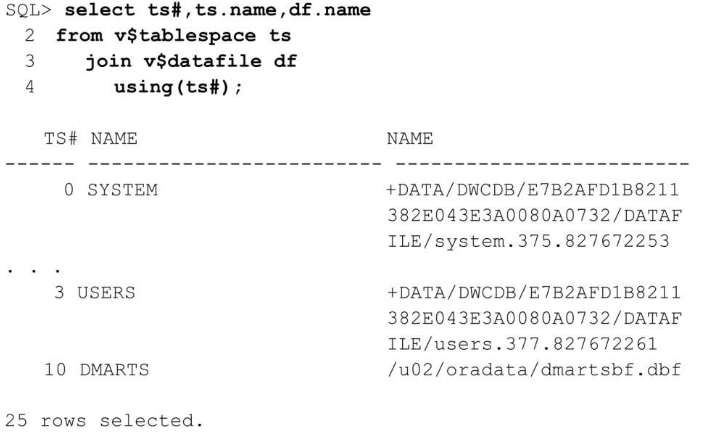

**目录**

[toc]

# 说明

此文章包含三个部分，第一部分主要介绍Oracle的体系结构，章节为1到4章。第二部分主要介绍Oracle数据库的管理，章节为5到11章。第三部分主要介绍高可用，章节为12到19章。

# 1 Oracle体系结构概述

本章将介绍Oracle 12c的基础知识和后面章节的一些特性，以及使用Oracle通用安装程序（Oracle Universal Installer，OUI）和数据库配置助手（Database Configuration Assistant，DBCA）安装Oracle 12c的基本知识。

学习完本章节，你将会对Oracle数据库有一个整体性的了解。

## 1.1 数据库和实例概述

相信很多人不清楚数据库和实例的关系，更有甚者以为数据库和实例是同一个东西的。实际上，他们间存在很大区别，是完全不同的实体，但又紧密相关。

数据库和实例架构图如下所示：


### 1.1.1 数据库

数据库是一组位于磁盘上用于存储数据的文件集。这些文件可以独立于数据库实例存在。如下图所示：


数据库由各种物理和逻辑结构组成，而表则是数据库中最重要的逻辑结构。“表”由包含相关数据的行和列组成。数据库至少要有存储有用信息的表。

组成数据库的文件主要分为两类：数据库文件和非数据库文件。两者之间的区别在于存储何种数据。数据库文件包含数据和元数据，非数据库文件则包含初始参数和日志记录信息等。

### 1.1.2 实例

实例是管理数据库文件的内存结构集合。由一个称为系统全局区SGA的共享内存区和一些后台进程组成。这些后台进程在SGA和磁盘上的数据库文件之间交互。实例可以独立存在于数据库文件之外。如下图所示：



Oracle实例架构分为单实例和RAC。

在单实例中，数据库和实例时一对一关系。

在Oracle RAC中，数据库和实例是一对多，一个数据可对应多个实例，即内存和后台进程每个实例独立，而数据库文件共享。

## 1.2 逻辑存储结构

Oracle数据库中的数据文件被分组到一个或多个表空间中。在每个表空间中，逻辑数据库结构（如表和索引）都是片段，被进一步细分为“盘区”（extent）和“块（block）”。这种存储的逻辑细分允许Oracle更有效地控制磁盘空间的利用率。如下图所示：


下面介绍逻辑结构的组成部分。他们之间的关系以及和物理结构的关系如下图所示：


**一、数据块（data block）**

数据块是Oracle数据库中最小的数据存储逻辑单元，即数据块是Oracle数据库可以使用或分配的最小存储单元。

块的大小是数据库内给定表空间中特定数量的存储字节，默认是8kb，通过初始参数DB_BLOCK _SIZE指定大小。数据库块大小需要是操作系统块大小的整数倍，有利于提升磁盘I/O的效率。

**二、区（extent）**

区是由一组逻辑连续的数据块组成，用于存储特定类型的信息。例如，一个24kb的区，默认由3个8kb的数据块组成。

**三、段（segment）**

段是为特定的数据库对象（例如表、索引等）分配的一组区的集合。每一个表、索引等数据库对象都是一个段。

段的分类：

1. 数据段：存储非集群表、表分区或表集群数据的段。如果表是分区表或集群表，则表会被分配多个段；
2. 索引段：存储非分区索引或分区索引数据的段；
3. 临时段：当一个SQL语句需要一个临时的数据库区域来完成执行时，Oracle数据库创建的一个段。例如，排序操作所需要的空间超过了PGA时，需要创建临时段完成排序；
4. 回滚段：在undo表空间中的段。

例如，employees表的数据存储在它自己的数据段中，而employees表的每一个索引存储在它自己的索引段中。

每一个需要存储的数据库对象由单个段组成。

**四、表空间（tablespace）**

表空间是包含一个或多个段的数据库存储单元。每一个段仅属于一个表空间，因此，一个段的所有区都存储在同一个表空间中。

在表空间内，一个段可以包含来自多个数据文件的区。例如，一个段的区有的存储在datafile1，也有的存储在datafile2。但是，一个区不能跨数据文件，只能存储于同一个数据文件中。根据以上特性，我们又可以知道，Oracle表空间(tablespace)由一个或多个数据文件组成，一个数据文件是且只能是一个表空间的一部分。

表空间的管理分为字典管理或本地管理。

## 1.3 逻辑数据库结构

## 1.3.1 表

表是Oracle数据库中的基本存储单位，表中的数据总是存储在行和列中。

下面介绍Oracle中不同类型的表。

**一、堆表★**

堆表（关系表）是数据库中最常见的表类型。关系表以“堆（heap）”的形式进行组织；换句话说，表中的行没按任何特定顺序存储。表的每一行包含一列或多列，每一列都有一种数据类型和长度。

**二、临时表★**

临时表仅保存在事务或会话期间存在的数据。临时表中的数据对会话是私有的，每个会话只能查看和修改自己的数据。

临时表分为全局临时表和私有临时表。他们的特点如下图所示：


**三、索引组织表**

创建索引可以更有效地找到表中的特定行，但是，这也会带来一些额外的系统开销。因为数据库必须同时维护表的数据行和索引条目。

如果表包含的列并不多，而且对表的访问主要集中在某一列上，应怎么做？这种情况下，索引组织表（Index Organized Table，IOT）可能就是正确的解决方案。

索引组织表的数据按主键排序手段被存储在B-树索引中，除了存储主键列值外还存储非键列的值。普通索引只存储索引列，而索引组织表则存储表的所有列的值。IOT不存在主键的空间开销，因为索引就是数据，数据就是索引，二者已经合二为一。

IOT最明显的优点在于只需要维护一个存储结构，而非两个。例如，表中主键的值只在IOT中存储一次，而在普通表中则需要存储两次。

索引组织表一般适应于静态表，且查询多以主键列。当表的大部分列当作主键列时，且表相对静态，比较适合创建索引组织表。

IOT适用的场合有：
1. 完全由主键组成的表；
2. 代码查找表，维度表；
3. 如果你想保证数据存储在某个位置上，或者希望数据以某种特定的顺序物理存储。

**四、对象表**

对象表是一种特殊类型的表，其中每一行代表一个对象。

Oracle对象类型是用户自定义的类型，具有名称、属性和方法。对象类型可以将真实世界的实体(如客户和采购订单)建模为数据库中的对象。

对象类型定义逻辑结构，但不创建存储。例如：

```sql
CREATE TYPE department_typ AS OBJECT
   ( d_name     VARCHAR2(100),
     d_address  VARCHAR2(200) );
/
```

下面创建department_typ类型的表，并插入一行记录：

```sql
CREATE TABLE departments_obj_t OF department_typ;
INSERT INTO departments_obj_t VALUES ('hr', '10 Main St, Sometown, CA');
```

**五、外部表**


外部表允许用户访问数据源，如文本文件，就如同该数据源是数据库中的表一样。表的元数据存储在Oracle数据字典中，但表的内容存储在外部。

当Oracle数据库应用程序必须访问非关系数据时，外部表非常有用。

但是，在外部表上不可以创建索引，也不可以对其执行插入、更新或删除操作。

创建外部表的例子：

要创建外部表的数据在两个文本文件empxt1.dat和empxt2.dat中。

empxt1.dat文件包含如下样例数据：
```dat
360,Jane,Janus,ST_CLERK,121,17-MAY-2001,3000,0,50,jjanus
361,Mark,Jasper,SA_REP,145,17-MAY-2001,8000,.1,80,mjasper
362,Brenda,Starr,AD_ASST,200,17-MAY-2001,5500,0,10,bstarr
363,Alex,Alda,AC_MGR,145,17-MAY-2001,9000,.15,80,aalda
```

empxt2.dat文件包含如下样例数据：

```dat
401,Jesse,Cromwell,HR_REP,203,17-MAY-2001,7000,0,40,jcromwel
402,Abby,Applegate,IT_PROG,103,17-MAY-2001,9000,.2,60,aapplega
403,Carol,Cousins,AD_VP,100,17-MAY-2001,27000,.3,90,ccousins
404,John,Richardson,AC_ACCOUNT,205,17-MAY-2001,5000,0,110,jrichard
```

在hr schema中创建名为admin_ext_employees的外部表： 
```sql
CONNECT  /  AS SYSDBA;
-- Set up directories and grant access to hr 
CREATE OR REPLACE DIRECTORY admin_dat_dir
    AS '/flatfiles/data'; 
CREATE OR REPLACE DIRECTORY admin_log_dir 
    AS '/flatfiles/log'; 
CREATE OR REPLACE DIRECTORY admin_bad_dir 
    AS '/flatfiles/bad'; 
GRANT READ ON DIRECTORY admin_dat_dir TO hr; 
GRANT WRITE ON DIRECTORY admin_log_dir TO hr; 
GRANT WRITE ON DIRECTORY admin_bad_dir TO hr;
-- hr connects. Provide the user password (hr) when prompted.
CONNECT hr
-- create the external table
CREATE TABLE admin_ext_employees
                   (employee_id       NUMBER(4), 
                    first_name        VARCHAR2(20),
                    last_name         VARCHAR2(25), 
                    job_id            VARCHAR2(10),
                    manager_id        NUMBER(4),
                    hire_date         DATE,
                    salary            NUMBER(8,2),
                    commission_pct    NUMBER(2,2),
                    department_id     NUMBER(4),
                    email             VARCHAR2(25) 
                   ) 
     ORGANIZATION EXTERNAL 
     ( 
       TYPE ORACLE_LOADER 
       DEFAULT DIRECTORY admin_dat_dir 
       ACCESS PARAMETERS 
       ( 
         records delimited by newline 
         badfile admin_bad_dir:'empxt%a_%p.bad' 
         logfile admin_log_dir:'empxt%a_%p.log' 
         fields terminated by ',' 
         missing field values are null 
         ( employee_id, first_name, last_name, job_id, manager_id, 
           hire_date char date_format date mask "dd-mon-yyyy", 
           salary, commission_pct, department_id, email 
         ) 
       ) 
       LOCATION ('empxt1.dat', 'empxt2.dat') 
     ) 
     PARALLEL 
     REJECT LIMIT UNLIMITED; 
-- enable parallel for loading (good if lots of data to load)
ALTER SESSION ENABLE PARALLEL DML;
-- load the data in hr employees table
INSERT INTO employees (employee_id, first_name, last_name, job_id, manager_id,
                       hire_date, salary, commission_pct, department_id, email) 
            SELECT * FROM admin_ext_employees;

```

**六、群集表**

如果经常同时访问两个或多个表（如一个订单表和一个行项明细表），则创建群集表（clustered table）可能是一种较好的方法，它可以改进引用这些表的查询的性能。在具有相关行项（line-item）明细表的订单表中，订单标题信息可与行项明细记录存储在同一个块中，从而减少检索订单和行项信息所需要的I/O数量。两个表共有的列也称为“群集键值”。

**七、散列群集**

作为特殊类型的群集表，散列群集（hash cluster）操作起来非常类似于普通的群集表，但是，它不使用群集索引，而使用散列函数来存储并检索表中的行。创建表时，将根据在创建群集期间指定的散列键的数量分配所需要的预估空间。

**八、排序的散列群集**

排序的散列群集是Oracle 10g中的新增内容。它们类似于普通的散列群集，通过使用散列函数来定位表中的行。然而，除此之外，排序的散列群集允许对表中的行根据表的一列或多列进行升序排列。如果遇到进行先进先出（First In First Out，FIFO）处理的应用程序，该方法就可以更快速地处理数据。

可以先创建群集本身，再创建排序的散列群集，但需要在群集中列定义的后面加上SORT位置参数。

**九、分区表★**

分区表对表进行分区或对索引进行分区（下一部分将介绍对索引进行分区）可帮助建立更便于管理的大型表。*Oracle公司建议，对于任何大于2GB的表，应尽量考虑对其进行分区。*

从DBA的观点看，进行分区有很多优点。如果表的一个分区位于已损坏的磁盘卷上，则在修复遭到破坏的卷时，用户仍可查询表的其他分区。与此类似，对分区的备份可以许多天进行一次，每次备份一个分区，而不需要一次性地对整个表进行备份。

分区大致有3种类型：范围分区、散列分区及列表分区。

**范围分区**，对于范围分区，它的分区键落在某一范围内。

**列表分区**，在列表分区中，分区键落在完全不同的值组中。

**散列分区**，散列分区根据散列函数将行赋给分区，只需要指定用于散列函数的一列或多列，不必将这些列显式赋予分区，而只需要指定有多少列可用。Oracle将行赋给分区，并确保每个分区中行的均匀分布。如果没有明确的列表分区或范围分区模式提供给表中的列类型，或者分区的相对大小经常改变，需要用户重复地手动调整分区模式，则散列分区就非常实用。

**组合分区**，使用组合分区可对分区进程进一步进行细分。例如，可先对表进行范围分区，然后在每个范围内，使用列表或散列进一步分区。

从Oracle 11g开始，也可以根据父／子关系进行分区，由应用程序控制分区，并可对基本分区类型进行很多组合，包括列表-散列、列表-列表、列表-范围和范围-范围等。分区表中的每一行能且只能存在于一个分区中。分区键为行指示正确的分区，它可以是组合键，最多可组合表中的16列。对可分区的表类型有一些次要的限制，例如，包含LONG或LONG RAW列的表不能进行分区。LONG限制极少会成为问题。LOB（包括字符大型对象CLOB和二进制大型对象BLOB）则灵活得多，包含LONG和LONG RAW数据类型的所有特性。

**十、分区索引★**

对表上的索引——或者符合索引表的分区模式（本地索引），或者独立于表的分区模式进行分区（全局索引）。删除分区时全局索引会失效，需要重建。

## 1.3.2 约束

Oracle约束（constraint）是一条或多条规则，它在表的一列或多列上定义，用于帮助实施业务规则。例如，约束可强制实现雇员起薪不得低于$25 000.00这样的业务规则。

共有6种数据完整性规则可应用于表列：非空、唯一性、主键、外键、检查和基于触发器的完整性。

可在创建时或将来的任意时间点启用或禁用约束；启用或禁用（使用关键字ENABLE或DISABLE）约束时，根据有效的业务规则，可能需要也可能不需要验证（使用关键字VALIDATE或NOVALIDATE）表中已有数据是否满足约束。

以下创建的表具有所有约束类型：
```sql
create table cust_order (
  order_number number(6) primary key,
  order_date date NOT null,
  delivery_date date,
  warehouse_number number default 12,
  customer_number number NOT null,
  order_line_item_qty number check (order_line_item_qty < 100),
  ups_tracking_number varchar2(50) unique,
  foreign key (customer_number) references customer(customer_number)
);
```

基于上表，下面将介绍每种约束:
1. **非空约束：**
   可防止将NULL值输入ORDER_DATE列或CUSTOMER_NUMBER列。从业务规则的角度看，这样做很有意义：每个订单都必须有订购日期，而只有在顾客下订单时，订单才有意义。

   注意，列中的NULL值并不意味着值为空或0；准确地讲，该值不存在。NULL值不等同于任何内容，甚至不等同于另一个NULL值。在对可能具有NULL值的列使用SQL查询时，这个概念非常重要。

2. **唯一性约束：**
   确保一列或一组列（通过组合约束）在整个表中是唯一的，UPS_TRACKING_NUMBER列将不包含重复值。为强制实施约束，Oracle将在UPS_TRACKING_NUMBER列上创建唯一索引。如果该列上已有一个有效的唯一索引，Oracle将使用该索引来实施约束。

   具有UNIQUE约束的列也可声明为NOT NULL。如果没有声明该列具有NOT NULL约束，则任意数量的行都可以具有NULL值，只要剩余的行在该列中具有唯一值。在允许一列或多列具有NULL值的组合唯一约束中，非NULL值的列用于确定是否满足约束。NULL列总满足约束，因为NULL值不等同于任何内容。

3. **主键约束：**
   是数据库表中最常见的约束类型。一个表上最多只能存在一个主键约束，组成主键的列不能有NULL值。ORDER_NUMBER列是主键。系统将创建唯一索引以实施该约束，如果该列已存在可用的唯一索引，主键约束就使用该索引。

4. **外键约束：**
   比上述任何一种约束都更复杂，因为它依赖于另一个表来限制哪些值可以输入到具有引用完整性约束的列中。在CUSTOMER_NUMBER列上声明外键（FOREIGN KEY）；输入该列的值必须也存在于另一个表（在这种情况下是CUSTOMER表）的CUSTOMER_NUMBER列中。

   此外，FOREIGN KEY约束可以自引用。在主键为EMPLOYEE_NUMBE的EMPLOYEE表中，MANAGER_NUMBER列具有根据同一个表中的EMPLOYEE_NUMBER列声明的外键，这就允许在EMPLOYEE表自身中创建一个报告层次结构。

   应该总在外键（FOREIGN KEY）列上声明索引以改进性能，该规则的唯一例外出现在绝对不会更新或删除父表中的引用主键或唯一键时。
   
5. **检查约束：**
   通过使用CHECK约束，可在列级别实施更复杂的业务规则。在前面的示例中，ORDER_LINE_ITEM_QTY列不得超出99。
   
   CHECK约束可使用插入或更新的行中的其他列来评估约束。例如，STATE_CD列上的约束只有在COUNTRY_CD列的值不为USA时才允许NULL值。

   一列上允许有多个CHECK约束。只有在所有的CHECK约束都计算为TRUE时，才允许将值输入列中。
   
6. **基于触发器的完整性约束**
   如果业务规则过于复杂，使用唯一性约束很难实现，则可使用CREATE TRIGGER命令在表上创建一个数据库触发器，同时使用一个PL/SQL代码块实施这一业务规则。当引用的表存在于不同的数据库中时，需要使用触发器来实施引用完整性约束。触发器也可用于许多超出约束检查领域的情况（例如，对表的审核访问）。

### 1.3.3 索引

当检索表中少量的行时，使用Oracle索引能更快访问表中的这些行。索引存储了进行索引的列的值，同时存储包含索引值的行的物理ROWID，唯一的例外是索引组织表（Index-Organized Table，IOT），它使用主键作为逻辑ROWID。可在一列或多列上创建索引。索引条目存储在B-树结构中，因此遍历索引以找到行的键值只需要使用非常少的I/O操作。一旦在索引中找到匹配值，索引中的ROWID就会指向表行的确切位置：哪个文件、文件中的哪个块，以及块中的哪一行。

下面将介绍最常见的索引类型的重点内容和特性：
1. **唯一索引：**
   唯一索引是最常见的B-树索引形式。它常用于实施表的主键约束。唯一索引确保索引的一列或多列中不存在重复值。

   例如，可在EMPLOYEE表中Social Security Number（社会保障号）的对应列上创建唯一索引，因为该列中不应有任何重复值。然而，一些雇员可能没有Social Security Number，因此该列可以包含NULL值。

2. **非唯一索引：**
   非唯一索引帮助提高访问表的速度，而不会强制实施唯一性。例如，可在EMPLOYEE表的LAST_NAME列上创建非唯一索引，从而提高按姓查找的速度。但对于任何给定的姓，确实可以有许多重复的值。

3. **反向键索引：**
   反向键索引（reverse key index）是特殊类型的索引，在反向键索引中，反向每列的索引键值中的所有字节。一般用于OLTP（OnlineTransaction Processing，联机事务处理）环境中。

   在CREATE INDEX命令中，使用REVERSE关键字指定反向键索引。下面是创建反向键索引的一个示例：
   ```sql
   create index ie_line_item_order_number on line_item (order_number) reverse;
   ```

4. **基于函数的索引：**
   基于函数的索引类似于标准的B-树索引，不同之处在于它将被声明为表达式的列的变换形式存储在索引中，而非存储列自身。

   下面的示例在EMPLOYEE表的LAST_NAME列上创建基于函数的索引：
   ```sql
   create index up_name on employee(upper(last_name));
   ```

   因此，使用如下查询的搜索将使用前面创建的索引，而不是进行完整的表扫描：
   ```sql
   select employee_number, last_name, first_name, from employee where upper(last_name) = 'SMITH';
   ```

5. **位图索引：**
   在索引的叶节点上，位图索引（bitmap index）的结构与B-树索引相比存在着较大的区别。它只存储索引列每个可能值（基数）的一个位串，位串的长度与索引表中的行数相同。
   
   **在索引列具有较低基数或大量不同的值时，使用位图索引才最有效**。例如，PERS表中的GENDER列将有NULL、M或F值。GENDER列上的位图索引将只有3个位图存储在索引中。

   与传统索引相比，位图索引不仅可节省大量空间，还可大大缩短响应时间，因为在需要访问表自身之前，Oracle就可以从包含多个WHERE子句的查询中快速删除潜在的行。对于多个位图，可使用逻辑AND和OR操作来确定访问表中的哪些行。

   **注意**：位图索引只在Oracle 11g和12c的企业版中可用。由于在表上执行DML时，位图索引包含额外的锁定和块拆分开销，因此仅适用于极少更新的列。

### 1.3.4 视图

视图允许用户查看单独表或多个连接表中数据的自定义表示。视图也称为“存储查询”：用户无法看到视图底层隐藏的查询细节。普通视图不存储任何数据，只存储定义，在每次访问视图时都运行底层的查询。

普通视图的增强称为“物化视图（materialized view）”，允许同时存储查询的结果和查询的定义，从而加快处理速度。

对象视图类似于传统视图，可隐藏底层表连接的细节，并允许在数据库中进行面向对象的开发和处理，而底层的表仍然保持数据库关系表的格式。

下面将介绍创建并使用的基本视图类型的基础知识。

**一、普通视图**

普通视图，通常称为“视图”，不会占据任何存储空间，只有它的定义（查询）存储在数据字典中。视图底层查询的表称为“基表”，视图中的每个基表都可以进一步定义为视图。

视图有很多优点，它可以隐藏数据复杂性。高级分析人员可以定义包含EMPLOYEE、DEPARTMENT和SALARY表的视图，这样上层管理部门可以更容易地使用SELECT语句检索有关雇员薪水的信息，这种检索表面看来是使用表，但实际上是包含查询的视图，该查询连接EMPLOYEE、DEPARTMENT和SALARY表。

视图也可以用于实施安全性。EMPLOYEE表上的视图EMP_INFO包含除了SALARY（薪水）外的所有列，并且将该视图定义为只读，从而防止更新该表:
```sql
create view emp_info 
  as
    select  employee_number, last_name, first_name, middle_initial, surname
       from employee
  with read only;
```

如果没有READ ONLY子句，则可更新某行或向视图中添加行，甚至可在包含多个表的视图上执行这些操作。视图中有一些构造可防止对其进行更新，例如使用DISTINCT操作符、聚集函数或GROUP BY子句。

**二、物化视图**

物化视图与普通视图非常类似，视图的定义存储在数据字典中，并且该视图对用户隐藏底层基查询的细节。不同之处在于，物化视图也在数据库段中分配空间，用于保存执行基查询得到的结果集。

物化视图可用于将表的只读副本复制到另一个数据库，该副本具有和基表相同的列定义和数据。这是物化视图的最简单实现。为减少刷新物化视图时的响应时间，可创建物化视图日志以刷新物化视图。否则，在需要刷新时就必须进行完全的刷新：必须运行基查询的全部结果以刷新物化视图。物化视图日志为以增量方式更新物化视图提供了方便。

物化视图在很多方面与索引类似，它们都直接和表联系并且占用空间，在更新基表时必须刷新它们，它们的存在对用户而言实际上是透明的。通过使用可选的访问路径来返回查询结果，它们可以帮助优化查询。

**三、对象视图**

面向对象（OO）的应用程序开发环境日趋流行，Oracle 12c数据库完全支持数据库中本地化对象和方法的实现。然而，从纯粹的关系数据库环境向纯粹的OO数据库环境迁移并非易事，很少有组织愿意花费时间和资源从头开始构建新的系统，而Oracle 12c使用对象视图使这种迁移变得更为容易。

对象视图允许面向对象的应用程序查看作为对象集合的数据，这种对象集合具有属性和方法，而遗留系统仍可对INVENTORY表运行批处理作业。对象视图可以模仿抽象数据类型、对象标识符（OID）以及纯粹的OO数据库环境能够提供的引用。

### 1.3.5 用户和模式

## 1.4 物理存储结构
## 1.5 多元复用数据库文件
## 1.6 内存结构
## 1.7 备份和恢复概述
## 1.8 安全功能
## 1.9 实时应用集群
## 1.10 流
## 1.11 企业管理器
## 1.12 初始化参数
## 1.13 本章小结

# 2 安装和升级Oracle Database 19c

## 2.1 安装19c

参见：

## 2.2 升级到19c

参见：

# 3 表空间管理

# 4 物理数据库布局和存储管理
## 4.1 传统磁盘空间存储
## 4.2 自动存储管理

### 4.2. 准备 ASM 磁盘

一、关闭虚拟机后，进入虚拟机目录创建将要用于 asm 的磁盘（一般为偶数个，且大小一样）。


二、启动后检查安装后的磁盘情况：
```bash
[root@19c-Grid grid]# lsblk
NAME   MAJ:MIN RM  SIZE RO TYPE MOUNTPOINT
sdf      8:80   0    1G  0 disk
`-sdf1   8:81   0 1023M  0 part
sdd      8:48   0    1G  0 disk
`-sdd1   8:49   0 1023M  0 part
sdb      8:16   0    1G  0 disk
`-sdb1   8:17   0 1023M  0 part
sdk      8:160  0    2G  0 disk
sdi      8:128  0    1G  0 disk
`-sdi1   8:129  0 1023M  0 part
sr0     11:0    1  4.5G  0 rom
sdg      8:96   0    1G  0 disk
`-sdg1   8:97   0 1023M  0 part
sde      8:64   0    1G  0 disk
`-sde1   8:65   0 1023M  0 part
sdc      8:32   0    1G  0 disk
`-sdc1   8:33   0 1023M  0 part
sda      8:0    0   80G  0 disk
|-sda2   8:2    0    8G  0 part [SWAP]
|-sda3   8:3    0   71G  0 part /
`-sda1   8:1    0    1G  0 part /boot
sdj      8:144  0    2G  0 disk
sdh      8:112  0    1G  0 disk
`-sdh1   8:113  0 1023M  0 part


[root@19c-Grid dev]# ll /dev/sdj /dev/sdk
brw-rw---- 1 root disk 8, 144 Oct 15 17:53 /dev/sdj
brw-rw---- 1 root disk 8, 160 Oct 15 17:40 /dev/sdk
```

新添加的磁盘为sdj和sdk。

三、配置 udev：

方法1：
```bash
[root@19c-Grid dev]# fdisk /dev/sdj
Welcome to fdisk (util-linux 2.23.2).

Changes will remain in memory only, until you decide to write them.
Be careful before using the write command.

Device does not contain a recognized partition table
Building a new DOS disklabel with disk identifier 0x8257eb7d.

Command (m for help): n
Partition type:
   p   primary (0 primary, 0 extended, 4 free)
   e   extended
Select (default p): p
Partition number (1-4, default 1): 1
First sector (2048-4194303, default 2048):
Using default value 2048
Last sector, +sectors or +size{K,M,G} (2048-4194303, default 4194303):
Using default value 4194303
Partition 1 of type Linux and of size 2 GiB is set

Command (m for help): w
The partition table has been altered!

Calling ioctl() to re-read partition table.
Syncing disks.


[root@19c-Grid dev]# lsblk | grep sdj
sdj      8:144  0    2G  0 disk
`-sdj1   8:145  0    2G  0 part
```


方法2：
```bash
[root@19c-Grid dev]# echo -e "n\np\n1\n\n\nw" | fdisk /dev/sdk
Welcome to fdisk (util-linux 2.23.2).

Changes will remain in memory only, until you decide to write them.
Be careful before using the write command.

Device does not contain a recognized partition table
Building a new DOS disklabel with disk identifier 0x3ae728d3.

Command (m for help): Partition type:
   p   primary (0 primary, 0 extended, 4 free)
   e   extended
Select (default p): Partition number (1-4, default 1): First sector (2048-4194303, default 2048): Using default value 2048
Last sector, +sectors or +size{K,M,G} (2048-4194303, default 4194303): Using default value 4194303
Partition 1 of type Linux and of size 2 GiB is set

Command (m for help): The partition table has been altered!

Calling ioctl() to re-read partition table.
Syncing disks.

```
ps：`\n`为回车。

四、查询这些磁盘的 scsi id
```bash
[root@19c-Grid dev]# /usr/lib/udev/scsi_id -g -u -d /dev/sdj1
36000c29abe0877e28fe0ca0aeac43783
[root@19c-Grid dev]# /usr/lib/udev/scsi_id -g -u -d /dev/sdk1
36000c29f94e948b7aecb0c16450997bd
```

五、编辑udev规则文件 /etc/udev/rules.d/99-oracle-asmdevices.rules
```bash
[root@19c-Grid rules.d]# vim 99-oracle-asmdevices.rules
KERNEL=="sd?1", SUBSYSTEM=="block", PROGRAM=="/usr/lib/udev/scsi_id --whitelisted --replace-whitespace --device=/dev/$parent", RESULT=="36000c29abe0877e28fe0ca0aeac43783", SYMLINK+="asmdisks/asmdisk09", OWNER="grid", GROUP="asmadmin", MODE="0660"
KERNEL=="sd?1", SUBSYSTEM=="block", PROGRAM=="/usr/lib/udev/scsi_id --whitelisted --replace-whitespace --device=/dev/$parent", RESULT=="36000c29f94e948b7aecb0c16450997bd", SYMLINK+="asmdisks/asmdisk10", OWNER="grid", GROUP="asmadmin", MODE="0660"
```

六、启动 udev
```bash
[root@19c-Grid rules.d]# /sbin/partprobe /dev/sdj1
[root@19c-Grid rules.d]# /sbin/partprobe /dev/sdk1
[root@19c-Grid rules.d]# /sbin/udevadm trigger --type=devices --action=change
```

七、检查磁盘状态
```bash
[root@19c-Grid dev]# ll /dev/sdj1  /dev/sdk1
brw-rw---- 1 grid asmadmin 8, 145 Oct 15 18:16 /dev/sdj1
brw-rw---- 1 grid asmadmin 8, 161 Oct 15 18:14 /dev/sdk1


[root@19c-Grid dev]# ll /dev/asmdisks/asmdisk09 /dev/asmdisks/asmdisk10
lrwxrwxrwx 1 root root 7 Oct 15 18:16 /dev/asmdisks/asmdisk09 -> ../sdj1
lrwxrwxrwx 1 root root 7 Oct 15 18:14 /dev/asmdisks/asmdisk10 -> ../sdk1
```

**ASM磁盘添加完毕！！**

# 5 开发和实现应用程序
# 6 监控空间利用率
# 7 使用和撤销表空间管理事务
# 8 数据库调整
# 9 In-Memory概述
# 10 数据库安全性和审核

# 11 性能优化
## 11.1 swingbench 工具
用于Oracle压力测试
安装
[](https://github.com/domgiles/swingbench-public)
需要java 11环境和Oracle客户端

1.首先下载java11
yum search java-11-openjdk

1.1 选择相应版本（本人是x86_64）
arch 或者 uname -a

1.2 进行下载
yum install java-11-openjdk.x86_64 -y

java -version

2.查看java11下载位置
```sql
ls -rl $(which java)
```


# 13 备份和恢复选项
## 13.1 备份功能

可采用3种标准方法备份Oracle数据库：导出、脱机备份和联机备份。

导出是数据库的逻辑备份，其他两种备份方法是物理文件备份。下面将描述每种选项。用于物理备份的优先考虑的标准工具是Oracle的恢复管理器（Recovery Manager，RMAN）实用程序，有关RMAN的实现和用法的详细信息，请参阅下一章。

健壮的备份策略应包括物理备份和逻辑备份。一般而言，产品数据库将物理备份作为它们的主要备份方法，而将逻辑备份作为次要备份方法。对于开发数据库和某些小型的数据移动处理，逻辑备份是一种可行的解决方案。你应该理解物理和逻辑两种备份方法的内涵和用法，以便开发最合适的应用程序解决方案。

## 13.2 逻辑备份

对一个数据库进行逻辑备份包括读取一组数据库记录并将它们写入一个文件中，这些记录的读取与它们的物理位置无关。在Oracle中，Data Pump Export实用程序执行此类数据库备份。为恢复使用由Data Pump Export实用程序生成的文件，应使用Data Pump Import。

逻辑备份允许DBA或用户获取单个数据库对象在某个特定时间点时的内容，当完整的数据库还原操作对数据库的其余部分影响过大时，逻辑备份提供了一种可替换的恢复选项。

## 13.3 物理备份

物理备份要复制构成数据库的文件，这些备份也称作“文件系统备份”，因为它们涉及使用操作系统文件备份命令。Oracle支持两种不同类型的物理文件备份：脱机备份和联机备份，也分别称为“冷备份”和“热备份”。

数据库的物理备份可确保不会丢失已提交的事务，并且我们可将数据库从任何以前的备份恢复到当前的时间点或者中间的任何时间点。

可使用RMAN实用程序来执行所有的物理备份。可酌情编写你自己的脚本程序来执行物理备份，但这样做无法利用RMAN方法带来的诸多好处。

## 13.4 使用Data Pump Export和Data Pump Import（数据泵）

Oracle Database 10g引入的Data Pump提供了一种基于服务器的数据提取和数据导入实用程序。Data Pump的特点是在体系结构和功能上显著增强了原有的Import和Export实用程序。Data Pump允许停止和重启作业，查看运行作业的状态，以及限制导出和导入的数据。

数据泵是常有的逻辑备份和恢复的工具，也可以用于数据迁移，不能用于介质恢复。

expdp 导出  
impdp 导入

### 13.4.1 创建目录
Data Pump要求为将要创建和读取的数据文件和日志文件创建目录。使用CREATE DIRECTORY命令在Oracle内创建目录指针，指向将使用的外部目录。将要访问Data Pump文件的用户必须拥有该目录的READ和WRITE权限。在开始操作前，要验证外部目录是否存在，而且发出CREATE DIRECTORY命令的用户需要拥有CREATE ANY DIRECTORY系统权限。

注意：在Oracle Database 19c默认安装中，创建了一个称为DATA_PUMP_DIR的目录对象，在多租户环境中，该对象指向目录$ORACLE_BASE/admin/database_name/dpdump。

```sql
[oracle@19c-Grid dpdump]$ cat /u01/app/oracle/admin/lucdb/dpdump/dp.log
Data Pump default directory object created:
directory object name: DATA_PUMP_DIR
Path: /u01/app/oracle/admin/lucdb/dpdump/
creation date: 06-OCT-2023 02:29
```

下例在Oracle实例lucdb中创建了一个名为`DUMP_DIR`的目录对象：
```sql
[oracle@19c-Grid dpdump]$ mkdir -p /home/oracle/tmp

SYS@lucdb(CDB$ROOT)> create directory dump_dir as '/home/oracle/tmp';

col directory_name form a30
col directory_path form a60
SYS@lucdb(CDB$ROOT)> select directory_name,directory_path from dba_directories;

DIRECTORY_NAME                 DIRECTORY_PATH
------------------------------ ------------------------------------------------------------
DUMP_DIR                       /home/oracle/tmp
```

### 13.4.2 expdp 导出

#### 13.4.2.1 expdp 参数

查看导出帮助：
```bash
expdp help=y | more
```

下面列出一些常用的参数：
```bash
The available keywords and their descriptions follow. Default values are listed within square brackets.

ATTACH
Attach to an existing job.
For example, ATTACH=job_name.

CONTENT
Specifies data to unload.
Valid keyword values are: [ALL], DATA_ONLY and METADATA_ONLY.

DIRECTORY
Directory object to be used for dump and log files.

DUMPFILE
Specify list of destination dump file names [expdat.dmp].
For example, DUMPFILE=scott1.dmp, scott2.dmp, dmpdir:scott3.dmp.

ESTIMATE_ONLY
Calculate job estimates without performing the export [NO].

INCLUDE
Include specific object types.
For example, INCLUDE=TABLE_DATA.

EXCLUDE
Exclude specific object types.
For example, EXCLUDE=SCHEMA:"='HR'".

FILESIZE
Specify the size of each dump file in units of bytes.

FLASHBACK_TIME
Time used to find the closest corresponding SCN value.

FLASHBACK_SCN
SCN used to reset session snapshot.

FULL
Export entire database [NO].

HELP
Display Help messages [NO].

JOB_NAME
Name of export job to create.

LOGFILE
Specify log file name [export.log].

NOLOGFILE
Do not write log file [NO].

NETWORK_LINK
Name of remote database link to the source system.

PARALLEL
Change the number of active workers for current job.

PARFILE
Specify parameter file name.

QUERY
Predicate clause used to export a subset of a table.
For example, QUERY=employees:"WHERE department_id > 10".

SCHEMAS
List of schemas to export [login schema].

STATUS
Frequency (secs) job status is to be monitored where
the default [0] will show new status when available.

TABLES
Identifies a list of tables to export.
For example, TABLES=HR.EMPLOYEES,SH.SALES:SALES_1995.

TABLESPACES
Identifies a list of tablespaces to export.

TRANSPORT_FULL_CHECK
Verify storage segments of all tables [NO].

TRANSPORT_TABLESPACES
List of tablespaces from which metadata will be unloaded.


------------------------------------------------------------------------------
The following commands are valid while in interactive mode.
Note: abbreviations are allowed.

ADD_FILE
Add dumpfile to dumpfile set.

CONTINUE_CLIENT
Return to logging mode. Job will be restarted if idle.

EXIT_CLIENT
Quit client session and leave job running.

FILESIZE
Default filesize (bytes) for subsequent ADD_FILE commands.

HELP
Summarize interactive commands.

KILL_JOB
Detach and delete job.

PARALLEL
Change the number of active workers for current job.

REUSE_DUMPFILES
Overwrite destination dump file if it exists [NO].

START_JOB
Start or resume current job.
Valid keyword values are: SKIP_CURRENT.

STATUS
Frequency (secs) job status is to be monitored where
the default [0] will show new status when available.

STOP_JOB
Orderly shutdown of job execution and exits the client.
Valid keyword values are: IMMEDIATE.

STOP_WORKER
Stops a hung or stuck worker.

TRACE
Set trace/debug flags for the current job.
```

#### 13.4.2.2 expdp导出示例

```bash
-- 全库导出 full=y
expdp \'sys/sys@localhost:1321/pdb1 as sysdba\' full=y dumpfile=pdb1_full_20231012.dmp directory=dump_dir;
pwd
/home/oracle/tmp
ll
total 3936
-rw-r--r-- 1 oracle asmadmin   10789 Oct 12 01:31 export.log
-rw-r----- 1 oracle asmadmin 4018176 Oct 12 01:31 pdb1_full_20231012.dmp

-- schemas 按用户导出
expdp \'sys/sys@localhost:1321/pdb1 as sysdba\' schemas=hr dumpfile=expdp_hr.dmp directory=dump_dir logfile=expdp_hr.log;

--普通用户执行
grant create any directory to hr;
expdp \'hr/hr@localhost:1321/pdb1\' schemas=hr dumpfile=expdp_hr.dmp directory=dump_dir;

--按表空间导出
expdp \'sys/sys@pdb1 as sysdba\' tablespaces=users dumpfile=expdp_ts_users.dmp directory=dump_dir

--导出两张表
expdp \'hr/hr@pdb1\' tables=employees,dept dumpfile=expdp_tab_ed.dmp directory=dump_dir logfile=expdp_tab_ed.log

--按查询条件导出
expdp \'hr/hr@pdb1\' tables=employees QUERY=employees:"WHERE department_id > 10" dumpfile=expdp_tab_emp1.dmp directory=dump_dir

--估算导出的数据量
[oracle@19c-Grid tmp]$ expdp \'sys/sys@localhost:1321/pdb1 as sysdba\' full=y estimate_only=y

Estimate in progress using BLOCKS method...
...
Total estimation using BLOCKS method: 3.859 MB
```

### 13.4.3 impdp 导入
#### 13.4.3.1 impdp 参数

查看导入帮助：
```bash
impdp help=y | more
```

常用参数和expdp差不多。

#### 13.4.3.1 impdp导入示例

```bash
--1 查询表
SYS@lucdb(CDB$ROOT)> select object_id,object_name from hr.demo;
 OBJECT_ID OBJECT_NAME
---------- ---------------
         9 I_FILE#_BLOCK#
        38 I_OBJ3
2 rows selected.

--2 导出表
[oracle@19c-Grid tmp]$ expdp \'hr/hr@pdb1\' tables=demo dumpfile=expdp_tab_demo.dmp directory=dump_dir logfile=expdp_tab_demo.log

--3 删除表
SYS@lucdb(CDB$ROOT)> drop table hr.demo;
Table dropped.

--4 导入表
[oracle@19c-Grid tmp]$ impdp \'hr/hr@pdb1\' tables=demo dumpfile=expdp_tab_demo.dmp directory=dump_dir;

--5 删除的表导入后存在
SYS@lucdb(CDB$ROOT)> select object_id,object_name from hr.demo;
 OBJECT_ID OBJECT_NAME
---------- ---------------
         9 I_FILE#_BLOCK#
        38 I_OBJ3
2 rows selected.
```


### 13.4.4 交互模式

导入导出过程中用`ctrl+c`进行交互模式

在交互模式下使用`help`查看帮助，可以查看参数等信息。

示例：
```bash
[oracle@19c-Grid tmp]$ expdp \'sys/sys@localhost:1321/pdb1 as sysdba\' full=y dumpfile=pdb1_full_20231012.dmp directory=dump_dir;

Export: Release 19.0.0.0.0 - Production on Fri Oct 13 00:19:10 2023
Version 19.3.0.0.0

Copyright (c) 1982, 2019, Oracle and/or its affiliates.  All rights reserved.

Connected to: Oracle Database 19c Enterprise Edition Release 19.0.0.0.0 - Production
Starting "SYS"."SYS_EXPORT_FULL_01":  "sys/********@localhost:1321/pdb1 AS SYSDBA" full=y dumpfile=pdb1_full_20231012.dmp directory=dump_dir
Processing object type DATABASE_EXPORT/EARLY_OPTIONS/VIEWS_AS_TABLES/TABLE_DATA
^C
Export> status

Job: SYS_EXPORT_FULL_01
  Operation: EXPORT
  Mode: FULL
  State: EXECUTING
  Bytes Processed: 0
  Current Parallelism: 1
  Job Error Count: 0
  Job heartbeat: 1
  Dump File: /home/oracle/tmp/pdb1_full_20231012.dmp
    bytes written: 4,096

Worker 1 Status:
  Instance ID: 1
  Instance name: lucdb
  Host name: 19c-Grid
  Object start time: Friday, 13 October, 2023 0:19:28
  Object status at: Friday, 13 October, 2023 0:19:31
  Process Name: DW00
  State: EXECUTING

Export>

Export> parallel=2

Export> status

Job: SYS_EXPORT_FULL_01
  Operation: EXPORT
  Mode: FULL
  State: EXECUTING
  Bytes Processed: 0
  Current Parallelism: 2
  Job Error Count: 0
  Job heartbeat: 3
  Dump File: /home/oracle/tmp/pdb1_full_20231012.dmp
    bytes written: 114,688

Worker 1 Status:
  Instance ID: 1
  Instance name: lucdb
  Host name: 19c-Grid
  Object start time: Friday, 13 October, 2023 0:20:54
  Object status at: Friday, 13 October, 2023 0:21:03
  Process Name: DW00
  State: EXECUTING

Export> continue_client
Processing object type DATABASE_EXPORT/NORMAL_OPTIONS/TABLE_DATA

...

Master table "SYS"."SYS_EXPORT_FULL_01" successfully loaded/unloaded
******************************************************************************
Dump file set for SYS.SYS_EXPORT_FULL_01 is:
  /home/oracle/tmp/pdb1_full_20231012.dmp
Job "SYS"."SYS_EXPORT_FULL_01" successfully completed at Fri Oct 13 00:23:42 2023 elapsed 0 00:04:31

```


### 13.4.5 exp 和 imp
exp 和 imp 是 ORACLE 幸存的最古老的两个命令行工具，可以把它作为小型
数据库的物理备份后的一个逻辑辅助备份。对于越来越大的数据库，EXP/IMP
越来越力不从心。

```bash
--查看帮助
exp help=y

--完全模式
exp sys/sys@pdb1 buffer=64000 file=/home/oracle/tmp/full.dmp full=y

--用户模式,这样用户hr的所有对象被输出到文件中
exp hr/hr buffer=64000 file=/home/oracle/tmp/hr.dmp owner=hr
EXP-00056: ORACLE error 1017 encountered
ORA-01017: invalid username/password; logon denied
Username: hr@pdb1
Password:

--表模式：
exp hr/hr@pdb1 tables=emp file=/home/oracle/tmp/dept.dmp
```

### 13.4.5 exp/imp 与 expdp/impdp 的区别
1、exp 和 imp 是客户端工具程序，它们既可以在客户端使用，也可以在服务端使用。

2、expdp 和 impdp 是服务端的工具程序，他们只能在 Oracle 服务端使用，不能在客户端使用。

3、imp 只适用于 exp 导出的文件，不适用于 expdp 导出文件；impdp 只适用于 expdp 导出的文件，而不适用于 exp 导出文件。

4、对于 10g 以上的服务器，使用 exp 通常不能导出 0 行数据的空表，而此时必须使用 expdp 导出。

## 13.5 实现脱机备份（冷备份）

冷备份是指关闭数据库的备份，又称脱机备份或一致性备份，在冷备份开始前数据库必须彻底关闭。脱机备份是指在通过SHUTDOWN NORMAL、SHUTDOWN IMMEDIATE或SHUTDOWN TRANSACTIONAL命令关闭数据库后对数据库文件所执行的物理备份。当关闭数据库时，将备份数据库正在使用的每个文件。这些文件为该数据库提供了一个在关闭它时存在期间的完整映像。

冷备份通常适用于业务具有阶段性的企业，比如白天运行、夜间可以停机维护的企业，冷备份操作简单，但是需要关闭数据库，对于需要24×7提供服务的企业是不适用的。

在冷备份过程中应备份以下文件：
1. 所有数据文件
2. 所有控制文件
3. 所有归档的重做日志文件
4. 初始化参数文件或服务器参数文件（SPFILE）
5. 密码文件

在恢复期间，脱机备份可将数据库恢复到它关闭时的状态。脱机备份一般用于灾难恢复计划中，因为它们是自包含的，并且在灾难恢复服务器上它们比其他类型的备份更容易还原。如果数据库正运行在ARCHIVELOG模式下，则可将最近归档的重做日志应用于还原的脱机备份，以便将数据库恢复到发生介质故障或数据库完全丢失时的时间点。

贯穿全书一直强调的一点是，如果使用RMAN，则消除或最小化了冷备份的需要。你的数据库可能从来不需要关机进行冷备份（除非遇到灾难——在此情况下也要确保创建RAC数据库）。

### 13.5.1 冷备份操作

以下几个查询在备份之前应当执行，以确认数据库文件及存储路径：
```sql
SQL> select name from v$datafile;

SQL> select member from v$logfile;

SQL> select name from v$controlfile;
```

冷备份的通常步骤是：

1. 正常关闭数据库；
2. 备份所有**重要**的文件到备份目录；
3. 完成备份后启动数据库。

为了恢复方便，冷备份应该包含所有的数据文件、控制文件和日志文件，这样当需要采用冷备份进行恢复时，只需要将所有文件恢复到原有位置，就可以启动数据库了。

```bash
--正常关闭数据库
SYS@lucdb(CDB$ROOT)> shutdown immediate;

--跳转到oracle用户
su - oracle 

--1 复制控制文件到指定目录
cp /u01/app/oracle/oradata/YUAN/control01.ctl /home/oracle/tmp/ctl

--2 复制数据文件到指定的目录
cp /u01/app/oracle/oradata/YUAN/*.dbf /home/oracle/tmp/dbf

--3 复制redo日志文件到指定目录
cp /oradata/orcl/redo*.log /home/oracle/tmp/redo

--4 复制参数文件到指定目
cp /u01/app/oracle/product/19.0.0/db_1/dbs/*.ora /home/oracle/tmp/dbs

--5 口令文件
cp /u01/app/oracle/product/19.0.0/db_1/dbs/orapwlucdb /home/oracle/tmp/dbs
```


### 13.5.2 用冷备份恢复

启动失败时恢复：

```bash
--1 控制文件恢复：
--当有多个控制文件的时候，丢失一个控制文件，可以拷贝其他的控制文件拷贝生成
host cp /u01/app/oracle/oradata/YUAN/control02.ctl /u01/app/oracle/oradata/YUAN/control01.ctl
--也可以使用备份的文件生成
host cp /home/oracle/tmp/control01.ctl /u01/app/oracle/oradata/YUAN/control01.ctl

--2 数据文件：
host cp /home/oracle/tmp/?.dbf /u01/app/oracle/oradata/YUAN/

--3 重做日志文件
host cp /home/oracle/tmp/redo /oradata/orcl/

--4 参数文件
host cp /home/oracle/tmp/dbs/*.ora /u01/app/oracle/product/19.0.0/db_1/dbs/

--5 口令文件
host cp /home/oracle/tmp/dbs/orapwlucdb /u01/app/oracle/product/19.0.0/db_1/dbs/
```

## 13.6 实现联机备份 （热备份）
由于冷备份需要关闭数据库，所以已经很少有企业能够采用这种方式进行备份了。然而，当数据库运行在**归档模式**下时，Oracle也允许用户对数据库进行物理备份，这样的备份称为“联机备份”，习惯叫”热备份“。

Oracle采用循环方式将日志写入联机重做日志文件中：写满第一个日志文件后，它开始将日志写入第二个文件直到写满该文件，然后开始将日志写入第三个文件。一旦写满最后一个联机重做日志文件，日志写入器（Log Writer，LGWR）后台进程开始重写第一个重做日志文件的内容。

当Oracle在ARCHIVELOG模式下运行时，在LGWR进程完成写入到重做日志文件后，archiver后台进程（ARC0~ARC9和ARCa~ARCt）将制作每个重做日志文件的副本。通常将这些归档的重做日志文件写入磁盘设备，也可以将它们直接写入到磁带设备中，但是这种方法往往需要操作员耗费非常大的精力。

---

热备份又可以简单的分为两种：用户管理的热备份（user-managed backup and recovery,）和Oracle管理的热备份（Recovery Manager-RMAN）：

1. 用户管理的热备份是指用户通过将表空间置于热备份模式下，然后通过操作系统工具对文件进行复制备份，备份完成后再结束表空间的备份模式；
2. Oracle管理的热备份通常指通过RMAN对数据库进行联机热备份，RMAN执行的热备份不需要将表空间置于热备模式，从而可以减少对于数据库的影响获得性能提升。另外RMAN的备份信息可以通过控制文件或者额外的目录数据库进行管理，功能强大但是相对复杂（详细在第14章介绍）。

### 13.6.1 热备份前提

为利用ARCHIVELOG功能，必须首先将数据库置于ARCHIVELOG模式下。在启动处于ARCHIVELOG模式的数据库前，要确保正在使用下列配置之一，这些配置是按照它们的推荐使用顺序而排列的，第一种配置最好：

1. 启用只归档到快速恢复区，对包含快速恢复区的磁盘使用磁盘镜像。DB_RECOVERY_FILE_DEST参数指定文件系统的位置或包含快速恢复区的ASM磁盘组。Oracle建议最好在镜像的ASM磁盘组（与主磁盘组分离）创建快速恢复区。
2. 启用归档到快速恢复区，并至少将一个LOG_ARCHIVE_DEST_n参数设置为快速恢复区外部的另一个位置。
3. 启用归档到快速恢复区，并至少将一个LOG_ARCHIVE_DEST_n参数设置为快速恢复区外部的另一个位置。

归档日志路径的三个参数：
```sql
DB_RECOVERY_FILE_DEST：指定闪回恢复区路径。（在无DG的情况下）

LOG_ARCHIVE_DEST：指定归档文件存放的路径，该路径只能是本地磁盘，默认为空。

LOG_ARCHIVE_DEST_n：默认值为空。Oracle最多支持把日志文件归档到10个地方，n从1到10。归档地址可以为本地磁盘，或者网络设备。
```

三者的关系：
1. 如果设置了DB_RECOVERY_FILE_DEST，就不能设置LOG_ARCHIVE_DEST，默认的归档日志存放于DB_RECOVERY_FILE_DEST指定的闪回恢复区中。  
   可以设置LOG_ARCHIVE_DEST_n，如果这样，那么归档日志不再存放于DB_RECOVERY_FILE_DEST中，而是存放于LOG_ARCHIVE_DEST_n设置的目录中。如果想要归档日志继续存放在DB_RECOVERY_FILE_DEST中，可以通过如下命令：  
   alter system set log_archive_dest_1='location=USE_DB_RECOVERY_FILE_DEST';
2. 如果设置了LOG_ARCHIVE_DEST，就不能设置LOG_ARCHIVE_DEST_n和DB_RECOVERY_FILE_DEST。如果设置了LOG_ARCHIVE_DEST_n，就不能设置LOG_ARCHIVE_DEST。也就是说，LOG_ARCHIVE_DEST参数和DB_RECOVERY_FILE_DEST、LOG_ARCHIVE_DEST_n都不共存。而DB_RECOVERY_FILE_DEST和LOG_ARCHIVE_DEST_n可以共存。
3. LOG_ARCHIVE_DEST只能与LOG_ARCHIVE_DUPLEX_DEST共存。这样可以设置两个归档路径。LOG_ARCHIVE_DEST设置一个主归档路径，LOG_ARCHIVE_DUPLEX_DEST设置一个从归档路径。所有归档路径必须是本地的。
4. 如果LOG_ARCHIVE_DEST_n设置的路径不正确，那么Oracle会在设置的上一级目录归档。比如设置LOG_ARCHIVE_DEST_1='location=+FRA/LUCDB/ONLINELOG/ARCHIVE1'，而OS中并没有ARCHIVE1这个目录，那么Oracle会在+FRA/LUCDB/ONLINELOG路径归档。


注意：如果指定了初始化参数DB_RECOVERY_FILE DEST而没有指定LOG_ARCHIVE_ DEST_n参数，则隐式地将LOG_ARCHIVE_DEST_10参数设置为快速恢复区。


一、查看归档日志路径配置
```sql
SYS@lucdb(CDB$ROOT)> show parameter DB_RECOVERY_FILE_DEST

NAME                                 TYPE                   VALUE
------------------------------------ ---------------------- ------------------------------
db_recovery_file_dest                string                 +FRA
db_recovery_file_dest_size           big integer            1273M


SYS@lucdb(CDB$ROOT)> show parameter LOG_ARCHIVE_DEST_

NAME                                 TYPE                   VALUE
------------------------------------ ---------------------- ------------------------------
log_archive_dest_1                   string
log_archive_dest_10                  string
```

已选择了最佳配置，即单一被镜像的快速恢复区。

下面的程序清单给出了将一个数据库置于ARCHIVELOG模式所需的步骤。

二、将数据库设置为ARCHIVELOG模式：

```sql
SYS@lucdb(CDB$ROOT)> shutdown immediate;

SYS@lucdb(CDB$ROOT)> startup mount;

SYS@lucdb(CDB$ROOT)> alter database archivelog;

SYS@lucdb(CDB$ROOT)> alter database open;
```

三、查看归档配置：

```sql
SYS@lucdb(CDB$ROOT)> SELECT LOG_MODE FROM V$DATABASE;

LOG_MODE
------------------------
ARCHIVELOG


SYS@lucdb(CDB$ROOT)> archive log list;
Database log mode              Archive Mode
Automatic archival             Enabled
Archive destination            USE_DB_RECOVERY_FILE_DEST
Oldest online log sequence     17
Next log sequence to archive   19
Current log sequence           19
```

数据库运行在归档模式。


注意：  
为查看当前活动的联机重做日志及其序列号，可查询V$LOG动态视图。

如果启用了归档，但未指定任何归档位置，则归档的日志文件驻留在一个默认的、与平台相关的位置。在Unix和Linux平台上，默认位置是$ORACLE_HOME/dbs。

每个归档的重做日志文件包含来自一个单独的联机重做日志的数据。这些日志文件按它们创建的顺序依次编号。归档的重做日志文件的大小可变化，但是不能超过联机重做日志文件的大小。

如果归档的重做日志文件的目标目录的空间已经不足，那么ARCn进程将停止处理联机重做日志数据，并且数据库自身也将停止。可通过向归档的重做日志文件的目标磁盘添加更多空间，或通过备份归档的重做日志文件然后将它们从该目录中清除的方法来处理这种情况。如果正为归档的重做日志文件使用快速恢复区，则当快速恢复区的可用空间小于15%时，数据库会发出警告性报警，而当可用空间小于3%时，会发出严重报警。假设没有失控的进程消耗快速恢复区中的空间，则在可用空间为15%时采取措施（例如，增加大小或改变快速恢复区的位置）很可能会避免任何服务中断。

初始化参数`DB_RECOVERY_FILE_DEST_SIZE`也可协助管理快速恢复区的大小。尽管此参数的主要作用是限制指定磁盘组或文件系统目录上的快速恢复区所使用的磁盘空间量，但一旦收到报警，也可临时增加这一参数的值，以便为DBA提供额外时间来为磁盘组分配更多磁盘空间或重新定位快速恢复区。

DB_RECOVERY_FILE_DEST_SIZE不仅有助于管理数据库中的空间，还有助于管理使用同一ASM磁盘组的所有数据库的空间。每个数据库都有各自的DB_RECOVERY_FILE_ DEST_SIZE设置。

只要没有收到警告性报警或严重报警，就可以较主动地监控快速恢复区的大小，可通过动态性能视图`V$RECOVERY_FILE_DEST`查看目标文件系统上已使用的和可回收的空间总量。此外，可使用动态性能视图`V$FLASH_RECOVERY_AREA_USAGE`按文件类型查看利用率明细情况：

```sql
SYS@lucdb(CDB$ROOT)> select * from V$RECOVERY_FILE_DEST;

NAME                           SPACE_LIMIT SPACE_USED SPACE_RECLAIMABLE NUMBER_OF_FILES     CON_ID
------------------------------ ----------- ---------- ----------------- --------------- ----------
+FRA                            2147483648 1315962880                 0              12          0

SYS@lucdb(CDB$ROOT)> select * from V$FLASH_RECOVERY_AREA_USAGE;

FILE_TYPE                                      PERCENT_SPACE_USED PERCENT_SPACE_RECLAIMABLE NUMBER_OF_FILES     CON_ID
---------------------------------------------- ------------------ ------------------------- --------------- ----------
CONTROL FILE                                                  .88                         0               1          0
REDO LOG                                                    29.44                         0               3          0
ARCHIVED LOG                                                30.86                         0               8          0
BACKUP PIECE                                                    0                         0               0          0
IMAGE COPY                                                      0                         0               0          0
FLASHBACK LOG                                                   0                         0               0          0
FOREIGN ARCHIVED LOG                                            0                         0               0          0
AUXILIARY DATAFILE COPY                                         0                         0               0          0

8 rows selected.

SYS@lucdb(CDB$ROOT)> select sum(PERCENT_SPACE_USED) || '%' PERCENT_SPACE_USED  from V$FLASH_RECOVERY_AREA_USAGE;

PERCENT_SPACE_USED
----------------------------------------------------------------------------------
61.18%
```

在此例中，快速恢复区只使用了61.18%的空间，这是由于没有使用RMAN备份。


### 13.6.2 执行热备份（用户管理的）

一旦数据库运行在ARCHIVELOG模式下，就可在数据库处于打开状态并且用户可使用它时对其进行备份。利用这种功能，可获得全天候的数据库可用性，同时仍保证数据库的可恢复性。

尽管可在正常工作时间执行联机备份，但考虑到以下多种原因，**应在用户活动最少的时候安排实施联机备份**。

首先，联机备份会使用操作系统命令来备份物理文件，并且这些命令会使用系统中可用的I/O资源（影响交互式用户使用系统的性能）。

其次，当备份表空间时，将事务写入归档重做日志文件的方式会改变。将表空间置于“联机备份”模式时，DBWR进程将缓冲存储器（buffer cache）中属于表空间一部分的任何文件的所有数据块回写到磁盘上。当数据块读回内存并随后改变时，在数据块首次改变时会被复制到日志缓冲区中。只要数据块停留在缓冲存储器中，则不会将它们再复制到联机重做日志文件。这种操作将在归档重做日志文件的目标目录中使用多得多的空间。

注意：  
可创建一个命令文件来执行联机备份，但考虑到多种原因，更倾向于使用RMAN：RMAN维护一个备份的目录（表），允许管理备份库，并允许对数据库进行增量式备份。

---
要执行联机数据库备份或单个表空间备份，应遵循以下这些步骤：

1. 将数据库设置为备份状态（在Oracle 10g之前，唯一的选择是逐个表空间启用备份）。具体做法是或对每个表空间使用ALTER TABLESPACE . . . BEGIN BACKUP命令，或对所有表空间使用ALTER DATABASE BEGIN BACKUP命令，将所有表空间置于联机备份模式。
2. 使用操作系统命令备份数据文件。
3. 通过对数据库中的每个表空间发出ALTER TABLESPACE . . . END BACKUP命令或对所有表空间发出ALTER DATABASE END BACKUP命令，将数据库设置回它的正常状态。
4. 备份未归档的重做日志文件，以便发出ALTER SYSTEM ARCHIVE LOG CURRENT命令后可使用恢复表空间备份需要的重做日志。
5. 备份归档重做日志文件。如有必要，压缩或删除备份的归档重做日志文件来释放磁盘上的空间。
6. 备份控制文件。
---

常见的备份过程如下，这里以一个表空间的备份为例：
```sql
alter tablespace system begin backup;
host cp /u01/app/oracle/oradata/orcl/system.dbf
/home/oracle/tmp/
alter tablespace system end backup;
```

对应的恢复为：
```sql
host rm /u01/app/oracle/oradata/ORCL/system.dbf
startup force;
host cp /home/oracle/tmp/system.dbf /u01/app/oracle/oradata/ORCL/system.dbf
SQL> alter database open;
alter database open
*
ERROR at line 1:
ORA-01113: file 5 needs media recovery
ORA-01110: data file 5:
'/u01/app/oracle/oradata/ORCL/system.dbf'
SQL> recover datafile 5;
Media recovery complete.
SQL> alter database open;
Database altered.
```

对于非系统表空间的数据文件还可以 offline 后打开数据库再恢复：
```sql
SQL> startup force;
ORACLE instance started.
Total System Global Area 595589848 bytes
Fixed Size 8899288 bytes
Variable Size 239075328 bytes
Database Buffers 343932928 bytes
Redo Buffers 3682304 bytes
Database mounted.
ORA-01157: cannot identify/lock data file 5 - see DBWR trace file
ORA-01110: data file 5:'/u01/app/oracle/oradata/ORCL/users01.dbf'
SQL> alter database datafile 5 offline;
Database altered.
SQL> alter database open;
Database altered.
host cp /home/oracle/tmp/users01.dbf
/u01/app/oracle/oradata/ORCL/users01.dbf
SQL> recover datafile 5;
Media recovery complete.
SQL> alter database datafile 5 online;
Database altered.
```

注意：   
如果遗忘了end backup命令将会导致数据库问题，所以使用这种方式备份时需要确认备份正确完成。

## 13.7 集成备份过程

由于可使用多种方法来备份Oracle数据库，因此在采用的备份策略中可避免单点故障。根据数据库的特征，应选择一种备份方法，并使用至少一种其他方法作为主备份方法的备用方法。

注意：   
在进行物理备份时，也应考虑评估使用RMAN来执行增量式物理备份。

下面将介绍如何为数据库选择主备份方法，如何集成逻辑备份和物理备份，以及如何集成数据库备份和文件系统备份。有关RMAN的详情，请参见第14章。


### 13.7.1 集成逻辑备份和物理备份

究竟哪种备份方法更适合用作数据库的主备份方法呢？在做决定时，应考虑每种备份方法的特点：

| 方法 | 类型 | 恢复特点 |
| - | - | - |
| 数据泵 | 逻辑备份 | 能将任何数据库对象恢复到导出时的状态 |
| 冷备份 | 物理备份 | 能将数据库恢复到关闭它时的状态。如果数据库运行在归档模式下，可以将数据库恢复到它在任何时间点的状态 |
| 热备份 | 物理备份 | 能将数据库恢复到它在任何时间点的状态 |

如果数据库运行在NOARCHIVELOG模式下，那么冷备份是一种备份数据库灵活性最差的方法。冷备份是数据库的一个时间点的快照。而且，由于冷备份是物理备份，DBA不能从中有选择地恢复逻辑对象（如表）。尽管有时采用冷备份是合适的（如用于灾难恢复），但冷备份通常应该用作在主备份方法失败时的一种备用手段。如果数据库正运行在ARCHIVELOG模式下（强烈建议数据库运行在这一模式下），可使用冷备份作为介质恢复的基础，但是联机备份通常更适合这种情况。

在其余两种方法中，哪种方法更合适呢？对于产品环境而言，答案几乎总是选用热备份。当数据库运行在ARCHIVELOG模式时，联机备份允许将数据库恢复到系统即将出现故障或用户即将产生错误前的时间点的状态。使用基于数据泵的策略将限制你只能把数据回溯到它最后一次导出时的状态。

要考虑数据库的大小以及很可能要恢复的对象。考虑一种标准恢复情况——例如磁盘丢失——那么恢复数据将花费多长时间呢？如果丢失一个文件，最快的恢复该文件的方法通常是通过一种物理备份，此时再次显示了联机备份相对于数据导出的优势。数据泵一般不会只导出一个逻辑对象，一般习惯导出整个表空间或整个schema的对象，因此不好指定恢复某个逻辑对象。

如果数据库很小、事务量很低并且数据库的可用性不是所关注的问题，那么冷备份可以满足你的要求。如果仅仅关心一两张表，则可使用数据泵导出来有选择地备份这些表。但是，如果数据库很大，数据泵导出导入方法所需的恢复时间就可能是不可接受的。在事务很大而事务量不多的环境中，冷备份可能更合适。

无论选择什么样的主备份方法，最终的实现应该包括一种物理备份和某种逻辑备份，或者通过数据泵导出，或者通过复制。这种冗余是必要的，因为这些方法将检验数据库的不同方面：Data Pump Export验证数据在逻辑上是完好的，而物理备份验证数据是物理可靠的。一种好的数据库备份策略应该集成逻辑备份和物理备份。执行备份的频率和类型因数据库的使用特点而异。

其他一些数据库活动可能要求特别的备份方法。这类特殊备份可能包括在执行**数据库升级前的冷备份**以及应用程序在数据库之间**迁移过程中的导出操作**。


### 13.7.2 集成数据库备份和操作系统备份

通常可通过将磁盘驱动器专门用作物理文件备份的目标位置来实现产品控制流程的集中化。不将文件备份到磁带驱动装置上，而将备份写入同一服务器的其他磁盘上。系统管理人员的常规文件系统备份应将这些磁盘作为备份目标。DBA不必运行一个独立的磁带备份作业，但理员需要证实正确地执行并成功完成了系统管理组的备份过程。

如果数据库环境包括位于数据库之外的文件（例如用于外部表的数据文件或由BFILE数据类型访问的文件），那么必须决定打算以怎样一种方法来备份这些文件，以便可在恢复数据时提供数据的一致性。这些平面文件的备份应与数据库备份相协调，也应集成到任何灾难恢复计划中。

# 14 恢复管理器（RMAN）

Recovery Manager，Oracle的RMAN将备份和恢复提升到一种新的保护级别，并且使用方便。自从在Oracle版本8中推出RMAN以来，已进行了许多重大的改进和增强，RMAN也利用了Oracle Database 12c中引入的多租户体系结构特性，使得RMAN成为可用于几乎所有数据库环境的优质解决方案。在Oracle 12c中除改进了RMAN命令行界面外，还将所有RMAN功能都包含在基于Web的Enterprise Manager Cloud Control 12c（EM Cloud Control）界面中，从而可在只能使用Web浏览器连接时允许DBA监视和执行备份操作。

Oracle Database 12c甚至为RMAN环境引入了更多功能。为便于从命令行管理数据库，过去在SQL>提示符下运行的几乎所有命令现在都可用于RMAN>提示符，而且不必使用RMAN sql命令。现在，可在表级别执行还原和恢复操作——通常使用Data Pump执行表对象的逻辑导出和导入，但这赋予另一个使用最新RMAN备份来检索单个表或少量表的选项。最后，DUPLICATE命令通过利用辅助实例上的更高并行度以及更优秀的压缩算法，在网络连接上更快地执行备份；这极大地提高了创建数据库备份的速度。

由于存在大量各种各样的磁带备份管理系统，讨论任何特定的硬件配置均不在本书的讲解范围之内。相反，本章将重点说明有关快速恢复区（Fast Recovery Area）的用法，这是一个在磁盘上分配的专用区域，用来存储RMAN可以备份的所有类型的对象的基于磁盘的副本。快速恢复区（过去称为闪回恢复区）是Oracle Database 10g新引入的功能。

我们将采用一个配合RMAN使用的恢复目录。尽管只有通过使用目标数据库的控制文件才能利用RMAN的大部分功能，却可得到能存储RMAN脚本以及具有额外的恢复功能等诸多好处，这些好处远远超过在不同数据库中维护RMAN用户账户所花费的较低代价。

## 14.1 RMAN的特性和组件

RMAN并不仅是一个可通过Web界面使用的客户端可执行程序。它由大量其他组件组成，这些组件包括将要备份的数据库（目标数据库）、一个可选的恢复目录、一个可选的快速恢复区和一个用于支持磁带备份系统的介质管理软件。

### 14.1.1 RMAN组件

RMAN环境中首要的最基本组件是可执行的RMAN程序。该程序和其他Oracle实用程序都位于$ORACLE_HOME/bin目录中，默认情况下标准版和企业版的Oracle Database 12c都会安装该程序。可从命令行提示符调用带有或者不带有命令行参数的RMAN。

下例将使用操作系统身份验证来启动RMAN，而不需要连接到一个恢复目录。

```bash
[oracle@19c-Grid ~]$ rman target /

Recovery Manager: Release 19.0.0.0.0 - Production on Tue Oct 17 02:02:22 2023
Version 19.3.0.0.0

Copyright (c) 1982, 2019, Oracle and/or its affiliates.  All rights reserved.

connected to target database: LUCDB (DBID=71583637)
```

我们不会经常使用RMAN，除非需要备份数据库。可在恢复目录中对一个或多个目标数据库进行编目，此外，正在备份的数据库的控制文件包含有关RMAN所执行的备份的信息。从RMAN客户程序中，还可为那些使用RMAN自带的命令不能执行的操作发出SQL命令。

无论是使用目标数据库控制文件还是分离的数据库中的专用存储库，RMAN恢复目录均包含恢复数据的位置、它自己的配置设置和目标数据库模式。目标数据库控制文件至少要包含这类数据。为能存储脚本并维护目标数据库控制文件的一个副本，我们极力推荐采用恢复目录。在本章中，所有例子都将使用恢复目录。

从Oracle 10g开始，通过在磁盘上定义用来存放所有RMAN备份的位置，快速恢复区简化了基于磁盘的备份和恢复。除指定存放位置外，DBA还可指定快速恢复区中使用的磁盘空间大小的上限。一旦在RMAN中指定了保留策略，RMAN将通过从磁盘和磁带上删除过时的备份来自动管理备份文件。

为访问所有不基于磁盘的存储介质，例如磁带和BD-ROM，RMAN利用第三方介质管理软件在这些离线和近线（near-line）设备之间来回转移备份文件，自动请求加载和卸载适当的介质来支持备份和还原操作。大多数主要介质管理软件和硬件供应商提供直接支持RMAN的设备驱动程序。

### 14.1.2 RMAN对比传统备份方法


使用rman命令建立数据库物理全备份：

```sql
run
{
 allocate channel c0 device type disk;
 allocate channel c1 device type disk;
 CONFIGURE CONTROLFILE AUTOBACKUP ON;
 CONFIGURE CONTROLFILE AUTOBACKUP FORMAT FOR DEVICE TYPE DISK TO '/u01/app/oracle/rman/%F';
 backup  database format '/u01/app/oracle/rman/ora19C_full_db_%d_%T_%u.bak';
 BACKUP ARCHIVELOG ALL FORMAT '/u01/app/oracle/rman/ora19C_arc_%s_%p_%t.bak';
}
```

主从恢复命令：
```sql
duplicate target database for standby nofilenamecheck;
```

# 15 Oracle Data Guard
# 16 其他高可用特性
# 17 Oracle Net
# 18 管理大型数据库
# 19 管理分布式数据库