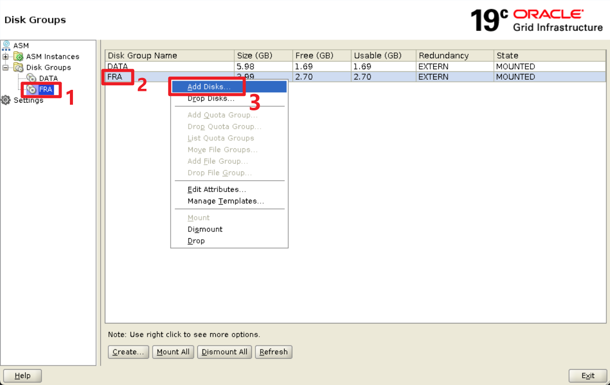
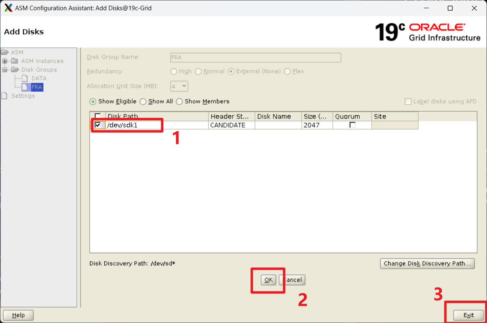

# 目录

[toc]

# 1 空间管理
## 1.1 ORA-19815: WARNING: db_recovery_file_dest_size
警告信息：
```sql
2023-10-13T01:54:28.083838+08:00
Errors in file /u01/app/oracle/diag/rdbms/lucdb/lucdb/trace/lucdb_m000_14292.trc:
ORA-19815: WARNING: db_recovery_file_dest_size of 1334837248 bytes is 93.95% used, and has 80740352 remaining bytes available.
```

查看相关信息：
```sql
SYS@lucdb(CDB$ROOT)> show parameter db_recovery

NAME                                 TYPE                   VALUE
------------------------------------ ---------------------- ------------------------------
db_recovery_file_dest                string                 +FRA
db_recovery_file_dest_size           big integer            1273M


SYS@lucdb(CDB$ROOT)> select name,sum(total_mb) total,sum(free_mb) free,sum(usable_file_mb) usable,sum(required_mirror_free_mb) mirror from v$asm_diskgroup group by name;

NAME                      TOTAL       FREE     USABLE     MIRROR
-------------------- ---------- ---------- ---------- ----------
FRA                        2040        712        712          0
DATA                       6120       1792       1792          0


SYS@lucdb(CDB$ROOT)> select file_type,percent_space_used,percent_space_reclaimable,number_of_files from v$flash_recovery_area_usage;

FILE_TYPE                                      PERCENT_SPACE_USED PERCENT_SPACE_RECLAIMABLE NUMBER_OF_FILES
---------------------------------------------- ------------------ ------------------------- ---------------
CONTROL FILE                                                 1.41                         0               1
REDO LOG                                                    47.37                         0               3
ARCHIVED LOG                                                45.01                         0               5
BACKUP PIECE                                                    0                         0               0
IMAGE COPY                                                      0                         0               0
FLASHBACK LOG                                                   0                         0               0
FOREIGN ARCHIVED LOG                                            0                         0               0
AUXILIARY DATAFILE COPY                                         0                         0               0


SYS@lucdb(CDB$ROOT)> SELECT LOG_MODE FROM V$DATABASE;

LOG_MODE
------------------------
ARCHIVELOG


SYS@lucdb(CDB$ROOT)> archive log list;

Database log mode              Archive Mode
Automatic archival             Enabled
Archive destination            USE_DB_RECOVERY_FILE_DEST
Oldest online log sequence     13
Next log sequence to archive   15
Current log sequence           15
```

官方建议的处理办法：
```sql
[oracle@19c-Grid trace]$ oerr ora 19815
19815, 00000, "WARNING: %s of %s bytes is %s%% used, and has %s remaining bytes available."
// *Cause: DB_RECOVERY_FILE_DEST is running out of disk space.
// *Action: One of the following:
//          1. Add disk space and increase DB_RECOVERY_FILE_DEST_SIZE.
//          2. Backup files to tertiary device using RMAN.
//          3. Consider changing RMAN retention policy.
//          4. Consider changing RMAN archived log deletion policy.
//          5. Delete files from recovery area using RMAN.
```

可以看到，数据库开启了归档模式，恢复区主要由重做日志和归档日志问价占用存储空间。根据建议的解决办法第五点，可以先删除归档日志文件。处理步骤如下：

一、删除归档日志：
```bash
[oracle@19c-Grid ~]$ rman target '" / as sysbackup"'

Recovery Manager: Release 19.0.0.0.0 - Production on Fri Oct 13 03:13:51 2023
Version 19.3.0.0.0

Copyright (c) 1982, 2019, Oracle and/or its affiliates.  All rights reserved.

connected to target database: LUCDB (DBID=71583637)

RMAN> crosscheck archivelog all;

using target database control file instead of recovery catalog
allocated channel: ORA_DISK_1
channel ORA_DISK_1: SID=146 device type=DISK
validation succeeded for archived log
archived log file name=+FRA/LUCDB/ARCHIVELOG/2023_10_08/thread_1_seq_10.260.1149715359 RECID=1 STAMP=1149715359
validation succeeded for archived log
archived log file name=+FRA/LUCDB/ARCHIVELOG/2023_10_09/thread_1_seq_11.261.1149801637 RECID=2 STAMP=1149801638
validation succeeded for archived log
archived log file name=+FRA/LUCDB/ARCHIVELOG/2023_10_11/thread_1_seq_12.262.1149980085 RECID=3 STAMP=1149980087
validation succeeded for archived log
archived log file name=+FRA/LUCDB/ARCHIVELOG/2023_10_13/thread_1_seq_13.263.1150071493 RECID=4 STAMP=1150071493
validation succeeded for archived log
archived log file name=+FRA/LUCDB/ARCHIVELOG/2023_10_13/thread_1_seq_14.264.1150077257 RECID=5 STAMP=1150077257
Crosschecked 5 objects

RMAN> delete expired archivelog all;

released channel: ORA_DISK_1
allocated channel: ORA_DISK_1
channel ORA_DISK_1: SID=146 device type=DISK
specification does not match any archived log in the repository

RMAN> delete archivelog all completed before 'sysdate-3';

released channel: ORA_DISK_1
allocated channel: ORA_DISK_1
channel ORA_DISK_1: SID=146 device type=DISK
List of Archived Log Copies for database with db_unique_name LUCDB
=====================================================================

Key     Thrd Seq     S Low Time
------- ---- ------- - -------------------
1       1    10      A 2023-10-07 21:01:07
        Name: +FRA/LUCDB/ARCHIVELOG/2023_10_08/thread_1_seq_10.260.1149715359

2       1    11      A 2023-10-08 21:22:38
        Name: +FRA/LUCDB/ARCHIVELOG/2023_10_09/thread_1_seq_11.261.1149801637


Do you really want to delete the above objects (enter YES or NO)? y
deleted archived log
archived log file name=+FRA/LUCDB/ARCHIVELOG/2023_10_08/thread_1_seq_10.260.1149715359 RECID=1 STAMP=1149715359
deleted archived log
archived log file name=+FRA/LUCDB/ARCHIVELOG/2023_10_09/thread_1_seq_11.261.1149801637 RECID=2 STAMP=1149801638
Deleted 2 objects

RMAN> exit

Recovery Manager complete.
```

使用rman删除了无效和三天以前的归档日志。


二、查看结果：
```sql
SYS@lucdb(CDB$ROOT)> select file_type,percent_space_used,percent_space_reclaimable,number_of_files from v$flash_recovery_area_usage;

FILE_TYPE                                      PERCENT_SPACE_USED PERCENT_SPACE_RECLAIMABLE NUMBER_OF_FILES
---------------------------------------------- ------------------ ------------------------- ---------------
CONTROL FILE                                                 1.41                         0               1
REDO LOG                                                    47.37                         0               3
ARCHIVED LOG                                                24.35                         0               3
BACKUP PIECE                                                    0                         0               0
IMAGE COPY                                                      0                         0               0
FLASHBACK LOG                                                   0                         0               0
FOREIGN ARCHIVED LOG                                            0                         0               0
AUXILIARY DATAFILE COPY                                         0                         0               0

8 rows selected.


SYS@lucdb(CDB$ROOT)> select name,sum(total_mb) total,sum(free_mb) free,sum(usable_file_mb) usable,sum(required_mirror_free_mb) mirror from v$asm_diskgroup group by name;

NAME                                TOTAL       FREE     USABLE     MIRROR
------------------------------ ---------- ---------- ---------- ----------
FRA                                  2040        976        976          0
DATA                                 6120       1792       1792          0
```

可以看到，空间大概释放了264mb，`ARCHIVED LOG`在 flash recovery area 的PERCENT_SPACE_USED从45.01%减少到24.35%，减少了差不多一半。


三、添加定时任务：

为防止以后再出现这种情况，添加一个定时任务，自动删除archivelog。

1.创建归档日志删除脚本 archivelog_clear.sh
```bash
#!/bin/bash
BACK_DIR=/home/oracle/shell/clear_archlog/data
export DATE=`date +%F`
mkdir -p $BACK_DIR/$DATE
touch $BACK_DIR/$DATE/rman_backup.log
echo "--------------------------------`date`-------------------------------"
source ~/.bash_profile

# 记录日志rman_backup.log 可以后期检查是否执行成功
rman target '" / as sysbackup"' >> $BACK_DIR/$DATE/rman_backup.log <<EOF
# 把无效的expired的archivelog标出来
crosscheck archivelog all;
# 直接全部删除过期的归档日志
#delete noprompt expired archivelog all;
# 直接删除7天前所有的归档日志
delete noprompt archivelog all completed before 'sysdate-7';
exit
EOF
echo -e "\n"
echo "------------------------------ FINISHED ----------------------------"
```

2.授予脚本文件执行权限
```bash
#授予执行权限
chmod +x archivelog_clear.sh
```

3.测试归档日志删除脚本
```bash
./archivelog_clear.sh
```

4.添加定时任务
```bash
crontab -e 

30 3 15 * * /home/oracle/archivelog_clear.sh
```

5.查看定时任务
```bash
crontab -l
```


## 1.2 ORA-19815: WARNING: db_recovery_file_dest_size（1.1延申）

警告信息：
```sql
2023-10-15T10:22:33.369211+08:00
Errors in file /u01/app/oracle/diag/rdbms/lucdb/lucdb/trace/lucdb_m000_27377.trc:
ORA-19815: WARNING: db_recovery_file_dest_size of 1334837248 bytes is 91.44% used, and has 114294784 remaining bytes available.
```

官方建议的处理办法：
```sql
[oracle@19c-Grid trace]$ oerr ora 19815
19815, 00000, "WARNING: %s of %s bytes is %s%% used, and has %s remaining bytes available."
// *Cause: DB_RECOVERY_FILE_DEST is running out of disk space.
// *Action: One of the following:
//          1. Add disk space and increase DB_RECOVERY_FILE_DEST_SIZE.
//          2. Backup files to tertiary device using RMAN.
//          3. Consider changing RMAN retention policy.
//          4. Consider changing RMAN archived log deletion policy.
//          5. Delete files from recovery area using RMAN.
```

1.1里使用了第5点方法，用RMAN删除恢复区文件。但是由于恢复区的空间很小，才短短两天又有告警了。

所以这里使用第1个方法：添加磁盘空间和增加DB_RECOVERY_FILE_DEST_SIZE的大小。

DB_RECOVERY_FILE_DEST_SIZE大小为：
```sql
SYS@lucdb(CDB$ROOT)> show parameter DB_RECOVERY_FILE_DEST_SIZE

NAME                                 TYPE                   VALUE
------------------------------------ ---------------------- ------------------------------
db_recovery_file_dest_size           big integer            1273M
```

先进行第一步，添加磁盘空间，步骤如下：

零、关闭数据库实例，再关闭+ASM实例。

一、关闭虚拟机，进入虚拟机目录创建将要用于 asm 的磁盘（一般为偶数个，且大小一样）。

二、启动后检查安装后的磁盘情况：
```bash
[root@19c-Grid grid]# lsblk
NAME   MAJ:MIN RM  SIZE RO TYPE MOUNTPOINT
sdf      8:80   0    1G  0 disk
`-sdf1   8:81   0 1023M  0 part
sdd      8:48   0    1G  0 disk
`-sdd1   8:49   0 1023M  0 part
sdb      8:16   0    1G  0 disk
`-sdb1   8:17   0 1023M  0 part
sdk      8:160  0    2G  0 disk
sdi      8:128  0    1G  0 disk
`-sdi1   8:129  0 1023M  0 part
sr0     11:0    1  4.5G  0 rom
sdg      8:96   0    1G  0 disk
`-sdg1   8:97   0 1023M  0 part
sde      8:64   0    1G  0 disk
`-sde1   8:65   0 1023M  0 part
sdc      8:32   0    1G  0 disk
`-sdc1   8:33   0 1023M  0 part
sda      8:0    0   80G  0 disk
|-sda2   8:2    0    8G  0 part [SWAP]
|-sda3   8:3    0   71G  0 part /
`-sda1   8:1    0    1G  0 part /boot
sdj      8:144  0    2G  0 disk
sdh      8:112  0    1G  0 disk
`-sdh1   8:113  0 1023M  0 part


[root@19c-Grid dev]# ll /dev/sdj /dev/sdk
brw-rw---- 1 root disk 8, 144 Oct 15 17:53 /dev/sdj
brw-rw---- 1 root disk 8, 160 Oct 15 17:40 /dev/sdk
```

新添加的磁盘为sdj和sdk。

三、配置 udev：

方法1：
```bash
[root@19c-Grid dev]# fdisk /dev/sdj
Welcome to fdisk (util-linux 2.23.2).

Changes will remain in memory only, until you decide to write them.
Be careful before using the write command.

Device does not contain a recognized partition table
Building a new DOS disklabel with disk identifier 0x8257eb7d.

Command (m for help): n
Partition type:
   p   primary (0 primary, 0 extended, 4 free)
   e   extended
Select (default p): p
Partition number (1-4, default 1): 1
First sector (2048-4194303, default 2048):
Using default value 2048
Last sector, +sectors or +size{K,M,G} (2048-4194303, default 4194303):
Using default value 4194303
Partition 1 of type Linux and of size 2 GiB is set

Command (m for help): w
The partition table has been altered!

Calling ioctl() to re-read partition table.
Syncing disks.


[root@19c-Grid dev]# lsblk | grep sdj
sdj      8:144  0    2G  0 disk
`-sdj1   8:145  0    2G  0 part
```


方法2：
```bash
[root@19c-Grid dev]# echo -e "n\np\n1\n\n\nw" | fdisk /dev/sdk
Welcome to fdisk (util-linux 2.23.2).

Changes will remain in memory only, until you decide to write them.
Be careful before using the write command.

Device does not contain a recognized partition table
Building a new DOS disklabel with disk identifier 0x3ae728d3.

Command (m for help): Partition type:
   p   primary (0 primary, 0 extended, 4 free)
   e   extended
Select (default p): Partition number (1-4, default 1): First sector (2048-4194303, default 2048): Using default value 2048
Last sector, +sectors or +size{K,M,G} (2048-4194303, default 4194303): Using default value 4194303
Partition 1 of type Linux and of size 2 GiB is set

Command (m for help): The partition table has been altered!

Calling ioctl() to re-read partition table.
Syncing disks.

```
ps：`\n`为回车。

四、查询这些磁盘的 scsi id
```bash
[root@19c-Grid dev]# /usr/lib/udev/scsi_id -g -u -d /dev/sdj1
36000c29abe0877e28fe0ca0aeac43783
[root@19c-Grid dev]# /usr/lib/udev/scsi_id -g -u -d /dev/sdk1
36000c29f94e948b7aecb0c16450997bd
```

五、编辑udev规则文件 /etc/udev/rules.d/99-oracle-asmdevices.rules
```bash
[root@19c-Grid rules.d]# vim 99-oracle-asmdevices.rules
KERNEL=="sd?1", SUBSYSTEM=="block", PROGRAM=="/usr/lib/udev/scsi_id --whitelisted --replace-whitespace --device=/dev/$parent", RESULT=="36000c29abe0877e28fe0ca0aeac43783", SYMLINK+="asmdisks/asmdisk09", OWNER="grid", GROUP="asmadmin", MODE="0660"
KERNEL=="sd?1", SUBSYSTEM=="block", PROGRAM=="/usr/lib/udev/scsi_id --whitelisted --replace-whitespace --device=/dev/$parent", RESULT=="36000c29f94e948b7aecb0c16450997bd", SYMLINK+="asmdisks/asmdisk10", OWNER="grid", GROUP="asmadmin", MODE="0660"
```

六、启动 udev
```bash
[root@19c-Grid rules.d]# /sbin/partprobe /dev/sdj1
[root@19c-Grid rules.d]# /sbin/partprobe /dev/sdk1
[root@19c-Grid rules.d]# /sbin/udevadm trigger --type=devices --action=change
```

七、检查磁盘状态
```bash
[root@19c-Grid dev]# ll /dev/sdj1  /dev/sdk1
brw-rw---- 1 grid asmadmin 8, 145 Oct 15 18:16 /dev/sdj1
brw-rw---- 1 grid asmadmin 8, 161 Oct 15 18:14 /dev/sdk1


[root@19c-Grid dev]# ll /dev/asmdisks/asmdisk09 /dev/asmdisks/asmdisk10
lrwxrwxrwx 1 root root 7 Oct 15 18:16 /dev/asmdisks/asmdisk09 -> ../sdj1
lrwxrwxrwx 1 root root 7 Oct 15 18:14 /dev/asmdisks/asmdisk10 -> ../sdk1
```

**ASM磁盘添加完毕！！**


八、启动+ASM实例
```sql
SYS@+ASM()> startup;
ORA-01078: failure in processing system parameters
ORA-29701: unable to connect to Cluster Synchronization Service
```

服了，搞炸了！难道我不适合干这行？

解决办法：[ORA-29701: unable to connect to Cluster Synchronization Service](#31-ora-29701-unable-to-connect-to-cluster-synchronization-service)


**-> 启动成功后进行第九步 <-**

九、检查asmdisks是否已经被读取。
```sql
SYS@+ASM()> col path form a20
SYS@+ASM()> select group_number,disk_number,state,failgroup,path from v$asm_disk;

GROUP_NUMBER DISK_NUMBER STATE    FAILGROUP                      PATH
------------ ----------- -------- ------------------------------ --------------------
           0           0 NORMAL                                  /dev/sdj1
           0           1 NORMAL                                  /dev/sdk1
           1           5 NORMAL   DATA_0005                      /dev/sdi1
           1           4 NORMAL   DATA_0004                      /dev/sdh1
           2           0 NORMAL   FRA_0000                       /dev/sdg1
           1           3 NORMAL   DATA_0003                      /dev/sde1
           2           1 NORMAL   FRA_0001                       /dev/sdf1
           1           2 NORMAL   DATA_0002                      /dev/sdd1
           1           0 NORMAL   DATA_0000                      /dev/sdb1
           1           1 NORMAL   DATA_0001                      /dev/sdc1

10 rows selected.
```

可以看到，group_number=0的两个磁盘未被分配。

十、增加+FRA磁盘组空间
```sql
[grid@19c-Grid ~]$ asmca
```




oracle-alert日志：
```sql
2023-10-15T21:54:02.336358+08:00
NOTE: Assigning number (2,2) to disk (/dev/sdj1)
SUCCESS: disk FRA_0002 (2.4041511172) added to diskgroup FRA
```

asm-alert日志：
```sql
2023-10-15T21:54:08.562649+08:00
SUCCESS: refreshed membership for 2/0xd846001 (FRA)
2023-10-15T21:54:09.428584+08:00
SUCCESS: rebalance completed for group 2/0xd846001 (FRA)
NOTE: Attempting voting file refresh on diskgroup FRA
2023-10-15T21:54:09.451995+08:00
SUCCESS: ALTER DISKGROUP FRA ADD  DISK '/dev/sdj1' SIZE 2047M
 REBALANCE WAIT /* ASMCA */
```

十一、查看+FRA空间
```sql
SYS@lucdb(CDB$ROOT)> select name,total_mb,free_mb,required_mirror_free_mb,usable_file_mb from v$asm_diskgroup;

NAME                             TOTAL_MB    FREE_MB REQUIRED_MIRROR_FREE_MB USABLE_FILE_MB
------------------------------ ---------- ---------- ----------------------- --------------
DATA                                 6120       1732                       0           1732
FRA                                  4084       2768                       0           2768
```

十二、增加`DB_RECOVERY_FILE_DEST_SIZE`的大小

```sql
alter system set db_recovery_file_dest_size = 2048M;
```

oracle-alert日志：
```sql
2023-10-15T22:21:21.658186+08:00
db_recovery_file_dest_size of 2048 MB is 56.84% used. This is a
user-specified limit on the amount of space that will be used by this
database for recovery-related files, and does not reflect the amount of
space available in the underlying filesystem or ASM diskgroup.
2023-10-15T22:21:21.822923+08:00
ALTER SYSTEM SET db_recovery_file_dest_size=2048M SCOPE=BOTH;
```

修改后大小：
```sql
SYS@lucdb(CDB$ROOT)> show parameter DB_RECOVERY_FILE_DEST_SIZE

NAME                                 TYPE                   VALUE
------------------------------------ ---------------------- ------------------------------
db_recovery_file_dest_size           big integer            2G


SYS@lucdb(CDB$ROOT)> select file_type,percent_space_used,percent_space_reclaimable,number_of_files from v$flash_recovery_area_usage;

FILE_TYPE                                      PERCENT_SPACE_USED PERCENT_SPACE_RECLAIMABLE NUMBER_OF_FILES
---------------------------------------------- ------------------ ------------------------- ---------------
CONTROL FILE                                                  .88                         0           1
REDO LOG                                                    29.44                         0           3
ARCHIVED LOG                                                26.42                         0           7
BACKUP PIECE                                                    0                         0           0
IMAGE COPY                                                      0                         0           0
FLASHBACK LOG                                                   0                         0           0
FOREIGN ARCHIVED LOG                                            0                         0           0
AUXILIARY DATAFILE COPY                                         0                         0           0

8 rows selected.
```

可以看到，占用已经很小了，从91.44%降到56.74%。


## 1.3 ORA-19804: cannot reclaim 68157440 bytes disk space from 2147483648 bytes limit

```sql
RMAN> backup datafile 1;
Starting backup at 2023-10-21 17:16:41
using channel ORA_DISK_1
channel ORA_DISK_1: starting full datafile backup set
channel ORA_DISK_1: specifying datafile(s) in backup set
input datafile file number=00001 name=+DATA/LUCDB/DATAFILE/system.257.1149473935
channel ORA_DISK_1: starting piece 1 at 2023-10-21 17:16:42
RMAN-00571: ===========================================================
RMAN-00569: =============== ERROR MESSAGE STACK FOLLOWS ===============
RMAN-00571: ===========================================================
RMAN-03009: failure of backup command on ORA_DISK_1 channel at 10/21/2023 17:16:45
ORA-19809: limit exceeded for recovery files
ORA-19804: cannot reclaim 68157440 bytes disk space from 2147483648 bytes limit


SYS@lucdb(CDB$ROOT)> show parameter RECOVERY_FILE_DEST
NAME                                 TYPE                   VALUE
------------------------------------ ---------------------- ------------------------------
db_recovery_file_dest                string                 +FRA
db_recovery_file_dest_size           big integer            2G
remote_recovery_file_dest            string

SYS@lucdb(CDB$ROOT)> select * from v$recovery_file_dest;
NAME                           SPACE_LIMIT SPACE_USED SPACE_RECLAIMABLE NUMBER_OF_FILES     CON_ID
------------------------------ ----------- ---------- ----------------- --------------- ----------
+FRA                            2147483648 1426063360                 0              17          0


SYS@lucdb(CDB$ROOT)> select file_type,percent_space_used,percent_space_reclaimable,number_of_files from v$flash_recovery_area_usage;
FILE_TYPE                                      PERCENT_SPACE_USED PERCENT_SPACE_RECLAIMABLE NUMBER_OF_FILES
---------------------------------------------- ------------------ ------------------------- ---------------
CONTROL FILE                                                  .88                         0               1
REDO LOG                                                    29.44                         0               3
ARCHIVED LOG                                                35.99                         0              13
BACKUP PIECE                                                    0                         0               0
IMAGE COPY                                                      0                         0               0
FLASHBACK LOG                                                   0                         0               0
FOREIGN ARCHIVED LOG                                            0                         0               0
AUXILIARY DATAFILE COPY                                         0                         0               0
8 rows selected.
```

明明还剩720兆，竟然提示不能指定68兆的回收空间？我们去诊断日志看一下有没有更详细的提示：
```sql
2023-10-21T17:16:44.961420+08:00
Errors in file /u01/app/oracle/diag/rdbms/lucdb/lucdb/trace/lucdb_ora_29425.trc:
ORA-19815: WARNING: db_recovery_file_dest_size of 2147483648 bytes is 100.00% used, and has 0                                                              remaining bytes available.
2023-10-21T17:16:44.961497+08:00
************************************************************************
You have following choices to free up space from recovery area:
1. Consider changing RMAN RETENTION POLICY. If you are using Data Guard,
   then consider changing RMAN ARCHIVELOG DELETION POLICY.
2. Back up files to tertiary device such as tape using RMAN
   BACKUP RECOVERY AREA command.
3. Add disk space and increase db_recovery_file_dest_size parameter to
   reflect the new space.
4. Delete unnecessary files using RMAN DELETE command. If an operating
   system command was used to delete files, then use RMAN CROSSCHECK and
   DELETE EXPIRED commands.
```

根据日志错误信息提示，恢复区利用率已经达到100%。再结合前面的提示信息，猜测是因为`datafile 1`整个文件的大小超过720兆，多出大概68兆。

所以，处理办法为增加db_recovery_file_dest_size的大小。一般设置FRA的大小最少为数据文件大小的1倍，建议2倍以上。

```sql
ASMCMD> lsdg
State    Type    Rebal  Sector  Logical_Sector  Block       AU  Total_MB  Free_MB  Req_mir_free_MB  Usable_file_MB  Offline_disks  Voting_files  Name
MOUNTED  EXTERN  N         512             512   4096  4194304      6120     1712                0            1712              0             N  DATA/
MOUNTED  EXTERN  N         512             512   4096  4194304      6128     4592                0            4592              0             N  FRA/


SYS@lucdb(CDB$ROOT)> alter system set db_recovery_file_dest_size=4G;
System altered.


SYS@lucdb(CDB$ROOT)> show parameter recover
NAME                                 TYPE                   VALUE
------------------------------------ ---------------------- ------------------------------
db_recovery_file_dest                string                 +FRA
db_recovery_file_dest_size           big integer            4G
db_unrecoverable_scn_tracking        boolean                TRUE
recovery_parallelism                 integer                0
remote_recovery_file_dest            string

SYS@lucdb(CDB$ROOT)> select * from v$recovery_file_dest;
NAME                           SPACE_LIMIT SPACE_USED SPACE_RECLAIMABLE NUMBER_OF_FILES     CON_ID
------------------------------ ----------- ---------- ----------------- --------------- ----------
+FRA                            4294967296 2280652800                 0              19          0

SYS@lucdb(CDB$ROOT)> select file_type,percent_space_used,percent_space_reclaimable,number_of_files from v$flash_recovery_area_usage;
FILE_TYPE                                      PERCENT_SPACE_USED PERCENT_SPACE_RECLAIMABLE NUMBER_OF_FILES
---------------------------------------------- ------------------ ------------------------- ---------------
CONTROL FILE                                                  .44                         0               1
REDO LOG                                                    14.72                         0               3
ARCHIVED LOG                                                17.99                         0              13
BACKUP PIECE                                                 19.9                         0               2
IMAGE COPY                                                      0                         0               0
FLASHBACK LOG                                                   0                         0               0
FOREIGN ARCHIVED LOG                                            0                         0               0
AUXILIARY DATAFILE COPY                                         0                         0               0
8 rows selected.
```

db_recovery_file_dest_size的大小添加完毕，重新进行备份，应该可以成功。

```sql
RMAN> backup datafile 1;
Starting backup at 2023-10-21 17:33:23
using channel ORA_DISK_1
channel ORA_DISK_1: starting full datafile backup set
channel ORA_DISK_1: specifying datafile(s) in backup set
input datafile file number=00001 name=+DATA/LUCDB/DATAFILE/system.257.1149473935
channel ORA_DISK_1: starting piece 1 at 2023-10-21 17:33:23
channel ORA_DISK_1: finished piece 1 at 2023-10-21 17:33:26
piece handle=+FRA/LUCDB/BACKUPSET/2023_10_21/nnndf0_tag20231021t173323_0.273.1150824803 tag=TAG20231021T173323 comment=NONE
channel ORA_DISK_1: backup set complete, elapsed time: 00:00:03
Finished backup at 2023-10-21 17:33:26

Starting Control File and SPFILE Autobackup at 2023-10-21 17:33:26
piece handle=+FRA/LUCDB/AUTOBACKUP/2023_10_21/s_1150824806.274.1150824807 comment=NONE
Finished Control File and SPFILE Autobackup at 2023-10-21 17:33:27


RMAN> list backup of datafile 1;
List of Backup Sets
===================
BS Key  Type LV Size       Device Type Elapsed Time Completion Time
------- ---- -- ---------- ----------- ------------ -------------------
1       Full    796.26M    DISK        00:00:02     2023-10-21 17:33:25
        BP Key: 1   Status: AVAILABLE  Compressed: NO  Tag: TAG20231021T173323
        Piece Name: +FRA/LUCDB/BACKUPSET/2023_10_21/nnndf0_tag20231021t173323_0.273.1150824803
  List of Datafiles in backup set 1
  File LV Type Ckp SCN    Ckp Time            Abs Fuz SCN Sparse Name
  ---- -- ---- ---------- ------------------- ----------- ------ ----
  1       Full 4158971    2023-10-21 17:33:23              NO    +DATA/LUCDB/DATAFILE/system.257.1149473935
```

备份成功，文件大小为796.26M。

与猜测的差不多，整个文件大小超过了剩余的恢复区大小。


# 2 备份恢复

### ORA-15012: ASM file '+DATA/LUCDB/CONTROLFILE/current.261.1149474069' does not exist

启动数据库失败，提示控制文件错误。

```sql
SYS@lucdb(CDB$ROOT)> startup force;
ORACLE instance started.

Total System Global Area 4093636832 bytes
Fixed Size                  9142496 bytes
Variable Size             939524096 bytes
Database Buffers         3137339392 bytes
Redo Buffers                7630848 bytes
ORA-00205: error in identifying control file, check alert log for more info

[oracle@19c-Grid trace]$ tail -f alert_lucdb.log
NOTE: grp 2 disk 1: FRA_0001 path:/dev/sdf1
2023-10-14T22:34:11.323682+08:00
ORA-00210: cannot open the specified control file
ORA-00202: control file: '+DATA/LUCDB/CONTROLFILE/current.261.1149474069'
ORA-17503: ksfdopn:2 Failed to open file +DATA/LUCDB/CONTROLFILE/current.261.1149474069
ORA-15012: ASM file '+DATA/LUCDB/CONTROLFILE/current.261.1149474069' does not exist
```

根据alert日志的信息，数据库启动失败的原因是ASM文件丢失，丢失的文件为控制文件current.261.1149474069。

下面进行检查：

```sql
SYS@lucdb(CDB$ROOT)> show parameter control_files

NAME                                 TYPE                   VALUE
------------------------------------ ---------------------- ------------------------------
control_files                        string                 +DATA/LUCDB/CONTROLFILE/curren
                                                            t.261.1149474069, +FRA/LUCDB/C
                                                            ONTROLFILE/current.256.1149474
                                                            069

[grid@19c-Grid ~]$ asmcmd
ASMCMD> pwd
+
ASMCMD> ls
DATA/
FRA/
ASMCMD> ls +DATA/LUCDB/CONTROLFILE
Current.261.1149474069.bak
ASMCMD> ls FRA/LUCDB/CONTROLFILE
Current.256.1149474069
```

可以看到两个控制文件只剩快速恢复区中的那个，而+DATA磁盘组中的Current.261.1149474069.bak为冷备份文件。先尝试使用此文件进行恢复：

```sql
ASMCMD> ls
Current.261.1149474069.bak
ASMCMD> cp Current.261.1149474069.bak Current.261.1149474069
copying +DATA/LUCDB/CONTROLFILE/Current.261.1149474069.bak -> +DATA/LUCDB/CONTROLFILE/Current.261.1149474069
ASMCMD-8016: copy source '+DATA/LUCDB/CONTROLFILE/Current.261.1149474069.bak' and target '+DATA/LUCDB/CONTROLFILE/Current.261.1149474069' failed
ORA-15056: additional error message
ORA-15046: ASM file name '+DATA/LUCDB/CONTROLFILE/Current.261.1149474069' is not in single-file creation form
ORA-06512: at "SYS.X$DBMS_DISKGROUP", line 617
ORA-06512: at line 3 (DBD ERROR: OCIStmtExecute)

[oracle@19c-Grid tmp]$ oerr ORA 15046
15046, 00000, "ASM file name '%s' is not in single-file creation form"
// *Cause:  The ASM file name was not in a form that can be used to create
//          an single file because a file/incarnation number was present.
// *Action: Correct the specified ASM file name.
```

竟然不行。。。，不能用Current.261.1149474069这个文件名，那怎么办？

尝试使用rman，使用快速恢复区的`+FRA/LUCDB/CONTROLFILE/current.256.1149474069`文件进行恢复：

```sql
[oracle@19c-Grid ~]$ rman target /

RMAN> restore controlfile from autobackup;

Starting restore at 2023-10-14 23:02:52
using target database control file instead of recovery catalog
allocated channel: ORA_DISK_1
channel ORA_DISK_1: SID=390 device type=DISK

recovery area destination: +FRA
database name (or database unique name) used for search: LUCDB
channel ORA_DISK_1: no AUTOBACKUPS found in the recovery area
AUTOBACKUP search with format "%F" not attempted because DBID was not set
RMAN-00571: ===========================================================
RMAN-00569: =============== ERROR MESSAGE STACK FOLLOWS ===============
RMAN-00571: ===========================================================
RMAN-03002: failure of restore command at 10/14/2023 23:02:54
RMAN-06172: no AUTOBACKUP found or specified handle is not a valid copy or piece

RMAN> restore controlfile from '+FRA/LUCDB/CONTROLFILE/current.256.1149474069';

Starting restore at 2023-10-14 23:05:07
using channel ORA_DISK_1

channel ORA_DISK_1: copied control file copy
output file name=+DATA/LUCDB/CONTROLFILE/current.277.1150239907
output file name=+FRA/LUCDB/CONTROLFILE/current.256.1149474069
Finished restore at 2023-10-14 23:05:08


ASMCMD> ls
current.277.1150239907
Current.261.1149474069.bak
```

恢复成功，不过控股文件名变了，不管，去看看能不能启动成功。

```sql
SYS@lucdb(CDB$ROOT)> startup force;
ORACLE instance started.

Total System Global Area 4093636832 bytes
Fixed Size                  9142496 bytes
Variable Size             939524096 bytes
Database Buffers         3137339392 bytes
Redo Buffers                7630848 bytes
Database mounted.
Database opened.

SYS@lucdb(CDB$ROOT)> show parameter control_file

NAME                                 TYPE                   VALUE
------------------------------------ ---------------------- ------------------------------
control_file_record_keep_time        integer                7
control_files                        string                 +DATA/LUCDB/CONTROLFILE/curren
                                                            t.277.1150239907, +FRA/LUCDB/C
                                                            ONTROLFILE/current.256.1149474
                                                            069
```
启动成功！！


# 3 RMAN
## 3.1 RMAN-06207 & RMAN-06208: warning: 1 objects could not be deleted for DISK channel(s) due to mismatched status.  Use CROSSCHECK command to fix status

```sql
RMAN> report obsolete;

RMAN retention policy will be applied to the command
RMAN retention policy is set to redundancy 1
Report of obsolete backups and copies
Type                 Key    Completion Time    Filename/Handle
-------------------- ------ ------------------ --------------------
Control File Copy     4      2023-10-14 20:54:53 /home/oracle/tmp/a.ctl


RMAN> delete obsolete;

RMAN retention policy will be applied to the command
RMAN retention policy is set to redundancy 1
using channel ORA_DISK_1
Deleting the following obsolete backups and copies:
Type                 Key    Completion Time    Filename/Handle
-------------------- ------ ------------------ --------------------
Control File Copy     4      2023-10-14 20:54:53 /home/oracle/tmp/a.ctl

Do you really want to delete the above objects (enter YES or NO)? YES

RMAN-06207: warning: 1 objects could not be deleted for DISK channel(s) due
RMAN-06208:          to mismatched status.  Use CROSSCHECK command to fix status
RMAN-06210: List of Mismatched objects
RMAN-06211: ==========================
RMAN-06212:   Object Type   Filename/Handle
RMAN-06213: --------------- ---------------------------------------------------
RMAN-06214: Control File Copy /home/oracle/tmp/a.ctl
```

```sql
RMAN> crosscheck copy;

released channel: ORA_DISK_1
allocated channel: ORA_DISK_1
channel ORA_DISK_1: SID=147 device type=DISK
specification does not match any datafile copy in the repository
validation failed for control file copy
control file copy file name=/home/oracle/tmp/a.ctl RECID=4 STAMP=1150232093
validation succeeded for archived log
archived log file name=+FRA/LUCDB/ARCHIVELOG/2023_10_11/thread_1_seq_12.262.1149980085 RECID=3 STAMP=1149980087
validation succeeded for archived log
archived log file name=+FRA/LUCDB/ARCHIVELOG/2023_10_13/thread_1_seq_13.263.1150071493 RECID=4 STAMP=1150071493
validation succeeded for archived log
archived log file name=+FRA/LUCDB/ARCHIVELOG/2023_10_13/thread_1_seq_14.264.1150077257 RECID=5 STAMP=1150077257
validation succeeded for archived log
archived log file name=+FRA/LUCDB/ARCHIVELOG/2023_10_13/thread_1_seq_15.261.1150146457 RECID=6 STAMP=1150146456
validation succeeded for archived log
archived log file name=+FRA/LUCDB/ARCHIVELOG/2023_10_13/thread_1_seq_16.260.1150154215 RECID=7 STAMP=1150154214
validation succeeded for archived log
archived log file name=+FRA/LUCDB/ARCHIVELOG/2023_10_14/thread_1_seq_17.265.1150234945 RECID=8 STAMP=1150234946
validation succeeded for archived log
archived log file name=+FRA/LUCDB/ARCHIVELOG/2023_10_15/thread_1_seq_18.266.1150280541 RECID=9 STAMP=1150280541
validation succeeded for archived log
archived log file name=+FRA/LUCDB/ARCHIVELOG/2023_10_16/thread_1_seq_19.267.1150336435 RECID=10 STAMP=1150336434
validation succeeded for archived log
archived log file name=+FRA/LUCDB/ARCHIVELOG/2023_10_16/thread_1_seq_20.268.1150398819 RECID=11 STAMP=1150398818
validation succeeded for archived log
archived log file name=+FRA/LUCDB/ARCHIVELOG/2023_10_17/thread_1_seq_21.269.1150421759 RECID=12 STAMP=1150421759
validation succeeded for archived log
archived log file name=+FRA/LUCDB/ARCHIVELOG/2023_10_17/thread_1_seq_22.270.1150423203 RECID=13 STAMP=1150423204
validation succeeded for archived log
archived log file name=+FRA/LUCDB/ARCHIVELOG/2023_10_19/thread_1_seq_23.271.1150660633 RECID=14 STAMP=1150660633
validation succeeded for archived log
archived log file name=+FRA/LUCDB/ARCHIVELOG/2023_10_19/thread_1_seq_24.272.1150670751 RECID=15 STAMP=1150670750
Crosschecked 14 objects


RMAN> delete obsolete;

RMAN retention policy will be applied to the command
RMAN retention policy is set to redundancy 1
using channel ORA_DISK_1
Deleting the following obsolete backups and copies:
Type                 Key    Completion Time    Filename/Handle
-------------------- ------ ------------------ --------------------
Control File Copy     4      2023-10-14 20:54:53 /home/oracle/tmp/a.ctl

Do you really want to delete the above objects (enter YES or NO)? yes
deleted control file copy
control file copy file name=/home/oracle/tmp/a.ctl RECID=4 STAMP=1150232093
Deleted 1 objects


RMAN> report obsolete;

RMAN retention policy will be applied to the command
RMAN retention policy is set to redundancy 1
no obsolete backups found
```


# 4 集群

## 4.1 ORA-29701: unable to connect to Cluster Synchronization Service

+ASM实例启动失败。
```sql
SYS@+ASM()> startup;
ORA-01078: failure in processing system parameters
ORA-29701: unable to connect to Cluster Synchronization Service
```

查看官方解释：
```sql
[grid@19c-Grid ~]$ oerr ora 01078
01078, 00000, "failure in processing system parameters"
// *Cause:  Failure during processing of INIT.ORA parameters during
//          system startup.
// *Action:  Further diagnostic information should be in the error stack.
[grid@19c-Grid ~]$ oerr ora 29701
29701, 00000, "unable to connect to Cluster Synchronization Service"
// *Cause: Connect to CSS failed or timed out.
// *Action: Verify the state of the CSS.  If the CSS was not started,
//          start it and then retry the database startup. If the CSS died
//          or is not responding, check the Oracle and CSS trace files for
//          errors and contact Oracle Support Services.
```

根据提示，应该是CSS(Cluster Synchronization Service)掉了，CRS可能有问题。

一、crsctl检查CSS状态：
```bash
[grid@19c-Grid ~]$ crsctl check css
CRS-4530: Communications failure contacting Cluster Synchronization Services daemon

[grid@19c-Grid ~]$ oerr crs 4530
4530, 0, "Communications failure contacting Cluster Synchronization Services daemon\n"
```

表示无法连接到集群同步服务。

二、进一步检查其他CRS的服务：
```bash
[grid@19c-Grid ~]$ crsctl check has
CRS-4638: Oracle High Availability Services is online
```

检查has服务为 online，正常的。说明css服务异常，手动启动css服务。


三、手动启动css服务:
```bash
[grid@19c-Grid ~]$ crsctl start resource -all
CRS-5702: Resource 'ora.LISTENER.lsnr' is already running on '19c-grid'
CRS-5702: Resource 'ora.LISTENER1.lsnr' is already running on '19c-grid'
CRS-5702: Resource 'ora.evmd' is already running on '19c-grid'
CRS-2501: Resource 'ora.ons' is disabled
CRS-2672: Attempting to start 'ora.cssd' on '19c-grid'
CRS-2672: Attempting to start 'ora.diskmon' on '19c-grid'
CRS-2676: Start of 'ora.diskmon' on '19c-grid' succeeded
CRS-2676: Start of 'ora.cssd' on '19c-grid' succeeded
CRS-2672: Attempting to start 'ora.asm' on '19c-grid'
CRS-2676: Start of 'ora.asm' on '19c-grid' succeeded
CRS-2672: Attempting to start 'ora.FRA.dg' on '19c-grid'
CRS-2672: Attempting to start 'ora.DATA.dg' on '19c-grid'
CRS-2672: Attempting to start 'ora.diskmon' on '19c-grid'
CRS-2676: Start of 'ora.FRA.dg' on '19c-grid' succeeded
CRS-2676: Start of 'ora.DATA.dg' on '19c-grid' succeeded
CRS-2676: Start of 'ora.diskmon' on '19c-grid' succeeded
CRS-2672: Attempting to start 'ora.lucdb.db' on '19c-grid'
CRS-2676: Start of 'ora.lucdb.db' on '19c-grid' succeeded
CRS-4000: Command Start failed, or completed with errors.


[grid@19c-Grid ~]$ crsctl stat resource -t
--------------------------------------------------------------------------------
Name           Target  State        Server                   State details
--------------------------------------------------------------------------------
Local Resources
--------------------------------------------------------------------------------
ora.DATA.dg
               ONLINE  ONLINE       19c-grid                 STABLE
ora.FRA.dg
               ONLINE  ONLINE       19c-grid                 STABLE
ora.LISTENER.lsnr
               ONLINE  ONLINE       19c-grid                 STABLE
ora.LISTENER1.lsnr
               ONLINE  ONLINE       19c-grid                 STABLE
ora.asm
               ONLINE  ONLINE       19c-grid                 Started,STABLE
ora.ons
               OFFLINE OFFLINE      19c-grid                 STABLE
--------------------------------------------------------------------------------
Cluster Resources
--------------------------------------------------------------------------------
ora.cssd
      1        ONLINE  ONLINE       19c-grid                 STABLE
ora.diskmon
      1        OFFLINE OFFLINE                               STABLE
ora.evmd
      1        ONLINE  ONLINE       19c-grid                 STABLE
ora.lucdb.db
      1        ONLINE  ONLINE       19c-grid                 Open,HOME=/u01/app/o
                                                             racle/product/19.0.0
                                                             /db_1,STABLE
--------------------------------------------------------------------------------


[grid@19c-Grid ~]$ crsctl check css
CRS-4529: Cluster Synchronization Services is online
```

启动后可以看到crs已经正常，css服务也正常了。

相关日志：
```sql
NOTE: Instance updated compatible.rdbms to 10.1.0.0.0 for grp 2 (FRA).
2023-10-15T21:22:41.362175+08:00
SUCCESS: diskgroup FRA was mounted
2023-10-15T21:22:41.413911+08:00
SUCCESS: ALTER DISKGROUP ALL MOUNT /* asm agent call crs *//* {0:0:181} */
2023-10-15T21:22:41.551276+08:00
NOTE: diskgroup resource ora.DATA.dg is online
NOTE: diskgroup resource ora.FRA.dg is online
2023-10-15T21:22:42.988381+08:00
ALTER SYSTEM SET local_listener=' (ADDRESS=(PROTOCOL=TCP)(HOST=192.168.131.201)(PORT=1521))' SCOPE=MEMORY SID='+ASM';
2023-10-15T21:22:45.135445+08:00
Starting background process ASMB
2023-10-15T21:22:45.192884+08:00
ASMB started with pid=27, OS id=15421
2023-10-15T21:22:45.345297+08:00
NOTE: ASMB (index:0) registering with ASM instance as Standard client 0xffffffffffffffff (reg:1895660905) (startid:1150320152) (new connection)
2023-10-15T21:22:45.481412+08:00
NOTE: Standard client +ASM:+ASM:ASM registered, osid 15425, mbr 0x0, asmb 15421 (reg:1895660905)
2023-10-15T21:22:45.482214+08:00
NOTE: ASMB (index:0) (15421) connected to ASM instance +ASM, osid: 15425 (Standard mode; client id 0xffffffffffffffff)
2023-10-15T21:22:56.753156+08:00
NOTE: Standard client lucdb:lucdb:ASM registered, osid 15522, mbr 0x1, asmb 15517 (reg:3149572846)
2023-10-15T21:23:00.857744+08:00
NOTE: client lucdb:lucdb:ASM mounted group 1 (DATA)
2023-10-15T21:23:01.919389+08:00
NOTE: client lucdb:lucdb:ASM mounted group 2 (FRA)
2023-10-15T21:54:01.622315+08:00
```

可以看到，ASM实例已经启动了。

四、登录数据库
```sql
[grid@19c-Grid ~]$ sqlplus / as sysasm

SQL*Plus: Release 19.0.0.0.0 - Production on Sun Oct 15 21:47:05 2023
Version 19.3.0.0.0

Copyright (c) 1982, 2019, Oracle.  All rights reserved.


Connected to:
Oracle Database 19c Enterprise Edition Release 19.0.0.0.0 - Production
Version 19.3.0.0.0
```

启动成功！！！！

五、启动中的报错：

好像也没什么影响，数据库能正常启动。

1. **CRS-2501: Resource 'ora.ons' is disabled**

```bash
[grid@19c-Grid ~]$ oerr CRS 2501
2501, 1, "Resource '%s' is disabled"
// *Cause:  The resource is currently disabled and so may not be operated on.
// *Action: Enable the resource and re-submit your request.
```

ora.ons资源被禁用，


2. **CRS-4000: Command Start failed, or completed with errors.**

```bash
[grid@19c-Grid ~]$ oerr CRS 4000
4000, 0, "Command %s failed, or completed with errors."
// *Cause: The specified command did not complete successfully.  If the command
//   performs multiple operations internally, one or more of those operations experienced
//   an error that is reported in a previous message.
// *Action: Examine the error message(s) preceding this message and correct
//   the problem(s) they describe.
```


### 4.1.1 学习CRS

Oracle的CRS（Cluster Ready Service，简称CRS）是从Oracle 10g R1 RAC开始推出的集群软件。它的主要作用是提供标准的群集服务接口，以便构建Oracle的并行数据库即RAC。此外，CRS还提供了一组高可用性的应用程序接口（API），用以搭建一般应用程序的高可用集群，如MySQL的双机热备等。

在Oracle 10g R2以及之后的版本中，Oracle将其更名为Clusterware（集群件），但通常我们仍然认为CRS等同于Clusterware，表示Oracle的集群软件。需要注意的是，从10g R2开始，Oracle引入了ClusterWare一词，因此“CRS”的含义被Oracle缩小了，主要用来指代Clusterware提供的RAC环境中的群集服务。

系统启动后，CRS会自动启动，主要由/etc/init.d中的几个脚本完成启动过程。需要注意的是，CRS是单独的产品，在构建RAC环境中需要单独安装。

它的具体功能包括：

1. 管理集群资源：CRS可以管理节点、磁盘组、VIP地址等集群资源。通过提供统一的管理界面和命令，管理员可以方便地对集群资源进行配置、监控和管理。
2. 提供高可用性：作为一种集群服务，CRS可以通过实现资源的高可用性来提供服务的高可用性。它会监测集群资源的运行状态，如果资源出现故障，会自动卸载失效资源，并在其他节点上重新启动备用资源，以保证服务的不中断。这种自动故障转移的能力，在高可用性的应用程序中是非常关键的。
3. 自动故障恢复：CRS支持自动故障恢复功能。当资源出现故障时，它会尝试自动恢复备用资源。如果自动恢复失败，则会通知管理员进行手动故障恢复操作。
4. 总的来说，通过CRS，Oracle实现了在集群环境中对应用程序、数据库、Web应用程序、中间件和其他系统服务的高可靠性和容错能力。


crsctl：这是一个命令行工具，用于管理CRS服务以及查看CRS服务的状态。通过执行crsctl status可以查看CRS服务的当前状态，执行crsctl stop可以停止CRS服务，执行crsctl start可以启动CRS服务。


# 4.2 CRS-2883,CRS-4406,CRS-41053,PRVH-0116,CRS-4000

安装rac时，root.sh脚本节点1成功，但是在节点2报CRS-2883,CRS-4406,CRS-41053,PRVH-0116,CRS-4000错误。

具体报错信息如下：

```bash
CRS-2883: Resource 'ora.cssd' failed during Clusterware stack start.
CRS-4406: Oracle High Availability Services synchronous start failed.
CRS-41053: checking Oracle Grid Infrastructure for file permission issues
PRVH-0116 : Path "/u01/app/19.0.0/grid/crs/install/cmdllroot.sh" with permissions "rw-r--r--" does not have execute permissions for the owner, file's group, and others on node "lu9up02".
PRVG-2031 : Owner of file "/u01/app/19.0.0/grid/crs/install/cmdllroot.sh" did not match the expected value on node "lu9up02". [Expected = "grid(54322)" ; Found = "root(0)"]
PRVG-2032 : Group of file "/u01/app/19.0.0/grid/crs/install/cmdllroot.sh" did not match the expected value on node "lu9up02". [Expected = "oinstall(54321)" ; Found = "root(0)"]
CRS-4000: Command Start failed, or completed with errors.
2023/11/07 04:00:11 CLSRSC-117: Failed to start Oracle Clusterware stack
Died at /u01/app/19.0.0/grid/crs/install/crsinstall.pm line 1970.
```

