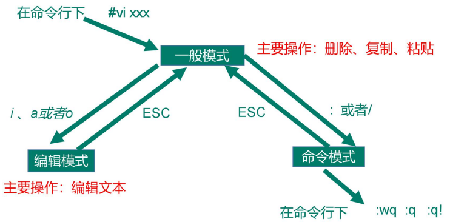

# 一、Linux概述
## 1.1 简介
Linux，全称GNU/Linux，是一种免费使用和自由传播的类UNIX操作系统，其内核由林纳斯·本纳第克特·托瓦兹于1991年10月5日首次发布，它主要受到Minix和Unix思想的启发，是一个基于POSIX的多用户、多任务、支持多线程和多CPU的操作系统。它能运行主要的Unix工具软件、应用程序和网络协议。它支持32位和64位硬件。Linux继承了Unix以网络为核心的设计思想，是一个性能稳定的多用户网络操作系统。

Linux有上百种不同的发行版，如基于社区开发的debian、archlinux，和基于商业开发的Red Hat Enterprise Linux、SUSE、Oracle Linux等。

## 1.2 Linux和Windows区别
1. Liunx免费或少许收费。
2. 开源自由软件，由发行版本或者社区提供支 持，服务是没有收费的Windows好。
3. Linux权限比windows控制的严格安全性要强一些。
4. Linux命令行操作。
5. Linux由于开源，所以定制化高。
6. Linux常用于服务器领域，和手机系统。

# 二、Linux文件与目录结构
## 2.1 Linux 文件
Linux 系统中一切皆为文件（什么都用文件表示）

## 2.2 Linux 目录结构
1. **/bin** 是 binary 的缩写，这个目录存放着最常用的命令。
2. /sbin 这个目录存放的是系统管理员使用的系统管理程序。
3. **/home** 存放普通用户的主目录，Linux 中每个用户都有一个自己的目录，一般来说目录是用自己的账户命名的。
4. **/root** 这个目录是系统管理员的目录，也被称为是超级用户的目录。
5. /lib 依赖库目录，类似与 Windows 存放 dll依赖的文件库。
6. **/etc** 所有系统管理用到的配置文件和子目录。
7. **/usr** 这是一个非常重要的目录，用户的很多应用程序和文件都放在这个目录下，类似于windows下的program files目录
8. **/boot** 存放Linux启动核心依赖文件，包括一些连接文件以及镜像文件（不要动）
9. /proc 获取系统信息的虚拟目录
10. /tmp 存放临时文件（放内存中）
11. /dev 设备管理器目录
12. /run/media 读取外部设备，如U盘，光驱等（centos 6 在 /media）
13. **/mnt** 让用户临时挂载别的文件系统
14. /opt 给主机额外安装软件的路径
15. /var 存放如各种日志文件等，经常被修改的文件目录

# 三、Linux网络配置和系统配置 ★
## 3.1 网络配置 ★
### 3.1.1 ifconfig
可以查看当前 ip 但是如果是 最小化安装 要先装 net-tools

### 3.1.2 修改IP为静态
文件路径：/etc/sysconfig/network-scripts/ifcfg-ens32(或ifcfg-ens33)
```txt
TYPE="Ethernet"    #网络类型（通常是Ethemet）
PROXY_METHOD="none"
BROWSER_ONLY="no"

修改：
BOOTPROTO="static"   #IP的配置方法[none|static|bootp|dhcp]（引导时不 使用协议|静态分配IP|BOOTP协议|DHCP协议）

DEFROUTE="yes"
IPV4_FAILURE_FATAL="no"
IPV6INIT="yes"
IPV6_AUTOCONF="yes"
IPV6_DEFROUTE="yes"
IPV6_FAILURE_FATAL="no"
IPV6_ADDR_GEN_MODE="stable-privacy"
NAME="ens33"   
UUID="e83804c1-3257-4584-81bb-660665ac22f6"   #随机id
DEVICE="ens33"   #接口名（设备,网卡）
ONBOOT="yes"   #系统启动的时候网络接口是否有效（yes/no）


添加：
#IP地址
IPADDR=192.168.1.100  
#网关  
GATEWAY=192.168.1.2      
#域名解析器
DNS1=192.168.1.2
```
修改配置文件后，需要重启网络服务：  
[root@hadoop100 ~]# systemctl restart network
### 3.1.3 配置主机名
查看当前服务器主机名称  
[root@hadoop100 ~]# hostname

如果感觉此主机名不合适，我们可以进行修改。通过编辑/etc/hostname文件  
[root@hadoop100 ~]# vim /etc/hostname

### 3.1.4 修改hosts映射文件
虚拟机会比较多，配置时通常会采用主机名的方式配置，比较简单方便，不用刻意记ip地址。

[root@hadoop100 桌面]# vim /etc/hosts  
添加:IP 主机名
```
192.168.2.100 hadoop100
192.168.2.101 hadoop101
```
修改完成后重启设备，查看主机名，已经修改成功

## 3.2 系统管理
### 3.2.1 Linux 中的进程和服务
计算机中，一个正在执行的程序或命令，被叫做“进程”(process)。

启动之后一只存在、常驻内存的进程，一般被称作“服务”(service）。

### 3.2.2 systemctl 服务管理
1)基本语法
```bash
systemctl start | stop | restart | status   服务名
```

2)查看服务方法:  
/usr/lib/systemd/system
```
[root@hadoop100 system]# pwd
/usr/lib/systemd/system
[root@hadoop100 init.d]# ls -al
-rw-r--r--. 1 root root 275 4 月 27 2018
-rw-r--r--. 1 root root 380 4 月 27 2018 abrtd.service
-rw-r--r--. 1 root root 361 4 月 27 2018 abrt-oops.service
-rw-r--r--. 1 root root 266 4 月 27 2018 abrt-pstoreoops.service
-rw-r--r--. 1 root root 262 4 月 27 2018 abrt-vmcore.service
……
```

3)实操
```bash
1. 查看网络服务的状态  
   [root@hadoop100 桌面]# service network status
2. 停止网络服务
   [root@hadoop100 桌面]# service network stop
3. 启动网络服务
   [root@hadoop100 桌面]# service network start
4. 重启网络服务
    [root@hadoop100 桌面]# service network restart
```

### 3.2.3 systemctl 设置后台服务的自启配置
1)基本语法
```
systemctl list-unit-files （功能描述：查看服务开机启动状态）

systemctl disable 服务名 （功能描述：关掉指定服务的自动启动）

systemctl enable 服务名 （功能描述：开启指定服务的自动启动）
```

2）实操

开启/关闭 iptables(防火墙)服务的自动启动
```
[root@hadoop100 桌面]# systemctl enable firewalld.service
[root@hadoop100 桌面]# systemctl disable firewalld.service
```

### 3.2.4 系统运行级别
1)Linux运行级别：

*Centos6运行级别*


2）Centos7运行级别：
```bash
multi-user.target 等价于原运行级别 3（多用户有网，无图形界面）
graphical.target 等价于原运行级别 5（多用户有网，有图形界面）
```

3)查看当前运行级别：  
```bash
systemctl get-default
```

4）修改当前运行级别：  
systemctl set-default TARGET.target （这里 TARGET 取 multi-user 或者 graphical）

### 3.2.5 关闭防火墙
1）临时关闭防火墙
```bash
1.查看防火墙状态
[root@hadoop100 桌面]# systemctl status firewalld

2.临时关闭防火墙
[root@hadoop100 桌面]# systemctl stop firewalld
```

2）开机启动时关闭防火墙
```bash
1.查看防火墙开机启动状态
[root@hadoop100 桌面]# systemctl enable firewalld.service

2.设置开机时关闭防火墙
[root@hadoop100 桌面]# systemctl disable  firewalld.service
```

### 3.2.6 关机重启命令
在 linux 领域内大多用在服务器上，很少遇到关机的操作。毕竟服务器上跑一个服务是永无止境的，除非特殊情况下，不得已才会关机。

1）基本语法：  
1. sync （功能描述：将数据由内存同步到硬盘中）
2. halt （功能描述：停机，关闭系统，但不断电）
3. poweroff （功能描述：关机，断电）
4. reboot （功能描述：就是重启，等同于 shutdown -r now）
5. shutdown [选项] 时间
    
   

2）经验技巧：  
Linux 系统中为了提高磁盘的读写效率，对磁盘采取了 “**预读迟写**”操作方式。当用户保存文件时，Linux 核心并不一定立即将保存数据写入物理磁盘中，而是将数据保存在缓冲区中，等缓冲区满时再写入磁盘，这种方式可以极大的提高磁盘写入数据的效率。但是，也带来了安全隐患，如果数据还未写入磁盘时，系统掉电或者其他严重问题出现，则将导致数据丢失。**使用 sync 指令可以立即将缓冲区的数据写入磁盘**。

3）实操：  
1. 将数据由内存同步到硬盘中  
   ```bash
   [root@hadoop100 桌面]#syn
   ```
2. 重启
   ```bash
   [root@hadoop100 桌面]# reboot
   ```
3. 停机（不断电）
   ```bash
   [root@hadoop100 桌面]#halt
   ```
4. 计算机将在 1 分钟后关机，并且会显示在登录用户的当前屏幕中
   ```bash
   [root@hadoop100 桌面]#shutdown -h 1
   ```
5. 立马关机（等同于 poweroff）
   ```bash
   [root@hadoop100 桌面]# shutdown -h now
   ```
6. 系统立马重启（等同于 reboot）
   ```bash
   [root@hadoop100 桌面]# shutdown -r now
   ```

# 四、VI/VIM 编辑器 ★
## 4.1 概述
VI是Unix 操作系统和类 Unix 操作系统中最通用的文本编辑器。

VIM 编辑器是从 VI 发展出来的一个性能更强大的文本编辑器。可以主动的以字体颜色辨别语法的正确性，方便程序设计。VIM 与 VI 编辑器完全兼容。

## 4.2 一般模式
以 vi 打开一个档案就直接进入一般模式了（这是默认的模式）。在这个模式中， 你可以使用『上下左右』按键来移动光标，你可以使用『删除字符』或『删除整行』来处理档案内容， 也可以使用『复制、粘贴』来处理你的文件数据。  
*vim常用语法*


## 4.3 编辑模式
在一般模式中可以进行删除、复制、粘贴等的动作，但是却无法编辑文件内容的！要等到你按下『i, I, o, O, a, A』等任何一个字母之后才会进入编辑模式。

注意了！通常在Linux中，按下这些按键时，在画面的左下方会出现『INSERT或REPLACE』的字样，此时才可以进行编辑。而如果要回到一般模式时， 则必须要按下『Esc』这个按键即可退出编辑模式。

1）进入编辑模式


2）推出编辑模式  
按『Esc』键 退出编辑模式，之后所在的模式为一般模式。

## 4.4 指令模式
在一般模式当中，输入『 : / ?』3个中的任何一个按钮，就可以将光标移动到最底下那一行。

在这个模式当中， 可以提供你『搜寻资料』的动作，而读取、存盘、大量取代字符、离开 vi 、显示行号等动作是在此模式中达成的！

1）基本语法


## 4.5 模式间转换


# 五、常用基本命令 ★
Shell 可以看作是一个命令解释器，为我们提供了交互式的文本控制台界面。我们可以通过终端控制台来输入命令，由 shell 进行解释并最终交给内核执行。 本章就将分类介绍常用的基本 shell 命令。

## 5.1 帮助命令
### 5.1.1 man获得帮助信息
1）基本语法：
```bash
man [命令或配置文件] （功能描述：获得帮助信息）
```

2）显示说明：


### 5.1.2 help获取shell内置命令的帮助信息
一部分基础功能的系统命令是直接内嵌在 shell 中的，系统加载启动之后会随着 shell 一起加载，常驻系统内存。这部分命令被称为“内置（built-in）命令”；相应的其它命令被称为“外部命令”。

1）基本语法：
```bash
help 命令（功能描述：获得 shell 内置命令的帮助信息
```

### 5.1.3 常用快捷键
```bash
ctrl + c    #停止进程
ctrl + l    #清屏，等同于clear；彻底清屏：reset
tab         #提示
上下键       #查找执行过的命令
```

## 5.2 文件目录类命令
### 5.2.1 pwd 显示当前工作目录的绝对路径
`pwd: print working directory`

1）基本语法  
pwd （功能描述：显示当前工作目录的绝对路径）

### 5.2.2 ls 列出目录的内容
1）基本语法  
ls [选项] [目录或是文件]

2）选项说明


3）显示说明  
每行列出的信息依次是： 文件类型与权限 链接数 文件属主 文件属组 文件大小用byte来表示 建立或最近修改的时间 名字

### 5.2.3 cd 切换目录
`cd: change directory`

1）基本语法  
cd [参数]

2）参数说明  


### 5.2.4 mkdir 创建一个新的目录
`mkdir:Make directory`

1）基本语法  
mkdir [选项] 要创建的目录

2）参数说明  
-p : 创建多层目录

### 5.2.5 rmdir 删除一个空的目录
`rmdir:Remove directory`
1）基本语法  
rmdir 要删除的空目录

### 5.2.6 touch 创建空文件
1）基本语法  
touch 文件名称

### 5.2.7 cp 复制文件或目录
1）基本语法  
cp [选项] source dest （功能描述：复制source文件到dest）

2）参数说明  
-r : 递归复制整个文件夹

### 5.2.8 rm 删除文件或目录
1）基本语法  
rm [选项] deleteFile （功能描述：递归删除目录中所有内容）

2）参数说明  


### 5.2.9 mv 移动文件与目录或重命名
1）基本语法  
1. mv oldNameFile newNameFile （功能描述：重命名）
2. mv /temp/movefile /targetFolder （功能描述：移动文件） 

### 5.2.10 cat 查看文件内容
查看文件内容，从第一行开始显示。一般查看比较小的文件，一屏幕能显示全的。

1）基本语法  
cat [选项] 

2）参数说明  
-n : 显示所有行的行号，包括空行

### 5.2.11 more 文件内容分屏查看器
more 指令是一个基于 VI 编辑器的文本过滤器，它以全屏幕的方式按页显示文本文件的内容。more 指令中内置了若干快捷键，详见操作说明。

1）基本语法  
more 要查看的文件

2）参数说明  
 

### 5.2.12 less 分屏显示文件内容
less 指令用来分屏查看文件内容，它的功能与 more 指令类似，但是比 more 指令更加强大，支持各种显示终端。less 指令在显示文件内容时，并不是一次将整个文件加载之后才显示，而是根据显示需要加载内容，对于显示大型文件具有较高的效率。

ps: 用SecureCRT时[pagedown]和[pageup]可能会出现无法识别的问题。

1）基本语法  
less 要查看的文件

2）参数说明  


### 5.2.13 echo 输出内容到控制台
1）基本语法  
echo [选项] [输出内容]

2）参数说明  
 

### 5.2.14 head 显示文件头部内容
用于显示文件的开头部分内容，默认情况下 head 指令显示文件的前 10 行内容。

1）基本语法  
1. head 文件 （功能描述：查看文件头10行内容）
2. head -n 5 文件 （功能描述：查看文件头5行内容，5可以是任意行数）

2）参数说明  
-n 行数 ：指定显示头部内容的行数

### 5.2.15 tail 输出文件尾部内容
用于输出文件中尾部的内容，默认情况下 tail 指令显示文件的后 10 行内容。

1）基本语法  
1. tail 文件 （功能描述：查看文件尾部10行内容）
2. tail -n 5 文件 （功能描述：查看文件尾部5行内容，5可以是任意行数）
3. **tail -f 文件 （功能描述：实时追踪该文档的所有更新）**

2）参数说明  


### 5.2.16 >输出重定向 和 >>追加
1）基本语法  
1. ls -l > 文件 （功能描述：列表的内容写入文件 a.txt 中（覆盖写））
2. ls -al >> 文件 （功能描述：列表的内容追加到文件 aa.txt 的末尾）
3. cat 文件 1 > 文件 2 （功能描述：将文件 1的内容覆盖到文件 2）
4. echo “内容” >> 文件

### 5.2.17 ln 软链接
软链接也称为符号链接，类似于`windows里的快捷方式`，有自己的数据块，主要存放了链接其他文件的路径。

**注意：**  
1）删除软链接： rm -rf 软链接名，而不是 rm -rf 软链接名/  
2）**如果使用 rm -rf 软链接名/ 删除，会把软链接对应的真实目录下内容删掉**  
3）查询：通过 ll 就可以查看，列表属性第 1 位是 l，尾部会有位置指向。

1）基本语法  
ln -s [原文件或目录] [软链接名] （功能描述：给原文件创建一个软链接） 

### 5.2.18 history 查看已经执行过历史命令
1）基本语法  
history （功能描述：查看已经执行过历史命令） 

## 5.3 时间日期类
1）基本语法  
date [OPTION]... [+FORMAT]

2）选项说明


3）参数说明


### 5.3.1 date显示当前时间
1）基本语法
1. date （功能描述：显示当前时间）
2. date +%Y （功能描述：显示当前年份）
3. date +%m （功能描述：显示当前月份）
4. date +%d （功能描述：显示当前是哪一天）
5. date "+%Y-%m-%d %H:%M:%S" （功能描述：显示年月日时分秒）

2）案例实操
1. 显示当前时间信息
```bash
[root@hadoop101 ~]# date
```

2. 显示当前时间年月日
```bash
[root@hadoop101 ~]# date +%Y%m%d
```

3. 显示当前时间年月日时分秒
```bash
[root@hadoop101 ~]# date "+%Y-%m-%d %H:%M:%S"
```

### 5.3.2 显示非当前时间
 1）基本语法
 1. date -d '1 days ago' （功能描述：显示前一天时间）
 2. date -d '-1 days ago' （功能描述：显示明天时间）

### 5.3.3 date设置系统时间
1）基本语法

date -s 字符串时间

例如：  [root@hadoop101 ~]# date -s "2017-06-19 20:52:18

### 5.3.4 cal查看日历
1）基本语法

cal [选项] （功能描述：不加选项，显示本月日历）

2）选项说明


例如： [root@hadoop101 ~]# cal 2017

## 5.4 用户管理命令
### 5.4.1 useradd 添加新用户
1）基本语法

useradd 用户名 （功能描述：添加新用户）  
useradd -g 组名 用户名 （功能描述：添加新用户到某个组）

### 5.4.2 passwd 设置用户密码
1）基本语法

passwd 用户名 （功能描述：设置用户密码）

2）实操

```bash
# 方式1 root用户下修改
[root@init_19c ~]# echo "new_passwd" | passwd --stdin user_name

# 方式2 直接输入passwd修改当前用户的密码
[oracle@init_19c root]$ passwd
```

### 5.4.3 id 查看用户是否存在
1）基本语法

id 用户名

###  5.4.4 cat /etc/passwd 查看创建了哪些用户
1）案例实操

[root@hadoop101 ~]# cat /etc/passwd

### 5.4.5 su 切换用户
su: swith user

1）基本语法

su 用户名称 （功能描述：切换用户，只能获得用户的执行权限，不能获得环境变量）  
su - 用户名称 （功能描述：切换到用户并获得该用户的环境变量及执行权限）

### 5.4.6 userdel 删除用户
1）基本语法

（1）userdel 用户名 （功能描述：删除用户但保存用户主目录）  
（2）userdel -r 用户名 （功能描述：用户和用户主目录，都删除）

2）选项说明

-r : 删除用户的同时，删除与用户相关的所有文件。

### 5.4.7 who 查看登录用户信息
1）基本语法
1. whoami （功能描述：显示自身用户名称）
2. who am i （功能描述：显示登录用户的用户名以及登陆时间）

### 5.4.8 sudo 设置普通用户具有 root 权限
1）添加 lpy 用户，并对其设置密码。
```bash
[root@hadoop101 ~]#useradd lpy
[root@hadoop101 ~]#passwd lpy
```

2）修改配置文件
```bash
[root@hadoop101 ~]#vi /etc/sudoers 
```

修改 /etc/sudoers 文件，找到下面一行(91 行)，在 root 下面添加一行，如下所示：
```bash
## Allow root to run any commands anywhere
root ALL=(ALL) ALL
lpy ALL=(ALL) ALL
```

或者配置成采用 sudo 命令时，不需要输入密码
```bash
## Allow root to run any commands anywhere
root ALL=(ALL) ALL
lpy ALL=(ALL) NOPASSWD:ALL
```
修改完毕，现在可以用 lpy 帐号登录，然后用命令 sudo ，即可获得 root 权限进行
操作。

### 5.4.9 usermod 修改用户
1）基本语法

usermod -g 用户组 用户名

2）选项说明

-g : 修改用户的初始登录组，给定的组必须存在。默认组 id 是 1

## 5.5 用户组管理命令
每个用户都有一个用户组，系统可以对一个用户组中的所有用户进行集中管理。不同Linux系统对用户组的规定有所不同。

如Linux下的用户属于与它同名的用户组，这个用户组在创建用户时同时创建。

用户组的管理涉及用户组的添加、删除和修改。组的增加、删除和修改实际上就是对 /etc/group文件的更新。

### 5.5.1 groupadd 新增组
1）基本语法

groupadd 组

### 5.5.2 groupdel 删除组
1）基本语法

groupdel 组名

### 5.5.3 groupmod 修改组
1）基本语法

groupmod -n 新组名 老组名

### 5.5.4 cat /etc/group 查看创建了哪些组
1）基本语法
```bash
[root@hadoop101 lpy]# cat /etc/group
```

## 5.6 文件权限类
### 5.6.1 文件属性
Linux系统是一种典型的多用户系统，不同的用户处于不同的地位，拥有不同的权限。为了保护系统的安全性，Linux系统对不同的用户访问同一文件（包括目录文件）的权限做了不同的规定。在Linux中我们可以使用ll或者ls -l命令来显示一个文件的属性以及文件所属的用户和组。

**1）从左到右的 10 个字符表示**


如果没有权限，就会出现减号[ - ]而已。从左至右用0-9这些数字来表示：
1. 0 首位表示类型  
   在Linux中第一个字符代表这个文件是目录、文件或链接文件等等  
   **\- 代表文件**  
   **d 代表目录**  
   **l 链接文档(link file)**
2. 第1-3位确定属主（该文件的所有者）拥有该文件的权限。--User
3. 第4-6位确定属组（所有者的同组用户）拥有该文件的权限。--Group
4. 第7-9位确定其他用户拥有该文件的权限。--Other

**2)rwx 作用文件和目录的不同解释**
1. 作用到文件  
   [r] 代表可读(read): 可以读取，查看  
   [w] 代表可写(write): 可以修改，但是不代表可以删除该文件，删除一个文件的前  
   [x] 代表可执行(execute):可以被系统执行
2. 作用到目录  
   [r] 代表可读(read): 可以读取，ls查看目录内容  
   [w] 代表可写(write): 可以修改，目录内创建+删除+重命名目录  
   [x] 代表可执行(execute):可以进入该目录

### 5.6.2 chmod 改变权限
1）基本语法


1. chmod [{ugoa}{+-=}{rwx}] 文件或目录  
   u:所有者 g:所有组 o:其他人 a:所有人(u、g、o 的总和
2. chmod [mode=421] 文件或目录  
   r=4 w=2 x=1， rwx=4+2+1=7

2）实操
```bash
（1）修改文件使其所属主用户具有执行权限
[root@hadoop101 ~]# cp xiyou/dssz/houge.txt ./
[root@hadoop101 ~]# chmod u+x houge.txt

（2）修改文件使其所属组用户具有执行权限
[root@hadoop101 ~]# chmod g+x houge.txt

（3）修改文件所属主用户执行权限,并使其他用户具有执行权限
[root@hadoop101 ~]# chmod u-x,o+x houge.txt

（4）采用数字的方式，设置文件所有者、所属组、其他用户都具有可读可写可执行权
限。
[root@hadoop101 ~]# chmod 777 houge.txt

（5）修改整个文件夹里面的所有文件的所有者、所属组、其他用户都具有可读可写可
执行权限。
[root@hadoop101 ~]# chmod -R 777 xiyou/
```

### 5.6.3 chown 改变所有者
1）基本语法

chown [选项] [最终用户] [文件或目录]   
功能描述：改变文件或者目录的所有者

2）选项说明

-R ：递归操作所有文件

### 5.6.4 chgrp 改变所属组
1）基本语法

chgrp [最终用户组] [文件或目录]    
功能描述：改变文件或者目录的所属组

## 5.7 搜索查找类
### 5.7.1 find 查找文件或者目录
find 指令将从指定目录向下递归地遍历其各个子目录，将满足条件的文件显示在终端。

1）基本语法

find [搜索范围] [选项]

2）选项说明


3）实操
```bash
按文件名：根据名称查找/目录下的filename.txt文件。
[root@hadoop101 ~]# find xiyou/ -name "*.txt" 

按拥有者：查找/opt目录下，用户名称为-user的文件
[root@hadoop101 ~]# find xiyou/ -user lpy 

按文件大小：在/home目录下查找大于200m的文件（+n 大于 -n小于 n等于）
[root@hadoop101 ~]# find /home -size +204800
```

### 5.7.2 locate 快速定位文件路径
locate 指令利用事先建立的系统中所有文件名称及路径的 locate 数据库实现快速定位给定的文件。Locate 指令无需遍历整个文件系统，查询速度较快。为了保证查询结果的准确度，管理员必须定期更新 locate 时刻。

1）基本语法

locate 搜索文件

由于 locate 指令基于数据库进行查询，所以第一次运行前，必须使用 updatedb 指令创建 locate 数据库

2）实操
```bash
查询文件夹
[root@hadoop101 ~]# updatedb
[root@hadoop101 ~]# locate tmp
```

### 5.7.3 grep 过滤查找及“|”管道符
管道符，“|”，表示将前一个命令的处理结果输出传递给后面的命令处理

1）基本语法

grep 选项 查找内容 源文件

2）选项说明

-n  ：显示匹配行及行号

3）实操
```bash
查找某文件在第几行
[root@hadoop101 ~]# ls | grep -n test
```

## 5.8 压缩和解压类
### 5.8.1 gzip/gunzip 压缩
1）基本语法

gzip 文件 （功能描述：压缩文件，只能将文件压缩为*.gz 文件）  
gunzip 文件.gz （功能描述：解压缩文件命令）

2）注意
1. 只能压缩文件不能压缩目录
2. 不保留原来的文件
3. 同时多个文件会产生多个压缩包

### 5.8.2 zip/unzip 压缩
1）基本语法

zip [选项] XXX.zip 将要压缩的内容 （功能描述：压缩文件和目录的命令）  
unzip [选项] XXX.zip （功能描述：解压缩文件）

2）选项说明
1. zip 选项  
   -r  ：压缩目录

2. unzip 选项  
   -d<目录>  ：指定解压后文件的存放目录

### 5.8.3 tar 打包
1）基本语法

tar [选项] XXX.tar.gz 将要打包进去的内容 （功能描述：打包目录，压缩后的文件格式.tar.gz）

可以同时打包多个文件

2）选项说明


3）实操
```bash
（1）压缩多个文件
[root@hadoop101 opt]# tar -zcvf houma.tar.gz houge.txt bailongma.txt
houge.txt
bailongma.txt
[root@hadoop101 opt]# ls
houma.tar.gz houge.txt bailongma.txt

（2）压缩目录
[root@hadoop101 ~]# tar -zcvf xiyou.tar.gz xiyou/
xiyou/
xiyou/mingjie/
xiyou/dssz/
xiyou/dssz/houge.txt

（3）解压到当前目录
[root@hadoop101 ~]# tar -zxvf houma.tar.gz （4）解压到指定目录
[root@hadoop101 ~]# tar -zxvf xiyou.tar.gz -C /opt
[root@hadoop101 ~]# ll /opt/
```

## 5.9 磁盘查看和分区类

[an example](http://t.csdn.cn/tZHYE)

### 5.9.1 du 查看文件和目录占用的磁盘空间
du: disk usage 磁盘占用情况

1）基本语法

du 目录/文件 （功能描述：显示目录下每个子目录的磁盘使用情况）

2）选项说明


3）实操
```bash
查看当前用户主目录占用的磁盘空间大小
[root@hadoop101 ~]# du -sh
```

### 5.9.2 df 查看磁盘空间使用情况
df: disk free 空余磁盘

1）基本语法

df 选项 （功能描述：列出文件系统的整体磁盘使用量，检查文件系统的磁盘空间占用情况）

2）选项说明

-h ：以人们较易阅读的 GBytes, MBytes, KBytes 等格式自行显示；

### 5.9.3 lsblk 查看设备挂载情况
1）基本语法

lsblk （功能描述：查看设备挂载情况）

2）选项说明

-f ：查看详细的设备挂载情况，显示文件系统信息

### 5.9.4 mount/umount 挂载/卸载
对于Linux用户来讲，不论有几个分区，分别分给哪一个目录使用，它总归就是一个根目录、一个独立且唯一的文件结构。

Linux中每个分区都是用来组成整个文件系统的一部分，它在用一种叫做“挂载”的处理方法，它整个文件系统中包含了一整套的文件和目录，并将一个分区和一个目录联系起来，要载入的那个分区将使它的存储空间在这个目录下获得。

1）挂载前准备

必须要有光盘或者已经连接镜像文件

2）基本语法

mount [-t vfstype] [-o options] device dir （功能描述：挂载设备）  
umount 设备文件名或挂载点 （功能描述：卸载设备）

3）参数说明
  

4）实操

```bash
（1）挂载光盘镜像文件 : 设备/dev/cdrom 挂载到 挂载点 ： /mnt/cdrom 中
[root@hadoop101 ~]# mkdir /mnt/cdrom/ 建立挂载点
[root@hadoop101 ~]# mount -t iso9660 /dev/cdrom /mnt/cdrom/ 
[root@hadoop101 ~]# ll /mnt/cdrom/

（2）卸载光盘镜像文件
[root@hadoop101 ~]# umount /mnt/cdrom
```

5）设置开机自动挂载
```bash
[root@hadoop101 ~]# vi /etc/fstab
```

添加红框中内容，保存退出:


### 5.9.5 fdisk分区
1）基本语法

fdisk -l （功能描述：查看磁盘分区详情）  
fdisk 硬盘设备名 （功能描述：对新增硬盘进行分区操作）

**注意**：命令必须在 root 用户下才能使用

2）选项说明

-l ：显示所有硬盘的分区列表

3）功能说明
1. Linux 分区  
   Device：分区序列  
   Boot：引导  
   Start：从X磁柱开始  
   End：到Y磁柱结束  
   Blocks：容量  
   Id：分区类型ID  
   System：分区类型

2. 分区操作按键说明  
   m：显示命令列表  
   p：显示当前磁盘分区  
   n：新增分区  
   w：写入分区信息并退出  
   q：不保存分区信息直接退出

## 5.10 内存管理
### 5.10.1 free 查看内存信息
1）基本语法

free -[选项]

2）选项说明

|选项|说明|
|-|-|
|m|以MB为单位显示内存使用情况|
|g|以GB为单位显示内存使用情况|
|k|以KB为单位显示内存使用情况|
|h|以人类可读的格式显示内存使用情况|

3）输出信息

|字段|说明|
|-|-|
|total|总计物理内存的大小|
|used|已使用多少|
|free|可用内存多少|
|Shared|多个进程共享的内存总额|
|Buffers/cached|磁盘缓存的大小|
|available|应用程序认为可用内存数量，也就是free加上缓冲区缓存和磁盘缓存的大小|

4）示例


## 5.11 进程管理类
进程是正在执行的一个程序或命令，每一个进程都是一个运行的实体，都有自己的地址空间，并占用一定的系统资源。

### 5.11.1 ps 查看当前系统进程状态
ps:process status 进程状态

1）基本语法
  
如果想查看进程的 CPU 占用率和内存占用率，可以使用 aux ：
ps aux | grep xxx （功能描述：查看系统中所有进程）

如果想查看进程的父进程 ID 可以使用 ef ：  
ps -ef | grep xxx （功能描述：可以查看子父进程之间的关系）

2）选项说明


3）功能说明
1. ps aux 显示信息说明：  
   USER：该进程是由哪个用户产生的；  
   PID：进程的 ID 号；  
   %CPU：该进程占用 CPU 资源的百分比，占用越高，进程越耗费资源；  
   %MEM：该进程占用物理内存的百分比，占用越高，进程越耗费资源；  
   VSZ：该进程占用虚拟内存的大小，单位 KB；  
   RSS：该进程占用实际物理内存的大小，单位 KB；  
   TTY：该进程是在哪个终端中运行的。对于 CentOS 来说，tty1 是图形化终端，tty2-tty6 是本地的字符界面终端。pts/0-255 代表虚拟终端；  
   STAT：进程状态。常见的状态有：R：运行状态、S：睡眠状态、T：暂停状态、Z：僵尸状态、s：包含子进程、l：多线程、+：前台显示；  
   START：该进程的启动时间；  
   TIME：该进程占用 CPU 的运算时间，注意不是系统时间；  
   COMMAND：产生此进程的命令名。

2. ps -ef 显示信息说明：  
   UID：用户 ID；  
   PID：进程 ID；  
   PPID：父进程 ID；  
   C：CPU 用于计算执行优先级的因子。数值越大，表明进程是 CPU 密集型运算，执行优先级会降低；数值越小，表明进程是 I/O 密集型运算，执行优先级会提高；  
   STIME：进程启动的时间；  
   TTY：完整的终端名称；  
   TIME：CPU 时间；  
   CMD：启动进程所用的命令和参数。

### 5.11.2 pstree 查看进程树
1）基本语法

pstree [选项]

2）选项说明

-p ：显示进程的 PID  
-u ：显示进程的所属用户

### 5.11.3 kill 终止进程
1）基本语法

kill [选项] 进程号 （功能描述：通过进程号杀死进程）  
killall 进程名称 （功能描述：通过进程名称杀死进程，也支持通配符，这在系统因负载过大而变得很慢时很有用）

2）选项说明

| 选项 | 说明 |
| - | - |
| -9 | 表示强迫进程立即停止 |

### 5.11.4 top 实时监控系统进程状态
1）基本命令

top [选项]

2）选项说明

| 选项 | 说明 |
| - | - |
| -d | 秒数 指定 top 命令每隔几秒更新。默认是 3 秒在 top 命令的交互模式当中可以执行的命令 |
| -i | 使 top 不显示任何闲置或者僵死进程 |
| -p | 通过指定监控进程 ID 来仅仅监控某个进程的状态 |

3）操作说明

| 操作 | 功能 |
| - | - |
| P | 以 CPU 使用率排序，默认就是此项 |
| M | 以内存的使用率排序 |
| N | 以 PID 排序 |
| q | 退出 top |

4）查询结果字段解释

1. 第一行信息为任务队列信息
   top:   
   | 内容 | 说明 |
   | - | - |
   | 12:26:46 | 系统当前时间 |
   | up 1 day, 13:32 | 系统的运行时间，本机已经运行 1 天
   13 小时 32 分钟 |
   | 2 users | 当前登录了两个用户 |
   | load average: 0.00, 0.00, 0.00 | 系统在之前 1 分钟，5 分钟，15 分钟的平均负载。一般认为小于 1 时，负载较小。如果大于1，系统已经超出负荷 |

2. 第二行为进程信息
   Tasks:   
   | 内容 | 说明 |
   | - | - |
   | 95 total | 系统中的进程总数 |
   | 1 running | 正在运行的进程数 |
   | 94 sleeping | 睡眠的进程 |
   | 0 stopped | 正在停止的进程 |
   | 0 zombie | 僵尸进程。如果不是 0，需要手工检查僵尸进 |

3. 第三行为 CPU 信息
    Cpu(s):   
   | 内容 | 说明 |
   | - | - |
   | 0.1%us | 用户模式占用的 CPU 百分比 |
   | 0.1%sy | 系统模式占用的 CPU 百分比 |
   | 0.0%ni | 改变过优先级的用户进程占用的 CPU 百分比 |
   | 99.7%id | 空闲 CPU 的 CPU 百分比 |
   | 0.1%wa | 等待输入/输出的进程的占用 CPU 百分比 |
   | 0.0%hi | 硬中断请求服务占用的 CPU 百分比 |
   | 0.1%si | 软中断请求服务占用的 CPU 百分比 |
   | 0.0%st | st（Steal time）虚拟时间百分比。就是当有虚拟机时，虚拟 CPU 等待实际 CPU 的时间百分比 |

4. 第四行为物理内存信息
   Mem:   
   | 内容 | 说明 |
   | - | - |
   | 625344k total | 物理内存的总量，单位 KB |
   | 571504k used | 已经使用的物理内存数量 |
   | 53840k free | 空闲的物理内存数量，我们使用的是虚拟机，总共只分配了 628MB 内存，所以只有 53MB 的空闲内存了 |
   | 65800k buffers | 作为缓冲的内存数量 |

5. 第五行为交换分区（swap）信息
   Swap:   
   | 内容 | 说明 |
   | - | - |
   | 524280k total | 交换分区（虚拟内存）的总大小 |
   | 0k used | 已经使用的交互分区的大小 |
   | 524280k free | 空闲交换分区的大小 |
   | 409280k cached | 作为缓存的交互分区的大小 |

5）实操
```bash
[root@hadoop101 lpy]# top -d 1
[root@hadoop101 lpy]# top -i
[root@hadoop101 lpy]# top -p 2575
```
**注意**：执行上述命令后，可以按 P、M、N 对查询出的进程结果进行排序。

### 5.11.5 netstat 显示网络状态和端口占用信息
1）基本语法

netstat -anp | grep 进程号 （功能描述：查看该进程网络信息）  
netstat –nlp | grep 端口号 （功能描述：查看网络端口号占用情况）

2）选项说明
| 选项 | 功能 |
| - | - |
| -a | 显示所有正在监听（listen）和未监听的套接字（socket）|
| -n | 拒绝显示别名，能显示数字的全部转化成数字 |
| -l | 仅列出在监听的服务状态 |
| -p | 表示显示哪个进程在调用 |

## 5.11 crontab 系统定时任务
### 5.11.1 crontab 服务管理
1）重新启动 crond 服务
```bash
[root@hadoop101 ~]# systemctl restart crond
```

### 5.11.2 crontab 定时任务设置
1）基本语法

crontab [选项]

2）选项说明
| 选项 | 功能 |
| - | - |
|-e | 编辑 crontab 定时任务 |
| -l | 查询 crontab 任务 |
| -r | 删除当前用户所有的 crontab 任务 |

3）参数说明
```bash
[root@hadoop101 ~]# crontab -e
```
1. 进入 crontab 编辑界面。会打开 vim 编辑你的工作  
   \* * * * * 执行的任务
   | 项目 | 含义 | 范围 |
   | - | - | - |
   | 第一个`*` | 一小时当中的第几分钟 | 0-59 |
   | 第二个`*` | 一天当中的第几小时 | 0-23 |
   第三个`*` | 一个月当中的第几天 | 1-31 |
   第四个`*` | 一年当中的第几月 | 1-12 |
   第五个`*` | 一周当中的星期几 | 0-7（ 0 和 7 都代表星期日）|

2. 特殊符号
   | 特殊符号 | 含义 |
   | - | - |
   | * | 代表任何时间。比如第一个`*`就代表一小时中每分钟都执行一次的意思 |
   | ，| 代表不连续的时间。比如`0 8,12,16 * * *`命令，就代表在每天的 8 点 0 分，12 点 0 分，16 点 0 分都执行一次命令 |
   | - | 代表连续的时间范围。比如`0 5 * * 1-6` 命令，代表在周一到周六的凌晨 5 点 0 分执行命令 |
   | \*/n | 代表每隔多久执行一次。比如`*/10 * * * *`命令，代
表每隔 10 分钟就执行一遍命令 |

3. 特定时间执行命令
   | 时间 | 含义 |
   | - | - |
   | 45 22 * * * | 每天 22 点 45 分执行命令 |
   | 0 17 * * 1 | 每周 1 的 17 点 0 分执行命令 |
   | 0 5 1,15 * * | 每月 1 号和 15 号的凌晨 5 点 0 分执行命令 |
   | 40 4 * * 1-5 | 每周一到周五的凌晨 4 点 40 分执行命令 |
   | */10 4 * * * | 每天的凌晨 4 点，每隔 10 分钟执行一次命令 |
   | 0 0 1,15 * 1 | 每月 1 号和 15 号，每周 1 的 0 点 0 分都会执行行命令。注意：星期几和几号最好不要同时出现，因为他们定义的都是天。非常容易让管理员混乱 |

4）实操
```bash
# 每隔 1 分钟，向/root/bailongma.txt 文件中添加一个 11 的数
[root@hadoop101 lpy]# */1 * * * * /bin/echo ”11” >> /root/bailongma.tx
```

# 六、软件包管理
## 6.1 RPM
### 6.1.1 RPM 概述
RPM（RedHat Package Manager），RedHat软件包管理工具，类似windows里面的setup.exe。是Linux这系列操作系统里面的打包安装工具，它虽然是RedHat的标志，但理念是通用的。

RPM包的名称格式：  
Apache-1.3.23-11.i386.rpm
- “Apache” ：软件名称
- “1.3.23-11” ：软件版本号，主版本和此版本
- “i386” ：是软件所运行的硬件平台，Intel 32位处理器的统称
- “rpm” ：文件扩展名，代表RPM包
  
### 6.1.2 RPM 查询命令（rpm -qa）
1）基本语法

rpm -qa （功能描述：查询所安装的所有 rpm 软件包）

**注意**：由于软件包比较多，一般都会采取过滤：rpm -qa | grep rpm软件包

### 6.1.3 RPM 卸载命令（rpm -e）
1）基本语法

rpm -e RPM软件包  
rpm -e --nodeps 软件包

2）选项说明

| 选项 | 功能 |
| - | - |
| -e | 卸载软件包 |
|--nodeps | 卸载软件时，不检查依赖。这样的话，那些使用该软件包的软件在此之后可能就不能正常工作了|

### 6.1.4 RPM 安装命令（rpm -ivh）
1）基本语法

rpm -ivh RPM 包全名

2）选项说明
| 选项 | 功能 |
| - | - |
| -i | install，安装|
| -v | --verbose，显示详细信息 |
| -h | --hash，进度条 |
| --nodeps | 安装前不检查依赖 |

## 6.2 YUM仓库配置 ★
### 6.2.1 YUM概述
YUM（全称为 Yellow dog Updater, Modified）是一个在 Fedora 和 RedHat 以及 CentOS中的 Shell 前端软件包管理器。基于 RPM 包管理，能够从指定的服务器自动下载RPM包并且安装，**可以自动处理依赖性关系**，并且一次安装所有依赖的软件包，无须繁琐地一次次下载、安装。


### 6.2.2 YUM常用命令
1）基本语法

yum [选项] [参数]

2）选项说明
-y ： 对所有提问都回答“yes”

3）参数说明
| 参数 | 功能 |
| - | - |
| install | 安装 rpm 软件包 |
|update | 更新 rpm 软件包 |
|check-update | 检查是否有可用的更新 rpm 软件包 |
|remove | 删除指定的 rpm 软件包 |
|list | 显示软件包信息 |
|clean | 清理 yum 过期的缓存 |
|deplist | 显示 yum 软件包的所有依赖关系 |

### 6.2.3 修改网络YUM源
默认的系统 YUM 源，需要连接国外 apache 网站，网速比较慢，可以修改关联的网络YUM 源为国内镜像的网站，比如网易 163,aliyun 等。
1. 安装 wget, wget 用来从指定的 URL 下载文件
   ```bash
   [root@hadoop101 ~] yum install wget
   ```
2. 在/etc/yum.repos.d/目录下，备份默认的 repos 文件, 
   ```bash
   [root@hadoop101 yum.repos.d] pwd
   /etc/yum.repos.d
   [root@hadoop101 yum.repos.d] cp CentOS-Base.repo CentOS-Base.repo.backup
   ```
3. 下载网易 163 或者是 aliyun 的 repos 文件,任选其一
   ```bash
   //阿里云
   [root@hadoop101 yum.repos.d] wget
   http://mirrors.aliyun.com/repo/Centos-7.repo

   //网易 163
   [root@hadoop101 yum.repos.d] wget
   http://mirrors.163.com/.help/CentOS7-Base-163.repo

   //ll查看yum源
   [root@hadoop101 yum.repos.d] ll
   ```
4. 使用下载好的 repos 文件替换默认的 repos 文件，例如:用 CentOS7-Base-163.repo 替换 CentOS-Base.rep
   ```bash
   [root@hadoop101 yum.repos.d]# mv CentOS7-Base-163.repo CentOS-Base.repo
   ```
5. 清理旧缓存数据，缓存新数据
   ```bash
   //清理旧缓存数据
   [root@hadoop101 yum.repos.d]#yum clean all

   //把服务器的包信息下载到本地电脑缓存起来
   [root@hadoop101 yum.repos.d]#yum makecache
   ```
6. 测试
   ```bash
   [root@hadoop101 yum.repos.d]# yum list | grep firefox
   [root@hadoop101 ~]#yum -y install firefox
   ```
