**目录**

[toc]

# 1 AWR报告的特点

# 2 获取AWR报告的方法

# 3 主要关注点概述

## 3.0 样本

此案例的awr报告：[awrrpt_1_155_156.html](awrrpt_1_155_156.html)

## 3.1 采样时间内数据库负荷大小

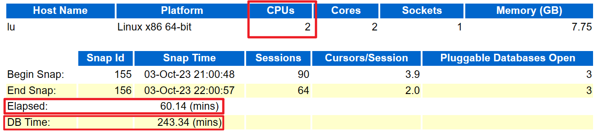 

从Begin_snap和End_snap可以看出来快照开始和结束的时间，统计一个小时，也就是60分钟，对应Elapsed。

采样时间内数据库负荷大小主要的关注指标是DBTime，DBtime的值越小越好，越小说明数据库负载小。以下是数据库负载的计算公式：
```txt
采样时间内数据库负荷大小 = DBtime / Elapsed / CPUs
```

计算结果以不超过0.5为妙，如果超过1，说明负载大，等待严重。

以上图为例，采样时间内数据库负荷大小 = 243.34 / 60.14 / 2 = 2.02311274，此事件段的数据库负载严重过高，说明数据库可能有异常，需要进一步排查。

## 3.2 Load Profile

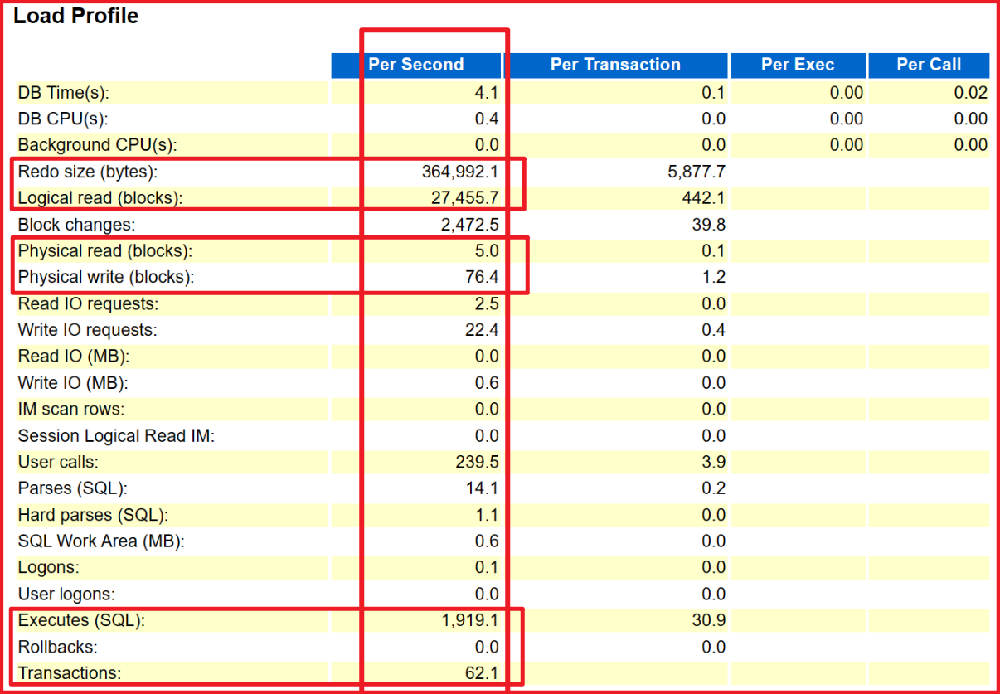

1. Redo size：看有没有大量写入。一般归档满，磁盘不足看这个。
2. Logical read：看读数据量大不大。一般硬件条件达标的环境，这个越大说明系统越繁忙。（SQL写的不好也会让数据库很忙）
3. Block changes：看写入的数据量大不大。
4. Physical read：看SQL写的好不好，或者硬件是不是不给力（内存过小）。
5. Executes (SQL)：每秒执行的SQL数量。判断业务的复杂程度。
6. Transactions：每秒执行的事务数量。判断系统忙不忙。

## 3.3 Top 10 Foreground Events by Total Wait Time

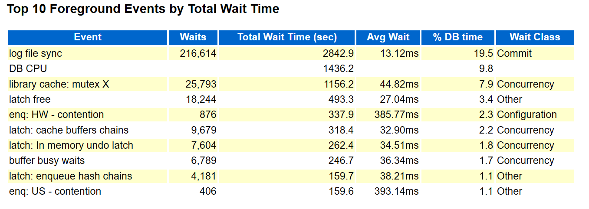

TOP10等待事件。

## 3.4 SQL ordered by Elapsed Time

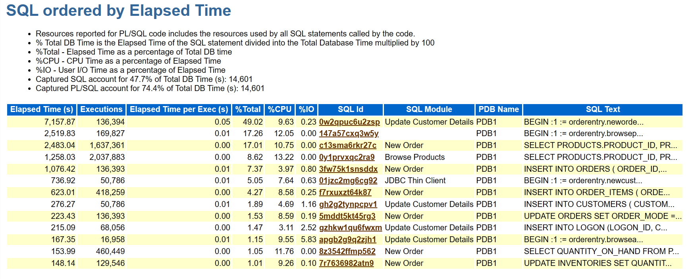

由于数据库的负荷主要来自于SQL，分析AWR报告离不开分析TOP SQL。这里列出了“总”执行时间最长的SQL，包括单次执行时间短但执行次数多和执行次数少但单次执行时间长两种情况。

如图，Elapsed Time(s) = Executions * Elapsed Time per Rxec(s)

## 3.5 IOStat by Function summary

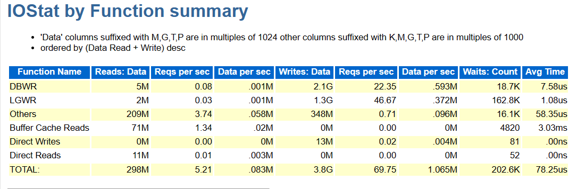

## 3.6 IOStat by Filetype summary

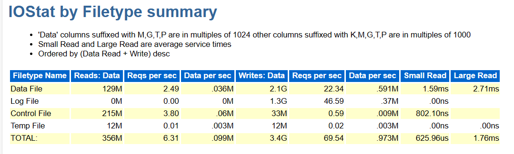

## 3.7 Segments by Logical Reads

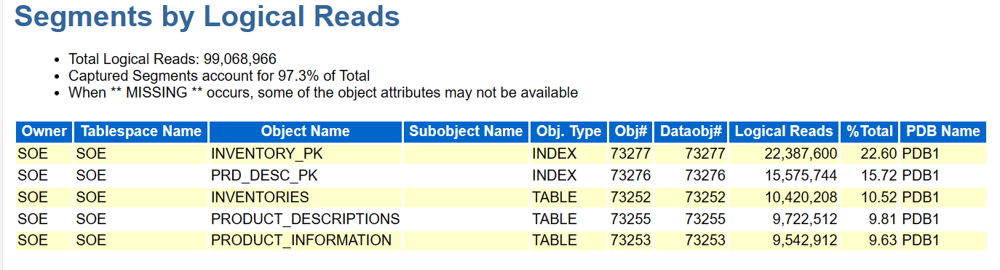

段的逻辑读。

## 3.8 Segments by Physical Reads

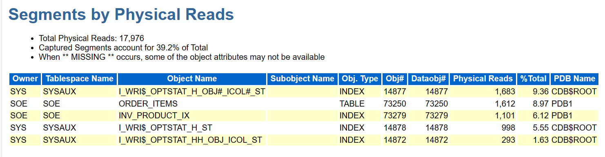

段的物理读。

## 3.9 Segments by Row Lock Waits

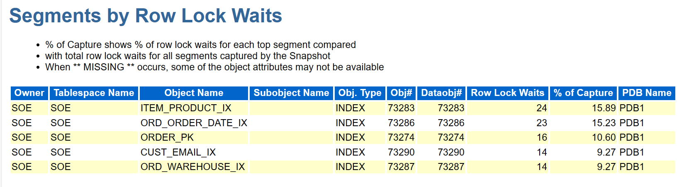

段的行锁等待。

## 3.10 Segments by ITL Waits

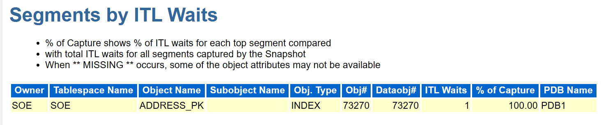

## 3.11 Segments by Buffer Busy Waits

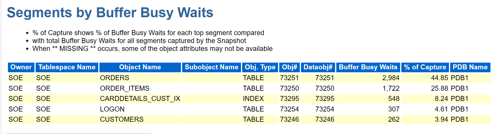

# 4 综合负荷评估

数据库负荷大小是一个主要参考。采样时间内数据库负荷大小 = DBtime / Elapsed / CPUs。

是不是这个值很大就一定有问题？或者说很小就一定没有问题？一般的工具解读可能会是这样告诉你的，但还是要依据实际情况而论。

如果我们系统的业务量小，这个值很大说明有较大的问题。如果我们的业务量大，这个值大也是正常的，这里要结合一下自己企业的实际情况。如何确定业务量大小？

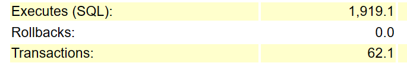

在Load Profile中可以得到采样时间内每秒的事务数和每秒的SQL数量。

首先这里的事务越大说明业务越大，SQL越多，说明业务越复杂。这就是一个评判标准,但是也不是绝对的。如果我们系统是一个订单系统，每天10万单，那么平均每秒就一单，而我们下订单是要一个事务的，支付订单也会有1-2个事务，再有就是修改订单。一般来说这个系统的事务数量应该是每秒5-10个为好。如果多了说明设计的不合理。而一个事务中一般我们认为3-5个SQL相对合理。也就是说如果执行SQL数量除以事务数量大于5，就是逻辑实现的不合理，或者设计（表设计、流程设计）不合理。不是一个高效简洁的业务场景。这里千万注意一点，不要认为自己的系统业务很复杂，不少复杂是可以简化的。所以第一部分的评估涉及了负荷的比值，参考事务以及每个事务的SQL数量，最后结合自己业务的写入场景综合判断。通常来说大多数都是负荷高于理论业务压力。

# 5 写入压力

写数据库一般都是要写redo文件，Redo size的大小和Physical write物理写就成为了衡量写入的标准。

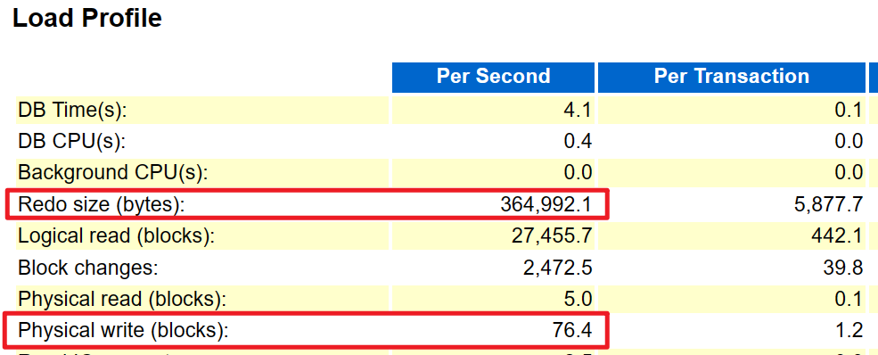

Redo size (bytes)的值应该小于我们的redolog文件，否则变成每秒切换一次redolog，太频繁了。如果确实场景如此，那么应该加大redolog的大小。一般来说我们的系统写入不会成为瓶颈，这个过大通常基本都属于异常。比如：
1. update全表（忘记带条件）。
2. 逻辑出现问题反复大量更新数据。这个和上面是有区别的，比如一个表10亿，每次更新1000万，而不是全部。但是毕竟更新的很多了。
3. 特殊场景批量写入或者导入。

除了3.这个场景是个别发生，其他的出现都是不正常的。因为一般业务系统没有非常大的写入压力（五大行、三大运营这种巨无霸级别的另当别论），我们主要的压力都是来自于读。所以这个写入压力Redo和Physical write如果比较大的话一定是异常。


# 6 读压力

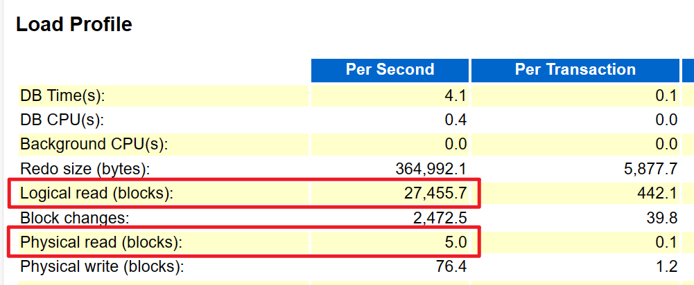

这是数据库主要压力来源。如果听过一句读写分离的话，就知道为什么是读的压力大了。读取压力甚至可能影响写入。这里的读分为逻辑读（Logical Reads）和物理读（Physical reads），主要分为三种情况：

1. 物理读多，并且逻辑读多。这种在AWR报告中会出现`direct path read`（因为直接路径读）的字样。说明SQL写的不好。一次读取的数据大于一定的阈值，数据库为了防止这些数据冲击内存，直接在磁盘上读取，不加载到内存。而内存中的表也是大量出现全表查询。这种说明SQL没有管控，质量比较低下，稳定性较差；
2. 物理读少，逻辑读多。可能是业务正常的，但是也可能是由于数据量小都已经到了内存中，在内存中全表读,用内存的高速读取掩盖了SQL的问题。通常来说是后者；
3. 物理读多，逻辑读少。这种说明问题最大，几乎内存没有发挥作用，都是全表读磁盘，而且机器配置也差；
4. 物理读少，逻辑读少。这种是最好的状态，如果达到这种状态，可以估算系统的负荷不会超过5%。

以上提的多或少的定义不好区分，假设一个SQL平均一次10个IO，一个IO大小是8K，那么就是80K，仅供参考。我们通常在AWR中会看到以下三种：

1. `db file scattered read`：分散，多块读，通常是没有建立索引或没有有效使用索引，这个是比较确定的；
2. `db file parallel read`：并行，物理读等待事件涉及到的数据块均是不连续的。方向是SQL以及复合索引；
3. `db file sequential read`：连续，表示发生了与索引扫描相关的等待。意味着I/O出现了问题，通常表示I/O竞争或者I/O 需求太多。方向是索引建立不够优以及硬件IO。

# 7 锁

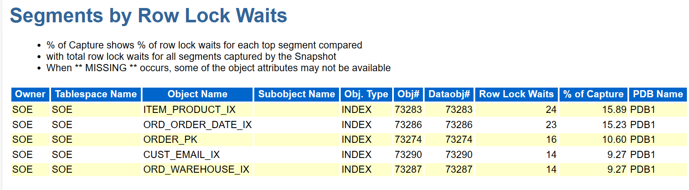

锁主要有两种原因:

1. 更新的太多太慢，后续SQL开始执行，前面SQL还没有释放，造成了锁等待。这种基本是SQL逻辑问题或者SQL全表执行过慢，导致事务周期过长。
2. 执行完毕，未及时提交。通常检查update的where条件，如果是唯一索引造成的锁就是应用程序未及时提交。这种常见于一个事务中，需要等外部接口返回，迟迟没有等到所以事务未提交。

# 8 SQL

## 8.1 SQL ordered by Elapsed Time

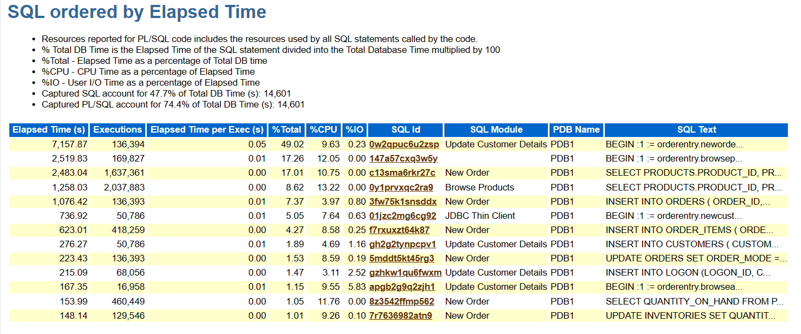

基本属于待优化的榜单。注意执行次数和单次时间，如果一次几千秒的，可能是定时任务，而且是一个低效的定时任务。如果是执行几秒的一般都是没有建立索引或者索引建立错了（比如没有用到先导列），再或者条件范围过大甚至就是全表。通常来说即使0.1秒的也可以优化到1毫秒以内。如果有个SQL就是查一个ID用了40毫秒，那么一定是全表。配上合适的索引都可以达到微妙级别。如果这里出现execution是0.那么说明他执行了那么就还没执行完一次。

## 8.2 SQL ordered by CPU Time

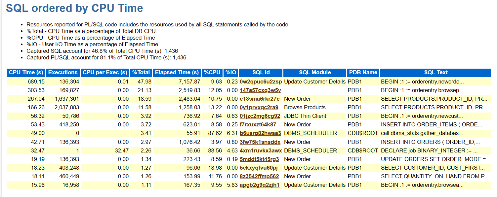

哪些SQL对CPU消耗。

## 8.3 SQL ordered by User I/O Wait Time

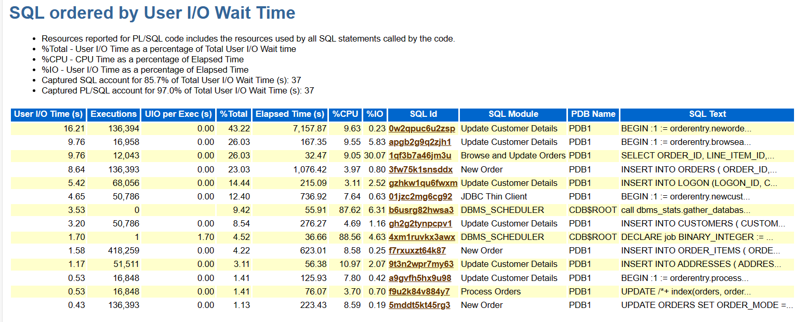

SQL的I/O消耗。

## 8.4 SQL ordered by Reads

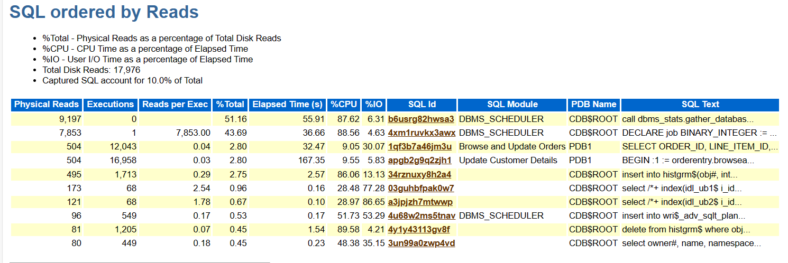

需要强调的是，数据库压力主要来自于读。上图上=的是SQL每秒读了多少次，这个非常关键。找出最大的读，优化它。

## 8.5 SQL ordered by Executions

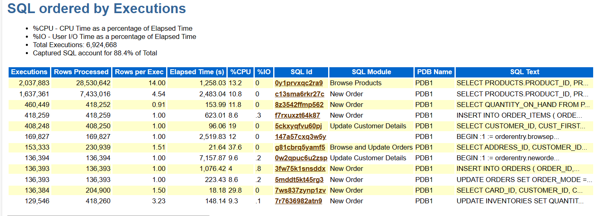

SQL执行次数。

# 9 I/O

采样时间内的IO读取情况，读磁盘direct reads和读内存buffer cache reads，还可以看到每秒读取的情况，让你充分掌握数据库运行的健康度。

## 9.1 IOStat by Function summary

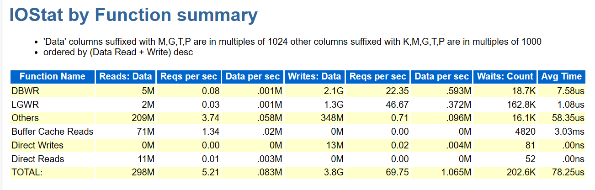

## 9.2 IOStat by Filetype summary

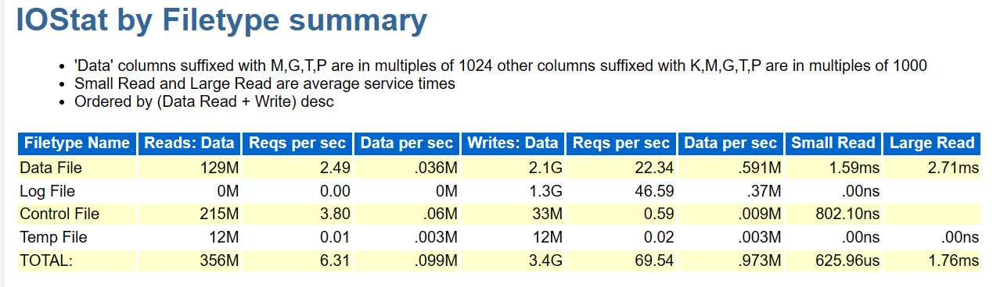

# 10 Advice

## 10.1 Buffer Pool Advisory

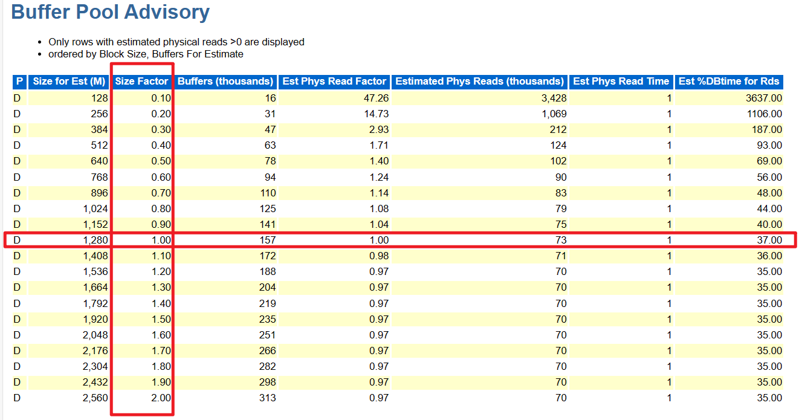

这部分，主要从Size Factor、Est Phys Read Factor 都等于1.00的行开始。

往上看，观察当Size Factor减小时，Est Phys Read Factor是不是明显变化，如果变化不明显，说明可以减小当前的buffer pool设置，相反则表示不能减小。

往下看，观察当Size Factor增大时，Est Phys Read Factor是不是明显变化，如果变化不明显，说明没必要增大buffer pool设置，相反，则表示增大buffer pool可以提高系统性能。

如上图的例子，则可以将buffer pool增加20%。

## 10.2 PGA Memory Advisory

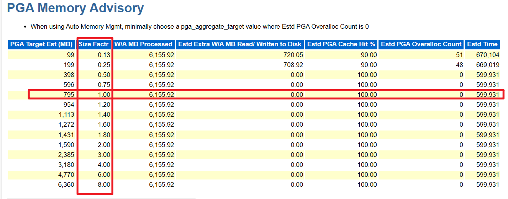

和刚刚的分析思路一样，从 Size Factr  = 1.00的行开始，上下观察当减小或增大PGA时对Estd Extra W/A MB Read/Written to Disk的影响是否明显。

上图分析的结果是建议将PGA减少一半。

## 10.3 SGA Target Advisory

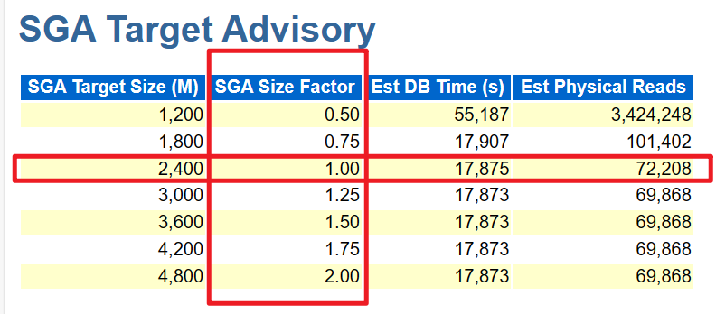

从SGA Size Factor = 1.00的行开始，上下观察减小或增大SGA时对 Est Physical Reads的影响是否明显。

此例可以将SGA增加25%。
