# 一、物理体系
## 1.1概述
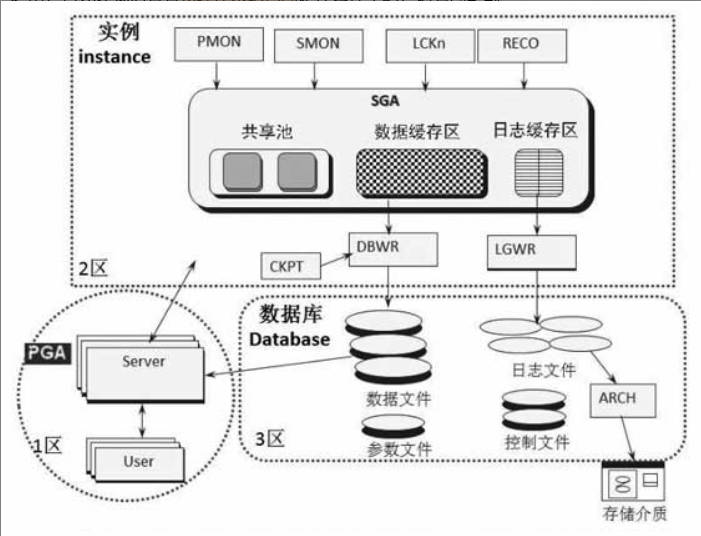

这张体系结构图看似简单，其实很有玄机，我们平时遇到的与数据库相关的各种问题，很多都可以从体系结构中找到解决方法，理解体系结构非常重要，需要将体系结构记住。

体系结构说明：  
1. oracle由实例Instance和数据库Database组成。
2. 实例是由一个共享内存区SGA（System Global Area，也称系统全局区）和一系列后台进程组成。其中SGA主要被划分为共享池（shared pool）、数据缓存区（db cache）和日志缓存区（log buffer）。后台进程包括PMOM、SMON、LCKn、RECO、CKPT、DBWR、LGWR、ARCH等。
3. 数据库是由数据文件、参数文件、日志文件、控制文件、归档日志文件等一系列文件组成的，其中归档日志最终可能会被转移到新的存储介质中，用于备份恢复使用。
4. 程序全局区PGA（Program Global Area，也称程序缓存区）也是一块内存区，和SGA最明显的区别是PGA不是共享内存，是私有不共享的。用户对数据库发起的无论查询还是更新的任何操作，都先在PGA进行预处理，然后才进入实例区域，由SGA和后台进程共同完成。  
   PGA的作用（预处理）主要有三点：
   - 第一，保存用户的连接信息，如会话属性、绑定变量等；
   - 第二，保存用户权限等重要信息，当用户进程与数据库建立会话时，系统会将这个用户的相关权限查询出来，然后保存在这个会话区内；
   - 第三，当发起的指令需要排序的时候，PGA（Program Global Area）正是这个排序区，如果在内存中可以放下排序的尺寸，就在内存PGA区内完成，如果放不下，超出的部分就在临时表空间中完成排序，也就是在磁盘中完成排序。
5. 用户的请求发起经历的循序一般如下：1区 → 2区 → 3区，或者1区 → 2区。

## 1.2 体系结构原理初探
### 1.2.1 从一普通查询SQL语句说起
当用户与数据库建立连接，会在PGA中给当前发起用户创建私有的内存空间，保存用户的连接和权限信息，只要该会话不断开连接，下次系统不用再去硬盘中读取数据，而直接重PGA内存区获取。

如果用户在这个session上执行一个SQL语句，会立即匹配成一条唯一的hash值，然后进入SGA区的共享池中。

在共享池内查看是否存储过该SQL指令的hash值，如果没有，首先查询语句的语法是否正确（比如select是否写成了selecet）、语义是否正确（比如表是否存在）、是否有权限，在这些都没问题的情况下，将这个hash值在共享池存储下来。

接下来开始进行解析（即Oracle生成和选择代价（Cost）最低的一种执行计划），解析完成后立即将这个执行计划存储起来，并且和之前存储的该SQL指令的hash值对应起来。

然后（执行计划的查找方式）到数据缓存区中获取想要的数据，如果数据缓存区中找不到对应的数据，则需要到数据库Database中的数据文件区中查找。如果查到了，就带回数据缓存区并将结果返回给用户，如果找不到，则结束本次查询。

#### 1.2.1.1 实操验证
实验环境准备脚本：
```sql
sqlplus lpy/lpy
drop table t;
create table t as select * from all_objects;
create index idx_t_object_id on t(object_id);
set autotrace on;
set linesize 1000;
set timing on;
select object_name from t where object_id = 29;
```
说明：`set autotrace on`查询结果包含执行计划和统计信息，`set timing on`表示输出执行时间。

首次执行情况：   
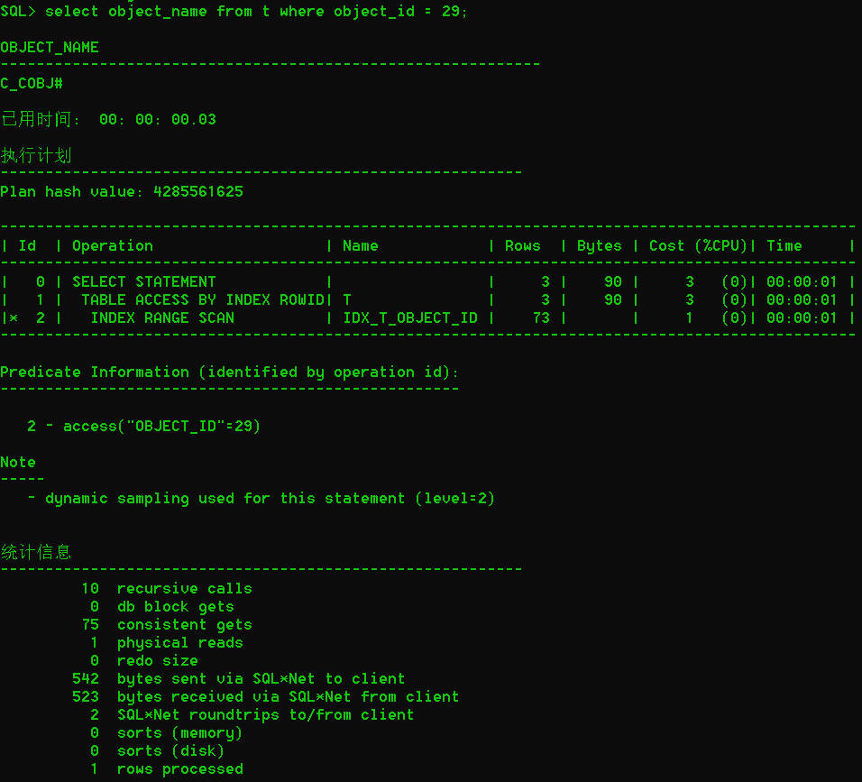

同一SQL脚本再次执行后性能提升：   
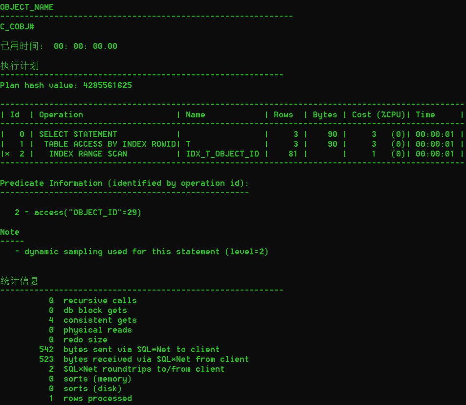

分析：
1. 从执行时间上看，第一次执行时间为0.03秒，第二次执行时间小于0.01秒，比第一次快了3倍多；
2. 比较统计信息，首次执行产生了10次递归调用，75次逻辑读，1次物理读。第二次产生了0次递归调用，4次逻辑读，0次物理读。

**结论**：
1. 用户首次执行该SQL指令时，该指令从磁盘中获取用户连接信息和相关权限信息，并保存在PGA内存里。当用户再次执行该指令时，由于SESSION之前未被断开重连，连接信息和相关权限信息就可以从PGA内存中直接获取，避免了物理读。
2. 首次执行该SQL指令结束后，SGA内存区的共享池里已经保存了该SQL指令唯一的hash值，并保留了语法语义检查及执行计划等相关解析动作的劳动成果，当再次执行该SQL指令时，由于该 SQL指令的hash值和共享池里保存的相匹配，所以之前的硬解析动作无须再做，不仅跳过了相关语法语义检查，对于该选取哪种执行计划也无须考虑，直接拿来就好。
3. 首次执行该 SQL 指令时，数据一般不在 SGA 的数据缓存区里（除非被别的 SQL读入内存了），只能从磁盘中获取，不可避免地产生了物理读，但是由于获取后会保存在数据缓存区里，再次执行时可直接从数据缓存区里获取，完全避免了物理读。

### 1.2.2 Oracle代价
在了解Oracle代价前，先了解一下Oracle优化器。
优化器（Optimizer）是oracle数据库中内置的一个核心系统/核心组件/模块。目的是按照一定的判断原则来得到它认为的目标SQL在当前情形下最高的执行路径（Access Path），即为了得到目标SQL的执行计划。依据选择执行计划时所用到的判断原则，优化器可以分为RBO和CBO，RBO(Rule-Based Optimizer)是基于规则的优化器。CBO(Cost-Based Optimizer)是基于代价的优化器。

这里我们着重了解CBO。

从Oracle 7开始，Oracle 就引入了CBO。CBO在选择目标SQL的执行计划时，所用的判断原则为代价，CBO会从目标SQL诸多可能的执行路径中选择一条代价最小的执行路径来作为其执行计划，各条执行路径的代价是根据目标SQL语句所涉及的表、索引、列等相关对象的统计信息计算出来的。

这里的代价是指Oracle根据相关对象的统计信息计算出来的一个值，它实际上代表了Oracle根据相关统计信息估算出来的目标SQL的对应执行步骤的I/O、CPU和网络资源的消耗量，这也就意味着Oracle数据库里的代价实际，上就是对执行目标SQL所要耗费的I/O、CPU和网络资源的一个估算值。

CBO会认为那些消耗系统I/O和CPU资源最少的执行路径就是当前情况下的最佳选择。

#### 1.2.2.1 实操验证
验证Oracle对代价的判断是否准确。

在表有索引的情况下，Oracle可以选择索引读，也可以选择全表扫描，这是两种截然不同的执行计划，不见得一定是索引读胜过全表扫描，有时索引读的效率会比全表扫描更低，所以Oracle的选择不是看执行的是什么计划，而是判断谁的代价更小。

使用HINT，是一种强制写法，比如强制让某SQL语句不走索引，或强制走索引。上面的例子增加/\*+full(t)\*/,强制不走索引，走全表扫描：
```sql
select /*+full(t)*/ object_name from t where object_id = 29;
```
不使用HINT：   
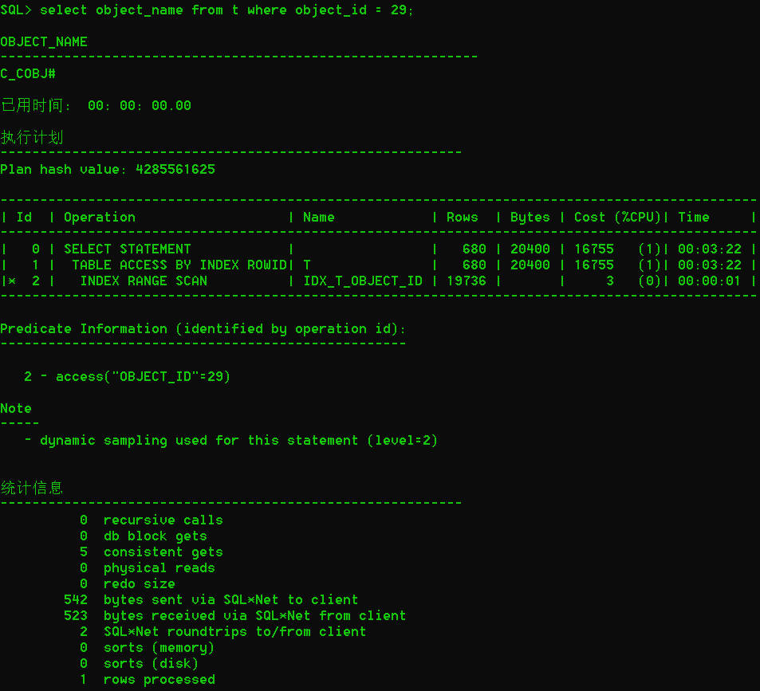

使用HINT：   
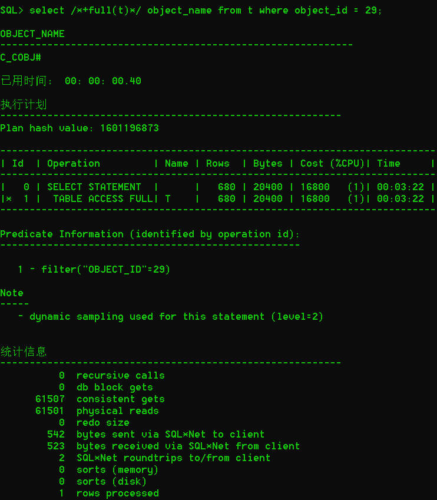

分析：
1. 正常执行走索引的逻辑读为75，执行时间为0.03秒，而强制全表扫描的逻辑读为61507，执行时间为0.4秒；
2. 正常执行走索引的代价为3，而强制全表扫描的代价为16800，离谱啊，高这么多。

结论：
比较强制走全表扫描的SQL指令和此前Oracle自己选择用索引方式的SQL指令的执行时间，以及各自执行代价及逻辑读的大小，发现强制走全表扫描明显在性能上要大大逊色于Oracle自己选择的索引方式。  
这个小试验证明了 Oracle 数据库还是可以信赖的，我们可以充分相信它的选择，只是它的选择比较艰难，开销很大。如果它们选择的结果能保留下来重用，那艰难的动作就可以避免重复操作，性能就能大幅度提升了，Oracle在这方面的设计确实很巧妙。

## 1.3 体系结构原理再探
### 1.3.1 oracle后台进程
#### 1.3.1.1 DBWR进程 ★
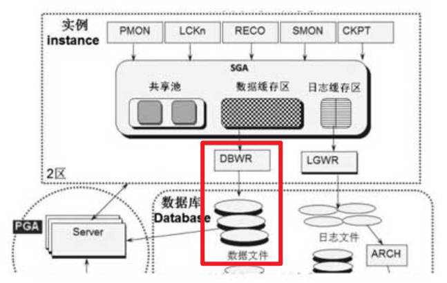

DBWR 是 Oracle 最核心的进程之一。

进行更新操作时（添加、修改、删除），在数据缓存区内修改完数据后，会启用DBWR进程，将更新的数据从数据缓存区内刷入到数据文件中，即内存刷入到磁盘，因为磁盘才是真正存储数据的地方，否者一断电，在内存中的数据就会消失。

总之，DBWR是Oracle最核心的进程之一，负责把数据从数据缓存区写到磁盘里，该进程和CKPT相辅相成，因为**是CKPT促成DBWR去写的（不是commit决定）**。不过DBWR也和LGWR密切相关，因为DBWR 想将数据缓存区中的数据写到磁盘的时候，必须通知LGWR 先完成日志缓存区写到磁盘的动作后，方可开工。

#### 1.3.1.2 CKPT进程 ★
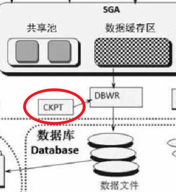

什么时候将数据缓存区中的数据写到磁盘的动作正是由进程CKPT来触发的，CKPT触发DBWR从数据缓存区中写出数据到磁盘。

这是一个相当重要的进程，我们可以通过设置某参数来控制CKPT的触发时间，比如万一出现数据库崩溃，希望Oracle的SMON最多用多长时间来做实例恢复，该参数就是FAST_START_MTTR_TARGET，通过调整该参数，Oracle会调配CKPT在适当的时候去调用DBWR。当然，这个参数也并非越小越好，太小的数值会导致Oracle性能降低。CKPT执行得越频繁，DBWR写出就越频繁，DBWR写出越频繁越不能显示批量特性，性能就越低，但是数据库异常恢复的时间会越短。

一个值得思考的问题是，更新语句执行完毕后，如果一直不提交，最终会从数据缓存区刷进磁盘吗？   
答案是肯定的，**因为DBWR将数据缓存区中的数据写到磁盘，不是由COMMIT决定的，而是由CKPT进程决定的。**

此外，在CKPT的触发或者说命令下，DBWR将数据缓存区中的数据写到磁盘，但是如果`LGWR`进程出现故障了，DBWR此时还是会不听CKPT的命令罢工的，因为 Oracle 在将数据缓存区中的数据写到磁盘前，会先进行日志缓存区写进日志文件的操作，并耐心地等待其先完成，才会去完成这个‘内存刷到磁盘’的动作，这就是所谓的凡事有记录。

#### 1.3.1.3 LGWR进程 ★
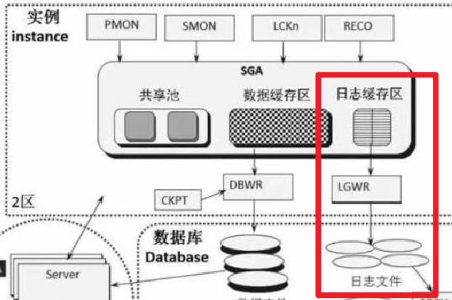

这个进程的作用很简单，就是把日志缓存区中的数据从内存写到磁盘的REDO文件里，完成创建数据库对象、更新数据等操作过程的记录。这个REDO的记录非同小可，可以用来做数据库的异常恢复，只要保护好了这些REDO 文件和后续对应的归档文件，从理论上来说，即使数据文件被删除了，也可以让数据库根据这些日志记录，把所有的在数据库中曾经发生的事情全部重做一遍，从而保证数据库的安全。

例如新建好一个数据库，完成如下三个动作：    
1、A动作，建立一张表T。2、B动作，往T表中插入一条数据。3、C动作，用该数据更新某字段。

A、B、C三个动作都被记录到日志中了，但是接下来数据库出现异常：  
1. T表记录被人误删除了，怎么办？
2. 整张T表都被人删除了，怎么办？

问题1：要想恢复T表被删除的记录，很简单，根据日志把B、C动作再执行一遍。

问题2：表T被误删，要想恢复，其实也很简单，根据日志把A、B、C执行一遍就可以了。

正因为日志文件对数据库如此重要，LGWR也成了和DBWR一样核心的数据库进程。

LGWR必须记录下所有从数据缓存区写进数据文件的动作，工作任务相当繁重。由于在顺序记录情况下保留的日志才有意义，多进程难以保证顺序，因此LGWR只能采用单进程。为了解决这个问题，LGWR给自己施压，制定了五条严格的制度来要求自己，以此来适应高强度的日志记录工作：

1. 每隔三秒，LGWR运行一次；
2. 任何COMMIT触发LGWR运行一次；
3. DBWR要把数据从数据缓存写到磁盘，触发LGWR运行一次；
4. 日志缓存区满三分之一或记录满1MB，触发LGWR运行一次；
5. 联机日志文件切换也将触发LGWR。

#### 1.3.1.4 ARCH进程
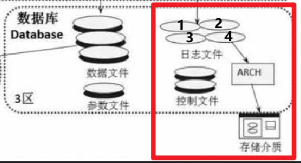

LGWR进程是写日志的过程是这样的，一开始写日志文件1，写满后切换到日志文件2继续写，日志文件2写满后写3，3写满后写4，当4也写满后，再返回去写1。但是在1被覆盖重写前，需要先备份出去。

ARCH的作用是在LGWR写日志写到需要被覆盖重写的时候，触发ARCH进程去转移日志文件，将日志文件复制出去形成归档日志文件，以免日志丢失。即日志文件1在被重写时先备份出去的文件，命名为`归档文件`，接下来再到2、3、4，我们就可以依此类推了。此外，这些ARCH文件也需要定时转移到新的存储介质中，这个存储介质里的ARCH就是将来数据库故障恢复时的法宝了。

#### 1.3.1.5 PMON进程
PMON的含义为Processes Monitor，是进程监视器。如果你在执行某些更新语句，未提交时进程崩溃了，这时候PMON会自动回滚该操作，无须人工去执行ROLLBACK命令。除此之外它还可以干预后台进程，比如RECO出现异常失败了，此时PMON会重启RECO进程，如果遇到LGWR进程失败这样的严重问题，PMON会做出中止实例这个激烈的动作，用于防止数据错乱。

#### 1.3.1.6 SMON进程
SMON的含义为System Monitor，可理解为系统监视器。与PMON不同的是，SMON关注的是系统级的操作而非单个进程，工作重点在于实例恢复，除此之外还有清理临时表空间、清理回滚段表空间、合并空闲空间等功能。

#### 1.3.1.7 LCKn进程
LCKn仅用于RAC数据库，最多可有10个进程（LCK0,LCK1,…,LCK9），用于实例间的封锁。

#### 1.3.1.8 RECO进程
RECO用于分布式数据库的恢复，全称是Distributed Database Recovery，适用于两阶段提交的应用场景。这里我简单描述一下，比如我们面临多个数据库A、B、C，某个应用跨越三个数据库，在发起的过程中需要A、B、C库都提交成功，事务才会成功，只要有一个失败，就必须全部回滚。

### 1.3.2 从DML语句中体会体系结构
#### 1.3.2.1 提交的探讨
现在有一条更新语句：`update t set object_id=92 where object_id=29`，执行后，在数据缓存区中将object_id=29修改为92。这时，在数据库中还查询不到object_id=29被改变为92，因为没有执行commit提交操作（只能在执行update当前session能查到变化，而其他session不行）。

其实这里的机制涉及的细节非常多，一条更新语句无论插入、修改还是删除，最终执行完毕后都需要执行用户做提交COMMIT或回滚ROLLBACK的确认。

值得注意的是，当发起提交命令后，数据缓存区中的数据不会立即被DBWR进程写进磁盘，而是当缓存区中的数据积累到一定的程度，再批量刷入磁盘中，因为这样高效得多。

但是批量刷出这种方式也有风险，如果此时数据库断电了怎么办，如何即兼顾效率又不失安全？   
其实大可不必担心，数据缓存区是可以批量刷出的，效率和安全可以同时得到保障。因为**COMMIT时日志缓存区会把要操作的动作写到磁盘的日志文件里，这样Oracle就不一定非要将数据从数据缓存区写到磁盘了。磁盘中的日志文件不是内存中的日志缓存区，会永久保存，不怕断电，断电后可以依据磁盘里的日志文件重新操作一次，把数据缓存区丢失的数据恢复。**

那么，数据缓存区中的数据是否批量越大越好呢？   
要考虑一个平衡问题：批量刷出的量比较小，Oracle性能就会降低，但是断电开机恢复的时间就较短；反之，批量刷出的量比较大，Oracle 性能是更高了，但是断电开机恢复的时间也较长。
所以，需要界定一个合理的范围，而这是由另一个进程[CKPT](#1312-ckpt进程-★)来完成的，由CKPT促成DBWR去写。

#### 1.3.2.2 回滚的研究
执行`update t set object_id=92 where object_id=29;`后，如果继续执行一个ROLLBACK，数据库不会将object_id=29的数据更改为92，这中间到底发生了什么，Oracle是如何做到的呢？
1. 想更新object_id=29的记录，首先需要查到object_id=29的记录，检查object_id=29是否在数据缓存区里，不存在则从磁盘中将其读取到数据缓存区中，这一点和普通的查询语句类似。
2. 在undo表空间的相应回滚段事务表上分配事务槽，从而undo表空间分配到空间。该动作需要记录日志写进日志缓存区。
3. 在**数据缓存区**中创建object_id=29的前镜像，**前镜像数据也会写进磁盘的数据文件里（undo表空间的数据文件）**，从缓存区写进磁盘的规律前面已经说过了，由CKPT决定，触发DBWR写入。当然也别忘记这些动作都会记录日志，并将其写进日志缓存区，劳模LGWR还在忙着将日志缓存区中的数据写入磁盘形成redo文件呢。
4. 前面的步骤做好了，才允许在数据缓存区将object_id=29修改为object_id=92，这个显然也是要记录进日志缓存区的。
5. 此时用户如果执行了commit提交，日志缓存区立即要记录这个提交信息，然后就把回滚段事务标记为非激活INACTIVE状态，表示允许redo。
6. 如果是执行了rollback回滚，**Oracle需要从回滚段中将前镜像object_id=29的数据读出来，修改数据缓存区**，完成回滚。这个过程依然要产生日志，要将数据写进日志缓存区。

#### 1.3.2.3 DML语句的特点
DML 语句一般分为三类，即 insert 插入、update 修改和delete 删除。

通过思考以下问题理解DML语句的特点：

**问题1**：这三类语句哪种语句对回滚的相关操作负荷最大，哪种最小，或者说哪种操作产生的undo最多，哪种产生的undo最少？   
delete最多，删除的反向操作是插入，等于把整行记录完整地插入回去，那就是要把表的所有字段信息都记录下来。insert最少，反向操作是delete，insert的undo信息记录了插入记录的rowid，这个就是的唯一标记，根据这个rowid就足以定位到插入的记录并删除，从而达到回退目的。

**问题2**：哪种记录redo最多，哪种最少？   
这个和undo正好相反，redo就是把刚才做的事情重新做一遍。delete只需记录相关rowid就可以再删除一遍，很精简，产生的redo最少。而insert如果想再完成一遍，至少需要知道所有字段的取值，产生的redo肯定最多。

**问题3**：专门针对undo会产生对应的redo吗？   
undo 的信息是准备用户回退的前镜像信息，是用于大家后悔自己操作后的还原动作，这些数据也是需要保护的，如果丢失了就别想还原了，而redo是非常好的恢复宝物，有它的记录我们就放心了。

**总结**：   
DML 语句不同于查询语句，会改变数据库中的数据。除此之外，它还会产生用于将来恢复的redo和用于回退的undo。另外还有一个细节，由于undo也需要保护，所以还会专门产生保护undo操作的redo。

### 1.3.3 事务的四大特性 ACID ★★★★★

首先来思考一下，什么是事务？执行一个查询语句算吗？

事务开始于一个DML语句。结束于以下几种情况：1、COMMIT/ROLLBACK；2、执行了DDL/DCL语句；3、用户主动断开数据库连接（EXIT）；4、数据库服务器宕机。另外，一个DDL/DCL语句隐含了自动的COMMIT。   
普通的select语句不算事务，除非带有for update。

结合后面事务的四大特性学习事务，更容易理解。

Oracle是通过undo和redo来满足事务的四大特性的，我们先来了解undo和redo。

#### 1.3.3.1 undo & redo

##### 1.3.3.1.1 undo

Oracle中 undo的作用为了保证数据库中多个用户间的一致性读和回滚事务。

**一、一致性读**

一致性读的原理是，在进行DML操作时，在回滚表空间的相应回滚段（undo segment）事务表上分配事务槽，从而在undo表空间分配到空间。然后在数据缓存区中创建变更数据的前镜像（before image），前镜像数据（旧数据）也会写进磁盘的数据文件里（回滚表空间的数据文件）。如果用户还没有进行commit操作，其他人查询此条记录返回的就是前镜像数据，因为其他用户读到的数据是回滚段中原数据块中的数据，保证没有commit的数据读取的一致性。若undo块中存放的被修改的数据被其他事务覆盖，则无法找到被修改前的数据，就会抛出ORA-1555 snapshot too old 错误。

示例：

比如表T有1000条记录，获取表T总的数据量需要5分钟。当前时间为9点，用户A执行`select * from t;`，当9点02分时，用户B执行`delete from t where rownum <= 1;`和`commit;`。那么，当9点05分时，`select * from t;`将返回多少条数据给A用户？

如果返回999条记录，则说明发生了脏读；如果仍然返回1000条记录，则说明发生了一致性读。

**二、回滚事务**

回滚事务就是用户进行DML操作后执行rollback，Oracle需要从回滚段中将前镜像数据读出来，**修改数据缓存区**，完成回滚。

##### 1.3.3.1.2 redo

redo保证数据库事务的可恢复性，从而使得在故障之后，数据可以被恢复。

#### 1.3.3.2 ACID

##### 1.3.3.2.1 原子性（Atomicity）

事务开始所有操作要么全部做完，要么全部不做，不可能停留在中间环节。事务执行过程中出错要回滚到事务开始前的状态。

当我们做一个变更时，系统会创建一条undo记录来描述怎样撤销这次变更。也就是说，当执行到一个事务中间时，如果有其他用户想访问我们更改过的数据，他必须使用undo记录来查看变更前的旧数据，即只有当我们提交这个事务后，所做的更改才能被他人看到。这样可以确保，其他用户要么能看到我们做的所有更改，要么什么更改也看不到。

##### 1.3.3.2.2 一致性（Consistency）

事务执行前和执行后，数据库的完整性约束没有被破坏。比如A向B转账不可能A扣了钱，B却没有收到。

##### 1.3.3.2.3 隔离性（Isolation）

一个事务不能看到另一个没有提交的事务的执行结果，同一时间，只容许一个事务请求同一数据，不同事务之间彼此没有任何干扰。

##### 1.3.3.2.4 持久性（Durability）

一个事务一旦被提交了，那么对数据库中的数据的改变就是永久性的，即便在数据库系统遇到故障的情况下也不会丢失事物的操作。

### 1.3.4 并发事务引起的隔离问题 ★★★★

#### 1.3.4.1 脏读

所谓的脏读，指的是读到了其他事务未提交的数据，未提交意味着这些数据可能会保存到数据库，也可能会回滚，不保存到数据库。当这个数据发生了回滚，就意味着这个数据不存在，这就是脏读。

#### 1.3.4.2 不可重复读

不可重复读，指的是在一个事务内，最开始读到的数据和事务结束前的任意时刻读到的同一批数据出现不一致的情况，这就是不可重复读。

#### 1.3.4.3 幻读

例如事务A对一个表中的数据进行了修改，这种修改涉及到表中的全部数据行。此时，突然事务B插入了一条数据并提交了，当事务A提交了修改数据操作之后，再次读取全部数据，结果发现还有一条数据未更新，给人感觉好像产生了幻觉一样，这就是幻读。

### 1.3.5 事务的隔离级别 ★★★★

| 隔离级别 | 脏读 | 不可重复读 | 幻读 |
| :-------: | :--: | :--------: | :--: |
| 读未提交 |  Y   |     Y      |  Y   |
| 读已提交 |  N   |     Y      |  Y   |
| 可重复读 |  N   |     N      |  Y   |
| 序列化   |  N   |     N      |  N   |

#### 1.3.5.1 读未提交（Read uncommitted）

所有事务都可以看到其他未提交事务的执行结果。本隔离级别是最低的隔离级别，虽然拥有超高的并发处理能力及很低的系统开销，但很少用于实际应用。因为采用这种隔离级别只能防止更新丢失问题（这个问题现代关系型数据库已经不会发生），不能解决脏读，不可重复读及幻读问题。

示例：小明去商店买衣服，付款的时候，小明正常付款，钱已经打到商店老板账户，但是小明发起的事务还没有提交。就在这时，商店老板查看自己账户，发现钱已到账，于是小明正常离开。小明在走出商店后，马上回滚差点提交的事务，撤销了本次交易曹邹。
结果：小明未付钱买到了衣服，商店老板实际未收到小明的付款。
分析：商店老板查看自己的资金账户，这个时候看到的是小明还没有提交事务的付款，这就是脏读。

#### 1.3.5.2 读已提交（Read committed）

这是大多数数据库系统的默认隔离级别（但不是MySQL默认的）。它满足了隔离的简单定义：一个事务只能看见已经提交事务所做的改变。这种隔离级别可以防止脏读问题，但会出现不可重复读及幻读问题。

示例：小明卡里有1000元，准备与几个朋友聚餐消费，消费1000元，当他买单时（事务开启），收费系统检测到他卡里有1000元。就在检测完毕的时候，小明女朋友发现小明有私房钱，全部转走并提交。当收费系统准备扣款时，再检查小明卡里的金额，发现已经没钱了，付款不成功。小明此时就会很纳闷，明明有钱的呀，钱呢？

分析：该示例中同一个事务范围内两个相同的查询却返回了不同数据，这就是不可重复读。

#### 1.3.5.3 可重复读（Repeatable read）

在开始读取数据（事务开启）时，不再允许修改操作，它确保同一事务的多个实例在并发读取数据时，会看到同样的数据行。这种隔离级别可以防止除幻读外的其他问题。

示例1：还是小明有1000元，准备跟朋友聚餐消费这个场景，当他买单（事务开启）时，收费系统检测到他卡里有1000元，这个时候，他的女朋友不能转出金额。接下来，收费系统就可以扣款成功了，小明醉醺醺的回家，准备跪脱衣板，这就是可重复读。

分析：可重复读可以解决不可重复读的问题，这句话有些别扭，大家可以仔细品一下。

什么情况下产生幻读呢？

示例2：小明在公司上班，女朋友告诉他，拿着他的卡去逛街消费。花了一千元，然后小明去查看他银行卡的消费记录（事务开启），看到确实是花了一千元。就在这个时候，小明女朋友又花三千元买了一些化妆品和衣服，即新增了一些消费记录。当小明打印自己银行卡消费记录单的时候（女朋友事务提交），发现花了四千元，似乎出现了幻觉，小明很心疼，这就是幻读。

#### 1.3.5.4 序列化（Serializable）

数据库事务的最高隔离级别。在此级别下，事务串行执行，可以避免脏读、不可重复读、幻读等读现象。但是效率低下，耗费数据库性能，导致大量的超时现象和锁竞争，不推荐使用。

### 1.3.6 实践体会Oracle的体系结构

#### 1.3.6.1 内存
##### 1.3.6.1.1 查看内存分配

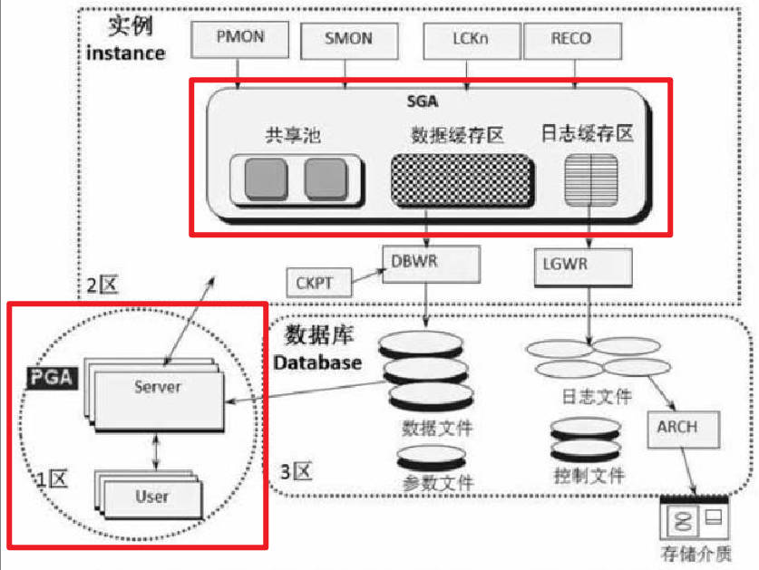

体系结构中，我们学习了SGA、PGA内存区，现在我们连接数据库查看他们的具体参数。使用`sqlplus / as sysdba`登录数据库后，用`show parameter sga`和`show parameter pga`来查看SGA和PGA各开辟了多大空间。

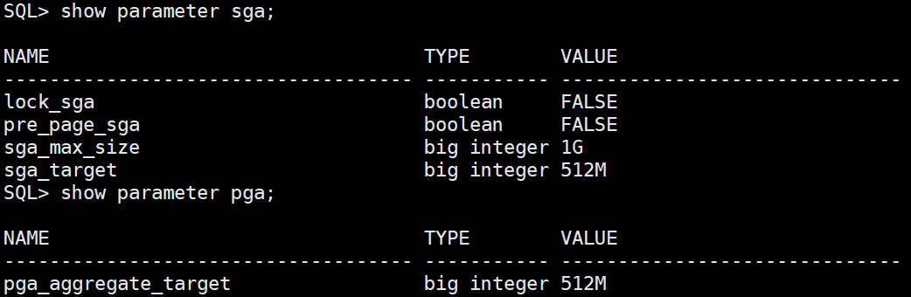

说明SGA是1024MB，而PGA是512MB。

使用`show parameter share_pool_size`和`show parameter db_cache_size`来查看共享池和数据缓存区各多大。

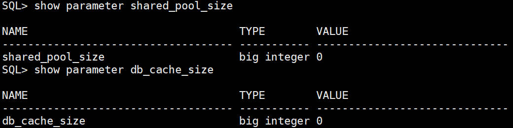

结果令人大吃一惊，共享池和数据缓存区的大小都为0，这是怎么回事呢？这是因为这里Oracle 被设置为 SGA 自动管理，共享池和数据缓存区的大小分配由之前的 sga_max_size 和sga_target决定，总的大小为1024MB，它们分别被分配多少由Oracle来决定，无须人工干预，其中sga_target不能大于sga_max_size。

sga_max_size和sga_target之间的关系可以这样理解：比如sga_target=2GB，而 sga_max_size=8GB，表示数据库正常运行的情况下操作系统只分配2GB 的内存区给 Oracle使用，而这2GB就是共享池和数据缓存区等内存组件分配的大小，可是运行中发现内存不够用，这时操作系统可以再分配内存给SGA，但是最大不可以超过8GB。

一般情况下建议使用SGA内存大小自动分配的原则，如果一定要手工分配，把sga_target设置为0，再把shared_pool_size和db_cache_size设置为非0，就可以了。

在Oracle 11g以后，自动化程度更彻底，推出了memory_target参数，只要设置这个参数值，连PGA都不需要设置了，memory_target参数指定的内存会自动分配给SGA与PGA。

使用ipcs-m命令更直观、更具体一点查看共享内存：

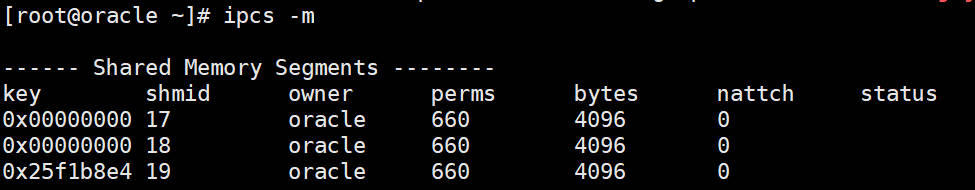

使用`show parameter log_buffer`来查看日志缓存区的大小。


从这里可以看出，log_buffer被分配的大小大致为5MB，大家知道，log_buffer的大小是不能由sga_target来自动分配的，这个必须手动分配和调整。由于log_buffer每满1MB就要写一次，每满三分之一也要写一次，所以分配太大优化效果不是很明显，一般15MB即可满足需求。

##### 1.3.6.1.2 修改内存参数

如果我们不修改数据库的这些内存参数，那所有的取值都是默认的，默认的取值可以满足所有的项目需求吗？肯定是不可能的，所以学会修改数据库参数就变得很重要了。通过spfile修改参数的完整命令如下：

```sql
alter system set <parameter_name> = <value> scope = memory|spfile|both [sid = <sid_name>]; 
```

**参数说明**：
1. memory：只改变当前实例运行，立即生效，重新启动数据库后失效。
2. spfile：只改变spfile的设置，不改变当前实例运行，重新启动数据库后生效。
3. both：同时改变实例及spfile，当前更改立即生效，重新启动数据库后仍然有效。
4. 针对RAC环境，alter system还可以指定sid参数，对不同实例进行不同的设置。

**使用说明**：
1.  如果当前实例使用的是pfile而非spfile，则scope=spfile或scope=both会产生错误。
   
      判断数据库是通过spfile启动还是通过pfile启动，第一个值为true代表为spfile启动：
      ```sql
      select distinct isspecified from v$spparameter;
      ```
2. 如果实例以pfile启动，则scope的默认值为memory，若以spfile启动，则默认值为both。
3. 有些参数必须重启才能生效，如log_buffer，因此scope为memory或both会报错，只支持spfile。
4. scope的默认值为both。

#### 1.3.6.2 进程

##### 1.3.6.2.1 查看进程

我们回顾一下体系结构，Oracle数据库是由实例和一组数据库文件组成的，实例则是由Oracle开辟的内存区和一组[后台进程](#131-oracle后台进程)组成的。


可以看到很多我们熟悉的进程，此外，还可以知道实例名为zhaojiyuan，具体可以在数据库中验证。

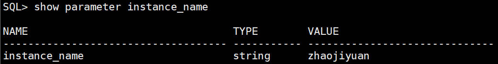

因此，查看Oracle后台进程可以使用实例名过滤的得到更加准确的结果。

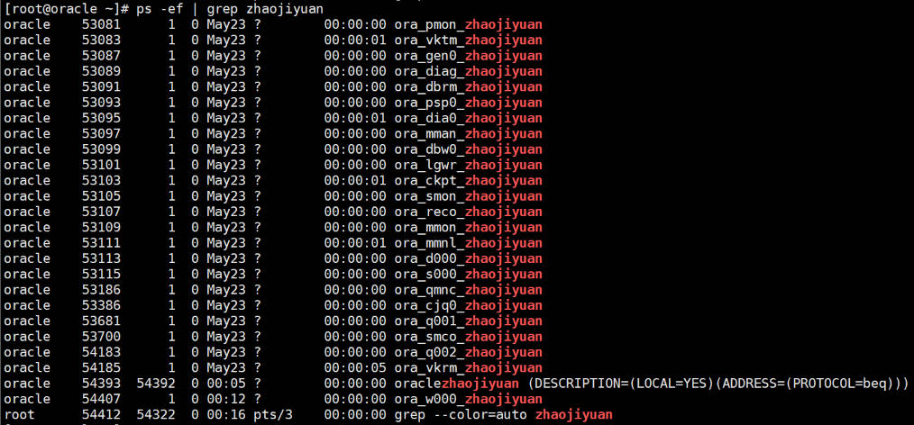

注意，如果Oracle的这些LGWR、DBWR进程被杀死了，那数据库就会立即崩溃。

##### 1.3.6.2.2 ARCH归档进程

我们学习了ARCH归档进程，当日志循环写入过程中会出现下一个日志已经被写过的情况，再继续写将会覆盖其内容，需要将这些即将被覆盖的内容写出到磁盘以形成归档文件，这样日志记录不会丢失，将来数据库就可以从这些日志文件和归档文件中进行数据库的恢复处理。

但是并没有发现出现在后台进程里，是因为我使用的数据库是测试库，安全性要求不高，因此关闭了，数据库少做一件事，效率自然就更高了。

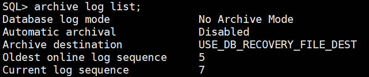

Database log mode 为No Archive Mode表示当前数据库是非归档的。

更改数据库归档模式比较麻烦，需要重启数据库，将数据库置于mount状态后，输入alter database archivelog（如果是归档改为非归档，命令是alter database noarchivelog），然后再开启数据库alter database open，才可以将数据库更改为非归档，具体步骤如下：

1.以DBA身份连接数据库：
```sql
SQL> conn / as sysdba
```
2.立即关闭数据库：
```sql
shutdown immediate;
```
3.启动实例并加载数据库，但不打开：
```sql
SQL> startup mount;
```
4.更改数据库为归档模式：
```sql
SQL> alter database archivelog;
```
5.打开数据库：
```sql
alter database open;
```

#### 1.3.6.3 数据库启停

##### 1.3.6.3.1 启动数据库

启动和关闭数据库可以说是数据库最常用的操作了，前面大家已经注意到了在将数据库归档开启时，我是先关闭数据库，再将数据库启动到mount状态，然后执行开启归档命令，最后将数据库打开。

结合体系结构图理解数据库启动的具体步骤：

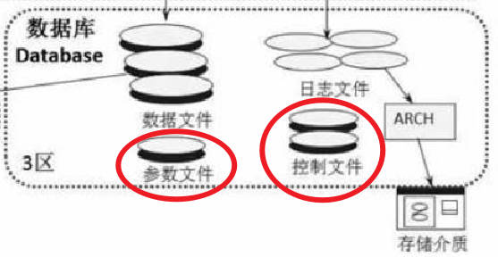

参数文件及控制文件和数据库的启动与关闭是息息相关的，数据库的启动可分为三个阶段，分别是nomount、mount和open。在启动的过程中可以直接输入startup启动，也可以分成startup nomount、startup mount和alter database open三步分别启动：

1. startup nomount阶段：
   
      Oracle必须读取到数据库的**参数文件**（pfile或者spfile），如果读不到该参数文件，数据库根本无法nomount成功！如果读到参数文件，将完成一件非常重要的事，**就是根据参数文件中的内存分配策略分配相应的内存区域，并启动相应的后台进程，换言之，就是创建实例instance**。

      为了保证数据库可以动态地修改参数，从Oracle 9i起，Oracle引进了spfile参数来替代之前仅有单一pfile 的情况。具体在数据库开启后可以执行如下命令来了解：

      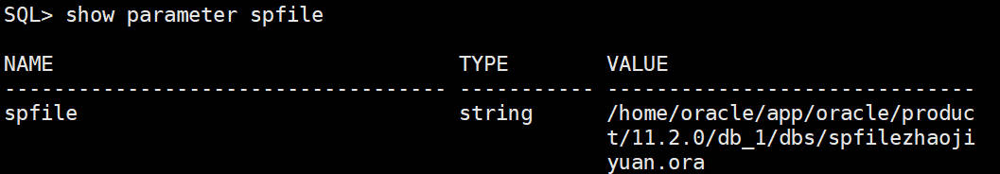

      一般来说，Oracle 9i版本以后的数据库是这样一种情况，首先查找spfile文件，查找不到再查init.ora文件，再查不到，就报错，nomount失败。

2. startup mount阶段：
   
      实例已经创建了，Oracle继续根据参数文件中描述的控制文件的名称及位置，去查找控制文件，一旦查找到立即锁定该控制文件。**控制文件里记录了数据库中的数据文件、日志文件、检查点信息等非常重要的信息**，所以Oracle成功锁定控制文件，就为后续读取操作这些文件打下了基础，锁定控制文件成功就表示数据库mount成功，为实例和数据库之间桥梁的搭建打下了基础。

3. alter database open阶段：
   
      根据控制文件记录的信息，定位到数据库文件、日志文件等，从而正式打通了实例和数据库之间的桥梁。

数据库的开启总之，nomount阶段仅需一个参数文件即可成功，mount阶段要能够正常读取到控制文件才能成功，而open阶段需要保证所有的数据文件与日志文件和控制文件里记录的名称和位置一致，能被锁定访问更新的同时还要保证没有损坏，否则数据库的open阶段就不可能成功。

##### 1.3.6.3.2 关闭数据库

数据库的关闭过程是启动过程的逆过程，先把数据库关闭，然后关闭数据库和实例之间的dismount，最后实例关闭，开辟的内存区消失，后台进程也全部消失。命令就是 shutdown immediate，注意这里没有分三个阶段执行的命令，整合在一个shutdown immediate命令中完成。

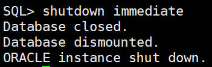

这时我们再观察可发现，Oracle开辟的共享内存段已经消失了，用zhaojiyuan实例名来查找进程，也消失了。


#### 1.3.6.4 数据库文件
没有参数文件，无法创建实例，数据库无法 nomount 成功；   
没有控制文件，数据库无法mount；   
没有数据文件，数据库无法打开使用，此外，没有了数据文件，数据也没地方保存了，数据库也失去意义了；   
没有日志和归档文件，数据库就失去了保护伞，变得很不安全。

因此所有的这些文件都非常重要。

这些文件都存放在什么位置呢，可以通过一下命令查看。

参数文件位置：

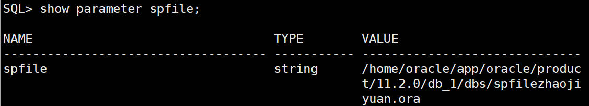

控制文件位置：

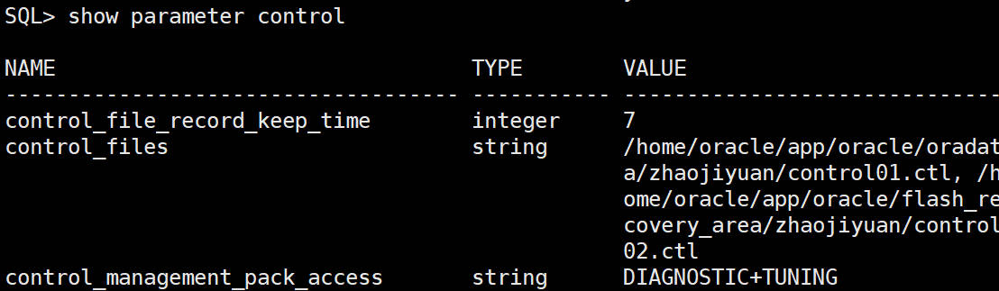

数据文件位置：

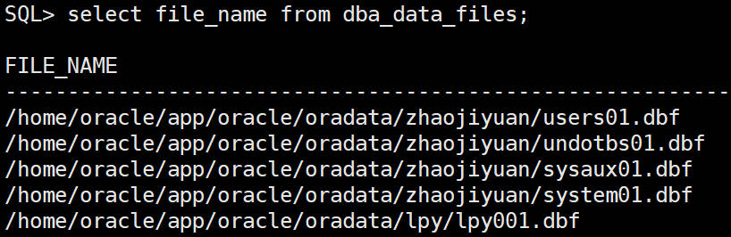

日志文件位置：

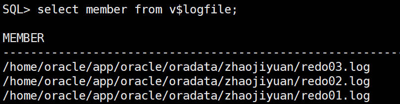

归档文件位置：

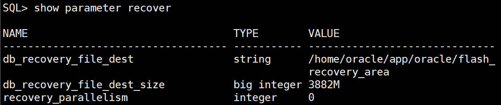

告警文件位置（位于trace目录下，以alert打头的文件）：

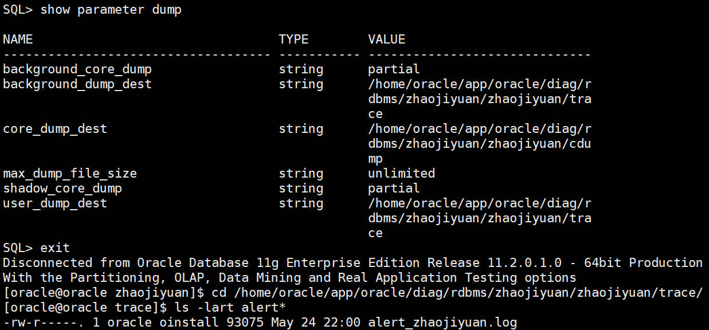

#### 1.3.6.5 监听
Oracle的监听，如果想在远程A机器上通过网络访问本地B机器上的数据库，B机器上的数据库必须开启监听。远程的A机器只需安装数据库客户端，然后通过读取A机器上数据库客户端配置的`tnsnames.ora`配置文件，即可连接并访问B机器上的数据库。

使用`lsnrctl status`命令查看监听状态,其中Listener Parameter File和Listener Log File定位了监听文件listener.ora以及对应的日志。

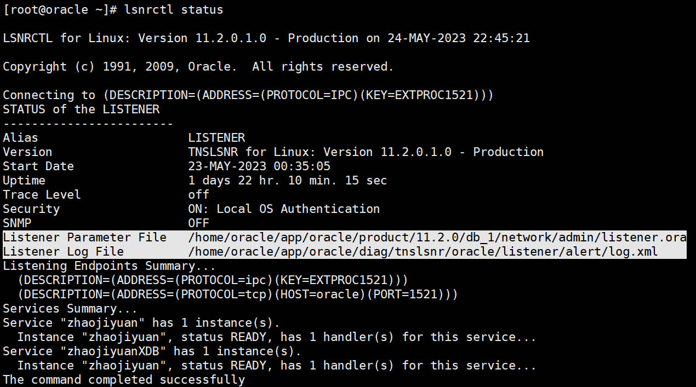

使用`lsnrctl stop`关闭监听,查看发现监听果然被关闭，提示No listener:

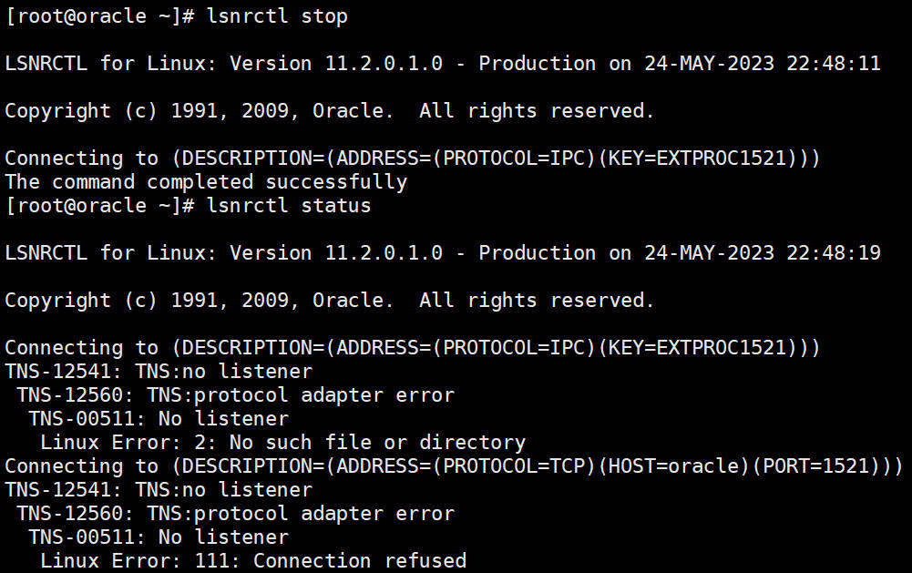

使用`lsnrctl start`开启监听：

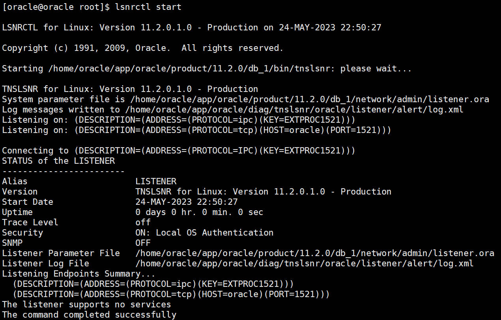

## 1.4 体系学习的思考

### 1.4.1 体系学习的意义
Oracle体系结构已经学完了，那么学习体系结构的意义是什么？这值得我们思考。

大多数人虽然努力却始终进步缓慢，难以独当一面，**因为不少人为了学习知识而学习，从不曾想过学习这些知识的意义**。

学习体系结构意义重大，可以帮助我们分析和解决很多工作中的问题。

1. 假如某数据库是一个很大的数据库，数据量庞大，访问量非常高，而共享池却非常小，那会怎么样？共享池肯定很快就被放满了，缓存的执行计划等东西要不断地被挤出，结果很多SQL语句都难以避免硬解析，因为很快被挤出共享池消失得无影无踪了，于是整个数据库开始运行缓慢。

      可以通过增加共享池的大小，如果是自动管理模式，则增加SGA的大小。

2. 某主机总共才4GB 内存，而运行在其平台上的数据库是一个几乎没有什么访问量的小数据库，可能100MB的共享池就足够了，却被开辟了3GB的SGA内存，500MB的PGA内存。但是由于操作系统内存不足，导致主机运行缓慢，从而导致数据库运行缓慢，怎么解决这个问题？
      
      减少SGA的大小！

3. 如果由于数据缓存区过小导致大数据量的数据库产生大量的物理读，怎么办？

      这和共享池情况是类似的，在SGA自动管理的情况下，加大SGA的大小，也等同于加大了数据缓存区的大小，这样数据缓存区够大，装的东西就多，物理读自然就减少了，性能自然就提高了。

4. 如果一个尺寸很大的排序由于PGA内存区无法装下要在磁盘中进行，而操作系统却闲置着大量的内存未使用，我们要做的就是……

      增加PGA的大小，争取容纳下排序的尺寸，从而避免物理排序。

5. 如果主机的内存不足，而某特定数据库几乎没有什么排序的应用，我们就可以……

      减小PGA，腾出占用的内存分配给操作系统使用。

6. 假如一个数据库系统存在大量的更新操作，产生了大量的日志需要从Redo Buffer中写出到日志文件，日志写满然后切换到下一个日志的频率不断加快，而切换过程中数据库需要等待切换完成才可以正常运作，因为切换没完成，LGWR就无法把Redo Buffer中的数据继续写出来，而数据库中Redo Buffer产生的记录总是先于数据缓存区产生的，这是串行的顺序，那此时数据库更新的动作就根本不可能成功，一定要等待日志切换成功才能恢复正常。现在日志频繁地切换，我们的更新一直在停停走走，我们要做的事是……

      加大这些日志文件的尺寸，日志组的这些日志越大，就越经得住写，切换就越少，等待时间就越短。

7. 关于查询的一致性，什么时候会出错？

      当前镜像无法找回原来的记录，被覆盖重写时就会报错退出，错误号是ORA-01555,Oracle宁愿查询失败也不愿意查询出错误不一致的结果。

8. 现在某应用系统因为查询老出ORA-01555错误返回不了结果给下一个模块使用，导致生产出现故障了，你们来帮他们出出主意吧，我们能出的建议是……

      检查这个语句为什么执行这么慢，让这个语句执行得快一点，就不容易被更新直至覆盖重写。

      也可以增大undo_retention的取值，比如写一个很大的时间，让回滚段在这段时间内都不允许被覆盖重写，前镜像文件就不会失效。不过这里要注意一点，undo_retention只是参考保留时间并非强制，除非另外设置undo表空间的Retention Guarantee属性，使之强制保留

      还可以考虑增加undo表空间的大小，减少镜像文件被覆盖的概率。

······

### 1.4.2 直观感受sql优化

环境准备：

```sql
drop table t purge;
create table t (x int);
--Clearing the shared pool
alter system flush shared_pool;
```

**切忌在生产环境中执行清理共享池操作。**

一、实验开始，写一个简单的存储过程，实现将1到10万的值插入t表。

```sql
Create or replace procedure proc1 As
Begin
  For i in 1 .. 100000 Loop
    Execute immediate 'insert into t values(' || i || ')';
    commit;
  End loop;
End;
/
```

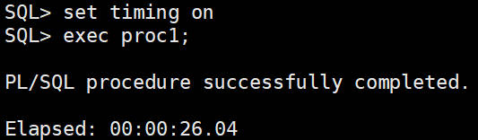

proc1执行了26秒将10万条记录插入表中，换算过来就是一秒插入3846条记录，还可不可以更快呢？

二、其实这个简单的过程如果想更快，靠的就是对体系结构的理解。我们先来看数据库共享池中的相关情况。

共享池中缓存下来的SQL语句以及hash出来的唯一值，都可以在v$sql中对应的sql_text和sql_id字段中查询到，而解析的次数和执行的次数分别可以从PARSE_CALLS和EXECUTIONS字段中获取。

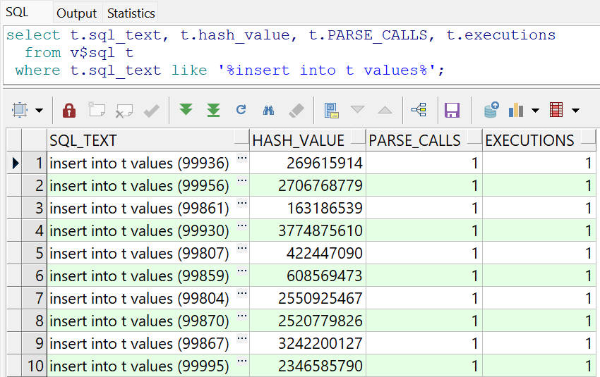

根据查询结果可以看出，共享池中有大量类似的sql_text，而hash_value各不同，说明每条语句解析一次，执行一次，10万条记录解析了10万次，因此还有很大的提升空间。

我们引入一个新名词：**绑定变量**，使用绑定变量将插入语句改写为`insert into t  values(:x)`，我们可以将10万个语句的写法变为一个，这时就只有唯一一条hash_value，执行10万次，只需要解析1次，大大减少了解析时间。

我们将proc1升级为proc2：

```sql
Create or replace procedure proc2 As
Begin
  For i in 1 .. 100000 Loop
    Execute immediate 'insert into t values(:x)'
      using i;
    commit;
  End loop;
End;
/
```

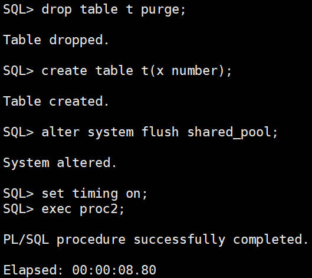

可以看出，执行时间从26秒缩短为8.8秒，速度提升了2倍，每秒可插入11364条记录。我们再来观察一下共享池的情况。

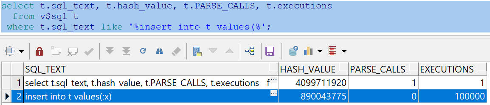

可以看出，虽然插入的语句值各不相同，但是都被绑定为:x，所以被hash成唯一一个hash值890043775，很明显可以看出解析1次，执行10万次，这就是速度大幅度提升的原因了。

三、execute immediate是一种动态SQL的写法，常用于表名和字段名是变量、入参的情况，由于表名都不知道，当然不能直接写 SQL 语句了，所以要靠动态 SQL语句根据传入的表名参数来拼成一条SQL语句。与静态SQL语句相比，execute immediate可能会消耗更多的资源，这是因为解释器需要解析和编译动态SQL语句，而不是像处理静态SQL语句一样直接执行它们。

但在我们的例子中，显然不需要使用execute immediate，将proc2升级为proc3：

```sql
Create or replace procedure proc3 As
Begin
  For i in 1 .. 100000 Loop
    insert into t values(i);
    commit;
  End loop;
End;
/
```

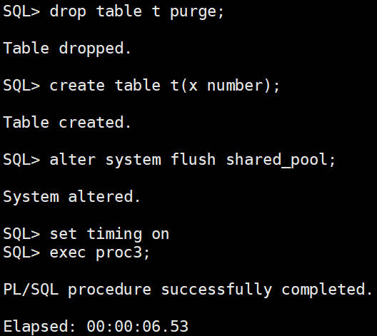

速度又提升了2秒，因为静态SQL 会自动使用绑定变量，速度的提升是因为动态SQL的是执行过程中再解析，而静态SQL的特点是编译的过程就解析好了。

四、commit放在for循环中需要提交10万次，将它拿到for循环外，待全部插入完后只需要提交1次。

将proc3升级为proc4：

```sql
Create or replace procedure proc4 As
Begin
  For i in 1 .. 100000 Loop
    insert into t values(i);
  End loop;
  commit;
End;
/
```

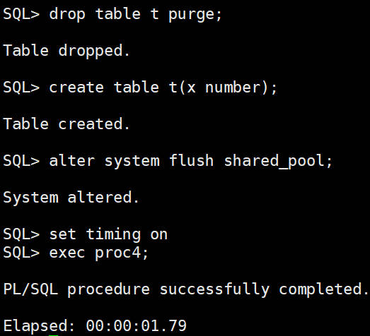

速度从6.5秒缩减到了1.79秒，相当于1秒插入55866条记录。但是，还可以更快！！

五、我们可以将insert替换成create的方式插入表中。原因在于，insert into t select ……的方式是将数据先写到Data Buffer中，然后再刷到磁盘中。而create table t 的方式却是跳过了数据缓存区，直接将数据写进磁盘，这种方式又称为直接路径读写方式，因为原本是数据先到内存，再到磁盘，更改为数据直接到磁盘，少了一个步骤，因而速度提升了许多。

可以自己尝试一下。

六、骚操作：日志关闭、加并发...。

常用的写法是：

```sql
select /*+parallel(4)*/ ...

insert /*+append*/ into ... 

create table t nologging parallel 4 as ...

merge /*+parallel(4)*/
```


# 二、逻辑体系
# 三、表的设计
# 四、索引
# 五、表连接