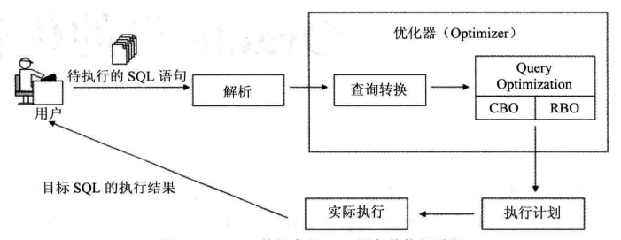

# 目录

[toc]

# 一、性能优化综述

## 1.1性能优化能力

- 一切的优化都要从**业务**出发 ★
- 学员对数据库优化有一个比较清晰的思路

- 能够客观的评价数据库的性能问题
- 能够比较顺利的定位到问题点
- 能够处理常见的性能问题

## 1.2 性能优化的原则

- 不是所有的数据库都需要（能够）优化
- 数据库库的性能，大多数都不是从数据库层面能够解决的
- **在不了解业务之前，不可能找到正确的优化思路**
- **优化要有一个度**，并不是“没有最优，只有更优”

## 1.3 导致性能问题的可能原因

- 错误的执行计划
  - 表没有正确的创建**索引** 
  - 表没有及时的分析
- 热块-------数据块的争用（反向索引？）
- 锁的阻塞------业务设计缺陷
- SQL解析消耗大量CPU ----变量绑定
- 低效的SQL -----SQL自身的问题
- 数据库整体负载过程----架构设计的问题

## 1.4 性能问题的定位

**原则**：尽可能从小范围分析问题

1. SQL层

   如果能从定位到SQL，就不要从会话层面分析

   工具 执行计划，10053,10046....

2. 会话层

   如果能定位到会话，就不要从系统层面分析

   V$SESSION,V$SESSTAT,V$SESSION_WAIT,V$SQL,V$LOCK，SQL_TRACE

3. 系统层

   如果无法定位任何性能问题，从系统层面入手

   AWR（STATSPACK）,OS tools(TOP,IOSTAT....)

## 1.5 不要迷恋优化器

业务逻辑 ---优化器无能为力

业务逻辑 ---CBO无能为力

**建议**：

- **不要迷信优化器，优化器永远无法知道你的业务需求**
  - 优化器永远无法按照你的业务需求来重写你的SQL语句。
  - 优化器只能在数学（集合）逻辑上做SQL的重写。
- **高效的SQL来自于对业务的理解和对SQL执行过程的理解。只有自己才能写出性能最好的sql脚本**

## 1.6 为什么高效的SQL这么难？

1. SQL语言本质上是集合的操作

   开发者要明白业务，知道sql脚本应该满足什么查询结果

2. 语言的效率，是SQL语言的最难的地方

   table san

   index range scan

   index fast scan

   nested loop join

   merge join

   hash join

3. 优化器机制开发者无法掌控

## 1.7 问题思考

1. **“单纯的数据库层面的优化是没有前途的”，你怎么看？**

   数据库的优化是根据**业务的需求**而定的，不是无缘无故的优化。

   单纯从数据库层面优化显然是不全面的。有的时候整个业务的瓶颈点不在数据库，单纯的优化数据库起不到作用。**从业务的角度来看系统是否满足需求，负载量是否是正常的，是不是由于数据增长量已经超出了承受能力，业务需求的改变。**

2. 当一个有性能问题的数据库摆在你的面前，作为责任人，你的处理思路是什么？

   1. 先要弄清楚数据库的类型是什么 OLTP 在线事务处理 or OLAP 在线分析系统，因为不同的数据库类型选择优化的方法也不同。例如 OLTP 强调系统的内存命中率，内存的效率决定数据库效率。
   2. 如果用户的并发数很大可扩大内存的容量缓存更多的数据，还可以调整data buffer cache、shared pool、[java](http://www.itpub.net/pubtree/?node=207) pool、large pool的大小及PGA大小包括sort区hash区等。
   3. 如果用户的在线请求数较多，可以尝试着进行SQL的变量绑定，缓解SQL的硬解析，当遇到成千上万的查询操作时，能够不经过解析过程直接使用缓存的 执行计划，那效率可以提高n倍。因为硬解析会做2个分析。第一 语法分析：检查代码的语法是否正确。第二 语义分析：检查代码执行的对象是否存在及对执行对象的权限是否有。解析过程十分的耗费CPU资源。
   4. 数据块的争用，是因为数据分配的不均匀造成的，可以使用hash算法平均打散到各个磁盘上来减少热块的产生。
   5. 还有很多系统性能间接的反应为数据库性能，例如 网络的延迟 主机的应用程序较多 没有采用中间件策略构建预处理缓冲池。
   6. 如果是OLAP 在线分析系统的话，当一个用户找你来说查询一张报表很慢，你可以通过用户会话来找到查询的SQL语句，检查这条语句逻辑上效率如何，可以使用Hint方式 来改变sql的执行计划，检查数据的访问方式，是走全表扫描还是走索引效率最高，调整SQL的执行计划，选择合适的索引。
   7. 因为SQL大多数就是集合的数学运算操作，SQL表的关联方式是不是最优化，哪种join最适合，这都是要考虑的范围。
   8. 当你手工测试完后，对表进行统计分析，看看优化器和你选的执行计划是不是相同的。
   9. CBO模式的选择，对于需要快速响应用户的请求，可以设置成first_rows(优先把部分数据返回)，对于用户响应不是很严格的业务，可以设置成all_rows（所有处理数据一次性返回。
   10. 如果系统的整体开销不大，可以考虑并行技术。
   11. 对于OLAP系统最直接的提高数据库性能方法增加磁盘I/O和CPU吞吐量，如果硬件搞不了，可以采用数据库压缩技术，减少空间提高I/O。
   12. 随着数据量的增加，以前不是问题的问题也变成了问题，对于OLAP系统SQL的效率决定数据库效率。
   13. 统计信息，索引，分区，迁移历史数据，ASM。
   14. vmstat 、iostat 的报告 查看 os层面是否正常工作,有异常则采取措。


# 二、锁

## 2.1 为什么会有锁？

没有并发就没有锁

## 2.2 锁的分类

- Enqueues（lock）：队列类型的锁，通常和业务相关的
- Latches：系统资源方面的锁，比如内存结构，SQL解析

### 2.2.1 Enqueues & Latches 对比

|        | Latch            | Lock                 |
| ------ | ---------------- | -------------------- |
| 队列性 | √                | ×                    |
| 时长   | 很短             | 可能很长             |
| 层面   | 数据库资源层     | 业务应用层           |
| 目的   | 保证资源的完整性 | 保证业务操作的完整性 |


## 2.3 Enqueues（lock）

Enqueue 是Oracle使用的另一种锁定机制，它更加复杂，**允许几个并发进程不同程度地共享某些资源**。任何可被并发使用的对象均可使用enqueue加以保护。一 个典型的例子是表的锁定，我们允许在一个表上有不同级别的共享。与latch不同之处在于，enqueue是使用操作系统特定的锁定机制，一个 enqueue允许用户在锁上存贮一个标记，来表明请求锁的模式。操作系统lock manager跟踪所有被锁定的资源，如果某个进程不能获取它所请求的那种锁，操作系统就把请求进程置于一个等待队列中，该队列按FIFO原则调度，而在 latches中是没有象enqueue中排序的等待队列，latch等待进程要么使用定时器来唤醒和重试，要么spin(只用于多处理器情况下)。

### 2.3.1 锁的原则

- 只有被修改时，行才会被锁定。
- 当一条语句修改了一条记录，只有这条记录上被锁定，在Oracle数据库中不存在锁升级。
- 当某行被修改时，它将阻塞别人对它的修改。
- 当一个事务修改一行时，将在这个行上加上行锁（TX），用于阻止其它事务对相同行的修改。
- 读永远不会阻止写。
- 读不会阻塞写，但有唯一的一个例外，就是select ...for update。
- 写永远不会阻塞读。
- 当一行被修改后，Oracle通过回滚段提供给数据的一致性读。

### 2.3.2 锁的类型

#### 2.3.2.1 TM锁（表锁）

发生在insert, update, delete以及select for update操作时，目的是保证操作能够正常进行，并且阻止其它人对表执行DDL操作。

**TM锁几种模式的互斥关系**

| 模式 | 名称                                                         | 锁定的sql                                           | 排斥的模式 | 允许的dml                                 |
| ---- | ------------------------------------------------------------ | --------------------------------------------------- | ---------- | ----------------------------------------- |
| 2    | 行级共享锁，其他对象只能查询这些数据                         | lock table table_name in row  share mode;           | 6          | select,insert,update，delete，for  update |
| 3    | 行级排他锁，在事务提交前不允许做DML操作                      | lock table table_name in row  exclusive mode;       | 4,5,6      | select,insert,update,delete，for  update  |
| 4    | 共享锁，不允许DML,但是允许其他用户发出select …from for update命令对表添加RS锁 | lock table table_name in share  mode;               | 3,5,6      | select                                    |
| 5    | 共享行级排他锁，不能对相同的表进行DML操作，也不能添加共享锁  | lock table table_name in share  row exclusive mode; | 3,4,5,6    | select                                    |
| 6    | 排他锁，其他用户不能对表进行任何的DML和DDL操作，该表上只能进行查询 | lock table table_name in  exclusive mode;           | 2,3,4,5,6  | select                                    |

#### 2.3.2.2 TX锁 【事务锁（行锁）】

对于正在修改的数据，阻止其它会话进行修改。

#### 2.3.2.3 RI锁

基于引用关系的锁定，当对具有**主外键**关系的表做DML操作时，锁定不单单发生在操作表上，相应的引用表 上也可能加上相应的锁定。

#### 2.3.2.4 死锁

两个会话互相持有对方资源导致死锁。

#### 2.3.2.5 结论

- 通过锁定，可以达到预期的业务需求。
- 通过对业务深入的分析，可以最大程度的避免不必要锁定的发生。

## 2.4 Latch

Latch是用于保护SGA（System Global Area）系统全局区中共享数据结构的一种**串行化**锁定机制。Latch的实现是与操作系统相关的，尤其和一个进程是否需要等待一个latch、需要等待多长时间有关。

 Latch 是一种能够极快地被获取和释放的**锁**，它通常用于保护描述buffer cache中block的数据结构。与每个latch相联系的还有一个清除过程，当持有latch的进程成为死进程时，该清除过程就会被调用。Latch 还具有相关级别，用于防止死锁，一旦一个进程在某个级别上得到一个latch，它就不可能再获得等同或低于该级别的latch。

当一个进程准备访问SGA中的数据结构时，它就需要获得一个latch。当进程获得latch后，它将一直持有该latch直到它不再使用此数据结构，这时latch才会被释放。可通过latch名称来区分它所保护的不同数据结构。

Oracle 使用元指令对latch进行操作, 当所需的latch已被其他进程持有时，执行指令进程将停止执行部分指令，直到该latch被释放为止。从根本上讲，latch防止并发访问共享数据结 构，由于设置和释放latch的指令是不可分割的，操作系统就可以保证只有一个进程获得latch，又由于这只是单条指令，所以执行速度很快。latch 被持有的时间是很短，而且提供了当持有者不正常中断时的清除机制，该清除工作是由Oracle后台进程PMON来完成的。

### 2.4.1 Latch 的目的

- 保证资源的串行访问：
  - 保护SGA的资源访问
  - 保护内存的分配
- 保证执行的串行化：
  - 保护关键资源的串行执行
  - 防止内存结构损坏

### 2.4.2 Latch 分类

```sql
select name from v$latchname;
```

latch有40余种，但作为DBA关心的主要应有以下几种：

  **Cache buffers chains latch**: 当用户进程搜索SGA寻找database cache buffers时需要使用此latch。

  **Cache buffers LRU chain latch**: 当用户进程要搜索buffer cache中包括所有 dirty blocks的LRU (least recently used) 链时使用该种latch。

  **Redo log buffer latch**: 这种latch控制redo log buffer中每条redo entries的空间分配。

  **Row cache objects latch**: 当用户进程访问缓存的数据字典数值时，将使用Row cache objects latch。

### 2.4.3 Latch 的机制


### 2.4.4 Latch的获取

#### 2.4.4.1  Willing-to-wait

如果所请求的latch不能立即得到，请求进程将等待一很短的时间后再次发出请求。进程一直重复此过程直到得到latch。

- **spin**：当一个会话无法获得需要的latch时，会继续使用CPU(CPU 空转），达到一个间隔后， 再次尝试申请latch，直到达到最大的重试次数。
- **sleep**：当一个会话无法获得需要的latch时，会等待一段时间（sleep)，达到一个间隔后，再次 尝试申请latch,如此反复，直到达到最大的重试次数。

#### 2.4.4.2 Immediate

如果所请求的latch不能立即得到，不会发生sleep或者spin，而是去获取其它可用的Latch继续执行下去。

#### 2.4.4.3 latch优化思路

Latch导致的性能问题，通常是一个系统层面的问题：

- AWR报告是一个比较好的入口
- 通过动态视图v$latch..可以分析当前系统的latch资源情况
- 确定争用最大的Latch
- 分析可能的原因
- 从应用层面和数据库层面考虑解决途径。

# 三、优化器

## 3.1 概述

优化器（Optimizer）是oracle数据库中内置的一个核心系统/核心组件/模块。目的是按照一定的判断原则来得到它认为的目标SQL在当前情形下最高的执行路径（Access Path），即为了得到目标SQL的执行计划。
依据选择执行计划时所用到的判断原则，优化器可以分为RBO和CBO：RBO(Rule-Based Optimizer)是基于规则的优化器。CBO(Cost-Based Optimizer)是基于成本的优化器。

在得到目标SQL的执行计划时，RBO所用的判断原则为一组内置的规则，这些规则是硬编码在Oracle 数据库的代码中的，RBO 会根据这些规则从目标SQL诸多可能的执行路径中选择一条 来作为其执行计划；
而CBO所用的判断原则为成本,CBO会从目标SQL诸多可能的执行路径中选择**成本值最小**的一条来作为其执行计划，各个执行路径的成本值是根据目标SQL语句所涉及的表、索引、列等相关对象的**统计信息**计算出来的。

oracle数据库里SQL语句的执行过程可以用下`图1-1`来表示：



**注意**：优化器的输入是经过解析后（检查目标SQL的语法、语义和权限）的目标SQL，输出是目标SQL的执行计划。

## 3.2 RBO & CBO

### 3.2.1 RBO

之前已经提到，基于规则的优化器（RBO）通过硬编码在Oracle数据库代码中的一系列固定的规则，来决定目标SQL的执行计划。具体来说就是这样: Oracle 会在代码里事先给各种类型的执行路径定一个等级，一共有15个等级，从等级1到等级15。并且Oracle会认为等级值低的执行路径的执行效率会比等级值高的执行效率要高，也就是说在RBO的眼里，等级1所对应的执行路径的执行效率最高，等级15所对应的执行路径的执行效率最低。在决定目标SQL的执行计划时，如果可能的执行路径不止一条，则RBO就会从该SQL诸多可能的执行路径中选择一条等级值最低的执行路径来作为其执行计划。

在Oracle数据库里，对于OLTP类型的SQL语句而言，显然通过ROWID来访问是效率最高的方式，而通过全表扫描来访问则是效率最低的方式。与之相对应的，RBO内置的等级1所对应的执行路径就是“single row by rowid (通过rowid来访问单行数据)”，而等级15所对应的执行路径则是“full table scan (全表扫描)”。

和CBO相比，RBO是有其明显缺陷的。在使用RBO的情况下，执行计划一旦出了问题，很难对其做调
整；另外，如果使用了RBO，则目标SQL的写法，甚至是目标SQL中所涉及的各个对象在该SQL文本中出现的先后顺序，都可能会影响RBO对于该SQL执行计划的选择。更糟糕的是，Oracle数据库中很多很好的特性、功能均不能在RBO下使用，因为RBO不支持。

只要出现如下情况，即使修改了优化器的模式或者使用了RULE Hint，oracle依然不回使用RBO，而是强制使用CBO：

- 目标SQL中涉及的对象有IOT（Index Origanized Table）
- 目标SQL中涉及的对象有分区表
- 使用了并行查询或着并行DML
- 使用了星型连接
- 使用了哈希连接
- 使用了索引快速全扫描
- 使用了函数索引
- ......

一旦RBO选择的执行计划并不是当前情形下最优的执行计划，我们很难对RBO选择的执行计划做调整，其中非常关键的一个原因就是不能使用Hint，使用了Hint就自动启用了CBO。

### 3.2.2 CBO

我们在3.2节中已经提到RBO 是有明显缺陷的，比如Oracle数据库中很多很好的功能、特性是RBO不支持的，RBO产生的执行计划很难调整等，但这些还不是最要命的，**RBO最大的问题在于它是靠硬编码在Oracle数据库代码中的一系列固定的规则来决定目标SQL的执行计划的，而并没有考虑目标SQL中所涉及的对象的实际数据量、实际数据分布等情况**，这样一旦固定 的规则并不适用于该SQL中所涉及的实际对象时，RBO根据固定规则产生的执行计划就很可能不是当前情况下的最优执行计划了。

为了解决RBO的上述先天缺陷，从Oracle 7开始，Oracle 就引入了CBO。之前已经提到过，CBO在选择目标SQL的执行计划时，所用的判断原则为成本，CBO会从目标SQL诸多可能的执行路径中选择一条成本值最小的执行路径来作为其执行计划，各条执行路径的成本值是根据目标SQL语句所涉及的表、索引、列等相关对象的统计信息计算出来的。

这里的成本是指Oracle根据相关对象的统计信息计算出来的一个值，它实际上代表了Oracle根据相关统计信息估算出来的目标SQL的对应执行步骤的I/O、CPU和网络资源的消耗量，这也就意味着Oracle数据库里的成本实际，上就是对执行目标SQL所要耗费的I/O、CPU和网络资源的一个估算值。

CBO会认为那些消耗系统I/O和CPU资源最少的执行路径就是当前情况下的最佳选择。

接下来介绍CBO的一些基本概念。

#### 3.2.2.1 Cardinality

**集的势**，表示对目标SQL的某个具体执行步骤的执行结果所包含记录数的估算。如果是针对整个目标SQL，那么表示对该SQL最终执行结果所包含记录数的估算。

Cardinality和成本值的估算是息息相关的，因为Oracle得到指定结果集所需要耗费的IO资源可以近似看作随着该结果集所包含记录数的递增而递增，所以某个执行步骤所对应的Cardinality 的值越大，那么它所对应的成本值往往也就越大，这个执行步骤所在执行路径的总成本值也就会越大。

在执行计划种，Cardinality的值对应Rows记录

#### 3.2.2.2 Selectivity

**可选择率**，是CBO特有的概念，是指世家特定谓词条件后返回结果集的记录数占未施加任何谓词条件的原始结果集的记录数的比率。用公式表示为：


Selectivity的值在0~1之间，**值越小，可选择性越高**，即当值为1时选择性是最差的。

可选择率和成本值的估算也是息息相关的，因为**可选择率的值越大，就意味着返回结果集的Cardinality的值就越大，所以估算出来的成本值也就会越大**。

#### 3.2.2.3 Transitivity

**可传递性**，也是CBO特有的概念（RBO不适用），是在查询转换中所做的第一步操作，CBO可能会对原目标SQL做简单的等价改写，根据谓词条件推算出新的谓词条件，目的是提供更多的执行路径给CBO做选择，进而增加得到更高效执行计划的可能性。

1. **简单谓词传递**

   ```sql
   t1.a = t2.a and t1.a = 10
   CBO可能会修改为：
   t1.a = t2.a and t1.a = 10 and t2.a = 10
   ```

2. **连接谓词传递**

   ```sql
   t1.a = t2.a and t2.a = t3.a
   CBO可能会修改为：
   t1.a = t2.a and t2.a = t3.a and t1.a = t3.a
   ```

3. **外连接谓词传递**

   ```sql
   t1.a = t2.a(+) and t1.a = 10
   CBO可能会修改为：
   t1.a = t2.a(+) and t1.a = 10 and t2.a(+) = 10
   ```

   ```sql
   from t1 left join t2 on t1.a = t2.a and t1.a = 10
   CBO可能会修改为：
   from t1 left join t2 on t1.a = t2.a and t1.a = 10 and t2.a = 10
   ```

#### 3.2.2.4 CBO的局限性

1. CBO会默认目标SQL语句where条件中出现的各个列之间是独立的，没有关联关系;
2. CBO会假设所有目标SQL都是独立执行的，而且互不干扰;
3. CBO对直方图统计信息有很多限制
4. CBO在解析多表关联的目标SQL时，可能会漏选正确的执行计划

## 3.3 优化器的基础知识

### 3.3.1 优化器的模式

在Oracle数据库中，优化器的模式是由参数OPTIMIZER_ MODE的值来决定的。

#### 3.3.1.1 RULE

表示oracle将使用RBO来解析目标SQL，此时目标SQL中涉及的各个对象的统计信息对于RBO来说没有任何作用。

#### 3.3.1.2 CHOOSE

CHOOSE是Oracle 9i中OPTIMIZER_ MODE的默认值，它表示Oracle在解析目标SQL时到底是使用RBO还是使用CBO取决于该SQL中所涉及的表对象是否有统计信息。具体来说就是:只要该SQL中所涉及的表对象中有一个有统计信息，那么Oracle在解析该SQL时就会使用CBO；如果该SQL中所涉及的所有表对象均没有统计信息，那么此时Oracle就会使用RBO。

#### 3.3.1.3 FIRST_ROW_n（n=1，10，100，1000）

当OPTIMIZER_ MODE的值为FIRST_ ROWS_ n(n=1, 10,100,1000)时，Oracle会使用CBO来解析目标SQL，且此时CBO在计算该SQL的各条执行路径的成本值时的侧重点在于以最快的响应速度返回头n (n=1, 10, 100, 1000)条记录。

当OPTIMIZER_ MODE的值为FIRST_ ROWS_ n(n= 1, 10, 100, 1000)时，Oracle会把那些能够以最快的响应速度返回头n(n= 1, 10, 100,1000)条记录所对应的执行步骤的成本值修改成一个很小的值(远远小于默认情况下CBO对同样执行步骤所计算出的成本值)。这样Oracle就既没有违背CBO选取执行计划的总原则(成本值最小)，同时又兼顾了FIRST_ ROWS_ n (n= 1, 10, 100, 1000)的含义。

#### 3.3.1.4 FIRST_ROWS

Oracle在解析目标SQL时会联合使用CBO和RBO。和RBO。这里联合使用CBO和RBO的含义是指在大多数情况下，FIRST_ROWS还是会使用CBO来解析目标SQL，且此时CBO在计算该SQL的各条执行路径的成本值时的侧重点在于以最快的响应速度返回头几条记录(类似于FIRST_ _ROWS_ n)；但是，当出现了一些特定情况时，FIRST_ ROWS转而会使用RBO中的一些内置的规则来选取执行计划而不再考虑成本。

#### 3.3.1.5 ALL_ROWS

ALL_ ROWS是Oracle 10g 以及后续Oracle数据库版本中OPTIMIZER_MODE的默认值，它表示Oracle会使用CBO来解析目标SQL，且此时CBO在计算该SQL的各条执行路径的成本值时的侧重点在于最佳的吞吐量(即最小的系统I/O和CPU资源的消耗量)。

成本的计算方法随着优化器模式的不同而不同，主要体现在ALL_ROWS和FIRST_ROW_n对成本值计算方法的影响上。当优化器的模式为ALL_ROWS时，CBO的计算成本侧重点在于最佳的吞吐量；而为FIRST_ROW_n（n=1，10，100，1000）时，计算成本的侧重点会变为以最快的响应速度返回头（n=1，10，100，1000）条记录。这两种模式计算出来的成本值存在着巨大差异，说明优化器的模式对CBO计算成本（进而对CBO选择执行计划）有着决定性的影响。

### 3.3.2 Row Source

结果集，指包含指定执行结果的集合，对于优化器而言（RBO/CBO），结果集和目标执行计划的执行步骤相对应，一个执行计划所产生的执行结果就是该执行步骤所对应的输出结果集。

对于CBO，对应执行计划中的字段ROWS反映的就是CBO对于相关执行步骤输出结果集的记录数（即Cardinality）的估算值。

### 3.3.3 访问数据的方法

Oracle访问数据的方法有两种：一是直接访问表；二是先访问索引，然后再回表，但如果目标SQL所要访问的数据只通过访问相关的索引就可以得到，那么此时就不需要再回表了。

#### 3.3.3.1 访问表的方法

直接访问表的方法有两种：一是全表扫描；二是ROWID扫描。

##### 3.3.3.1.1 全表扫描

TABLE ACCESS FULL，全表扫描是指Oracle 在访问目标表里的数据时，会从该表所占用的第一个区(EXTENT) 的第一个块( BLOCK)开始扫描，一直扫描到该表的高水位线( HWM, High Water Mark)，这段范围内所有的数据块Oracle都必须读到。当然，Oracle会对这期间读到的所有数据施加目标SQL的where条件中指定的过滤条件，最后只返回那些满足过滤条件的数据。

当目标表的数据量不是很大时，全表扫描的方式的执行效率很高，但也存在执行时间不稳定的问题，且执行时间随着表的数据量的增大而增加。因为数据量增大，高水位线会上涨，全表扫描所需要耗费的I/O资源随之增加，导致CBO成本值增加。

高水位线的这种特性所带来的副作用是,即使使用DELETE语句删光了目标表中的所有数据，高水位线还是会在原来的位置，这意味着全表扫描该表时Oracle还是需要扫描该表高水位线下的所有数据块，所以此时对该表的全表扫描操作所耗费的时间与之前相比并不会有明显的改观。**全表扫描所花费的时间会随着目标表数据量的递增而递增**。

```sql
SQL> set autotrace traceonly;
SQL> select * from emp;
已选择14行。
执行计划
----------------------------------------------------------
Plan hash value: 3956160932
--------------------------------------------------------------------------
| Id  | Operation         | Name | Rows  | Bytes | Cost (%CPU)| Time     |
--------------------------------------------------------------------------
|   0 | SELECT STATEMENT  |      |    14 |   532 |     2   (0)| 00:00:01 |
|   1 |  TABLE ACCESS FULL| EMP  |    14 |   532 |     2   (0)| 00:00:01 |
--------------------------------------------------------------------------
```

##### 3.3.3.1.1 ROWID 扫描

TABLE ACCESS BY INDEX ROWID，ROWID是记录所在的物理地址，与数据块中的记录一一对应，具有唯一性。

ROWID扫描是指Oracle访问目标表里的数据时，直接通过数据所在的ROWID去定位并访问这些数据。

ROWID扫描有两种方式：一是在SQL语句中输入ROWID的值直接去访问对应的记录；二是先去访问相关的索引，然后根据得到的ROWID再回表访问对应的记录。

获取记录对应的ROWID方式：

```sql
SQL> set autotrace traceonly;
SQL> select * from emp where empno = '7521';
执行计划
----------------------------------------------------------
Plan hash value: 3649078246
--------------------------------------------------------------------------------------------
| Id  | Operation                   | Name         | Rows  | Bytes | Cost (%CPU)| Time       |
--------------------------------------------------------------------------------------------
|   0 | SELECT STATEMENT            |              |     1 |    38 |     1   (0)| 00:00:01 |
|   1 |  TABLE ACCESS BY INDEX ROWID| EMP          |     1 |    38 |     1   (0)| 00:00:01 |
|*  2 |   INDEX UNIQUE SCAN         | PK_EMP_EMPNO |     1 |       |     0   (0)| 00:00:01 |
--------------------------------------------------------------------------------------------

SQL> select * from emp where rowid = 'AAAFCOAABAAALDxAAA';
执行计划
----------------------------------------------------------
Plan hash value: 1116584662
-----------------------------------------------------------------------------------
| Id  | Operation                  | Name | Rows  | Bytes | Cost (%CPU)| Time     |
-----------------------------------------------------------------------------------
|   0 | SELECT STATEMENT           |      |     1 |    38 |     1   (0)| 00:00:01 |
|   1 |  TABLE ACCESS BY USER ROWID| EMP  |     1 |    38 |     1   (0)| 00:00:01 |
-----------------------------------------------------------------------------------
```

#### 3.3.3.2 访问索引的方式 ★

B树索引是oracle中最常用的索引。B树索引结构主要由三部分组成根节点、分支节点、叶子节点。 B树索引就是 一颗二叉树；叶子节点（双向链表）包含索引列和指向表中每个匹配行的rowid值。所有叶子节点具有相同的深度，因而不管查询条件怎样，查询速度基本相同。B树索引结构能够适应精确查询（=）、模糊查询（like）和比较查询（>）。


B树索引包含两种类型的数据块，一是索引分支块，而是索引叶子块。在Oracle里访问B树索引必须从根节点开始，到分支快，再到叶子块。

**索引分支块**包含指向相应索引分支块/叶子块的指针和索引键值列（这里的指针是指相关分支块/叶子块的块地址RDBA。每个索引分支块都会有两种类型的指针，一种是 **Imc**，另一种是**索引分支块的索引行记录所记录的指针**。Imc 是Left Most Child的缩写，**每个索引分支块都只有一个Imc**，**这个Imc指向的分支块/叶子块中的所有索引键值列中的最大值一定小于该lmc所在索引分支块的所有索引键值列中的最小值**；**而索引分支块的索引行记录所记录的指针所指向的分支块/叶子块的所有索引键值列中的最小值一定大于或等于该行记录的索引键值列的值**）。

**索引叶子块**包含被索引键值和ROWID。对于唯一性B数索引，ROWID是存储在索引行的行头，此时不需要额外存储ROWID长度。而对于非唯一性的B树索引，ROWID额外作为一个字段与键值列一起存储，此时既要存储ROWID，也要存储ROWID的长度。索引叶子块是左右互联的，即相当于有一个双向指针链表把这些索引叶子块相互连接在一起。

基于上述结构，**B数索引有以下优点**：

1. 所有的索引叶子块都在同一层，即它们距离索引根节点的深度是相同的。这也意味着访问索引叶子块的任何一个索引键值所花费的时间几乎相同。
2. Oracle 会保证所有的B树索引都是自平衡的，即不可能出现不同的索引叶子块不处于同一层的现象。
3. **通过B树索引访问表里行记录的效率并不会随着相关表的数据量的递增而显著降低，即通过走索引访问数据的时间是可控的、基本稳定的，这也是走索引和全表扫描的最大区别**。全表扫描最大的劣势就在于其访问时间不可控，不稳定，即全表扫描所花费的时间会随着目标表数据量的递增而递增。

通过B树索引访问数据的过程是先访问相关的B树索引，根据访问的索引得到的ROWID再回表去访问对应的记录。**访问B树索引要耗费两次I/O**（全表扫描只需要耗费一次I/O），一是访问相关的B树索引的成本（从根节点定位到相关的分支块，再定位到相关的叶子块，最后对这些叶子块执行扫描操作）;二是回表的成本（根据得到的ROWID再回表去扫描对应的数据行所在的数据块）。

##### 3.3.3.2.1 INDEX UNIQUE SCAN

索引唯一性扫描，是针对唯一性索引（UNIQUE INDEX）的扫描，仅仅适用于WHERE条件里的等值查询。

因为扫描对象是唯一性索引，索引得到的结果至多只有一条记录。


##### 3.3.3.2.2 INDEX RANG SCAN

索引范围扫描适用于所有类型的B树索引，当扫描的对象是唯一性索引时， 此时目标SQL的where条件一定是范围查询（谓词条件为BETWEEN、<.>等）；当扫描的对象是非唯一性索引时，对目标SQL的where条件没有限制（可以是等值查询，也可以是范围查询）。索引范围扫描的结果可能会返回多条记录，其实这就是索引范围扫描中”范围“二字的本质含义。

需要注意的是，即使是针对同等条件下的相同SQL，当目标索引的索引行的数量大于1时，索引范围扫描所耗费的逻辑读会多于索引唯一性扫描所耗费的逻辑读。这是因为索引唯一性扫描的扫描结果至多只会返回条记录，所以Oracle 明确知道此时只需要访问相关的叶子块一次就可以直接返回了；但对于索引范围扫描而言，因为其扫描结果可能会返回多条记录，同时又因为目标索引的索引行数量大于1，Oracle 为了确定索引范围扫描的扫描终点，就不得不去多次访问相关的叶子块，**所以在同等条件下，当目标索引的索引行的数量大于1时，索引范围扫描所耗费的逻辑读至少会比相应的索引唯一性扫描的逻辑读多1**。

##### 3.3.3.2.3 INDEX FULL SCAN

索引全扫描，适用于所有类型的B树索引（包括唯一性索引和非唯一性索引），指要扫描目标索引所有叶子块的所有索引行。需要注意的是，索引全扫描需要扫描目标索引的所有叶子块，但这并不意味着需要扫描该索引的所有分支块。在默认情况下，Oracle 在做索引全扫描时只需要通过访问必要的分支块定位到位于该索引最左边的叶子块的第一行索引行，就可以利用该索引叶子块之间的双向指针链表，从左至右依次顺序扫描该索引所有叶子块的所有索引行了。

既然在默认情况下，索引全扫描要从左至右依次顺序扫描目标索引所有叶子块的所有索引行，而索引是有序的，**所以索引全扫描的执行结果也是有序的，并且是按照该索引的索引键值列来排序，这也意味着走索引全扫描能够既达到排序的效果，又同时避免了对该索引的索引键值列的真正排序操作**。

##### 3.3.3.2.4 INDEX FAST FULL SCAN

索引快速全扫描，和索引全扫描的特性类似，主要有一下三点区别：

1. INDEX FAST FULL SCAN只适用于CBO；
2. INDEX FAST FULL SCAN可以使用多块读，也可以并行执行；
3. INDEX FAST FULL SCAN的执行结果不一定是有序的。这是因为索引快速全扫描时Oracle是根据索引行在磁盘上的物理存储顺序来扫描，而不是根据索引行的逻辑顺序来扫描的，所以扫描结果才不一-定有序（对于单个索引叶子块中的索引行而言，其物理存储顺序和逻辑存储顺序一致；但对于物理存储位置相邻的索引叶子块而言，块与块之间索引行的物理存储顺序则不一 定在逻辑上有序）。

##### 3.3.3.2.5 INDEX SKIP SCAN

索引跳跃式扫描，适用于所有类型的**复合B树索引**（包括唯一性索引和非唯一性索引），它使那些在where条件中没有对目标索引的前导列指定查询条件但同时又对该索引的非前导列指定了查询条件的目标SQL依然可以用上该索引，这就像是在扫描该索引时跳过了它的前导列，直接从该索引的非前
导列开始扫描一样(实际的执行过程并非如此），这也是索引跳跃式扫描中”跳跃“（SKIP）一词的含义。
为什么在where条件中没有对目标索引的前导列指定查询条件但Oracle依然可以用上该索引呢？这是因为Oracle帮你对该索引的前导列的所有distinct值做了遍历。

**Oracle中的索引跳跃式扫描仅仅适用于那些目标索引前导列的distinct值数量较少、后续非前导列的可选择性又非常好的情形，因为索引跳跃式扫描的执行效率一定会 随着目标索引前导列的distinct值数量的递增而递减**。

#### 3.3.3.3 表连接

顾名思义，表连接就是指**多个表**之间用**连接条件**连接在一起，使用表连接的目标SQL的目的就是从多个表获取存储在这些表中的**不同维度的数据**。体现在SQL语句上，含表连接的目标SQL的**from部分会出现多个表**，而这些SQL的**where条件部分则会定义具体的表连接条件**。

当优化器解析含表连接的目标SQL时，它除了会根据目标SQL的SQL文本的写法来决定表连接的类型之外，还必须决定如下三件事情才能得到最终的执行计划。

**1. 表连接顺序**

**不管目标SQL中有多少个表做表连接，Oracle 在实际执行该SQL时都只能先两两做表连接，再依次执行这样的两两表连接过程，直到目标SQL中所有的表都已连接完毕。**所以从严格意义上来说，这里的表连接顺序包含两层含义：第一层含义是当两个表做表连接时，优化器需要决定这两个表中谁是**驱动表**(outer table)，谁是**被驱动表**(inner table)；另外一层含义是当多表( 超过两个以上的表)做表连接时，优化器需要决定这些
表中谁和谁先做表连接,然后决定这个表连接结果所在的结果集再和剩余表中的哪一一个再做表连接,这个两两
做表连接的过程会-直持续下去， 直到目标SQL中所有的表都已连接完为止。

**2. 表连接方法**

在Oracle 数据库中，两个表之间的表连接方法有排序合并连接、嵌套循环连接、哈希连接和笛卡儿连接这四种，所以优化器在解析含表连接的目标SQL时，都需要从上述四种方法中选择一种，作为每两张表两两做表连接时所需要采用的方法。

**3. 访问单表的方法**

全表扫描或走索引。

##### 3.3.3.3.1 表连接的类型

sql脚本的写法直接决定表连接的类型，表连接类型直接决定表连接的结果。

```sql
-- 测试表
SQL> desc t;
Name Type     Nullable Default Comments 
---- ------------ -------- ------- -------- 
COL1 NUMBER Y                        
COL2 VARCHAR2(10) Y

SQL> desc t2;
Name Type     Nullable Default Comments 
---- ------------ -------- ------- -------- 
COL1 NUMBER Y                        
COL2 VARCHAR2(10) Y 
```

###### 3.3.3.3.1.1 内连接

Inner Join，**查询结果只返回那些完全满足连接条件的记**录。


```sql
SQL> SELECT t1.*,t2.* from t1 join t2 on t1.id = t2.id;

      COL1 COL2         COL1 COL2
---------- ---------- ---------- ----------
         1 a                  1 a
         2 b                  2 b
         3 c                    
```

###### 3.3.3.3.1.2 外连接

Outer Join，查询结果除了**返回那些完全满足连接条件的记录**之外，还包含**驱动表中所有不满足连接条件的记录**。被驱动表中不满足连接条件的字段会以NULL值填充。

1. left join

   ```sql
   驱动表 left join 被驱动表 on (连接条件)
   ```

   **执行计划如下**：

   ```sql
   SQL> SELECT t1.*,t2.* from t1 left join t2 on t1.id = t2.id;
           ID COL          ID COL
   ---------- ---- ---------- ----
            1 a             1 a
            2 b             2 b
            3 c             3 c
            4 d             4 d
            7 g
            5 e
   已选择6行。
   执行计划
   ----------------------------------------------------------
   Plan hash value: 1823443478
   ---------------------------------------------------------------------------
   | Id  | Operation          | Name | Rows  | Bytes | Cost (%CPU)| Time     |
   ---------------------------------------------------------------------------
   |   0 | SELECT STATEMENT   |      |     6 |    60 |     5  (20)| 00:00:01 |
   |*  1 |  HASH JOIN OUTER   |      |     6 |    60 |     5  (20)| 00:00:01 |
   |   2 |   TABLE ACCESS FULL| T1   |     6 |    30 |     2   (0)| 00:00:01 |
   |   3 |   TABLE ACCESS FULL| T2   |     5 |    25 |     2   (0)| 00:00:01 |
   ---------------------------------------------------------------------------             
   ```

   可以看出T1为驱动表；

2. right join

   ```sql
   被驱动表 right join 驱动表 on (连接条件)
   ```

   **执行计划如下**：

   ```sql
   SQL> SELECT t1.*,t2.* from t1 right join t2 on t1.id = t2.id;
           ID COL          ID COL
   ---------- ---- ---------- ----
            1 a             1 a
            2 b             2 b
            3 c             3 c
            4 d             4 d
                            6 f
   执行计划
   ----------------------------------------------------------
   Plan hash value: 1426054487
   ---------------------------------------------------------------------------
   | Id  | Operation          | Name | Rows  | Bytes | Cost (%CPU)| Time     |
   ---------------------------------------------------------------------------
   |   0 | SELECT STATEMENT   |      |     5 |    50 |     5  (20)| 00:00:01 |
   |*  1 |  HASH JOIN OUTER   |      |     5 |    50 |     5  (20)| 00:00:01 |
   |   2 |   TABLE ACCESS FULL| T2   |     5 |    25 |     2   (0)| 00:00:01 |
   |   3 |   TABLE ACCESS FULL| T1   |     6 |    30 |     2   (0)| 00:00:01 |
   ---------------------------------------------------------------------------
   ```

   可以看出T2作为驱动表；

3. full join

   ```sql
   驱动表 full join 驱动表 on (连接条件)
   ```

   全外连接是左外连接和右外连接的集合：

   ```sql
   驱动表 left join 驱动表 on (连接条件)
   union
   驱动表 right join 驱动表 on (连接条件)
   ```

   **执行计划如下**：
   
   ```sql
   SQL> set autotrace on;
   SQL> SELECT t1.*,t2.* from t1 full join t2 on t1.id = t2.id;
           ID COL          ID COL
   ---------- ---- ---------- ----
            1 a             1 a
            2 b             2 b
            3 c             3 c
            4 d             4 d
            5 e
            7 g
                            6 f
   执行计划
   ----------------------------------------------------------
   Plan hash value: 3807180574
   ----------------------------------------------------------------------------------
   | Id  | Operation             | Name     | Rows  | Bytes | Cost (%CPU)| Time     |
   ----------------------------------------------------------------------------------
   |   0 | SELECT STATEMENT      |          |     6 |   192 |     5  (20)| 00:00:01 |
   |   1 |  VIEW                 | VW_FOJ_0 |     6 |   192 |     5  (20)| 00:00:01 |
   |*  2 |   HASH JOIN FULL OUTER|          |     6 |    60 |     5  (20)| 00:00:01 |
   |   3 |    TABLE ACCESS FULL  | T2       |     5 |    25 |     2   (0)| 00:00:01 |
   |   4 |    TABLE ACCESS FULL  | T1       |     6 |    30 |     2   (0)| 00:00:01 |
   ----------------------------------------------------------------------------------
   ```

##### 3.3.3.3.2 表连接的方法 ★

###### 3.3.3.3.2.1 Sort Merge Join

排序合并连接，是一种两个表做表连接时用排序操作（sort）和合并操作（meger）来得到连接结果的表连接方法。

```sql
SQL> select t1.id,t1.col,t2.id,t2.col from t1,t2 where t1.id <= t2.id;
已选择15行。
执行计划
----------------------------------------------------------
Plan hash value: 1717210129
--------------------------------------------------------------------------------------------
| Id  | Operation                    | Name        | Rows  | Bytes | Cost (%CPU)| Time     |
--------------------------------------------------------------------------------------------
|   0 | SELECT STATEMENT             |             |    15 |   150 |     5  (20)| 00:00:01 |
|   1 |  MERGE JOIN                  |             |    15 |   150 |     5  (20)| 00:00:01 |
|   2 |   TABLE ACCESS BY INDEX ROWID| T1          |     6 |    30 |     2   (0)| 00:00:01 |
|   3 |    INDEX FULL SCAN           | SYS_C007025 |     6 |       |     1   (0)| 00:00:01 |
|*  4 |   SORT JOIN                  |             |     5 |    25 |     3  (34)| 00:00:01 |
|   5 |    TABLE ACCESS FULL         | T2          |     5 |    25 |     2   (0)| 00:00:01 |
--------------------------------------------------------------------------------------------
```

如果两个表（这里将它们分别命名为表T1和表T2）在做表连接时使用的是排序合并连接，则Oracle 会依次顺序执行如下**步骤：**

1. 首先以目标SQL中指定的谓词条件（如果有的话）去访问表T1，然后对访问结果按照表T1中的连接列来排序，排好序后的结果集我们记为结果集1。
2. 接着以目标SQL中指定的谓词条件（ 如果有的话）去访问表T2，然后对访问结果按照表T2中的连接列来排序，排好序后的结果集我们记为结果集2。
3. 最后对结果集1和结果集2执行合并操作，从中取出匹配记录来作为排序合并连接的最终执行结果。
   合并操作也可以理解为：首先遍历结果集1，即先取出结果集1中的第1条记录，然后去结果集2中按照连接条件判断是否存在匹配记录，然后再取出结果集1中的第2条记录，按照同样的连接条件再去结果集2中判断是否存在匹配的记录，直到最后遍历完结果集1中所有的记录。

**排序合并连接特性：**

- 通常情况下，排序合并连接的执行效率比不上哈希连接，但是使用场景更广（<、<=、>、>=）,而哈希连接通常只能用于等值连接 ；
- 通常情况下，排序合并连接并不适合OLTP类型的系统，因为排序在OLTP系统中十分费劲，如果能避免排序操作，排序合并链接也可以在OLTP系统中使用；
- 从严格意义上来说，排序合并连接不存在驱动表的概念，但我认为还是存在驱动表和被驱动表的。
- 如果两个表在施加了目标SQL中指定的谓词条件得到的结果集很大，且需要排序，则执行效率会很低。

###### 3.3.3.3.2.2 Nested Loops Join

**嵌套循环连接**，是一种两个表在做表连接时依靠两层嵌套循环（分别为外层循环和内
层循环）来得到连接结果集的表连接方法。

如果两个表T1和T2做嵌套循环连接的具体的执行**步骤**为：

1. 首先，优化器会按照规则决定T1和T2谁是驱动表、被驱动表。驱动表处于外层循环，被驱动表处于内层循环。这里假设驱动表是T1,被驱动表是T2；
2. 接着根据谓词条件去访问驱动表T1，得到结果集1；
3. 然后在遍历结果集1的同时遍历被驱动表T2（先取出结果集1中的第一条记录，接着去遍历被驱动表T2，判断T2中是否存在匹配的记录。然后再取出结果集1的第二条记录，...，直到遍历完结果集1中所有的记录为止）。
   这里的外层循环是遍历结果集1的循环，内层循环是遍历被驱动表T2的循环。**所以，外层所对应的驱动结果集1有多少条记录，就要进行多少次内层循环。**

**嵌套循环连接特性：**

- **如果驱动表所对应的驱动结果集的记录数较少，同时在被驱动表的连接列上又存在唯一性索引（或者在被驱动表的连接列上存在选择性很好的非唯一性索引），那么此时使用嵌套循环连接的执行效率就会非常高；但如果驱动表所对应的驱动结果集的记录数很多，即便在被驱动表的连接列上存在索引，此时使用嵌套循环连接的执行效率也不会高。**
- 只要驱动结果集的记录数较少，那就具备了做嵌套循环连接的前提条件，而驱动结果集是在对驱动表应用了目标SQL中指定的谓词条件（如果有的话）后所得到的结果集，**所以大表也可以作为嵌套循环连接的驱动表，关键看目标SQL中指定的谓词条件（如果有的话）能否将驱动结果集的数据量降下来。**
- **嵌套循环连接有其他连接方法所没有的一个优点：嵌套循环连接可以实现快速响应**，即它可以第一时间先返回已经连接过且满足连接条件的记录，而不必等待所有的连接操作全部做完后才返回连接结果。
- 如果驱动表所对应的结果集记录数很大，即便在被驱动表的连接列上存在索引，此时的执行效率也不会很高。

###### 3.3.3.3.2.3 Hash Join

**哈希连接**，两张表做表连接时主要依靠**哈希运算**来得到连接结果集的表连接方法，**仅仅适用于CBO**。理论上，哈希连接的执行效率要比排序合并链接和嵌套循环连接要高，但实际并不总是这样。

```sql
SQL> set autotrace traceonly;
SQL> select t1.id,t1.col,t2.id,t2.col from t1,t2 where t1.id = t2.id;
执行计划
----------------------------------------------------------
Plan hash value: 2959412835
---------------------------------------------------------------------------
| Id  | Operation          | Name | Rows  | Bytes | Cost (%CPU)| Time     |
---------------------------------------------------------------------------
|   0 | SELECT STATEMENT   |      |     5 |    50 |     5  (20)| 00:00:01 |
|*  1 |  HASH JOIN         |      |     5 |    50 |     5  (20)| 00:00:01 |
|   2 |   TABLE ACCESS FULL| T2   |     5 |    25 |     2   (0)| 00:00:01 |
|   3 |   TABLE ACCESS FULL| T1   |     6 |    30 |     2   (0)| 00:00:01 |
---------------------------------------------------------------------------
```

如果两个表T1和T2做哈希连接连接的具体的执行**步骤**为：

1. **确定Hash Partition的数量**：首先Oracle会根据参数**HASH_AREA_SIZE、DB_BLOCK_SIZE**和**_HASH_MULTIBLOCK_IO_COUNT**的值来决定Hash Partition的数量（Hash Partition 是一个逻辑上的概念，所有Hash Partition的集合就被称之为Hash Table，即一个Hash Table是由多个Hash Partition所组成，而一个 Hash Partition又是由多个Hash Bucket所组成）。
2. **确定驱动结果集**：表T1和T2在施加了目标SQL中指定的谓词条件（如果有的话）后得到的结果集中数据量较小的那个结果集会被Oracle选为哈希连接的驱动结果集，这里我们假设**T1所对应的结果集的数据量相对较小，我们记为S**；T2所对应的结果集的数据量相对较大，我们记为B；显然 这里**S是驱动结果集**，B是被驱动结果集。
3. **计算哈希值**：接着Oracle会遍历S，读取S中的每一条记录，并对S中的每一条记录按照该记录在表T1中的**连接列**做哈希运算，这个哈希运算会使用 **两个内置哈希函数**，这两个哈希函数会同时对该连接列计算哈希值，我们把这两个内置哈希函数分别记为hash_func_1和hash_func_2， 它们所计算出来的哈希值分别记为hash_value_1和hash_value_2。
4. **分组**：然后Oracle会按照hash_value_1的值把相应的S中的对应记录存储在不同Hash Partition的不同Hash Bucket里，同时和该记录存储在 一起的还有该记录用hash_func_2计算出来的hash_value_2的值。**注意，存储在Hash Bucket里的记录并不是目标表的完整行记录，而是只需要存储位于目标SQL中的跟目标表相关的查询列和连接列就足够了**。**我们把S所对应的每一个Hash Partition记为Si**。
4. **构建位图**：在构建Si的同时，Oracle会构建一个位图（BITMAP），**这个位图用来标记Si所包含的每一个Hash Bucket是否有记录（即记录数是否大于0）**。
4. **构建Hash Table过程**：如果S的数据量很大，那么在构建S所对应的Hash Table时，就可能会出现PGA（Program Global Area）程序全局区的工作区（WORK AREA）被填满的情况，这时候Oracle会 把工作区中现有的Hash Partition中包含记录数最多的Hash Partition写到磁盘上（TEMP表空间），接着Oracle会继续构建S所对应的 Hash Table，在继续构建的过程中，如果工作区又满了，则Oracle会继续重复上述挑选包含记录数最多的Hash Partition并写回到磁盘 上的动作；如果要构建的记录所对应的Hash Partition已经事先被Oracle写回到了磁盘上，则此时Oracle就会去磁盘上更新该Hash Partition， 即会把该条记录和hash_value_2直接加到这个已经位于磁盘上的Hash Partition的相应Hash Bucket中；注意，**极端情况下可能会出现只有某个Hash Partition的部分记录还在内存中，该Hash Partition的剩余部分和余下的所有Hash Partition都已经被写回到磁盘上**。
4. 上述构建S所对应的Hash Table的过程会一直持续下去，直到遍历完S中的所有记录为止。
4. **排序**：接着，Oracle会对所有的Si按照它们所包含的记录数来排序，然后Oracle会把这些已经排好序的Hash Partition按顺序依次、并且尽 可能的全部放到内存中（PGA的工作区），当然，如果实在放不下的话，放不下的那部分Hash Partition还是会位于磁盘上。我认为这个 按照Si的记录数来排序的动作不是必须要做的，因为这个排序动作的根本目的就是为了尽可能多的把那些记录数较小的Hash Partition 保留在内存中，而将那些已经被写回到磁盘上、记录数较大且现有内存已经放不下的Hash Partition保留在磁盘上，显然，**如果所有的 Si本来就都在内存中，也没发生过将Si写回到磁盘的操作，那这里根本就不需要排序了**。
9. 至此Oracle已经处理完S，现在可以来开始处理B了。
10. Oracle会遍历B，读取B中的每一条记录，并对B中的每一条记录按照该记录在表T2中的连接列做哈希运算，这个哈希运算和步骤3中的 哈希运算是一模一样的，即这个哈希运算还是会用步骤3中的hash_func_1和hash_func_2，并且也会计算出两个哈希值hash_value_1和hash_value_2。
    接着Oracle会按照该记录所对应的哈希值hash_value_1去Si里找匹配的Hash Bucket；如果能找到匹配的Hash Bucket，则Oracle还会遍历该 Hash Bucket中的每一条记录，并会校验存储于该Hash Bucket中的每一条记录的连接列，看是否是真的匹配（**即这里要校验S和B中的匹配记 录所对应的连接列是否真的相等，因为对于Hash运算而言，不同的值经过哈希运算后的结果可能是一样的**），如果是真的匹配，则上述 hash_value_1所对应B中的记录的位于目标SQL中的查询列和该Hash Bucket中的匹配记录便会组合起来，一起作为满足目标SQL连接条件的记录返回。如果找不到匹配的Hash Bucket，则Oracle就会去访问步骤5中构建的位图。
    如果位图显示该Hash Bucket在Si中对应的记录数大于0， 则说明该Hash Bucket虽然不在内存中，但它已经被写回到了磁盘上，则此时Oracle就会按照上述hash_value_1的值把相应B中的对应记录也 以Hash Partition的方式写回到磁盘上，同时和该记录存储在一起的还有该记录用hash_func_2计算出来的hash_value_2的值。如果位图显示 该Hash Bucket在Si中对应的记录数等于0，则Oracle就不用把上述hash_value_1所对应B中的记录写回到磁盘上了，因为这条记录必然不满足 目标SQL的连接条件。**这个根据位图来决定是否将上述hash_value_1所对应B中的记录写回到磁盘的动作就是所谓的“位图过滤”。我们把B所对应的每一个Hash Partition记为Bj。**
11. 上述去Si中查找匹配Hash Bucket和构建Bj的过程会一直持续下去，直到遍历完B中的所有记录为止。
12. 至此Oracle已经处理完所有位于内存中的Si和对应的Bj，现在只剩下位于磁盘上的Si和Bj还未处理。
12. 因为在构建Si和Bj时用的是同样的哈希函数hash_func_1和hash_func_2，所以Oracle在处理位于磁盘上的Si和Bj的时候可以放心的配对处 理，即只有对应Hash Partition Number值相同的Si和Bj才可能会产生满足连接条件的记录。**这里我们用Sn和Bn来表示位于磁盘上且对应 Hash Partition Number值相同的Si和Bj**。
12. 对于每一对儿Sn和Bn，它们之中记录数较少的会被当作驱动结果集，然后Oracle会用这个驱动结果集的Hash Bucket里记录的hash_value_2 来构建新的Hash Table，另外一个记录数较大的会被当作被驱动结果集，然后Oracle会用这个被驱动结果集的Hash Bucket里记录的hash_value_2 去上述构建的新Hash Table中找匹配记录。注意，**对每一对儿Sn和Bn而言，Oracle始终会选择它们中记录数较少的来作为驱动结果集，所以每 一对儿Sn和Bn的驱动结果集都可能会发生变化，这就是所谓的“动态角色互换”**。
12. 步骤14中如果存在匹配记录，则该匹配记录也会作为满足目标SQL连接条件的记录返回。
12. 上述处理Sn和Bn的过程会一直持续下去，直到遍历完所有的Sn和Bn为止。

**对于哈希连接的优缺点及适用场景，有如下总结**：

- 哈希连接不一定会排序，或者说大多数情况下都不需要排序。
- 哈希连接的驱动表所对应的连接列的可选择性应尽可能的好，因为这个可选择性会影响对应Hash Bucket中的记录数，而Hash Bucket中的记录数又会直接影响从该Hash Bucket中查找匹配记录的效率。**如果一个Hash Bucket里所包含的记录数过多，则可能会严重降低所对应哈希连接的执行效率，此时典型的表现就是该哈希连接执行了很长时间都没有结束，数据库所在database server上的CPU占用率很高，但目标SQL所消耗的逻辑读却很低，因为此时大部分时间都耗费在了遍历上述Hash Bucket里的所有记录上，而遍历Hash Bucket里记录这个动作是发生在PGA的工作区里，所以不耗费逻辑读**。
- **哈希连接只适用于CBO、它也只能用于等值连接条件（即使是哈希反连接，Oracle实际上也是将其转换成了等价的等值连接）**。
- **哈希连接很适合于一个小表（结果集）和大表之间的表连接，特别是在小表的连接列的可选择性非常好的情况下，这时候哈希连接的执行时间就可以近似看作是和全表扫描那个大表所耗费的时间相当**。
- 当两个表做哈希连接时，如果这两个表在施加了目标SQL中指定的谓词条件（如果有的话）后得到的结果集中数据量较小的那个结果集所对应的Hash Table能够完全被容纳在内存中时（PGA的工作区），则此时的哈希连接的执行效率会非常高。

###### 3.3.3.3.2.4 Cross Join

笛卡尔连接，又称为笛卡尔乘积，它是一种两个表在做表连接时没有任何连接条件的表连接方法。

```sql
SQL> set autotrace traceonly;
SQL> select t1.id,t1.col,t2.id,t2.col from t1,t2;
已选择30行。
执行计划
----------------------------------------------------------
Plan hash value: 1323614827
-----------------------------------------------------------------------------
| Id  | Operation            | Name | Rows  | Bytes | Cost (%CPU)| Time     |
-----------------------------------------------------------------------------
|   0 | SELECT STATEMENT     |      |    30 |   300 |     5   (0)| 00:00:01 |
|   1 |  MERGE JOIN CARTESIAN|      |    30 |   300 |     5   (0)| 00:00:01 |
|   2 |   TABLE ACCESS FULL  | T2   |     5 |    25 |     2   (0)| 00:00:01 |
|   3 |   BUFFER SORT        |      |     6 |    30 |     3   (0)| 00:00:01 |
|   4 |    TABLE ACCESS FULL | T1   |     6 |    30 |     1   (0)| 00:00:01 |
-----------------------------------------------------------------------------
```

如果两个表T1和T2做笛卡尔连接的具体的执行**步骤**为：

1. 首先以目标SQL中指定的谓词条件（如果有的话）访问表T1，此时得到的结果集我们记为结果集1，这里假设结果集1的记录数为m。
2. 首先以目标SQL中指定的谓词条件（如果有的话）访问表T2，此时得到的结果集我们记为结果集2，这里假设结果集2的记录数为n。
3. 最后对结果集1和结果集2执行合并操作，从中取出匹配记录来作为笛卡儿连接的最终执行结果。这里的特殊之处在于对于笛卡儿连接而言，**因为没有表连接条件，所以在对结果集1和结果集2执行合并操作时，对于结果集1中的任意一条记录， 结果集2中的所有记录都满足条件**，即它们都会是匹配记录，所以上述**笛卡儿连接的连接结果的记录数就是m和n的乘积（即m×n）**。

**笛卡儿连接实际上是一种特殊的“合并连接”，这里的“合并连接”和排序合并连接类似，只不过笛卡儿连接不需要排序，并且在执行合并操作时没有连接条件而已**。关于这一点，实际上可以从笛卡儿连接所对应的执行计划中看出些端倪。

对于笛卡儿连接的优缺点及适用场景，我们有如下**总结**：

- **笛卡儿连接的出现通常是由于目标SQL中漏写了表连接条件，所以笛卡儿连接一般是不好的**，除非刻意这样做（比如有些情况下可以利用笛卡儿连接来减少对目标SQL中大表的全表扫描次数）。
- 有时候出现笛卡儿连接是因为在目标SQL中使用了ORDEREDHint，同时在该SQL的SQL文本中位置相邻的两个表之间又没有直接的关联条件。
- 有时候出现笛卡儿连接是因为目标SQL中相关表的统计信息不准。比如三个表T1、T2、T3做表连接, T1和T2的连接条件为T1.IDI=T2.IDI，T2和T3的连接条件为T2.ID2=T3.ID2，同时在表T2的连接列ID1和ID2上存在一个包含这两个连接列的组合索引。如果表T1和T3的统计信息不准，导致Oracle认为表T1和T3都只有很少量的记录（比如都只有1条记录），则此时Oracle很可能会选择先对表T1和T3做笛卡儿连接，然后再和表T2做表连接。因为Oracle认为表T1和T3做笛卡儿连接后连接结果集的Cardinality的值是1，并且连接结果中会同时包含列ID1和列ID2,这意味着此时Oracle就可以利用表T2中的上述组合索引了。这种笛卡儿连接通常是有问题的，还是拿这个例子来说，如果表T1和表T3的实际记录数并不都是1，而全部是1000，那么此时表T1和表T3做笛卡儿连接的连接结果集的Cardinality的值就将是100 万，显然这种情况下如果还是按照笛卡儿连接的方式来执行的话，则该SQL的执行效率就会受到严重影响。

###### 3.3.3.3.2.5 Anti Join

反连接，是一种特殊的连接类型，与内连接和外连接不同，Oracle数据库里并没有相关的关键字可以在SQL文本中专门表示反链接，所以这里把他单独拿出来说明。

为了方便说明反连接的含义，我们用“t1.x anti= t2.y"来表示表T1和T2做反连接，且T1是驱动表，T2是被驱动表，反连接条件为tl.x=t2.y。 这里“tl.x anti= t2.y”的含义是只要表T2中有满足条件tl.x=t2.y的记录存在,则表T1中满足条件t1.x=t2.y的记录就会被丢弃,最后返回的记录就是表T1中那些不满足条件t1.x=t2.y的记录。

当做子查询展开时，Oracle经常会吧那些外部where条件为**NOT EXISTS、NOT IN或<> ALL**的子查询转换成对应的反连接。

```sql
SQL> SELECT t1.* from t1 where t1.id not in (select t2.id from t2);
        ID COL
---------- ----
         5 e
         7 g
执行计划
----------------------------------------------------------
Plan hash value: 3105866143
--------------------------------------------------------------------------------
| Id  | Operation          | Name      | Rows  | Bytes | Cost (%CPU)| Time     |
--------------------------------------------------------------------------------
|   0 | SELECT STATEMENT   |           |     1 |     8 |     2   (0)| 00:00:01 |
|   1 |  NESTED LOOPS ANTI |           |     1 |     8 |     2   (0)| 00:00:01 |
|   2 |   TABLE ACCESS FULL| T1        |     6 |    30 |     2   (0)| 00:00:01 |
|*  3 |   INDEX RANGE SCAN | IDX_T2_ID |     4 |    12 |     0   (0)| 00:00:01 |
--------------------------------------------------------------------------------
```

NOT IN和<> ALL对NULL值敏感，这意味着NOT IN后面的子查询或者常量集合一旦有NULL值出现，则整个SQL的执行结果就会为NULL,即此时的执行结果将不包含任何记录。**NOT EXISTS对NULL值不敏感，这意味着NULL值对NOT EXISTS的执行结果不会有什么影响。**

###### 3.3.3.3.2.6 Semi Join

半连接，和反连接一样是一种特殊的连接类型。

为了方便说明半连接的含义，这里我们用“t1.x semi= t2.y"来表示表T1和表T2做半连接，且T1是驱动表, T2是被驱动表，半连接条件为t1.x=t2.y。这里“t1.x semi=t2.y"的含义是只要在表T2中找到一条记录满足tl.x=t2.y，则马上停止搜索表T2，并直接返回表T1中满足条件tl.x=t2.y的记录。也就是说，表T2中满足半连接条件t1.x=t2.y的记录即使有多条，表T1中也只会返回第一条满足条件的记录。**所以半连接和普通的内连接不同，半连接实际上会去重。**

当做子查询展开时，Oracle经常会把那些外部where条件为**EXISTS、IN或=ANY**的子查询转换为对应的半连接。

```sql
SQL> SELECT t1.* from t1 where t1.id in (select t2.id from t2);
        ID COL
---------- ----
         1 a
         2 b
         3 c
         4 d
执行计划
----------------------------------------------------------
Plan hash value: 1713220790
---------------------------------------------------------------------------
| Id  | Operation          | Name | Rows  | Bytes | Cost (%CPU)| Time     |
---------------------------------------------------------------------------
|   0 | SELECT STATEMENT   |      |     5 |    40 |     5  (20)| 00:00:01 |
|*  1 |  HASH JOIN SEMI    |      |     5 |    40 |     5  (20)| 00:00:01 |
|   2 |   TABLE ACCESS FULL| T1   |     6 |    30 |     2   (0)| 00:00:01 |
|   3 |   TABLE ACCESS FULL| T2   |     5 |    15 |     2   (0)| 00:00:01 |
---------------------------------------------------------------------------
```

###### 3.3.3.3.2.7 Star Join

星型连接， 通常用于数据仓库类型的应用，它是一种单个事实表（Fact Table）和多个维度表（Dimension Table）之间的连接。从严格意义上来说，星型连接既不是一种额外的连接类型，也不是一种额外的连接方法，只是它有其自身很明显的、有别于其他连接类型的特征，所以这里我们把它单独拿出来说明。

星型连接的各维度表之间没有直接的关联条件，其事实表和各维度表之间是基于事实表的外键列和对应维度表的主键列之间的连接，并且通常在事实表的外键列上还会存在对应的位图索引。


上图就是-一个典型的星型连接原型，其中表SALES和表CUSTOMERS、RODUCTS、 TIMES、PROMOTIONS、CHANNELS之间通过外键列和主键列关联，表SALES是事实表（它的数据量可能会非常大）剩下的表都是维度表（它们的数据量和SALES相比会小很多），而且它们之间没有直接的关联关系。

# 四、执行计划

## 4.1 什么是执行计划

执行计划是一条查询语句在Oracle中的执行过程或访问路径的描述，是执行目标SQL语句步骤的组合。

我们来看一个Oracle数据库中一个执行计划的实例：

```
SQL> select t1.id,t1.col,t2.col from t1,t2 where t1.id = t2.id;
        ID COL  COL
--------- ---- ----
         1 a    a
         2 b    b
         3 c    c
         4 d    d
         
SQL> select * from table(dbms_xplan.display_cursor(null,null,'advanced'));
SQL_ID  0haat1w89ws0k, child number 0
-------------------------------------
select t1.id,t1.col,t2.col from t1,t2 where t1.id = t2.id
Plan hash value: 2959412835
---------------------------------------------------------------------------
| Id  | Operation          | Name | Rows  | Bytes | Cost (%CPU)| Time     |
---------------------------------------------------------------------------
|   0 | SELECT STATEMENT   |      |       |       |     5 (100)|          |
|*  1 |  HASH JOIN         |      |     5 |    50 |     5  (20)| 00:00:01 |
|   2 |   TABLE ACCESS FULL| T2   |     5 |    25 |     2   (0)| 00:00:01 |
|   3 |   TABLE ACCESS FULL| T1   |     6 |    30 |     2   (0)| 00:00:01 |
---------------------------------------------------------------------------
Query Block Name / Object Alias (identified by operation id):
-------------------------------------------------------------
   1 - SEL$1
   2 - SEL$1 / T2@SEL$1
   3 - SEL$1 / T1@SEL$1
Outline Data
-------------
  /*+
      BEGIN_OUTLINE_DATA
      IGNORE_OPTIM_EMBEDDED_HINTS
      OPTIMIZER_FEATURES_ENABLE('11.2.0.2')
      DB_VERSION('11.2.0.2')
      ALL_ROWS
      OUTLINE_LEAF(@"SEL$1")
      FULL(@"SEL$1" "T2"@"SEL$1")
      FULL(@"SEL$1" "T1"@"SEL$1")
      LEADING(@"SEL$1" "T2"@"SEL$1" "T1"@"SEL$1")
      USE_HASH(@"SEL$1" "T1"@"SEL$1")
      END_OUTLINE_DATA
  */
Predicate Information (identified by operation id):
---------------------------------------------------
   1 - access("T1"."ID"="T2"."ID")
Column Projection Information (identified by operation id):
-----------------------------------------------------------
   1 - (#keys=1) "T1"."ID"[NUMBER,22], "T2"."COL"[VARCHAR2,2],
       "T1"."COL"[VARCHAR2,2]
   2 - "T2"."ID"[NUMBER,22], "T2"."COL"[VARCHAR2,2]
   3 - "T1"."ID"[NUMBER,22], "T1"."COL"[VARCHAR2,2]
已选择52行。
```

上述执行计划是在执行目标SQL（select t1.id,t1.col,t2.col from t1,t2 where t1.id = t2.id）后使用dbms_xplan包中的方法display_cursor得到的真实执行计划。

这个执行计划可以分为两个部分：

1. **目标SQL的正文、SQL_ID和Plan hash value**

   

   SQL的正文为select t1.id,t1.col,t2.col from t1,t2 where t1.id = t2.id，SQL_ID为0haat1w89ws0k，Plan hash value为2959412835。

2. **执行计划的主体**

   

   

   此部分可以看到在执行目标SQL时的具体步骤，包含执行步骤顺序、步骤对应的名称(对象)、ROWS(Cardinality)、Bytes、Cost(成本)、Time(执行时间)。

   我们可以看到Oracle在执行目标SQL时使用了对T1和T2做哈希连接，T1、T2分别做全表扫描，哈希连接返回结果集的Cardinality是5，成本值为5。Id=1的步骤”HASH JOIN“前面的`*`号表示该执行步骤有对应的驱动或过滤查询条件，对应下面的`1 - access("T1"."ID"="T2"."ID")`

## 4.2 查看执行计划

查看执行计划的方式很多种，通常利用以下几种获取到执行计划：

1. **EXPLAIN PLAN 命令**
2. **DBMS_XPLAN 包**
3. **SQLPLUS中的AUTOTRACE开关**
4. **10046 事件**
5. 10053 事件
6. AWR报告或Statspack报告
7. 一些现成的脚本（如display_cursor_9i.sql）

### 4.2.1 EXPLAIN PLAN 命令

我们在PL/SQL Developer 常用的快捷键F5，就是调用了EXPLAIN PLAN 命令，此时目标SQL并未真正执行过。实际上，EXPLAIN PLAN 命令的语法是依次执行如下两条命令：

```sql
EXPLAIN PLAN FOR + 目标SQL
SELECT * FROM TABLE(DBMS_XPLAN.DISPLAY)
```

示例：

```sql
SQL> EXPLAIN PLAN FOR SELECT T1.ID,T1.COL,T2.COL FROM T1,T2 WHERE T1.ID = T2.ID;
已解释。
SQL> SELECT * FROM TABLE(DBMS_XPLAN.DISPLAY);
Plan hash value: 2959412835
---------------------------------------------------------------------------
| Id  | Operation          | Name | Rows  | Bytes | Cost (%CPU)| Time     |
---------------------------------------------------------------------------
|   0 | SELECT STATEMENT   |      |     5 |    50 |     5  (20)| 00:00:01 |
|*  1 |  HASH JOIN         |      |     5 |    50 |     5  (20)| 00:00:01 |
|   2 |   TABLE ACCESS FULL| T2   |     5 |    25 |     2   (0)| 00:00:01 |
|   3 |   TABLE ACCESS FULL| T1   |     6 |    30 |     2   (0)| 00:00:01 |
---------------------------------------------------------------------------
Predicate Information (identified by operation id):
---------------------------------------------------
   1 - access("T1"."ID"="T2"."ID")
已选择15行。
```

原理是，当我们对目标SQL执行EXPLAIN PLAN 命令后，Oracle就将解析目标SQL所产生的执行计划的执行步骤都写入`sys.plan_table$`表中，随后执行的`SELECT * FROM TABLE(DBMS_XPLAN.DISPLAY)`是把表sys.plan_table$中的这些步骤格式化后显示出来。

### 4.2.2 DBMS_XPLAN 包

DBMS_XPLAN 包针对不同情况有四种不同获取执行计划的方法：

```sql
1.select * from table(dbms_xplan.display);
2.select * from table(dbms_xplan.display_cursor(null,null,'advanced'));
3.select * from table(dbms_xplan.display_cursor('sql_id/hash_value',child_cursor_number,'advanced'));
4.select * from table(dbms_xplan.display_awr('sql_id'));
```

1. 方法1`select * from table(dbmx_xplan.display)`，需要与explain plan命令配合使用，也是PL/SQL Developer中的快捷键F5.

2. 方法2`select * from table(dbmx_xplan.display_cursor(null,null,'advanced'))`，用于查看刚刚执行过的SQL的执行计划。前两个参数都是null，第三个参数值是”advanced“，也可以是”all“，但是”advanced“比较详细。

   ```sql
   SQL> select t1.id,t1.col,t2.col from t1,t2 where t1.id = t2.id;
           ID COL  COL
   ---------- ---- ----
            1 a    a
            2 b    b
            3 c    c
            4 d    d
   SQL> select * from table(dbms_xplan.display_cursor(null,null,'advanced'));
   SQL_ID  0haat1w89ws0k, child number 0
   -------------------------------------
   select t1.id,t1.col,t2.col from t1,t2 where t1.id = t2.id
   Plan hash value: 2959412835
   ---------------------------------------------------------------------------
   | Id  | Operation          | Name | Rows  | Bytes | Cost (%CPU)| Time     |
   ---------------------------------------------------------------------------
   |   0 | SELECT STATEMENT   |      |       |       |     5 (100)|          |
   |*  1 |  HASH JOIN         |      |     5 |    50 |     5  (20)| 00:00:01 |
   |   2 |   TABLE ACCESS FULL| T2   |     5 |    25 |     2   (0)| 00:00:01 |
   |   3 |   TABLE ACCESS FULL| T1   |     6 |    30 |     2   (0)| 00:00:01 |
   ---------------------------------------------------------------------------
   Query Block Name / Object Alias (identified by operation id):
   -------------------------------------------------------------
      1 - SEL$1
      2 - SEL$1 / T2@SEL$1
      3 - SEL$1 / T1@SEL$1
   Outline Data
   -------------
     /*+
         BEGIN_OUTLINE_DATA
         IGNORE_OPTIM_EMBEDDED_HINTS
         OPTIMIZER_FEATURES_ENABLE('11.2.0.2')
         DB_VERSION('11.2.0.2')
         ALL_ROWS
         OUTLINE_LEAF(@"SEL$1")
         FULL(@"SEL$1" "T2"@"SEL$1")
         FULL(@"SEL$1" "T1"@"SEL$1")
         LEADING(@"SEL$1" "T2"@"SEL$1" "T1"@"SEL$1")
         USE_HASH(@"SEL$1" "T1"@"SEL$1")
         END_OUTLINE_DATA
     */
   Predicate Information (identified by operation id):
   ---------------------------------------------------
      1 - access("T1"."ID"="T2"."ID")
   Column Projection Information (identified by operation id):
   -----------------------------------------------------------
      1 - (#keys=1) "T1"."ID"[NUMBER,22], "T2"."COL"[VARCHAR2,2],
          "T1"."COL"[VARCHAR2,2]
      2 - "T2"."ID"[NUMBER,22], "T2"."COL"[VARCHAR2,2]
      3 - "T1"."ID"[NUMBER,22], "T1"."COL"[VARCHAR2,2]
   已选择52行。
   ```

3. 方法3`select * from table(dbms_xplan.display_cursor('sql_id/hash_value',child_cursor_number,'advanced'))`,用于查看指定SQL的执行计划。需要输入指定的sql_id和child_cursor_number，可通过视图v$sql来查看。

   示例：

   ```sql
   SQL> select sql_text,sql_id,hash_value,child_number from v$sql where sql_text like 'select t1.id,t1.col,t2.col%';
   SQL_TEXT						SQL_ID   HASH_VALUE  CHILD_NUMBER
   ----------------------------   --------  ----------  ------------
   select t1.id,t1.col,t2.col from t1,t2 where t1.id = t2.id  0haat1w89ws0k  278814738  0
   
   SQL> select * from table(dbms_xplan.display_cursor('0haat1w89ws0k',0,'advanced'));
   SQL_ID  0haat1w89ws0k, child number 0
   -------------------------------------
   select t1.id,t1.col,t2.col from t1,t2 where t1.id = t2.id
   Plan hash value: 2959412835
   ---------------------------------------------------------------------------
   | Id  | Operation          | Name | Rows  | Bytes | Cost (%CPU)| Time     |
   ---------------------------------------------------------------------------
   |   0 | SELECT STATEMENT   |      |       |       |     5 (100)|          |
   |*  1 |  HASH JOIN         |      |     5 |    50 |     5  (20)| 00:00:01 |
   |   2 |   TABLE ACCESS FULL| T2   |     5 |    25 |     2   (0)| 00:00:01 |
   |   3 |   TABLE ACCESS FULL| T1   |     6 |    30 |     2   (0)| 00:00:01 |
   ---------------------------------------------------------------------------
   Query Block Name / Object Alias (identified by operation id):
   -------------------------------------------------------------
      1 - SEL$1
      2 - SEL$1 / T2@SEL$1
      3 - SEL$1 / T1@SEL$1
   Outline Data
   -------------
     /*+
         BEGIN_OUTLINE_DATA
         IGNORE_OPTIM_EMBEDDED_HINTS
         OPTIMIZER_FEATURES_ENABLE('11.2.0.2')
         DB_VERSION('11.2.0.2')
         ALL_ROWS
         OUTLINE_LEAF(@"SEL$1")
         FULL(@"SEL$1" "T2"@"SEL$1")
         FULL(@"SEL$1" "T1"@"SEL$1")
         LEADING(@"SEL$1" "T2"@"SEL$1" "T1"@"SEL$1")
         USE_HASH(@"SEL$1" "T1"@"SEL$1")
         END_OUTLINE_DATA
     */
   Predicate Information (identified by operation id):
   ---------------------------------------------------
      1 - access("T1"."ID"="T2"."ID")
   Column Projection Information (identified by operation id):
   -----------------------------------------------------------
      1 - (#keys=1) "T1"."ID"[NUMBER,22], "T2"."COL"[VARCHAR2,2],
          "T1"."COL"[VARCHAR2,2]
      2 - "T2"."ID"[NUMBER,22], "T2"."COL"[VARCHAR2,2]
      3 - "T1"."ID"[NUMBER,22], "T1"."COL"[VARCHAR2,2]
   已选择52行。
   ```

4. 方法4`select * from table(dbms_xplan.display_awr('sql_id'))`，用于查询指定sql所有历史的执行计划。
   方法2，方法3能够查询出执行计划的一个前提条件是该SQL的执行计划还在Shared Pool中。如果该SQL的执行计划已经被age out出Shared Pool，那么只要执行计划被Oracle采集到AWR Repository中，我们就可以用方法4来获取到所有的执行计划。

### 4.2.3 SQLPLUS中的 AUTOTRACE 开关

在sqlplus中将autotrace开关打开也可以获取到执行计划，并且还能得到sql执行时资源耗费量（物理读，逻辑读，redo数量，排序的数量）。

1. SET AUTOTRACE ON：显示执行结果、执行计划和资源消耗情况。

   ```sql
   SQL> set autotrace on;
   SQL> select * from t1;
           ID COL
   ---------- ----
            1 a
            2 b
   执行计划
   ----------------------------------------------------------
   Plan hash value: 3617692013
   --------------------------------------------------------------------------
   | Id  | Operation         | Name | Rows  | Bytes | Cost (%CPU)| Time     |
   --------------------------------------------------------------------------
   |   0 | SELECT STATEMENT  |      |     6 |    30 |     2   (0)| 00:00:01 |
   |   1 |  TABLE ACCESS FULL| T1   |     6 |    30 |     2   (0)| 00:00:01 |
   --------------------------------------------------------------------------
   统计信息
   ----------------------------------------------------------
             0  recursive calls
             0  db block gets
             3  consistent gets
             0  physical reads
             0  redo size
           659  bytes sent via SQL*Net to client
           523  bytes received via SQL*Net from client
             2  SQL*Net roundtrips to/from client
             0  sorts (memory)
             0  sorts (disk)
             2  rows processed
   ```

2. SET AUTOTRACE OFF：关闭。

3. SET AUTOTRACE TRACEONLY：显示执行计划和资源消耗情况，不返回执行结果。

   ```sql
   SQL> set autotrace traceonly;
   SQL> select * from t1;
   执行计划
   ----------------------------------------------------------
   Plan hash value: 3617692013
   --------------------------------------------------------------------------
   | Id  | Operation         | Name | Rows  | Bytes | Cost (%CPU)| Time     |
   --------------------------------------------------------------------------
   |   0 | SELECT STATEMENT  |      |     6 |    30 |     2   (0)| 00:00:01 |
   |   1 |  TABLE ACCESS FULL| T1   |     6 |    30 |     2   (0)| 00:00:01 |
   --------------------------------------------------------------------------
   统计信息
   ----------------------------------------------------------
             0  recursive calls
             0  db block gets
             3  consistent gets
             0  physical reads
             0  redo size
           659  bytes sent via SQL*Net to client
           523  bytes received via SQL*Net from client
             2  SQL*Net roundtrips to/from client
             0  sorts (memory)
             0  sorts (disk)
             2  rows processed
   ```

4. SET AUTOTRACE TRACEONLY EXPLAIN：只显示执行计划。

   ```sql
   SQL> set autotrace traceonly explain
   SQL> select * from t1;
   执行计划
   ----------------------------------------------------------
   Plan hash value: 3617692013
   --------------------------------------------------------------------------
   | Id  | Operation         | Name | Rows  | Bytes | Cost (%CPU)| Time     |
   --------------------------------------------------------------------------
   |   0 | SELECT STATEMENT  |      |     6 |    30 |     2   (0)| 00:00:01 |
   |   1 |  TABLE ACCESS FULL| T1   |     6 |    30 |     2   (0)| 00:00:01 |
   --------------------------------------------------------------------------
   ```

5. SET AUTOTRACE TRACEONLY STATISTICS：只显示资源消耗量。

   ```sql
   SQL> set autotrace traceonly statistics;
   SQL> select * from t1;
   统计信息
   ----------------------------------------------------------
             0  recursive calls
             0  db block gets
             3  consistent gets
             0  physical reads
             0  redo size
           659  bytes sent via SQL*Net to client
           523  bytes received via SQL*Net from client
             2  SQL*Net roundtrips to/from client
             0  sorts (memory)
             0  sorts (disk)
             2  rows processed
   ```

设置AUTOTRACE开关的命令简写，如下：

```SQL
AUTOTRACE --> AUTOT, TRACEONLY --> TRACE, EXPLAIN --> EXP, STATISTICS --> STAT
```

### 4.2.4 10046 事件

10046事件所得到的执行计划中有明确的目标SQl实际执行计划每一个步骤所消耗的逻辑读、物理读和花费的时间，这对于诊断**复杂SQL**的性能问题十分有效。

使用10046事件的步骤如下：

1. 在当前Session中激活10046事件；
2. 在当前Session中执行目标SQL；
3. 在当前Session中关闭10046事件。

当执行完这三个操作后，Oracle就会将SQL的执行计划和明细资源消耗写入当前Session多对应的**trace文件**中，我们要查看这个文件。Oracle会在参数USER_DUMP_DEST所代表的目录下生成这个trace文件，文件命名格式为”实例名_ora_当前Session的spin.trc“，例如：zjswj2js_ora_857431.trc。

**激活10046事件的两种方法为**：

```sql
-- 方法1
alter session set events '10046 trace name context forever,level 12';
alter session set events '10046 trace name context off';
```

```sql
-- 方法2（推荐）
oradebug event 10046 trace name context forever,level 12;
oradebug event 10046 trace name context off;
```

上述命令中的关键字“level" 后的数字是表示设置的10046 事件的level 值。这个值是可以修改的，我们通常使用的值为12，表示在产生的trace 文件中除了有目标SQL的执行计划和资源消耗明细之外，还会包含目标SQL所使用的绑定变量的值以及该Session所经历的等待事件。除了上述level值之外，其他的部分都是固定的语法，我们无法修改。

这里推荐使用方法2，因为可以在激活后执行命令`oradebug tracefile_name`来得到trace文件的具体路径和名称。此外，trace文件看起来不那么只管易懂，需要用`tkprof`命令来翻译trace文件。

## 4.3 获取真实的执行计划

在4.2节中介绍了四种查看执行计划常用的四种方法

0. 
1. EXPLAIN PLAN 命令
2. DBMS_XPLAN 包
3. SQLPLUS中的AUTOTRACE开关
4. 10046 事件

这其中，除了10046事件外，其他三种方法获取的执行计划有可能是不准的。只有目标SQL真正执行过，获取到的执行计划才是准确的。

### 4.3.1 说明

对于第一种方法（EXPLAIN PLAN 命令），因为目标SQL并没有被实际执行，所以得到的执行计划有可能是不准的。

对使用第二种方法（DBMS_XPLAN 包），针对不同场景可选择4中不同的方式：

```sql
select * from table(dbms_xplan.display);
select * from table(dbms_xplan.display_cursor(null,null,'advanced'));
select * from table(dbms_xplan.display_cursor('sql_id/hash_value',child_cursor_number,'advanced'));
select * from table(dbms_xplan.display_awr('sql_id'));
```

方式1需要与explain plan配合使用，所以获取到的执行计划是不准的。而**方式2、3、4所得到的执行计划都是准的**，因为目标SQL都已经被实际执行过。

对使用第三种方法（SQLPLUS中的AUTOTRACE开关），**使用set autotrace on和set autotrace traceonly是准的（绑定变量时不准）**，set autotrace traceonly explain是不准的。

### 4.3.2 总结

经过分析，所以可以通过使用以下几种方式得到准确的执行计划：

1. DBMS_XPLAN 包：
   - select * from table(dbms_xplan.display_cursor(null,null,'advanced'));
   - select * from table(dbms_xplan.display_cursor('sql_id',child_cursor_number,'advanced'));
   - select * from table(dbms_xplan.display_awr('sql_id'));
2. AUTOTRACE开关（不使用绑定变量）：
   - set autotrace on
   - set autotrace traceonly
3. 10046 事件

## 4.4 执行计划的执行顺序

执行计划的执行顺序可以按下以下口诀查看：**从上往下，靠右先执行**

1. 先从最开头一直连续往右看，直到**最右边并列**的地方；
2. 对于**并列的地方，靠右先执行**;
3. 如果见到并列的，就从上往下看，对于**并列的部分，靠上的先执行**。

示例：

```sql
SQL> set autotrace traceonly;
SQL> select e.empno,e.ename,d.deptno,s.grade from emp e,dept d,salgrade s where e.deptno = d.deptno and d.loc = 'NEW YORK' and e.sal between s.losal and s.hisal;
执行计划
----------------------------------------------------------
Plan hash value: 2197699399
----------------------------------------------------------------------------------
| Id  | Operation             | Name     | Rows  | Bytes | Cost (%CPU)| Time     |
----------------------------------------------------------------------------------
|   0 | SELECT STATEMENT      |          |    14 |   532 |     7  (15)| 00:00:01 |
|*  1 |  HASH JOIN            |          |    14 |   532 |     7  (15)| 00:00:01 |
|   2 |   MERGE JOIN CARTESIAN|          |     5 |   105 |     4   (0)| 00:00:01 |
|*  3 |    TABLE ACCESS FULL  | DEPT     |     1 |    11 |     2   (0)| 00:00:01 |
|   4 |    BUFFER SORT        |          |     5 |    50 |     2   (0)| 00:00:01 |
|   5 |     TABLE ACCESS FULL | SALGRADE |     5 |    50 |     2   (0)| 00:00:01 |
|   6 |   TABLE ACCESS FULL   | EMP      |    14 |   238 |     2   (0)| 00:00:01 |
----------------------------------------------------------------------------------
Predicate Information (identified by operation id):
---------------------------------------------------
   1 - access("E"."DEPTNO"="D"."DEPTNO")
       filter("E"."SAL">="S"."LOSAL" AND "E"."SAL"<="S"."HISAL")
   3 - filter("D"."LOC"='NEW YORK')
统计信息
----------------------------------------------------------
          0  recursive calls
          0  db block gets
          7  consistent gets
          0  physical reads
          0  redo size
        834  bytes sent via SQL*Net to client
        523  bytes received via SQL*Net from client
          2  SQL*Net roundtrips to/from client
          1  sorts (memory)
          0  sorts (disk)
          3  rows processed
```


根据口诀，可以得出此执行计划的执行顺序为：3 → 5 → 4 → 2 → 6 → 1 → 0

# 五、Cursor和绑定变量

系统随着并发数量的递增而显著降低，因为没有使用绑定变量而产生了大量的硬解析导致的。

## 5.1 Cursor

游标是Oracle数据库中SQL解析和执行的载体，从本质上来说，游标是一种结构（Structure）。

Cursor分为两种类型：一种是Shared Cursor；另一种是Session Cursor。

### 5.1.1 Share Cursor

指缓存在库缓存里的一种库缓存对象，就是指缓存在库缓存里的SQL语句和匿名PL/SQL语句所对应的缓存对象。

Shared Cursor里会存储目标SQL的SQL文本、解析树、该SQL所涉及的对象定义、该SQL使用的绑定变量类型和长度，以及SQL的执行计划等信息。

**Shared Cursor又分为Parent Cursor（父游标）和Child Cursor（子游标）。可以分别查询视图V$SQLAREA和V$SQL来查看当前缓存在库缓存中的Parent Cursor。**

只用通过Parent Cursor才能找到相应的Child Cursor。

**任意一个目标SQL一定会同时对应两个Shared Cursor，一个是父游标，一个是子游标。父游标会存储目标SQL的SQL文本，而SQL真正的可以被重用的解析树和执行计划则存储在子游标中。**

示例：

```sql
SQL> select empno,ename from emp;

     EMPNO ENAME
---------- --------------------
      7369 SMITH
      7499 ALLEN
已选择2行。

SQL> col sql_text for a30;

SQL> select sql_text,sql_id,version_count from v$sqlarea where sql_text like 'select empno,ename%';
SQL_TEXT                       SQL_ID                     VERSION_COUNT
------------------------------ -------------------------- -------------
select empno,ename from emp    78bd3uh4a08av                          1

SQL> select plan_hash_value,child_number from v$sql where sql_id = '78bd3uh4a08av';
PLAN_HASH_VALUE CHILD_NUMBER
--------------- ------------
     3956160932            0
```

#### 5.1.1.0 库缓存

Library Cache，是SGA中的一块内存区域（具体来说，是Shared Pool中的一块内存区域），它的主要作用是缓存刚刚执行过的SQL语句和PL/SQL语句（如存储过程、函数、包、触发器）所对应的解析树（Parse Tree）、执行计划等对象。当同样的SQL语句和PL/SQL语句再次被执行时，就可以利用已经缓存在Library Cache中的那些相关对象而无须再次从头开始解析，这样就提高了这些SQL语句和PL/SQL语句在重复执行时的执行效率。

缓存在库缓存中的对象我们称之为库缓存对象（Library Cache Object）， 所有的库缓存对象都是以一种名为**库缓存对象句柄**（Library Cache Object Handle）的结构存储在库缓存中，**Oracle 是通过访问相关的库缓存对象句柄来访问对应的库缓存对象**的。

实际上，库缓存对象句柄是以哈希表（Hash Table）的方式存储在库缓存中的，这意味着Oracle会通过相关的哈希运算来存储和访问对应的库缓存对象句柄。库缓存的组成结构如下：


从图中可以看出，整个库缓存可以看作是由一组Hash Bucket 所组成，每一个Hash Bucket 都对应不同的哈希值。对于单个Hash Bucket而言，里面存储的就是哈希值相同的所有库缓存对象句柄，同一个Hash Bucket中不同的库缓存对象句柄之间会用指针连接起来，即同-一个Hash Bucket中不同的库缓存对象句柄之间实际上组成了一个库缓存对象句柄链表（Library Cache Object Handles）。

从图中还可以看出，当Oracle要执行目标SQL“select * from emp”时，**首先会对该SQL的SQL文本施以哈希运算，然后根据得到的哈希值去相关的Hash Bucket中遍历对应的库缓存对象句柄链表，如果找到了对应的库缓存对象句柄，就可以直接访问到该SQL的执行计划、解析树等对象，这意味着可以直接重用这些对象而无须再次从头开始解析**；如果找不到对应的库缓存对象句柄，则意味着必须从头开始解析，并且把解析后的执行计划、解析树等对象以库缓存对象句柄的方式链接在相关的Hash Bucket中的库缓存对象句柄链表中。

#### 5.1.1.1 Share Cursor的含义


从上图可以看出，Oracle在解析目标SQL时去库缓存中查找匹配Shared Cursor的过程实际上时依次顺序执行以下步骤：

1. 根据目标SQL的SQL文本的哈希值去缓存库中找匹配的Hash Bucket。
2. 然后在匹配的Hash Bucket的缓存库对象链表中查找匹配的Parent Cursor，并比对目标SQL的SQL文本（因为不同的SQL计算出来的哈希值可能是相同的）。
3. 步骤二（图中）如果找到了匹配的Parent Cursor，则Oracle接下来就会遍历从属该Parent Cursor的所有Child Cursor以查找匹配的Child Cursor。
4. 步骤二如果找不到匹配的Parent Cursor，则也意味着此时没有可以共享的解析树和执行计划，Oracle就会从头开始解析上述的SQL，新生成一个Parent Cursor和一个Child Cursor，并把它们挂在对应的Hash Bucket中。
5. 步骤三如果找到了匹配的Child Cursor，则Oracle就会把存储于该Child Cursor中的解析树和执行计划直接拿过来重用，而不用再从头开始解析。
6. 步骤三如果找不到匹配的Child Cursor，则意味着没有共享的解析树和执行计划，接下来Oracle也会从头开始解析SQL，新生成一个Child Cursor，并把这个Child Cursor挂在对应的Parent Cursor下。

#### 5.1.1.2 硬解析

**Hard Parse，是指在执行SQL时，在库缓存中找不到可以重用的解析树和执行计划**。

发生硬解析的情况有两种：一是在库缓存找不到匹配的Parent Cursor，二是在库缓存找到匹配的Parent Cursor，但找不到匹配的Child Cursor。这两种情况都需要从头开始解析SQL重新生成Parent Cursor或Child Cursor。

硬解析的危害性如下：

1. 硬解析可能会导致Shared Pool Latch的争用。
2. 硬解析可能会导致库缓存相关Latch【如Library Cache Latch （11gR1以前的版本）】和Mutex（11gR1开始，Mutex替换了库缓存相关的Latch）的争用。

硬解析在不同类型的系统中影响也是不同的。**在高并发的OLTP类型的系统中，硬解析会严重影响系统的性能和可扩展性，是万恶之源。**但在并发数量很少的OLAP系统中，硬解析没什么危害性。

#### 5.1.1.3 软解析

**Soft Parse，是指在执行SQL时，在库缓存中找到了匹配的Parent Cursor和Child Cursor，并将存储在Child Cursor中的解析树和执行计划直接拿过来重用，而无需从头开始解析目标SQL的过程**。

软解析的优点：

1. 不会导致Shared Pool Latch的争用。
2. 虽然可能会导致库缓存相关Latch（如Library Cache Latch）和Mutex的争用，但是争用所带来的系统性能和可扩展性的问题比较少。

正是基于上述两个方面的原因，**如果OLTP类型的系统在执行目标SQL时能够广泛使用软解析，则系统的性能和可扩展性就会比全部使用硬解析时有显著的提升，执行目标SQL时需要消耗的系统资源（主要体现在CPU上）也会显著降低**。

### 5.1.2 Session Cursor

#### 5.1.2.1 Session Cursor的含义

Session Cursor是Oracle数据库里第二种类型的Cursor，它是当前Session解析和执行SQL的载体，换句话说, Session Cursor用于在当前Session中解析和执行SQL。和Shared Cursor一样，Session Cursor也是Oracle自定义的一种C语言复杂结构，它也是以哈希表的方式缓存起来的，只不过是缓存在PGA中，而Shared Cursor缓存在SGA的库缓存里。

**Session Cursor的特点**：

1. Session Cursor与Session是一一对应的， 不同Session的Session Cursor之间没法共享，这是与Shared Cursor的本质区别。
2. Session Cursor是有生命周期的，每个Session Cursor在使用的过程中都至少会经历一次 Open、Parse、Bind、Execute、Fetch和Close（打开，解析，绑定，执行，获取和关闭）中的一个或多个阶段，用过的Session Cursor不一定会缓存在对应Session的PGA中，这取决于参数**SESSION _CACHED_ CURSORS** 的值是否大于0。**第一次执行SQL（硬解析）后，再次执行SQL时（软解析），SESSION _CACHED_ CURSORS参数值为0；软解析后再次执行SQL后（此时为第三次执行），参数值为1，这时可以匹配到Session Cursor，不用再取匹配Shared Cursor，这个过程为 “软软解析”**。
3. 既然Session Cursor 也是以哈希表的方式缓存在PGA中，意味着Oracle 会通过相关的哈希运算来存储和访问在当前Session的PGA中的对应Session Cursor。Oracle是根据目标SQL的SQL文本的哈希值去PGA中的相应HashBucket中找匹配的Session Cursor。

Oracle在解析和执行目标SQL时，会先去当前Session的PGA中找是否存在匹配的缓存Session Cursor。通过Session Cursor找到对应的Parent Cursor，然后Oracle就可以按照这个解析树和执行计划来执行目标SQL了。

**一个Session Cursor 只能对应一个Shared Cursor，而一个Shared Cursor 可以对应多个Session Cursor**。

**Session Cursor与Shared Cursor的联系**：

- 无论是硬解析、软解析还是软软解析，Oracle 在解析和执行目标SQL时，始终会先去当前Session的PGA中寻找是否存在匹配的缓存SessionCursor。
- 如果在当前Session的PGA中找不到匹配的缓存SessionCursor，Oracle就会去库缓存中找是否存在匹配的Parent Cursor.如果找不到，Oracle就会新生成- -个Session Cursor和一对 Shared Cursor（即Parent Cursor和Child Cursor）；
  如果找到了匹配的Parent Cursor，但找不到匹配的Child Cursor，Oracle 就会新生成一个Session Cursor和一个Child Cursor（这个Child Cursor 会被挂在之前找到的匹配Parent Cursor下）。无论哪一种情况，**这两个过程对应的都是硬解析**。
- 如果在当前Session的PGA中找不到匹配的缓存Session Cursor，但在库缓存中找到了匹配的Parent Cursor和Child Cursor，则Oracle会新生成一个Session Cursor并重用刚刚找到的匹配Parent Cursor和Child Cursor，这个过程对应的就是**软解析**。
- 如果在当前Session的PGA中找到了匹配的缓存SessionCursor，此时就不再需要新生成一个Session Cursor，并且也不再需要像软解析那样得去库缓存中查找匹配的ParentCursor了，因为Oracle此时可以重用找到的匹配Session Cursor，并且可以通过这个Session Cursor直接访问到该SQL对应的Paret Cursor，这个过程就是**软软解析**。

#### 5.1.2.2 Session Cursor的种类和用法

Session Cursor有三种类型，分别是**隐式游标**（Implicit Cursor）、**显示游标**（Explicit Cursor）和**参考游标**（Ref Cursor）。

##### 5.1.2.2.1 隐式游标

最常见的Session Cursor，我们在SQLPLUS或者在PL/SQL代码中直接执行SQL脚本时，会自动创建隐式游标作为SQL脚本的载体。

隐式游标的生命周期管理全部由SQL引擎或PL/SQL引擎自动完成，无需我们手动写额外的代码。以下四个为最常用的属性（用于DML和SELECT INTO）：

###### 1. SQL%FOUND

表示一条SQL语句执行成功后改变的记录数是否大于或等于1。在一条DML语句被执行前，SQL%FOUND的值是NULL。当这条DML语句被执行并且成功改变了一条或者一条以上记录的时候，又或者SELECT INTO语句成功返回一条或者一条以上记录的时候，SQL%FOUND的值是TRUE，否则为FALSE。

示例：

```sql
SQL> SELECT * FROM T1;
      COL1 CO
---------- --
         1 A
         2 B
         5 C
SQL> SET SERVEROUT ON;
SQL> DECLARE
  2  RUN_STEP VARCHAR2(100);
  3  COL1_VALUE NUMBER := 5;
  4  BEGIN
  5  RUN_STEP := '表TEST.T1删除COL1>=5的记录';
  6  DELETE FROM TEST.T1 WHERE COL1 >= COL1_VALUE;
  7  IF SQL%FOUND THEN
  8  DBMS_OUTPUT.PUT_LINE(RUN_STEP);
  9  ELSE
 10  DBMS_OUTPUT.PUT_LINE('表TEST.T1无COL1>=5的记录');
 11  END IF;
 12  COMMIT;
 13  END;
 14  /
表TEST.T1删除COL1>=5的记录
PL/SQL 过程已成功完成。
```

**注意**：set serverout on 的作用是sqlplus开启打印输出功能。

###### 2. SQL%NOTFOUND

这个参数和SQL%FOUND正好相反。当一条DML语句被执行且这条DML语句没有改变任何记录的时候，又或者SELECT INTO语句没有返回任何记录的时候，SQL%NOTFOUND的值是TRUE，否则为FALSE。

###### 3. SQL%ISOPEN

SQL%ISOPEN表示隐式游标是否处于Open状态，值为布尔类型。
对于隐式游标而言，SQL%ISOPEN的值永远是FALSE。因为Oracle一旦执行完隐式游标所对应的SQL语句后就会自动Close该隐式游标。所以对于隐式游标而言，SQL%ISOPEN的值永远是FALSE。

###### 4. SQL%ROWCOUNT ★最常用★

当与DML语句联用时，SQL%ROWCOUNT表示该DML语句被执行后受其影响而改变的记录数。当一条DML语句被执行后没有改变任何记录，又或者SELECT INTO语句所对应的SELECT语句没有返回任何记录的时候，SQL%ROWCOUNT 的值是0。

```sql
SQL> DECLARE
  2  RUN_STEP VARCHAR2(100);
  3  RUN_NUM NUMBER;
  4  BEGIN
  5  RUN_STEP := '删除表T1全部记录';
  6  DELETE FROM TEST.T1;
  7  RUN_NUM := SQL%ROWCOUNT;
  8  DBMS_OUTPUT.PUT_LINE(RUN_STEP || ',记录数:' || RUN_NUM);
  9  COMMIT;
 10  END;
 11  /
删除表T1全部记录,记录数:2
PL/SQL 过程已成功完成。
```

##### 5.1.2.2.2 显式游标 - 静态游标
Explicit Cursor，常用于PL/SQL代码（如存储过程、函数、Package）中，和隐性游标不同的是，其定义和生命周期管理中的Open、Fetch和Close是我们在PL/sql代码显示控制的。 以下四个为最常用的属性（Cursor_Name为自定义的游标名），使用方式和隐形游标差不多。

1. Cursor_Name%FOUND

2. Cursor_Name%NOTFOUND

3. Cursor_Name%ISOPEN

4. Cursor_Name%ROWCOUNT

**用法不再阐述，请自行验证**😆。

示例：

```sql
declare
  run_string clob;
  RUN_NUM NUMBER;
  INTT_COL1  TEST.T1.COL1%TYPE;
  INTT_COL2  TEST.T1.COL2%TYPE;
  cursor cur_t1 is select col1, col2 from test.t1 where rownum <= 10;
begin
  IF CUR_T1%ISOPEN = FALSE THEN
    dbms_output.put_line('游标未打开');
    OPEN CUR_T1;
  END IF;
  loop
    FETCH CUR_T1
      INTO INTT_COL1, INTT_COL2;
    dbms_output.put_line(INTT_COL1 || ' ' || INTT_COL2);
    IF CUR_T1%NOTFOUND THEN
      EXIT;
    END IF;
  end loop;
  RUN_NUM := CUR_T1%ROWCOUNT;
  dbms_output.put_line(RUN_NUM);
  CLOSE CUR_T1;
EXCEPTION
  WHEN OTHERS THEN
    IF CUR_T1%ISOPEN THEN
      dbms_output.put_line('游标未关闭');
      close cur_t1;
    END IF;
    RETURN;
end;
/
```

##### 5.1.2.2.3 参考游标 - 动态游标

参考游标是最后一种Session_Cursor，和显示游标一样，其定义和生命周期管理中的Open、Fetch和Close是我们在PL/sql代码显示控制的。

1. Cursor_Name%FOUND

2. Cursor_Name%NOTFOUND

3. Cursor_Name%ISOPEN

4. Cursor_Name%ROWCOUNT


参考游标是最灵活的Session_Cursor，主要体现在以下几个方面：

- 定义方式灵活，可以有多种定义方式，有强类型和弱类型定义方式。
- open的方式也十分灵活，可以不和某个固定的sql绑定在一起，**可以随时open，并且每次open所对应的sql可以不同**。
- 可以作为存储过程的输入参数和函数的输出参数。

**用法展示**：
```sql
declare
  --强类型的游标类型
  type strong_cursor_type is ref cursor return emp%rowtype;
  --弱类型的游标类型
  type weak_cursor_type is ref cursor;
  --多种定义方式
  strong_cursor strong_cursor_type; --强类型
  weak_cursor   weak_cursor_type; --r
  v_emp         emp%rowtype;
  v_dept        dept%rowtype;
  run_string    clob;
  tab           varchar2(50);
begin
  run_string := 'select * from emp';
  open strong_cursor for select * from emp;
  loop
    fetch strong_cursor
      into v_emp;
    exit when strong_cursor%notfound;
    dbms_output.put_line(v_emp.empno || '-' || v_emp.ename);
  end loop;
  close strong_cursor;

  dbms_output.put_line('------------参考游标的open方式十分灵活------------');
  tab := '&tab';
  if tab = 'emp' then
    dbms_output.put_line(tab);
    run_string := 'select * from emp where rownum <= 5';
    open weak_cursor for run_string;
    fetch weak_cursor
      into v_emp;
    dbms_output.put_line(v_emp.empno || '-' || v_emp.ename);
  elsif tab = 'dept' then
    dbms_output.put_line(tab);
    run_string := 'select * from dept where rownum <= 5';
    open weak_cursor for run_string;
    fetch weak_cursor
      into v_dept;
    dbms_output.put_line(v_dept.deptno || '-' || v_dept.DNAME);
  end if;
  close weak_cursor;
end;
```
## 5.2 绑定变量

Bind variable是一种特殊类型的变量，又被称为占位符（Placeholder），绑定变量通常用于目标Sql的sql文本中，用于替换SQL文本中的where条件或者value子句（适用于insert语句）中的具体输入值。

使用语法是“**:variable_name**”，用冒号和自定义变量名称的组合来替换目标SQL的SQL文本中的具体输入值，自定义变量名称variable_name可以是字母、数字或字母数字组合，例如“ select * from emp where ename = :name”；

### 5.2.1 绑定变量的作用

**为了降低OLTP系统中硬解析的数量。**

使用了绑定变量后，SQL文本就变得完全相同，对应的hash值也完全相同，因此可以重用解析树和执行计划了。

### 5.2.2 绑定变量的典型用法

#### 5.2.2.1 PL/SQL中select语句使用绑定变量

```sql
declare
  e_no number;
  run_string clob;
begin
  run_string := 'select t.empno from scott.emp t where t.ename = :name';
  execute immediate run_string into e_no using 'SMITH';
  dbms_output.put_line(e_no);      
end;
```

从上述可以看出，在PL/SQL中使用绑定变量的标准语法为：

```sql
execute immediate '待绑定变量的SQL文本'  using '绑定变量具体的输入值'
```

#### 5.2.2.2 PL/SQL中DML语句使用绑定变量

```SQL
DECLARE
  RUN_STRING CLOB;
  INIT_COL2 VARCHAR2(10);
  INIT_TABLE VARCHAR2(10);
  CURSOR CUR_T1 IS SELECT COL1, COL2 FROM TEST.T1 WHERE ROWNUM <= 10;
BEGIN
  INIT_TABLE := 'test.t2';
  DBMS_OUTPUT.PUT_LINE(INIT_TABLE);    
  RUN_STRING := 'truncate table ' ||INIT_TABLE;
  DBMS_OUTPUT.PUT_LINE(RUN_STRING); 
  EXECUTE IMMEDIATE RUN_STRING ;
  FOR I IN CUR_T1 LOOP
    RUN_STRING := 'insert into ' || INIT_TABLE || '(col2,col3) values(:1,:2) returning col2 into :3';
    DBMS_OUTPUT.PUT_LINE(RUN_STRING);
    EXECUTE IMMEDIATE RUN_STRING USING I.COL1,I.COL2 RETURNING INTO INIT_COL2;
    DBMS_OUTPUT.PUT_LINE('col2 = ' || INIT_COL2);        
  END LOOP;
  COMMIT; 
END;
/
```

注意：

- 动态SQL也可以使用绑定变量。
- 关键字“returning”可以和带绑定变量的目标SQL连用，可以把对应的字段值取出来。

#### 5.2.2.3 PL/SQL中批量绑定

可以一次处理一批数据，可以有效减少PL/SQL引擎和SQL引擎上下文切换的次数。

PL/SQL引擎可以简单理解为专门用来处理PL/SQL代码中除了SQL语句外所有剩余部分（如变量、赋值、循环、数组等）的子系统，而SQL引擎则是专门处理SQL语句的子系统，PL/SQL引擎和SQL引擎的切换就是他们之间的交互。

交互影响代码性能的地方为：

- 显示游标或参考游标需要循环执行Fetch操作时，这里的循环操作需要PL/SQL引擎来处理，而Fetch一条记录对应要执行的SQL语句则需要SQL引擎来处理，索引如果不做任何优化，那么这里每Fetch一条记录，PL/SQL引擎就需要和SQL引擎交互一次。
- 显示游标和参考游标也是。

所以，如果能一次Fetch一批记录或者在PL/SQL代码里一次执行一批SQL语句，就可以有效减少PL/SQL引擎和SQL引擎交互的次数，就可以达到提高性能的目的。

**语法：**

```sql
fetch cursorname bulk collect into [自定义数组] <limit cn_batch_size>
```

这里的关键字 “ limit cn_batch_size”表示一批Fetch的数量，通常为1000。这个关键字不是必须，如果不用，则一次全部取出。用法如下：

```sql
for i in 1 .. [自定义的长度]
	execute immediate [带绑定变量的sql] using [对应变量的输入值]
```

示例：

```sql
declare
  a number := 0;
  cur_t1     sys_refcursor;
  run_string varchar2(2000);
  run_num number;
  type col1_arr is table of varchar2(10); --数组
  init_clo1 col1_arr;
  CN_BATCH_SIZE constant pls_integer := 1000;
begin
  run_string := 'select col1 from test.t1 where col1 <= :1';
  open cur_t1 for run_string using 2000;
  loop
    a := a + 1;
    fetch cur_t1 bulk collect into init_clo1 limit CN_BATCH_SIZE;
    for i in 1 .. init_clo1.count loop
      run_num := cur_t1%rowcount;
      --dbms_output.put_line(init_clo1(i));
    end loop;       
    dbms_output.put_line('a='||a);       
    exit when init_clo1.count < CN_BATCH_SIZE; --退出
    dbms_output.put_line('run_num=' || run_num);
  end loop;
  close cur_t1;
end;
/
```


# 六、查询转换

# 七、统计信息

查看上一次收集统计信息的时间

```sql
select table_name,num_rows,blocks,to_char(last_analyzed,'yyyymmdd hh:mi:ss') last_time from dba_tables where table_name = 'T3';
```

收集统计信息

```sql
BEGIN
    DBMS_STATS.GATHER_TABLE_STATS(ownname => 'TEST', --用户名
                                  tabname => 'T3', --表名
                       estimate_percent => 100,--采样百分比，数据量百万万以下建议100，千万以下建议5，千万以上建议1或0.1
                                  no_invalidate => FALSE,
                                  degree => 4,--并行度
                                  granularity => 'ALL',--分区表收集粒度，如果时分区表也收集分区级统计信息
                                  cascade => TRUE --收集索引的信息，默认为FALSE
                                  );
END;
/
```

或（命令行中执行）

```sql
exec DBMS_STATS.GATHER_TABLE_STATS(ownname => 'TEST',tabname => 'T3',cascade => TRUE,no_invalidate => FALSE,degree => 4);
```

# 八、Hint

```sql
select t.table_name,t.column_name,t.num_distinct
from user_tab_col_statistics t
where t.table_name = 'EMP'
order by 2 desc;
```

获取索引优先级

```sql
SELECT T.INDEX_NAME,T.NUM_ROWS
FROM USER_INDEXES T
WHERE T.TABLE_NAME = 'EMP'
ORDER BY T.NUM_ROWS DESC;
```

