# 目录

[TOC]

# 1 概述
本文档是我在学习广东老虎刘大佬的oracle性能优化时的笔记和学习心得。

# 2 第1章 SQL改写
## 2.1 优化了一半的SQL
一个不是很TOP的TOP sql（一般刘老师会收集AWR 的TOP 50 sql，默认只有大概20个）使用了Hint，而其他SQL基本上都没有使用hint，其中必有隐情。顺手分析一下 ：

虽然SQL平均执行时间0.25秒，但是执行次数多，因此也在TOP50之列。

SQL：

```sql
SELECT /*+PUSH_PRED(HS)*/  *
  FROM DMD_BOQ_PLAN_HEADER_T      DBPH,
       DMD_PAYMENT_UNIT_V         HS,
       DMD_PAYMENT_UNIT_CONTROL_T PUC
 WHERE DBPH.PAYMENT_UNIT_ID = HS.PAYMENT_UNIT_ID
   AND HS.PAYMENT_UNIT_ID = PUC.PAYMENT_UNIT_ID
   AND DBPH.BOQ_PLAN_HEADER_ID = :B1;
```

其中，DMD_PAYMENT_UNIT_V是一个view，DDL内容如下：

```sql
SELECT STAGE_ID AS PAYMENT_UNIT_ID,.. .. ..
  FROM HT_STAGES
UNION ALL
SELECT DBT.CCM_BOQ_ID AS PAYMENT_UNIT_ID,.. .. ..
  FROM DMD_BOQ_T DBT
 WHERE DBT.REGISTER_FLAG = 'N';
```

VIEW使用的两个表转换成的PAYMENT_UNIT_ID字段的对应列（HT_STAGES.STAGE_ID和DMD_BOQ_T.CCM_BOQ_ID)，都是选择性很好的列；SQL谓词条件使用的几个字段选择性也都非常好，字段上都有索引。


根据以上信息，这个SQL的执行时间，正常应该在1毫秒左右，而不应该是AWR报告中显示的250毫秒。

先来看执行计划：


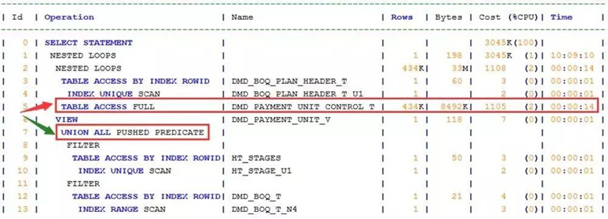
 
时间主要消耗在ID=5的全表扫描上，按照正常的情况，这一步应该是最后完成，而且是应该使用DMD_PAYMENT_UNIT_CONTROL_T表PAYMENT_UNIT_ID字段上的索引。当前因为这两个表之间没有直接关联关系，这一步的操作相当于做了笛卡尔积，这不科学。ID=7的步骤是正确的。


我们再来看看没有使用hint的SQL执行计划：


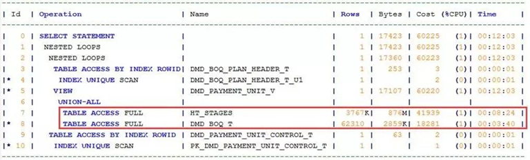
 
这个执行计划问题更严重，因为没有做谓词推进(push_pred）,view使用的两个表做了全表扫描，原来SQL使用push_pred的hint还是起到了重要的优化效果。只是仍没有解决DMD_PAYMENT_UNIT_CONTROL_T表的全表扫描问题，应该算是一个优化了一半的SQL。


**优化尝试1：**
改写SQL，强制将DBPH和HS放在一个内联视图里先做join(no_merge不能少)，然后再与PUC做join，这个是完全等价的SQL：

```sql
select *
  from (SELECT /*+ PUSH_PRED(HS) no_merge*/
         hs.PAYMENT_UNIT_ID
          FROM DMD_BOQ_PLAN_HEADER_T DBPH, DMD_PAYMENT_UNIT_V HS
         WHERE DBPH.PAYMENT_UNIT_ID = HS.PAYMENT_UNIT_ID
           AND DBPH.BOQ_PLAN_HEADER_ID = :B1) hs1,
       DMD_PAYMENT_UNIT_CONTROL_T PUC
 where HS1.PAYMENT_UNIT_ID = PUC.PAYMENT_UNIT_ID;
```
这样改动后，执行计划就完美了：

 
这个SQL的执行时间大概就是1ms。

有没有更好的优化方法？经过测试，答案是有的：


***优化尝试2：***
根据等值传递原理 a.id=b.id and b.id=c.id 等价于 a.id=b.id and a.id=c.id，将 HS.PAYMENT_UNIT_ID = PUC.PAYMENT_UNIT_ID改成 DBPH.PAYMENT_UNIT_ID = PUC.PAYMENT_UNIT_ID，即：

```sql
SELECT *
  FROM DMD_BOQ_PLAN_HEADER_T      DBPH,
       DMD_PAYMENT_UNIT_V         HS,
       DMD_PAYMENT_UNIT_CONTROL_T PUC
 WHERE DBPH.PAYMENT_UNIT_ID = HS.PAYMENT_UNIT_ID
   AND DBPH.PAYMENT_UNIT_ID = PUC.PAYMENT_UNIT_ID
      --AND HS.PAYMENT_UNIT_ID = PUC.PAYMENT_UNIT_ID
   AND DBPH.BOQ_PLAN_HEADER_ID = :B1;
```
经过这样的修改后，不用任何的hint，执行计划都是完美的。这个案例应该是优化器的考虑不周所致，遇到这种情况，我们就需要考虑通过改写SQL来实现优化的目的。


***心得体会：***
看完这个案例，有很大的收获。


第一，在收集慢sql时，对于top20的确应该优先关注，如果时间允许，也可以留意top20以外，有些sql也许执行时间不长，但是执行次数多。收集top sql时，可以将所有的sql放在一起比较，有利于发现不同之处，例如本次案例使用了hint。


第二，对于多表（两张以上）关联，优化器可能会不准，导致关联顺序出错，可以改写sql。比如select … from a,b,c可以改写成select … from (select … from a,b) t,c，或者像案例中根据等值传递原理改写sql。


第三，对于有hint的慢sql，可以试试讲hint去掉，比较前后的执行计划，确定原本的hint是否合适。


## 2.2 标量子查询
SQL（省略了select部分其他简单列，红色部分即标量子查询，返回了acct_item_type_id字段）：

原sql是一个create table语句，我们这里分析select部分就好。

***优化前SQL：***
```sql
SELECT .. .. ..case
         when exists
          (SELECT 1
                 FROM dat_acct_item_21_201607 t7
                WHERE t1.prd_inst_id = t7.prd_inst_id
                  AND t7.fee_type = 1
                  AND exists (SELECT 1
                         FROM PAR_ACCT_OFR_RANGE t8
                        WHERE t7.ofr_id = t8.ofr_id)
                  AND exists
                (SELECT 1
                         FROM PAR_ACCT_ACCT_REPLACE t9
                        WHERE t7.acct_item_type_id =
                              to_number(t9.old_acct_type_id))
                  AND t1.acct_item_type_id = t7.acct_item_type_id) then
          (SELECT max(to_number(t6.new_acct_type_id))
             FROM PAR_ACCT_ACCT_REPLACE t6
            WHERE t1.acct_item_type_id =
                  to_number(t6.old_acct_type_id))
         else
          t1.acct_item_type_id
       end acct_item_type_id .. .. ..
  FROM (SELECT a.acct_item_id,
               a.cust_Id,
               a.acct_id,
               case
                 when b.type_level = 0 THEN  0
                 else
                  a.prd_inst_id
               end prd_inst_id,
               pay_flag,
               a.source_inst_id,
               a.fee_type,
               a.ofr_id,
               a.group_id,
               a.event_pricing_strategy_id,
               case
                 when a.acct_item_type_id = 465 THEN  40000
                 when a.acct_item_type_id = 11050 THEN 40025
                 when a.acct_item_type_id = 22 THEN 40020
                 when a.acct_item_type_id = 23 THEN  40021
                 else
                  a.acct_item_type_id
               end acct_item_type_id,
               charge,
               a.counts,
               a.calls,
               flux,
               duration,
               billing_duration,
               billing_cycle_id,
               fee_cycle_id,
               pay_acct_id,
               pay_method
          FROM (SELECT acct_item_id,
                       cust_Id,
                       acct_id,
                       prd_inst_id,
                       pay_flag,
                       source_inst_id,
                       fee_type,
                       ofr_id,
                       group_id,
                       event_pricing_strategy_id,
                       acct_item_type_id,
                       charge,
                       counts,
                       calls,
                       flux,
                       duration,
                       billing_duration,
                       billing_cycle_id,
                       fee_cycle_id,
                       pay_acct_id,
                       pay_method
                  FROM dat_acct_item_21_201607
                 WHERE fee_load_condition_id = 0
                   AND fee_out_condition_id = 0
                   AND pay_acct_id NOT in ('71616471632', '71616471631')) a,
               (SELECT DISTINCT type_level, acct_item_type_id
                  FROM hss.tb_bil_acct_item_type@hssdb) b
         WHERE a.acct_item_type_id = b.acct_item_type_id) t1;
```
sql monitor中显示的执行计划，8.5小时仍未执行完：


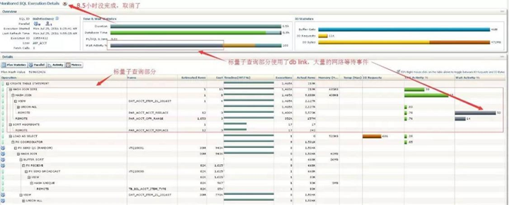
 
***优化后SQL：***
```sql
SELECT .. .. ..,
case
         WHEN (t71.acct_item_type_id is NOT null AND
              t71.prd_inst_id is NOT null) then
          t71.new_id
         else
          t1.acct_item_type_id
       end acct_item_type_id,
       .. .. ..
  FROM (SELECT a.acct_item_id,
               a.cust_Id,
               a.acct_id,
               case
                 when b.type_level = 0 THEN  0
                 else
                  a.prd_inst_id
               end prd_inst_id,
               pay_flag,
               a.source_inst_id,
               a.fee_type,
               a.ofr_id,
               a.group_id,
               a.event_pricing_strategy_id,
               case
                 when a.acct_item_type_id = 465 THEN  40000
                 when a.acct_item_type_id = 11050 THEN 40025
                 when a.acct_item_type_id = 22 THEN  40020
                 when a.acct_item_type_id = 23 THEN  40021
                 else
                  a.acct_item_type_id
               end acct_item_type_id,
               charge,
               a.counts,
               a.calls,
               flux,
               duration,
               billing_duration,
               billing_cycle_id,
               fee_cycle_id,
               pay_acct_id,
               pay_method
          FROM (SELECT acct_item_id,
                       cust_Id,
                       acct_id,
                       prd_inst_id,
                       pay_flag,
                       source_inst_id,
                       fee_type,
                       ofr_id,
                       group_id,
                       event_pricing_strategy_id,
                       acct_item_type_id,
                       charge,
                       counts,
                       calls,
                       flux,
                       duration,
                       billing_duration,
                       billing_cycle_id,
                       fee_cycle_id,
                       pay_acct_id,
                       pay_method
                  FROM dat_acct_item_21_201607
                 WHERE fee_load_condition_id = 0
                   AND fee_out_condition_id = 0
                   AND pay_acct_id NOT in ('71616471632', '71616471631')) a,
               (SELECT DISTINCT type_level, acct_item_type_id
                  FROM hss.tb_bil_acct_item_type@hssdb) b
         WHERE a.acct_item_type_id = b.acct_item_type_id) t1,
       (SELECT DISTINCT prd_inst_id, acct_item_type_id, new_id
          FROM dat_acct_item_21_201607 t7,
               (SELECT DISTINCT old_acct_type_id,
                                max(to_number(new_acct_type_id)) OVER(partition by old_acct_type_id) AS new_id
                  FROM PAR_ACCT_ACCT_REPLACE t9) t91
         WHERE t7.fee_type = 1
           AND t7.acct_item_type_id = to_number(t91.old_acct_type_id)
           AND exists (SELECT 1
                  FROM PAR_ACCT_OFR_RANGE t8
                 WHERE t7.ofr_id = t8.ofr_id)) t71
 WHERE t1.acct_item_type_id = t71.acct_item_type_id(+)
   AND t1.prd_inst_id = t71.prd_inst_id(+);
```
改写后的SQL执行情况，6.4分钟执行完：


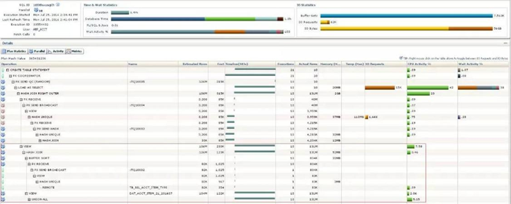
 
对于主查询返回结果集大的SQL，如果存在标量子查询，必须通过改写才能大幅提高效率，否则效率会非常低。有点改写相对简单，有的会很复杂，改写后需要仔细验证改写前后业务逻辑的一致性。


在12c的版本，少量简单的标量子查询会自动转换成表关联，但是大多数复杂一点的情况都做不到自动转换，像上面这张SQL的改写，优化器是不可能实现的。


对于写SQL代码的研发人员，有时写标量子查询的SQL好像在逻辑上简单一些，但是对性能的影响确实非常巨大的。而且优化器对很多复杂的标量子查询在谓词推进、查询转换等方面没有普通的SQL考虑得那么周全，建议尽量少用或不用标量子查询。


今天的例子是select 列表上的标量子查询，还有一种在where 后面出现的标量子查询，效率也是非常差，有机会再分享类似案例。


心得体会：

收获了两点，首先，知道了什么时标量子查询，即标量子查询是指查询结果只包含一个单一的值，它可以嵌套在其他查询语句中，作为一个值的来源。例如：select * from emp where sal > (select round(avg(sal),2) avg_sal from emp)，(select round(avg(sal),2) avg_sal from emp) 子查询的结果只会返回一个标量值，而不是一个结果集，因此为一个标量子查询。标量子查询还是不用或者少用。

另外一个收获是，当一段sql中有某些表多次被使用或者说多粗出现，这就意味着需要进行多次扫描，改写的方向是减少同一个表的使用次数，可以显著提升性能。


## 2.3 SQL优化的2个常识

***SQL1：索引失效***
思考：CDMBAS.BAS_PAPPVACTINFO表的PA_REQUNO ， PA_ORDER 两个字段上存在复合索引，但是下面SQL却使用了全表扫描，即使使用了index的hint也不行。想想可能是什么原因？（3300万记录的表，全表扫描执行一次19秒；问题解决后使用索引只需1.7毫秒）：

```sql
SELECT B2.*
  FROM (SELECT B1.*, ROWNUM rnum
          FROM (SELECT /*+index(t1 IDX_BAS_PAPPVACTINFO_0001)*/
                        T1.PA_CLINAME  AS T1__PA_CLINAME,
                       .. .. .. T1.PA_OPTIME AS T1__PA_OPTIME
                  FROM CDMBAS.BAS_PAPPVACTINFO T1
                 WHERE 1 = 1
                 ORDER BY PA_REQUNO DESC, PA_ORDER DESC) B1
         WHERE ROWNUM <= 21) B2
 WHERE rnum > 0;
```
有索引而不能用，抛开insivisible和unusable 等情况，基本上可以确定是因为复合索引的两个字段定义都是NULL，因为索引不保存全是NULL的条目，为了保证结果的正确性，优化器不选择使用索引是正确的。


如果两个字段确实是可以为NULL，为了优化这个SQL，我们可以这样创建索引，两种方法：

1. 在联合索引的两个字段后，再增加一个定义为NOT NULL的字段，形成3个字段的联合索引；
2. 直接增加一个常量作为字段，形成3个字段的联合索引，如：


```sql
create index idx_name on CDMBAS.BAS_PAPPVACTINFO(PA_REQUNO,PA_ORDER,'x');
```

如果两个字段都是NOT NULL的，可以采用以下两种优化方法：

1）改写SQL，添加组合索引其中的一个字段is not null的谓词条件，即 WHERE 1 = 1 and PA_REQUNO is not null ORDER BY PA_REQUNO DESC, PA_ORDER DESC;
2）修改字段，添加非空约束，修改任意一个字段，或者两个都改为not null也可以：

```sql
alter table CDMBAS.BAS_PAPPVACTINFO modify (PA_REQUNO not null);
```

思考题答案：

创建col_1和col_2字段上的联合索引，避免排序，提高效率。联合索引的字段顺序不能错，order by的字段要放在联合索引的最后。如果是order by desc，正常情况优化器会自动使用index descending扫描方式，不需要建索引的时候加desc 。也有sql复杂的时候优化器没有使用index descending扫描方式，则可以用index_desc来纠正。


***SQL2：***

思考：下面这段SQL从写法上如何优化，结果不变改写SQL。


```sql
SELECT *
  FROM (SELECT oracle_table.*, ROWNUM AS startrownum
          FROM (SELECT .. .. ..
                  FROM mocha_oa_intramsg_message t1
                 INNER JOIN (SELECT C_MESSAGE_ID, max(C_ID) AS C_ID
                              FROM mocha_oa_intramsg_message
                             GROUP BY C_MESSAGE_ID) t2
                    ON t1.C_ID = t2.C_ID
                 WHERE (C_DEL_STATUS = 0 OR C_DEL_STATUS = 1)
                   AND C_FROM_ID = :1
                   AND :2 <= C_SEND_TIME
                   AND :3 >= C_SEND_TIME
                 ORDER BY C_SEND_TIME DESC) oracle_table
         WHERE ROWNUM <= 14)
 WHERE startrownum > 0;
```

mocha_oa_intramsg_message表出现了两次，需要进行两次表扫描，可以通过改写将两个子句合并为一个。

```sql
SELECT *
  FROM (SELECT oracle_table.*, ROWNUM AS startrownum
          FROM SELECT ...
                 FROM (SELECT C_MESSAGE_ID,
                              C_ID AS C_ID,
                              ...
                              row_number() over(partition by C_MESSAGE_ID order by C_ID desc) rk
                         FROM mocha_oa_intramsg_message
                        WHERE (C_DEL_STATUS = 0 OR C_DEL_STATUS = 1)
                          AND C_FROM_ID = :1
                          AND :2 <= C_SEND_TIME
                          AND :3 >= C_SEND_TIME
                        ORDER BY C_SEND_TIME DESC) oracle_table
                WHERE oracle_table.rk = 1
                  and ROWNUM <= 14)
 WHERE startrownum > 0;
```
这个用row_number()的分析函数来改写即可。不需要group by，表扫描只需要一次就完成了。分析函数有很多功能，经常用到的就是去重功能，必须掌握。


***心得体会：***
学习了组合索引字段包含有NULL值会导致索引失效，并且学了几种优化方法，当字段可以为NULL时，组合索引可以再添加一个NOT NULL字段或直接添加一个常量值。当字段为NOT NULL时，但是没有创建NOT NULL约束，也有两种方法。一是改写SQL，添加组合索引其中的一个字段不为空作为谓词条件，或者一步到位给索引字段添加NOT NULL约束，只添加其中任意一个或者都添加也是可以的。


此外，对于一段SQL中一个表被扫描多次，如果其中的一个子查询是分组做聚合，那可以用ROW_NUMBER()分析函数来改写，不需要分组，表扫描次数可以减少。


附件：[学习心得-组合索引](../Sql-Optimization-Practice/files/学习心得-组合索引字段.sql)


## 2.4 rownum应用之分页查询
oracle的rownum这个伪列在SQL中用途广泛，有3种常见用法：

1. 分页查询rownum <= :b1 and RN > :b2（rownum不能直接使用>）；
2. rownum <= :b1；
3. rownum = 1或rownum <= 1，是rownum <= :b1的一种特殊用法。


先来看分页查询的写法，虽然是老生常谈，但很多人还是使用了低效写法。

***低效写法：***
```sql
select column_lists
  from (select rownum as rn, A.*
          from (select column_lists
                  from table_name
                 where col_1 = :b0
                 order by col_2) A)
 where rn <= :b2
   and rn > :b1;
高效写法：

select column_lists
  from (select rownum as rn, A.*
          from (select column_lists
                  from table_name
                 where col_1 = :b0
                 order by col_2) A
         where rownum <= :b2)
 where rn > :b1;
```
原理是，低效写法需要将内层的结果集全部排序，再从中取需要的部分；而高效的写法只需要取排序后 <= :b2部分的结果就可以。


一般分页查询大概率是访问前面部分页面的；如果访问内层，则结果集越大，低效写法和高效写法的性能差距就越明显；如果访问分页的最后部分的页面，则性能差别不大。


***思考题：***
这样的分页查询语句，应该创建怎样的索引？
应该建一个col_1和clo_2的联合索引，order by字段col_2放在联合索引的最后。


***SQL:***
遇到一个分页查询的问题SQL，简化如下：

```sql
SELECT *
  FROM (
        SELECT ...
               ROWNUM RNSTART
          FROM S_SRV_REQ SSR
         WHERE SSR.ACT_OPEN_DT + 1 3 >= SYSDATE - 60
           AND ROWNUM <= 10
         ORDER BY SSR.CREATED DESC
        ) T
 WHERE T.RNSTART >= 1;
```
这个SQL有两个问题：

1. 分页查询的写法本身就有问题，rownum与order by并列出现在同一个where后面，这种写法得到的结果可能是乱序的（除非使用CREATED字段上索引的降序扫描，但是如果该索引不可用，得到的结果就不对了，需要优化索引，参考上一章节处理）。

2. 谓词条件SSR.ACT_OPEN_DT + 1 3 >= SYSDATE - 60过滤性很好，而且存在ACT_OPEN_DT字段上的索引，但是因为字段上存在表达式 “+1 / 3“，导致索引不能使用，需要改写sql，将 SSR.ACT_OPEN_DT + 1 / 3 >= SYSDATE - 60 改成SSR.ACT_OPEN_DT >= SYSDATE - 60 - 1 / 3。


此外，因为谓词条件不是等值条件（上一章节的SQL是col_1 = :b1，本章节是col_x >=），这个sql如果创建索引ACT_OPEN_DT和CREATED联合索引是没有意义的，这种情况还是只会使用索引的第一字段，无法避免排序。（其实这里我不是很懂为什么）

***心得体会：***

学会了Oracle分页查询的高效写法，以及学会了创建对于分页查询sql的有效索引。


最后的一段话说由于不是等值条件，所以建索引没有意义。经过测试，当谓词条件为等值时，索引访问方式为索引范围扫描；当谓词条件为大于等于时，索引的访问方式为索引快速扫描，成本确实会增加，但是我还是不明白为什么说无效。


## 2.5 批处理过程的优化，改写一段存储过程为一个SQL

对于批处理业务，程序员的一般性思维方法是：打开一个游标，然后逐条处理。如果想加快点速度，那就多开一些并发进程。


下面的存储过程代码就是这样一个比较典型的例子：


根据一张表的记录（先去重），更新另一张表，v_part参数是表的分区号，为了并发而设计（可以打开几个会话，传不同的分区值，实现并行操作。但是不会锁表吗？）。

```sql
CREATE OR REPLACE procedure HSS.proc_mbi_day(v_part number) is
  cursor cur_ofr_id is
    select a.ofr_id from tb_mbi_temp2 a;
begin
  sql_2 := 'insert into hss.tb_mbi_temp2(ofr_id) select distinct a.ofr_id from tb_bil_mbi_day a where a.part=' || v_part;
  execute immediate sql_2;  v_commit := 0;
  open cur_ofr_id;
----------------循环过程-------------------
  loop
    fetch cur_ofr_id
      into v_ofr_id;
    exit when cur_ofr_id%notfound;
    sql_6 := 'select nvl(min(ofr_code),0) from hss.tb_prd_ofr awhere a.ofr_id = :v_ofr_id and rownum = 1';
    execute immediate sql_6
      into v_ofr_code
      using v_ofr_id;
    sql_4 := 'update tb_bil_mbi_day a set a.ofr_code=:v_ofr_code where a.ofr_id=:v_ofr_id and a.part=:v_part';
    execute immediate sql_4
      using v_ofr_code, v_ofr_id, v_part;
    v_commit := v_commit + 1;
    if v_commit >= 100 then
      commit;
      v_commit := 0;
    end if;
  end loop;
```
PS: sql_2执行后没有提交，但是没有关系，在此事务中可以查询此表插入没提交的记录。


这个业务逻辑并不复杂，大概的逻辑是这个样的：


来源表tb_prd_ofr与目标表tb_bil_mbi_day通过ofr_id关联，取tb_prd_ofr.ofr_ode最小记录对应的ofr_code数据，更新目标表tb_bil_mbi_day.ofr_code。


***改写后：***
```sql
merge into tb_bil_mbi_day b
using (select ofr_id, nvl(ofr_code, 0) as ofr_code
         from (select ofr_id,
                      ofr_code,
                      row_number() over(partition by ofr_id order by ofr_ode) as rn
                 from hss.tb_prd_ofr) a
        where rn = 1) a
on (b.ofr_id = a.ofr_id)
when matched then
  update set b.ofr_code = a.ofr_code;
```
这样的改写不是为了简洁，而是为了更加高效。上面存储过程执行需要几个小时，而经过改写后的SQL只需要执行几分钟。

是不是应该考虑优化一下你们的批处理业务了呢？

***心得体会：***

在意以往的工作中，对于分区表，我总喜欢用循环分区的批处理方式，这也是一种常规的方式，因为分区表一般比较大，表的数据量往往在亿级，而一个设计合理的分区表一个分区就能缩减好几倍的处理量。


学习了本章节的内容，我的认知再一次被刷新了，完全想不到批处理过程可以改写为一段SQL，这个思路对我以后的工作将提供非常大帮助。对于业务逻辑不是很复杂，表的数据量不是非常大，并且有可以利用的索引，即改写能够跑得动。这时候我们就可以考虑将批处理过程改写为SQL，不仅简洁，而且高效。


## 2.6 分析函数不光只有row_number()
某客户的经营分析系统，下面这个SQL，执行了1.2小时：


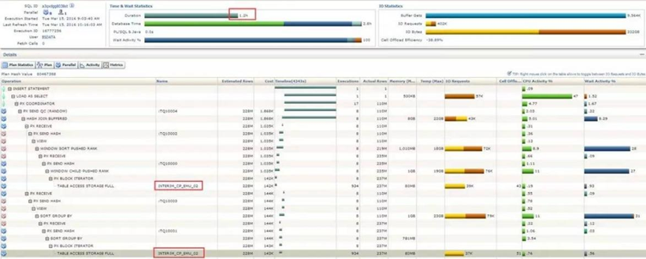

**sql:**

```sql
INSERT /*+append */
INTO MD_KPI_ACT_EMU_PRODUCT_MON_01 nologging
  (month_number, day1, ......, day31)
  SELECT /*+parallel(t, 8) parallel(t2, 8) use_hash(t, t2) full(t) full(t2)*/
   t.month_number,
   TO_NUMBER(t2.day1) day1,
   .. .. ..,
   TO_NUMBER(t2.day31) day31
    FROM (SELECT /*+parallel(t, 8) full(t)*/
           t.month_number,.. .. .., t.town_id
            FROM (SELECT /*+parallel(t, 8) full(t)*/
                   t.month_number,
                   .. .. ..,
                   t.town_id,
                   ROW_NUMBER() OVER(PARTITION BY t.msisdn ORDER BY t.stat_date DESC) row_id
                    FROM interim_cp_emu_02 t) t
           WHERE t.row_id = 1) t,
         (SELECT /*+parallel(t, 8) full(t)*/
           t.msisdn, MAX(t.day1) day1,.. .. .., MAX(t.day31) day31
            FROM interim_cp_emu_02 t
           GROUP BY t.msisdn) t2
   WHERE t.msisdn = t2.msisdn;
```

这段SQL脚本的逻辑大概是这样的：先取出表interim_cp_emu_02字段msisdn对应stat_date最大值（去重）对应的记录作为结果集t，再根据字段msisdn分组获取字段dayx最大值的汇总作为结果集t2，然后这两二个结果集根据字段msisdn关联取数。


这个开发人员知道使用row_number()分析函数做记录去重，但是却不知道还有其他的分析函数可以取MAX，根据原SQL的业务逻辑。


改写如下：


```sql
INSERT /*+append*/
INTO MD_KPI_ACT_EMU_PRODUCT_MON_01 nologging
  (month_number, day1, ......, day31)
  SELECT /*+parallel(8)*/
   t.month_number,
   TO_NUMBER(t2.day1) day1,
   ......,
   TO_NUMBER(t2.day31) day31
    FROM (SELECT /*+parallel(t, 8) full(t)*/
           t.month_number,
           ......,
           t.town_id,
           ROW_NUMBER() OVER(PARTITION BY t.msisdn ORDER BY t.stat_date DESC) row_id,
           MAX(t.day1) over(partition by t.msisdn) as day1,
           ......,
           MAX(t.day31) over(partition by t.msisdn) as day31
            FROM bsdata.interim_cp_emu_02 t) t2
   WHERE t2.row_id = 1);
```

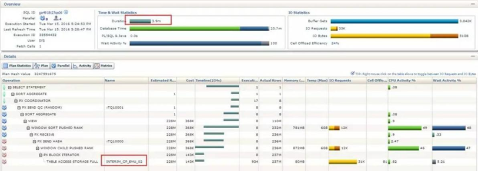

改写的思路是这样子的，由于结果集t和结果集t2都使用了字段msisdn作为分组，并且来源表是同一个，所以可以将结果集t2的操作用开窗的方式集成到结果集t中。

改写后的的代码更简洁了，更重要的是，大表扫描只需要一次，而且不需要做Join操作，当然效率也提高了很多倍（select部分做测试，原SQL主要消耗时间就是在select部分），只需要3.9分钟。

 
***学习心得：***

这是一个非常经典的分析函数优化案例，用分析函数去重和替代分组操作，很多人惯性思维习惯将两部分操作独立，原因是不够熟悉不常用的分析函数，例如max()、rank()、dense_rank()等。


我们最最最常用的分析函数当属row_number()，但是不要忽略了其他函数的存在，提倡定期去温习SQL知识，这样有利于提高我们的开发思路。

## 2.7 SQL函数转表关联优化
通过检查超长时间SQL发现了它，这是一个执行时间与数据处理量不相匹配的SQL，sql monitor显示如下：


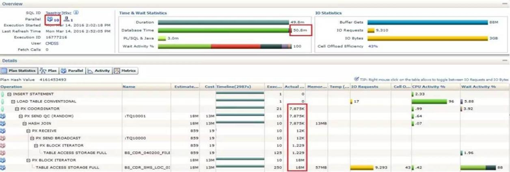

查看sql，发现在返回列使用了一个函数，SQL代码简化如下：

```sql
INSERT INTO ......,
  select ......,
         fun_get_bas1_id(1, a.other_area, 'T_STD1_0007') OTHER_AREA_CODE,
         ......,
    FROM jsdss.bs_cdr_sms_loc_03 A,
         (SELECT file_name
            FROM BS_CDR_040200_FILE_TASK_INFO t
           WHERE t.day_number = 2
             AND cdr_type = 'SMS'
             AND GROUP_ID = 2) b
   WHERE a.file_name = b.file_name
     AND ......;
```

函数的代码如下：


1）主函数代码，里面涉及子函数的调用：

```sql
create or replace function fun_get_bas1_id(i_rule_id      in number,
                         i_bas2_id      in varchar2,
                         i_t_table_name varchar2) return varchar2 is
  ret_value varchar2(10);
  TYPE RefCurTyp IS REF CURSOR;
  cv        RefCurTyp;
  r_bas1_id varchar2(10);
  v_other   varchar2(10);
BEGIN
  if i_bas2_id is null then
    v_other   := fun_get_other_id(i_t_table_name, i_rule_id);
    ret_value := v_other;
    return(ret_value);
  else
    OPEN cv FOR 'SELECT bas1_id FROM ' || i_t_table_name || ' where bas2_id=''' || i_bas2_id || ''' and rule_id=''' || i_rule_id || ''' and rownum<2';
    FETCH cv
      INTO r_bas1_id;
    if r_bas1_id is null or cv%notfound then
      v_other   := fun_get_other_id(i_t_table_name, i_rule_id);
      ret_value := v_other;
    else
      ret_value := r_bas1_id;
    end if;
    CLOSE cv;
    return(ret_value);
  end if;
end;
```

2）子函数代码：


```sql
function fun_get_other_id(i_t_table_name in varchar2, i_rule_id in number)
  return varchar2 is
  ret_value varchar2(10);
  TYPE RefCurTyp IS REF CURSOR;
  cv        RefCurTyp;
  r_bas1_id varchar2(10);
BEGIN
  OPEN cv FOR 'SELECT bas1_id FROM ' || i_t_table_name || ' where (trim(bas1_desc)=''其它'' or trim(bas1_desc)=''其他'') and rule_id=' || i_rule_id;
  FETCH cv
    INTO r_bas1_id;
  if cv%notfound then
    ret_value := ' ';
  else
    ret_value := r_bas1_id;
  end if;
  CLOSE cv;
  return(ret_value);
end;
```

根据子函数的代码，如果other_area为null，则函数使用的sql为：

```sql
SELECT bas1_id
  FROM cmdss.T_STD1_0007
 where (trim(bas1_desc) = '其它' or trim(bas1_desc) = '其他')
   and rule_id = '1';
```
这个sql返回的固定值为900，接下来在改写的时候需要用到。

根据以上信息，可以用对该SQL进行改写：


1）将select部分的fun_get_bas1_id(1, a.other_area, 'T_STD1_0007')改写为：

```sql
decode(a.other_area,null,900,nvl(c.bas1_id, 900)) OTHER_AREA_CODE；
```

2）将cmdss.T_STD1_0007剔重(row_number()函数）后作为c表与a表做外关联：

```sql
(select *
  from (SELECT bas1_id,
               bas2_id,
               row_number() over(partition by bas2_id order by rowid) as rn
          FROM cmdss.T_STD1_0007
         where rule_id = '1')
 where rn = 1) c，关联条件为a.other_area = c.bas2_id(+)；
```

改写后的SQL代码如下（红色部分第一部分是替换，第二部分是增加）：

```sql
INSERT INTO .. .. ..,
  select .. .. ..,
         --fun_get_bas1_id(1, a.other_area, 'T_STD1_0007') OTHER_AREA_CODE,
         decode(a.other_area, null, 900, nvl(c.bas1_id, 900)) OTHER_AREA_CODE,
         .. .. ..,
    FROM jsdss.bs_cdr_sms_loc_03 A,
         (SELECT file_name
            FROM BS_CDR_040200_FILE_TASK_INFO t
           WHERE t.day_number = 2
             AND cdr_type = 'SMS'
             AND GROUP_ID = 2) b,
         (select *
            from (SELECT bas1_id,
                         bas2_id,
                         row_number() over(partition by bas2_id order by rowid) as rn
                    FROM cmdss.T_STD1_0007
                   where rule_id = '1')
           where rn = 1) c
   WHERE a.file_name = b.file_name
     AND a.other_area = c.bas2_id(+)
     AND ......;
```

使用select部分对SQL改写前后的性能进行对比：改写前41.6分钟，改写后7.03秒，性能提升347倍。

**学习收获：**

在SQL代码中，应尽量使用表关联而不是使用自定义的一些包含select的函数，说到底就是要优化处理逻辑，简化处理步骤。

## 2.8 关于in/exists，not in/not exists
先说说简单的in 和 exists：

in 和 exists 在目前的主流版本（10g及以上），是等价的。优化器会统一做查询转换。

但是如果屏蔽了某些隐含参数，还是会不一样，曾经在客户现场遇到一个case，使用exists的SQL，优化器没有自动做unnest，性能很差，加了unnest的hint后可以，改成in也可以不用加unnest的hint就能自动做unnest。这种情况比较少见，一般不用考虑。

需要注意的是，下面类似的写法会导致优化器不能做查询转换：


```sql
select object_id, object_name
  from t1
 where (object_name = 'T2' or exists
        (select 1 from t2 where t1.object_id = t2.object_id));
```
就是exists与其他谓词条件之间是OR的关系。这样就只能做filter操作，数据量大非常影响性能。

这种情况可以考虑使用union all改写SQL来提高性能。

顺便提一嘴，select ... from a where a.id in (select b.id from b)这种SQL，如果要改成表关联，不是：

select distinct .... from a,b where a.id=b.id两者是不等价的。

等价改写是：

```sql
select .... from a,(select distinct b.id from b) bb where a.id=bb.id;
```
注意distinct的位置。

再说说复杂一点的not in 和 not exists：

**先讲结论：在两个表的关联字段定义都为not null的情况下，两者的结果集才是想同的，可以等价改写。**

如果关联字段定义为null，那么即使没有为null的记录，在没有加is not null谓词条件的情况下，虽然结果集是一样的，但是执行计划是不同的，效率也相差较大。

更要注意的是：如果某个表的关联字段内容是null，还要看SQL的结果集是不是你要的结果集，主要注意的是not in操作。

测试用例：
```sql
-- Create table
create table tnull_1 (id1 number,name1 varchar2(20));
create table tnull_2 (id2 number,name2 varchar2(20));
--insert into table
insert into tnull_1 values(1,'a1');
insert into tnull_1 values(2,'b1');
insert into tnull_1 values(3,'c1');
insert into tnull_1 values(null,'d1');
commit;
insert into tnull_2 values(2,'b2_1');
insert into tnull_2 values(2,'b2_2');
insert into tnull_2 values(3,'c2');
insert into tnull_2 values(4,'d2');
insert into tnull_2 values(null,'e2');
commit;
```

1）not exists的结果：注意返回了一条关联字段为null的记录：

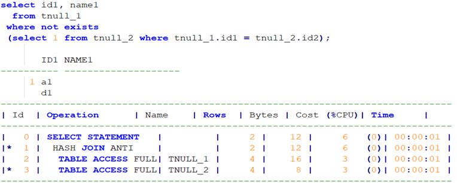

执行计划效率高，不用考虑子查询有空值的情况。建议写法。

2）not in的结果：因为子查询的结果集中有一条记录是null，则整个查询结果为空（这是否是你想要的结果？）：

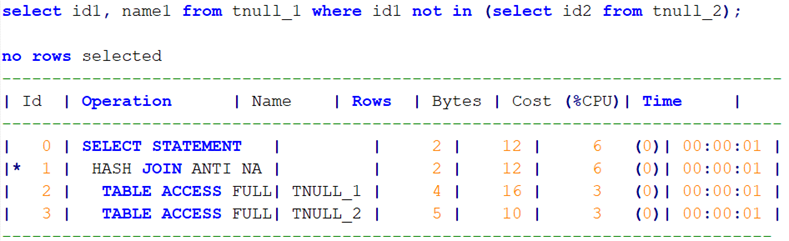

执行计划的join 步骤包含ANTI NA关键字，效率低。

3）not in子查询没有null记录的情况：返回结果比not exists时少了一条id1=null的记录：

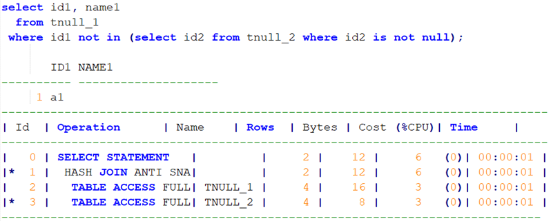
 
执行计划的join 步骤包含ANTI SNA 关键字，效率低。

4）下面的SQL结果集和上面一样，但是执行计划却不一样，下面的效率更高：

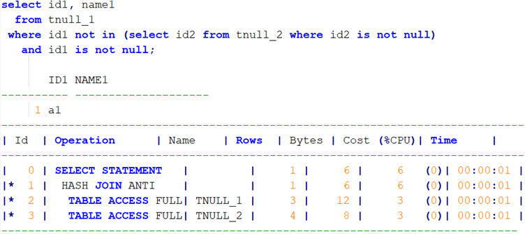

执行计划的join 步骤只包含ANTI 关键字，效率高。

因此，如果你的表定义没有做not null的限制，那么建议你在写not in SQL时加两个is not null。

**学习心得：**

学了本章，对于in和exists到底谁更好有了一个清晰的认识，在主流版本中，in和exists是等价的，性能也一样，但是注意避免与其他谓词条件做OR操作。

而not in和not exists则有点特殊，他们的关联字段都为not null时才等价，包括性能。一般情况下使用not exists比较保险，可以避免not in子查询返回的结果集包含null的记录时，整个结果集为空的情况（这种情况一般不是需要的结果），性能也有保障。如果使用了not in，子查询的关联字段一般加上not null，主查询也加上not null，这样才能保证sql的性能。

## 2.9 count(1)快，还是count(*)快？

江湖上传闻count(1) 会比count(*)快很多倍，是真的吗？反正我信了，那我们今天就来验证这个神奇的事情。

为了让实验效果更明显，首先我们先搞一张1千万条记录的大表demo1，这是一个占用空间1.4G的普通表，没有任何索引。

建表过程略，表的大小如下：

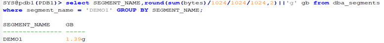
 
速度对比验证开始：

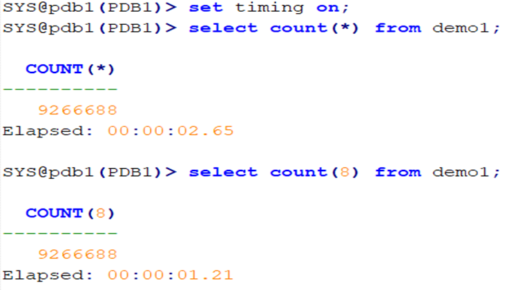

先看前两步，第一步执行select count(*) from demo1所需要的时间为2.65秒，第二步执行select count(8) from demo1所需的时间为1.21秒，时间相差特别明显，当数据量再大些时相信会更加悬殊，第二步是第一步性能的两倍，难道就是因为少敲一个shift键吗（count(8)其实等同于count(1)，这里用count(8)是为了娱乐效果）。

通过实验结果这个结论看起来是正确的。

如果是初学者，没有继续往下看，可能真的会相信上面的结论，然后回工位把count(*)都改为count(1)，觉得自己又学了一招。

接着往下看，紧接着第二步，我们再执行一次select count(*) from demo1，看看会发生什么？

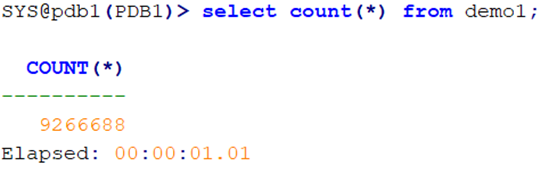
 
神奇的事情发生了，这一次count(*)比count(8)速度快了，？？？

看到了这里，如果学习过Oracle的体系结构，就会明白，其实第一步和第二步的差异是磁盘读和内存读的区别，也就是常说的硬解析和软解析，所以第三步和第二步其实大差不差，都是软解析，直接从数据缓冲区中获取。下面通过执行计划证实：

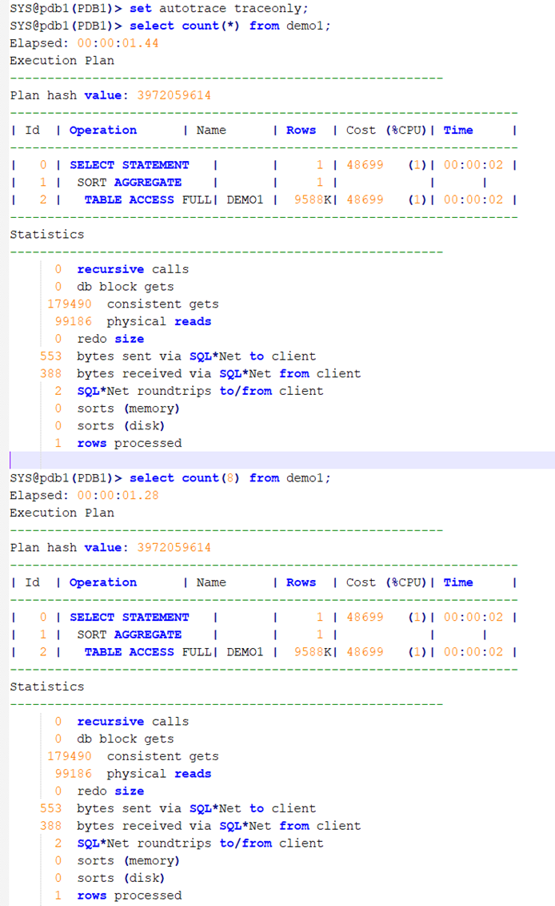
 
可以看出两个语句的执行计划没有任何区别。

**学习心得：**

经过本章节的学习，对于很多人说count(1)比count(*)性能好的说法是否正确有了结论，答案就是他们在性能上没有任何区别。

回到我们的验证步骤，如果我们只进行第一第二步基本且片面的验证，把它当作结论去实践，并且推广给其他同事，那这个结论应该很快会受到质疑。

因此，我们应该根据理论去指导实践，在此案例中，如果结合Orale的体系结构和SQL语句执行的原理去加以验证，那么就不会被一个错误的结论误导。

## 2.10 代码中误用select xxx from dual

先看一个系统AWR的top CPU SQL：

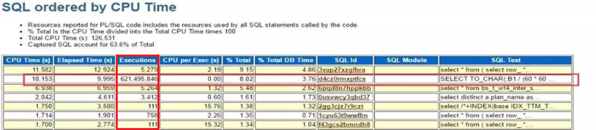
 
第二条sql是这样的：

```sql
SELECT TO_CHAR(:B1(60 * 60 * 24) +
               TO_DATE('1970-01-01 08:00:00', 'YYYY-MM-DD HH24:MI:SS'),
               'YYYY-MM-DD HH24:MI:SS')
  FROM DUAL;
```
这是一段纯纯计算SQL语句，很简单，但执行次数一天6.2亿+次，相当于一秒钟执行7200次，七千二干他，消耗了大量的CUP资源。

分析这段语句，发现有绑定变量':B1'，大概率为存储过程或者函数的内嵌SQL。通过动态性能视图dba_source查找这个sql语句的来源，经检查，它来源于一个将number类型的时间字段转换成日期字符串的function，名称为number2date1。

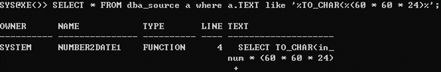
 
原Function代码如下：

```sql
CREATE OR REPLACE function number2date1(in_num number) return varchar2 IS
  ret_str varchar2(30);
BEGIN
  SELECT TO_CHAR(in_num / (60 * 60 * 24) +
                 TO_DATE('1970-01-01 08:00:00', 'YYYY-MM-DD HH24:MI:SS'),
                 'YYYY-MM-DD HH24:MI:SS')
    into ret_str
    FROM DUAL;
  RETURN ret_str;
END number2date1;
```

这个function存在两个问题：

1. 使用number类型保存日期，神经操作，还有很多人喜欢用varchar2类型存日期的，也是奇葩，使用起来非常不方便，纯属于给自己挖坑了，所以这里不得不写了一个function做日期类型转换。建议使用date或者timestamp保存日期类型。

2. 使用sqlplus时，如果要计算一个值，我们会使用SELECT xxx FROM dual来做计算。但是，在function、procedure、package和trigger中，这些纯计算的内容，不需要用虚表，在procedure中可以直接给变量赋值，上面的number2date1可以将计算的SQL语句改为 return xxx。

优化前的执行计划如下：

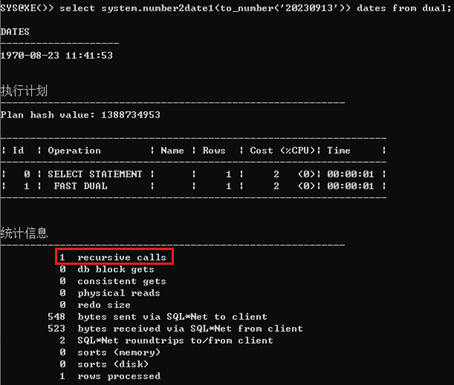
 
我们根据第二个问题，优化后的代码为：

```sql
CREATE OR REPLACE function number2date2(in_num number) return varchar2 is
BEGIN
  return TO_CHAR(in_num / (60 * 60 * 24) +
                 TO_DATE('1970-01-01 08:00:00', 'YYYY-MM-DD HH24:MI:SS'),
                 'YYYY-MM-DD HH24:MI:SS');
END number2date2;
```

执行计划为：

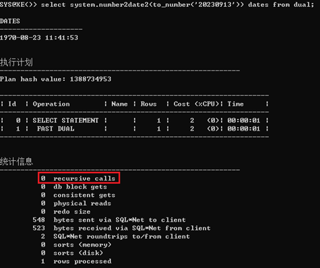
 
对比优化前后的执行计划，优化前多次执行会消耗大量的recursive calls，而优化后无需进行递归调用，消耗的资源几乎可以忽略不计了。

至于为什么修改后不会产生recursive calls，关于recursive calls是这样解释的：

https://docs.oracle.com/en/database/oracle/oracle-database/19/tgsql/performing-application-tracing.html#GUID-681AB1DC-082B-460C-8656-DC3286627D0C
 
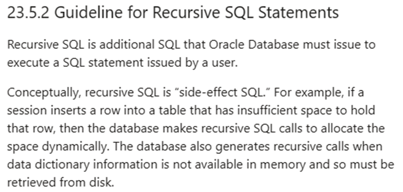

大概就是，递归SQL是Oracle数据库在执行用户发出的SQL语句时必须发出的附加SQL。从概念上讲，递归SQL是“副作用SQL”。例如，如果会话将一行插入到没有足够空间容纳该行的表中，那么数据库将进行递归SQL调用来动态分配空间。时，数据库也会生成递归调用。数据字典信息在内存中不可用，因此必须从磁盘中检索。

IBM的手册中，讲了递归调用的触发条件：

http://publib.boulder.ibm.com/tividd/td/ITMD/SC23-4724-00/en_US/HTML/oraclepac510rg59.htm
 
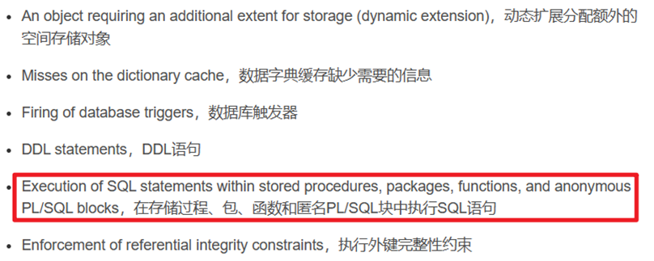

所以，大概是因为直接return返回计算结果不需要执行sql语句。

**学习心得：**

在存储过程、包、函数和匿名PL/SQL块中，如果需要进行计算，那么应该避免使用SELECT xxx FROM dual，这样能有效减少CPU的消耗。

## 2.11 必须掌握用分析函数去重的方法

原来SQL:
```sql
SELECT T1.COL_1, T1.COL_2, T1.COL_3,T2.B_TYPE,T1.SERV_TYPE,T1.VALID_DATE
  FROM TABLE_1 T1, TABLE_2 T2
 WHERE T1.SERV_TYPE = T2.SERVTYPE
   AND T1.VALID_DATE = (SELECT MAX(T3.VALID_DATE)
                          FROM TABLE_1 T3
                         WHERE T3.COL_1 = T1.COL_1
                           AND T3.COL_2 = T1.COL_2
                           AND T3.COL_3 = T1.COL_3);
```
原SQL说明：   
table_1的col_1,col_2,col_3 联合起来对应了多个valid_date，先通过自关联取最大的valid_date。

改写后SQL:
```sql
SELECT T1.COL_1, T1.COL_2, T1.COL_3,T2.B_TYPE,T1.SERV_TYPE,T1.VALID_DATE
  FROM (SELECT *
          FROM (SELECT T3.COL_1,
                       T3.COL_2,
                       T3.COL_3,
                       T3.VALID_DATE,
                       T3.SERV_TYPE,
                       ROW_NUMBER() OVER(PARTITION BY T3.COL_1, T3.COL_2, T3.COL_3 ORDER BY T3.VALID_DATE DESC) AS RR
                  FROM TABLE_1 T3)
         WHERE RR = 1) T1,
       TABLE_2 T2
 WHERE T1.SERV_TYPE = T2.SERVTYPE;
```
改写说明：   
使用分析函数ROW_NUMBER()的好处，是不需要分组和自关联，table_1表不需要重复扫描。   
改写后的SQL要比原SQL效率提高几倍。但不是等价改写。但是，改写后的SQL业务逻辑更严谨：原SQL如果table_1表相同col_1、col_2、col_3对应的最大valid_date有重复，则返回的结果也是有重复的，这应该不是SQL的本意。而改写后的SQL则不会返回重复记录。如果一定要等价改写，可以使用max()分析函数。

**学习心得：**

截至本章节，我们已经用分析函数优化了5个案例，这足以看出分析函数功能的强大。在本章中，我们用于取分组后的最大值（去重），省去了分组和自连接，减少了表扫描次数，性能提升了好几倍。在以往的案例里，分析函数还可以用于去重，排序等等。我们最常用的就是去重功能，应该掌握！！！
此外，刚看到案例时，我大概花了1分钟完成了对原SQL的改写，觉得自己不是一般牛逼，改写的SQL如下：
```sql
SELECT T.COL_1, T.COL_2, T.COL_3,T.B_TYPE,T.SERV_TYPE,T.VALID_DATE
  FROM (SELECT T1.COL_1,
               T1.COL_2,
               T1.COL_3,
               T1.SERV_TYPE,
               T2.B_TYPE,
               T1.VALID_DATE,
               ROW_NUMBER() OVER(ORDER BY T1.VALID_DATE DESC) RK
          FROM TABLE_1 T1, TABLE_2 T2
         WHERE T1.SERV_TYPE = T2.SERVTYPE) T
 WHERE RK = 1;
```
点击执行，出来的结果会是什么？   
结果只返回了一条记录，很明显改写后的逻辑不对。这种情况对我这种初级优化选手是常发生的事情，本质原因是急于求成，没有完全理解待优化SQL的逻辑，以至于改写的SQL无效。而改写最基本的原则就是，不能改变原SQL的逻辑。因此，我们在拿到待优化SQL时，应该沉下心来梳理他的逻辑，为做好优化奠定基础。

附件：[demo-211.sql](./files/demo-211.sql)

## 2.12 区间检索
### 2.12.1 尝试优化
有个sql是根据IP地址查询对应的国家/地区（根据号码查询归属地也属类似业务）。

代码如下：
```sql
Select country_code
  From COUNTRY_IP_RANGE IP
 WHERE IP.Start_Ip1 <= ip_to_number1(:ip)
   AND IP.End_Ip1 >= ip_to_number1(:ip);
```
其中ip_to_number1是一个将ip地址转换成整数的函数。COUNTRY_IP_RANGE表记录数大概有12万条。存在一个start_IP1和end_ip1字段上的联合索引。SQL每次最多只返回一条记录。当前的性能问题是查询一个小IP（如：1.0.0.1）时，只需要几个buffer gets，查询一个较大的IP时（如：222.252.0.123），buffer gets要400多。

优化1：

根据业务需求SQL每次最多只返回一条数据，因此添加一个rownum = 1的谓词条件：
```sql
Select country_code
  From COUNTRY_IP_RANGE IP
 WHERE IP.Start_Ip1 <= ip_to_number1(:ip)
   AND IP.End_Ip1 >= ip_to_number1(:ip)
   and ROWNUM = 1;
```
加了这个条件后，性能只有一点点改善，每次buffer gets会少1。

优化2：

根据业务特点及索引默认扫描方式为升序扫描，改变索引扫描方式，使用索引降序扫描，用index_rs_desc的hint实现：（不懂）
```sql
Select /*+ INDEX_RS_DESC(ip IDX_IP1) */
 country_code
  From COUNTRY_IP_RANGE IP
 WHERE IP.Start_Ip1 <= ip_to_number1(:ip)
   AND IP.End_Ip1 >= ip_to_number1(:ip)
   and ROWNUM = 1;
```
其中IDX_IP1是Start_Ip1和End_Ip1两个字段的联合索引，做到这一步后，每次的buffer gets只有3了（不懂，谁能解答一下？在这里为什么降序扫描比升序扫描性能好？）。如果不用hint，可以通过改变联合索引的先后顺序来实现优化效果，即联合索引的顺序是End_Ip1, Start_Ip1。

个人理解：在这里用到索引降序扫描是因为谓词条件的写法为 Start_Ip1 <= ip_to_number1(:ip) AND End_Ip1 >= ip_to_number1(:ip),我们一般取区间是start_ip1 >= xxx and end_ip1 <= xxx，这两种写法的逻辑不一样，索引扫面的顺序相反。（不知道对不对）

优化3：

前两步优化已经完成了95%，还有一种特殊情况就是，给定得IP地址找不到对应区间的数据，查询结果返回为空，这个时候仍需要大量的buffer gets。但是光靠SQL本身已经无能为力。

最终的优化方法，通过plsql解决，创建function:
```sql
CREATE OR REPLACE function get_ip_area(v_ip varchar2) return varchar2 IS
  v_start_ip1    NUMBER;
  v_COUNTRY_CODE varchar2(30);
BEGIN
  select COUNTRY_CODE, start_ip1
    INTO v_COUNTRY_CODE, v_start_ip1
    from (SELECT COUNTRY_CODE, start_ip1
            FROM COUNTRY_IP_RANGE
           WHERE end_ip1 >= ip_to_number1(v_ip)
           order by end_ip1)
   where ROWNUM = 1;
  if v_start_ip1 <= ip_to_number1(v_ip) then
    return v_COUNTRY_CODE;
  else
    return 'N/A';
  end if;
EXCEPTION
  WHEN NO_DATA_FOUND THEN
    RETURN 'N/A';
END get_ip_area;
/
```
使用方法select get_ip_area('78.138.30.176') from dual; 使用了函数后，性能问题就彻底解决了。

**学习心得：**

首先，对于那种只返回一条数据的业务场景，可以尝试加上ROWNUM = 1的谓词条件，有可能会减少一个buffer gets。

其次，组合索引的字段顺序要合理设计，我自己总结有三个点。第一，最常用的字段放在前面；第二，等值条件字段最好放第一个；第三，排序字段放最后。在次案例中，谓词条件其实调换以下顺序就是End_Ip1 >= ip_to_number1(:ip) AND Start_Ip1 <= ip_to_number1(:ip)，这也是正常的写法，所以索引的顺序应该是End_Ip1，Start_Ip1才合理。

最后，索引范围扫描（Index Range Scan）、索引全扫描（Index Full Scan）、索引唯一扫描（Unique Index Scan）这三种B-TREE索引扫描方式的执行结果是有序的（ps：union是有序的，union all是无序的）。也就是说返回结果不需要做order by也能得到有序的结果。但是，尽管这些索引扫描方式可以返回有序的结果，但在某些情况下，由于优化器的选择或者其他因素（如并行执行），查询结果可能不是完全有序的。为了确保有序性，可以使用 ORDER BY 子句对查询结果进行排序。有索引的情况下，order by 的效率会很高，并且不一定会执行排序操作。

附件：[demo-2121.sql](./files/demo-2121.sql)，[emp-2121.sql](./files/emp-2121.sql)

### 2.12.2 最佳优化方案（1.12.1再优化）

在1.12.1案例中，最终使用了创建function的方式完成优化。本来以为没有优化空间了，再仔细琢磨了以下，发现还是可以直接使用SQL替代原来的function，SQL还真是博大精深啊。

优化写法，SQL代码替代原function，索引也可以将组合索引改为end_ip1单字段索引：
```sql
SELECT case
         when start_ip1 <= :B1 then
          COUNTRY_CODE
         else
          'no_match'
       end
  FROM (SELECT COUNTRY_CODE, start_ip1, end_ip1
          FROM COUNTRY_IP_RANGE
         WHERE end_ip1 >= :B1
         order by end_ip1)
 WHERE ROWNUM = 1;
```
这个写法要比原来function的性能要好那么一丁点，主要优点是简洁了，不用写function那么麻烦。

对于优化写法，不论大的IP还是小的IP，匹配不到区间都是3个buffer gets。而对于普通写法，匹配不到区间时，buffer gets会随着查询值(:B1)与最大值（max end_ip1）的远近有很大变化，查询值越小效率越差。


**思考题：**  
优化写法中，有了索引，默认索引升序扫描，为什么还要加order by?

答案：  
根据业务规则，结果要取end_ip1 >= :B1升序后的第一条数据，根据伪劣rownum的特性，不管结果是否有序，第一条记录的rownum都为1，所以我们要先排序再用rownum取出第一条数据。  
这里有索引，一般情况下是不需要order by的，但是假如索引失效了，全表扫描会随机选一条的end_ip1 >= :B1的记录，造成结果是错误的，这就违背了改写的基本原则。所以必须加上order by，索引失效时sql可以慢，但是不可以出错。


**学习心得：**
在有索引的情况下，需要进行排序时，一般也建议加上order by语句。当索引有效时，执行结果是有序，order by语句不会产生排序操作。只有当索引失效后，order by语句才会产生排序操作。

附件：[demo-2122.sql](./files/demo-2122.sql)

## 2.13 数据分布决定SQL写法

本案例是将一个merge SQL改写，对于目标表与来源表数据量相差悬殊的情况提供了一种新的改写思路。

原SQL：
```sql
merge into t_customer c
using (select a.cstno, a.amount
         from t_trade a,
              (select cstno, max(trade_date) trade_date
                 from t_trade
                group by cstno) b
        where a.cstno = b.cstno
          and a.trade_date = b.trade_date) m
on (c.cstno = m.cstno)
when matched then
  update set c.amount = m.amount;
```
执行计划：

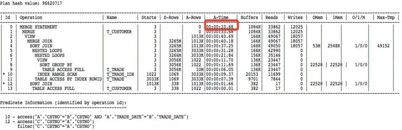
 
这个SQL的业务逻辑是，将用户交易明细表（trade）的最近的一笔消费额更新到用户信息表（t_customer）的消费字段。

分析说明：

原SQL中红色部分是一种较为常见的写法，用到了标量子查询，group by后取其他字段信息，这个写法的弊端就是需要进行多次表扫描，且聚合操作比较耗费资源。

且这段sql还有一个隐患，就是当用户交易明细表trade的某个cstno对应的最大trade_date有重复值，那么这个SQL就会报错`ORA-30926: unable to get a stable set of rows in the source tables`。

改写方法1：
```sql
merge into t_customer c
using (select a.cstno, a.amount
         from (select trade_date,
                      cstno,
                      amount,
                      row_number() over(partition by cstno order by trade_date desc) RNO
                 from t_trade) a
        where RNO = 1) m
on (c.cstno = m.cstno)
when matched then
  update set c.amount = m.amount;
```
使用分析函数改写，效率会比原SQL提高很多，而且不会报ORA-30926错误。

改写方法2：
```sql
declare
  vamount number;
begin
  for v in (select * from t_customer) loop
    select amount
      into vamount
      from (select amount
              from t_trade
             where cstno = v.cstno
             order by trade_date desc)
     where rownum < 2;
    update t_customer set amount = vamount where cstno = v.cstno;
  end loop commit;
end;
/
```
根据执行计划得知，用户信息表t_customer的记录数比较少，只有一千条，而用户交易明细表t_trade的记录有1000万条，比例为1:10000。在这种特殊两表数据相差较大的特殊情况下，PSQL的写法确实比分析函数的写法要高效，这个改写方法非常巧妙，思路独特，值得借鉴。

改写方法1和方法2的对比：

1. plsql的改写方式，适合在t_customer表比较小，而且t_customer 和 t_trade两表的记录数比例比较大的情况下，性能才会比分析函数的改写高一些。在本例中，如果t_customer表的记录数是10万，那么分析函数的写法反而要比plsql的写法快上几十到上百倍。

2. 如果在程序代码中，一段sql要改成plsql，改动还是有点麻烦。sql的改写相对简单些。

3. plsql这种改写的前提是必须存在t_trade表cstno + trade_date两字段的联合索引，而分析函数的改写就不需要任何索引的支持。

4. 对于t_trade这种千万记录级别的表，使用分析函数的写法可以通过开启并行来提速。plsql的改写，如果要提高效率，需要先将t_customer表按cstno分组，用多个session并发执行。

针对方法2的改写：
```sql
merge into t_customer c
using (select tc.cstno,
              (select amount from t_trade td1 
                where td1.cstno = tc.cstno
                  and td1.trade_date = (select max(trade_date) from t_trade td2 where tc.cstno = td2.cstno)
                  and rownum = 1) as amount
         from t_customer tc) m
on (c.cstno = m.cstno)
when matched then update set c.amount = m.amount;
```
执行计划：

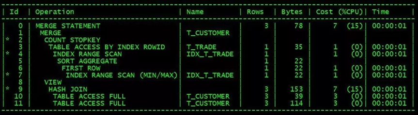
 
逻辑看起来比较复杂难懂，一般不会用到这样的改写，了解一下就好。

这种写法需要的条件和PLSQL写法一致，需要t_trade表存在cstno+trade_date联合索引（IDX_T_TRADE），而且T_customer 表的数据量远低于T_trade。根据执行计划，这个sql的执行效率应该比plsql写法的效率不相上下。

**总结：**

SQL优化，除了要避免低效的SQL写法，主要还是要看表的数据量与数据分布情况，plsql的改写方法，在少数比较特殊的情况下会体现出较高的效率，在某些数据分布的情况下，效率可能还不如原SQL。但是，优化思路非常值得借鉴。而分析函数的改写方式，则不论数据如何分布，都会比原SQL要高效，通用性更强。

对于本例改写前的SQL，应该还有很多开发人员在使用，在了解了分析函数的使用方法后，原SQL的低效写法就应该被彻底抛弃了。

**学习心得：**

本章内容很丰富，不仅指出了很多开发人员的问题，而且提供了多种优化方法。对于取明细表某个字段最大值去匹配其他信息的业务场景，使用分析函数的写法必须掌握。而对于PLSQL特殊写法，我们应该学习他的优化思路，想想为什么可以这样去改写，也许对自己以后的开发和优化工作提供思考方向。

在这里，如果没学习过本案例，我是无论如何也不会想到原SQL还能用PLSQL这种改写方式，为什么笔者能写出来呢？我认为是他做到了以下几点：1、对原SQL的需求理解透彻；2、熟悉ORACLE优化器的逻辑；3、离不开大量的尝试，优化不可能一步到位，肯定是通过慢慢试出来的。

因此，当我们进行SQL改写优化的时候，应该记住：优化无定式，优化器是死的，人脑是活的，只有掌握了原理，才能让SQL执行效率越来越高。

附件：[demo-213.sql](./files/demo-213.sql)

## 2.14 等待事件 Enq: ss - contention 性能问题处理

某个业务系统突然变得十分缓慢，查看AWR显示的主要等待事件为Enq: ss – contention：

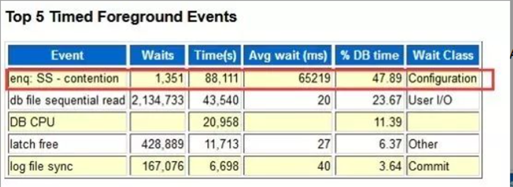

SS指的是sort segments排序段，相关描述如下：

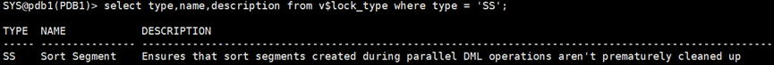
 
大概意思是，SS该锁是为了确保在并行DML操作期间创建的排序段不会过早清理。也就是数据库中的临时表空间不够用了，在等待数据库分配新的Sort Segment。

根据Oracle 文档对该事件的描述：  
*When SMON is cleaning up very large dead transactions, it may not service other work like cleaning up temporary space, handling sort-segment requests or performing instance recovery.*

现场检查数据库，果然存在一个大的update事务在回滚，而且预计还有很长一段时间才能回滚完成。这种情况下，如何恢复当前业务的执行效率呢？

**方案1：**
1. 加速回滚，事务回滚完SMON就能正常管理sort segment了；
2. 手工清理临时表空间：
   ```sql
   alter session set events 'immediate trace name drop_segments level;
   ```

这两种方法是一个正常DBA的思维，非常正确。

不过下次再遇到大事务回滚，还是会出现相同问题。所以尝试分析受影响的业务SQL，看看是否可以优化解决问题。

**原SQL：**
```sql
WITH TMP_RESULT AS
 (SELECT A.ACCT_ID,
         A.PRD_INST_ID,
         A.OFR_ID,
         A.FEE_TYPE,
         A.ACCT_ITEM_TYPE_ID,
         B.ACCT_ITEM_TYPE_NAME,
         A.FLUX,
         A.RATE_DURATION,
         A.CHARGE
    FROM V_DAT_M_21 A, TB_BIL_ACCT_ITEM_TYPE B, TB_PRD_PRD_INST_21 D
   WHERE D.SERVICE_NBR = '888'
     AND D.PRD_INST_ID = A.PRD_INST_ID
     AND A.ACCT_ITEM_TYPE_ID = B.ACCT_ITEM_TYPE_ID)
SELECT C.ACCT_ID,
       C.PRD_INST_ID,
       C.OFR_ID,
       E.OFR_NAME,
       C.FEE_TYPE,
       C.ACCT_ITEM_TYPE_ID,
       C.ACCT_ITEM_TYPE_NAME,
       C.FLUX,
       C.RATE_DURATION,
       C.CHARGE
  FROM TMP_RESULT C, TB_PRD_OFR E
 WHERE C.OFR_ID = E.OFR_ID
   AND C.OFR_ID <> 0
UNION
SELECT C.ACCT_ID,
       C.PRD_INST_ID,
       C.OFR_ID,
       NULL OFR_NAME,
       C.FEE_TYPE,
       C.ACCT_ITEM_TYPE_ID,
       C.ACCT_ITEM_TYPE_NAME,
       C.FLUX,
       C.RATE_DURATION,
       C.CHARGE
  FROM TMP_RESULT C
 WHERE C.OFR_ID = 0;
```

执行计划：

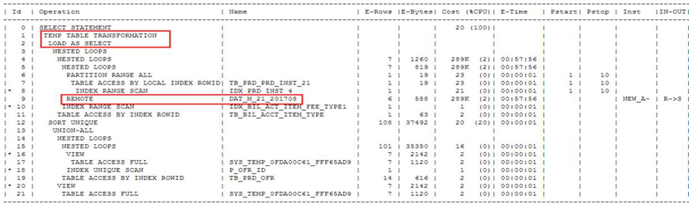
 
这种使用with的CTE（Common Table Expression）写法的SQL，在with对象被引用两次以上时，会先对命名对象生成一张临时表（如果包含字段包含lob字段则不会）写到临时表空间，这个过程叫materialize，后续使用该对象的时候直接从临时表中读取数据，不需要重复执行这段SQL。

这个SQL频繁执行，因此在SMON繁忙的时候产生了大量的Enq: ss - contention等待事件，执行效率由原来的1秒多，变成了当前的20秒，性能下降将近20倍。

这个SQ会使用CTE，是因为SQL用到的一个view：V_DAT_M_21，这个view是从db link获取数据，这个步骤消耗的时间最长，使用CTE的materialize就是为了避免这个view的两次调用。本来一个为了提高效率的优化操作，遇到了大事务回滚反而性能下降了很多。

**方案2：**

分析到这里，我们又多了一个解决方案：用 /*+inline*/ hint（放到CTE中的select后），告诉优化器不要做materialize，这样就避免了临时表的生成和临时表空间的使用，执行时间可能由1秒提高到2秒，但是也远比20秒要好很多。这个操作可以通过sql profile实现，不需要修改SQL代码。

方案3：

根据原SQL的逻辑，发现这个SQL也是可以通过外连接的方式实现改写，也可以达成只执行一次CTE，这样优化器不要做materialize，这样就避免了临时表的生成和临时表空间的使用。

改写后SQL：
```sql
WITH TMP_RESULT AS
 (SELECT A.ACCT_ID,
         A.PRD_INST_ID,
         A.OFR_ID,
         A.FEE_TYPE,
         A.ACCT_ITEM_TYPE_ID,
         B.ACCT_ITEM_TYPE_NAME,
         A.FLUX,
         A.RATE_DURATION,
         A.CHARGE
    FROM V_DAT_M_21 A, TB_BIL_ACCT_ITEM_TYPE B, TB_PRD_PRD_INST_21 D
   WHERE D.SERVICE_NBR = '888'
     AND D.PRD_INST_ID = A.PRD_INST_ID
     AND A.ACCT_ITEM_TYPE_ID = B.ACCT_ITEM_TYPE_ID)
SELECT distinct C.ACCT_ID,
                C.PRD_INST_ID,
                C.OFR_ID,
                DECODE(C.OFR_ID, 0, null, E.OFR_NAME) as OFR_NAME,
                C.FEE_TYPE,
                C.ACCT_ITEM_TYPE_ID,
                C.ACCT_ITEM_TYPE_NAME,
                C.FLUX,
                C.RATE_DURATION,
                C.CHARGE
  FROM TMP_RESULT C, TB_PRD_OFR E
 WHERE C.OFR_ID = E.OFR_ID(+)
   and (c.ofr_id = 0 or e.ofr_id is not null);
```
经过改写后，之前的几个方法就显得多余了。这个SQL既提升了执行效率，又完全不使用temp表空间，再也不需要担心大事务回滚的影响了。

**心得体会：**

在执行并行DML操作时，Oracle数据库会创建多个Sort Segments以存储每个并行进程的结果，这些结果集需要按照特定的行序进行排序和合并，以得到最终的结果。并行DML操作允许数据库同时在多个CPU上执行相同的操作，以提高处理速度。


 
在本案例中，由于锁Sort Segment占用了大量的临时表空间，导致业务SQL需要等待分配新的Sort Segment（SQL的CTE和union都会用到临时表空间）。因此，本案例的核心就是为了解决临时表空间占用的问题，要么释放，要么减少使用频率。

笔者给出了三种解决方案，第一种是释放，后面两种是强制不使用临时表空间。第一个方法治标不治本，可能还会频繁发生。第二个方法相比第三个方法比较简单，但是性能没有达到最优。第三个方法性能好，但是改写需要的比较清晰的思路，对我来说可能有点困难。在大概看了改写思路，自己尝试改写还是没能成功，最后还是通过画图才梳理清楚。

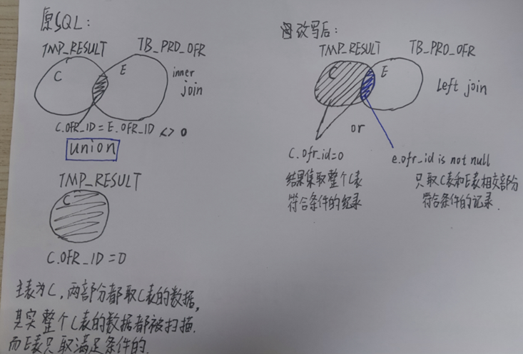


## 2.15 update SQL的优化方法

**原sql：**

```sql
UPDATE CSCU_SUBS_SPSERVICE_LIST
   SET EXPIRETIME = :B1
 WHERE SUBSID = :B6
   AND SPCODE = :B5
   AND SERVICECODE = :B4
   AND REGION = :B3
   AND (EXPIRETIME = :B2 OR
       (EXPIRETIME IS NULL OR
       EXPIRETIME >= TO_DATE('20370101, yvyymmdd')) AND STATUS = 1);
```

执行计划：

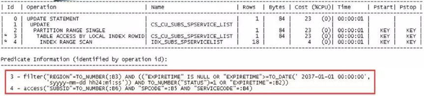

原sql存在的问题是，update更新少量的记录，但是用时久，索引回表次数多。根据执行计划，可以推断出索引由4个字段组成，包含了EXPIRETIME，但是由于OR的写法限制了只能使用前三个字段，EXPIRETIME只能在回表时做filter。

因此，优化的方向就是尽可能让EXPIRETIME也走索引做access，使用4个字段更为高效的索引。

思路是，根据OR，将SQL拆分为3个update语句。
```sql
--UPDATE1
UPDATE CSCU_SUBS_SPSERVICE_LIST
   SET EXPIRETIME = :B1
 WHERE SUBSID = :B6
   AND SPCODE = :B5
   AND SERVICECODE = :B4
   AND REGION = :B3
   AND EXPIRETIME = :B2;

--UPDATE2.1
UPDATE CSCU_SUBS_SPSERVICE_LIST
   SET EXPIRETIME = :B1
 WHERE SUBSID = :B6
   AND SPCODE = :B5
   AND SERVICECODE = :B4
   AND REGION = :B3
   AND EXPIRETIME IS NULL
   AND STATUS = 1
   AND LNNVL(EXPIRETIME = :B2);

--UPDATE 2.2
UPDATE CSCU_SUBS_SPSERVICE_LIST
   SET EXPIRETIME = :B1
 WHERE SUBSID = :B6
   AND SPCODE = :B5
   AND SERVICECODE = :B4
   AND REGION = :B3
   AND EXPIRETIME >= TO_DATE('20370101, yvyymmdd')
   AND STATUS = 1
   AND LNNVL(EXPIRETIME IS NULL)
   AND LNNVL(EXPIRETIME = :B2);
```

拆分完了，性能也提升了，但是等价性如何？

可能存在的问题是，第一步的update完成后的记录，EXPIRETIME更新后的值可能又满足后面的update条件，可能又一次在第二步被update。如果:B1是常量，重复update倒是没事，如果是变量，或者sysdate这种，那么三次update执行的结果，可能就和原来的结果不一致了。

改写前后结果不一致，这是不被允许的。需要重新改写，但是思路还是原来的思路，拆分update。在SQL改写中，OR逻辑操作我们常用union all来替代，逻辑上不会发生变化。

**改写1：**
```sql
merge into CSCU_SUBS_SPSERVICE_LIST a using 
(SELECT b1.EXPIRETIME, rowid rid
   FROM CSCU_SUBS_SPSERVICE_LIST b1
  WHERE SUBSID = :B6
    AND SPCODE = :B5
    AND SERVICECODE = :B4
    AND REGION = :B3
    AND EXPIRETIME = :B2
 union all
 SELECT b2.EXPIRETIME, rowid rid
   FROM CSCU_SUBS_SPSERVICE_LIST b2
  WHERE SUBSID = :B6
    AND SPCODE = :B5
    AND SERVICECODE = :B4
    AND REGION = :B3
    AND EXPIRETIME IS NULL
    AND STATUS = 1
    AND LNNVL(EXPIRETIME = :B2)
 union all
 SELECT b3.EXPIRETIME, rowid rid
   FROM CSCU_SUBS_SPSERVICE_LIST b3
  WHERE SUBSID = :B6
    AND SPCODE = :B5
    AND SERVICECODE = :B4
    AND REGION = :B3
    AND EXPIRETIME >= TO_DATE('20370101, yvyymmdd')
    AND STATUS = 1
    AND LNNVL(EXPIRETIME IS NULL)
    AND LNNVL(EXPIRETIME = :B2)) b
on (a.rowid = b.rid)
when matched then
  update a.EXPIRETIME = b.EXPIRETIME;
```

如果有主键的情况下，可以用主键替代rowid。

**改写2：**
```sql
MERGE INTO CSCU_SUBS_SPSERVICE_LIST A
USING (SELECT /*+NO_MERGE OR_EXPAND*/
        B1.EXPIRETIME, ROWID RID
         FROM CSCU_SUBS_SPSERVICE_LIST B1
        WHERE SUBSID = :B6
          AND SPCODE = :B5
          AND SERVICECODE = :B4
          AND REGION = :B3
          AND (EXPIRETIME = :B2 OR
              (EXPIRETIME IS NULL OR
              EXPIRETIME >= TO_DATE('20370101, yvyymmdd')) AND STATUS = 1)) B
ON (A.ROWID = B.RID)
WHEN MATCHED THEN
  UPDATE A.EXPIRETIME = B.EXPIRETIME;
```

12c及更高版本中，"OR-EXPAND"是一种查询优化操作，用于处理包含OR条件的查询。当查询中存在OR条件时，Oracle可以使用OR-EXPAND操作将其转换为UNION ALL操作，以便更好地利用索引和并行执行计划。利用Oracle自带的hint对OR进行转换，可以减少代码块，让改写后SQL的谓词条件保持和原SQL一致。

**学习心得：**

本章收获很丰富，通过看执行计划可以判断索引的情况。组合索引字段做谓词条件时，OR操作会导致索引不生效，因此可以改为用union all集合操作，在12c及更高版本中，还可以使用/*+OR_EXPAND*/ hint替代union all集合操作。

附件：[demo-215.sql](./files/demo-215.sql)

## 2.16 like等价改写substr优化

一个CPU TOP 1 SQL,占了总CPU资源将近10%。原SQL稍复杂，有UNION ALL，还有row_number分析函数，这里做了简化，只抽取了其中核心部分。

Sql:
```sql
select *
  from (SELECT item_ver
          FROM items T
         WHERE :B1 BETWEEN T.FIRST_SN AND T.LAST_SN
           AND :B1 LIKE SUBSTR(T.FIRST_SN, 1, 10) || '%'
         order by T.UPDATED_DATE)
 where rownum <= 1;
```

已知条件：  
items表有500万左右的记录，12.5万 blocks，当前使用的是FIRST_SN和LAST_SN两字段联合索引。平均buffer gets为2800，执行时间40毫秒（开发人员认为40毫秒完全可以接受，但是由于执行非常频繁，系统资源接受不了）。  
满足 :B1 BETWEEN T.FIRST_SN AND T.LAST_SN 谓词条件的记录数较多，满足 :B1 LIKE SUBSTR (T.FIRST_SN, 1, 10) || '%' 谓词条件的记录数也比较多，但是两个条件都满足的记录数相对较少。

分析：  
这是一个区间检索的SQL，但不是严格的区间检索，因为有大量的重复区间，还要把满足条件的全部记录排序后再取日期最早的一条（如果是严格的区间检索，一个给定的B1值，最多只会对应一个区间，区间不重复,以前的公众号文章有介绍,优化后效果会非常好）。所以用严格区间检索的优化方法在这里就不行了，但是如果只是使用index_desc的hint让索引降序扫描，应该还是会有一些提升。

**优化1，改写SQL：**
```sql
select *
  from (SELECT item_ver
          FROM items T
         WHERE :B1 BETWEEN T.FIRST_SN AND T.LAST_SN
           AND SUBSTR(:B1,1,10) = SUBSTR(T.FIRST_SN, 1, 10)
         order by T.UPDATED_DATE)
 where rownum <= 1;
```

**优化2，创建索引：**

为了让索引发挥最大作用，让last_sn字段也起到索引的作用，创建`SUBSTR(T.FIRST_SN,1,10),LAST_SN,FIRST_SN,UPDATED_DATE` 4字段联合索引。

优化后，随机选择一个绑定变量在测试环境测试，原来将近2000 buffer gets，优化后变成11个buffer。

**学习心得：**

学习了本章案例，长了很多见识。一是知道了like的原来也可以改写。二是又对组合索引有了新的理解，这里建了4字段的组合索引，我认为索引顺序是有讲究的。等值连接条件的字段作为引导列，由于用到了函数，所以把函数也一起作为引导列。Order by排序字段放在最后，可以有效减少回表。

附件：[demo-216.sql](./files/demo-216.sql)

## 2.17 学会改写SQL，让性能起飞

完成相同业务逻辑的SQL,写法不同,执行效率可能会有几百上千倍的差距,今天我们通过几个案例来说明一下:

**case1：原sql代码如下(执行时间1.2分钟)**

```sql
with holder_clear_temp as
 (select distinct t.principal_holder_account
    from ch_member.holder_account s, ch_member.clear_agency_relation t
   where s.holder_account = t.principal_holder_account
     and s.holder_account_status = '1'
     and t.agency_status = '1'
     and t.agency_type in ('1', '2')
     and t.agency_holder_account = :1
     and t.principal_holder_account != :2),
holder_settle_temp as
 (select t.principal_holder_account, t.product_category
    from ch_member.holder_account s, ch_member.settle_agency_rel t
   where s.holder_account = t.principal_holder_account
     and s.holder_account_status = '1'
     and t.agency_status = '1'
     and t.agency_type in ('1', '2')
     and t.agency_holder_account = :3
     and t.principal_holder_account != :4
     and not exists
   (select 1
            from holder_clear_temp c
           where c.principal_holder_account = t.principal_holder_account)),
temp as
 (select jour.BALANCE_CHG_SN
    from ch_his.HIS_ACCOUNT_CHG_BALANCE_JOUR jour
   inner join ch_stock.product_info info
      on (info.product_code = jour.product_code or
         (info.pub_product_code = jour.product_code and
         info.has_distribution_flag = '1'))
   where 1 = 1
     and (exists
          (select 1
             from holder_clear_temp c
            where jour.holder_account = c.principal_holder_account) or exists
          (select 1
             from holder_settle_temp s
            where jour.holder_account = s.principal_holder_account
              and info.product_Category = s.product_category))
     and jour.init_date >= :5
     and jour.init_date <= :6

  union all

  select jour.BALANCE_CHG_SN
    from ch_stock.ACCOUNT_CHG_BALANCE_JOUR jour
   inner join ch_stock.product_info info
      on (info.product_code = jour.product_code or
         (info.pub_product_code = jour.product_code and
         info.has_distribution_flag = '1'))
   where 1 = 1
     and (exists
          (select 1
             from holder_clear_temp c
            where jour.holder_account = c.principal_holder_account) or exists
          (select 1
             from holder_settle_temp s
            where jour.holder_account = s.principal_holder_account
              and info.product_Category = s.product_category))
     and jour.init_date >= :7
     and jour.init_date <= :8)

select count(1) from temp;
```

这个sql相对复杂一点，我们通过sql monitor显示的执行计划可以明显的看出瓶颈所在。因为谓词条件使用了or 连接两个exists子查询，所以只能使用filter操作，而主查询返回的记录数又比较多，就导致sql执行时间比较长。根据sql写法和执行计划反馈的信息，我们就可以通过改写来优化这个SQL。sql monitor显示(部分)：

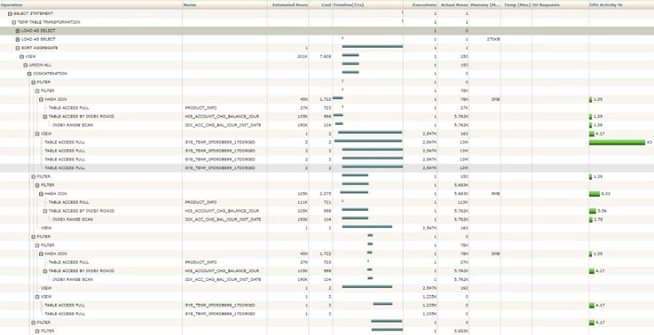

有点糊，看不出来任何东西，就当看过了，继续往下。

**case1改写后SQL：**

```sql
with holder_clear_temp as
 (select distinct t.principal_holder_account
    from ch_member.holder_account s, ch_member.clear_agency_relation t
   where s.holder_account = t.principal_holder_account
     and s.holder_account_status = '1'
     and t.agency_status = '1'
     and t.agency_type in ('1', '2')
     and t.agency_holder_account = '2110348'
     and t.principal_holder_account != '2110348'),
holder_settle_temp as
 (select t.principal_holder_account, t.product_category
    from ch_member.holder_account s, ch_member.settle_agency_rel t
   where s.holder_account = t.principal_holder_account
     and s.holder_account_status = '1'
     and t.agency_status = '1'
     and t.agency_type in ('1', '2')
     and t.agency_holder_account = '2110348'
     and t.principal_holder_account != '2110348'
     and not exists
   (select 1
            from holder_clear_temp c
           where c.principal_holder_account = t.principal_holder_account)),
exists_temp as
 (select principal_holder_account, 'xx' as product_category
    from holder_clear_temp
  union
  select principal_holder_account, product_category
    from holder_settle_temp),
temp as
 (select jour.BALANCE_CHG_SN
    from ch_his.HIS_ACCOUNT_CHG_BALANCE_JOUR jour,
         ch_stock.product_info               info,
         exists_temp                         uuu
   where info.product_code = jour.product_code
     and jour.holder_account = uuu.principal_holder_account
     and (uuu.product_category = 'xx' or
         info.product_Category = uuu.product_category)
     and jour.init_date >= 20190205
     and jour.init_date <= 20190505
  union all
  select jour.BALANCE_CHG_SN
    from ch_his.HIS_ACCOUNT_CHG_BALANCE_JOUR jour,
         ch_stock.product_info               info,
         exists_temp                         uuu
   where (info.pub_product_code = jour.product_code and
         info.has_distribution_flag = '1')
     and jour.holder_account = uuu.principal_holder_account
     and (uuu.product_category = 'xx' or
         info.product_Category = uuu.product_category)
     and jour.init_date >= 20190205
     and jour.init_date <= 20190505
     and lnnvl(info.product_code = jour.product_code)

  union all

  select jour.BALANCE_CHG_SN
    from ch_stock.ACCOUNT_CHG_BALANCE_JOUR jour
   inner join ch_stock.product_info info
      on (info.product_code = jour.product_code or
         (info.pub_product_code = jour.product_code and
         info.has_distribution_flag = '1'))
   where 1 = 1
     and (exists
          (select 1
             from holder_clear_temp c
            where jour.holder_account = c.principal_holder_account) or exists
          (select 1
             from holder_settle_temp s
            where jour.holder_account = s.principal_holder_account
              and info.product_Category = s.product_category))
     and jour.init_date >= 20190205
     and jour.init_date <= 20190505)

select count(1) from temp;
```

经过改写后，原来执行1.2分钟的SQL,现场测试只需要耗时0.6秒（这个测试只改了耗时较长union all的上半部分，如果下半部分也做相同改写，预计最终执行时间不到0.3秒,性能提升达200多倍）。

改写说明:

原sql用or 连接的两个exists，存在相同的关联条件,我们通过一个union(注意不是union all)把它合并在一起,通过CTE(with as)定义为exists_temp，然后就可以与主查询的两个表做关联，而不是做filter。因为主查询两个表的关联关系也存在一个or，优化器必然会使用concat，那样就会拆分成4段做union all。我只希望主查询做concat，就人工做了concat，将主查询拆分成了union all。

**Case2原SQL：**
```sql
SELECT A.FLOW_INID,
       A.CURR_STEP,
       A.FLOW_NAME,
       A.FINS_NAME,
       TO_CHAR(A.INST_CRDA, 'YYYY-MM-DD HH24:MI:SS') INST_CRDA,
       'manual_rel' RELA_TYPE
  FROM FLOW_INST A
 WHERE EXISTS (SELECT 1
          FROM FLOW_RELATE_INFO B
         WHERE A.FLOW_INID = B.RELATE_FLOW_INID
           AND B.FLOW_INID = :1)
    OR EXISTS (SELECT 1
          FROM FLOW_RELATE_INFO B
         WHERE A.FLOW_INID = B.FLOW_INID
           AND B.RELATE_FLOW_INID = :2)
UNION ALL
SELECT S.FLOW_INID,
       S.CURR_STEP,
       S.FLOW_NAME,
       S.FINS_NAME,
       TO_CHAR(S.INST_CRDA, 'YYYY-MM-DD HH24:MI:SS') INST_CRDA,
       'auto_rel' RELA_TYPE
  FROM FLOW_INST S,
       (SELECT FI.FLOW_INID, FI.PARA_INID
          FROM FLOW_INST FI
         WHERE FI.FLOW_INID = :3) F
 WHERE ((F.FLOW_INID = S.PARA_INID AND S.IF_SUB = 1) OR
       F.PARA_INID = S.FLOW_INID)
   AND S.DEL_FLAG = 0;
```

 
这是一个OA系统的业务SQL,执行时间接近2秒. FLOW_RELATE_INFO 表只有480条记录,8 blocks。

在不改SQ的情况下，我们可以通过创建FLOW_RELATE_INFO表上(FLOW_INID,RELATE_FLOW_INID)两字段联合索引，将sql执行效率提高到0.37秒（OA系统相对可以接受的一个响应时间）。
 
这个创建小表索引提升效率的方法，也是对那些小表不需要创建索引说法的一个反证。
如果我们改写这个sql，可以不需要创建索引，就能得到一个更好的性能提升，不到0.01秒。

**case2改写后SQL：**
```sql
SELECT A.FLOW_INID,
       A.CURR_STEP,
       A.FLOW_NAME,
       A.FINS_NAME,
       TO_CHAR(A.INST_CRDA, 'YYYY-MM-DD HH24:MI:SS') INST_CRDA,
       'manual_rel' RELA_TYPE
  FROM FLOW_INST A
 WHERE FLOW_INID in (SELECT RELATE_FLOW_INID
                       FROM FLOW_RELATE_INFO
                      WHERE FLOW_INID = '77913'
                     union
                     SELECT FLOW_INID
                       FROM FLOW_RELATE_INFO B
                      WHERE RELATE_FLOW_INID = '77913')
UNION ALL
SELECT S.FLOW_INID,
       S.CURR_STEP,
       S.FLOW_NAME,
       S.FINS_NAME,
       TO_CHAR(S.INST_CRDA, 'YYYY-MM-DD HH24:MI:SS') INST_CRDA,
       'auto_rel' RELA_TYPE
  FROM FLOW_INST S,
       (SELECT FI.FLOW_INID, FI.PARA_INID
          FROM FLOW_INST FI
         WHERE FI.FLOW_INID = '77913') F
 WHERE ((F.FLOW_INID = S.PARA_INID AND S.IF_SUB = 1) OR
       F.PARA_INID = S.FLOW_INID)
   AND S.DEL_FLAG = 0;
```

 
**CASE3原SQL：**
```sql
SELECT C.fd_txtname    As "文件名称",
       a.fd_start_time AS "开始时间",
       a.fd_end_time   AS "结束时间",
       c.N             AS "数据量"
  FROM dapdw.tb_dapetl_log_proc a
  join dapdw.tb_dapetl_distribute_spool B
    on a.fd_proc_name = b.fd_id
  join (SELECT 'YCCTOEAL_INSTALMENT_DYYMMDD.DAT' as fd_txtname,
               COUNT(1) as N
          FROM C_EAL_LOANDEPO_HIS
         where data_Dt = 20190217
           and source_id = 'YCC01'
        UNION ALL
        SELECT 'YCCTOEAL_UNDRAWN_DYYMMDD.DAT', COUNT(1)
          FROM C_EAL_LOANDEPO_HIS
         where data_Dt = 20190217
           and source_id = 'YCC03'
        UNION ALL
        SELECT 'YCCTOEAL_FEE_DYYMMDD.DAT', COUNT(1)
          FROM C_EAL_LOANDEPO_HIS
         where data_Dt = 20190217
           and source_id = 'YCC05'
        UNION ALL
        SELECT 'NDSTOEAL_FXSPOT_DYYMMDD.DAT', COUNT(1)
          FROM C_EAL_LOANDEPO_HIS
         where data_Dt = 20190217
           and source_id = 'NDS04'
        UNION ALL
        SELECT 'YI2TOEAL_LOAN_DYYMMDD.DAT', COUNT(1)
          FROM C_EAL_LOANDEPO_HIS
         where data_Dt = 20190217
           and source_id = 'YI201'
        UNION ALL
        SELECT 'YRLTOEAL_CCFD_DYYMMDD.DAT', COUNT(1)
          FROM C_EAL_LOANDEPO_HIS
         where data_Dt = 20190217
           and source_id = 'YRL01') C
    ON C.fd_txtname = B.fd_txtname
 WHERE A.FD_DATE = 20190217;
```

已知信息：  
union all部分的C_EAL_LOANDEPO_HIS表占用空间几十G，以data_Dt字段按天分区，有50个分区，data_Dt字段是varchar2类型。

分析：  
data_Dt字段类型不匹配,发生了隐式类型转换，无法实现分区裁剪，类型匹配只需要访问一个分区，但是使用number类型变量要访问全部50个分区。  
C_EAL_LOANDEPO_HIS表6次重复访问，可以使用case when的写法，只需要访问一次。
解决了上面两个问题后，改写后的SQL，执行执行效率会是原来的50*6=300倍。只需要将data_Dt=20190217改成data_Dt='20190217'，然后再配合case when，不需要union all，只需要访问C_EAL_LOANDEPO_HIS表一次就能实现原SQL的业务逻辑。

**case3改写后SQL:**
```sql
SELECT C.fd_txtname    As "文件名称",
       a.fd_start_time AS "开始时间",
       a.fd_end_time   AS "结束时间",
       c.N             AS "数据量"
  FROM dapdw.tb_dapetl_log_proc a
  join dapdw.tb_dapetl_distribute_spool B
    on a.fd_proc_name = b.fd_id
  join (SELECT CASE
                 WHEN source_id = 'YCC01' THEN
                  'YCCTOEAL_INSTALMENT_DYYMMDD.DAT'
                 WHEN source_id = 'YCC03' THEN
                  'YCCTOEAL_UNDRAWN_DYYMMDD.DAT'
                 WHEN source_id = 'YCC05' THEN
                  'YCCTOEAL_FEE_DYYMMDD.DAT'
                 WHEN source_id = 'NDS04' THEN
                  'NDSTOEAL_FXSPOT_DYYMMDD.DAT'
                 WHEN source_id = 'YI201' THEN
                  'YI2TOEAL_LOAN_DYYMMDD.DAT'
                 WHEN source_id = 'YRL01' THEN
                  'YRLTOEAL_CCFD_DYYMMDD.DAT'
               END AS fd_txtname,
               COUNT(1) AS N
          FROM C_EAL_LOANDEPO_HIS
         WHERE data_Dt = '20190217'
         GROUP BY source_id) C
    ON C.fd_txtname = B.fd_txtname
 WHERE A.FD_DATE = 20190217; 
```

**学习心得：**

本章节用三个case讲了关于集合操作的改写方法，我深刻认识到了sql写法的重要性，尽管实现相同逻辑，写法不同，可能会有成百上千倍的性能差异。只有熟练掌握分析执行计划的方法，再加上对各种SQL低效写法的了解，才能让SQL得以用最少的资源，最快的速度，完成业务需求。

此外，最重要的一个收获就是，网上很多sql优化专家在对or改写的时候，基本上全部改成了union，这是不等价的改写方法，标准改写请参考一下本例的union all配合lnnvl的写法。Lnnvl是oracle 12c以后推出的函数，其他数据库是否有这个函数就不知道了。

## 2.18 必须改写的情况 *

本章介绍了一些需要通过改写才能提高性能的SQL写法，改写的原则是：改写的首要任务是等价，其次才是性能的提高，不等价的改写危害更大。
除了8和9，其他示例SQL使用的表结构都来自类似create table t1 as select * from dba_objects;然后再根据需要做一些简单调整。
Case1：大结果集标量子查询改外关联
这个改写网上介绍的挺多，改写的两个关键点就是：
1、主查询返回结果集比较大，如果主查询返回结果集小，没有改写必要。
2、改写方式是改成外关联（a left join b on a.id=b.id或 a.id=b.id(+))，而不是不等价的内连接（inner join 或 a.id=b.id)。
原SQL：
select owner,
       object_id,
       nvl((select object_name from t2 b where a.object_id = b.object_id),
           'unknown') as t2_name
  from t1 a
 where owner not in ('SYS');
改写后SQL：
select a.owner, a.object_id, nvl(b.object_name, 'unknown') as t2_name
  from t1 a, t2 b
 where a.owner not in ('SYS')
   and a.object_id = b.object_id(+);
Case2：not in建议改成not exists（而in和exists基本没差别，不需要纠结）
--not in：
select object_id, object_name
  from t2
 where object_id not in (select object_id from t1) ；
--not exists：
select object_id, object_name
  from t2
 where not exists
 (select object_id from t1 where t1.object_id = t2.object_id);
说明：
1、如果主查询和子查询的关联字段（上面对应object_id)定义都是not null时，not in和not exists是等价的，没有区别；
2、如果主查询或子查询的关联字段可为null时，返回结果集可能不同：
not in：如果子查询结果集有null值（object_id为null），那整个查询结果就没有返回，这个大部分情况不是想要的结果；如果子查询结果集没有null值，主查询的null值记录也不会返回；
not exists：子查询有null值不会返回空结果集；主查询为null值的记录也会返回。
3、两者的性能差别主要体现在子查询的关联字段定义为null时：
not in：子查询一定要全表扫描；
not exists：子查询不一定要全表扫描，主表小，子查询表大时效率高（nested loop）；
结论：建议使用not exists，不用not in。如果要改写，注意等价性，一般来说not exists返回的是需要的结果。
Case3：两种OR的改写
1、两个字段谓词条件的or
select object_name, object_type, object_id
  from t1
 where object_name = 'T1'
    or object_id <= 10;
上面这种情况，如果两个字段的选择性可以，而且都存在索引，不论是oracle还是mysql，优化器都是会自动改写的，上面的sql如果要手工改写，可以这样改：
select object_name, object_type, object_id
  from t1
 where object_name = 'T1'
union all
select object_name, object_type, object_id
  from t1
 where object_id <= 10
   and lnnvl(object_name = 'T1');
注意：等价改写是用union all，而不是网上普遍流传的union，既不等价，效率又低；需要使用union all，但不要忘了lnnvl的补充条件，而且注意，不要写成object_name<>'T1'，两种又是不同的。lnnvl 函数用于在条件 object_name = 'T1' 上使用逻辑 NOT NULL，这意味着它将选择所有 object_name 不是 'T1' 或者为 NULL 的行，因为 lnnvl(NULL) 返回 TRUE。
1、or exists
select object_name, object_type, object_id
  from t1
 where object_name = 'T1'
    or exists (select 1
          from t2
         where t1.object_id = t2.object_id
           and t2.object_id <= 10);
这种情况优化器就不会自动帮你改写了（oracle 12.2版本及以上可以自动使用or_expand做查询转换)，还是按照上面的思路：
select object_name, object_type, object_id
  from t1
 where object_name = 'T1'
union all
select object_name, object_type, object_id
  from t1
 where exists (select 1
          from t2
         where t1.object_id = t2.object_id
           and t2.object_id <= 10)
   and lnnvl(object_name = 'T1');
case4：取分组后最大（最小）值的那一条记录
下面这个SQL是取每个owner最后创建的对象信息，不但低效，而且结果集也不是想要的。先group by，再自关联：
select t1.owner, object_type, object_name, object_id, created
  from t1,
       (select owner, max(created) as max_createdfrom t1 group by owner) t2
 where t1.owner = t2.owner
   and t1.created = t2.max_created;
如果owner对应最大的created有重复，这样关联后还会返回重复记录。如果要得到不重复的结果集，这种写法需要把created需要换成object_id：
select t1.owner, object_type, object_name, object_id, created
  from t1,
       (select owner, max(object_id) as max_id from t1 group by owner) t2
 where t1.owner = t2.owner
   and t1.object_id = t2.max_id;
高效而且可以使用created的写法，需要使用row_number分析函数：
select *
  from (select owner,
               object_type,
               object_name,
               object_id,
               created,
               row_number() over(partition by owner order by created desc) as RN
          from t1)
 where RN = 1;
这里如果不用row_number()，而是使用max(created)，也会得到和前面的max(created)一样的有重复记录的结果。
Case5：让like '%ABCDE' (百分号在前)的写法使用索引
这个比较简单，先创建reverse 函数索引，再使用reverse函数改写sql。
原SQL无法使用索引：
select owner, object_name from t1 where object_name like '%ABCDE';
改写的同时，还需要创建reverse函数索引：
select owner, object_name
  from t1
 where reverse(object_name) like reverse('%ABCDE');
Case6：让like '%ABCDE%' 这样的SQL效率得到一些提升
前提：表字段数较多（两三个字段的表就没必要折腾了）；返回记录数少。
create index idx_t1_object_name on t1(object_name);
原SQL无法使用object_name字段上的索引：
Select object_id, object_type, object_name
  from t1
 where object_name like '%ABCDE%';
改写后的SQL是这样的：
Select object_id, object_type, object_name
  from t1
 Where object_name in
       (select object_name from t1 where object_name like '%ABCDE%');
原理就是利用索引比表小，用索引全扫描（index fast full scan)来代替表的全扫描。
Case7：让<> != not in (1,2) 这样的SQL也能用上索引
前提是：这些过滤条件应用后，确实能返回较少的记录
当前存在这样的索引：create index idx_t1_status on t1(status);
这里假设t1表的status字段大部分记录都是'VALID',还有其他10几个唯一值，占比相对较少。
原sql，无法使用索引：
select owner, object_name, status from t1 where status <> 'VALID';
优化方法，需要先创建函数索引：
create index idx_t1_status_fun on t1(decode(status,'VALID',null,null,'NULL','OTHER'));
注： 这个decode函数写法可以自由发挥
再改写SQL：
select owner, object_name, status
  from t1
 where decode(status, 'VALID', null, null, 'NULL', 'OTHER') = 'OTHER';
Case8：严格区间检索SQL的最佳写法
严格区间的定义：区间没有重叠，最多只返回一条记录。
原SQL，根据ip地址（已经转换成number数值），找到对应的国家代码：
Select country_code
  From COUNTRY_IP_RANGE IP
 WHERE IP.Start_IP1 <= :number_ip
   AND IP.End_IP1 >= :number_ip;
普通改写：
select country_code
  from COUNTRY_IP_RANGE IP
 WHERE IP.Start_IP1 <= :number_ip
   AND IP.End_IP1 >= :number_ip
   And rownum = 1;
此时需要创建end_ip1,start_ip1两个字段联合索引。如果一个绑定变量的值匹配不到任何区间，上面这个写法消耗还是比较高，绑定变量值越小，匹配不到区间的消耗越高。
最佳处理：
select case
         when start_ip1 <= :number_ip then
          COUNTRY_CODE
         else
          'no_match'
       end
  from (SELECT COUNTRY_CODE, start_ip1, end_ip1
          FROM COUNTRY_IP_RANGE
         WHERE end_ip1 >= :number_ip
         order by end_ip1)
 where ROWNUM = 1;
这种写法，只需要end_ip1一个字段上的索引，不管能否匹配到区间，都是最小消耗。
返回结果说明：匹配到区间，返回对应的COUNTRY_CODE；超出区间最大值，没有返回；其他匹配不到区间情况（包括低于区间最小值），返回no_match。
如果需要超出区间最大值也返回no_match时，可以再套一层：
即：select nvl(上面 sql,'no_match') from dual;
Case9：nvl(expire_date,sysdate)
原SQL：
select count(*) from t1 where nvl(expire_date, sysdate) >= sysdate;
这种SQL没有办法创建函数索引(如果nvl内不是sysdate，而是一个具体的日期，这种情况可以创建nvl函数索引）。
改写：
select count(*) from t1 where expire_date >= sysdate or expire_date is null;
需要创建(expire_date,0)联合索引。
Case10：分页查询rownum的位置
11g及以下版本，一般使用rownum做分页查询（12c 有了比较简洁的offset fetch语句）。
低效写法：
SELECT *
  FROM (SELECT A.*, ROWNUM RN
          FROM (SELECT owner, created, object_id, object_type
                  FROM t1
                 where owner = 'SYS'
                 order by object_id desc) A)
 WHERE RN > 10
   and RN <= 20;
高效写法：
SELECT *
  FROM (SELECT A.*, ROWNUM RN
          FROM (SELECT owner, created, object_id, object_type
                  FROM t1
                 where owner = 'SYS'
                 order by object_id desc) A
         WHERE ROWNUM <= 20)
 WHERE RN > 10;
为了达到最佳性能，上面sql需要配合 owner + object_id 两字段联合索引。


## 2.19 
## 2.20 
## 2.21 
## 2.22 
## 2.23 
## 2.24 
## 2.25 
## 2.26 insert 改insert all，substr改like构造hash join
下面这个生产系统上的SQL，开了8个并行，执行时间2小时。

原SQL简化如下：

INSERT INTO dest
  (SELECT ACCOUNT_NUMBER,
          A.ORG_UNIT_ID,
          CUR_BOOK_BAL * A.BL AS CUR_BOOK_BAL
     FROM T, A
    WHERE SUBSTR(T.ACCOUNT_NUMBER, 1, LENGTH(A.ACCOUNT_ID)) = A.ACCOUNT_ID
   UNION ALL
   SELECT ACCOUNT_NUMBER,
          T.ORG_UNIT_ID,
          CUR_BOOK_BAL * (1 - A.BL) AS CUR_BOOK_BAL
     FROM T, A
    WHERE SUBSTR(T.ACCOUNT_NUMBER, 1, LENGTH(A.ACCOUNT_ID)) =
          (CASE
             WHEN 1 - A.BL <> 0 THEN
              A.ACCOUNT_ID
           END));
执行计划：

 
其中T表170万记录，A表5000条记录，没有任何索引，
现在想把这个SQL优化到5秒以内，不要并行，union all也去掉，能不能实现?
改写1：

INSERT INTO dest
  WITH TEMP AS
   (SELECT ACCOUNT_NUMBER,
           A.ORG_UNIT_ID  ID1,
           T.ORG_UNIT_ID  ID2,
           CUR_BOOK_BAL,
           A.BL
      FROM T, A
     WHERE SUBSTR(T.ACCOUNT_NUMBER, 1, LENGTH(A.ACCOUNT_ID)) = A.ACCOUNT_ID)
  SELECT ACCOUNT_NUMBER,
         ID1 AS ORG_UNIT_ID,
         CUR_BOOK_BAL * BL AS CUR_BOOK_BAL
    FROM TEMP
  UNION ALL
  SELECT ACCOUNT_NUMBER,
         ID2 AS ORG_UNIT_ID,
         CUR_BOOK_BAL * (1 - BL) AS CUR_BOOK_BAL
    FROM TEMP
   WHERE 1 - BL <> 0;
with的改写方法，效率提升能接近1倍，但是没有去掉union all，离5秒以内的目标也还有很大差距。

改写2：

insert all
  WHEN 1 = 1 then
INTO dest (ACCOUNT_NUMBER,
      ORG_UNIT_ID,
      CUR_BOOK_BAL)VALUES (ACCOUNT_NUMBER,
      A_ORG_UNIT_ID,
      CUR_BOOK_BAL * BL)
  WHEN 1 - BL <> 0 then
INTO dest (ACCOUNT_NUMBER,
      ORG_UNIT_ID,
      CUR_BOOK_BAL)VALUES (ACCOUNT_NUMBER,
      ORG_UNIT_ID,
      CUR_BOOK_BAL * (1 - BL))
 SELECT t.ACCOUNT_NUMBER,
		t.ORG_UNIT_ID,
		t.CUR_BOOK_BAL,
		a.bl,
		a.ORG_UNIT_ID AS A_ORG_UNIT_ID
   FROM T, A
  WHERE T.ACCOUNT_NUMBER LIKE A.ACCOUNT_ID || '%';
T表ACCOUNT_NUMBER字段需要创建索引。

如果清一色account_id的最小长度是10，构建hash join的写法：

substr(a.account_id,1,10) = substr(t.account_number,1,10) and T.ACCOUNT_NUMBER like A.ACCOUNT_ID || '%';
构造hash join的写法，如果最小长度比较小，效率可能更差,好处就是不需要新建索引。但是如果以后有account_id小于10位长度记录的时候，业务逻辑就不对了，这个是不能接受的。

**学习心得：**

学习了insert all的用法，主要用于多表插入，也适用于本例中的单表插入但是有多个case的情况。Insert all在“单个DML与多个INSERT…SELECT语句“和”单个DML与使用IF … THEN 语法执行多次插入过程“这两种情况中提供了显著的性能提升。例如在本例中免除了union all操作。

学到了substr改为like的妙用。以substr(end_time,1,4)=2019和end_time like '2019%'为例，首先，在没有索引的情况下，一般认为substr优于like；其次，如果end_time字段有建索引，like用到索引，substr没用索引，那么like则优于substr。但是，建索引的时候也可以用substr(end_time,1,4) 来建索引。 孰优孰劣，这个还是要针对具体情况测试分析的。但是不懂为什么最后那段构建hash join写法的原理。

## 2.27 update改merge
原sql如下：

 
执行计划：

 
根据执行计划信息，可以看到SOURCE_SMALL_TABLE表全表扫描了4次，执行时间为2000秒。

改写1：

 
执行计划：

 
tge_trade_inf对应上面的target_big_table，tge_inct_20_boc对应上面的source_small_table，原作者只对原始sql做了脱敏，改写后的sql用了业务表的原名。

原始SQL性能差的主要问题在于tge_inct20_bocs表的AD02_ACCT_NO字段缺少索引，如果创建了这个索引，执行效率也会大幅提升。生产系统如果改SQL不方便，就可以创建这个索引，也能达到优化目的，虽然执行时间可能降不到4.5秒，但是也差不了太多。

原update改成merge之后，执行计划由filter变成了hash join，可以不需要索引，所以执行效率大幅提升，但是还有一个重要的问题，where部分的标量子查询还是没有去除，说明还有优化空间，我对原SQL的改写建议如下（去除了标量子查询）：

改写2：

 
执行计划：

 
**学习心得：**

在使用表关联update的场景，可以用merge代理update，执行计划由filter变成hash join。对于标量子查询匹配字段最大值，可以用分析函数按匹配字段降序取1。

索引和SQL写法是SQL优化的关键，优化方法没有最好，只有更好。

## 2.28 with as用法
with as的写法，有一个专有名词，叫common table expression，简称CTE。

1．	通过materilize生成临时表，达到优化SQL目的。


2．	提高代码可读性

3．	实现递归算法

4．	12c新特性inline function：sql里可以内嵌函数

5．	构造测试用例临时数据，而无需建表


**学习心得：**

Oracle的递归有点奇怪。

## 2.29 优化器bug
官方出版的某本书上说exists子查询带union只能使用filter的执行计划，但是实验模拟得到的执行计划却是hash semi join。

书截图：

 
实验截图：

 
请注意我在图1红框中标注的两个emp.的位置，与图2中E.deptno位置的区别。（与是否使用别名无关)
为什么书上的写法与实验结果对不上呢？做了分析与模拟，得到了下面的结论：

如果把图2SQL其中一个E.deptno放到=的后面（即E.DEPTNO=D.DEPTNO改成D.DEPTNO=E.DEPTNO），那么也只能得到图1的执行计划，加hint也不行（至少我没有尝试成功），19c版本也是一样的。

但是如果union各部分关联条件的写法顺序是一致的，比如都是E.DEPTNO在前或都是E.DEPTNO在后，还是可以得出不使用filter的执行计划（unnest的效果）。

一个简单的等值关联条件的前后顺序调换，就对执行计划产生如此严重的影响，说明oracle的优化器还是有一定的不足。另外，书上如果用的是图2写法的SQL，也不会得出exists + union只能使用filter执行计划的片面说法。

另外，SQL的写法也很重要，这种exists子查询带union/unionall的写法，一般都会使用in的写法，这样就不会出现上面的情况了。

**学习心得：**

无。

## 2.30 不同表转换为分区表的方法
在很多规划没做到位的系统中，有很多大表没有做分区，导致性能不佳和维护不便。以下介绍4中普通表转换为分区表的方法。

方法1：

新建分区表，然后insert select，或者在创建新分区表的同时插入（CTAS，create table as select)，完成后做两次rename table操作。

步骤为：

1．	获取表的ddl语句：

select dbms_metadata.get_ddl('TABLE','EMP1','SCOTT') FROM DUAL;
将获取到的ddl语句加上分区创建语句：

PARTITION BY RANGE (TYPE)(PARTITION P1_XXX, PARTITION P2_XXX)
2．	把ddl语句的tanle_name修改为所要创建的中间表。修改好后执行ddl语句创建中间表，如EMP1_PART。

3．	如果数据库处于空闲状态，且性能相对较好的情况下可以直接insert select。如果表的数据量较大，源表的分区键最好是有索引时，可以按分区键循环插入。

方法2：

在线重定义，使用DBMS_REDEFINITION包，步骤比较复杂。

可以参考此案例：普通表在线转分区表-表的在线重定义
方法3：

创建只有一个分区的分区表，使用eccchange partition将原表变成分区表后，再split partition。

方法4：

适用12.2+版本，通过alter table xxx modify partition by命令，可以直接对表进行修改，支持online不停业务。

示例：

ALTER TABLE emp1 MODIFY
PARTITION BY LIST (deptno)
( PARTITION p1 VALUES('10'),    
  PARTITION p2 VALUES('20'),  
  PARTITION p3 VALUES('30'),  
  PARTITION p4 VALUES('40'),  
  PARTITION pmax VALUES (MAXVALUE)
) ONLINE UPDATE INDEXES;
比较推荐使用方法3和方法4。

获取源表的ddl脚本的方式为：

 
**学习心得：**

操作前备份，操作后数据校验！！！
在以往的工作中，作为小菜鸡，我用得最多的是方法1，这个方法简单粗暴，但是效率比较低，对于十亿级别的大表可能还要写循环分区插入（能力不够，循环来凑）。学习了这4种方法后，成功从菜鸡进化为菜狗，实现了阶级的跃迁。

普通表切换为分区表要注意很多细节，如分区键的选择、分区方式和跨度的选择、数据完整性和一致性、索引和约束、数据校验、性能测试等。

分区键的选择，选择合适的分区键是修改表为分区表的关键步骤。分区键应该是表中的常用查询条件，或者是有明显分布趋势的列，如日期、地理区域等。选择合适的分区键能够提高查询性能和数据管理效率。

分区方式和跨度的选择，Oracle提供了多种分区方式，如范围分区、列表分区和哈希分区等。根据具体业务需求和数据特征选择合适的分区方式，并确定合适的分区跨度。

数据完整性和一致性，在修改表为分区表之前，需要确保表的数据完整性和一致性。如果有大量数据需要迁移，建议在低峰时段进行操作，并确保数据迁移过程中的一致性。就是在操作开始后，不要有对表记录的修改操作，才能确保表的一致性。

索引和约束，在修改表为分区表之前，需要检查表上是否有索引和约束。如果有，需要确定是否需要保留索引和约束，以及如何在分区表上重建它们。

数据校验，修改完成后，需要进行数据量和数据明细校验，检查是否有漏数据，数据精度校验等。

性能测试，在修改表为分区表之后，应该对表的性能进行测试。通过测试可以确定最佳的分区键和分区方式，以提高查询性能和数据管理效率。

总之，在修改表为分区表之前，需要仔细考虑以上细节，并做好充分的测试和准备工作。这样才能够确保修改后的表能够满足业务需求并提供良好的性能。

关于分区表索引类型选择，可以参考以下说明。

全局索引（Global Index）适合在以下情况使用:

查询条件变化多，单次查询数据量少，需要频繁进行全局查询的情况。在OLTP（在线事务处理）系统中，通常会较多使用全局索引，因为全局索引可以对整个分区表进行索引，提高查询效率。

对于复合索引，如果主键是复合索引并且包含分区键，或者主键本身就是分区键，那么通常还是会使用局部索引。

如果查询条件中没有包含分区键，那么为了利用分区消除技术提高查询效率，就需要创建全局索引。

需要注意的是，使用TRUNCATE TABLE命令来删除表的一个分区会对全局索引产生影响。对于本地索引，TRUNCATE TABLE命令不会有任何影响。

局部索引（Local Index）适合在以下情况使用:

从维护和并行查询角度出发，局部索引适合在OLAP（在线分析处理）系统中使用。

如果查询条件中包含分区键，那么就可以利用分区消除技术，只对涉及的分区进行索引，提高查询效率。此时，应该使用局部索引。

局部索引只支持分区内的唯一性，无法支持表上的唯一性。如果需要给表做唯一性约束，那么约束中必须包括分区键列。

## 2.31 几个用match_recognize SQL写法示例
92-几个用match_recognize SQL写法示例-腾讯云开发者社区-腾讯云 (tencent.com)
用法1：去除连续的重复状态, 只保留第一条。

用法2：得到后面记录值比当前记录值大的记录个数。

用法3：得到所有员工及全部下属的工资总和。

用法4：合并连续区间。

用法5：计算连续3天(第一条记录和第三条记录间隔不超过3天)的记录和。

用法6：求特定区间的长度
		行模式匹配match_recognize (12C) 
**学习心得：**

有点复杂，看不懂。

## 2.32 标量子查询
原sql：

SELECT a.*, b.INPTBR AS inst_no
  FROM pa_agency a
  left join (SELECT tc.inptbr, tc.fragid
               FROM book1 tc
             union
             SELECT tcs.inptbr, tcs.fragid
               FROM book2 tcs) b
    on a.agenid = b.fragid;
执行计划：

 
已知b结果集中fragid没有重复值，3个表的记录数都显示在上图的执行计划中。

改写1：

SELECT a.*,
       nvl((SELECT inptbr
             FROM book1 tc
            WHERE a.agenid = tc.fragid
              AND rownum = 1),
           (SELECT inptbr
              FROM book2 tcs
             WHERE a.agenid = tcs.fragid
               AND rownum = 1)) AS inptbr
  FROM pa_agency a;
改写2：

SELECT a.*,
       (SELECT inptbr
          FROM (SELECT tc.inptbr, tc.fragid
                  FROM book1 tc
                union ALL
                SELECT tcs.inptbr, tcs.fragid
                  FROM book2 tcs) b
         WHERE a.agenid = b.fragid
           AND rownum = 1) AS inst_no
  FROM pa_agency a;
改写1和改写2都需要在book表fragid字段创建索引。

**学习心得：**

我们一直嫌弃的标量子查询没想到又发挥了大用处。根据原sql的执行计划，我们发现book2表的记录数比较大，是主表pa_agency的129倍，所以执行计划走了hash join。优化后写法的执行计划不需要进行表连接。感觉这种扫描方式有点类似于NESTED LOOPS。

## 2.33 根据不同情况选择不同写法
以下三种写法的结果都是相同的，根据不同情况选择不同的写法，例如表的大小，结果集的大小，索引情况等。

如果test表结果集小(不含or条件)，那么最终返回的结果集也小，test_bak表的object_id字段上有索引。

Sql为：

select *
  from test
 where owner = 'SCOTT'
    or exists
 (select 1 from test_bak where test.object_id = test_bak.object_id);
test表结果集大，test_bak结果集大，最终结果集也大的情况，两表可以做hash join，避免主表做大量filter操作导致性能很差。

Sql为：

select *
  from test
  left join (select object_id from test_bak group by object_id)
    on test.object_id = test_bak.object_id
 where owner = 'SCOTT'
    or test_bak.object_id is not null;
test表结果集大，最终结果集小。

Sql为：

select *
  from test
 where owner = 'SCOTT'
union all
select *
  from test
 where exists
 (select 1 from test_bak where test.object_id = test_bak.object_id)
   and lnnvl(owner = 'SCOTT');
**学习心得：**

可以看到，sql优化没有最优，只有在特定的场景下选择合适的优化方式，才能算是一个合格的优化。

## 2.34 
Sql：

select distinct owner from sys.demo where owner is not null;
执行计划：

 
demo表很大，owner的唯一值很少，如何利用owner上的普通索引让上述sql的查询做到最优？
没有什么优化思路。经过提示说可以通过递归实现，我就参考了PG数据库的一个类似优化写法，生成了oracle的写法，大概只需要不到100个buffer就能得到结果。

写法1：

with tmp(owner) as
 (select min(t.owner) as owner
    from sys.demo t
  union all
  select (select min(t.owner) from sys.demo t where t.owner > s.owner)
    from tmp s
   where s.owner is not null)
select owner from tmp where owner is not null;
执行计划：

 
写法2：

with r(owner) as
 (select owner
    from (select t.owner
            from sys.demo t
           where t.owner is not null
           order by t.owner)
   where rownum = 1
  union all
  select t.owner
    from r 
    join sys.demo t
      on t.owner > r.owner
   where rownum = 1)
select * from r;
执行计划：

 
三个写法对应的buffer gets：

 
上述两个写法的思路差不多是一致的，正序递归取数。但是写法2有个严重的问题，当索引失效时，写法2的返回结果会不一致，这是不行的。所以写法2仅仅提个=供思路参考，不建议引用。

**学习心得：**

写法2在索引失效时为什么会返回错误的结果集呢？我们观察递归子句union all的下半部分，发现取的rownum是随机的，并没有经过排序。当索引有效的时候，走的是索引范围扫描，结果集是有序的，当索引不可用时，这时候结果集无序，rownum=1取到的owner就不是最小的了。

Oracle中的Buffer Gets表示Oracle在处理表和索引时，需要访问磁盘上的块并把它们加载到内存中的次数。当Oracle需要一个块时，它会首先检查它是否已经在内存中拥有它需要的块，如果是，则使用内存版本；如果它在内存中没有该块，那么它将从磁盘读取到内存中。因此，Buffer Gets表示Oracle必须访问块的次数，读取可能已经从内存（缓冲区）得到满足，也可能导致物理IO。

一般来说，如果一个PL/SQL单元的Buffer Gets较大，并不一定意味着该单元的性能存在问题，因为Buffer Gets是一个累积值。通常可以通过对比该单元的Buffer Gets和physical reads值来判断是否存在性能问题。如果Buffer Gets和physical reads的值接近，可以进一步通过执行计划来分析为什么physical reads的值如此高。此外，关注gets per exec的值也是判断语句性能的一个方面，如果这个值太大，可能表明该语句使用了一个比较差的索引或者使用了不当的表连接。

## 2.35 执行计划不完美
案例1：降序索引。

环境准备：

create table t1 as SELECT * FROM dba_objects;
create index idx_t1_id on t1(object_id desc); 
analyze table t1 estimate statistics;
sql：

select *
  from (select object_id, object_name
          from t1
         where object_id is not null
         order by object_id desc)
 where rownum <= 10;
执行计划：

  
可以看到，idx_t1_id索引没有派上用场，逻辑读为256。

再创建一个默认排序的索引：

create index idx_t1_id2 on t1(object_id);
执行计划：

 
可以看到，索引派上了用场，逻辑读减少到只有5，提升巨大。

案例2：案例2。

环境准备：

create table t2 as select * from dba_objects;
create index idx_t2_object_id on t2(object_id);
analyze table t2 estimate statistics;
sql：

with tmp as
 (select * from t2 where owner = 'SYS')
select count(*)
  from tmp
 where object_id = 100
union all
select count(*) from tmp where object_id = 200;
执行计划：

 
可以看到上述sql的执行计划显示的信息，虽然执行时间显示只有0.01秒，但是整体看下来其他指标并不是很好，逻辑读、物理读等都比较大，明显是硬解析。

可以看到执行计划中id=1的步骤"TEMP TABLE TRANSFORMATION"，因为tmp被使用了两次，被优化器自动做了materialize，不能使用object_id字段上的索引，效率很差。

为了让索引生效，要避免优化器做materialize，通过加/*+inline*/ hint实现：

with tmp as
 (select /*+ inline */ *
    from t2
   where owner = 'SYS')
select count(*)
  from tmp
 where object_id = 100
union all
select count(*) from tmp where object_id = 200;
执行计划：

 
**学习心得：**

上面两个case说明了oracle优化器并不完美，没有选择最低成本的执行计划。不过这也是少数情况，这种特殊场景下就需要我们自行调整sql的写法和使用hint告诉优化器我们的目的。

在Oracle中，使用WITH AS子句时，执行计划中可能会出现TEMP TABLE TRANSFORMATION。这通常发生在复杂的查询中，当优化器认为使用临时表可以提高查询性能时。当使用WITH AS子句时，Oracle会创建一个临时命名查询（也称为命名子查询或命名视图），以便在后续的查询中重复使用。这个临时命名查询可以看作是一个虚拟表，它包含了符合特定条件的行。在执行计划中，TEMP TABLE TRANSFORMATION表示将数据插入到临时表中，然后再从该表中检索数据以满足查询需求。这种转换可以减少连接操作的复杂性，避免在连接操作中涉及大量的数据扫描和排序，从而提高查询性能。

## 2.36 优化真难啊
环境准备：

CREATE TABLE t_app_online_his2 (
  id INT PRIMARY KEY,
  line_type INT,
  line_id VARCHAR(20),
  belong_id VARCHAR(20),
  CREATE_DATE DATE
);

INSERT INTO t_app_online_his2 values(1, 2, '123', 'xxx', date'2022-01-01');
INSERT INTO t_app_online_his2 values(2, 4, '333', 'xxx', date'2022-01-01');
INSERT INTO t_app_online_his2 values(3, 5, '1000002415000001', NULL, date'2022-01-01');
INSERT INTO t_app_online_his2 values(4, 6, 'abc', NULL, date'2022-01-01');
INSERT INTO t_app_online_his2 values(5, 7, '00', NULL, date'2022-01-01');
INSERT INTO t_app_online_his2 values(6, 2, '123', 'xxx', date'2022-01-02');
INSERT INTO t_app_online_his2 values(7, 4, '333', 'xxx', date'2022-01-02');
INSERT INTO t_app_online_his2 values(8, 5, '1000002415000001', NULL, date'2022-01-02');
INSERT INTO t_app_online_his2 values(9, 6, 'abc', NULL, date'2022-01-02');
INSERT INTO t_app_online_his2 values(10, 2, '123', 'xxx', date'2022-01-03');
INSERT INTO t_app_online_his2 values(11, 4, '333', 'xxx', date'2022-01-03');
INSERT INTO t_app_online_his2 values(12, 5, '1000002415000001', NULL, date'2022-01-03');
INSERT INTO t_app_online_his2 values(13, 2, 'all', 'xxx', date'2022-01-04');
INSERT INTO t_app_online_his2 values(14, 4, 'all', 'xxx', date'2022-01-04');
INSERT INTO t_app_online_his2 values(15, 5, 'all', NULL, date'2022-01-04');
INSERT INTO t_app_online_his2 values(16, 6, 'all', NULL, date'2022-01-04');
INSERT INTO t_app_online_his2 values(17, 7, 'all', NULL, date'2022-01-04');
INSERT INTO t_app_online_his2 values(18, 8, '00', NULL, date'2022-01-01');
commit;
待优化的sql：

select *
  from t_app_online_his2 a
 where (LINE_ID is null or
       (exists
        (select 1
            from t_app_online_his2 b
           where line_type = 2
             and a.CREATE_DATE = b.CREATE_DATE
             and (line_id = 'all' or (line_id = '123' and belong_id = 'xxx'))) and
        exists
        (select 1
            from t_app_online_his2 b
           where line_type = 4
             and a.CREATE_DATE = b.CREATE_DATE
             and (line_id = 'all' or (line_id = '333' and belong_id = 'xxx'))) and
        exists (select 1
                   from t_app_online_his2 b
                  where line_type = 5
                    and a.CREATE_DATE = b.CREATE_DATE
                    and (line_id = 'all' or line_id in ('1000002415000001'))) and
        exists
        (select 1
            from t_app_online_his2 b
           where line_type = 6
             and a.CREATE_DATE = b.CREATE_DATE
             and (line_id = 'all' or line_id in ('abc'))) and exists
        (select 1
            from t_app_online_his2 b
           where line_type = 7
             and a.CREATE_DATE = b.CREATE_DATE
             and (line_id = 'all' or line_id in ('00')))));
执行计划：

 
五个exists，进行了5次关联，表扫描了6次。在测试环境中只有十几条数据性能上体现不明显，一旦表的记录数比较大，6次全表扫描就比较消耗服务器资源了。

优化的方向就是想办法降低全表扫描次数。

优化sql：

select * from
(
select a.*,
count(distinct case when (line_type = 2 and  (line_id = 'all' or (line_id = '123'  and belong_id = 'xxx' ))) then 1
                    when (line_type = 4 and  (line_id = 'all' or (line_id = '333'  and belong_id = 'xxx' ))) then 2
                    when (line_type = 5 and  (line_id = 'all' or line_id in ('1000002415000001'))) then 3
                    when (line_type = 6 and  (line_id = 'all' or line_id in ('abc'))) then 4
                    when (line_type = 7 and  (line_id = 'all' or line_id in ('00'))) then 5 end
      ) over (partition by create_date) as cnt
from t_app_online_his2 a 
)where cnt=5 or line_id is null;
执行计划：

 
改写后只需要1次表扫描，而且不用进行关联。

**学习心得：**

此案例难度比较大，本菜鸡花了1个多钟头反复测试才看懂。主要是要理解原sql的逻辑是什么，才能保证在与原sql等价的情况下进行改写。

原sql理解起来也有点难度，主要是要匹配出LINE_ID is null和CREATE_DATE同时满足五个exists条件的记录。

## 2.37 隐式转换

隐式转换常出现在有绑定变量的SQL中，当绑定变量的数据类型和字段定义的类型不一致时，可能会极
大影响性能。

第一种情况是，字段定义成varchar2时，千万不要使用number类型的绑定变量，否则会严重消耗系统资源，SQL本身性能也会非常差。常出错的场景是，电话号码、账号信息等全数字的字段。

另一种情况是，number数据类型的字段，在绑定变量是varchar2时，也会发生隐式类型转换。但是，这个隐式类型转换是发生在绑定变量上，因此不会对执行计划有影响，是无害的。


此外还有一些其他的隐式类型转换，如date类型的字段，使用了timestamp的绑定变量等，也需要注意。

如何检查和发现系统中存在的隐式类型转换？ 这里简单列出最常见的一种检查方法：

```sql
select sql_id,object_owner,operation,options,object_name,filter_predicates,rojection
  from v$sql_plan 
 where filter_predicates like 'TO_NUMBER%';
```

## 2.38 绑定变量

绑定变量适用于应用程序中针对不同条件检索的情况，当使用绑定变量时，理想情况下，sql直接读内存中的数据，而不必到硬盘中读取数据文件，减少硬解析次数，大大减少io。

但是，绑定变量也有限制，使用不当时，反而会导致性能下降，严重的花还会导致系统异常。

对那些唯一值较少的字段，特别是数据分布不均的情况，一般不建议使用绑定变量，使用常量是最佳选择。因为唯一值少，不会发生大量硬解析导致性能问题。这需要研发人员在开发阶段就做好这方面的工作。

如果sql代码已经在数据倾斜字段使用了绑定变量，解决此问题的办法是，建议使用sql profile固定执行计划。不管绑定变量窥视参数是否开启，SQL执行计划始终保持一致。

固定的执行计划是经常使用的绑定变量值，虽然对某些绑定变量的值效率不佳，但保证了大部分情况执行计划是好的。
 
# 3 索引
## 3.1 or条件时需要的索引
在数据库中有表demo，object_id上有主键，记录数为20000左右。

 
现执行如下查询sql：

select object_name,object_id from demo where object_id = '31812' or object_name = 'EMP1';
执行计划：

 
根据执行计划的信息，此查询并未走索引，而是全表扫描。

不走索引的原因是使用了or逻辑判断。可以通过改写或者加索引让索引生效。

改写sql（无效，看看就好）：

select object_name,object_id from demo where object_id = '31812'
union all
select object_name,object_id from demo where object_name = 'EMP1' and lnnvl(object_id = '31812');
执行计划：

 
使用union all集合操作和lnnvl函数代替or写法，可以看到并没有什么卵用，逻辑读还变多了。那就试试在另一个字段上也创建索引。

创建索引：

create index idx_demo_name on demo(object_name);
执行计划：

 
这回是真的生效了，逻辑读从256降到了6，提升还是很明显的，可以极大减少I/O的压力。

**学习心得：**

又学了一招，感觉还是很有参考价值的，生产中可以优化的场景不少。

此案例我认为还有优化的空间，根据object_id是唯一索引，最终结果集肯定只有一条记录，根据这个条件，我们再加一个rownum = 1，理论上最少可以再降低1个逻辑读。

执行计划如下：

 
逻辑读又少了一半，对比原sql，性能提升了80多倍。

## 3.2 分区表的local index 和global index
分区表，一般是数据量非常庞大的业务表，表和索引占用的空间达到T级。所以设计到分区表的操作一般耗时比较久，这时候对分区表的优化就显得尤为重要。

优化都是后来的，如果能事先根据业务场景设计好分区表及其索引，那么就省去了后来不必要的麻烦。本文先研究索引类型的设计。

分区表到底选择global index还是local index，需要根据具体的业务和运维的实际需求而定。需要保留历史分区数据的分区表，可以创建global index（如基础数据表）。需要定期删除历史分区的分区表，最好是创建local index，如果遇到分区字段无法成为查询条件时，建议尽量减少分区数，避免过多的local index 扫描，影响SQL性能。减少分区数实际上是增大分区的跨度，例如时间范围分区，可以将按天分区改为按月分区。

下面提供两个真实的分区表索引设计的生产案例。

案例1，发票信息表：

在开票业务中，发票信息申报有按月，按季和按年，业务上会对某个年度的发票数据进行汇总，因此要保留历史分区数据，所以使用global index会更合适。

案例2，快递信息表：

在快递业务中，因为很少有用户会查询1个月以上的快递单，所以该表可以只保留最近2个月分区数据，其他数据转移到历史分区，按月分区正常情况只需要最多扫描2个分区。如果要查询2个月以上的快递单时，去查询历史分区数据，可以使用plsql或者自定义function实现。

## 3.3 索引创建
在优化慢SQL时，创建索引往往是重点考虑的办法，但是思考在哪些个表哪些个字段创建什么索引能得到最高效的的性能提升是比较难的，需要有丰富的优化经验。

在哪个表上创建索引，创建怎样的索引才能使SQL执行效率最高，需要彻底搞清楚SQL执行计划。有时创建的错误的索引，但问题解决了，可能还是没有理解真正的原因。创建索引不是靠猜测，而是经过仔细分析后得出的结果。

例如，两表关联做nested loops时，驱动表要求结果集小（等值谓词条件过滤后），表的谓词条件上一定要存在索引（非关联字段），而被驱动表的关联字段上要存在索引。这是基操，一定要懂。

**学习心得：**

直接做实验。用例如下：

create table t1 as SELECT * FROM all_objects;
create table t2 as SELECT * FROM dba_objects;

select t1.object_id from t1,t2 where t1.object_id = t2.object_id and t1.owner='SCOTT';
按设想，上面这条sql是t1表做驱动表，经过t1.owner字段过滤出小结果集。t2表做被驱动表，关联字段t2.object_id上要存在索引。

情况0：素表，两表没有任何索引。

执行计划0：

 
情况1：

create index idx_t1_io on t1(object_id,owner);
执行计划1：

 
创建的这个索引，oracle的优化器都自行忽略他了，得加上hint，这样建属于菜鸟中的菜鸟了。虽然性能有所提升，但是不是一个好的优化。

情况2：

create index idx_t1_oi on t1(owner,object_id);
执行计划2：

 
这个还行，比情况1靠谱点，知道要在等值条件创建索引。但其实用不着建联合索引，为什么？。还有就是，等值谓词条件的选择性好好才行，要不然也不走索引。

情况3：

create index idx_t2_id on t2(object_id);
执行计划3：

 
如果会建这个索引，说明功力已经不错了，算是了解nested loop的原理了吧。

情况4：

create index idx_t2_id on t2(object_id);
create index idx_t1_oi on t1(owner,object_id);
执行计划：

 
表t1和t2各建了一个索引，性能比情况0原SQL提升了十几倍，比上情况3提升了七八倍。但仔细看执行计划，还有优化的空间，先自己思考思考。

看到执行计划的id = 4这行，对t1表进行了索引范围扫描，接着往下看，id = 4对应下面的谓词条件，4 - access("T1"."OWNER"='SCOTT')。这提供了一个十分关键的信息，说明这一步只有组合索引IDX_T1_OI的owner字段发挥了作用，object_id并灭有用。所以，应该简化这个索引，把组合索引改为单个owner字段的索引。

优化结果请看情况5。

情况5：

create index idx_t2_id on t2(object_id);
create index idx_t1_owner on t1(owner);
执行计划4：

 
这就是此案例索引优化的究极形态。按我的认知，应该没有更优解了。

总之，遇到一张大表和小表做关联，优先考虑nested loop，小表作为驱动表。建索引的时候按照以下原则：小表谓词条件字段（非关联字段）建索引，被驱动表的关联字段建索引。


## 3.4 索引重建

什么时候需要索引重建？正常情况下索引扫描io quests要比索引回表的io requests要低，当反过来时，就需要索引重建。


## 3.5 索引字段

索引字段不建议定义为null，索引不保存null，如果要检索null，需要创建带常量的组合索引。

## 3.6 有索引，但未使用

**一、索引状态为UNUSABLE**

```sql
--普通索引
select * from dba_indexes where status='UNUSABLE';

--分区索引,分区表global index比较容易因为删除分区导致unusable

select * from dba_ind_partitions where status='UNUSABLE';

--子分区索引
select * from dba_ind_subpartitions where status='UNUSABLE';
```

处理办法是重建索引：
```sql
alter index idx_name rebuild;

alter index idx_name rebuild partition part_name;

alter index idx_name rebuild subpartition subpart_name;
```

**二、索引状态为INVISIBLE**

```sql
select table_owner,table_name,index_name,visibility 
  from dba_indexes
 where visibility='INVISIBLE';
```

处理办法是修改状态：
```sql
alter index idx_name visible;
```

**三、优化器估算使用索引COST高**

1. 字段的NDV（唯一值个数）小，数据平均分布：  
   这时候不使用索引是正确的。比如性别字段中，只有“男”和“女”两个值，且分布均匀。

2. 字段的NDV（唯一值个数）小，数据分布不均，但是没有直方图信息：  
   这是不正常的，可以使用hint强制使用索引。比如性别字段中，只有“男”和“女”两个值，分布不均匀。

3. 字段数据分布不均，有直方图信息。但是SQL使用了绑定变量，而且隐含参数_optim_peek_user_binds（绑定变量窥视）被关闭：  
   建议开启绑定变量窥视，或者使用hint强制使用索引。

4. 模糊查询 like '%xxx%'：

**四、索引列包含NULL**

```sql
select * from t1 where object_id is null；
或 
select * from t1 order by object_id;
```

处理办法是需要与一个非空内容做组合索引：create index idx_t1_object_id on t1(object_id,0); 原object_id字段上的索引可以删除掉。

字段is null本身设计就有问题，因为null很特殊。可以将null设计为'N'，is null改写为 = 'N'。

**五、字段使用函数或做运算**

1. upper(last_name) = 'SMITH'
   
   创建基于函数的索引：create index up_name on employee(upper(last_name));

2. substr(last_name,1,2) = :b1
   
   可以改写的情况下改写sql：   
   last_name like :b1 || '%' and length(:b1) = 2;

   不可以改写sql时，创建基于函数的索引：create index up_name on employee(substr(last_name,1,2))

3. 形如 select * from emp where sal + 100 > 1000;
   
   可以改写sql时，改为 sal > 1000 - 100;

   不可以改写时，创建索引 sal + 100

**六、隐式转换**

1. varchar2类型的字段，谓词条件变量类型时number：
   
   例如，对于varchar2类型的字段col，当使用col=123的写法时，会自动转换成to_number(col)=123，使得col字段的索引无法使用。

   解决方法是col=to_char(123)，或创建to_number(col)索引。

2. date类型字段，但谓词条件的变量类型为timestamp：
   
   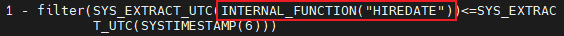

   hiredate >= systimestamp写法，会将date类型字段hiredate用内部函数INTERNAL_FUNCTION("HIREDATE")转换为timestamp类型，导致索引无法使用。

   解决办法是只能修改代码，将变量类型timestamp转换为date。或者直接改表结构，把字段类型改为timestamp。

**七、绑定变量窥视和自适应游标（ACS）**

需要强调的是，ACS是对直方图强依赖的，也就是说一定要有非常准确的统计信息和柱状图，ACS才能正常运作。

当在分布不均的字段上使用绑定变量，第一次执行sql，硬解析时，变量窥视检测到适合走全表扫描，因此第一次硬解析走了全表扫描。当后续再执行sql，变量窥视检测到适合走索引扫描，会有以下几种不同情况：

为什么后面会和第一次的执行计划不一样，因为第一次硬解析的变量可能基数较大，适合走全表；而后面再次执行时的变量基数少，适合走索引。

11g及以下的版本：

1. 10g及以下的版本，如果硬解析是全表，那么以后会一直全表，直到下次硬解析，再窥视绑定变量，制定新的执行计划（可能会走索引，也有可能再次走全表，取决于变量在表中的基数）。

11g及以上的版本：

1. 如果关闭了自适应游标ACS，那么结果和上述情况1一样。

2. 如果开启了自适应游标ACS，当窥视到变量适合走索引扫描时，会再走一次全表扫描，第二次执行时执行计划才会从新生成，变成走索引扫描的执行计划。

3. 如果想让绑定变量在适合走索引时，第一次就从新生成走索引扫描的执行计划，可以使用hint：bind_aware。

总的来说，10g及以前的版本没有办法应对，建议升级到11g及以上的版本。对于11g及以上的版本，不建议关闭自适应游标ACS，对于绑定变量相关的表，记得收集直方图信息。

**八、直方图的局限性**

1. 11g及以下的版本：
   
   直方图只计算字符串的前32位，如果字段存的是URL地址、文件的长绝对路径、系统生成的uuid等字符串，前面32位都相同，即便后面的值各不相同，也会被认为是同一个值，导致优化器不会使用字段上的索引（不过URL地址、文件路径也一般不会作为索引列，但是uuid是十分有可能的）。
   
   解决办法，一是用hint强制使用索引。

   或者清除该字段上的直方图信息：

   ```sql
   --不收集&col_name字段上的直方图信息(其他字段已有的直方图信息不受影响）
   exec dbms_stats.set_table_prefs('&owner','&tab_name','method_opt','for columns &col_name size 1');

   --再一次收集统计信息，清除&col_name字段上的直方图信息（模拟自动收集任务）
   exec dbms_stats.gather_table_stats('&owner','&table_name');
   ```

2. 12c及以上的版本：
   
   varchar2字符串，直方图信息扩展到可以识别字符串的前64位，如果字段的前面64位都是相同的，一般不会自动收集该字段直方图信息，不影响索引的正常选择使用。如果强制收集了直方图信息，也会导致索引无法被使用。应对方法与11版本相同。

**九、SQL写法导致**

emp表sal字段有索引，下面两个sql做聚合查询，走sal上的索引：

```sql
select min(sal) from emp;
select max(sal) from emp;
```

但是，如果同时查询，那么走的是全表扫描：
```sql
select min(sal),max(sal) from emp;
```

解决办法是，使用标量子查询：

```sql
select (select min(sal) from emp) sal_min,(select max(sal) from emp) sal_max from dual;
```

**十、谓词条件使用了or**

```sql
select * from t1 where object_id='1' or object_name='A'；
```

id字段上都有索引，选择性也不错，但是用or写法id字段的索引并未被使用。

解决办法是再独自创建name字段上的索引。

**十一、基于函数的索引函数的参数使用了常量，但sql使用绑定变量**

表上创建了类似如下的索引：

```sql
create index idx2 on t1(substr(object_name,1,10));
```

但是sql中函数索引的参数使用了绑定变量：

```sql
select * from t1 where substr(object_name,1,:b1)=:b2;
```

这样的写法是无法使用索引的。解决办法是把绑定变量换为函数索引中的常量。在实际应用中，估计也没人会写这样的sql，除非脑子进水了。

**十二、组合索引，但是先导列未使用**

t1表存在两字段复合索引：(**object_id**,object_type)，且object_id唯一值个数多，选择性好。

sql如下：
```sql
sql: select * from t1 where object_type='TABLE';
```

引导列object_id没有用到，这种写法索引不会被使用，如果hint强制使用索引，性能反而更低。

如果引导列额唯一值个数少，选择性差，这种情况是会使用索引跳跃扫描，比全秒扫描稍微好点。

解决办法是单独创建object_type字段上的索引。

**十三、谓词条件使用了`not in`、`<>`,`!=`,`not like`等写法**

sql如下：

```sql
select * from emp1 where ename not like 'KING%';
```

类似以上sql，在oracle中是无法使用索引的。解决办法是，创建基于函数的索引，再把不等值连接改为等值连接。

**这么做有个前提，就是以上写法的过滤性好，能过滤掉大部分的记录。**

```sql
--创建索引
create index idx_emp1_king on emp1(decode(substr(ename,1,4),'KING','king',null,'null','other'));

--sql改写为
select * from emp1 where decode(substr(ename,1,4),'KING','king',null,'null','other') = 'other';
```

这是not like的改写，是这几个中最复杂的。其他改写类似，可以省略substr。

**十四、使用了sql profile**


**十五、使用了sql plan baseline**

**十六、使用了sql patch**

## 3.7 降序索引

除非必要，不要创建desc降序索引。普通索引可能适用多个SQL，降序索引的适用范围比较窄，而且还有一些bug，为了避免多余的索引和bug，不建议创建全是desc 降序索引。

如果order by的一个或字段都是降序排序，不需要建降序索引，建普通索引就好。

如果order by的多个字段既有升序又有降序，这种情况才需要创建降序索引。

## 3.8 not in和not exists

所以推荐使用not exists，不要使用not in，除非你的业务就需要not in实现的特殊要求。

# 4 执行计划

### 4.1 SQL执行计划突然变差处理

在生产环境中，有时会遇到执行计划突然变差。

例如，我在工作中遇到过这种情况，每到月初，数仓的某个超级大的按月分区表（5TB），执行计划由hash join变成nested loop，导致模型跑不动，原因是以前全表收集过统计信息，由于未来的月份分区没用数据，所以统计信息的NUM_ROWS=0。而月初有大量数据涌入新的分区，而统计信息却未收集，所以优化器就误判了，还以为新的分区记录数还是零，实际上数据量已经不少了。

这个时候，我的处理办法是，把新的分区统计信息重新收集一遍，再断点续跑模型。由于我的环境是数仓，实效性没那么强。

对于其他环境，可能存在以下问题：

1. 如果是大表，收集统计信息的时间会比较长，而且执行计划变差一般伴随着系统CPU利用率和IO繁忙，因此统计信息收集的时间可能更长。

2. 有些DBA在收集统计信息时，没有使用no_invalidate => false选项，即使收集了统计信息，执行计划却没有立即改变。因为该参数的默认值是AUTO_INVALIDATE，优化器会选择5个小时内的某个时间点来对SQL重新做硬解析。因为不了解这个参数，有人还会在收集完统计信息后flush shared_pool来强制对所有SQL做硬解析。

3. 有些SQL执行计划改变跟统计信息是没有关系的，即便重新收集了统计信息，执行计划也无法恢复正常。

因此，遇到执行计划变差，立刻收集统计信息并不是一个良策，推荐的办法是，先用`SQL profile`固定执行计划为好的执行计划，先让业务恢复正常，再慢慢排查执行计划变差的原因。

SQL profile固定执行计划有两种方式，手动或者自动。推荐用自动，因为手动比较麻烦，而且容易出错。

自动SQL profile的步骤如下：

1. 用dba权限的用户登录sqlplus（Oracle 10g以上，system用户，不能是sys用户）；
2. 执行脚本 coe_load_sql_profile.sql；
3. 输入第一个参数：需要恢复执行计划的sql_id；
4. 输入第二个参数：同上sql_id；
5. 输入第二个参数：好的执行计划的plan_hash_value；
6. 输入密码，导出SQL profile信息到一个表中。

手动SQL profile参考：[SQL-profile.md](../SQL-profile/SQL-profile.md)

## 4.2 系统迁移导致SQL性能下降

当新系统sql性能下降严重影响业务时，可以在老系统使用coe_xfr_sql_profile.sql脚本将好的执行计划导出（生成sql脚本），然后在新系统执行sql，恢复为好的执行计划。

然后再慢慢分析问题。

很大原因时因为版本问题，或者补丁不一致。系统迁移，不光数据库的大版本要相同，patch也要保持一致。

## 4.3 直方图的限制

对于某些特殊的长字段，例如URL地址、文件的长绝对路径、系统生成的uuid等字符串等，选择性一般挺不错的，但是创建索引缺不起作用。原因如下：

11g及以下的版本，直方图只计算字符串的前32位，如果字段存的是，前面32位都相同，即便后面的值各不相同，也会被认为是同一个值，导致优化器不会使用字段上的索引（不过URL地址、文件路径也一般不会作为索引列，但是uuid是十分有可能的）。

12c及以上的版本，varchar2字符串，直方图信息扩展到可以识别字符串的前64位，如果字段的前面64位都是相同的，一般不会自动收集该字段直方图信息，不影响索引的正常选择使用。如果强制收集了直方图信息，也会导致索引无法被使用。应对方法与11版本相同。

假设我们的数据库版本是11g及以下的版本，直方图只取varchar2字段的前32位，如果完整路径的文件名前面32位是相同的，那么优化器将认为这个字段的NDV只有一个（虽然字段的NUM_DISTINCT可能接近NUM_ROWS，具体表现为**dba_tab_col_statistics 视图的low_value和high_value是相同的**，dba_histograms只有两条记录），就会**错误的使用全表扫描的执行计划**。

初次收集统计信息，HISTOGRAM=NONE，表的字段是没有直方图信息的。当执行过一遍后，如果method_opt= size auto，系统会自动为用过的字段收集直方图信息。

```sql
create table demo2(col1 varchar2(70));
insert into demo2 values('1111111111111111111111111111111111');
insert into demo2 values('1111111111111111111111111111111122');
insert into demo2 values('1111111111111111111111111111111123');
insert into demo2 values('1111111111111111111111111111111124');
insert into demo2 values('1111111111111111111111111111111125');
insert into demo2 values('1111111111111111111111111111111126');
insert into demo2 values('1111111111111111111111111111111127');
insert into demo2 values('1111111111111111111111111111111128');
insert into demo2 values('1111111111111111111111111111111129');
insert into demo2 values('1111111111111111111111111111111139');
commit;
SYS@XE()> create index idx_demo2_col1 on demo2(col1);
索引已创建。

--收集统计信息
SYS@XE()> exec dbms_stats.gather_table_stats('sys','demo2');
PL/SQL 过程已成功完成。

SYS@XE()> col METHOD_OPT for a40
SYS@XE()> select dbms_stats.get_prefs('METHOD_OPT','sys','demo2') method_opt from dual;

METHOD_OPT
----------------------------------------
FOR ALL COLUMNS SIZE AUTO

SYS@XE()> select table_name,column_name,histogram from dba_tab_col_statistics where table_name='DEMO2' and owner = 'SYS';

TABLE_NAME COLUMN_NAME                                                  HISTOGRAM
---------- ------------------------------------------------------------ ------------------------------
DEMO2      COL1                                                         NONE

SYS@XE()> col COLUMN_NAME for a30
SYS@XE()> col LOW_VALUE for a40
SYS@XE()> col high_VALUE for a40
SYS@XE()> select table_name,COLUMN_NAME,low_value,high_value from dba_tab_col_statistics where owner = 'SYS' and table_name = 'DEMO2';

TABLE_NAME COLUMN_NAME                    LOW_VALUE                                HIGH_VALUE
---------- ------------------------------ ---------------------------------------- ----------------------------------------
DEMO2      COL1                           3131313131313131313131313131313131313131 3131313131313131313131313131313131313131
                                          313131313131313131313131                 313131313131313131313131

```

初次执行sql：

```sql
SYS@XE()> select * from demo2 where col1 = '1111111111111111111111111111111139';

COL1
--------------------------------------------------------------------------------------------------------------------------------------------
1111111111111111111111111111111139

SYS@XE()> select * from table(dbms_xplan.display_cursor());

PLAN_TABLE_OUTPUT
-------------------------------------------------------------------------------------------------------------------------------------------------------------
-------------------------------------------
SQL_ID  5a72g2uybydwy, child number 0
-------------------------------------
select * from demo2 where col1 = '1111111111111111111111111111111139'

Plan hash value: 3015143637

-----------------------------------------------------------------------------------
| Id  | Operation        | Name           | Rows  | Bytes | Cost (%CPU)| Time     |
-----------------------------------------------------------------------------------
|   0 | SELECT STATEMENT |                |       |       |     1 (100)|          |
|*  1 |  INDEX RANGE SCAN| IDX_DEMO2_COL1 |     1 |    35 |     1   (0)| 00:00:01 |
-----------------------------------------------------------------------------------

Predicate Information (identified by operation id):
---------------------------------------------------

   1 - access("COL1"='1111111111111111111111111111111139')


已选择18行。
```

再次收集统计信息（模拟自动收集字段的直方图）：

```sql
SYS@XE()> exec dbms_stats.gather_table_stats('sys','demo2');

PL/SQL 过程已成功完成。

SYS@XE()> select table_name,column_name,histogram from dba_tab_col_statistics where table_name='DEMO2' and owner = 'SYS';

TABLE_NAME COLUMN_NAME                    HISTOGRAM
---------- ------------------------------ ------------------------------
DEMO2      COL1                           HEIGHT BALANCED
```

因为前面的sql使用了col1字段，所以会为字段收集直方图信息HISTOGRAM不为none。

再次执行sql：

```sql

```


解决办法是，**用hint强制使用索引**:

```sql
select /*+index(t index_name)*/ from tab t;
```

或者**清除该字段上的直方图信息**：

```sql
--不收集&col_name字段上的直方图信息(其他字段已有的直方图信息不受影响）
exec dbms_stats.set_table_prefs('&owner','&tab_name','method_opt','for columns &col_name size 1');

--再一次收集统计信息，清除&col_name字段上的直方图信息（模拟自动收集任务）
exec dbms_stats.gather_table_stats('&owner','&table_name');
```

# 5 HINT

## 5.1 append

append的Hint一般使用在insert select语句，插入大量结果集的时候，采用直接路径（direct path）在表的高水位线以上直接写入数据。在没有commit之前，sql会一直持有表锁。

**这个Hint在数据仓库的SQL中使用较多，一次插入记录几十万以上，执行频率低。**


但是，在OLTP系统中，频繁执行而且插入少量记录的SQL也使用了append的hint，造成的后果就是：

- sql执行效率低，大量的表锁等待，并发越多等待越严重。
- 插入的表TF_B_OCS_BATDEAL，有大量的空间被浪费，每插入一条记录都会占用一个block。而且即使有大量记录被delete，这些高水位线以下的空闲块不会被重新使用。


**解决方法：这种频繁执行，每次插入少量记录的情况，不能使用append，必须马上去掉这个hint**。


补充：并行DML开启时，默认启用append插入模式。

alter session enable parallel dml; --启用并行DML

## 5.2 多表使用use_hash方法

 我们在写多表use_hash(use_nl也一样）hint的时候，use_hash的括号里面是可以放多个表（顺序无关），但是一定要结合leading 的hint，才能保证优化器不使用其他的join方式。 leading里面表的顺序非常关键哦，搞错了会带你去见笛卡尔（cartesian join）。

## 5.3 并行parallel

### 5.3.1 什么时候使用并行？

一、普通SQL最常见的情况就是**大表的全表扫描**，还有就是**大的索引的快速全扫描**（注意，index fast full scan可以使用并行，index full scan 不能使用并行）。

误区：**SQL执行慢就可以通过使用并行或是增加并行来提高速度。**

正解：**并行能否发挥作用要看SQL的具体执行计划。比如标量子查询或是DB link，增大并行带来的性能提升是微乎其微的！**

大表，至少要百万级以上记录的表，如果几亿甚至十几亿记录数的表全表扫描不使用并行，SQL的执行时间会相当长，特别是表在SQL执行的过程中如果还有其他session的DML操作的时候。

OLTP系统的正常事务一般不会使用大表全扫描的执行计划，如果有一些统计分析的业务，建议在系统资源相对空闲的时候开启并行。

二、用create table As Select创建一张大表

```sql
create table test parallel 16 as select .... from t1,t2 where .....;
alter table test noparallel;
```

三、创建或重建索引

```sql
create index idx_test on table_A(col_name) parallel 8;
alter index idx_test noparallel;
```

四、大表收集统计信息

可以设置并行，如degree=>8

五、其他

不常见的操作还有表压缩等，一些比较耗时的分区操作也可以查查语法，看看是否支持并行操作。

### 5.3.2 并行度的选择

一般使用2的幂作为并行度，如2、4、8、16等，正常情况并行度不要设置太高，建议最多不要超过32。当然，特殊情况特殊对待，强悍的系统（比如exadata），如果需要非常高的响应速度，并行度再多个几倍也不是问题。并行高的时候并发就要减少，否则可能会耗光并行资源。

### 5.3.3 并行DML

DML有4种，INSERT、DELETE、UPDATE还有MERGE，如：

insert *+ parallel(4) */ into t1 select .... from ....;

这个写法将会在select部分使用并行度为4的并行，DML部分的并行并没有真正的启用，DML的并行默认是关闭的，如果需要使用，必须在session级别通过下面命令开启：

alter session enable parallel dml;--推荐写法

或者alter session force parallel dml parallel n; --用force的语法，可以使下面的dml即使不用parallel的hint，也会使用并行度为n的并行。

执行这个命令后，才真正开启了DML的并行。

注意：

开启了DML的并行后，接下来的DML语句将会产生一个表锁，在commit之前，当前session 不能对该表做查询和dml操作，其他session也不能对该表做DML操作。

所以建议，并行dml语句，应该在语句执行后立即commit; 然后再关闭并行dml，完整的过程应该是：

```sql
alter session enable parallel dml;

your dml；

commit；

alter session disable parallel dml;
或者
alter session force parallel dml parallel 1;
```

# 6 参数

## 6.1 几个影响数据库性能与稳定的重要参数

**cursor_sharing**：游标共享

**_optim_peek_user_binds**：绑定变量窥视

**_optimizer_adaptive_cursor_sharing**：自适应游标共享（简称ACS）


最佳实践：

cursor_sharing=EXACT + 合理使用绑定变量（合理就是：类似ID、account_no等唯一值等于或接近表行数的字段，必须使用绑定变量；而type、status等唯一值少且数分别不均的字段，不使用绑定变量）。

绑定变量窥视和ACS保持默认开启状态。

特殊情况：

1、字段唯一值有一定的数量（介于少与多之间），比如1000个，如果数据分布均匀，则可以使用绑定变量。如果字段分布不均，则把占比多的几个值，使用常量，其他值使用绑定变量。

2、字段唯一值少，还有经常互相转变的情况，比如常见的工单处理表：没有处理的状态是0，处理后的状态是1，夜间统计信息收集后，由于字段值的不稳定，统计信息经常不能反映表的实时数据分布情况，这种情况谈是否使用绑定变量已没有意义，涉及这类表的SQL，可以关闭字段上的直方图收集，再配合rownum和hint 来提高SQL效率和稳定性，必要时还可以使用dynamic_sampling（动态采样）来辅助优化器做出正确的执行计划。

# 7 工具

# 7.1 sqlhc

sqlhc是SQL health check的简称，能够收集sql相关的表、索引、统计信息、优化器参数、SQL执行情况、等待事件等信息，可以帮你检查SQL存在的问题并优化SQL。sqlhc是一个sql文件，可以直接在sqlplus中执行。

使用sqlhc之前，首先要提供要检查或优化的SQL的sql_id，一般分析性能问题的方式是awr，在awr中可以直接获取到sql_id。

sqlhc使用方法是：

```sql
start sqlhc.sql T sql_id
```

执行完毕后，会在当前目录下生成一个zip文件，包含：

- 1_health_check.html
- 2_diagnostics.html
- 3_execution_plans.html
- 4_sql_detail.html文件
 
如果sql执行时间超过5秒，还有有一个5_sql_monitor.html文件。

重点需要关注1、2、3文件。

# 8 实用技巧

## 8.1 降低SQL的执行频率

在收集的awr报告中，消耗CPU的sql大户经常会发现有收集的时间段内执行次数是几十万次，折算一下一天执行几千万次。

这种sql单次执行问题不大，buffer gets只有几十或者个位数，但是乘以执行次数之后，消耗的cpu就非常厉害了。

至于为什么会执行这么多次，因为使用了循环，并且使用并发，一秒钟可以执行几百次。

所以，在优化sql的基础上，我们应该思考一下，是否这个sql需要这么高的执行频率，业务上的实时性是否可以降低要求。

## 8.2 不改代码解决SQL性能问题的几种方法

### 8.2.1 添加索引


**一、普通索引**

避免全表扫描，性能提升立竿见影。

**二、函数索引**

可以解决字段上使用函数或者运算的问题。也可以解决饮食转换的问题。

### 8.2.2 调整执行计划

使用coe_load_sql_profile.sql脚本固定执行计划。

**一、执行计划有好有差**

使用sql profile或sql plan baseline固定好的执行计划。

**二、执行计划都不好**

需要手工加hint生成好的执行计划,然后再用sql profile或sql plan baseline固定。

### 8.2.3 改为分区表

统计分析类SQL，如果是对一个月的数据做统计分析, 表中有5年的数据量, 分区后, 数据访问量为原来的1/60。

### 8.2.4 改字段类型

主要针对date类型字段, 遇到timestamp类型的变量,做隐式类型转换无法使用索引的情况。

**注意**：这个变更有一定的风险，需要评估影响范围，做好充分的测试。

### 8.2.5 改参数


**注意**：这个变更有一定的风险，需要评估影响范围，做好充分的测试。

# 9 附件

[sql-monitor.sql](./files/sql-monitor.sql)

[demo-211.sql](./files/demo-211.sql)

[demo-2121.sql](./files/demo-2121.sql)

