# 一、行专列和列转行类
1. 请你重构 Products 表，查询每个产品在不同商店的价格，使得输出的格式变为(product_id, store, price) 。如果这一产品在商店里没有出售，则不输出这一行。输出结果表中的 顺序不作要求 。

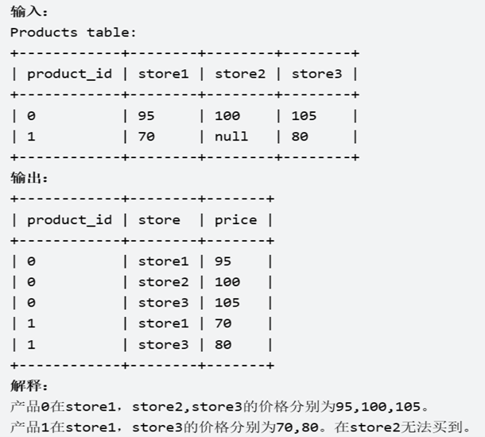

```sql 
select product_id,
       lower(store) store,--store列转小写,实际工作中可不转
       price
from Products unpivot(price for  store in(store1,store2,store3));


select product_id, 'store1' as store, store1 as price from Products where store1 is not null
union all
select product_id, 'store2' as store, store2 as price from Products where store2 is not null
union all
select product_id, 'store3' as store, store3 as price from Products where store3 is not null;
```


# 二、子查询类
1. 写出一个查询语句，找到所有 丢失信息 的雇员id。当满足下面一个条件时，就被认为是雇员的信息丢失：
雇员的 姓名 丢失了，或者 雇员的 薪水信息 丢失了。
返回这些雇员的id  employee_id ，从小到大排序 。

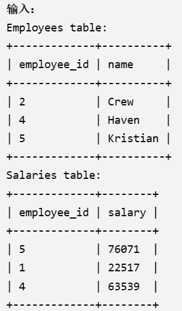 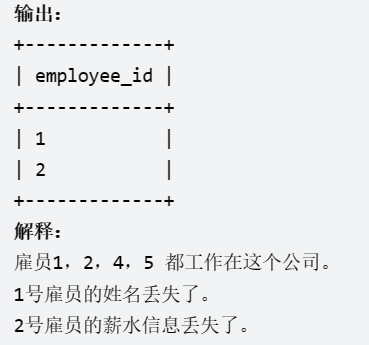

```sql
select employee_id from employees
where employee_id not in (select employee_id from salaries)
union all
select employee_id from salaries
where employee_id not in (select employee_id from employees)
order by employee_id;
```


# 三、递归类
1. 输出所有节点的编号和节点类型，并将结果按照节点编号排序。

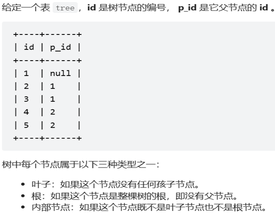 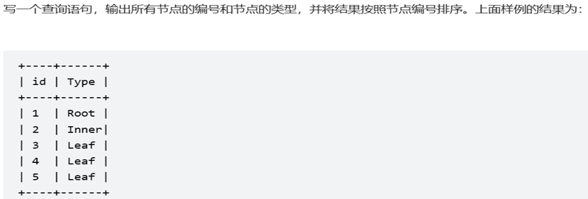

```sql
select id,
       case when p_id is null then 'Root' 
            when id in(select distinct p_id from tree) and p_id is not null then 'Inner'
            when id not in(select nvl(p_id,0) from tree) and p_id is not null then 'Leaf'
       end Type 
from tree;

select id,
case when t.p_id is null then 'Root' 
     when t.id in (select p_id from tree ) then 'Inner'
     else 'Leaf' 
     end as Type
from tree t;
```


# 四、分组类
1. 编写一个 SQL 查询，获取并返回 Employee 表中第二高的薪水 。如果不存在第二高的薪水，查询应该返回 null 。

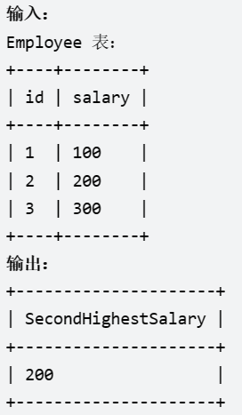

```sql
select t.salary SecondHighestSalary
from (select salary,dense_rank()over(order by salary desc) r from employee) t
where t.r = 2;

select max(t.salary) as secondhighestsalary
from employee t
where t.salary != (select max(salary) from employee);
```

2. 有一些顾客可能光顾了购物中心但没有进行交易。请你编写一个 SQL 查询，来查找这些顾客的 ID ，以及他们只光顾不交易的次数。返回以 任何顺序 排序的结果表。

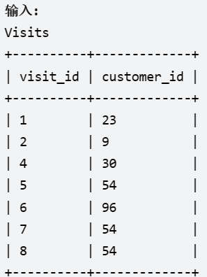 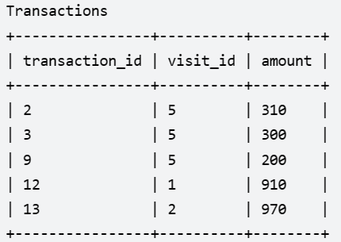 

```sql
select customer_id 
    ,count(visit_id) as count_no_trans
from Visits
where visit_id not in (select visit_id from Transactions )
group by customer_id;
```

3. 写一条 SQL 语句，使得对于每一个 date_id 和 make_name，返回不同的 lead_id 以及不同的 partner_id 的数量。按 任意顺序 返回结果表。

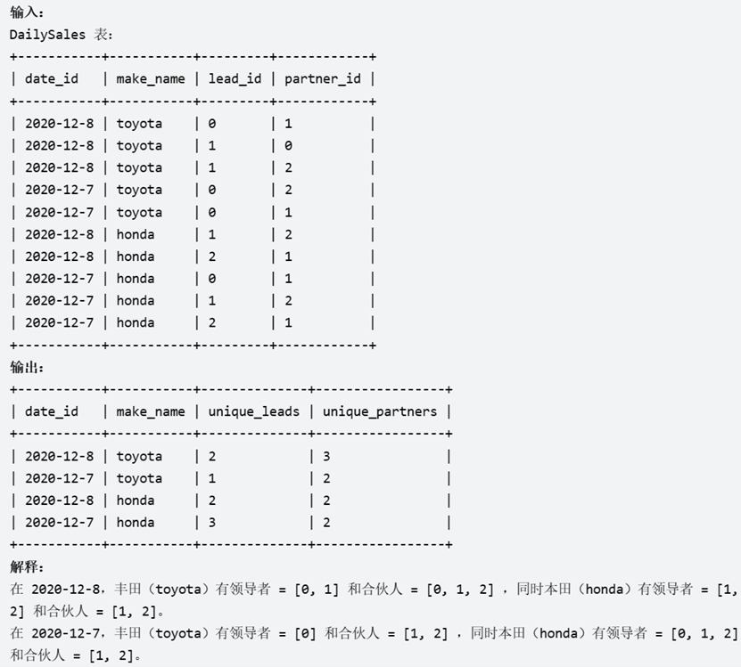

```sql
select to_char(date_id,'yyyy-mm-dd') date_id,
       make_name,
       count(distinct lead_id) unique_leads,
       count(distinct partner_id) unique_partners
from dailysales 
group by date_id,make_name;
```

4. 编写一个SQL查询，为下了`最多订单`的客户查找 customer_number。

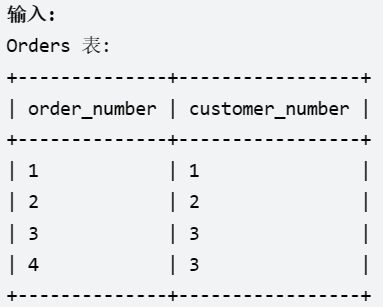 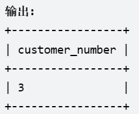

```sql
select customer_number
from(select customer_number,count(1) cc
       from orders
   group by customer_number
   order by cc desc)
where rownum = 1;
```

5. 写一段 SQL 语句查出 "2013-10-01" 至 "2013-10-03" 期间非禁止用户（乘客和司机都必须未被禁止）的取消率。非禁止用户即 banned 为 No 的用户，禁止用户即 banned 为 Yes 的用户。  
返回结果表中的数据可以按任意顺序组织。其中取消率 Cancellation Rate 需要四舍五入保留 两位小数 。  
`取消率 = (被司机或乘客取消的非禁止用户生成的订单数量) / (非禁止用户生成的订单总数)。`

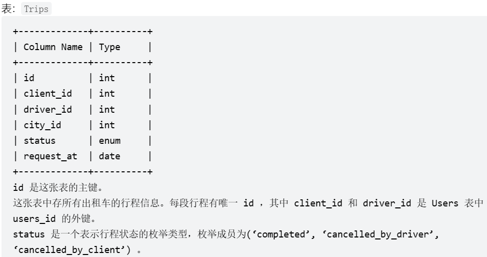 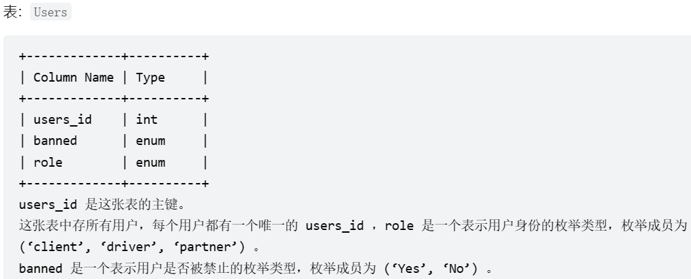

```sql
--Write your MySQL query statement below
SELECT Request_at 'Day', 
       round(avg(Status!='completed'), 2) 'Cancellation Rate'
FROM Trips t 
    JOIN Users u1 ON (t.Client_id = u1.Users_id AND u1.Banned = 'No')
    JOIN Users u2 ON (t.Driver_id = u2.Users_id AND u2.Banned = 'No')
WHERE	
    Request_at BETWEEN '2013-10-01' AND '2013-10-03'
GROUP BY 
    Request_at;

/* Write your PL/SQL query statement below */
SELECT
    Request_at 'Day', 
    round(sum(decode(t.Status,'completed',0,1)) / count(*),2) 'Cancellation Rate'
FROM Trips t 
    JOIN Users u1 ON (t.Client_id = u1.Users_id AND u1.Banned = 'No')
    JOIN Users u2 ON (t.Driver_id = u2.Users_id AND u2.Banned = 'No')
WHERE	
    Request_at BETWEEN '2013-10-01' AND '2013-10-03'
GROUP BY 
    Request_at;
```

6. 编写一个SQL查询，报告2019年春季才售出的产品。即仅在2019-01-01至2019-03-31（含）之间出售的商品。以 任意顺序 返回结果表。[leetcode地址](https://leetcode.cn/problems/sales-analysis-iii/)
   
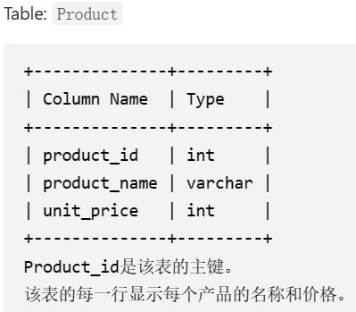 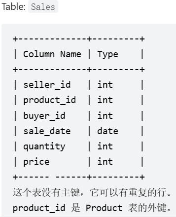

```sql
/* Write your PL/SQL query statement below */
select p.product_id, p.product_name
from Product p , Sales s
where p.product_id = s.product_id 
group by p.product_id,p.product_name
having min(s.sale_date) >= '2019-01-01' and max(s.sale_date) <= '2019-03-31';

 Write your MySQL query statement below
SELECT p.product_id,product_name FROM sales s,product p 
WHERE s.product_id=p.product_id
GROUP BY p.product_id
HAVING SUM(sale_date < '2019-01-01')=0
AND SUM(sale_date>'2019-03-31')=0;
```

7. 请写出一条SQL语句以查询每个用户的注册日期和在 2019 年作为买家的订单总数。以 任意顺序 返回结果表。[leetcode_url](https://leetcode.cn/problems/market-analysis-i/)

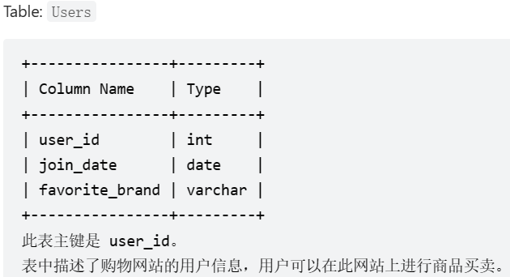 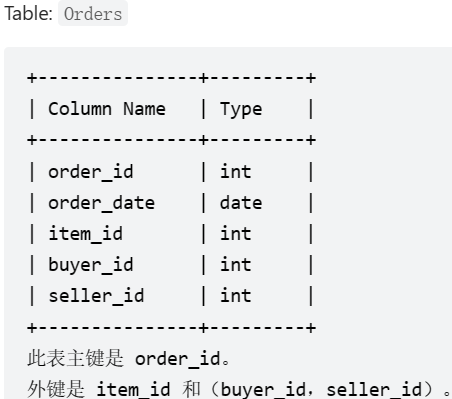 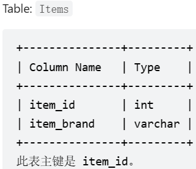

```sql
# Write your MySQL query statement below
select user_id as buyer_id, join_date, count(order_id) as orders_in_2019
from Users as u 
left join Orders as o 
on u.user_id = o.buyer_id 
and year(order_date)='2019'
group by user_id

/* Write your PL/SQL query statement below */
select a.buyer_id,
       to_char(b.join_date,'yyyy-mm-dd') join_date,
       SUM((decode(to_char(a.order_date, 'yyyy'),'2019',1,0)) orders_in_2019
  from Orders a, Users b
 where a.buyer_id = b.user_id
 group by a.buyer_id, b.join_date
 order by a.buyer_id;
```


# 五、环比同比类
1. 编写一个 SQL 查询，来查找与之前（昨天的）日期相比温度更高的所有日期的 id 。返回结果 不要求顺序 。

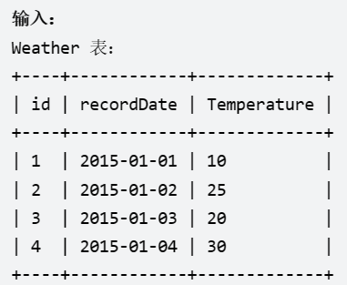 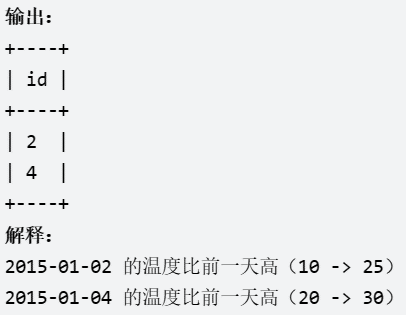

```sql
select r.id from Weather l,Weather r
where l.recordDate = trunc(r.recordDate - 1)
and r.Temperature > l.Temperature;
```


# 六、开窗类
1. 问题1：编写SQL查询以查找每个部门中薪资最高的员工。按 任意顺序 返回结果表。  
问题2：公司的主管们感兴趣的是公司每个部门中谁赚的钱最多。一个部门的 高收入者 是指一个员工的工资在该部门的 不同 工资中 排名前三 。

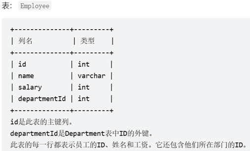 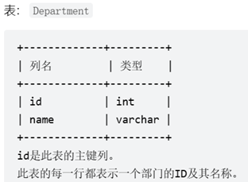

```sql
--问题1：
select t.dname Department,
       t.ename Employee,
       t.salary
from (select e.id,e.name ename,e.salary,
             e.departmentid,d.name dname,
             rank()over(partition by e.departmentid order by salary desc) rank
      from employee e,department d
      where e.departmentid = d.id) t
where t.rank = 1;

--问题2：
select t.Department,t.Employee,t.salary
from (select d.name Department,e.name Employee,e.salary,dense_rank()over(partition by d.id order by e.salary desc) r
        from Employee e,Department d
        where e.Departmentid = d.id) t
where t.r <= 3;
```

# 七、连续（日期）类
7.1. 编写一个 SQL 查询，查找所有至少连续出现三次的数字。返回的结果表中的数据可以按 任意顺序 排列。

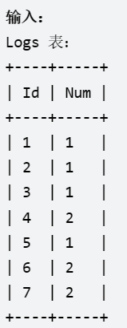 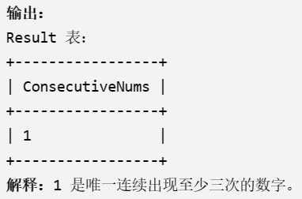

```sql
select distinct t.num as ConsecutiveNums
from (select num, 
             id - row_number()over(partition by num order by id) as rk
        from logs) t
group by t.num, t.rk
having count(*) >= 3;
```

其他方法：
```sql
--偏移函数

select distinct num as "ConsecutiveNums"
from (
    select num, lag(num,1) over(order by id) as lag, lead(num,1) over(order by id) as lead
    from logs) tmp
where num = lag and num = lead;

--自连接
select distinct l1.num
  from logs l1, logs l2, logs l3
 where l1.id + 1 = l2.id
   and l2.id + 1 = l3.id
   and l1.num = l2.num
   and l2.num = l3.num;
```

7.2. 编写一个 SQL 查询以找出每行的人数大于或等于 100 且 id 连续的三行或更多行记录。返回按 visit_date 升序排列 的结果表。
[leetcode地址](https://leetcode.cn/problems/human-traffic-of-stadium/)
   
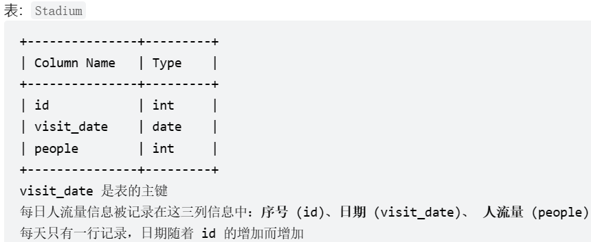

```sql
# Write your MySQL query statement below
with rk_tab as
(select visit_date,
             people,
                 id,
                 id - row_number()over(order by id) rk
        from Stadium 
        where people >= 100)

select id,visit_date,people
from  rk_tab
where rk in (select rk 
             from rk_tab
             group by rk
             having count(1) >= 3);
```

7.3 编写SQL查询来交换每两个连续的学生的座位号。如果学生的数量是奇数，则最后一个学生的id不交换。按 id 升序 返回结果表。

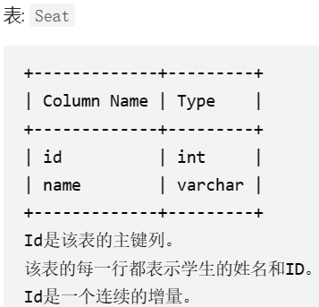

```sql
/* Write your PL/SQL query statement below */
SELECT (CASE 
            WHEN MOD(id,2) = 1 AND id = (SELECT COUNT(*) FROM seat) THEN id
            WHEN MOD(id,2) = 1 THEN id+1
            ElSE id-1
        END) AS id, student
FROM seat
ORDER BY id;
```
