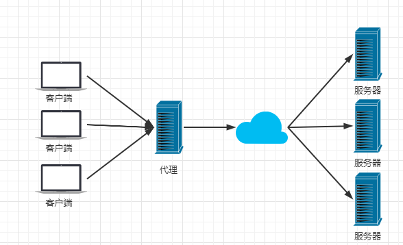
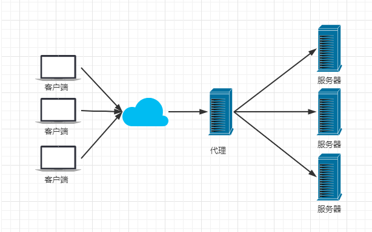
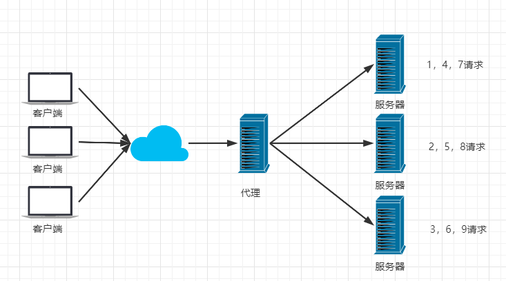
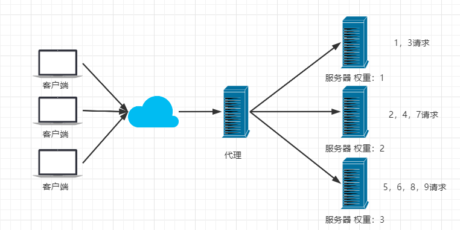

**目录**

[toc]

# 自我介绍

面试官你好，我叫陆培毅，目前在税友软件担任浙江一线数据库运维。
入职以来参加过三个项目，主要是做数据库和数据实施。近一年的工作，主要负责浙江金四全电票项目的数据支撑平台的数据库实施和运维工作，全程参与部署，上线和维护。

在项目中，我负责的部分有数据库管理，etl维护，一小部分的数据开发和业务运维。

数据库管理上，我负责维护oracle库和mysql库。

我比较熟悉的数据库是mysql，平时的工作主要是包括性能监控，安全管理，空间管理，备份恢复、性能调优和故障处理。

数据运维上，主要负责etl调度维护，对业务比较熟悉，有一定的数据开发的经验。

# 离职原因

1、寻求更好的职业发展机会，现在的工作相对比较杂，既要做数据库管理，也要做数据开发、业务运维等，我想专门深耕数据库管理这个方向；
2、组织结构不适应，我的同事年龄都比我大十岁，感觉有点代沟，并且缺少激情，还是希望加入到更加年轻的团队；
3、寻求更高的薪资，我司的涨薪制度比较严格，且名额少，竞争激烈，新员工机会不多；
4、家庭原因，目前的工作地离家比较远，家人比较反对，所以希望找个家附近的工作。

# 1 Oracle
## 1.1 后台进程

**一、SMON (System Monitor)**

负责系统恢复，如修复破碎的临时段。还会删除临时段。

SMON的含义为System Monitor，可理解为系统监视器。与PMON不同的是，SMON关注的是系统级的操作而非单个进程，工作重点在于实例恢复，除此之外还有清理临时表空间、清理回滚段表空间、合并空闲空间等功能。

**二、PMON (Process Monitor)**

当用户进程异常终止时，清理并释放其使用的资源。

PMON的含义为Processes Monitor，是进程监视器。如果你在执行某些更新语句，未提交时进程崩溃了，这时候PMON会自动回滚该操作，无须人工去执行ROLLBACK命令。除此之外它还可以干预后台进程，比如RECO出现异常失败了，此时PMON会重启RECO进程，如果遇到LGWR进程失败这样的严重问题，PMON会做出中止实例这个激烈的动作，用于防止数据错乱。

**三、DBWn (Database Writer)**

将数据缓冲区中的更改写入磁盘上的数据文件。DBWR 是 Oracle 最核心的进程之一。

进行更新操作时（添加、修改、删除），在数据缓存区内修改完数据后，会启用DBWR进程，将更新的数据从数据缓存区内刷入到数据文件中，即内存刷入到磁盘，因为磁盘才是真正存储数据的地方，否者一断电，在内存中的数据就会消失。

总之，DBWR是Oracle最核心的进程之一，负责把数据从数据缓存区写到磁盘里，该进程和CKPT相辅相成，因为是CKPT促成DBWR去写的（不是commit决定）。不过DBWR也和LGWR密切相关，因为DBWR 想将数据缓存区中的数据写到磁盘的时候，必须通知LGWR 先完成日志缓存区写到磁盘的动作后，方可开工。

**四、LGWR (Log Writer)**

将重做日志缓冲区的内容写入到磁盘上的重做日志文件。

完成创建数据库对象、更新数据等操作过程的记录。这个REDO的记录非同小可，可以用来做数据库的异常恢复，只要保护好了这些REDO 文件和后续对应的归档文件，从理论上来说，即使数据文件被删除了，也可以让数据库根据这些日志记录，把所有的在数据库中曾经发生的事情全部重做一遍，从而保证数据库的安全。

**五、ARCH (Archiver)**

将已满的重做日志文件归档。

LGWR进程是写日志的过程是这样的，一开始写日志文件1，写满后切换到日志文件2继续写，日志文件2写满后写3，3写满后写4，当4也写满后，再返回去写1。但是在1被覆盖重写前，需要先备份出去。

ARCH的作用是在LGWR写日志写到需要被覆盖重写的时候，触发ARCH进程去转移日志文件，将日志文件复制出去形成归档日志文件，以免日志丢失。即日志文件1在被重写时先备份出去的文件，命名为归档文件，接下来再到2、3、4，我们就可以依此类推了。此外，这些ARCH文件也需要定时转移到新的存储介质中，这个存储介质里的ARCH就是将来数据库故障恢复时的法宝了。

**六、RECO (Recoverer)**

在分布式数据库环境中，负责解决不同节点之间的数据冲突。

**七、CKPT（Checkpoint）**

什么时候将数据缓存区中的数据写到磁盘的动作正是由进程CKPT来触发的，CKPT触发DBWR从数据缓存区中写出数据到磁盘。

这是一个相当重要的进程，我们可以通过设置某参数来控制CKPT的触发时间，比如万一出现数据库崩溃，希望Oracle的SMON最多用多长时间来做实例恢复，该参数就是FAST_START_MTTR_TARGET，通过调整该参数，Oracle会调配CKPT在适当的时候去调用DBWR。当然，这个参数也并非越小越好，太小的数值会导致Oracle性能降低。CKPT执行得越频繁，DBWR写出就越频繁，DBWR写出越频繁越不能显示批量特性，性能就越低，但是数据库异常恢复的时间会越短。

一个值得思考的问题是，更新语句执行完毕后，如果一直不提交，最终会从数据缓存区刷进磁盘吗？
答案是肯定的，因为DBWR将数据缓存区中的数据写到磁盘，不是由COMMIT决定的，而是由CKPT进程决定的。

此外，在CKPT的触发或者说命令下，DBWR将数据缓存区中的数据写到磁盘，但是如果LGWR进程出现故障了，DBWR此时还是会不听CKPT的命令罢工的，因为 Oracle 在将数据缓存区中的数据写到磁盘前，会先进行日志缓存区写进日志文件的操作，并耐心地等待其先完成，才会去完成这个‘内存刷到磁盘’的动作，这就是所谓的凡事有记录。

**八、LCKn**

仅用于RAC数据库，最多可有10个进程（LCK0,LCK1,…,LCK9），用于实例间的封锁。

## 1.2 rac搭建

RAC，全称 real application clusters，译为“实时应用集群”，是 Oracle 是高可用性的一种，RAC 采用了 Cache Fusion(高速缓存合并)技术。也是 Oracle 数据库支持网格计算环境的核心技术。

Oracle RAC 主要可以支持 24 x 7 数据库应用系统，在低成本服务器上构建高可用性数据库系统，并且自由部署应用，无需修改应用代码。在 Oracle RAC环境下，Oracle 集成提供了集群软件和存储管理软件（ASM），为用户降低了应用成本。当应用规模需要扩充时，用户可以按需扩展系统，以保证系统的性能。

在一个应用环境当中，所有的服务器使用和管理同一个数据库，目的是为了分散每一台服务器的工作量，硬件上至少需要两台以上的服务器，而且还需要一个共享存储设备。同时还需要两类软件，一个是集群软件，另外一个就是Oracle 数据库中的 RAC 组件。同时所有服务器上的 OS 都应该是同一类 OS,根据负载均衡的配置策略，当一个客户端发送请求到某一台服务的 listener 后，这台服务器根据我们的负载均衡策略，会把请求发送给本机的 RAC 组件处理也
可能会发送给另外一台服务器的 RAC 组件处理，处理完请求后，RAC 会通过集群软件来访问我们的共享存储设备。

逻辑结构上看，每一个参加集群的节点有一个独立的 instance（数据库实例），这些 instance 访问同一个数据库。节点之间通过集群软件的通讯层（communication layer）来进行通讯。同时为了减少 IO 的消耗，存在一个
全局缓存服务，因此每一个数据库的 instance，都保留了一份相同的数据库：

RAC 的特点:

- 每一个节点的 instance 都有自己的 SGA
- 每一个节点的 instance 都有自己的 background process
- 每一个节点的 instance 都有自己的 redo logs
- 每一个节点的 instance 都有自己的 undo 表空间
- 所有节点都共享一份 datafiles 和 controlfiles

RAC 的优点:

- 多节点负载均衡;
- 提供高可用：故障容错和无缝切换功能，将硬件和软件错误造成的影响最小化;
- 通过并行执行技术提高事务响应时间，通常用于数据分析系统;
- 通过横向扩展提高每秒交易数和连接数，通常对于联机事务系统;
- 节约硬件成本，可以用多个廉价 PC 服务器代替昂贵的小型机或大型机，同时节约相应维护成本;
- 可扩展性好，可以方便添加删除节点，扩展硬件资源。

**一、系统要求**

Linux 7的内核版本需要大于等于Red Hat Enterprise Linux 7.5: 3.10.0-862.11.6.el7.x86_64。

**二、网卡**

配置两张网卡

**三、hosts**

public ip、private ip、virtual ip、scan

**四、内存**

Oracle Grid Infrastructure安装的至少8GB。

**五、swap**

内存在4GB到16GB之间：等于RAM

内存大于16GB：16GB

**六、共享内存段 /dev/shm/**

共享内存段至少要大于MEMORY_MAX_TARGET and MEMORY_TARGET。

**七、禁用透明大页**

**八、关闭防火墙**

**九、关闭selinux**

**十、配置YUM源**

**十一、设置时区和事件同步**

**十二、停止 avahi-daemon 服务**

**十三、修改20-nproc.conf**

**十四、修改limits.conf**

## 1.3 dg有没有搭建过了解过

有个库突然坏了，如何快速做切换，dg就可以。

## 1.4 假如有一个库宕机了，你如何进行应对

## 1.5 经常处理的故障有哪些，ora错误 10046事件

## 1.6 19c新特性

## 1.7 有没有用过多租户

## 1.8 部署的时候做的性能优化：os调参、库调参

## 1.9 oracle监控告警项

# 2 mysql

## 2.1 架构

## 2.2 复制的原理

从库io获取的binlog保存在哪里

## 2.3 mysql监控告警项

# 3 数据库性能优化

## 3.1 做优化的步骤

## 3.2 表连接方式

## 3.3 做优化的流程

# 4 数据库备份怎么做

## 4.1 备份策略

## 4.2 实时备份

# 5 故障处理

## 5.1 os层

## 5.2 oracle故障处理

## 5.3 mysql故障处理

# 6 redis(nosql)

缓存

# 7 nginx

## 7.1 nginx介绍

Nginx (engine x) 是一个**高性能的HTTP和反向代理web服务器**，同时也提供了IMAP/POP3/SMTP（电子邮件）服务。Nginx是由伊戈尔·赛索耶夫为俄罗斯访问量第二的Rambler.ru站点（俄文：Рамблер）开发的，第一个公开版本0.1.0发布于2004年10月4日。2011年6月1日，nginx 1.0.4发布。

其特点是**占有内存少，并发能力强，易于开发，部署方便，事实上nginx的并发能力在同类型的网页服务器中表现较好的**，中国大陆使用nginx网站用户有：百度、京东、新浪、网易、腾讯、淘宝等。在全球活跃的网站中有12.18%的使用比率，大约为2220万个网站。

## 7.2 nginx作用

Http代理，反向代理：作为web服务器最常用的功能之一，尤其是**反向代理**。

**一、正向代理（本地安装，代理客户端）**

通过代理服务器来访问服务器的过程。例如VPN。

**二、反向代理（代理服务器端，客户端无感知）**

客户端将请求发送到反向代理服务器，由反向代理服务器去选择目标服务器获取数据后，再返回给客户端。例如访问百度。

**三、负载均衡**

增加服务器的数量，将原先请求集中到单个服务器上的情况改为将请求分发到多个服务器上，将负载分发到不同的服务器。

Nginx提供的负载均衡策略有2种：内置策略和扩展策略。内置策略为轮询，加权轮询，Ip hash。扩展策略，就天马行空，只有你想不到的没有他做不到的。

轮询：

加权轮询：

## 7.3 Apache​、Nginx 和tomcat 区别

**一、nginx**  

负载均衡、反向代理、处理静态文件优势,这也就是为啥java服务器Tomcat前面先要经过Nginx服务器处理一波，（只转发请求，不做其他操作，可以看下上面的反向代理的解释），Nginx并发性比较好，CPU内存占用低。

**二、Apache** 

相对于Tomcat服务器来说处理静态文件是它的优势，速度快。支持模块多，性能稳定。Apache是静态解析，适合静态HTML、图片，当然读写能力比较强，如果rewrite（读写）频繁，那还是Apache较适合，比较稳定，处理动态有优势。前提是没有Tomcat,也就是说不是java服务端。

**三、Tomcat**

动态解析容器，处理动态请求，是编译JSP、Servlet的容器，Nginx有动态分离机制，静态请求直接就可以通过Nginx处理，动态请求才转发请求到后台交由Tomcat进行处理。**tomcat更多用来做一个应用容器**。

**四、总结**

静态处理能力：Nginx(至少是Apache3倍)＞Apache＞Tomcat

nginx处理静态文件好，耗费内存少；

动态请求由apache去做，nginx比较适合做静态和反向代理；

Nginx适合做前端服务器，负载性能很好;

Nginx本身就是一个反向代理服务器 ，且支持负载均衡；

# 8 tomcat

# 9 监控

## 9.1 zabbix

[Zabbix](http://t.csdnimg.cn/Z46Oe)

## 9.2 pmp

[PMM](http://t.csdnimg.cn/59zP5)

# 10 网络

## 10.1 tcp/ip

## 10.2 网络问题