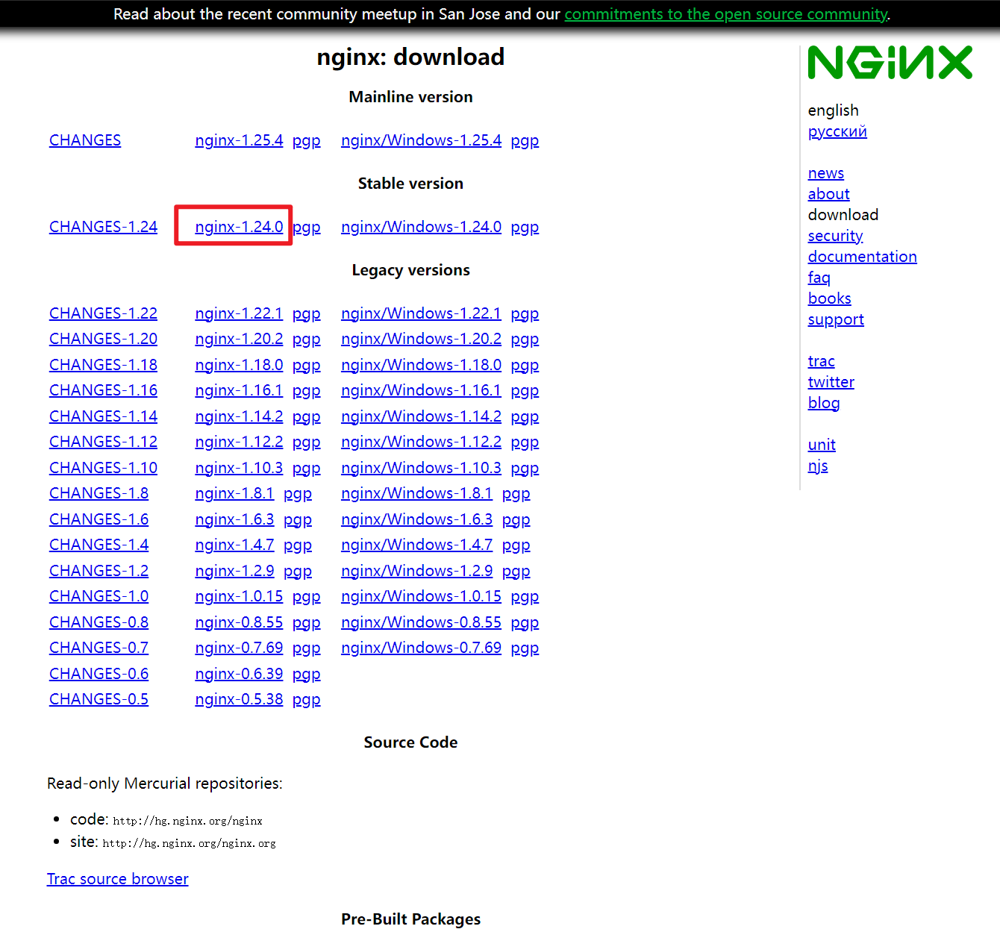

## 安装

安装gcc

安装 nginx 需要先将官网下载的源码进行编译，编译依赖 gcc 环境，如果没有 gcc 环境，则需要安装：

yum install gcc-c++
2、PCRE pcre-devel 安装

PCRE(Perl Compatible Regular Expressions) 是一个Perl库，包括 perl 兼容的正则表达式库。nginx 的 http 模块使用 pcre 来解析正则表达式，所以需要在 linux 上安装 pcre 库，pcre-devel 是使用 pcre 开发的一个二次开发库。nginx也需要此库。命令：

yum install -y pcre pcre-devel
3、zlib 安装

zlib 库提供了很多种压缩和解压缩的方式， nginx 使用 zlib 对 http 包的内容进行 gzip ，所以需要在 Centos 上安装 zlib 库。

yum install -y zlib zlib-devel
4、OpenSSL 安装
OpenSSL 是一个强大的安全套接字层密码库，囊括主要的密码算法、常用的密钥和证书封装管理功能及 SSL 协议，并提供丰富的应用程序供测试或其它目的使用。
nginx 不仅支持 http 协议，还支持 https（即在ssl协议上传输http），所以需要在 Centos 安装 OpenSSL 库。

yum install -y openssl openssl-devel
5、下载安装包

https://nginx.org/en/download.html

cd /usr/local/

tar -xvf nginx-1.24.0.tar.gz

cd nginx-1.24.0

./configure

make

make install

6.常用命令

cd /usr/local/nginx/sbin/
./nginx  启动
./nginx -s stop  停止
./nginx -s quit  安全退出
./nginx -s reload  重新加载配置文件
ps aux|grep nginx  查看nginx进程