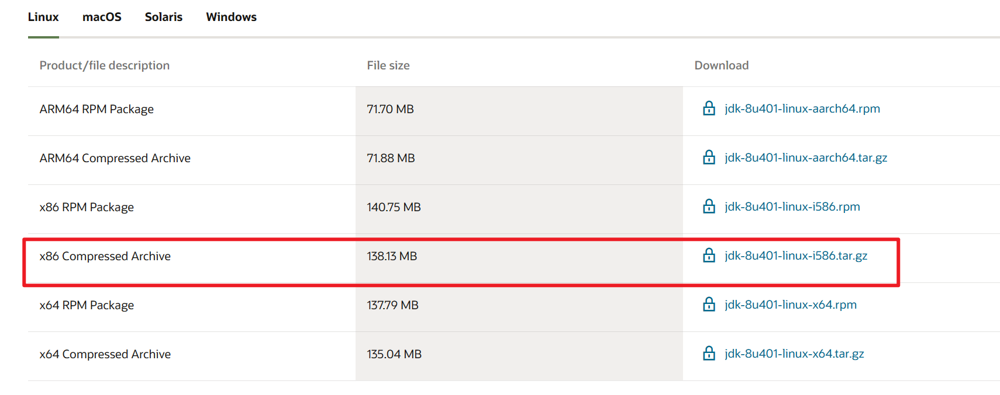
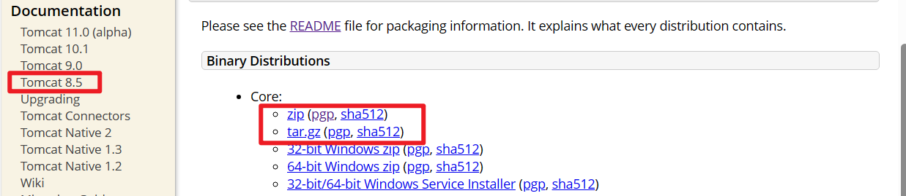
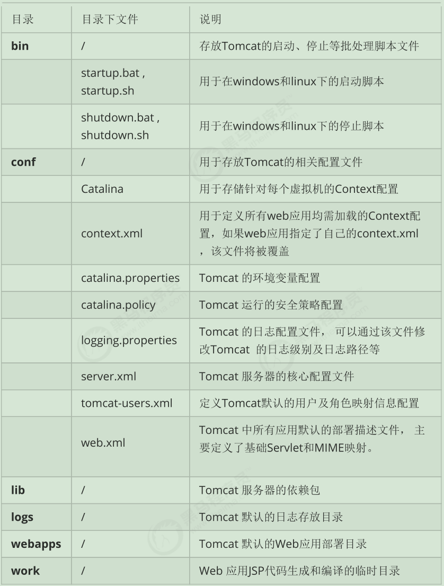
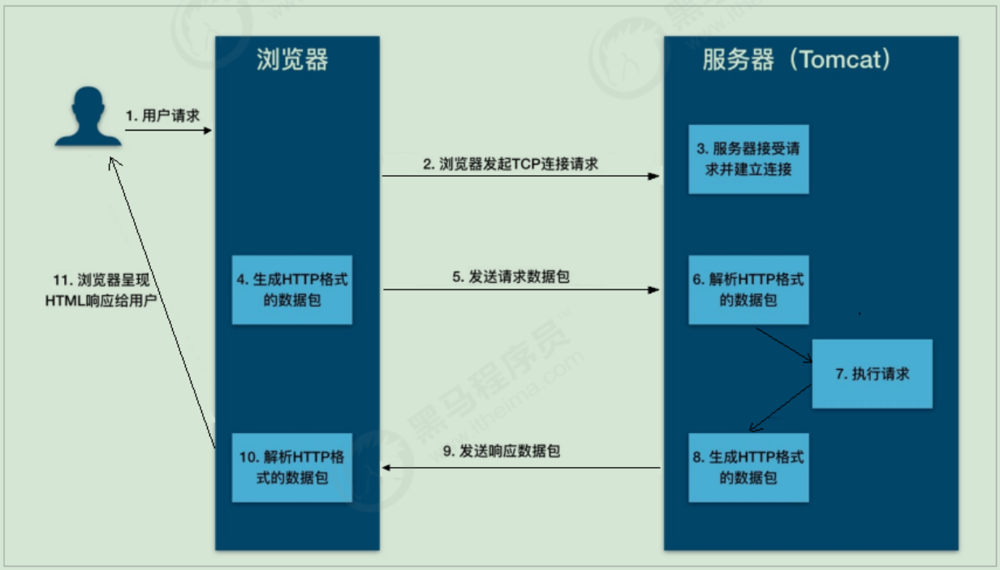
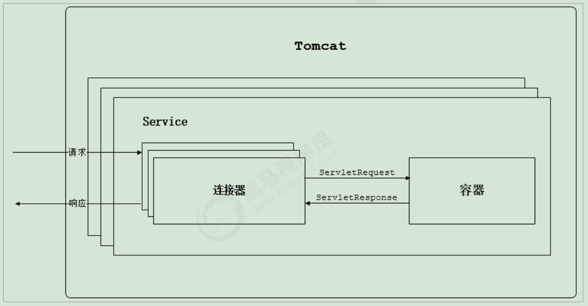

**目录**

[toc]

# 1 简介

# 2 安装

## 2.1 安装java

tomcat是java开发的，所以要安装java。

**一、安装包下载**

https://www.oracle.com/java/technologies/downloads/



**二、解压**

```bash
[weblogic@zabbix6 install]$ tar -xvf jdk-8u401-linux-i586.tar.gz
```

**三、配置环境变量**

```bash
[root@zabbix6 ~]# vim /etc/profile
#添加
export JAVA_HOME=/servyou/install/jdk1.8.0_401
export PATH=$PATH:$JAVA_HOME/bin

[root@zabbix6 ~]# source /etc/profile
```

**四、检查**

```bash
[root@zabbix6 ~]# java -version
java version "1.8.0_401"
Java(TM) SE Runtime Environment (build 1.8.0_401-b10)
Java HotSpot(TM) Server VM (build 25.401-b10, mixed mode)
```

## 2.2 安装tomcat

**一、安装包下载**

https://tomcat.apache.org/download-80.cgi



**二、解压**

```bash
[weblogic@zabbix6 install]$ tar -xvf apache-tomcat-8.5.99.tar.gz
```

目录结构：

```bash
[weblogic@zabbix6 install]$ tree -L 1 apache-tomcat-8.5.99
.
├── bin
├── BUILDING.txt
├── conf
├── CONTRIBUTING.md
├── lib
├── LICENSE
├── logs
├── NOTICE
├── README.md
├── RELEASE-NOTES
├── RUNNING.txt
├── temp
├── webapps
└── work
```

**三、启动**

```bash
[weblogic@zabbix6 install]$ cd apache-tomcat-8.5.99/bin/
[weblogic@zabbix6 bin]$ ./startup.sh
Using CATALINA_BASE:   /servyou/install/apache-tomcat-8.5.99
Using CATALINA_HOME:   /servyou/install/apache-tomcat-8.5.99
Using CATALINA_TMPDIR: /servyou/install/apache-tomcat-8.5.99/temp
Using JRE_HOME:        /servyou/install/jdk1.8.0_401
Using CLASSPATH:       /servyou/install/apache-tomcat-8.5.99/bin/bootstrap.jar:/serv
Using CATALINA_OPTS:
Tomcat started.
```

## 2.3 配置service系统启动和关闭tomcat

**一、配置启动脚本**

```bash
[root@zabbix6 ~]# cd /etc/init.d/
[root@zabbix6 init.d]# vim tomcat
```

添加：

```bash
#!/bin/bash  
# This is the init script for starting up the  
#  Jakarta Tomcat server  
#  
# chkconfig: 345 91 10  
# description: Starts and stops the Tomcat daemon.  
#  

# Source function library.  
. /etc/rc.d/init.d/functions  

# Get config.  
. /etc/sysconfig/network  

# Check that networking is up.  
[ "${NETWORKING}" = "no" ] && exit 0  

export JAVA_HOME=/servyou/install/jdk1.8.0_401 #自己的jdk安装目录
tomcat_home=/servyou/install/apache-tomcat-8.5.99  #自己的tomcat安装目录
startup=$tomcat_home/bin/startup.sh  
shutdown=$tomcat_home/bin/shutdown.sh  

start(){  
   echo -n "Starting Tomcat service:"  
   cd $tomcat_home  
   $startup  
   echo "tomcat is succeessfully started up"  
}  

stop(){  
   echo -n "Shutting down tomcat: "  
   cd $tomcat_home  
   $shutdown  
   echo "tomcat is succeessfully shut down."  
}  

status(){  
    numproc=`ps -ef | grep catalina | grep -v "grep catalina" | wc -l`  
    if [ $numproc -gt 0 ]; then  
       echo "Tomcat is running..."  
    else  
       echo "Tomcat is stopped..."  
    fi  
}  

restart(){  
   stop  
   start  
}    
# See how we were called.  
case "$1" in  
start)  
   start  
   ;;  
stop)  
   stop  
   ;;  
status)  
   status  
   ;;  
restart)  
   restart  
   ;;  
*)  
   echo $"Usage: $0 {start|stop|status|restart}"  
   exit 1  
esac
```

**二、赋权**

```bash
[root@zabbix6 init.d]# chmod +755 tomcat
```

**三、设置开机自启**

```bash
[root@zabbix6 webapps]# chkconfig --add tomcat
[root@zabbix6 webapps]# chkconfig --list | grep tomcat
tomcat          0:off   1:off   2:off   3:on    4:on    5:on    6:off
```

## 2.4 目录结构



# 3 Tomcat 架构

## 3.1 Http工作原理

HTTP协议是浏览器与服务器之间的数据传送协议。作为应用层协议，HTTP是基于TCP/IP协议来传递数据的（HTML文件、图片、查询结果等），HTTP协议不涉及数据包（Packet）传输，主要规定了客户端和服务器之间的通信格式。



从图上你可以看到，这个过程是：

1. 用户通过浏览器进行了一个操作，比如输入网址并回车，或者是点击链接，接着浏览器获取了这个事件。
2. 浏览器向服务端发出TCP连接请求。
3. 服务程序接受浏览器的连接请求，并经过TCP三次握手建立连接。
4. 浏览器将请求数据打包成一个HTTP协议格式的数据包。
5. 浏览器将该数据包推入网络，数据包经过网络传输，最终达到端服务程序。
6. 服务端程序拿到这个数据包后，同样以HTTP协议格式解包，获取到客户端的意图。
7. 得知客户端意图后进行处理，比如提供静态文件或者调用服务端程序获得动态结果。
8. 服务器将响应结果（可能是HTML或者图片等）按照HTTP协议格式打包。
9. 服务器将响应数据包推入网络，数据包经过网络传输最终达到到浏览器。
10. 浏览器拿到数据包后，以HTTP协议的格式解包，然后解析数据，假设这里的数据是HTML。
11. 浏览器将HTML文件展示在页面上。

**Tomcat作为一个HTTP服务器，在这个过程中完成了：接受连接、解析请求数据、处理请求和发送响应这几个步骤。**

## 3.2 Tomcat整体架构

### 3.2.1 Http服务器请求处理

浏览器发给服务端的是一个HTTP格式的请求，HTTP服务器收到这个请求后，需要调用服务端程序来处理，所谓的服务端程序就是你写的Java类，一般来说不同的请求需要由不同的Java类来处理。

### 3.2.2 Servlet容器工作流程

### 3.2.3 Tomcat 整体架构

我们已经了解了Tomcat要实现两个核心功能：
1. 处理Socket连接，负责网络字节流与Request和Response对象的转化。
2. 加载和管理Servlet，以及具体处理Request请求。

因此Tomcat设计了两个核心组件连接器（Connector）和容器（Container）来分别做这两件事情。连接器负责对外交流，容器负责内部处理。



## 3.3 连接器 - Coyote

### 3.3.1 架构介绍

### 3.3.2 IO 模型与协议

### 3.3.3 连接器组件

