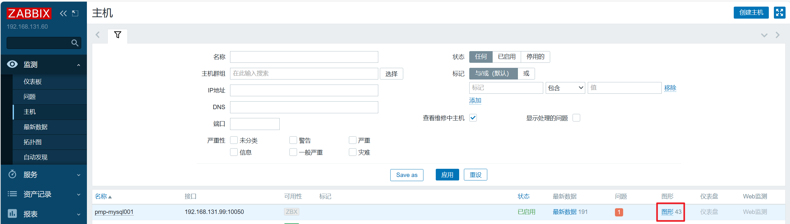

# 1 PMP介绍

PMP（percona-monitoring-pluggins）是高质量的mysql监控组件，以模板、插件和脚本的形式提供我们去应用。可以将企业级MySQL功能添加到现有的本地监控解决方案中，支持如Nagios、Cacti和Zabbix等热门解决方案。

更详细介绍请阅读官方文档第三章【TEMPLATES FOR ZABBIX】：[Percona-Monitoring-Plugins-1.1.8.pdf](https://docs.percona.com/legacy-documentation/percona-monitoring-plugins/Percona-Monitoring-Plugins-1.1.8.pdf)

下面开始介绍pmp的使用。

注意，以下操作都是在zabbix agent服务器上执行。zabbix部署请查看历史文章：[http://t.csdnimg.cn/3N4nj](http://t.csdnimg.cn/3N4nj)

# 2 PMP安装

**1）下载PMP-1.1.8**

pmp项目已于2020年停止维护，最大版本是1.1.8，且percona官网已经不提供下载方式，可以在percona的github账号上下载，不过不知道什么原因，并未提供1.1.8版本的安装包，只提供了1.1.7及以下的版本。

这里我提供百度网盘的下载连接，请自行下载：


链接：https://pan.baidu.com/s/1aUhyblP5lMs7yg-3TbgEcQ?pwd=lu9u
提取码：lu9u


**2）安装**

```bash
[root@mysql001 tmp]# rpm -ivh percona-zabbix-templates-1.1.8-1.noarch.rpm
Preparing...                          ################################# [100%]
Updating / installing...
   1:percona-zabbix-templates-1.1.8-1 ################################# [100%]

Scripts are installed to /var/lib/zabbix/percona/scripts
Templates are installed to /var/lib/zabbix/percona/templates
[root@mysql001 tmp]# cd /var/lib/zabbix/percona
```

根据安装过程提示，脚本文件的安装路径在/var/lib/zabbix/percona/scripts，模板文件的安装路径在/var/lib/zabbix/percona/templates。

内容如下：

```bash
[root@mysql001 percona]# tree /var/lib/zabbix/percona
/var/lib/zabbix/percona
├── scripts
│   ├── get_mysql_stats_wrapper.sh
│   └── ss_get_mysql_stats.php
└── templates
    ├── userparameter_percona_mysql.conf
    └── zabbix_agent_template_percona_mysql_server_ht_2.0.9-sver1.1.8.xml
```

脚本介绍：

- *ss_get_mysql_stats.php*：采集mysql数据，后缀名是.php，使用php开发的；
- *get_mysql_stats_wrapper.sh*：封装ss_get_mysql_stats.php的shell脚本；
- *userparameter_percona_mysql.conf*：定义监控项；
- *zabbix_agent_template_percona_mysql_server_ht_2.0.9-sver1.1.8.xml*：zabbix的模板文件。

**3）创建mysql专用监控用户**

```sql
mysql> create user pmp@localhost identified with mysql_native_password by 'Pmp123456.';
Query OK, 0 rows affected (0.00 sec)

mysql> grant process,replication client on *.* to pmp@localhost;
Query OK, 0 rows affected (0.00 sec)
```

**4）配置连接信息**

在这一步中，我们需要配置MySQL与Agent节点上localhost的连接。

先确认mysql的配置：

```bash
mysql> show variables like 'socket';
+---------------+---------------------------+
| Variable_name | Value                     |
+---------------+---------------------------+
| socket        | /var/lib/mysql/mysql.sock |
+---------------+---------------------------+
1 row in set (0.01 sec)

mysql> show variables like 'port';
+---------------+-------+
| Variable_name | Value |
+---------------+-------+
| port          | 3306  |
+---------------+-------+
1 row in set (0.00 sec)
```

配置：

```bash
[root@mysql001 scripts]# cd /var/lib/zabbix/percona/scripts
[root@mysql001 scripts]# vim ss_get_mysql_stats.php

#修改
$mysql_user = 'pmp';
$mysql_pass = 'Pmp123456.';
$mysql_port = 3306;
$mysql_socket = '/var/lib/mysql/mysql.sock';
```

**5）测试连接**

```bash
[root@mysql001 scripts]# ./get_mysql_stats_wrapper.sh gg
./get_mysql_stats_wrapper.sh: line 35: /usr/bin/php: No such file or directory
ERROR: run the command manually to investigate the problem: /usr/bin/php -q ./ss_get_mysql_stats.php --host localhost --items gg
```

报错提示缺少/usr/bin/php目录，原因是缺少php相关mysql的依赖，解决办法如下：

```bash
[root@mysql001 scripts]# yum install php-cli php-mysql -y
```

再次执行：

```bash
[root@mysql001 scripts]# ./get_mysql_stats_wrapper.sh gg
0
iu:4[root@mysql001 scripts]# php ./ss_get_mysql_stats.php --host localhost --items gg
gg:0

[root@mysql001 scripts]# rm -rf /tmp/localhost-mysql_cacti_stats.txt
```

gg有返回，说明没问题。

删除的文件/tmp/localhost-mysql_cacti_stats.txt是刚刚测试脚本的采集数据缓存文件，测试完后如果不删除，会影响后面的正常使用。

**6）复制Zabbix Agent配置**

将监控项文件拷贝到zabbix agent的配置目录下。

```bash
[root@mysql001 scripts]# find / -name "zabbix_agentd.conf.d"
/usr/local/zabbix/etc/zabbix_agentd.conf.d
[root@mysql001 scripts]# cp /var/lib/zabbix/percona/templates/userparameter_percona_mysql.conf /usr/local/zabbix/etc/zabbix_agentd.conf.d/
```

注意：*/usr/local/zabbix/etc/zabbix_agentd.conf.d*目录可能每个人的都不一样，请根据自己的实际环境做更改。

**7）修改zabbix agent配置**

允许zabbix agent读取/usr/local/zabbix/etc/zabbix_agentd.conf.d/目录下的配置文件。

```bash
[root@mysql001 etc]# cd /usr/local/zabbix/etc/
[root@mysql001 etc]# vim zabbix_agentd.conf
#修改
Include=/usr/local/zabbix/etc/zabbix_agentd.conf.d/
```

**8）重启zabbix agent**

```bash
[root@mysql001 etc]# service zabbix_agentd restart
Restarting zabbix_agentd (via systemctl):                  [  OK  ]

[root@mysql001 etc]# service zabbix_agentd status
● zabbix_agentd.service - SYSV: Zabbix Monitoring Agent
   Loaded: loaded (/etc/rc.d/init.d/zabbix_agentd; bad; vendor preset: disabled)
   Active: active (running) since Sat 2024-01-27 01:46:08 CST; 5s ago
     Docs: man:systemd-sysv-generator(8)
  Process: 16371 ExecStop=/etc/rc.d/init.d/zabbix_agentd stop (code=exited, status=0/SUCCESS)
  Process: 16385 ExecStart=/etc/rc.d/init.d/zabbix_agentd start (code=exited, status=0/SUCCESS)
 Main PID: 16395 (zabbix_agentd)
   CGroup: /system.slice/zabbix_agentd.service
           ├─16395 /usr/local/zabbix/sbin/zabbix_agentd -c /usr/local/zabbix/etc/zabbix_agentd.conf
           ├─16396 /usr/local/zabbix/sbin/zabbix_agentd: collector [idle 1 sec]
           ├─16397 /usr/local/zabbix/sbin/zabbix_agentd: listener #1 [waiting for connection]
           ├─16398 /usr/local/zabbix/sbin/zabbix_agentd: listener #2 [waiting for connection]
           ├─16399 /usr/local/zabbix/sbin/zabbix_agentd: listener #3 [waiting for connection]
           └─16400 /usr/local/zabbix/sbin/zabbix_agentd: active checks #1 [idle 1 sec]

Jan 27 01:46:08 mysql001 systemd[1]: Starting SYSV: Zabbix Monitoring Agent...
Jan 27 01:46:08 mysql001 zabbix_agentd[16385]: Starting Zabbix Agent: [  OK  ]
Jan 27 01:46:08 mysql001 systemd[1]: Started SYSV: Zabbix Monitoring Agent.
```

至此，最艰难的环节已经完成了，接下来就是用鼠标点点点。

**9）导入PMP模板**

将网盘中提供的*zabbix_agent_template_percona_mysql_server_ht_2.0.9-sver1.1.8.xml*模板文件导入zabbix web中。步骤如下：

选择模板文件：


导入：


确认：


提示导入成功：


**查看模板**：


**10）创建主机关联PMP模板**

具体配置如下：


**确认是否关联模板**：


**11）确认是否可以正常采集数据**

在监控项目中查看最新的数据：


可以看到，数据采集正常。

# 3 使用

数据一般在主机监控项中查看，有最新数据、问题和图形。


**1）最新数据**


也可以查看指定监控项的详细数据，单击监控项名称跳出选择列表：


有图形、值、最近500个值和配置。选择图形查看：


**2）图形**

可以查看主机模板配置的所有图形，pmp一共包含了43个图形，基本覆盖了所有常用的监控项。



点击查看所有图形：

