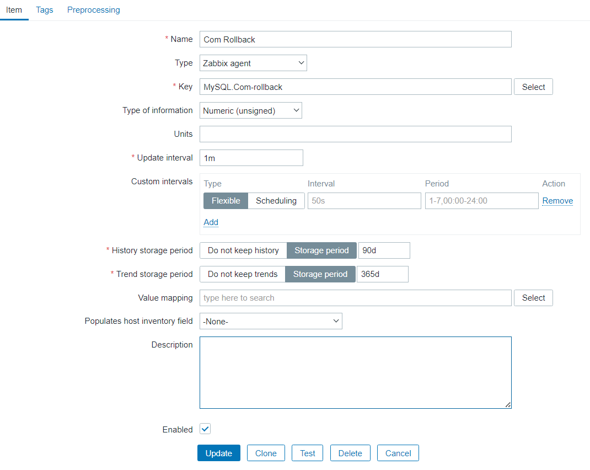
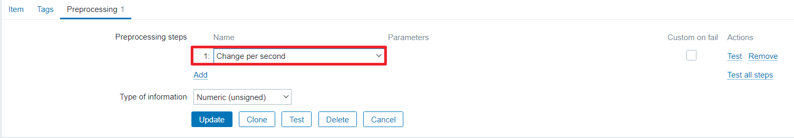

**目录**

[toc]

# 1 PMP介绍

PMP（percona-monitoring-pluggins）是高质量的mysql监控组件，以模板、插件和脚本的形式提供我们去应用。可以将企业级MySQL功能添加到现有的本地监控解决方案中，支持如Nagios、Cacti和Zabbix等热门解决方案。

更详细介绍请阅读官方文档第三章【TEMPLATES FOR ZABBIX】：[Percona-Monitoring-Plugins-1.1.8.pdf](https://docs.percona.com/legacy-documentation/percona-monitoring-plugins/Percona-Monitoring-Plugins-1.1.8.pdf)

下面开始介绍pmp的使用。

注意，以下操作都是在zabbix agent服务器上执行。zabbix部署请查看历史文章：[http://t.csdnimg.cn/3N4nj](http://t.csdnimg.cn/3N4nj)

# 2 PMP安装

**1）下载PMP-1.1.8**

pmp项目已于2020年停止维护，最大版本是1.1.8，且percona官网已经不提供下载方式，可以在percona的github账号上下载，不过不知道什么原因，并未提供1.1.8版本的安装包，只提供了1.1.7及以下的版本。

这里我提供百度网盘的下载连接，请自行下载：


链接：https://pan.baidu.com/s/1aUhyblP5lMs7yg-3TbgEcQ?pwd=lu9u
提取码：lu9u


**2）安装**

```bash
[root@mysql001 tmp]# rpm -ivh percona-zabbix-templates-1.1.8-1.noarch.rpm
Preparing...                          ################################# [100%]
Updating / installing...
   1:percona-zabbix-templates-1.1.8-1 ################################# [100%]

Scripts are installed to /var/lib/zabbix/percona/scripts
Templates are installed to /var/lib/zabbix/percona/templates
[root@mysql001 tmp]# cd /var/lib/zabbix/percona
```

根据安装过程提示，脚本文件的安装路径在/var/lib/zabbix/percona/scripts，模板文件的安装路径在/var/lib/zabbix/percona/templates。

内容如下：

```bash
[root@mysql001 percona]# tree /var/lib/zabbix/percona
/var/lib/zabbix/percona
├── scripts
│   ├── get_mysql_stats_wrapper.sh
│   └── ss_get_mysql_stats.php
└── templates
    ├── userparameter_percona_mysql.conf
    └── zabbix_agent_template_percona_mysql_server_ht_2.0.9-sver1.1.8.xml
```

脚本介绍：

- *ss_get_mysql_stats.php*：采集mysql数据，后缀名是.php，使用php开发的；
- *get_mysql_stats_wrapper.sh*：封装ss_get_mysql_stats.php的shell脚本；
- *userparameter_percona_mysql.conf*：定义监控项；
- *zabbix_agent_template_percona_mysql_server_ht_2.0.9-sver1.1.8.xml*：zabbix的模板文件。

**3）创建mysql专用监控用户**

```sql
mysql> create user pmp@localhost identified with mysql_native_password by 'Pmp123456.';
Query OK, 0 rows affected (0.00 sec)

mysql> grant process,replication client on *.* to pmp@localhost;
Query OK, 0 rows affected (0.00 sec)
```

**4）配置连接信息**

在这一步中，我们需要配置MySQL与Agent节点上localhost的连接。

先确认mysql的配置：

```bash
mysql> show variables like 'socket';
+---------------+---------------------------+
| Variable_name | Value                     |
+---------------+---------------------------+
| socket        | /var/lib/mysql/mysql.sock |
+---------------+---------------------------+
1 row in set (0.01 sec)

mysql> show variables like 'port';
+---------------+-------+
| Variable_name | Value |
+---------------+-------+
| port          | 3306  |
+---------------+-------+
1 row in set (0.00 sec)
```

配置：

```bash
[root@mysql001 scripts]# cd /var/lib/zabbix/percona/scripts
[root@mysql001 scripts]# vim ss_get_mysql_stats.php

#修改
$mysql_user = 'pmp';
$mysql_pass = 'Pmp123456.';
$mysql_port = 3306;
$mysql_socket = '/var/lib/mysql/mysql.sock';
```

**5）测试连接**

```bash
[root@mysql001 scripts]# ./get_mysql_stats_wrapper.sh gg
./get_mysql_stats_wrapper.sh: line 35: /usr/bin/php: No such file or directory
ERROR: run the command manually to investigate the problem: /usr/bin/php -q ./ss_get_mysql_stats.php --host localhost --items gg
```

报错提示缺少/usr/bin/php目录，原因是缺少php相关mysql的依赖，解决办法如下：

```bash
[root@mysql001 scripts]# yum install php-cli php-mysql -y
```

再次执行：

```bash
[root@mysql001 scripts]# ./get_mysql_stats_wrapper.sh gg
0
iu:4[root@mysql001 scripts]# php ./ss_get_mysql_stats.php --host localhost --items gg
gg:0

[root@mysql001 scripts]# rm -rf /tmp/localhost-mysql_cacti_stats.txt
```

gg有返回，说明没问题。

删除的文件/tmp/localhost-mysql_cacti_stats.txt是刚刚测试脚本的采集数据缓存文件，测试完后如果不删除，会影响后面的正常使用。

**6）复制Zabbix Agent配置**

将监控项文件拷贝到zabbix agent的配置目录下。

```bash
[root@mysql001 scripts]# find / -name "zabbix_agentd.conf.d"
/usr/local/zabbix/etc/zabbix_agentd.conf.d
[root@mysql001 scripts]# cp /var/lib/zabbix/percona/templates/userparameter_percona_mysql.conf /usr/local/zabbix/etc/zabbix_agentd.conf.d/
```

注意：*/usr/local/zabbix/etc/zabbix_agentd.conf.d*目录可能每个人的都不一样，请根据自己的实际环境做更改。

**7）修改zabbix agent配置**

允许zabbix agent读取/usr/local/zabbix/etc/zabbix_agentd.conf.d/目录下的配置文件。

```bash
[root@mysql001 etc]# cd /usr/local/zabbix/etc/
[root@mysql001 etc]# vim zabbix_agentd.conf
#修改
Include=/usr/local/zabbix/etc/zabbix_agentd.conf.d/
```

**8）重启zabbix agent**

```bash
[root@mysql001 etc]# service zabbix_agentd restart
Restarting zabbix_agentd (via systemctl):                  [  OK  ]

[root@mysql001 etc]# service zabbix_agentd status
● zabbix_agentd.service - SYSV: Zabbix Monitoring Agent
   Loaded: loaded (/etc/rc.d/init.d/zabbix_agentd; bad; vendor preset: disabled)
   Active: active (running) since Sat 2024-01-27 01:46:08 CST; 5s ago
     Docs: man:systemd-sysv-generator(8)
  Process: 16371 ExecStop=/etc/rc.d/init.d/zabbix_agentd stop (code=exited, status=0/SUCCESS)
  Process: 16385 ExecStart=/etc/rc.d/init.d/zabbix_agentd start (code=exited, status=0/SUCCESS)
 Main PID: 16395 (zabbix_agentd)
   CGroup: /system.slice/zabbix_agentd.service
           ├─16395 /usr/local/zabbix/sbin/zabbix_agentd -c /usr/local/zabbix/etc/zabbix_agentd.conf
           ├─16396 /usr/local/zabbix/sbin/zabbix_agentd: collector [idle 1 sec]
           ├─16397 /usr/local/zabbix/sbin/zabbix_agentd: listener #1 [waiting for connection]
           ├─16398 /usr/local/zabbix/sbin/zabbix_agentd: listener #2 [waiting for connection]
           ├─16399 /usr/local/zabbix/sbin/zabbix_agentd: listener #3 [waiting for connection]
           └─16400 /usr/local/zabbix/sbin/zabbix_agentd: active checks #1 [idle 1 sec]

Jan 27 01:46:08 mysql001 systemd[1]: Starting SYSV: Zabbix Monitoring Agent...
Jan 27 01:46:08 mysql001 zabbix_agentd[16385]: Starting Zabbix Agent: [  OK  ]
Jan 27 01:46:08 mysql001 systemd[1]: Started SYSV: Zabbix Monitoring Agent.
```

至此，最艰难的环节已经完成了，接下来就是用鼠标点点点。

**9）导入PMP模板**

将网盘中提供的*zbx_export_templates.xml*模板文件导入zabbix web中。步骤如下：

选择模板文件：


导入：


确认：


提示导入成功：


**查看模板**：


**10）创建主机关联PMP模板**

具体配置如下：


**确认是否关联模板**：


**11）确认是否可以正常采集数据**

在监控项目中查看最新的数据：


可以看到，数据采集正常。

# 3 使用

数据一般在主机监控项中查看，有最新数据、问题和图形。


**1）最新数据**


也可以查看指定监控项的详细数据，单击监控项名称跳出选择列表：


有图形、值、最近500个值和配置。选择图形查看：


**2）图形**

可以查看主机模板配置的所有图形，pmp一共包含了43个图形，基本覆盖了所有常用的监控项。


点击查看所有图形：


# 4 PMP自定义监控项

## 4.1 常规监控项添加

PMP虽然提供了191个监控项，但还缺少了很多常用的**监控指标**，比如：

- **QPS（Queries Per Second）**：每秒的查询数，对数据库而言就是数据库每秒执行的SQL数（含 insert、select、update、delete 等）；
- **TPS（Transactions Per Second）**：每秒的事务数，TPS对于数据库而言就是数据库每秒执行的事务数，以commit和reooback的成功次数为准；
- **IOPS（Input/Output Operations Per Second）**：每秒磁盘进行的I/O操作次数。

因此，我们需要在原来的基础上添加一些自定义的监控项，完善监控系统。

PMP添加监控项是基于ss_get_mysql_stats.php文件做修改。下面以TPS为例进行自定义监控指标。

**1）向ss_get_mysql_stats.php添加监控项**

根据TPS的定义，计算公式为：

- TPS = (Com_commit + Com_rollback) / Uptime

这三个状态变量在mysql中用以下方式查看：

```sql
mysql> show global status like 'com_commit';
+---------------+-------+
| Variable_name | Value |
+---------------+-------+
| Com_commit    | 1     |
+---------------+-------+
1 row in set (0.00 sec)

mysql> show global status like 'com_rollback';
+---------------+-------+
| Variable_name | Value |
+---------------+-------+
| Com_rollback  | 0     |
+---------------+-------+
1 row in set (0.00 sec)

mysql> show global status like 'uptimes';
Empty set (0.00 sec)

mysql> show global status like 'uptime';
+---------------+--------+
| Variable_name | Value  |
+---------------+--------+
| Uptime        | 867149 |
+---------------+--------+
1 row in set (0.00 sec)
```

注意：show status仅针对当前会话。show global status是全局的意思。

**向ss_get_mysql_stats.php文件中添加监控项**，以上3个状态变量添加到变量$key中：

```bash
[root@mysql001 scripts]# vim /var/lib/zabbix/percona/scripts/ss_get_mysql_stats.php

#在$keys的最后添加Com_commit、Com_rollback和Uptime
$keys = array(
      'Key_read_requests'           =>  'gg',
      'Key_reads'                   =>  'gh',
      'Key_write_requests'          =>  'gi',
      'Key_writes'                  =>  'gj',
      ...
      'wsrep_flow_control_recv'     =>  'qn',
      'pool_reads'                  =>  'qo',
      'pool_read_requests'          =>  'qp',
      #添加：
      'Com_commit'                  =>  'qq',
      'Com_rollback'                =>  'qr',
      'Uptime'                      =>  'qs',
   );
```

**2）修改zabbix agent配置文件，定义监控项**

```bash
[root@mysql001 scripts]# vim /usr/local/zabbix/etc/zabbix_agentd.conf.d/userparameter_percona_mysql.conf

#在最后添加：
UserParameter=MySQL.Com-commit,/var/lib/zabbix/percona/scripts/get_mysql_stats_wrapper.sh qq
UserParameter=MySQL.Com-rollback,/var/lib/zabbix/percona/scripts/get_mysql_stats_wrapper.sh qr
UserParameter=MySQL.Uptime,/var/lib/zabbix/percona/scripts/get_mysql_stats_wrapper.sh qs
```

**3）测试**

```bash
[root@mysql001 scripts]# cd /var/lib/zabbix/percona/scripts/
[root@mysql001 scripts]# ./get_mysql_stats_wrapper.sh qq
1
[root@mysql001 scripts]# ./get_mysql_stats_wrapper.sh qr
0
[root@mysql001 scripts]# ./get_mysql_stats_wrapper.sh qs
868652
```

**4）重启zabbix agent，生效userparameter_percona_mysql.conf配置文件**

```bash
[root@mysql001 scripts]# service zabbix_agentd restart
Restarting zabbix_agentd (via systemctl):                  [  OK  ]

[root@mysql001 scripts]# service zabbix_agentd status
● zabbix_agentd.service - SYSV: Zabbix Monitoring Agent
   Loaded: loaded (/etc/rc.d/init.d/zabbix_agentd; bad; vendor preset: disabled)
   Active: active (running) since Sat 2024-01-27 23:39:26 CST; 1s ago
     Docs: man:systemd-sysv-generator(8)
  Process: 21156 ExecStop=/etc/rc.d/init.d/zabbix_agentd stop (code=exited, status=0/SUCCESS)
  Process: 21171 ExecStart=/etc/rc.d/init.d/zabbix_agentd start (code=exited, status=0/SUCCESS)
 Main PID: 21180 (zabbix_agentd)
   CGroup: /system.slice/zabbix_agentd.service
           ├─21180 /usr/local/zabbix/sbin/zabbix_agentd -c /usr/local/zabbix/etc/zabbix_agentd.conf
           ├─21181 /usr/local/zabbix/sbin/zabbix_agentd: collector [idle 1 sec]
           ├─21182 /usr/local/zabbix/sbin/zabbix_agentd: listener #1 [waiting for connection]
           ├─21183 /usr/local/zabbix/sbin/zabbix_agentd: listener #2 [waiting for connection]
           ├─21184 /usr/local/zabbix/sbin/zabbix_agentd: listener #3 [waiting for connection]
           └─21185 /usr/local/zabbix/sbin/zabbix_agentd: active checks #1 [idle 1 sec]

Jan 27 23:39:26 mysql001 systemd[1]: Starting SYSV: Zabbix Monitoring Agent...
Jan 27 23:39:26 mysql001 zabbix_agentd[21171]: Starting Zabbix Agent: [  OK  ]
Jan 27 23:39:26 mysql001 systemd[1]: Started SYSV: Zabbix Monitoring Agent.
```

**5）web模板创建监控项**

依次点击`Configuration`->`Templates`->`Items`->`Create item`。

**Com Commit:**


**Com Rollback:**



**Uptime:**


**注意**：以上三个监控项，还需设置**Preprocessing**为Change per second，意思是每秒增量。



添加标签（可选）：


**6）配置TPS**

与上面三个监控项不同，TPS需要用公式计算，因此Item Type需要设置为`Calculated`，代表计算的意思。计算公式添加在`Formula`中。


## 4.2 业务监控项添加

在生产中，监控系统除了监控性能指标外，核心业务数据指标也需要配置监控系统。

有些朋友说，业务数据监控系统一般由数据分析的同事负责开发，运维人员可以置身事外。在大公司也许是这样的，但是一般有几家公司舍得招人来专门做数据分析呢？哈哈。像我司，监控业务数据指标就是由运维同学来完成的。

业务系统监控主要监控业务相关指标，不同项目或者不同区域的监控目标差异比较大，高度依赖业务本身，因此个性化属性比较强。

监控基本方式是通过sql查询数据库相关内容状态和信息来实现，这里以监控数据库表空间为例，讲解此监控项建立的过程，希望能有一定的指导作用，方便本地人员根据自己的实际情况，建立监控内容。

**一、演示数据**

- 数据库：sakila
- 下载地址：https://dev.mysql.com/doc/index-other.html


- EER图：


- 业务监控指标需求：

获取Lethbridge城市当前的累计营业，sql如下：

```sql
mysql>
select sum(p.amount) amount
  from sakila.customer c,
	   sakila.payment p,
       sakila.store s,
	   sakila.address a,
	   sakila.city ct 
 where c.customer_id = p.customer_id
   and c.store_id = s.store_id 
   and s.address_id = a.address_id 
   and a.city_id = ct.city_id 
   and ct.city = 'Lethbridge';

+----------+
| amount   |
+----------+
| 36997.53 |
+----------+
1 row in set (0.02 sec)
```


**二、创建监控项脚本文件，并赋权**

```bash
[root@mysql001 scripts]# touch /var/lib/zabbix/percona/scripts/business_data.sh
[root@mysql001 scripts]# chmod +x /var/lib/zabbix/percona/scripts/business_data.sh
[root@mysql001 scripts]# ll /var/lib/zabbix/percona/scripts/business_data.sh
-rwxr-xr-x 1 root root 587 Feb 25 18:15 /var/lib/zabbix/percona/scripts/business_data.sh
```

**三、修改zabbix agent配置文件，添加监控项脚本文件**

```bash
[root@mysql001 scripts]# vim /usr/local/zabbix/etc/zabbix_agentd.conf.d/userparameter_percona_mysql.conf
#添加
UserParameter=business_data[*],/var/lib/zabbix/percona/scripts/business_data.sh $1
```

**四、监控用户赋权**

```sql
mysql> grant select on sakila.* to pmp@localhost;
Query OK, 0 rows affected (0.01 sec)

mysql> show grants for pmp@localhost;
+---------------------------------------------------------------+
| Grants for pmp@localhost                                      |
+---------------------------------------------------------------+
| GRANT PROCESS, REPLICATION CLIENT ON *.* TO `pmp`@`localhost` |
| GRANT SELECT ON `sakila`.* TO `pmp`@`localhost`               |
+---------------------------------------------------------------+
2 rows in set (0.00 sec)
```

**五、测试监控脚本**

```bash
#过滤前：
[mysql@mysql001 ~]$ mysql -upmp -pPmp123456. -e "select sum(p.amount) amount from sakila.customer c, sakila.payment p, sakila.store s, sakila.address a, sakila.city ct where c.customer_id = p.customer_id and c.store_id = s.store_id and s.address_id = a.address_id and a.city_id = ct.city_id and ct.city = 'Lethbridge'\G"
mysql: [Warning] Using a password on the command line interface can be insecure.
*************************** 1. row ***************************
amount: 36997.53

#过滤后：
[mysql@mysql001 ~]$ mysql -upmp -pPmp123456. -e "select sum(p.amount) amount from sakila.customer c, sakila.payment p, sakila.store s, sakila.address a, sakila.city ct where c.customer_id = p.customer_id and c.store_id = s.store_id and s.address_id = a.address_id and a.city_id = ct.city_id and ct.city = 'Lethbridge'\G" 2>/dev/null | awk 'NR==2 {print $2}'
36997.53
```

命令解析：

- 2>/dev/null：去除MySQL命令行直接输入密码警告；
- awk 'NR==2'：取第二行数据；
- awk '{print $2}'：取第二列数值。

**六、配置监控项脚本**

```bash
[root@mysql001 scripts]# vim /var/lib/zabbix/percona/scripts/business_data.sh
#添加：

#!/bin/bash
#定义一个本地用户登录mysql数据库的变量
case $1 in
        #case1: Lethbridge_Amount
        Lethbridge_Amount)
        mysql -upmp -pPmp123456. -e "select sum(p.amount) amount from sakila.customer c, sakila.payment p, sakila.store s, sakila.address a, sakila.city ct where c.customer_id = p.customer_id and c.store_id = s.store_id and s.address_id = a.address_id and a.city_id = ct.city_id and ct.city = 'Lethbridge'\G" 2>/dev/null | awk 'NR==2 {print $2}'
        ;;
        #case2: number of actors
        Number_of_Actors)
        mysql -upmp -pPmp123456. -e "select count(*) from sakila.actor\G" 2>/dev/null | awk 'NR==2 {print $2}'
        ;;
esac
```

**七、重启zabbix_agentd**

```bash
[root@mysql001 scripts]# systemctl restart zabbix_agentd
[root@mysql001 scripts]# systemctl status zabbix_agentd
● zabbix_agentd.service - SYSV: Zabbix Monitoring Agent
   Loaded: loaded (/etc/rc.d/init.d/zabbix_agentd; bad; vendor preset: disabled)
   Active: active (running) since Sun 2024-02-25 21:04:38 CST; 9s ago
     Docs: man:systemd-sysv-generator(8)
  Process: 12525 ExecStop=/etc/rc.d/init.d/zabbix_agentd stop (code=exited, status=0/SUCCESS)
  Process: 12539 ExecStart=/etc/rc.d/init.d/zabbix_agentd start (code=exited, status=0/SUCCESS)
 Main PID: 12548 (zabbix_agentd)
   CGroup: /system.slice/zabbix_agentd.service
           ├─12548 /usr/local/zabbix/sbin/zabbix_agentd -c /usr/local/zabbix/etc/zabbix_agentd.conf
           ├─12549 /usr/local/zabbix/sbin/zabbix_agentd: collector [idle 1 sec]
           ├─12550 /usr/local/zabbix/sbin/zabbix_agentd: listener #1 [waiting for connection]
           ├─12551 /usr/local/zabbix/sbin/zabbix_agentd: listener #2 [waiting for connection]
           ├─12552 /usr/local/zabbix/sbin/zabbix_agentd: listener #3 [waiting for connection]
           └─12553 /usr/local/zabbix/sbin/zabbix_agentd: active checks #1 [idle 1 sec]

Feb 25 21:04:38 mysql001 systemd[1]: Starting SYSV: Zabbix Monitoring Agent...
Feb 25 21:04:38 mysql001 zabbix_agentd[12539]: Starting Zabbix Agent: [  OK  ]
Feb 25 21:04:38 mysql001 systemd[1]: Started SYSV: Zabbix Monitoring Agent.
```

**八、测试**

到`zabbix server`的bin目录下执行zabbix_get测试：

```bash
[root@zabbix6 bin]# ./zabbix_get -s 192.168.131.99 -k business_data[Lethbridge_Amount]
36997.53
```

测试成功！！

**九、创建主机**


**十、添加监控项**


错误信息：


数据为浮点型型，监控项配置了数值型，所以报错。修改监控项配置：


**八、结果呈现**

