**目录**

[toc]


# 1 zabbix介绍

Zabbix 是一个基于 Web 界面的提供分布式系统监视以及网络监视功能的企业级开源解决方案。它可以监视各种网络参数，保证服务器系统的安全运营，并提供灵活的通知机制以让系统管理员快速定位和解决存在的各种问题。

Zabbix 由几个主要的软件组件组成：

- **Zabbix server**：是 agents 向其报告可用性和完整性信息和统计信息的中心组件。server 是存储所有配置、统计和操作数据的中央存储库。
- **数据存储**：Zabbix 收集的所有配置信息以及数据都存储在数据库中。
- **Web 界面**：为了从任何地方和任何平台轻松访问，Zabbix 提供了基于 Web 的界面。该接口是 Zabbix server 的一部分，通常（但不一定）与 server 运行在同一台设备上。
- **Zabbix proxy**：可以代替 Zabbix server 收集性能和可用性数据。proxy 是 Zabbix 部署的可选部分；但是对于分散单个 Zabbix server 的负载非常有用。
- **Zabbix agent**：部署在被监控目标上，以主动监控本地资源和应用程序，并将收集到的数据报告给 Zabbix server。从 Zabbix 4.4 开始，有两种类型的 agent 可用：Zabbix agent （轻量级，在许多平台上支持，用 C 编写）和 Zabbix agent 2 （非常灵活，易于使用插件扩展，用 Go 编写）。

Zabbix特点：

- 自动发现服务器与网络设备。
- 分布式监视以及 Web 集中管理功能。
- 可以无 agent 监视。
- 用户安全认证和柔软的授权方式。
- 通过 Web 界面设置或查看监视结果。
- 磁盘使用、网络状况、端口监视等功能。

Zabbix 支持主动轮询和被动捕获，所有的报告、统计信息和配置参数都可以通过基于 Web 的前端页面进行访问，基于 Web 的前端页面可以确保从任何方面评估网络状态和服务器的健康性。适当的配置后，Zabbix 可以在 IT 基础架构监控方面扮演重要的角色，对于只有少量服务器的小型组织和拥有大量服务器的大型公司也同样如此。

# 2 安装

## 2.0 环境规划

| zabbix组件| 地址 | 监控项 | 操作系统 |
| - | - | - | - |
| zabbix server | 192.168.131.60 | 服务器资源 | redhat 7.9 |
| zabbix agent | 192.168.131.99 | mysql8.0 | redhat 7.9 |
| zabbix agent | 192.168.131.100 | mysql8.0 | redhat 7.9 |

## 2.1 安装zabbix server

我这里在白板机器 192.168.131.60 上部署zabbix server。

**1）下载**

下载地址：https://www.zabbix.com/download_sources#60LTS

安装手册：https://www.zabbix.com/documentation/current/zh/manual/installation/install

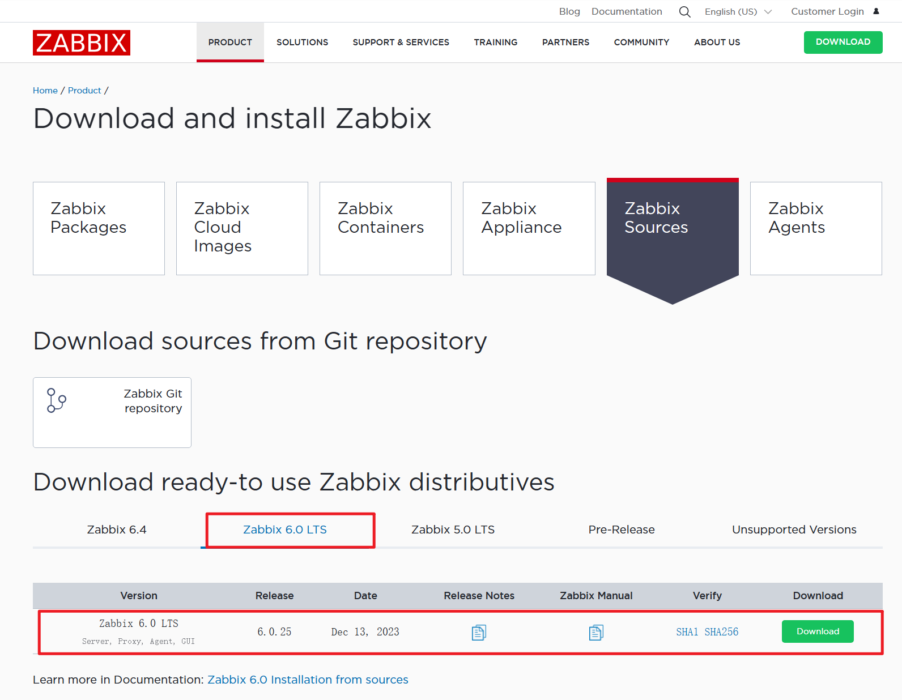

LTS（Long-Term Support）是长期支持版。

**2）解压**

将下载好的源码包上传到/tmp，进入路径解压。

```bash
[root@zabbix6 tmp]# cd /usr/src/
[root@zabbix6 src]# tar xf /tmp/zabbix-6.0.25.tar.gz
[root@zabbix6 src]# ln -s zabbix-6.0.25 zabbix

[root@zabbix6 src]# ls
debug  kernels  zabbix  zabbix-6.0.25
```

**3）创建zabbix用户和组**

```bash
[root@zabbix6 src]# groupadd --system zabbix
[root@zabbix6 src]# useradd --system -g zabbix -d /usr/lib/zabbix -s /sbin/nologin -c "Zabbix Monitoring System" zabbix
```

**4）创建zabbix数据库**

我是用mysql8.0作为zabbix的数据库。mysql8.0数据库安装可参考文章：https://www.modb.pro/db/1749485672754925568。

```sql
mysql> select version();
+-----------+
| version() |
+-----------+
| 8.0.25    |
+-----------+
mysql> 
create database zabbix character set utf8mb4 collate utf8mb4_bin;
create user 'zabbix'@'%' identified with mysql_native_password by 'Zabbix123.';
grant all privileges on zabbix.* to 'zabbix'@'localhost';
SET GLOBAL log_bin_trust_function_creators = 1;
```

**5）初始化数据库**

脚本路径在/usr/src/zabbix/database/mysql。

```bash
[mysql@zabbix6 ~]$ cd /usr/src/zabbix/database/mysql
[mysql@zabbix6 mysql]$ ls
data.sql  double.sql  history_pk_prepare.sql  images.sql  Makefile.am  Makefile.in  schema.sql

#导入
[mysql@zabbix6 mysql]$ mysql -uzabbix -pZabbix123. zabbix < schema.sql
[mysql@zabbix6 mysql]$ mysql -uzabbix -pZabbix123. zabbix < images.sql
[mysql@zabbix6 mysql]$ mysql -uzabbix -pZabbix123. zabbix < data.sql
```

**6）编译安装zabbix server**

```bash
[root@zabbix6 zabbix]# yum install -y gcc mysql-devel libevent-devel libcurl-devel libxml2-devel net-snmp-devel
[root@zabbix6 lib]# cd /usr/src/zabbix
[root@zabbix6 zabbix]# ./configure --prefix=/usr/local/zabbix --enable-server --enable-agent --with-mysql=/usr/local/mysql/bin/mysql_config --enable-ipv6 --with-net-snmp --with-libcurl --with-libxml2
```

显示以下截图，则说明配置源代码成功。

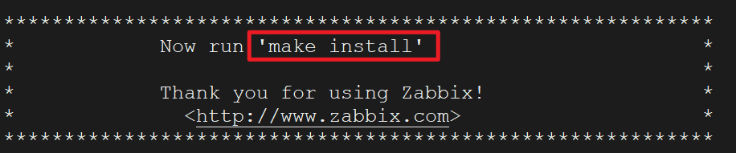

如果有其它情况，一般是缺依赖包，请自行安装。一般通过yum安装能解决绝大部分依赖软件，如果不行，这里提供一个rpm包的下载地址 [https://rpm.pbone.net/](https://rpm.pbone.net/).将rpm包下下来，然后进行rpm安装或者yum安装都可以。

确认配置源代码成功后，根据提示执行 make install，这一步应该以具有足够权限的用户身份运行（通常是 'root'，或使用 sudo）。

```bash
[root@zabbix6 zabbix]# make install
```

如果make编译报错，例如：

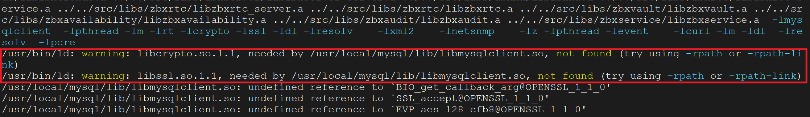

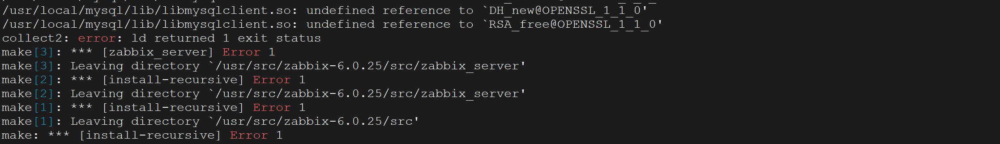

解决办法：

```bash
[root@zabbix6 src]# find / -name libcrypto.so.1.1
/usr/local/mysql-8.0.25-linux-glibc2.12-x86_64/lib/private/libcrypto.so.1.1
[root@zabbix6 src]# ln -s /usr/local/mysql-8.0.25-linux-glibc2.12-x86_64/lib/private/libcrypto.so.1.1 /usr/lib
[root@zabbix6 src]# ln -s /usr/local/mysql-8.0.25-linux-glibc2.12-x86_64/lib/private/libssl.so.1.1 /usr/lib64
```

重新执行 make install

**7）修改配置文件**

**1.修改/usr/local/zabbix/etc/zabbix_server.conf**

主要是配置数据库相关的参数，包括数据库ip、数据库名、用户和密码。

```bash
LogFile=/tmp/zabbix_server.log
DBHost=127.0.0.1
DBName=zabbix
DBUser=zabbix
DBPassword=Zabbix123.
DBPort=3306
Timeout=4
LogSlowQueries=3000
StatsAllowedIP=127.0.0.1
```

**2.修改/usr/local/zabbix/etc/zabbix_agentd.conf**

```bash
LogFile=/tmp/zabbix_agentd.log
Server=127.0.0.1
ServerActive=127.0.0.1
Hostname=Zabbix server
```

**8）配置服务管理脚本**

**1.zabbix_server**

设置zabbix_server路径，设置配置文件路径和启动项指定配置文件。

```bash
[root@zabbix6 etc]# vim /usr/src/zabbix/misc/init.d/fedora/core5/zabbix_server
#修改
ZABBIX_BIN="/usr/local/zabbix/sbin/zabbix_server"
CONFIG_FILE="/usr/local/zabbix/etc/zabbix_server.conf"
daemon $ZABBIX_BIN -c $CONFIG_FILE
```

修改后配置如下：

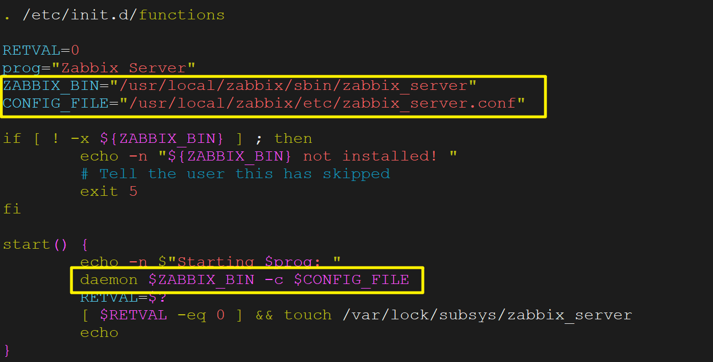

移动到/etc/init.d/目录下：

```bash
[root@zabbix6 etc]# cp /usr/src/zabbix/misc/init.d/fedora/core5/zabbix_server /etc/init.d/
```

**2.zabbix_agentd**

```bash
[root@zabbix6 etc]# vim /usr/src/zabbix/misc/init.d/fedora/core5/zabbix_agentd
#修改
ZABBIX_BIN="/usr/local/zabbix/sbin/zabbix_agentd"
CONFIG_FILE="/usr/local/zabbix/etc/zabbix_agentd.conf"
daemon $ZABBIX_BIN -c $CONFIG_FILE
```

修改后配置如下：

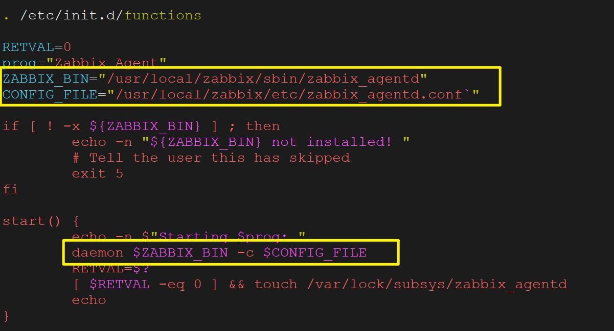

移动到systemd目录下：

```bash
[root@zabbix6 etc]# cp /usr/src/zabbix/misc/init.d/fedora/core5/zabbix_agentd /etc/init.d/
```

**9）启动**

```bash
[root@zabbix6 ~]# service zabbix_server start
[root@zabbix6 ~]# service zabbix_agentd start
```

**设置开机自启**

```bash
[root@zabbix6 ~]# chkconfig zabbix_server on
[root@zabbix6 ~]# chkconfig zabbix_agentd on
[root@zabbix6 ~]# chkconfig --list
zabbix_agentd   0:off   1:off   2:on    3:on    4:on    5:on    6:off
zabbix_server   0:off   1:off   2:on    3:on    4:on    5:on    6:off
```

## 2.2 安装Web组件

**1）安装httpd和PHP**

PHP要求7.2.5版本以上。

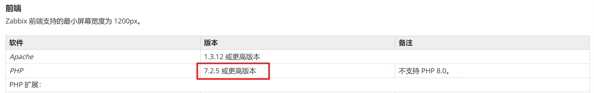

安装php：

```bash
[root@zabbix6 tmp]# wget ftp://ftp.pbone.net/mirror/ftp5.gwdg.de/pub/opensuse/repositories/home%3A/matthewdva%3A/build%3A/EPEL%3A/el7/RHEL_7/noarch/epel-release-7-9.noarch.rpm
[root@zabbix6 tmp]# wget ftp://ftp.pbone.net/mirror/repo.webtatic.com/yum/el7/webtatic-release.rpm
[root@zabbix6 tmp]# rpm -ivh epel-release-7-9.noarch.rpm
[root@zabbix6 tmp]# rpm -ivh webtatic-release.rpm
[root@zabbix6 tmp]# php -v
PHP 7.2.34 (cli) (built: Oct  1 2020 13:37:37) ( NTS )
```

安装好后的php版本是7.2.34。

**2）拷贝PHP文件至httpd根目录下**

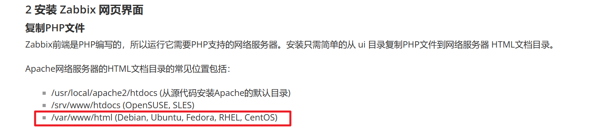

干吧：

```bash
[root@zabbix6 tmp]# mkdir -p /var/www/html/zabbix
[root@zabbix6 tmp]# cp -r /usr/src/zabbix/ui/* /var/www/html/zabbix/
[root@zabbix6 tmp]# chown -R apache.apache /var/www/html/
```

**3）修改PHP配置文件**

```bash
[root@zabbix6 ~]# vim /etc/php.ini
#修改
max_execution_time = 300
max_input_time = 300
memory_limit = 128M
post_max_size = 16M
upload_max_filesize = 2M
date.timezone = Asia/Shanghai
```

**4）启动httpd服务**

```bash
[root@zabbix6 ~]# systemctl start httpd
[root@zabbix6 ~]# systemctl status httpd
● httpd.service - The Apache HTTP Server
   Loaded: loaded (/usr/lib/systemd/system/httpd.service; disabled; vendor preset: disabled)
   Active: active (running) since Wed 2024-01-24 01:25:42 CST; 1s ago
     Docs: man:httpd(8)
           man:apachectl(8)
 Main PID: 21353 (httpd)
   Status: "Processing requests..."
   CGroup: /system.slice/httpd.service
           ├─21353 /usr/sbin/httpd -DFOREGROUND
           ├─21354 /usr/sbin/httpd -DFOREGROUND
           ├─21355 /usr/sbin/httpd -DFOREGROUND
           ├─21356 /usr/sbin/httpd -DFOREGROUND
           ├─21357 /usr/sbin/httpd -DFOREGROUND
           └─21358 /usr/sbin/httpd -DFOREGROUND

Jan 24 01:25:42 zabbix6.0 systemd[1]: Starting The Apache HTTP Server...
Jan 24 01:25:42 zabbix6.0 systemd[1]: Started The Apache HTTP Server.
```

设置开机自启：

```bash
[root@zabbix6 init.d]# chkconfig httpd start
```

## 2.4 配置Web页面

**1）登录zabbix首页**

在浏览器输入http://zabbix_server_ip/zabbix，zabbix_server_ip为zabbix server服务器的地址。

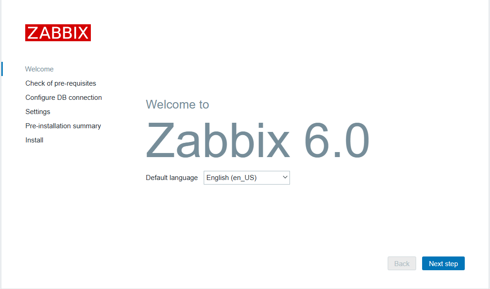

在首页，选择默认的语言，可以修改成中文。

**2）依赖性检查**

主要检查PHP的插件和配置是否满足要求。

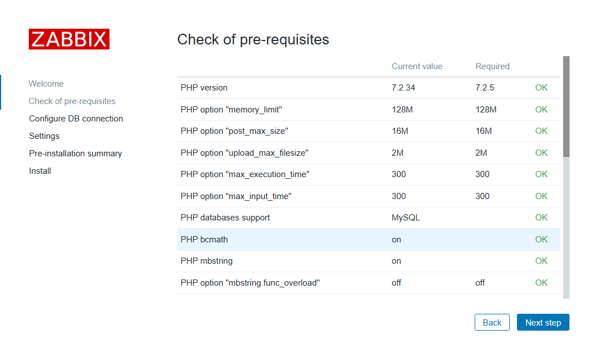

**3）配置数据库连接信息**

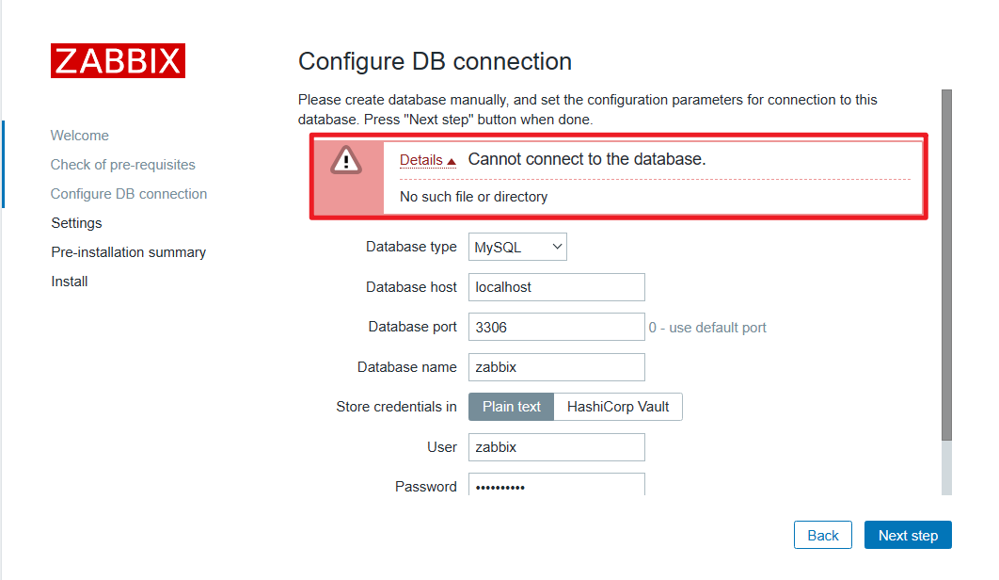

连接失败，提示没有这个文件或者文件夹，原因是php没有找到mysql数据库的sock文件。解决办法是在php的配置文件中的pdo_mysql.default_socket参数指定mysql数据库的sock文件路径：

```bash
[root@zabbix6 zabbix]# find / -name php.ini
/etc/php.ini
[root@zabbix6 zabbix]# vim /etc/php.ini
#修改
pdo_mysql.default_socket=/data/mysql/3306/data/mysql.sock
```

**4）设置zabbix server的信息**

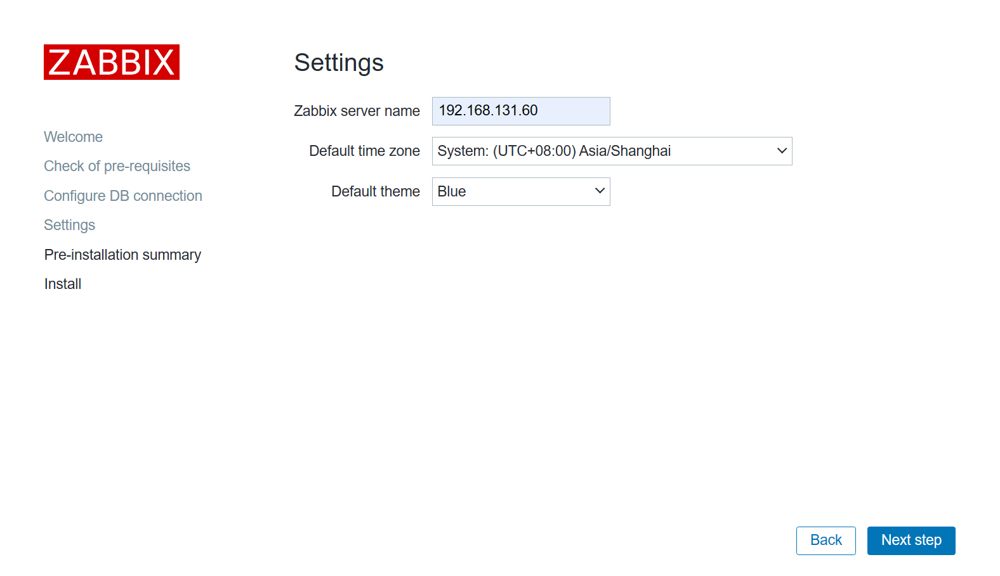

**5）配置检查**

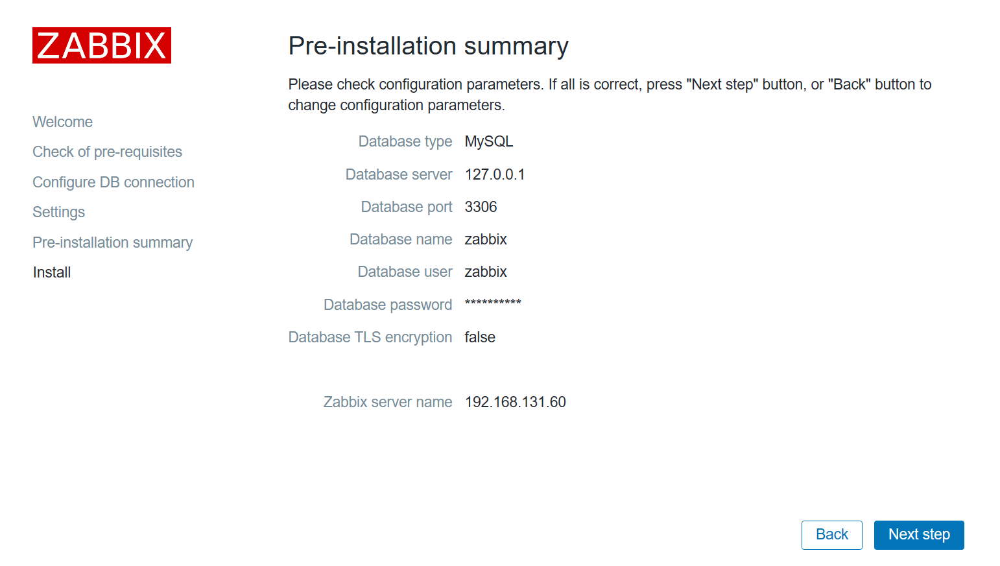

检查无误后就，点击finish就完成了zabbix server web的配置。

**6）登录**

默认用户名是Admin，默认密码是zabbix。

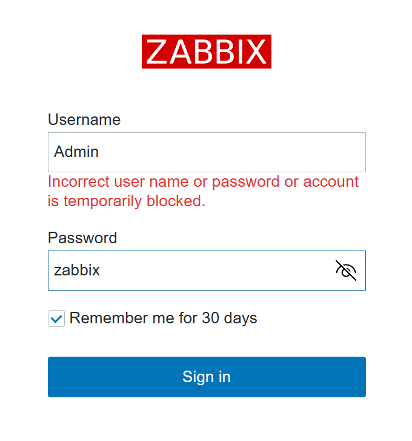

**7）进入web首页**

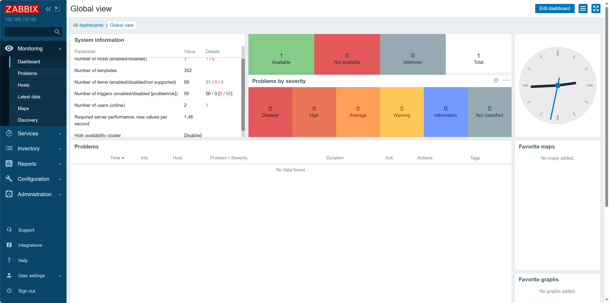

## 2.3 安装zabbix agent

在被监控的机器192.168.131.99上部署zabbix agent。

**1）创建用户和组**

```bash
[root@mysql001 tmp]# groupadd --system zabbix
[root@mysql001 tmp]# useradd --system -g zabbix -d /usr/lib/zabbix -s /sbin/nologin -c "Zabbix Monitoring System" zabbix
```

**2）解压并编译**

将server相同的的源码包上传到/tmp，进入路径解压。

```bash
[root@mysql001 tmp]# cd /usr/src
[root@mysql001 src]# tar -xf /tmp/zabbix-6.0.25.tar.gz
[root@mysql001 src]# ln -s zabbix-6.0.25 zabbix
[root@mysql001 src]# ls
debug  kernels  zabbix  zabbix-6.0.25
```

**3）编译安装**

```bash
[root@mysql001 src]# yum install gcc pcre-devel -y
[root@mysql001 src]# cd zabbix
[root@mysql001 zabbix]# ./configure --prefix=/usr/local/zabbix --enable-agent
[root@mysql001 zabbix]# make install
```

**4）修改agent配置文件**

```bash
LogFile=/tmp/zabbix_agentd.log
Server=192.168.131.60
ServerActive=127.0.0.1
Hostname=mysql001
```

配置说明：

- Server：被动模式下server的地址。被动模式下，zabbix server发送请求，agent发送数据。
- ServerActive：主动模式下server地址。主动模式下，agent会将采集到的数据主动发送给server。
- Hostname：被监控服务器的自定义名称。建议配置成有辨识度的name，例如主机名、ip地址、服务名等。

**4）配置服务管理脚本**

```bash
[root@mysql001 src]# cd zabbix/misc/init.d/fedora/core5/
[root@mysql001 core5]# vim zabbix_agentd
#修改
ZABBIX_BIN="/usr/local/zabbix/sbin/zabbix_agentd"
CONFIG_FILE="/usr/local/zabbix/etc/zabbix_agentd.conf"
daemon $ZABBIX_BIN -c $CONFIG_FILE
```
修改后的结果如下图：

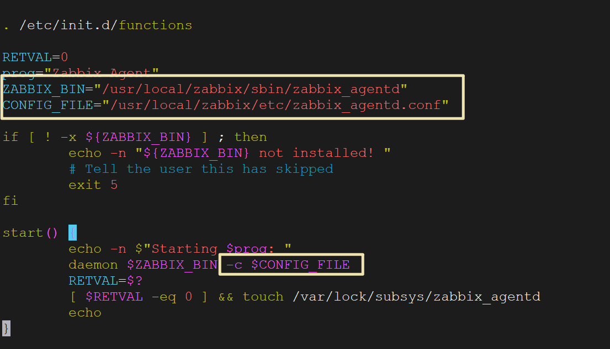

将启动脚本拷贝到/etc/init.d目录：

```bash
[root@mysql001 core5]# cp zabbix_agentd /etc/init.d/
```

设置开机自启：

```bash
[root@mysql001 core5]# chkconfig zabbix_agentd on
[root@mysql001 core5]# chkconfig --list
zabbix_agentd   0:off   1:off   2:on    3:on    4:on    5:on    6:off
```

**5）启动zabbix agent**

```bash
[root@mysql001 core5]# service zabbix_agentd start
Starting zabbix_agentd (via systemctl):                    [  OK  ]
```

查看服务状态：

```bash
[root@mysql001 core5]# service zabbix_agentd status
● zabbix_agentd.service - SYSV: Zabbix Monitoring Agent
   Loaded: loaded (/etc/rc.d/init.d/zabbix_agentd; bad; vendor preset: disabled)
   Active: active (running) since Thu 2024-01-25 00:50:36 CST; 2s ago
     Docs: man:systemd-sysv-generator(8)
  Process: 11784 ExecStart=/etc/rc.d/init.d/zabbix_agentd start (code=exited, status=0/SUCCESS)
 Main PID: 11792 (zabbix_agentd)
   CGroup: /system.slice/zabbix_agentd.service
           ├─11792 /usr/local/zabbix/sbin/zabbix_agentd -c /usr/local/zabbix/etc/zabbix_agentd.conf
           ├─11793 /usr/local/zabbix/sbin/zabbix_agentd: collector [idle 1 sec]
           ├─11794 /usr/local/zabbix/sbin/zabbix_agentd: listener #1 [waiting for connection]
           ├─11795 /usr/local/zabbix/sbin/zabbix_agentd: listener #2 [waiting for connection]
           ├─11796 /usr/local/zabbix/sbin/zabbix_agentd: listener #3 [waiting for connection]
           └─11797 /usr/local/zabbix/sbin/zabbix_agentd: active checks #1 [idle 1 sec]

Jan 25 00:50:36 mysql001 systemd[1]: Starting SYSV: Zabbix Monitoring Agent...
Jan 25 00:50:36 mysql001 zabbix_agentd[11784]: Starting Zabbix Agent: [  OK  ]
Jan 25 00:50:36 mysql001 systemd[1]: Started SYSV: Zabbix Monitoring Agent.
```

另一台192.168.131.100也用同样的方式部署zabbix agent。

# 3 常见问题解决

## 3.1 中文图形字段名乱码

问题呈现：

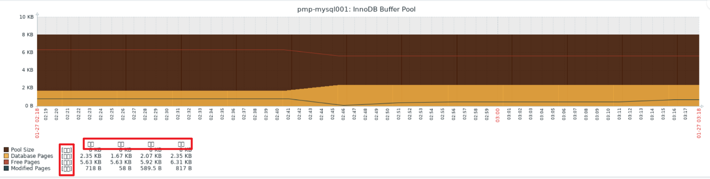

解决办法有两个，二选一即可。


**1）将web界面默认语言设置为英文**

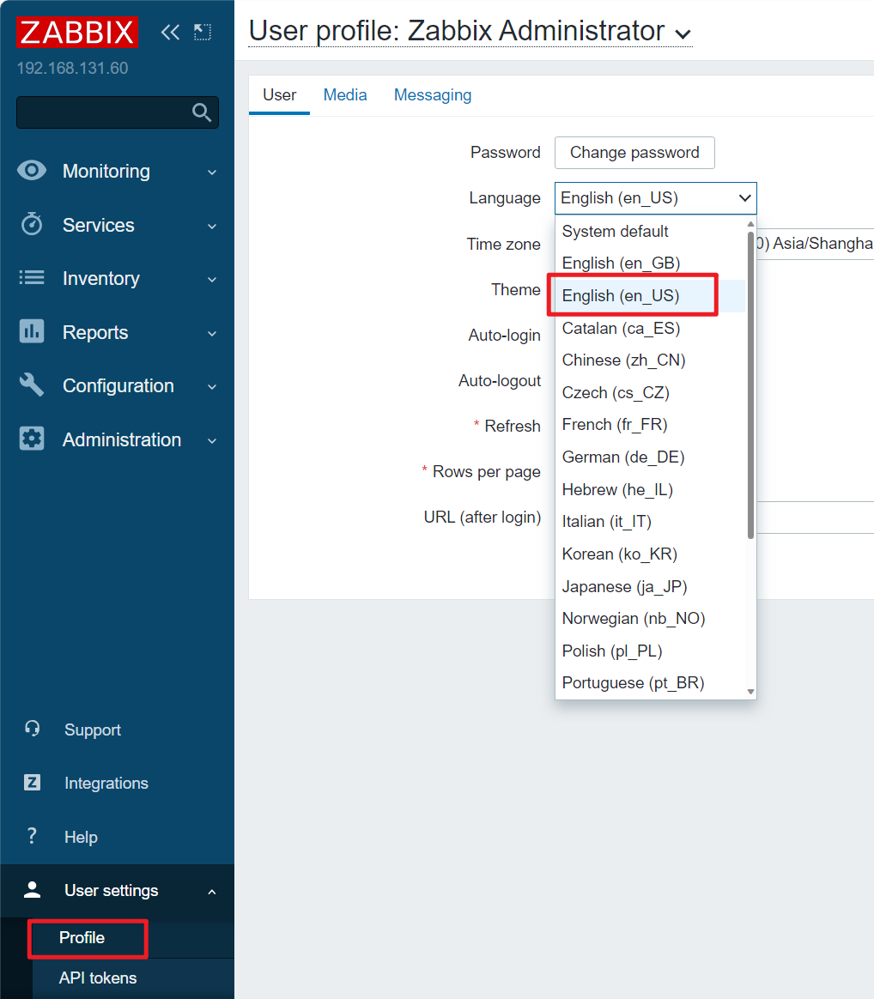

设置好后的效果如下：


**2）保留中文的解决办法**

有些朋友比较喜欢用中文界面，因此方法1的办法不适用，现在来看保留中文字体的解决办法。

乱码是由于zabbix的php文件的字体设置文件不支持中文，解决的思路就是更换php的字体设置文件。

在web侧的主机上进入到C:\Windows\Fonts目录，选择其中喜欢的一个字体文件，我个人比较喜欢微软雅黑：


复制到桌面：


然后将其中一个.ttc文件上传到zabbix server服务器上的httpd目录下：

```bash
[root@zabbix6 fonts]# find / -name fonts
/var/www/html/zabbix/assets/fonts
```

将.ttc文件上传到/var/www/html/zabbix/assets/fonts下。注意：可能每个人的安装路径不太一样，请根据实际情况操作。

上传后查看：

```bash
[root@zabbix6 fonts]# ls
DejaVuSans.ttf  msyh.ttc
```

将原本的.ttf文件备份，再将上传的文件重命名：

```bash
[root@zabbix6 fonts]# mv DejaVuSans.ttf DejaVuSans.ttf.bak
[root@zabbix6 fonts]# mv msyh.ttc DejaVuSans.ttf
```

最后重启zabbix server服务:

```bash
[root@zabbix6 fonts]# service zabbix_server restart
Restarting zabbix_server (via systemctl):                  [  OK  ]
[root@zabbix6 fonts]# service zabbix_server status
● zabbix_server.service - SYSV: Zabbix Monitoring Server
   Loaded: loaded (/etc/rc.d/init.d/zabbix_server; bad; vendor preset: disabled)
   Active: active (running) since Sat 2024-01-27 15:51:52 CST; 2s ago
     Docs: man:systemd-sysv-generator(8)
  Process: 20416 ExecStop=/etc/rc.d/init.d/zabbix_server stop (code=exited, status=0/SUCCESS)
  Process: 20436 ExecStart=/etc/rc.d/init.d/zabbix_server start (code=exited, status=0/SUCCESS)
 Main PID: 20446 (zabbix_server)
```

到web界面查看：

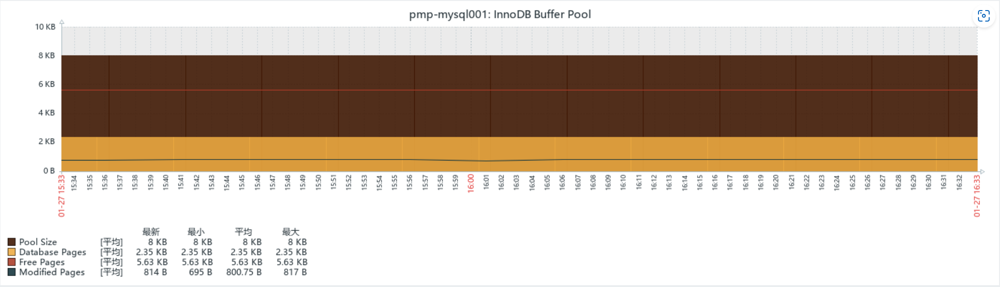

问题解决。