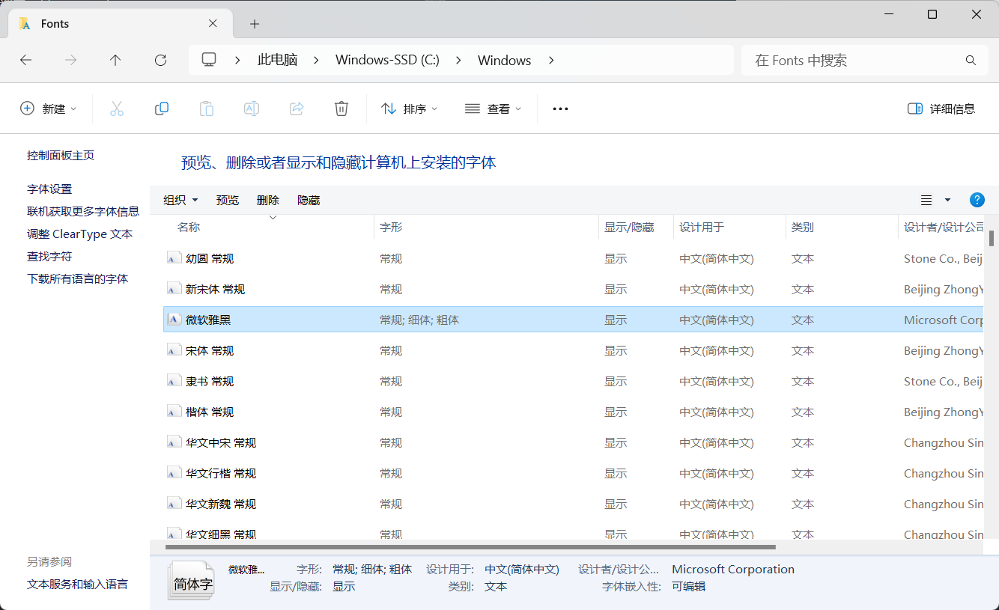
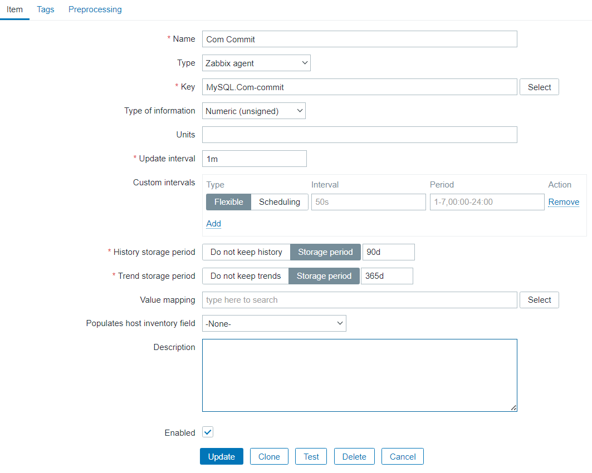
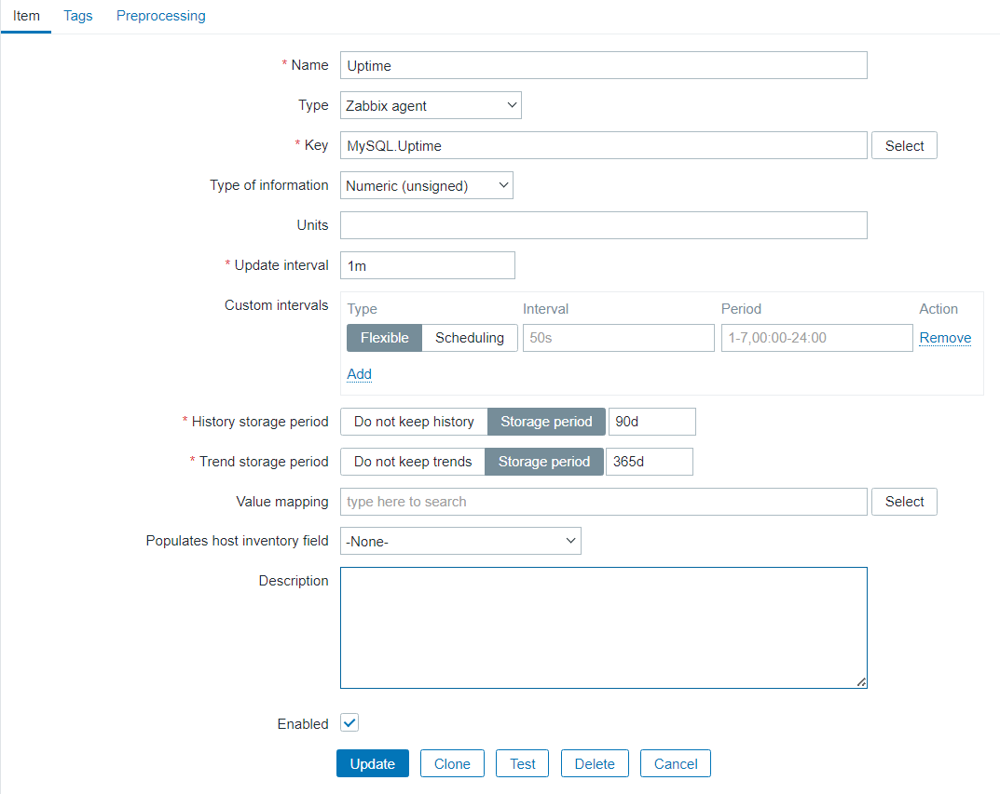

# 1 zabbix介绍

# 2 安装

## 2.1 安装zabbix server

**1）下载**

下载地址：https://www.zabbix.com/download_sources#60LTS

安装手册：https://www.zabbix.com/documentation/current/zh/manual/installation/install


LTS（Long-Term Support）是长期支持版。

**2）解压**

```bash
[root@zabbix6 tmp]# cd /usr/src/
[root@zabbix6 src]# tar xf /tmp/zabbix-6.0.25.tar.gz
[root@zabbix6 src]# ln -s zabbix-6.0.25 zabbix

[root@zabbix6 src]# ls
debug  kernels  zabbix  zabbix-6.0.25
```

**3）创建zabbix用户和组**

```bash
[root@zabbix6 src]# groupadd --system zabbix
[root@zabbix6 src]# useradd --system -g zabbix -d /usr/lib/zabbix -s /sbin/nologin -c "Zabbix Monitoring System" zabbix
```

**4）创建zabbix数据库**

我是用mysql8.0作为zabbix的数据库。mysql8.0数据库安装可参考文章：https://www.modb.pro/db/1749485672754925568。

```sql
mysql> select version();
+-----------+
| version() |
+-----------+
| 8.0.25    |
+-----------+
mysql> 
create database zabbix character set utf8mb4 collate utf8mb4_bin;
create user 'zabbix'@'%' identified with mysql_native_password by 'Zabbix123.';
grant all privileges on zabbix.* to 'zabbix'@'localhost';
SET GLOBAL log_bin_trust_function_creators = 1;
```

**5）初始化数据库**

脚本路径在/usr/src/zabbix/database/mysql。

```bash
[mysql@zabbix6 ~]$ cd /usr/src/zabbix/database/mysql
[mysql@zabbix6 mysql]$ ls
data.sql  double.sql  history_pk_prepare.sql  images.sql  Makefile.am  Makefile.in  schema.sql

#导入
[mysql@zabbix6 mysql]$ mysql -uzabbix -pZabbix123. zabbix < schema.sql
[mysql@zabbix6 mysql]$ mysql -uzabbix -pZabbix123. zabbix < images.sql
[mysql@zabbix6 mysql]$ mysql -uzabbix -pZabbix123. zabbix < data.sql
```

**6）编译安装zabbix server**

```bash
[root@zabbix6 zabbix]# yum install -y gcc mysql-devel libevent-devel libcurl-devel libxml2-devel net-snmp-devel
[root@zabbix6 lib]# cd /usr/src/zabbix
[root@zabbix6 zabbix]# ./configure --prefix=/usr/local/zabbix --enable-server --enable-agent --with-mysql=/usr/local/mysql/bin/mysql_config --enable-ipv6 --with-net-snmp --with-libcurl --with-libxml2
[root@zabbix6 zabbix]# make install
```

make编译报错：


解决办法：

```bash
[root@zabbix6 src]# find / -name libcrypto.so.1.1
/usr/local/mysql-8.0.25-linux-glibc2.12-x86_64/lib/private/libcrypto.so.1.1
[root@zabbix6 src]# ln -s /usr/local/mysql-8.0.25-linux-glibc2.12-x86_64/lib/private/libcrypto.so.1.1 /usr/lib
[root@zabbix6 src]# ln -s /usr/local/mysql-8.0.25-linux-glibc2.12-x86_64/lib/private/libssl.so.1.1 /usr/lib64
```

重新执行 make install

**7）修改配置文件**

**1.修改/usr/local/zabbix/etc/zabbix_server.conf**

主要是配置数据库相关的参数，包括数据库ip、数据库名、用户和密码。

```bash
LogFile=/tmp/zabbix_server.log
DBHost=127.0.0.1
DBName=zabbix
DBUser=zabbix
DBPassword=Zabbix123.
DBPort=3306
Timeout=4
LogSlowQueries=3000
StatsAllowedIP=127.0.0.1
```

**2.修改/usr/local/zabbix/etc/zabbix_agentd.conf**

```bash
LogFile=/tmp/zabbix_agentd.log
Server=127.0.0.1
ServerActive=127.0.0.1
Hostname=Zabbix server
```

**8）配置服务管理脚本**

**1.zabbix_server**

设置zabbix_server路径，设置配置文件路径和启动项指定配置文件。

```bash
[root@zabbix6 etc]# vim /usr/src/zabbix/misc/init.d/fedora/core5/zabbix_server
#修改
ZABBIX_BIN="/usr/local/zabbix/sbin/zabbix_server"
CONFIG_FILE="/usr/local/zabbix/etc/zabbix_server.conf"
daemon $ZABBIX_BIN -c $CONFIG_FILE
```

修改后配置如下：



移动到systemd目录下：

```bash
[root@zabbix6 etc]# cp /usr/src/zabbix/misc/init.d/fedora/core5/zabbix_server /etc/init.d/
```

**2.zabbix_agentd**

```bash
[root@zabbix6 etc]# vim /usr/src/zabbix/misc/init.d/fedora/core5/zabbix_agentd
#修改
ZABBIX_BIN="/usr/local/zabbix/sbin/zabbix_agentd"
CONFIG_FILE="/usr/local/zabbix/etc/zabbix_agentd.conf`"
daemon $ZABBIX_BIN -c $CONFIG_FILE
```

修改后配置如下：


移动到systemd目录下：

```bash
[root@zabbix6 etc]# cp /usr/src/zabbix/misc/init.d/fedora/core5/zabbix_agentd /etc/init.d/
```

**9）启动**

```bash
[root@zabbix6 ~]# service zabbix_server start
[root@zabbix6 ~]# service zabbix_agentd start
```

**设置开机自启**

```bash
[root@zabbix6 ~]# chkconfig zabbix_server on
[root@zabbix6 ~]# chkconfig zabbix_agentd on
[root@zabbix6 ~]# chkconfig --list
zabbix_agentd   0:off   1:off   2:on    3:on    4:on    5:on    6:off
zabbix_server   0:off   1:off   2:on    3:on    4:on    5:on    6:off
```

## 2.2 安装Web组件

**1）安装httpd和PHP**

```bash
[root@zabbix6 tmp]# wget ftp://ftp.pbone.net/mirror/ftp5.gwdg.de/pub/opensuse/repositories/home%3A/matthewdva%3A/build%3A/EPEL%3A/el7/RHEL_7/noarch/epel-release-7-9.noarch.rpm
[root@zabbix6 tmp]# wget ftp://ftp.pbone.net/mirror/repo.webtatic.com/yum/el7/webtatic-release.rpm
[root@zabbix6 tmp]# rpm -ivh epel-release-7-9.noarch.rpm
[root@zabbix6 tmp]# rpm -ivh webtatic-release.rpm
[root@zabbix6 tmp]# php -v
PHP 7.2.34 (cli) (built: Oct  1 2020 13:37:37) ( NTS )
```

**2）拷贝PHP文件至httpd根目录下**

```bash
[root@zabbix6 tmp]# mkdir -p /var/www/html/zabbix
[root@zabbix6 tmp]# cp -r /usr/src/zabbix/ui/* /var/www/html/zabbix/
[root@zabbix6 tmp]# chown -R apache.apache /var/www/html/
```

**3）修改PHP配置文件**

```bash
[root@zabbix6 ~]# vim /etc/php.ini
#修改
max_execution_time = 300
max_input_time = 300
memory_limit = 128M
post_max_size = 16M
upload_max_filesize = 2M
date.timezone = Asia/Shanghai
```

**4）启动httpd服务**

```bash
[root@zabbix6 ~]# systemctl start httpd
[root@zabbix6 ~]# systemctl status httpd
● httpd.service - The Apache HTTP Server
   Loaded: loaded (/usr/lib/systemd/system/httpd.service; disabled; vendor preset: disabled)
   Active: active (running) since Wed 2024-01-24 01:25:42 CST; 1s ago
     Docs: man:httpd(8)
           man:apachectl(8)
 Main PID: 21353 (httpd)
   Status: "Processing requests..."
   CGroup: /system.slice/httpd.service
           ├─21353 /usr/sbin/httpd -DFOREGROUND
           ├─21354 /usr/sbin/httpd -DFOREGROUND
           ├─21355 /usr/sbin/httpd -DFOREGROUND
           ├─21356 /usr/sbin/httpd -DFOREGROUND
           ├─21357 /usr/sbin/httpd -DFOREGROUND
           └─21358 /usr/sbin/httpd -DFOREGROUND

Jan 24 01:25:42 zabbix6.0 systemd[1]: Starting The Apache HTTP Server...
Jan 24 01:25:42 zabbix6.0 systemd[1]: Started The Apache HTTP Server.
```

设置开机自启：

```bash
[root@zabbix6 init.d]# chkconfig httpd start
```

## 2.4 配置Web页面

http://192.168.131.60/zabbix





```bash
[root@zabbix6 zabbix]# find / -name php.ini
/etc/php.ini
[root@zabbix6 zabbix]# vim /etc/php.ini
#修改
pdo_mysql.default_socket=/data/mysql/3306/data/mysql.sock
```




下一步点击finish就完成了。


## 2.3 安装zabbix agent


**5）初始化数据库**

脚本路径在/usr/src/zabbix/database/mysql。

```bash
mysql -uzabbix -pZabbix123. zabbix < schema.sql
```